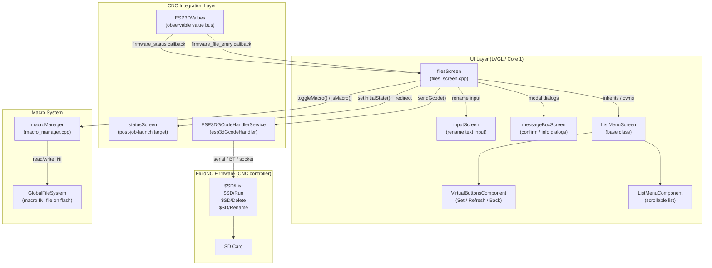
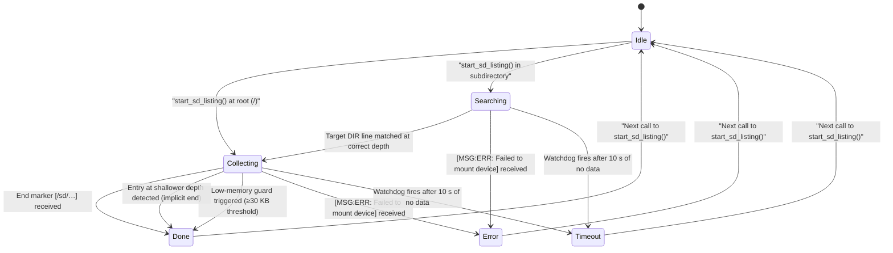
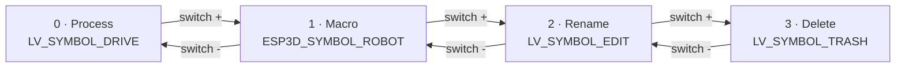
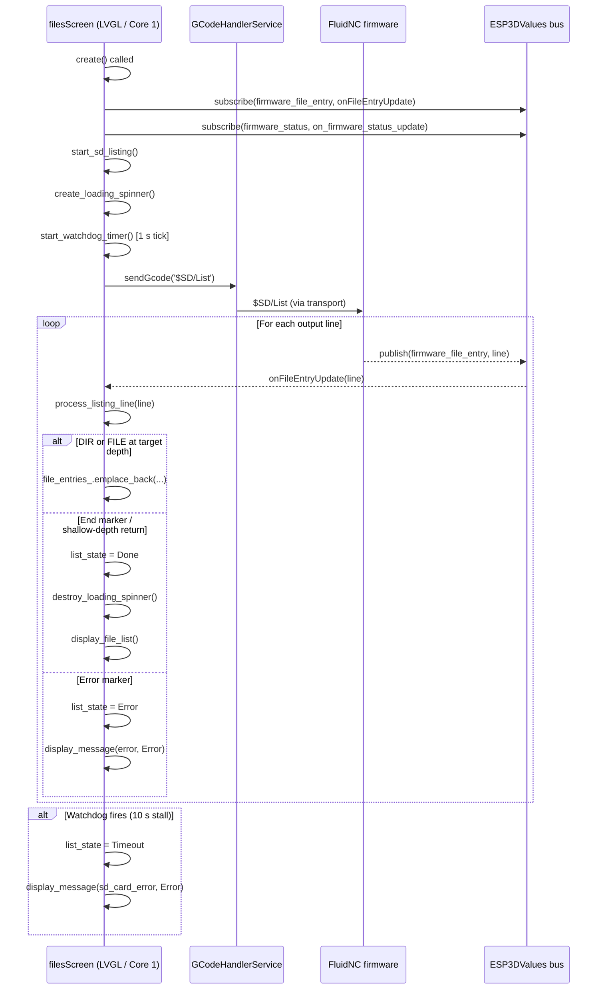
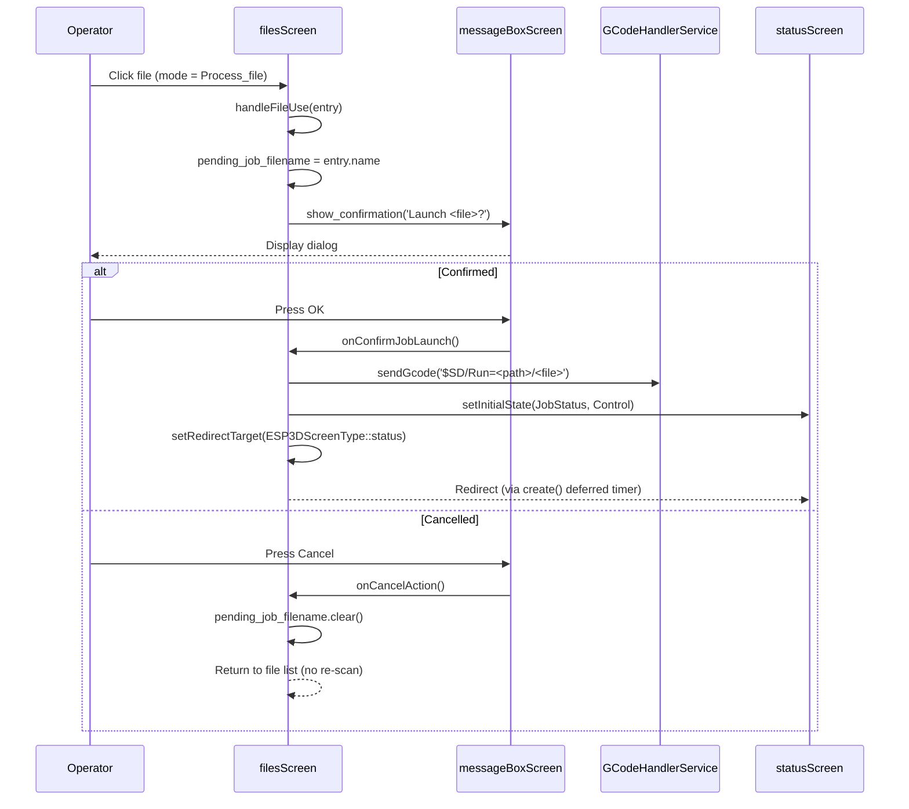
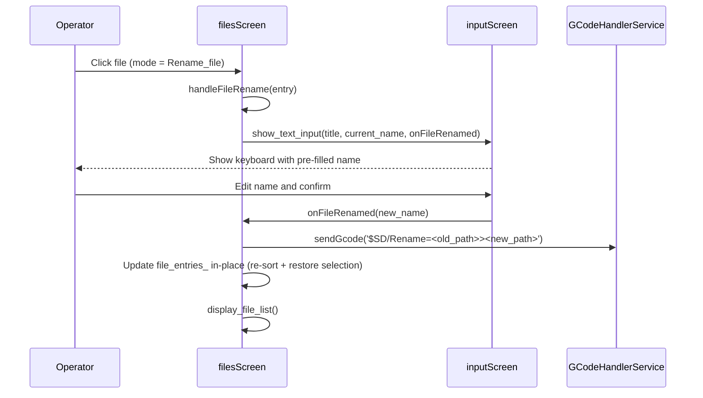
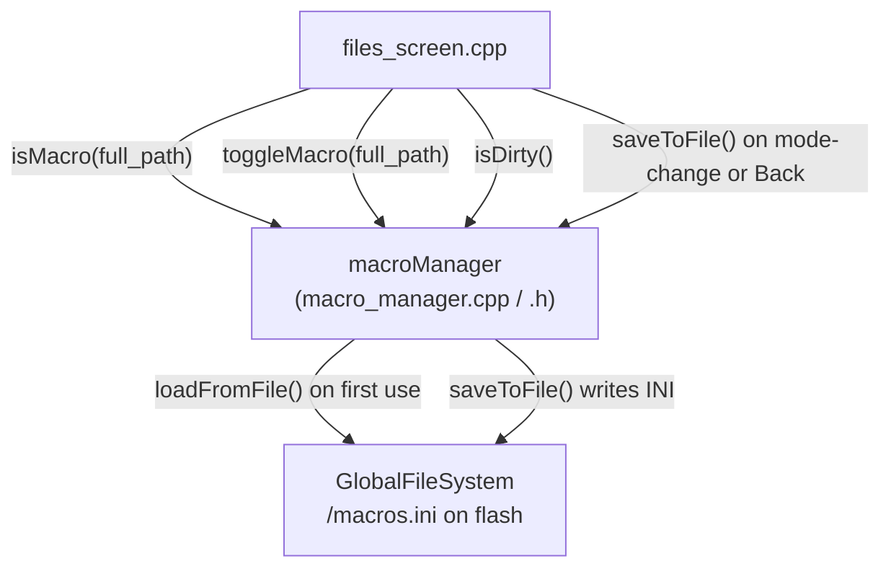
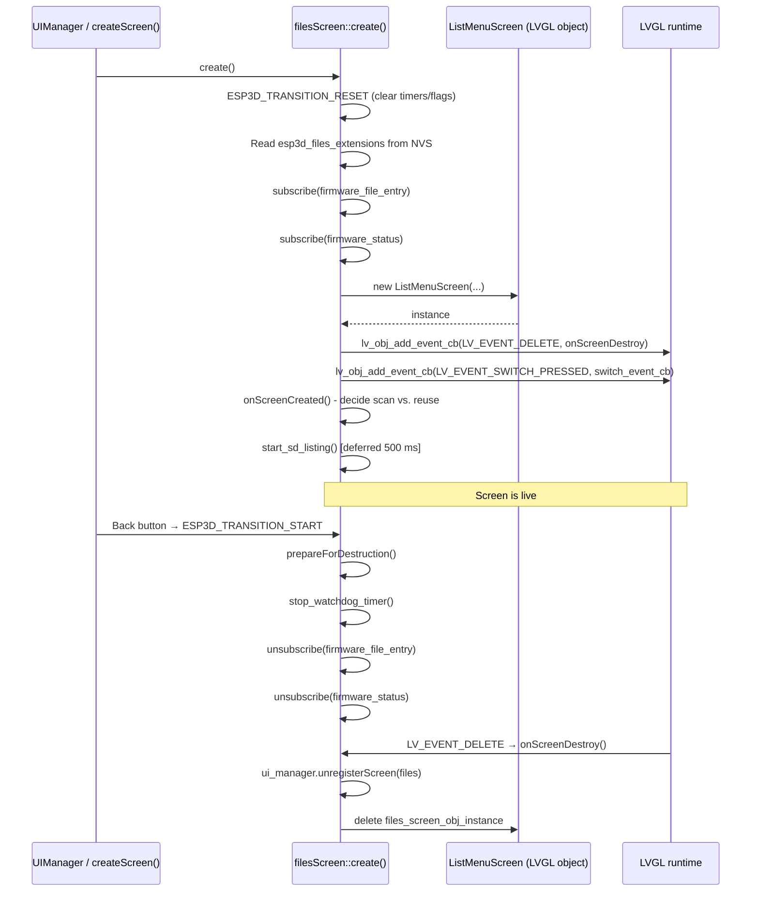
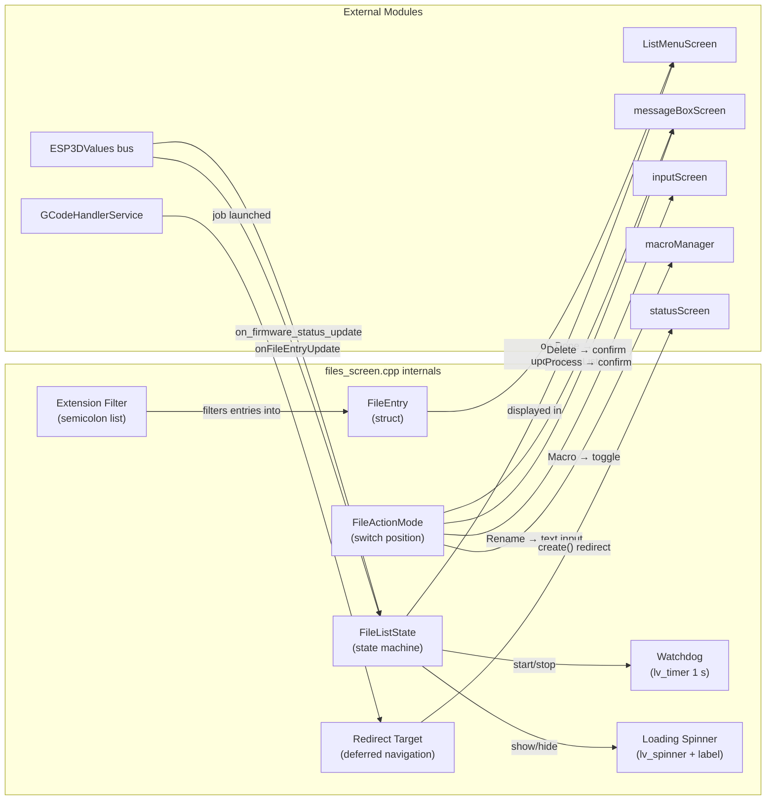

# FluidNC Module — Files Screen (`fluidnc_module_files`)

## Introduction

The **Files Screen** is the SD-card file browser for the FluidNC CNC firmware target. It allows the operator to navigate the SD card directory tree, launch GCode jobs, tag files as quick-access macros, rename files, and delete files — all without leaving the pendant UI. The screen is built on top of the shared [`ListMenuScreen`](UI_Framework_and_Screens.md) infrastructure and drives FluidNC through the [`GCode Host Service`](CNC_Firmware_Integration.md) via native FluidNC `$SD/…` commands.

**Source file:** `main/display/cnc/fluidnc/screens/files_screen.cpp`  
**Namespace:** `filesScreen`

---

## Architecture Overview



---

## Module Structure

Every board-level BSP and factory application is documented in [Board Support Packages](Board_Support_Packages.md). The files screen lives exclusively in the FluidNC UI target, as a sibling to the analogous screens in the grbl and grblHAL modules.

```
main/display/cnc/fluidnc/
├── components/
│   └── connection_status.h       ← ConnectionStatusComponent (shared widget)
└── screens/
    ├── files_screen.cpp          ← THIS MODULE
    ├── change_tool_screen.cpp    ← see fluidnc_module_change_tool.md
    └── probe_screen.cpp          ← see fluidnc_module_probe.md
```

---

## Core Data Structures

### `FileEntry`

Represents a single item in the SD card listing. Three constructors cover the different item categories:

```cpp
struct FileEntry {
    std::string name;   // Display name (filename or directory name)
    std::string size;   // Raw size string in bytes (empty for non-files)
    enum class Type : uint8_t {
        File,    // Regular GCode / text file
        Dir,     // Subdirectory
        Parent,  // ".." navigation entry
        Info,    // Placeholder message (e.g. "Loading…")
        Error    // Error message row (non-selectable)
    } type;
};
```

`Info` and `Error` rows are tagged as **non-selectable** via `ui_manager.tagListNodeNonSelectable()` so that encoder and touch navigation skip them automatically.

---

### `FileListState` — Asynchronous Listing State Machine

The SD listing is driven by FluidNC's `$SD/List` command, whose output arrives line-by-line through the value-bus callback `onFileEntryUpdate`. A state machine tracks progress:



| State | Meaning |
|---|---|
| `Idle` | No listing in progress |
| `Searching` | Scanning output to find the target subdirectory header |
| `Collecting` | Accumulating child entries at `target_depth` |
| `Done` | Collection complete; list handed to LVGL |
| `Error` | SD mount failure or firmware error |
| `Timeout` | Watchdog expired — no new entries for 10 s |

---

### `FileActionMode` — Multi-Mode File Interaction

A four-position virtual switch (hardware rotary switch or touch-emulated footer toggle) selects the action triggered when the operator clicks a file:



| Mode | Symbol | File | Directory | Parent |
|---|---|---|---|---|
| `Process_file` | `LV_SYMBOL_DRIVE` | Confirm → `$SD/Run=<path>` | Navigate into | Navigate up |
| `Set_as_macro` | `ESP3D_SYMBOL_ROBOT` | Show info + macro toggle | Error beep | Error beep |
| `Rename_file` | `LV_SYMBOL_EDIT` | Open `inputScreen` text input | Error beep | Error beep |
| `Delete_file` | `LV_SYMBOL_TRASH` | Confirm → `$SD/Delete=<path>` | Error beep | Error beep |

> **Note:** When macros are disabled in settings (`esp3d_macros_enabled = 0`), mode 1 degrades to a plain file-information dialog without the toggle action.

---

## Data Flow

### SD Card Listing Sequence



---

### File Operation Flow (Process mode)



---

### Rename Flow



---

## Key Subsystems

### Watchdog Timer

Protects against FluidNC not responding (SD removed, firmware hang):

| Parameter | Value |
|---|---|
| Interval | 1 000 ms |
| Stall threshold | 10 consecutive silent ticks → `Timeout` |
| On timeout | Spinner destroyed, error message displayed, buttons re-shown |

The stall counter resets whenever `total_entries_processed` increases, so any data flow — even slow — keeps the watchdog alive.

---

### Loading Spinner

A temporary `lv_spinner` widget with a status label (`"Processing: N"`) is overlaid on the list container while the listing is in progress. It is created by `create_loading_spinner()` and destroyed by `destroy_loading_spinner()` as part of the Done / Error / Timeout transitions. Both widgets use theme tokens (`ESP3D_SPINNER_*`, `ESP3D_ACCENT_ACTIVE_COLOR`) for visual consistency. See [UI Style Guide](https://github.com/luc-github/Pibot-cnc-pendant-firmware/blob/main/docs/ui_resources/ui_style_guide.md).

---

### Extension Filter

Only files whose extension (case-insensitive) appears in the `extensions` semicolon-delimited string are added to `file_entries_`. The value is read from NVS setting `esp3d_files_extensions` at screen creation time (default: `"gcode;gco;nc;tap;txt"`). Setting it to `"*"` disables filtering entirely.

```
extensions = "gcode;gco;nc;tap;txt"
           → ;gcode;gco;nc;tap;txt;   (wrapped with semicolons)
           → matches ";gco;" → accept "part.gco"
           → no match for ";stl;" → reject "model.stl"
```

---

### Macro Integration

The macro system is managed by [`macroManager`](cnc_shared.md) (shared across CNC firmware targets). The files screen integrates with it as follows:



- **Display**: Files tagged as macros show `ESP3D_SYMBOL_ROBOT` instead of `LV_SYMBOL_FILE` in the list.
- **Persistence**: The macro list is lazily saved — `saveToFile()` is called only when leaving macro mode (switch changes away from mode 1) or pressing Back with unsaved changes (`isDirty() == true`).

The Macro INI file format written by `macroManager::saveToFile()`:
```ini
[macro_0]
path=/jobs/start.gcode
desc=

[macro_1]
path=/jobs/finish.gcode
desc=
```

---

### Redirect Target Mechanism

After a successful job launch, the screen cannot destroy itself from within an LVGL callback. Instead it stores the target screen type and defers the transition:

```cpp
void setRedirectTarget(ESP3DScreenType target);  // called from onConfirmJobLaunch()
```

When `create()` is called next (by the screen rotation machinery), it detects a non-`none` redirect target, fires a one-shot LVGL timer with zero delay that calls `createScreen(deferred_target)`, and returns immediately — preventing the files screen from being re-created on top of the target.

---

### State Preservation Across Modal Dialogs

`prepareForDestruction()` intentionally **does not** clear `file_entries_`. The list persists in memory so that returning from a confirmation dialog (Confirm / Cancel) calls `display_file_list()` and rebuilds the view instantly without an SD re-scan. The list is discarded only when:

1. `start_sd_listing()` begins a new scan (Refresh button or directory navigation).
2. An SD error is detected in `on_firmware_status_update()` or `process_listing_line()`.

---

## Memory Safety

The files screen runs on a heavily resource-constrained ESP32. Several guards are applied throughout:

| Guard | Location | Action on failure |
|---|---|---|
| 30 KB free-heap minimum (`MIN_FREE_HEAP_BYTES`) | `process_listing_line()` (Collecting state) | Stop collection, display partial list |
| `std::bad_alloc` catch blocks | All `emplace_back` / `insert` calls | Log error, stop collection or leave list unchanged |
| `std::nothrow` new | `ListMenuScreen` construction in `create()` | Return without creating screen, previous screen preserved |
| `file_entries_modification_in_progress` flag | Concurrent modification detection | Declared `volatile`, prevents interleaved async updates |

See [ESP32 Memory Constraints Guide](https://github.com/luc-github/Pibot-cnc-pendant-firmware/blob/main/docs/guides/esp32_memory_constraints.md) for the broader allocation policy.

---

## Screen Lifecycle



### Timer Pair Pattern

Like all CNC screens, the files screen uses the standard two-timer pattern to avoid modifying LVGL objects from within an event callback:

| Timer | Purpose |
|---|---|
| `cleanup_timer` | Calls `prepareForDestruction()` then schedules `transition_timer` |
| `transition_timer` | Calls `createScreen(next_screen_target)` after `ESP3D_TRANSITION_SCREEN_DELAY_MS` |

For the full pattern specification see [Screen Transitions Flow](https://github.com/luc-github/Pibot-cnc-pendant-firmware/blob/main/docs/architecture/screen_transitions_flow.md).

---

## Virtual Buttons

| Index | Icon | Press | Release (short) | Release (long) |
|---|---|---|---|---|
| 0 | `ok_b` | — | Confirm selection (same as item click) | — |
| 1 | `refresh_b` | Selection beep | Clear list + `start_sd_listing()` | — |
| 2 | `back_b` | Back beep | Save macros if dirty → transition to `main` screen | — |

All three buttons are **hidden** during an active SD listing and **shown** again once the listing completes (Done, Error, or Timeout).

---

## FluidNC Command Reference

| Operation | Command sent | Response parsed |
|---|---|---|
| List SD card | `$SD/List` | `[DIR:name]`, `[FILE:name\|SIZE:n]`, `[/sd/…]`, `[MSG:ERR:…]` |
| Launch job | `$SD/Run=<full_path>` | Firmware status updates via `firmware_status` value |
| Delete file | `$SD/Delete=<full_path>` | Implicitly confirmed by absence of error |
| Rename file | `$SD/Rename=<old_path>><new_path>` | Implicitly confirmed by absence of error |

### Listing Output Format and Depth Parsing

FluidNC's `$SD/List` output uses the number of spaces after `:` to encode hierarchy depth. The parsing rules are:

- **DIR entries**: depth = number of spaces after `:`
- **FILE entries**: depth = (number of spaces after `:`) − 1

```
[DIR:subdir]                      ← depth 0  (no leading space)
[DIR: child]                      ← depth 1  (one leading space)
[FILE:  file.gco|SIZE:1024]       ← depth 1  (two leading spaces → depth 2-1=1)
[/sd/sd]                          ← end marker
```

The parser sets `target_depth` to the depth of the target directory's children. When a line arrives at a depth shallower than `target_depth`, collection is considered complete.

---

## Component Interactions Summary



---

## Related Documentation

| Topic | Documentation |
|---|---|
| UI base infrastructure & screen lifecycle | [UI_Framework_Screens.md](UI_Framework_and_Screens.md) |
| macroManager (shared CNC screens) | [cnc_shared.md](cnc_shared.md) |
| Change Tool screen (FluidNC) | [fluidnc_module_change_tool.md](fluidnc_module_change_tool.md) |
| Probe screen (FluidNC) | [fluidnc_module_probe.md](fluidnc_module_probe.md) |
| Connection status component | [fluidnc_module_connection_status.md](fluidnc_module_connection_status.md) |
| GCode Host & streaming architecture | [CNC_Firmware_Integration.md](CNC_Firmware_Integration.md) |
| Screen transition timer pattern | [screen_transitions_flow.md](https://github.com/luc-github/Pibot-cnc-pendant-firmware/blob/main/docs/architecture/screen_transitions_flow.md) |
| Theme tokens & LVGL style guide | [ui_style_guide.md](https://github.com/luc-github/Pibot-cnc-pendant-firmware/blob/main/docs/ui_resources/ui_style_guide.md) |
| ESP32 memory constraints | [esp32_memory_constraints.md](https://github.com/luc-github/Pibot-cnc-pendant-firmware/blob/main/docs/guides/esp32_memory_constraints.md) |


## Documents de conception (depot)

- [files_screen](https://github.com/luc-github/Pibot-cnc-pendant-firmware/blob/main/docs/ux_flows/fluidnc/files_screen.md)
