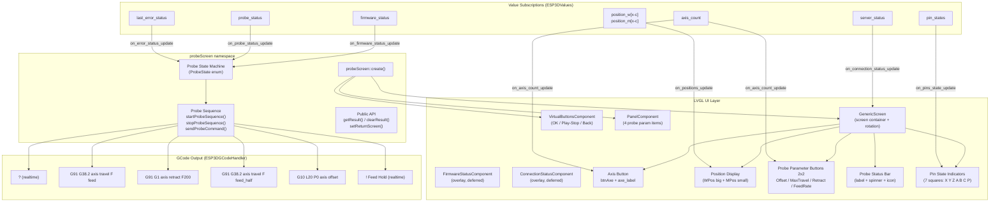
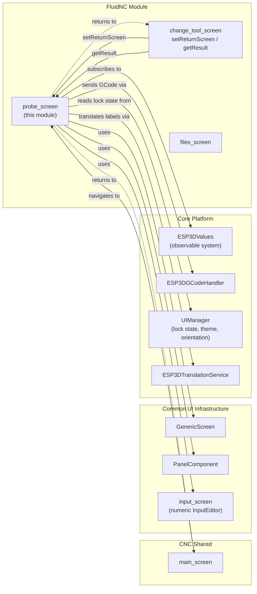
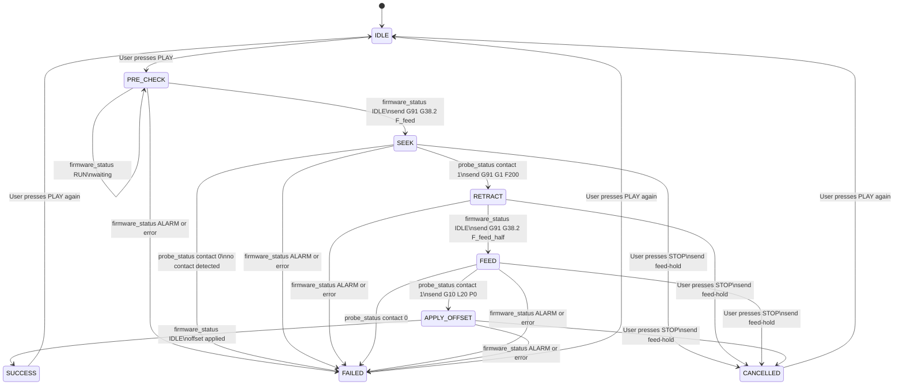
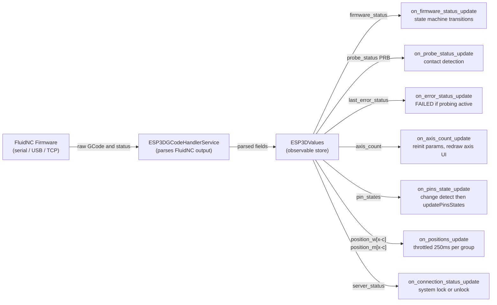
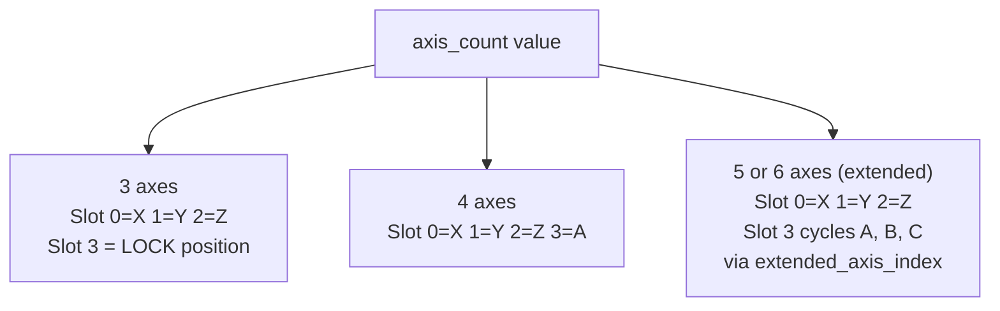
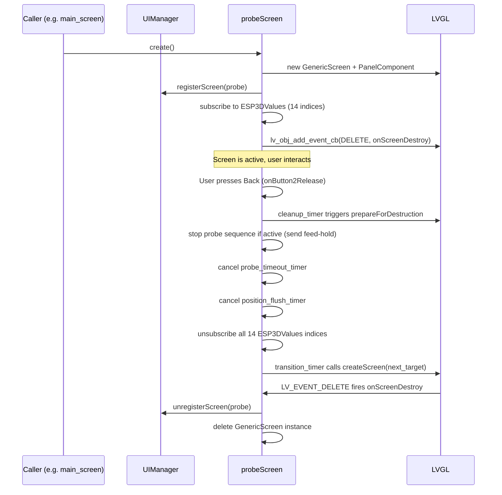
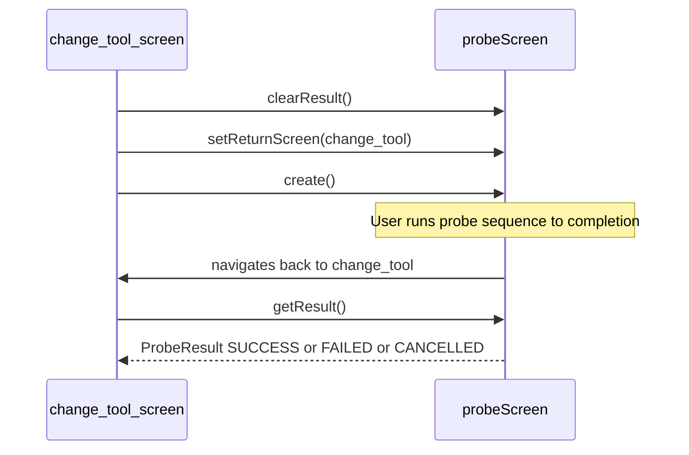

# FluidNC Module — Probe Screen

## Introduction

The **probe screen** is a FluidNC-specific UI screen that provides an interactive CNC probing interface on the pendant. It orchestrates full G38.2 probing cycles — fast seek, retract, precise feed, and work-coordinate-zero application — driven by a deterministic state machine that reacts to live firmware status and `[PRB:...]` messages from FluidNC.

The screen is implemented in `main/display/cnc/fluidnc/screens/probe_screen.cpp` under the `probeScreen` namespace and exposes a small public API for inter-screen communication.

Parallel probe screens exist for **grbl** and **grblHAL** targets (same structure, same GCode commands). This document covers only the FluidNC variant. For the shared CNC screen infrastructure see [fluidnc_module.md](fluidnc_module.md) and [UI_Framework_Screens.md](UI_Framework_and_Screens.md).

---

## Module Architecture



---

## Component Relationships



---

## Data Structures

### `ProbeAxisValues`

Holds the four user-configurable probe parameters **per axis**. Values are stored in a `std::map<uint32_t, ProbeAxisValues>` keyed by real axis index (0=X … 5=C) and are **preserved across axis selections** — user edits survive switching axes within the screen session.

| Field | Type | Default (X/Y) | Default (Z) | Default (A/B/C) | Description |
|---|---|---|---|---|---|
| `offset` | `float` (mm) | 0.0 | 10.0 | 0.0 | Work-coordinate offset applied via `G10 L20` after probing |
| `max_travel` | `float` (mm) | 30.0 | −50.0 | 360.0 | Maximum probe travel; negative = probe toward machine origin |
| `retract` | `float` (mm) | 5.0 | 3.0 | 10.0 | Retract distance after first contact (always positive) |
| `feed_rate` | `float` (mm/min) | 300.0 | 200.0 | 100.0 | Fast-seek feed rate; precise-feed uses half this value |

### `ProbeResult` (public)

Used for inter-screen communication. Declared in `probe_screen.h`.

```cpp
enum class ProbeResult : uint8_t {
    NONE      = 0,  // No probe performed / reset
    SUCCESS   = 1,  // Probe completed and offset applied
    FAILED    = 2,  // Error, alarm, or no contact
    CANCELLED = 3   // User pressed STOP
};
```

### `ProbeState` (internal)

Internal state machine enum controlling which GCode commands are sent and which firmware replies are expected.

| State | Description |
|---|---|
| `IDLE` | Ready, awaiting user action |
| `PRE_CHECK` | Status query sent (`?`), waiting for machine Idle confirmation |
| `SEEK` | Fast G38.2 probe in progress, waiting for `[PRB:...]` |
| `RETRACT` | Retract `G1` in progress, waiting for Idle |
| `FEED` | Slow precise G38.2 in progress, waiting for `[PRB:...]` |
| `APPLY_OFFSET` | `G10 L20` in progress, waiting for Idle |
| `SUCCESS` | Sequence complete, offset applied |
| `FAILED` | Any step produced an error, alarm, or no contact |
| `CANCELLED` | User pressed STOP, feed-hold sent |

---

## Probe Sequence State Machine



> **Timeout safety**: A one-shot LVGL timer is started at `startProbeSequence()`. Its duration is: `clamp((|max_travel| / feed_rate) × 60 × 1.5 + 5, 10, 120) seconds`. On expiry, feed-hold (`!`) is sent and the state transitions to `FAILED`.

---

## GCode Commands

| Probe Step | GCode Sent | Notes |
|---|---|---|
| `PRE_CHECK` | `?` (realtime) | Confirms machine is Idle before starting |
| `SEEK` | `G91 G38.2 {Axis}{max_travel} F{feed_rate}` | Fast probe pass; `max_travel` may be negative (e.g., Z down) |
| `RETRACT` | `G91 G1 {Axis}{±retract} F200` | Retract in opposite direction of `max_travel` sign |
| `FEED` | `G91 G38.2 {Axis}{max_travel} F{feed_rate/2}` | Slow precise probe |
| `APPLY_OFFSET` | `G10 L20 P0 {Axis}{offset}` | Set work-coordinate zero at probed position + offset |
| STOP / Timeout | `!` (realtime Feed Hold) | Sent on user cancel or safety timeout |

The axis letter is resolved from `ESP3DValuesIndex::axis_names` to correctly honor grblHAL `$376` UVW naming (e.g., `U`, `V`, `W` instead of `A`, `B`, `C`). FluidNC falls back to `XYZABC` when the field is absent.

---

## UI Layout

The screen uses a `GenericScreen` container with three zones:

```
┌──────────────────────────────────────────┐
│  [Axis label / lock icon]  WPos: 0.000   │
│                            MPos: 0.000   │
│  [O: 10.0]  [T: -50.0]                  │
│  [R:  3.0]  [F: 200  ]                  │
│  ──────────────────────────────────────  │
│  Probe status text...      [spinner/icon]│
│  X Y Z      A B C P  (pin indicators)   │
├──────────────────────────────────────────┤
│   [OK]         [Play/Stop]       [Back]  │
└──────────────────────────────────────────┘
```

- **Axis button** (`btnAxe`): shows the active axis letter or a lock icon. Tapping cycles axes in touch mode; hardware-switch mode uses physical position.
- **Position display**: two stacked labels — WPos (large font, work coordinates) and MPos (medium font, machine coordinates) for the selected axis.
- **Parameter buttons (2×2 grid)**: `O:` offset, `T:` max travel, `R:` retract, `F:` feed rate. All four are items in `PanelComponent` and are encoder-navigable.
- **Status bar**: a scrolling text label plus either a spinner (active states) or a colored icon (`ok_b` green = SUCCESS, `close_b` red = FAILED/CANCELLED).
- **Pin indicators**: 7 small square labels (X Y Z A B C P) that appear/hide based on active pin states from `[PRB:...]` and limit inputs; only pins up to `axis_count` are shown (P=probe pin is always visible).
- **Button 1 (center)**: icon swaps dynamically between `play_b` and `stop_b` to reflect the current probe state.

---

## Value Subscription Data Flow



### Performance Optimizations

| Layer | Mechanism | Detail |
|---|---|---|
| **Layer 2** — Pin states | String change detection | `last_known_pin_states[]` compared via `strcmp`; all 7 LVGL hide/show calls skipped when the string is unchanged (callbacks fire at 10 Hz) |
| **Layer 3** — Position display | Per-group timestamp throttle | Separate `last_wpos_display_update_ms` / `last_mpos_display_update_ms`; minimum interval 250 ms per group so both WPos and MPos callbacks are throttled independently |
| **Layer 3** — Position flush | `position_flush_timer` | Fires every 300 ms to apply any pending throttled update, ensuring no update is permanently lost |
| **Deferred overlays** | `lv_timer_create` at startup | `FirmwareStatusComponent` and `ConnectionStatusComponent` are created after `ESP3D_DEFERED_SCREEN_CREATION_DELAY_MS` to avoid blocking the initial screen paint |

---

## Multi-Axis Support

The screen supports 3 to 6 physical axes via `axis_count` (driven by `ESP3DValuesIndex::axis_count`):



**Touch mode** (`!ESP3D_HARDWARE_SWITCH_FEATURE`): tapping the axis label advances through **all** real axes in a loop (X→Y→Z→A→…→X). The lock position is not part of the touch cycle — locking is managed by the main screen.

**Hardware switch mode** (`ESP3D_HARDWARE_SWITCH_FEATURE`): the physical 4-position switch drives axis selection. The axis label button is only clickable when `axis_count > 4` and the switch is in slot 3, to cycle the extended axis (A/B/C).

Probe parameter values (offset, max_travel, retract, feed_rate) are stored per real axis index. `initializeProbeAxisValues()` only inserts **missing** entries — existing user edits are never overwritten.

---

## Screen Lifecycle and Cleanup



Destruction follows the standard `ESP3D_TRANSITION_*` macro pattern shared across all screens. `prepareForDestruction()` is guarded against double execution by `cleanup_executed_` and `is_prepared_for_destruction_` flags. If the probe sequence is active when destruction is triggered, a realtime feed-hold (`!`) is sent before unsubscribing.

---

## Public API

Declared in `main/display/cnc/fluidnc/screens/probe_screen.h`.

| Function | Signature | Description |
|---|---|---|
| `create` | `void create()` | Creates and loads the probe screen. Throws `std::runtime_error` on critical allocation failure (screen, PanelComponent). |
| `setReturnScreen` | `void setReturnScreen(ESP3DScreenType screen)` | Overrides the default return target (main screen). Must be called **before** `create()` if a custom caller needs to receive the result. Resets to default after each transition. |
| `clearResult` | `void clearResult()` | Resets `last_result` to `ProbeResult::NONE`. Should be called before navigating to the probe screen. |
| `getResult` | `ProbeResult getResult()` | Returns the outcome of the last completed probe sequence. |

### Typical Caller Flow (e.g., `change_tool_screen`)



---

## Dependencies

| Dependency | Role | Reference |
|---|---|---|
| `GenericScreen` | Host screen container, rotation, `VirtualButtonsComponent` | [UI_Framework_Screens.md](UI_Framework_and_Screens.md) |
| `PanelComponent` | Encoder-navigable list of the 4 probe parameter items | [UI_Framework_Screens.md](UI_Framework_and_Screens.md) |
| `FirmwareStatusComponent` | Overlay showing FluidNC machine state | [fluidnc_module.md](fluidnc_module.md) |
| `ConnectionStatusComponent` | Overlay showing transport connection state | [fluidnc_module_connection_status.md](fluidnc_module_connection_status.md) |
| `inputScreen` | Numeric `InputEditor` for editing probe parameters | [UI_Framework_Screens.md](UI_Framework_and_Screens.md) |
| `ESP3DValues` | Observable system — subscriptions drive all UI updates | [Core_Platform_Infrastructure.md](Core_Platform_and_Infrastructure.md) |
| `ESP3DGCodeHandlerService` | Sends G38.2 / G1 / G10 and realtime `?` / `!` commands | [CNC_Firmware_Integration.md](CNC_Firmware_Integration.md) |
| `UIManager` | Lock state (user + system), theme tokens, orientation angle | [UI_Framework_Screens.md](UI_Framework_and_Screens.md) |
| `ESP3DTranslationService` | All user-visible strings (step labels, error messages) | [Core_Platform_Infrastructure.md](Core_Platform_and_Infrastructure.md) |
| `esp_timer` | High-resolution monotonic clock for position throttle timestamps | ESP-IDF built-in |

---

## Key Implementation Notes

- **No `std::string` in hot-path formatting**: probe parameter display values are formatted into fixed-size `char buffer[32]` with `snprintf`, avoiding heap allocation in high-frequency paths.
- **`std::map` for probe values**: acceptable because the map is accessed only during user interaction (axis selection, parameter edits, sequence start), never inside a high-frequency subscription callback.
- **No throw from LVGL timer callbacks**: deferred overlay creation uses `new (std::nothrow)` and logs errors rather than throwing; an uncaught exception inside an LVGL timer callback would invoke `std::terminate` and reset the board.
- **Axis letter resolution at call time**: `getAxisLetter()` reads `ESP3DValuesIndex::axis_names` on each call (not cached) to correctly reflect grblHAL `$376` UVW naming throughout the session without requiring a re-render on setting changes.
- **Focus persistence through InputEditor round-trip**: `saved_focus_item_id` stores the item being edited before navigating to `input_screen`. On screen re-creation (return from InputEditor), `panel_component->setFocusedItem(saved_focus_item_id)` restores the visual highlight immediately.
- **Dual-callback state machine**: `firmware_status` drives phase transitions (detecting Idle between steps), while `probe_status` confirms or denies physical contact within SEEK and FEED phases. Both callbacks are required; neither alone is sufficient to advance the sequence correctly.
- **Lock visual feedback**: when `UIManager::getLockState()` is `true`, all interactive elements (parameter buttons, position labels, panel items) receive `LV_OPA_30` and `LV_STATE_DISABLED`. The `VirtualButtonsComponent` re-renders with lock-aware styles. Locking is triggered by either the hardware switch position 3 (≤ 3-axis mode) or a non-connected transport (`server_status != "C"`).


## Documents de conception (depot)

- [probe_screen](https://github.com/luc-github/Pibot-cnc-pendant-firmware/blob/main/docs/ux_flows/fluidnc/probe_screen.md)
