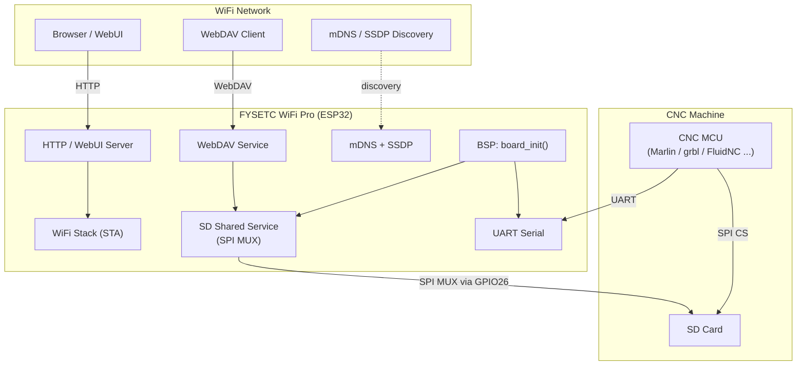
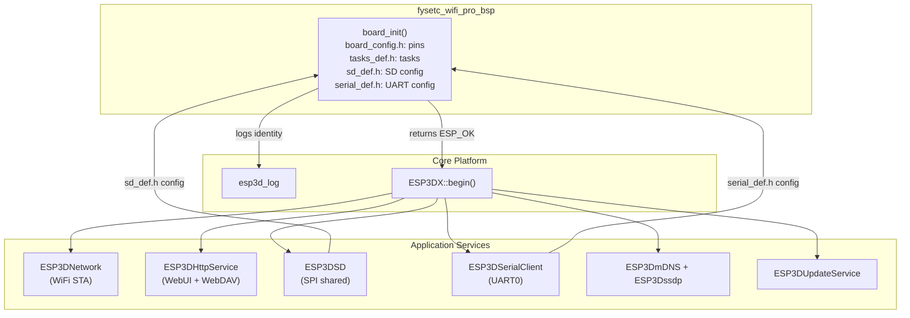
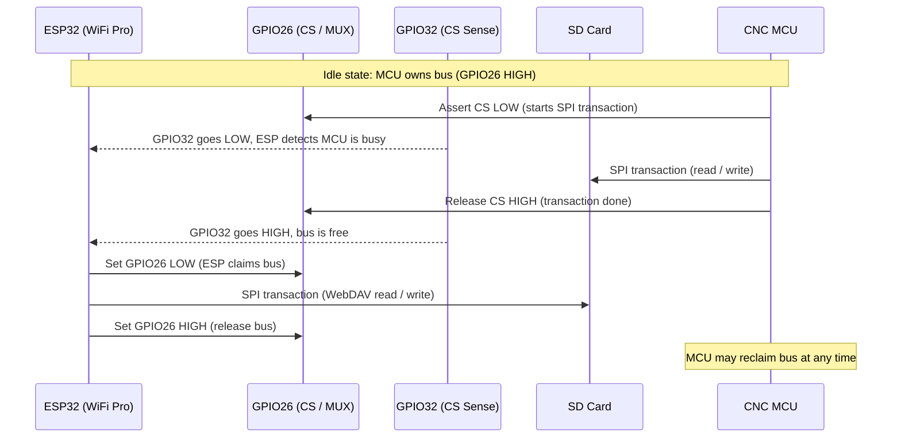
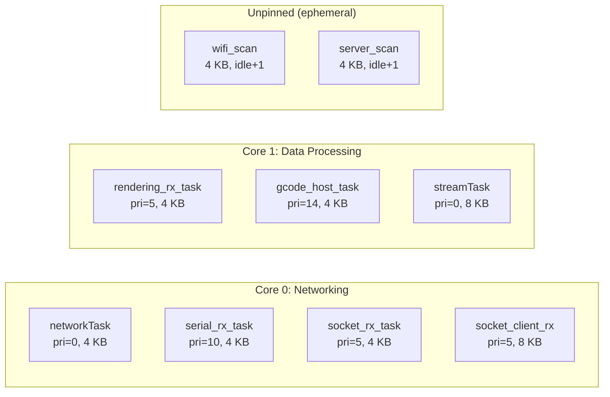
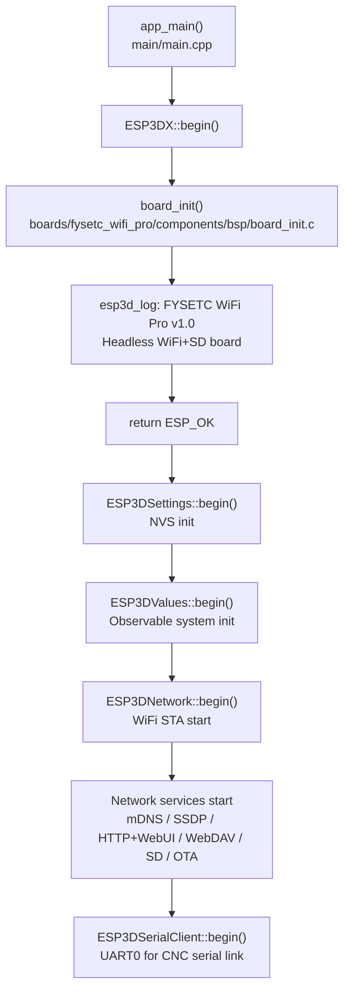

# FYSETC WiFi Pro — Board Support Package (BSP)

## Introduction

The `fysetc_wifi_pro_bsp` module is the Board Support Package for the **FYSETC WiFi Pro** board. Unlike every other supported board in this project, the FYSETC WiFi Pro is a **headless WiFi + SD bridge**: it has no display, no touch screen, and no physical input controls. Its sole purpose is to give a CNC machine wireless connectivity by sharing the machine's SD card slot over WiFi (WebUI, WebDAV, mDNS, SSDP).

Because there is no display hardware, this BSP is the smallest in the codebase — `board_init()` simply logs the board identity and returns `ESP_OK`. All the complexity lives in the hardware pin layout, the SD multiplexing scheme, and the WiFi-focused sdkconfig tuning.

---

## Board Overview

| Property              | Value                                        |
|-----------------------|----------------------------------------------|
| **MCU**               | ESP32 (Xtensa LX6 dual-core, 240 MHz)        |
| **Flash**             | 4 MB (DIO, 80 MHz)                           |
| **PSRAM**             | None                                         |
| **Display**           | None                                         |
| **Touch**             | None                                         |
| **Hardware input**    | None (no buttons, encoder, potentiometer)    |
| **Connectivity**      | WiFi (STA + fallback), UART (console/serial) |
| **Storage**           | SD card via SPI (shared with CNC MCU)        |
| **Default hostname**  | `FYSETC-WIFI-PRO`                            |
| **Board identifier**  | `FYSETC_WIFI_PRO`                            |
| **Version**           | v1.0                                         |

---

## Architecture

### System Context

The FYSETC WiFi Pro sits between a CNC machine and the user's WiFi network. It physically plugs into the CNC machine's SD card socket and multiplexes the SPI SD bus between itself and the CNC MCU.



### Module Architecture



---

## BSP File Structure

```
boards/fysetc_wifi_pro/
├── board_config.cmake          # CMake board selection & capability flags
├── flash_params.json           # esptool flash parameters
├── partitions_4mb.csv          # Custom partition table
├── sdkconfig.4mb.wifi          # IDF sdkconfig defaults
├── build_scripts/
│   ├── build_one.py            # Single-variant build entry point
│   ├── common.py               # Shared build/check helpers
│   └── variants.py             # Variant definitions (VARIANTS dict)
└── components/
    └── bsp/
        ├── CMakeLists.txt      # IDF component registration
        ├── board_init.h        # Public API: board_init, board_get_name/version
        ├── board_init.c        # Implementation (minimal: logs and returns)
        ├── board_config.h      # GPIO assignments, UART, SD pin config
        ├── sd_def.h            # esp3dSdConfig struct (SPI mode)
        ├── serial_def.h        # esp3dSerialConfig extern declaration
        └── tasks_def.h         # FreeRTOS task sizes, priorities, cores
```

---

## BSP Public API

### `board_init.h`

```c
esp_err_t   board_init(void);        // Initialize board hardware
const char *board_get_name(void);    // Returns "FYSETC WiFi Pro"
const char *board_get_version(void); // Returns "v1.0"
```

`board_init()` is the only mandatory entry point called by `ESP3DX::begin()`. On this board it is intentionally minimal: it logs the board name and version and returns `ESP_OK` immediately. There is no display, LVGL, touch, or hardware control subsystem to initialize.

> **Why so minimal?**
> Every other board in this project initializes LVGL, its display driver, and a touch controller inside `board_init()`. The FYSETC WiFi Pro has none of those peripherals, so the function is a no-op beyond identification logging. All real initialization is handled by the application layer (`ESP3DX::begin()`).

### Display stubs (`#if ESP3D_DISPLAY_FEATURE`)

`board_init.h` guards `get_lvgl_display()` and `get_lvgl_lock()` stubs behind the `ESP3D_DISPLAY_FEATURE` compile flag. That flag is always `OFF` for this board (forced in `board_config.cmake`), so these stubs are never compiled in production.

---

## Hardware Configuration (`board_config.h`)

### UART (Console / Serial CNC Link)

| Symbol                  | Value           | Description                   |
|-------------------------|-----------------|-------------------------------|
| `UART_TX_PIN`           | GPIO_NUM_1      | Transmit                      |
| `UART_RX_PIN`           | GPIO_NUM_3      | Receive                       |
| `UART_PORT_IDX`         | UART_NUM_0      | Hardware UART port            |
| `UART_BAUD_RATE_BPS`    | 115200          | Default baud rate             |
| `UART_RX_BUFFER_SIZE`   | 512 bytes       | Hardware RX ring buffer       |
| `UART_TX_BUFFER_SIZE`   | 0 (unbuffered)  | Writes are synchronous        |
| `UART_RX_FLUSH_TIMEOUT` | 1500 ms         | RX idle flush timeout         |

### SD Card SPI

| Symbol                  | Value        | Description                           |
|-------------------------|--------------|---------------------------------------|
| `SD_MISO_PIN`           | GPIO_NUM_2   | SPI MISO (D0)                         |
| `SD_MOSI_PIN`           | GPIO_NUM_15  | SPI MOSI (CMD)                        |
| `SD_CLK_PIN`            | GPIO_NUM_14  | SPI Clock (CLK)                       |
| `SD_CS_PIN`             | GPIO_NUM_26  | SPI Chip Select / **MUX select line** |
| `SD_SPI_HOST_IDX`       | SPI2_HOST    | ESP-IDF SPI host                      |
| `SD_SPI_FREQ_HZ`        | 20 MHz       | SPI clock frequency                   |
| `SD_MAX_TRANSFER_SIZE`  | 4096 bytes   | DMA transfer limit                    |
| `SD_ALLOCATION_SIZE`    | 4096 bytes   | FatFS cluster allocation unit         |

### SD Shared Bus (MUX)

The FYSETC WiFi Pro uses a **software multiplexing** scheme to share the SD card between the ESP32 and the CNC MCU. There is no discrete MUX IC — the CS line itself acts as the bus arbiter.

| Symbol                       | Value       | Description                                        |
|------------------------------|-------------|----------------------------------------------------|
| `SD_SHARED_MUX_PIN`          | GPIO_NUM_26 | Same as CS — drives MUX select                     |
| `SD_SHARED_MUX_ESP_VALUE`    | LOW (0)     | ESP32 owns the SD bus                              |
| `SD_SHARED_MUX_IDLE_VALUE`   | HIGH (1)    | CNC MCU owns the SD bus (ESP32 idles)              |
| `SD_SHARED_SWITCH_DELAY_MS`  | 10 ms       | Settling delay after MUX switch                    |
| `SD_WATCHDOG_MS`             | 300 000 ms  | Max hold time before forced release                |
| `SD_CS_SENSE_PIN`            | GPIO_NUM_32 | Senses CNC MCU CS activity — LOW means MCU is busy |
| `SD_CS_SENSE_ACTIVE_VALUE`   | LOW (0)     | Indicates MCU is actively driving the SD CS line   |
| `SD_POWER_PIN`               | GPIO_NUM_27 | SD card power control                              |
| `SD_POWER_ACTIVE_VALUE`      | LOW (0)     | LOW = SD powered on                                |
| `SD_SHARED_D1_PIN`           | GPIO_NUM_4  | SDIO D1 isolation (INPUT_PULLUP when MCU owns bus) |
| `SD_SHARED_D2_PIN`           | GPIO_NUM_12 | SDIO D2 isolation (INPUT_PULLUP when MCU owns bus) |

> For the full shared SD arbitration state machine and ownership protocol, see [shared_sd_mechanism_V2.0.md](https://github.com/luc-github/Pibot-cnc-pendant-firmware/blob/main/docs/architecture/shared_sd_mechanism_V2.0.md).

---

## SD Shared Bus — Data Flow



---

## Comparison with Display Boards

This BSP is intentionally stripped compared to all other boards in the project. The table below contrasts it against a typical display board (e.g., `pibot_pendant_v1_0_bsp`):

| BSP Capability                   | FYSETC WiFi Pro | Display Boards (typical) |
|----------------------------------|:---------------:|:------------------------:|
| `board_init()`                   | ✓               | ✓                        |
| `init_lvgl()`                    | —               | ✓                        |
| `lvgl_flush_cb()`                | —               | ✓                        |
| `notify_lvgl_flush_ready()`      | —               | ✓ (SPI display boards)   |
| `disp_on_vsync_event()`          | —               | ✓ (RGB display boards)   |
| `increase_lvgl_tick()`           | —               | ✓                        |
| `init_touch_controller()`        | —               | ✓                        |
| `touch_read_cb()`                | —               | ✓                        |
| `button_read_cb()`               | —               | ✓ (pibot only)           |
| `encoder_read_cb()`              | —               | ✓ (pibot only)           |
| `potentiometer_read_cb()`        | —               | ✓ (pibot only)           |
| `control_event_t`                | —               | ✓                        |
| `control_events_init()`          | —               | ✓                        |
| SD card (SPI, shared MUX)        | ✓               | Optional (some boards)   |
| Factory app                      | —               | ✓ (most boards)          |
| Custom bootloader                | —               | ✓ (pibot, cam boards)    |
| `TFT_UI_SERVICE`                 | OFF (forced)    | ON                       |
| `TFT_TOUCH_SERVICE`              | OFF (forced)    | ON                       |
| `BUZZER_SERVICE`                 | OFF (forced)    | Optional                 |
| `WIFI_SERVICE`                   | ON              | Optional                 |

The UI system, LVGL task, and display driver documentation are **not applicable** to this board. See [screens_architecture.md](https://github.com/luc-github/Pibot-cnc-pendant-firmware/blob/main/docs/architecture/screens_architecture.md) and [display_drivers.md](https://github.com/luc-github/Pibot-cnc-pendant-firmware/blob/main/docs/architecture/display_drivers.md) for those systems.

---

## Build System

### CMake Board Selection (`board_config.cmake`)

When `FYSETC_WIFI_PRO=ON` is passed to CMake:

- Target is locked to `esp32`.
- `MEMORY_4_MB=ON` is **required** — any other memory size triggers a fatal CMake error.
- `TFT_UI_SERVICE`, `TFT_TOUCH_SERVICE`, and `BUZZER_SERVICE` are **force-set to OFF**.
- `SD_CARD_SERVICE` and `SD_SHARED_SERVICE` are **force-set to ON**.
- All hardware input flags (`HARDWARE_BUTTONS`, `HARDWARE_ENCODER`, `HARDWARE_SWITCH`, `HARDWARE_POTENTIOMETER`) are set to OFF.
- Compile-time defines: `-DESP3D_HOSTNAME="FYSETC-WIFI-PRO"`, `-DESP3D_FALLBACK_MODE="1"`.

### IDF Component (`components/bsp/CMakeLists.txt`)

The BSP component has minimal dependencies — no display drivers, no LVGL, no touch libraries:

```
Requires: esp_timer, esp3d_log, nvs_flash, driver
Sources:  board_init.c
```

### Build Variants (`build_scripts/variants.py`)

There is **one production variant** and **no factory variant** for this board:

| Variant name         | Description                                                                |
|----------------------|----------------------------------------------------------------------------|
| `4mb_wifi_generic`   | Full WiFi bridge: Serial + WiFi + mDNS + SSDP + WebUI + WebDAV + SD + OTA |

```
Build output: build/fysetc_4mb_wifi_generic/
```

**Features enabled in `4mb_wifi_generic`:**

```
FYSETC_WIFI_PRO=ON    MEMORY_4_MB=ON       TARGET_FW_NONE=ON
SERIAL_SERVICE=ON     WIFI_SERVICE=ON
MDNS_SERVICE=ON       SSDP_SERVICE=ON      TIME_SERVICE=ON
WEB_SERVICES=ON       WEBUI_SERVER=ON      WEBDAV_SERVICES=ON
SD_CARD_SERVICE=ON    SD_SHARED_SERVICE=ON
UPDATE_SERVICE=ON
```

> **`TARGET_FW_NONE`** means the firmware does not parse CNC-specific responses (no position tracking, no GCode host state machine). The board acts purely as a transparent WiFi SD bridge with a WebUI. See [gcode_host_architecture.md](https://github.com/luc-github/Pibot-cnc-pendant-firmware/blob/main/docs/architecture/gcode_host_architecture.md) for when a CNC firmware target is active.

### Building

```bash
# Using the board build script (from repo root):
python boards/fysetc_wifi_pro/build_scripts/build_one.py 4mb_wifi_generic

# With options:
python boards/fysetc_wifi_pro/build_scripts/build_one.py 4mb_wifi_generic --clean
python boards/fysetc_wifi_pro/build_scripts/build_one.py 4mb_wifi_generic --check

# Or directly via idf.py from repo root:
idf.py -DFYSETC_WIFI_PRO=ON -DMEMORY_4_MB=ON \
       -DTARGET_FW_NONE=ON -DWIFI_SERVICE=ON \
       -DWEBUI_SERVER=ON -DWEBDAV_SERVICES=ON \
       -DSD_CARD_SERVICE=ON -DSD_SHARED_SERVICE=ON \
       build

idf.py flash monitor
```

---

## Partition Layout

The 4 MB flash uses a custom partition table. The bootloader is extended to 48 KB (partition table starts at offset `0xC000`) to accommodate the IDF 5.x bootloader size:

| Name      | Type | SubType | Offset    | Size    | Purpose                        |
|-----------|------|---------|-----------|---------|--------------------------------|
| nvs       | data | nvs     | 0x00D000  | 12 KB   | ESP3D settings (NVS)           |
| otadata   | data | ota     | 0x010000  | 8 KB    | OTA slot selection             |
| app0      | app  | ota_0   | 0x020000  | 3 MB    | Main application               |
| flashfs   | data | spiffs  | 0x320000  | 576 KB  | WebUI + config files (SPIFFS)  |

```
0x00000  ┌──────────────────────────────┐
         │  Bootloader  (48 KB)         │
0x0C000  ├──────────────────────────────┤
         │  Partition Table             │
0x0D000  ├──────────────────────────────┤
         │  nvs  (12 KB)                │
0x10000  ├──────────────────────────────┤
         │  otadata  (8 KB)             │
0x20000  ├──────────────────────────────┤
         │                              │
         │  app0 / ota_0  (3 MB)        │
         │                              │
0x320000 ├──────────────────────────────┤
         │  flashfs / SPIFFS  (576 KB)  │
0x400000 └──────────────────────────────┘
```

> **Important:** `CONFIG_PARTITION_TABLE_OFFSET=0xC000` must be set in sdkconfig. It is pre-configured in `sdkconfig.4mb.wifi` and applied automatically on a fresh build.

---

## FreeRTOS Task Layout

> **No LVGL task.** This board runs no UI task. Both cores are fully available for networking and data processing.

| Task                          | Stack    | Core | Priority | Config symbol group       |
|-------------------------------|----------|------|----------|---------------------------|
| `networkTask`                 | 4 096 B  | 0    | 0        | `NETWORK_*`               |
| `esp3d_serial_rx_task`        | 4 096 B  | 0    | 10       | `UART_*`                  |
| `esp3d_socket_rx_task`        | 4 096 B  | 0    | 5        | `ESP3D_SOCKET_*`          |
| `esp3d_socket_client_rx`      | 8 192 B  | 0    | 5        | `ESP3D_SOCKET_CLIENT_*`   |
| `esp3d_rendering_rx_task`     | 4 096 B  | 1    | 5        | `ESP3D_RENDERING_*`       |
| `esp3d_gcode_host_task`       | 4 096 B  | 1    | 14       | `ESP3D_GCODE_HOST_*`      |
| `streamTask`                  | 8 192 B  | 1    | 0        | `STREAM_*`                |
| httpd (IDF internal)          | 8 192 B  | any  | —        | `ESP3D_HTTP_STACK_SIZE`   |
| wifi_scan / server_scan       | 4 096 B  | any  | idle+1   | ephemeral, unpinned       |



Stream chunk size scales with PSRAM. With no PSRAM on this board, `STREAM_CHUNK_SIZE` is 1024 bytes (see `tasks_def.h`).

---

## sdkconfig Highlights (`sdkconfig.4mb.wifi`)

| Setting                                | Value   | Rationale                                        |
|----------------------------------------|---------|--------------------------------------------------|
| `CONFIG_ESPTOOLPY_FLASHSIZE`           | 4MB     | Board constraint                                 |
| `CONFIG_ESP_DEFAULT_CPU_FREQ_MHZ_240`  | y       | Maximum CPU frequency for throughput             |
| `CONFIG_PARTITION_TABLE_OFFSET`        | 0xC000  | Accommodates 48 KB bootloader                    |
| `CONFIG_SPIRAM` (not set)              | —       | No PSRAM on this board                           |
| `CONFIG_FATFS_LFN_STACK`              | y       | Long filenames without heap allocation           |
| `CONFIG_FATFS_SECTOR_4096`            | y       | Modern SD card sector size                       |
| `CONFIG_HTTPD_MAX_REQ_HDR_LEN`        | 1024    | WebUI needs large request headers                |
| `CONFIG_HTTPD_WS_SUPPORT`             | y       | WebSocket support in httpd                       |
| `CONFIG_ESP_WIFI_STATIC_RX_BUFFER_NUM`| 5       | Static WiFi buffers — reduces heap fragmentation |
| `CONFIG_ESP_WIFI_STATIC_TX_BUFFER`    | y       | Static TX buffers                                |
| `CONFIG_SPI_MASTER_ISR_IN_IRAM`       | y       | SD SPI ISR survives WiFi cache pressure          |
| `CONFIG_UART_ISR_IN_IRAM`             | y       | UART ISR survives flash cache misses             |
| `CONFIG_COMPILER_CXX_EXCEPTIONS`      | y       | Required for `std::bad_alloc` catch              |
| `CONFIG_ESP_GDBSTUB_ENABLED`          | y       | GDB remote debugging support                     |

For heap fragmentation implications of static WiFi buffers see [esp32_memory_constraints.md](https://github.com/luc-github/Pibot-cnc-pendant-firmware/blob/main/docs/guides/esp32_memory_constraints.md).

---

## SD Shared Service Configuration (`sd_def.h`)

The `sd_def.h` header defines the `esp3dSdConfig` struct consumed by `ESP3DSD::begin()`:

```c
esp3d_sd_config_t esp3dSdConfig = {
    .interface_type = ESP3D_SD_INTERFACE_SPI,
    .detect_pin     = GPIO_NUM_NC,   // no hardware card-detect pin
    .detect_value   = 0,
    .freq           = 20000000,      // 20 MHz SPI clock
    .spi = {
        .mosi_pin        = GPIO_NUM_15,
        .miso_pin        = GPIO_NUM_2,
        .clk_pin         = GPIO_NUM_14,
        .cs_pin          = GPIO_NUM_26,
        .host            = SPI2_HOST,
        .speed_divider   = 1,
        .max_transfer_sz = 4096,
        .allocation_size = 4096,
    }
};
```

The shared SD arbitration logic (CS sense on `GPIO32`, power control on `GPIO27`, D1/D2 isolation on `GPIO4`/`GPIO12`) is handled by the SD Shared Service layer above the BSP. The BSP does not call any arbitration functions directly. See [shared_sd_mechanism_V2.0.md](https://github.com/luc-github/Pibot-cnc-pendant-firmware/blob/main/docs/architecture/shared_sd_mechanism_V2.0.md) for the full ownership protocol.

---

## Flash Parameters (`flash_params.json`)

```json
{
  "chip":       "esp32",
  "flash_mode": "dio",
  "flash_freq": "80m",
  "before":     "default_reset",
  "after":      "hard_reset"
}
```

Used by `build_one.py` when invoking `esptool.py`. DIO mode is required for this classic ESP32 (not ESP32-S3, which uses QIO).

---

## Initialization Flow



The BSP's responsibility ends at step E. Everything after is driven by the application core (`ESP3DX`). This is by design: a headless board has no display hardware to set up, and all other services (SD, UART, WiFi) initialize themselves from the configuration structs defined in the BSP header files.

---

## Related Documentation

| Document | Topic |
|---|---|
| [shared_sd_mechanism_V2.0.md](https://github.com/luc-github/Pibot-cnc-pendant-firmware/blob/main/docs/architecture/shared_sd_mechanism_V2.0.md) | SD bus arbitration protocol between ESP32 and CNC MCU |
| [feature_resource_matrix.md](https://github.com/luc-github/Pibot-cnc-pendant-firmware/blob/main/docs/features/feature_resource_matrix.md) | Feature compatibility, WiFi/CNC transport usage model |
| [features.md](https://github.com/luc-github/Pibot-cnc-pendant-firmware/blob/main/docs/features/features.md) | Full hardware/connectivity/services x SKU matrix |
| [esp32_memory_constraints.md](https://github.com/luc-github/Pibot-cnc-pendant-firmware/blob/main/docs/guides/esp32_memory_constraints.md) | Heap fragmentation, WiFi RAM budget, static buffer strategy |
| [board_build_guidelines.md](https://github.com/luc-github/Pibot-cnc-pendant-firmware/blob/main/docs/guides/board_build_guidelines.md) | How to add or modify board BSPs |
| [connection_management.md](https://github.com/luc-github/Pibot-cnc-pendant-firmware/blob/main/docs/architecture/connection_management.md) | Transport lifecycle and connection status system |
| [gcode_host_architecture.md](https://github.com/luc-github/Pibot-cnc-pendant-firmware/blob/main/docs/architecture/gcode_host_architecture.md) | GCode host (not active in TARGET_FW_NONE mode) |
| [display_drivers.md](https://github.com/luc-github/Pibot-cnc-pendant-firmware/blob/main/docs/architecture/display_drivers.md) | Display driver architecture (not applicable to this board) |
| [screens_architecture.md](https://github.com/luc-github/Pibot-cnc-pendant-firmware/blob/main/docs/architecture/screens_architecture.md) | UI screen system (not applicable to this board) |
