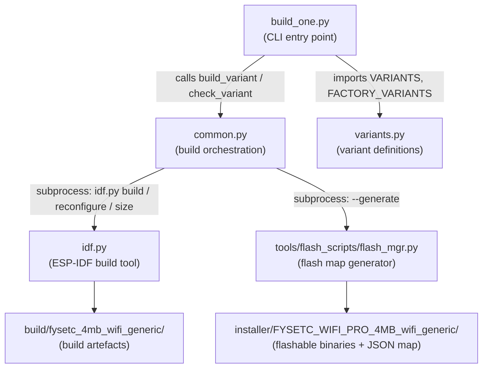
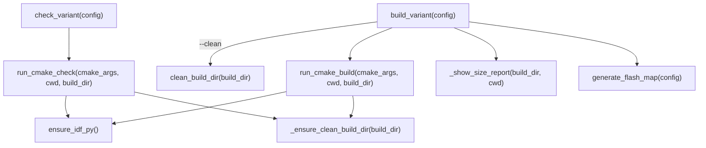
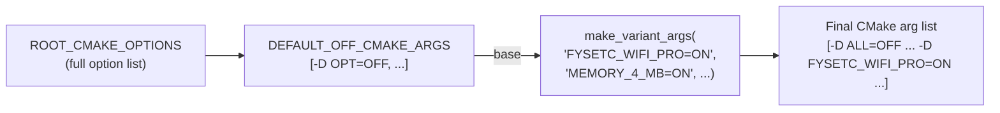
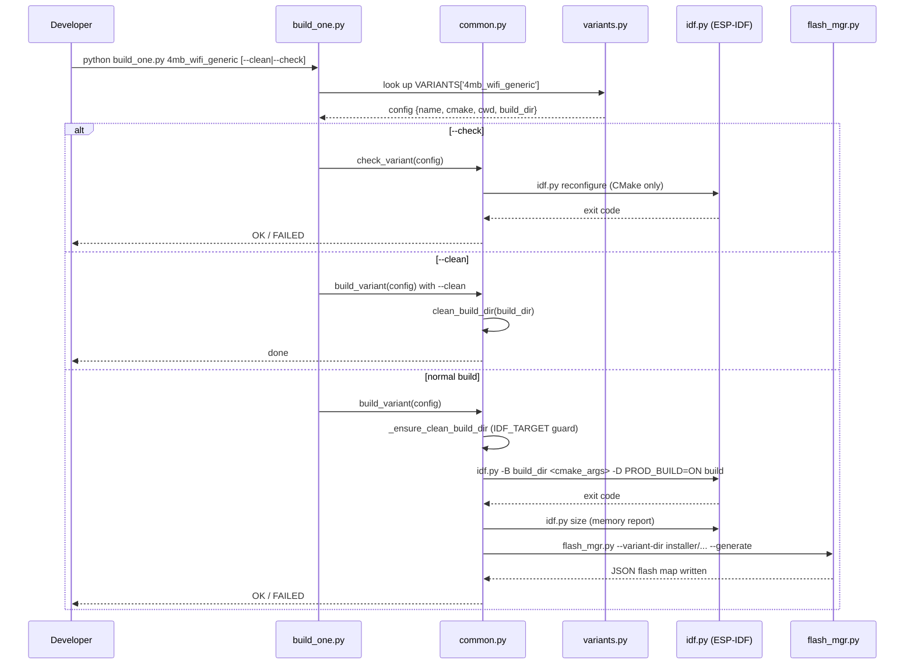
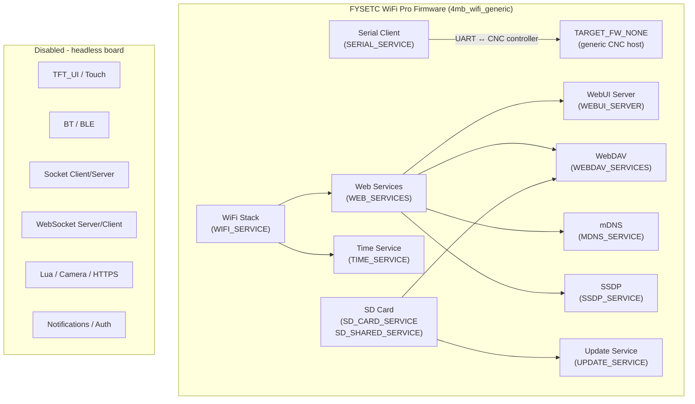
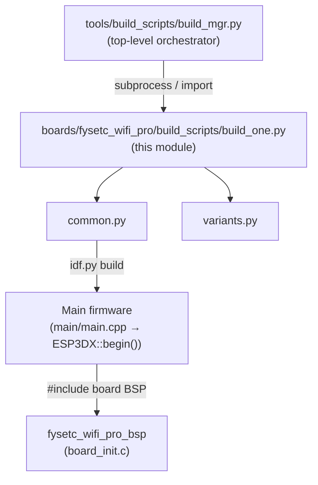

# FYSETC WiFi Pro — Build Scripts

## Introduction

The `fysetc_wifi_pro_build_scripts` module contains the Python-based build automation for the **FYSETC WiFi Pro** board. It follows the same three-file pattern used by every other board in the project (`build_one.py` / `common.py` / `variants.py`), but reflects the board's unique identity: a **headless WiFi + SD bridge** with no display, no touch, no Bluetooth, and no direct CNC firmware connection.

Unlike pendant-style boards such as `pibot_pendant_v1_0` or the large-screen `esp32s3_8048s070c`, the FYSETC WiFi Pro has **no Factory application** and **no UI layer**. Its single firmware variant exposes the embedded WebUI over WiFi so that a host machine's browser can reach the CNC controller through the pendant's serial link.

---

## Board Identity

| Property | Value |
|---|---|
| SoC | ESP32 (Xtensa LX6, dual-core) |
| Flash | 4 MB |
| PSRAM | None |
| Display / Touch | None (headless) |
| IDF target | `esp32` |
| CNC transport | Serial (UART) → CNC controller |
| WiFi role | Remote (WebUI + WebDAV + mDNS + SSDP) |
| Bluetooth | Not used (WiFi and BT are mutually exclusive on this board) |
| Factory app | None |

> **Architecture context:** For the WiFi role vs. CNC transport model and memory constraints, see the project-level notes in `CLAUDE.md` and `docs/guides/esp32_memory_constraints.md`.

---

## Module Structure

```
boards/fysetc_wifi_pro/build_scripts/
├── build_one.py   ← CLI entry point: build or check a single named variant
├── common.py      ← Shared helpers: idf.py orchestration, paths, flash-map generation
└── variants.py    ← Variant matrix: CMake flag sets and build directories
```



---

## Component Reference

### `build_one.py` — CLI Entry Point

**Exported symbol:** `main()`

`main()` is the script entry point. It:

1. Merges `FACTORY_VARIANTS` and `VARIANTS` into a single lookup dict.
2. Reads the first non-flag positional argument as the variant name.
3. Exits with usage help (listing all variant names) if no name is supplied.
4. Dispatches to `check_variant` when `--check` is passed, or `build_variant` otherwise.

The `--clean` flag is not parsed here — it is forwarded transparently to `build_variant` through `sys.argv`, where `common.py` inspects it directly.

```
python build_one.py <variant_name> [--clean] [--check]
```

| Flag | Effect |
|---|---|
| *(none)* | Full incremental build |
| `--clean` | Delete build dir and installer dir, then exit |
| `--check` | CMake reconfigure only (validates config, no compilation) |

---

### `common.py` — Build Orchestration

**Exported symbols:** `build_variant(config)`, `check_variant(config)`

This file contains all logic that is independent of which specific variant is being built. Its internal call graph is:



#### `build_variant(config)`

Full build pipeline for one variant:

1. **Clean** (`--clean` flag): removes the build directory and the installer directory, then returns immediately.
2. **CMake build** (`run_cmake_build`): invokes `idf.py -B <build_dir> <cmake_args> -D PROD_BUILD=ON build`.
3. **Size report**: runs `idf.py size` to print a memory usage summary.
4. **Flash map**: calls `generate_flash_map` to (re)write `installer/<config>/<config>.json` via `flash_mgr.py`.

#### `check_variant(config)`

Lightweight configuration validation — runs `idf.py reconfigure` (CMake only, no C compilation). Useful for CI pre-checks or validating that a CMake flag combination is coherent without waiting for a full build.

#### IDF Target Guard

Each build directory carries a `.idf_target` marker file. Before every build or check, `_ensure_clean_build_dir` reads the marker. If the cached target differs from `EXPECTED_IDF_TARGET` (`"esp32"`), the entire build directory is deleted to avoid cross-target contamination.

#### `PROD_BUILD` Flag

Unless `--dev` is present in `sys.argv`, `-D PROD_BUILD=ON` is automatically appended to every build or check invocation. This activates production-only CMake paths (e.g., strip debug symbols, freeze log levels).

#### Parallel Builds

`common.py` recognises a `--jobs=N` argument forwarded from [`tools_build_scripts`](tools_build_scripts.md) (`build_mgr.py`). Because `idf.py` has no `-j` CLI flag, the parallelism is applied via `CMAKE_BUILD_PARALLEL_LEVEL` in the subprocess environment.

#### `build_config_name(cmake_args)`

Derives the canonical config string from CMake flags, mirroring the `BUILD_CONFIG_NAME` variable produced by `cmake/postbuild.cmake`. For this board the result is always:

```
FYSETC_WIFI_PRO_4MB_wifi_generic
```

This string is used as the installer subdirectory name.

#### `generate_flash_map(config)`

After a successful build, this function calls `tools/flash_scripts/flash_mgr.py --variant-dir <installer_dir> --generate` (optionally with `--flash-params boards/fysetc_wifi_pro/flash_params.json` if that file exists) to produce a JSON flash layout consumed by the web-based flash tool.

---

### `variants.py` — Variant Definitions

**Exported symbols:** `make_variant_args(*on_flags)`, `VARIANTS`, `FACTORY_VARIANTS`

#### `make_variant_args(*on_flags)`

Implements the *all-OFF baseline* pattern shared by every board in this project:

1. All known CMake options in `ROOT_CMAKE_OPTIONS` are passed as `-D OPTION=OFF`.
2. Each flag in `*on_flags` is then appended as `-D FLAG` (the caller supplies the `=ON` suffix).

This ensures that switching boards never leaves stale `ON` values from a previous configuration in the CMake cache, because every option is explicitly reset.



#### `VARIANTS`

The board exposes **one firmware variant**:

| Key | `4mb_wifi_generic` |
|---|---|
| Board | `FYSETC_WIFI_PRO=ON` |
| Memory | `MEMORY_4_MB=ON` |
| CNC target | `TARGET_FW_NONE=ON` |
| CNC transport | `SERIAL_SERVICE=ON` |
| Network | `WIFI_SERVICE=ON` |
| Discovery | `MDNS_SERVICE=ON`, `SSDP_SERVICE=ON` |
| Time | `TIME_SERVICE=ON` |
| Web | `WEB_SERVICES=ON`, `WEBUI_SERVER=ON`, `WEBDAV_SERVICES=ON` |
| Storage | `SD_CARD_SERVICE=ON`, `SD_SHARED_SERVICE=ON` |
| Maintenance | `UPDATE_SERVICE=ON` |
| Build dir | `<REPO_ROOT>/build/fysetc_4mb_wifi_generic/` |
| Working dir | `REPO_ROOT` (main firmware project) |

**Notable omissions** (all explicitly `OFF`):

| Category | Disabled options |
|---|---|
| UI | `TFT_UI_SERVICE`, `TFT_TOUCH_SERVICE` |
| Bluetooth | `BT_SERVICE` |
| Extended serial | `UART_EXT_SERVICE`, `USB_SERIAL_SERVICE` |
| Socket | `SOCKET_CLIENT_SERVICE`, `SOCKET_SERVER_SERVICE` |
| WebSocket | `WS_SERVER_SERVICE`, `WS_CLIENT_SERVICE` |
| Scripting | `LUA_INTERPRETER_SERVICE` |
| Notifications | `NOTIFICATIONS_SERVICE` |
| Authentication | `ESP3D_AUTHENTICATION` |
| Camera | `CAMERA_SERVICE` |
| HTTPS | `HTTPS_SERVICE` |

#### `FACTORY_VARIANTS`

Empty dict `{}`. The FYSETC WiFi Pro has **no factory application** — there is no bootloader customisation, no recovery menu, and no pre-production test firmware for this board. Compare with [`pibot_pendant_v1_0_build_scripts`](pibot_pendant_v1_0_build_scripts.md) or [`esp32s3_8048s070c_build_scripts`](esp32s3_8048s070c_build_scripts.md), which both carry a full factory app alongside their main firmware.

---

## Full Build Flow



---

## Paths and Environment

| Symbol | Value |
|---|---|
| `SCRIPT_DIR` | `boards/fysetc_wifi_pro/build_scripts/` |
| `BOARD_ROOT` | `boards/fysetc_wifi_pro/` |
| `REPO_ROOT` | Project root (two levels up from `build_scripts/`) |
| `BUILD_BASE` | `<REPO_ROOT>/build/` |
| Build dir | `<REPO_ROOT>/build/fysetc_4mb_wifi_generic/` |
| Installer dir | `<REPO_ROOT>/installer/FYSETC_WIFI_PRO_4MB_wifi_generic/` |
| `IDF_PATH` | `$IDF_PATH` env var (falls back to `C:\Users\luc\esp\v5.4.3\esp-idf`) |
| `IDF_TARGET` | `esp32` (hardcoded; enforced via `.idf_target` marker) |

---

## Enabled Feature Set

The following diagram shows which firmware subsystems are active in the `4mb_wifi_generic` variant and how they relate to the broader architecture modules:



---

## How This Module Fits into the Broader Build System

The per-board `build_scripts/` modules are the **leaf nodes** of the build system hierarchy. The top-level orchestrator is [`tools_build_scripts`](tools_build_scripts.md) (`build_mgr.py`), which discovers all board build scripts and drives parallel multi-board builds. Each board's `build_one.py` is also invokable standalone for single-variant development builds.



### Related Modules

| Module | Relationship |
|---|---|
| [`fysetc_wifi_pro_bsp`](fysetc_wifi_pro_bsp.md) | Companion BSP (`board_init.c`); compiled into the firmware triggered by these scripts |
| [`tools_build_scripts`](tools_build_scripts.md) | Provides `build_mgr.py` (multi-board orchestration) and `flash_mgr.py` (invoked by `generate_flash_map`) |
| [`Network_&_Web_Services`](Network_and_Web_Services.md) | WiFi, HTTP, WebDAV, mDNS, SSDP, and Time modules that form the bulk of the compiled firmware |
| [`Communication_Transports`](Communication_Transports.md) | `serial_client` transport (`SERIAL_SERVICE`) bridging WiFi to the CNC controller's UART |
| [`Core_Platform_&_Infrastructure`](Core_Platform_and_Infrastructure.md) | `ESP3DX`, `ESP3DSettings`, and `ESP3DValues` — the firmware core that `idf.py build` compiles |

---

## Developer Guide

### Prerequisites

- ESP-IDF v5.4.3 installed and `IDF_PATH` environment variable set.
- Python 3 in `PATH`.

### Building the Variant

```bash
cd boards/fysetc_wifi_pro/build_scripts

# Full incremental build
python build_one.py 4mb_wifi_generic

# Clean then rebuild
python build_one.py 4mb_wifi_generic --clean
python build_one.py 4mb_wifi_generic

# CMake config validation only (no compilation)
python build_one.py 4mb_wifi_generic --check

# List all available variants
python build_one.py
```

### Flashing

After a successful build, the flash-ready binaries and the JSON flash map are written to:

```
installer/FYSETC_WIFI_PRO_4MB_wifi_generic/
```

Use `tools/flash_scripts/flash_mgr.py` or the web-based flash tool to program the device.

### Adding a New Variant

1. Open `variants.py`.
2. Define the new config by calling `make_variant_args(...)` with the desired `ON` flags.
3. Add an entry to `VARIANTS` (or `FACTORY_VARIANTS` if it is a factory-mode build — currently none exist for this board).
4. Pick a unique `build_dir` path under `BUILD_BASE`.

```python
VARIANTS = {
    "4mb_wifi_generic": { ... },          # existing
    "4mb_wifi_grbl": {                     # new example
        "name": "4mb_wifi_grbl",
        "cmake": make_variant_args(
            "FYSETC_WIFI_PRO=ON",
            "MEMORY_4_MB=ON",
            "TARGET_FW_GRBL=ON",
            "SERIAL_SERVICE=ON",
            "WIFI_SERVICE=ON",
            "MDNS_SERVICE=ON",
            "WEB_SERVICES=ON",
            "WEBUI_SERVER=ON",
            "SD_CARD_SERVICE=ON",
            "UPDATE_SERVICE=ON",
        ),
        "cwd": REPO_ROOT,
        "build_dir": os.path.join(BUILD_BASE, "fysetc_4mb_wifi_grbl"),
    },
}
```

> **Constraint reminder:** Do not enable `BT_SERVICE` and `WIFI_SERVICE` simultaneously on this board — the ESP32 has no PSRAM and cannot sustain both radio stacks. See `cmake/sanity_check.cmake` for the enforced mutual exclusions.

### Running via the Top-Level Build Manager

```bash
# From the project root — builds all boards in parallel
python tools/build_scripts/build_mgr.py --jobs=4
```

`build_mgr.py` discovers `build_one.py` in each board's `build_scripts/` directory and invokes it as a subprocess, so this board participates automatically.
