# GCode Host Module

The `gcode_host` module is the **central CNC command scheduler** of the pendant firmware. Every outbound G-code or ESP command — whether typed interactively, triggered by a macro, or streamed from a file — is ordered, paced, and acknowledged through this module. It enforces flow control, serialises concurrent command sources, and manages the full lifecycle of streaming jobs.

---

## Related Documentation

| Document | Topic |
|----------|-------|
| [`gcode_host_architecture.md`](https://github.com/luc-github/Pibot-cnc-pendant-firmware/blob/main/docs/architecture/gcode_host_architecture.md) | Core + domain flow split, CMake wiring, testing scope |
| [`gcode_host_streaming_flow.md`](https://github.com/luc-github/Pibot-cnc-pendant-firmware/blob/main/docs/architecture/gcode_host_streaming_flow.md) | State machine detail, pause/resume/abort semantics, flow gates |
| [`esp3d_message_priority_system.md`](https://github.com/luc-github/Pibot-cnc-pendant-firmware/blob/main/docs/architecture/esp3d_message_priority_system.md) | Normal vs high-priority message routing |
| [`connection_management.md`](https://github.com/luc-github/Pibot-cnc-pendant-firmware/blob/main/docs/architecture/connection_management.md) | Transport lifecycle, connection status |
| [`Core_Platform_&_Infrastructure.md`](Core_Platform_and_Infrastructure.md) | ESP3DClient base class, message system |

---

## 1. Module Purpose and Position

The `gcode_host` module sits between all command producers (UI screens, macros, HTTP/WebSocket handlers, the command subsystem) and the single active output transport (Serial, USB-Serial, Bluetooth SPP/BLE, Socket, or WebSocket). It is the **sole owner of the outbound CNC channel**.

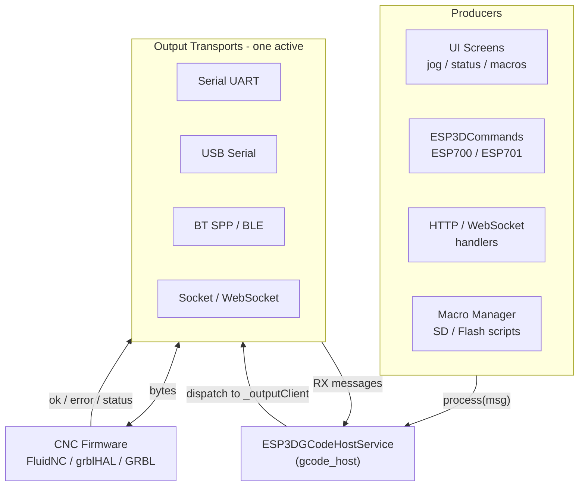

---

## 2. High-Level Architecture

The module is split into a **target-independent core** and a **per-firmware-family flow implementation**. The split is fixed at compile time by CMake — there is no runtime polymorphism.

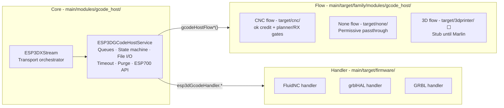

**Layer responsibilities:**

| Layer | Path | Role |
|-------|------|------|
| **Core** | `main/modules/gcode_host/` | Queues, FreeRTOS task, file I/O, state machine, `_forwardUrgent`, ESP700/701 API |
| **CNC flow** | `main/target/cnc/modules/gcode_host/` | `ok` credit + planner-buffer/RX-window gates — active today |
| **None flow** | `main/target/none/modules/gcode_host/` | Permissive passthrough for `TARGET_FW_NONE` |
| **3D flow ⬜** | `main/target/3dprinter/modules/gcode_host/` | Stub until Marlin checksummed streaming is implemented |
| **Handler** | `main/target/cnc/<fw>/` | Parse status reports, maintain buffer caches, `hasAck()`, `isRealTimeCommand()` |

---

## 3. Source File Map

```
main/modules/gcode_host/
├── esp3d_gcode_host_service.h      ← ESP3DGCodeHostService, ESP3DGcodeStream, ESP3DPurgeCommand
├── esp3d_gcode_host_service.cpp    ← Main service implementation + FreeRTOS task
├── esp3d_gcode_host_types.h        ← Enums: stream type, stream state, host state, errors
├── esp3d_x_stream.h                ← ESP3DXStream declaration
└── esp3d_x_stream.cpp              ← Transport orchestrator + streamTask

main/target/cnc/modules/gcode_host/
└── esp3d_gcode_host_flow.cpp       ← CNC flow gate logic (ok credit + planner + RX window)

main/target/none/modules/gcode_host/
└── esp3d_gcode_host_flow.cpp       ← Permissive stub (TARGET_FW_NONE)

main/target/cnc/<firmware>/
├── esp3d_gcode_handler_service.h   ← Handler interface
└── esp3d_gcode_handler_service.cpp ← Status parsing, buffer cache, firmware-specific logic
```

---

## 4. Core Data Structures

### `ESP3DGcodeStream`

Each queued item — whether a single command, a multi-command batch, or a file path — is a heap-allocated `ESP3DGcodeStream` node:

| Field | Type | Description |
|-------|------|-------------|
| `id` | `uint64_t` | Creation timestamp in ms — also used as job duration base |
| `requestId` | `uint` | Origin tag for `purgeByRequestId()` (0 = untagged, never purged) |
| `totalSize` | `uint64_t` | Byte length of payload string or file size |
| `processedSize` | `uint64_t` | Bytes confirmed processed (used for progress reporting) |
| `cursorPos` | `uint64_t` | Current read position in payload or file |
| `type` | `ESP3DGcodeHostStreamType` | Stream classification (see table below) |
| `state` | `ESP3DGcodeStreamState` | Current state machine state |
| `auth_type` | `ESP3DAuthenticationLevel` | Authentication context carried from origin |
| `active` | `bool` | Set by stream selection; non-active streams are held without processing |
| `dataStream` | `char*` | Heap-allocated payload string or filesystem path |

### `ESP3DPurgeCommand`

Used in the sequenced purge overload for ordered post-purge commands with inter-command delays:

| Field | Type | Description |
|-------|------|-------------|
| `cmd` | `const char*` | Command string to send as high-priority after purge |
| `delay_ms` | `uint32_t` | Delay applied after sending this command (0 = none) |

### Stream Types (`ESP3DGcodeHostStreamType`)

| Type | Source | Queue | Description |
|------|--------|-------|-------------|
| `single_command` | UI / API | `_scripts` | One G-code or ESP command |
| `multiple_commands` | API | `_scripts` | Newline/semicolon-separated command batch |
| `fs_script` | Macro | `_scripts` | Flash filesystem file, executed immediately (priority) |
| `sd_script` | Macro | `_scripts` | SD card file, executed immediately (priority) |
| `fs_stream` | ESP700 | `_streams` | Flash file job streamed line-by-line |
| `sd_stream` | ESP700 | `_streams` | SD card job streamed line-by-line |

The distinction between `*_script` and `*_stream` is set in `_add_stream()` by the `executeFirst` flag: scripts join the priority `_scripts` queue; streams join the `_streams` (main job) queue.

---

## 5. Dual Queue System

The service maintains two independent lists, each protected by its own mutex:

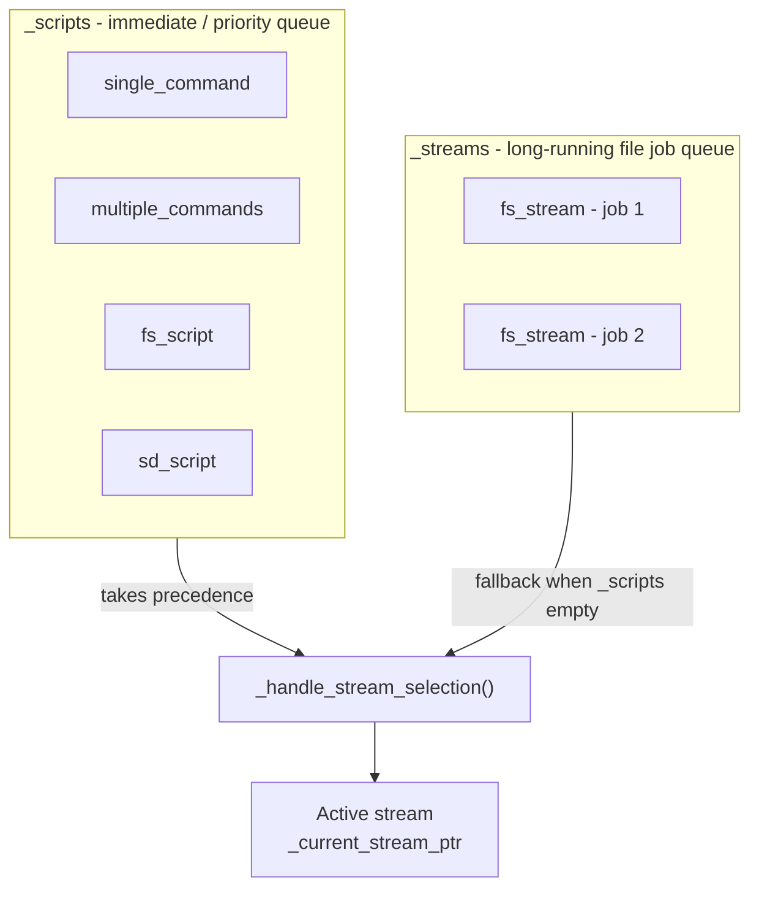

**Selection rules (evaluated every `handle()` tick):**

1. If `_scripts` is non-empty, its front entry becomes the active stream.
2. If `_scripts` is empty and `_streams` has an entry, it becomes active.
3. Only file streams (`fs_stream`, `sd_stream`) can be **preempted** by an incoming script; command streams run to completion uninterrupted.
4. A file stream can only be preempted while in `ready_to_read_cursor` or `paused` state.
5. When all scripts drain and a paused main stream has `_resume_pending` set, stream selection triggers the job restart (`start` state) automatically.

Maximum queue depth: **50 entries** (`ESP3D_MAX_STREAM_SIZE`) per queue independently; excess additions are dropped with a rate-limited error log (at most once per 2 s).

---

## 6. Stream State Machine

Each `ESP3DGcodeStream` advances through the following states, driven by `_handle_stream_states()` up to **4 steps per `handle()` tick** (configurable via `ESP3D_GCODE_HOST_MAX_STATE_STEPS_PER_HANDLE`):

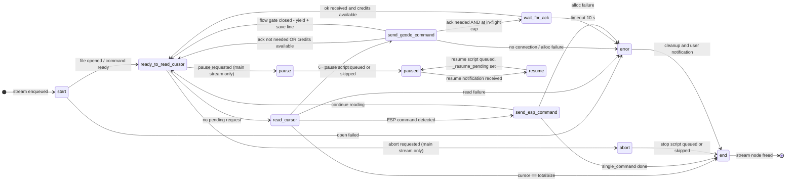

**Blocking states** — the state machine does not chain further steps in the same tick when it lands in one of these:
`wait_for_ack`, `paused`, `pause`, `error`, `end`, `abort`

---

## 7. Runtime Loop (`handle()`)

`handle()` is called every `ESP3D_GCODE_HOST_TASK_TICK_MS` milliseconds (default **10 ms**) from the dedicated FreeRTOS task (`esp3d_gcode_host_task`, Core 0, priority 14):

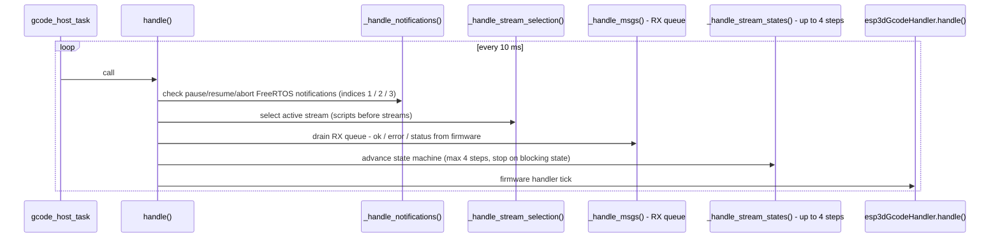

> **Why RX before states?** An `ok` received in `_handle_msgs()` releases `wait_for_ack` so the chain `ready → read → send` can complete in the **same tick** — critical for GRBL single-line streaming throughput over serial/USB/BT.

---

## 8. CNC Flow Control

The CNC flow implementation (`target/cnc/modules/gcode_host/esp3d_gcode_host_flow.cpp`) gates every G-code line through four concurrent checks before allowing transmission:

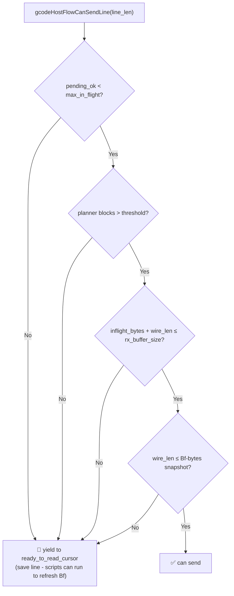

| Gate | Mechanism | Threshold |
|------|-----------|-----------|
| **ok credit** | `pending_ok` counter (lines sent minus oks received) | `getStreamMaxInFlight()` — 4 on FluidNC / grblHAL |
| **Planner buffer** | `|Bf:blocks|` from status report cache | ≤ 5 blocks → blocked |
| **RX window (hard)** | Local ring of in-flight wire-byte lengths; pushed on send, popped on ok or error | `getStreamRxBufferSize()` — grblHAL: 1024 B, FluidNC: 256 B |
| **RX bytes snapshot** | Last `|Bf:bytes|` value from status report | Line must fit; gate inactive until first report received |

### Flow API (one implementation compiled per build)

| Function | Called when |
|----------|-------------|
| `gcodeHostFlowReset()` | Stream start, abort, clear-all, error |
| `gcodeHostFlowCanSendLine(len)` | Before TX in `send_gcode_command` state |
| `gcodeHostFlowOnLineSent(cmd)` | After successful dispatch — increments `pending_ok`, pushes RX ring |
| `gcodeHostFlowOnAck()` | On RX `ok` — decrements `pending_ok`, pops RX ring |
| `gcodeHostFlowOnNack()` | On RX `error:N` — decrements `pending_ok`, pops RX ring |
| `gcodeHostFlowAtInFlightCap()` | After send — decides whether to enter `wait_for_ack` |
| `gcodeHostFlowPendingOk()` | Query current in-flight credit count |

### Flow-Gate Yield (Livelock Prevention)

When the gate refuses a line in `send_gcode_command`, the stream **does not park** there — that state is non-interruptible, so queued scripts (the GRBL `?` status poller that refreshes `|Bf:|`) would never run and the planner gauge would never reopen the gate. Instead:

1. The already-read line is saved: `_flow_pending_line`, `_flow_pending_stream`, `_flow_pending_cursor`.
2. The stream yields back to `ready_to_read_cursor` (interruptible — scripts can run).
3. On re-entry to `read_cursor`, the saved line is restored and the stream jumps directly back to `send_gcode_command` without re-reading from file.
4. On pause/abort while a line is pending, `cursorPos` is rewound to `_flow_pending_cursor` so that resume re-reads the line correctly (consistent with `_openFile` / `fseek` on resume).

### Keepalive / Link Watchdog

Both `wait_for_ack` and flow-gate-closed states share the same watchdog rule, independent of the user-set polling interval:

- After **`ESP3D_WAIT_ACK_KEEPALIVE_MS`** (2 s) of silence: a realtime `?` is sent at **high priority** (no flow credit consumed) — a live controller always answers `?` even in Hold or dwell.
- After **`ESP3D_COMMAND_TIMEOUT`** (10 s) total silence: flow reset, stream set to `error` state (`time_out`), `communication_lost` displayed on the status bar.

---

## 9. Priority and Urgent Bypass

The service routes messages based on `ESP3DMessagePriority` immediately inside `process()`:

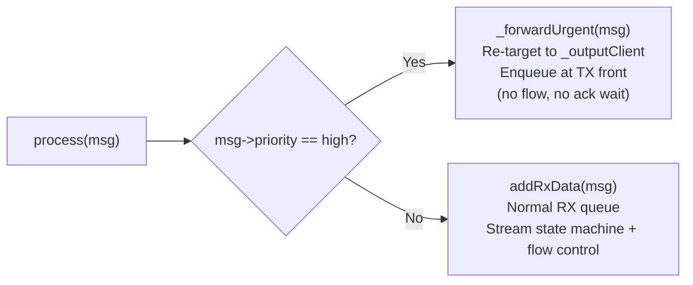

**High-priority (urgent) messages bypass entirely:**
- The RX queue and stream state machine
- All CNC flow control gates
- ACK waiting and timeout tracking

Typical urgent commands: feed hold `!`, cycle start `~`, soft reset `0x18`, jog cancel `0x85`, probe/estop flows, keepalive `?` injected by the watchdog, and post-purge cancel commands injected by `_sendHighPriorityCommand()`.

See [`esp3d_message_priority_system.md`](https://github.com/luc-github/Pibot-cnc-pendant-firmware/blob/main/docs/architecture/esp3d_message_priority_system.md) for the full priority routing reference.

---

## 10. Pause / Resume / Abort

Pause, resume, and abort are signalled via FreeRTOS task notifications on dedicated indices (pause=1, resume=2, abort=3; index 0 is the general wake signal). They target the **main stream** (`_current_main_stream_ptr`) only — not arbitrary scripts.

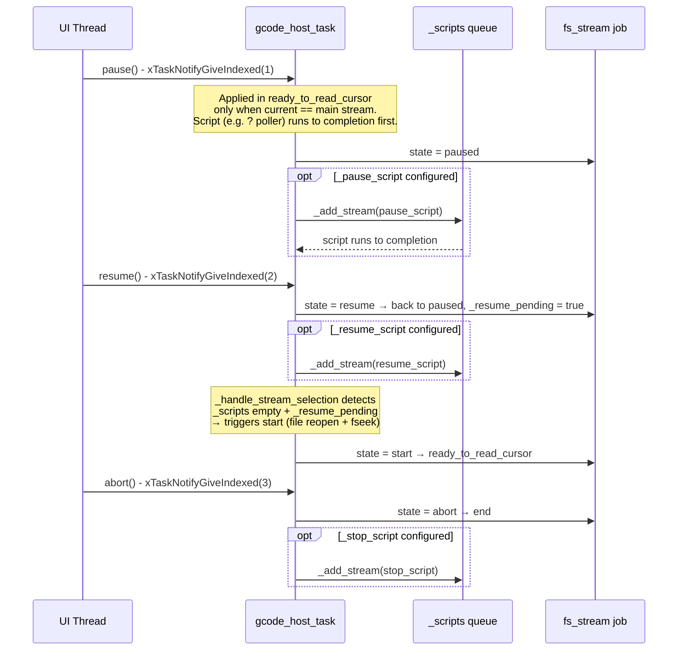

**Key invariants:**

| Rule | Reason |
|------|--------|
| Pending pause/abort deferred while a **script** is active | Prevents trapping a `?` polling script in `pause` state (re-injecting `_pause_script` every tick) |
| `_resume_pending` delays job restart until `_scripts` drains | Prevents job lines going out before the resume script (e.g. motion before spindle restart) |
| Stale requests discarded when main stream ends | Must not fire on the next job |
| Second resume while `_resume_pending` ignored | No double script injection |
| Pause while already paused is ignored | No re-queuing of pause scripts |
| Pause during resume script cancels `_resume_pending` | Job stays paused instead of bouncing |
| `abortAll()` drops all queued `_streams` entries behind the current job | Scripts are kept (stop script must still run) |

---

## 11. Purge API

The purge functions atomically clear queued commands and optionally inject a high-priority command afterward. They gate the host task using `_emergency_stopping` + `_waitHandleIdle()` (bounded wait ≤ 200 ms) before mutating the queues:

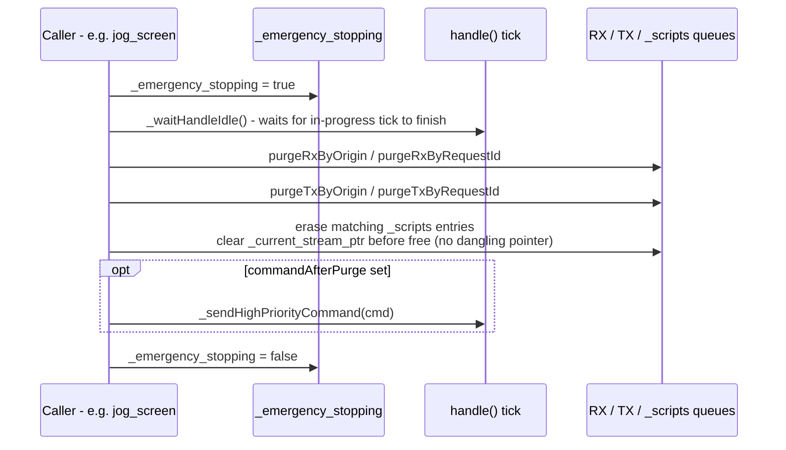

### Available Purge Methods

| Method | Filter | Typical use case |
|--------|--------|-----------------|
| `purgeByOrigin(origin, cmd?)` | `ESP3DClientType` origin | Cancel all commands from a specific input source |
| `purgeByRequestId(id, cmd?)` | `uint requestId` | Cancel commands tagged with a known ID (e.g. all jog moves) |
| `purgeByRequestId(id, cmds[], n)` | `uint requestId` + sequenced post-purge commands | Smooth jog stop with progressive deceleration and inter-command delays |

> Request ID `0` is **untagged** and is never matched by `purgeByRequestId`. The `stream->id` field is a creation timestamp — it is not a request ID and must not be compared as one.

---

## 12. Output Transport Selection (`ESP3DXStream`)

`ESP3DXStream` runs as the **`tftStream` FreeRTOS task** (Core 0). It starts `gcodeHostService` and then starts exactly one output transport client based on the NVS-persisted output client setting:

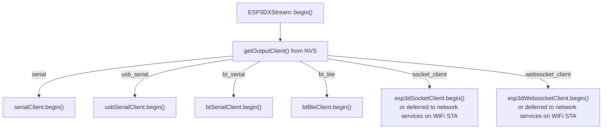

`handle()` in `ESP3DXStream` polls all active transport clients once per tick (except `esp3dSocketClient`, which is driven entirely by its own RX task to avoid interleaved writes on the TCP wire).

See [`connection_management.md`](https://github.com/luc-github/Pibot-cnc-pendant-firmware/blob/main/docs/architecture/connection_management.md) for transport lifecycle details.

---

## 13. ACK, Timeout, and Error Handling

Firmware responses are classified by `esp3dGcodeHandler.getType()` in `_parseResponse()`:

| Response class | Action in host |
|----------------|----------------|
| `ack` (`ok`) | `gcodeHostFlowOnAck()` — release one credit; exit `wait_for_ack` when credits are free; end `single_command` when `pending_ok == 0` |
| `status` (`<...>`) | Refresh timeout; handler updates planner/RX cache from `\|Bf:\|` |
| `error` (`error:N`) | `gcodeHostFlowOnNack()` — release one credit; set current stream **and** main stream to `error` (`command_rejected`); no automatic resend |
| Other | Ignored by gcode host (logged as "useless response") |

An `error:` with no credits pending (out-of-query) is shown on the status bar only and does not affect stream state.

---

## 14. Command Escaping Convention

For `single_command` and `multiple_commands` types, commands are separated by an unescaped `;` or `\n`. Characters that must appear literally are escaped before reaching `_add_stream()`:

| To send literally | Write in the command string |
|-------------------|-----------------------------|
| `;` | `\;` |
| `\` | `\\` |
| `\;` (two chars) | `\\\;` |

Any other `\x` sequence is kept verbatim (backslash preserved). Escapes are resolved once in `_add_stream()` before the string is stored in `dataStream`. File paths (`fs_stream`, `sd_stream`) are never escaped or split.

---

## 15. Key Tuneable Constants

All constants are overridable per-board in `bsp/tasks_def.h`:

| Constant | Default | Effect |
|----------|---------|--------|
| `ESP3D_GCODE_HOST_TASK_TICK_MS` | 10 ms | Delay between `handle()` calls. **Do not lower below the FreeRTOS tick period** (`CONFIG_FREERTOS_HZ=100` → 10 ms minimum; lower values round to `vTaskDelay(0)`, turning the priority-14 host task into a busy loop that starves LVGL on Core 1) |
| `ESP3D_GCODE_HOST_MAX_STATE_STEPS_PER_HANDLE` | 4 | State machine steps per tick. **Preferred throughput lever** — 4 ≈ 100 lines/s; 8 ≈ 200 lines/s at no extra wakeup cost |
| `ESP3D_COMMAND_TIMEOUT` | 10 000 ms | No-response timeout → stream `error` + `communication_lost` |
| `ESP3D_WAIT_ACK_KEEPALIVE_MS` | 2 000 ms | Silence before sending keepalive `?` (both in `wait_for_ack` and flow-gate-closed) |
| `ESP3D_MAX_STREAM_SIZE` | 50 | Maximum entries per queue (`_scripts` and `_streams` independently) |
| `STREAM_CHUNK_SIZE` | Board-specific | File read buffer size — PSRAM (`heap_caps_malloc(MALLOC_CAP_SPIRAM)`) when `ESP3D_PSRAM_FEATURE` is set, otherwise DRAM |

---

## 16. Error Codes (`ESP3DGcodeHostError`)

| Code | Name | Cause |
|------|------|-------|
| 0 | `no_error` | — |
| 1 | `time_out` | No firmware response within `ESP3D_COMMAND_TIMEOUT` |
| 2 | `data_send` | Transport send failure |
| 4 | `ack_number` | ACK sequence mismatch |
| 5 | `memory_allocation` | `malloc` returned `nullptr` |
| 10 | `unknow` | Unclassified error |
| 11 | `file_not_found` | File does not exist in filesystem |
| 12 | `file_system` | Filesystem access or stat error |
| 13 | `empty_file` | File size reported as 0 |
| 14 | `access_denied` | File open denied |
| 15 | `cursor_out_of_range` | `fseek` to cursor position failed |
| 16 | `list_full` | Queue at `ESP3D_MAX_STREAM_SIZE` capacity |
| 17 | `aborted` | Stream aborted by user request |
| 18 | `command_too_long` | Line exceeds 255 bytes |
| 19 | `no_connection` | No output client configured at send time |
| 20 | `command_rejected` | Firmware returned `error:N` (negative ack of one line) |

---

## 17. Component Interaction Summary

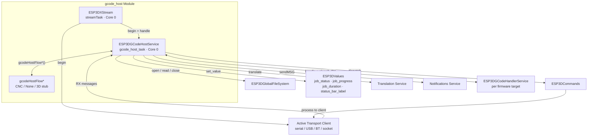

---

## 18. Build Notes

- **PSRAM:** when `ESP3D_PSRAM_FEATURE` is defined, the file read buffer is allocated from PSRAM via `heap_caps_malloc(MALLOC_CAP_SPIRAM)`. Without PSRAM, a fixed DRAM array of `STREAM_CHUNK_SIZE` bytes is used.
- **CMake flow selection:** `cmake/features.cmake` adds the correct include path (`-I main/target/<family>/modules/gcode_host`) so exactly one `esp3d_gcode_host_flow.cpp` is compiled per target family. See [`gcode_host_architecture.md`](https://github.com/luc-github/Pibot-cnc-pendant-firmware/blob/main/docs/architecture/gcode_host_architecture.md) for the full CMake mapping.
- **FreeRTOS notification slots:** `CONFIG_FREERTOS_TASK_NOTIFICATION_ARRAY_ENTRIES` must be **≥ 4** (wake=0, pause=1, resume=2, abort=3). A `static_assert` inside `_handle_notifications()` enforces this at compile time.
- **Memory constraints:** see [`esp32_memory_constraints.md`](https://github.com/luc-github/Pibot-cnc-pendant-firmware/blob/main/docs/guides/esp32_memory_constraints.md) for heap fragmentation guidance relevant to stream node and message allocations.
- **Logging:** flow instrumentation uses `esp3d_log` (standard verbose, always present in builds). See [`esp3d_log_guide.md`](https://github.com/luc-github/Pibot-cnc-pendant-firmware/blob/main/docs/guides/esp3d_log_guide.md) for log levels and backend configuration.
