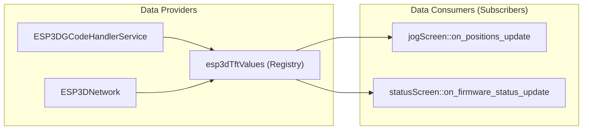
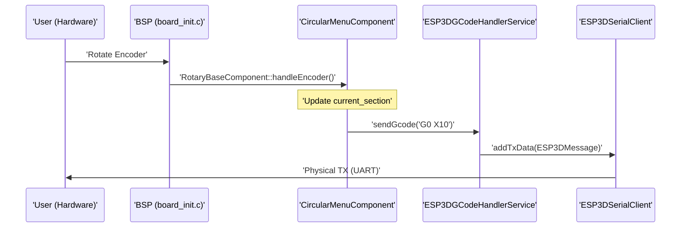

# Glossary
Relevant source files

- [.vscode/settings.json](https://github.com/luc-github/Pibot-cnc-pendant-firmware/blob/cbc90b5e/.vscode/settings.json)
- [boards/pibot_pendant_v1_0/components/bsp/CMakeLists.txt](https://github.com/luc-github/Pibot-cnc-pendant-firmware/blob/cbc90b5e/boards/pibot_pendant_v1_0/components/bsp/CMakeLists.txt)
- [boards/pibot_pendant_v1_0/components/bsp/board_config.h](https://github.com/luc-github/Pibot-cnc-pendant-firmware/blob/cbc90b5e/boards/pibot_pendant_v1_0/components/bsp/board_config.h)
- [boards/pibot_pendant_v1_0/components/bsp/board_init.c](https://github.com/luc-github/Pibot-cnc-pendant-firmware/blob/cbc90b5e/boards/pibot_pendant_v1_0/components/bsp/board_init.c)
- [boards/pibot_pendant_v1_0/components/bsp/bt_ble_def.h](https://github.com/luc-github/Pibot-cnc-pendant-firmware/blob/cbc90b5e/boards/pibot_pendant_v1_0/components/bsp/bt_ble_def.h)
- [boards/pibot_pendant_v1_0/components/bsp/bt_serial_def.h](https://github.com/luc-github/Pibot-cnc-pendant-firmware/blob/cbc90b5e/boards/pibot_pendant_v1_0/components/bsp/bt_serial_def.h)
- [boards/pibot_pendant_v1_0/components/bsp/lv_conf.h](https://github.com/luc-github/Pibot-cnc-pendant-firmware/blob/cbc90b5e/boards/pibot_pendant_v1_0/components/bsp/lv_conf.h)
- [boards/pibot_pendant_v1_0/components/bsp/touch_ft6336u_def.h](https://github.com/luc-github/Pibot-cnc-pendant-firmware/blob/cbc90b5e/boards/pibot_pendant_v1_0/components/bsp/touch_ft6336u_def.h)
- [hardware/common/drivers/bus_i2c/CMakeLists.txt](https://github.com/luc-github/Pibot-cnc-pendant-firmware/blob/cbc90b5e/hardware/common/drivers/bus_i2c/CMakeLists.txt)
- [hardware/common/drivers/bus_i2c/bus_i2c.c](https://github.com/luc-github/Pibot-cnc-pendant-firmware/blob/cbc90b5e/hardware/common/drivers/bus_i2c/bus_i2c.c)
- [hardware/common/drivers/bus_i2c/bus_i2c.h](https://github.com/luc-github/Pibot-cnc-pendant-firmware/blob/cbc90b5e/hardware/common/drivers/bus_i2c/bus_i2c.h)
- [hardware/common/drivers/touch_ft6336u/touch_ft6336u.c](https://github.com/luc-github/Pibot-cnc-pendant-firmware/blob/cbc90b5e/hardware/common/drivers/touch_ft6336u/touch_ft6336u.c)
- [hardware/common/drivers/touch_ft6336u/touch_ft6336u.h](https://github.com/luc-github/Pibot-cnc-pendant-firmware/blob/cbc90b5e/hardware/common/drivers/touch_ft6336u/touch_ft6336u.h)
- [hardware/common/drivers/touch_ft6336u/touch_ft6336u_config.h](https://github.com/luc-github/Pibot-cnc-pendant-firmware/blob/cbc90b5e/hardware/common/drivers/touch_ft6336u/touch_ft6336u_config.h)
- [main/core/commands/esp0.cpp](https://github.com/luc-github/Pibot-cnc-pendant-firmware/blob/cbc90b5e/main/core/commands/esp0.cpp)
- [main/core/commands/esp100.cpp](https://github.com/luc-github/Pibot-cnc-pendant-firmware/blob/cbc90b5e/main/core/commands/esp100.cpp)
- [main/core/commands/esp110.cpp](https://github.com/luc-github/Pibot-cnc-pendant-firmware/blob/cbc90b5e/main/core/commands/esp110.cpp)
- [main/core/commands/esp281.cpp](https://github.com/luc-github/Pibot-cnc-pendant-firmware/blob/cbc90b5e/main/core/commands/esp281.cpp)
- [main/core/commands/esp400.cpp](https://github.com/luc-github/Pibot-cnc-pendant-firmware/blob/cbc90b5e/main/core/commands/esp400.cpp)
- [main/core/commands/esp410.cpp](https://github.com/luc-github/Pibot-cnc-pendant-firmware/blob/cbc90b5e/main/core/commands/esp410.cpp)
- [main/core/commands/esp950.cpp](https://github.com/luc-github/Pibot-cnc-pendant-firmware/blob/cbc90b5e/main/core/commands/esp950.cpp)
- [main/core/esp3d_commands.cpp](https://github.com/luc-github/Pibot-cnc-pendant-firmware/blob/cbc90b5e/main/core/esp3d_commands.cpp)
- [main/core/esp3d_settings.cpp](https://github.com/luc-github/Pibot-cnc-pendant-firmware/blob/cbc90b5e/main/core/esp3d_settings.cpp)
- [main/core/includes/esp3d_commands.h](https://github.com/luc-github/Pibot-cnc-pendant-firmware/blob/cbc90b5e/main/core/includes/esp3d_commands.h)
- [main/core/includes/esp3d_settings.h](https://github.com/luc-github/Pibot-cnc-pendant-firmware/blob/cbc90b5e/main/core/includes/esp3d_settings.h)
- [main/display/cnc/esp3d_firmware_states.h](https://github.com/luc-github/Pibot-cnc-pendant-firmware/blob/cbc90b5e/main/display/cnc/esp3d_firmware_states.h)
- [main/display/cnc/fluidnc/res_320_240/esp3d_ui_default_fonts.h](https://github.com/luc-github/Pibot-cnc-pendant-firmware/blob/cbc90b5e/main/display/cnc/fluidnc/res_320_240/esp3d_ui_default_fonts.h)
- [main/display/cnc/fluidnc/screens/esp3d_screen_type.cpp](https://github.com/luc-github/Pibot-cnc-pendant-firmware/blob/cbc90b5e/main/display/cnc/fluidnc/screens/esp3d_screen_type.cpp)
- [main/display/cnc/fluidnc/screens/esp3d_screen_type.h](https://github.com/luc-github/Pibot-cnc-pendant-firmware/blob/cbc90b5e/main/display/cnc/fluidnc/screens/esp3d_screen_type.h)
- [main/display/cnc/fluidnc/screens/files_screen.cpp](https://github.com/luc-github/Pibot-cnc-pendant-firmware/blob/cbc90b5e/main/display/cnc/fluidnc/screens/files_screen.cpp)
- [main/display/cnc/grblhal/screens/esp3d_screen_type.cpp](https://github.com/luc-github/Pibot-cnc-pendant-firmware/blob/cbc90b5e/main/display/cnc/grblhal/screens/esp3d_screen_type.cpp)
- [main/display/cnc/res_320_240/images/error_s.c](https://github.com/luc-github/Pibot-cnc-pendant-firmware/blob/cbc90b5e/main/display/cnc/res_320_240/images/error_s.c)
- [main/display/cnc/screens/jog_screen.cpp](https://github.com/luc-github/Pibot-cnc-pendant-firmware/blob/cbc90b5e/main/display/cnc/screens/jog_screen.cpp)
- [main/display/cnc/screens/settings_screen.cpp](https://github.com/luc-github/Pibot-cnc-pendant-firmware/blob/cbc90b5e/main/display/cnc/screens/settings_screen.cpp)
- [main/display/cnc/screens/status_screen.cpp](https://github.com/luc-github/Pibot-cnc-pendant-firmware/blob/cbc90b5e/main/display/cnc/screens/status_screen.cpp)
- [main/display/components/circular_menu_component.cpp](https://github.com/luc-github/Pibot-cnc-pendant-firmware/blob/cbc90b5e/main/display/components/circular_menu_component.cpp)
- [main/display/components/circular_menu_component.h](https://github.com/luc-github/Pibot-cnc-pendant-firmware/blob/cbc90b5e/main/display/components/circular_menu_component.h)
- [main/display/components/virtual_buttons_component.cpp](https://github.com/luc-github/Pibot-cnc-pendant-firmware/blob/cbc90b5e/main/display/components/virtual_buttons_component.cpp)
- [main/display/components/virtual_buttons_component.h](https://github.com/luc-github/Pibot-cnc-pendant-firmware/blob/cbc90b5e/main/display/components/virtual_buttons_component.h)
- [main/display/esp3d_styles.h](https://github.com/luc-github/Pibot-cnc-pendant-firmware/blob/cbc90b5e/main/display/esp3d_styles.h)
- [main/display/esp3d_translations_init.cpp](https://github.com/luc-github/Pibot-cnc-pendant-firmware/blob/cbc90b5e/main/display/esp3d_translations_init.cpp)
- [main/display/esp3d_translations_list.h](https://github.com/luc-github/Pibot-cnc-pendant-firmware/blob/cbc90b5e/main/display/esp3d_translations_list.h)
- [main/display/esp3d_ui.cpp](https://github.com/luc-github/Pibot-cnc-pendant-firmware/blob/cbc90b5e/main/display/esp3d_ui.cpp)
- [main/display/esp3d_ui.h](https://github.com/luc-github/Pibot-cnc-pendant-firmware/blob/cbc90b5e/main/display/esp3d_ui.h)
- [main/modules/bt_ble/esp3d_bt_ble_client.cpp](https://github.com/luc-github/Pibot-cnc-pendant-firmware/blob/cbc90b5e/main/modules/bt_ble/esp3d_bt_ble_client.cpp)
- [main/modules/bt_ble/esp3d_bt_ble_client.h](https://github.com/luc-github/Pibot-cnc-pendant-firmware/blob/cbc90b5e/main/modules/bt_ble/esp3d_bt_ble_client.h)
- [main/modules/bt_ble/esp3d_bt_ble_config.h](https://github.com/luc-github/Pibot-cnc-pendant-firmware/blob/cbc90b5e/main/modules/bt_ble/esp3d_bt_ble_config.h)
- [main/modules/bt_serial/esp3d_bt_serial_client.cpp](https://github.com/luc-github/Pibot-cnc-pendant-firmware/blob/cbc90b5e/main/modules/bt_serial/esp3d_bt_serial_client.cpp)
- [main/modules/bt_serial/esp3d_bt_serial_client.h](https://github.com/luc-github/Pibot-cnc-pendant-firmware/blob/cbc90b5e/main/modules/bt_serial/esp3d_bt_serial_client.h)
- [main/modules/serial/esp3d_serial_client.cpp](https://github.com/luc-github/Pibot-cnc-pendant-firmware/blob/cbc90b5e/main/modules/serial/esp3d_serial_client.cpp)
- [main/target/cnc/fluidnc/esp3d_gcode_handler_service.cpp](https://github.com/luc-github/Pibot-cnc-pendant-firmware/blob/cbc90b5e/main/target/cnc/fluidnc/esp3d_gcode_handler_service.cpp)
- [tools/language_packs/template.lng](https://github.com/luc-github/Pibot-cnc-pendant-firmware/blob/cbc90b5e/tools/language_packs/template.lng)
- [tools/language_packs/ui_fr-fr.lng](https://github.com/luc-github/Pibot-cnc-pendant-firmware/blob/cbc90b5e/tools/language_packs/ui_fr-fr.lng)

This page provides definitions and technical implementation details for codebase-specific terms, domain concepts, and architectural patterns used in the PiBot CNC Pendant firmware.

## Core Architectural Concepts

### Pub/Sub Value System (`esp3dTftValues`)

The central state management system for the firmware. It decouples data providers (G-code parsers, network stacks) from data consumers (UI screens).

- Implementation: A singleton registry of string-based values identified by `ESP3DValuesIndex`[main/display/esp3d_ui.h#28](https://github.com/luc-github/Pibot-cnc-pendant-firmware/blob/cbc90b5e/main/display/esp3d_ui.h#L28-L28)
- Data Flow: When a value is updated via `set_value`, all registered callbacks for that index are executed [main/display/esp3d_ui.cpp#141-150](https://github.com/luc-github/Pibot-cnc-pendant-firmware/blob/cbc90b5e/main/display/esp3d_ui.cpp#L141-L150)
- Usage: UI components subscribe to indices like `position_wx` or `firmware_status` to update labels without polling. For example, `jog_screen` uses these updates to refresh position displays [main/display/cnc/screens/jog_screen.cpp#157-164](https://github.com/luc-github/Pibot-cnc-pendant-firmware/blob/cbc90b5e/main/display/cnc/screens/jog_screen.cpp#L157-L164)

Code Entities Relation

Sources: [main/display/esp3d_ui.cpp#141-150](https://github.com/luc-github/Pibot-cnc-pendant-firmware/blob/cbc90b5e/main/display/esp3d_ui.cpp#L141-L150)[main/display/esp3d_ui.h#28](https://github.com/luc-github/Pibot-cnc-pendant-firmware/blob/cbc90b5e/main/display/esp3d_ui.h#L28-L28)[main/target/cnc/fluidnc/esp3d_gcode_handler_service.cpp#29-33](https://github.com/luc-github/Pibot-cnc-pendant-firmware/blob/cbc90b5e/main/target/cnc/fluidnc/esp3d_gcode_handler_service.cpp#L29-L33)

### X-Macro Pattern

A preprocessor technique used extensively for settings and translations to ensure synchronization between enums, metadata, and storage.

- Settings: Defined in `esp3d_settings_defs.inc`. The macro expands once to create the `ESP3DSettingIndex` enum and again to create the `ESP3DSettingDescription` array [main/core/esp3d_settings.cpp#20-40](https://github.com/luc-github/Pibot-cnc-pendant-firmware/blob/cbc90b5e/main/core/esp3d_settings.cpp#L20-L40)
- Translations: Defined in `esp3d_translations_defs.inc`. Expands to create the `ESP3DLabel` enum and the translation lookup tables [main/display/esp3d_translations_list.h#10-30](https://github.com/luc-github/Pibot-cnc-pendant-firmware/blob/cbc90b5e/main/display/esp3d_translations_list.h#L10-L30)

Sources: [main/display/esp3d_ui.cpp#32-37](https://github.com/luc-github/Pibot-cnc-pendant-firmware/blob/cbc90b5e/main/display/esp3d_ui.cpp#L32-L37)[main/display/esp3d_ui.h#15-18](https://github.com/luc-github/Pibot-cnc-pendant-firmware/blob/cbc90b5e/main/display/esp3d_ui.h#L15-L18)

---

## Domain Terminology

| Term | Definition | Code Pointer |
| --- | --- | --- |
| MPos | Machine Position: Absolute coordinates relative to machine home. | [main/display/cnc/screens/status_screen.cpp#59-60](https://github.com/luc-github/Pibot-cnc-pendant-firmware/blob/cbc90b5e/main/display/cnc/screens/status_screen.cpp#L59-L60) |
| WPos | Work Position: Coordinates relative to the active Work Coordinate System (WCS). | [main/display/cnc/screens/status_screen.cpp#60-61](https://github.com/luc-github/Pibot-cnc-pendant-firmware/blob/cbc90b5e/main/display/cnc/screens/status_screen.cpp#L60-L61) |
| WCO | Work Coordinate Offset: The difference between MPos and WPos (`WPos = MPos - WCO`). | [main/target/cnc/fluidnc/esp3d_gcode_handler_service.cpp#160-170](https://github.com/luc-github/Pibot-cnc-pendant-firmware/blob/cbc90b5e/main/target/cnc/fluidnc/esp3d_gcode_handler_service.cpp#L160-L170) |
| Jogging | Manual movement of CNC axes. The pendant supports `JOG_SEQUENTIAL` and `JOG_CONTINUOUS`. | [main/display/cnc/screens/jog_screen.cpp#88-93](https://github.com/luc-github/Pibot-cnc-pendant-firmware/blob/cbc90b5e/main/display/cnc/screens/jog_screen.cpp#L88-L93) |
| Planner Buffer | The look-ahead queue in the CNC controller. Threshold used to prevent overflow. | [main/display/cnc/screens/jog_screen.cpp#36](https://github.com/luc-github/Pibot-cnc-pendant-firmware/blob/cbc90b5e/main/display/cnc/screens/jog_screen.cpp#L36-L36) |
| ESP400 | A custom system command used to export configuration in JSON or Text format. | [main/core/commands/esp400.cpp#1-20](https://github.com/luc-github/Pibot-cnc-pendant-firmware/blob/cbc90b5e/main/core/commands/esp400.cpp#L1-L20) |

---

## Component Glossary

### UIManager

A singleton (`ui_manager`) that manages global UI state, including theme palettes, orientation, and the "Lock" state [main/display/esp3d_ui.cpp#81-82](https://github.com/luc-github/Pibot-cnc-pendant-firmware/blob/cbc90b5e/main/display/esp3d_ui.cpp#L81-L82)

- Lock State: Managed via `user_lock_` and `system_lock_`. When active, UI interactions are filtered [main/display/esp3d_ui.cpp#205-210](https://github.com/luc-github/Pibot-cnc-pendant-firmware/blob/cbc90b5e/main/display/esp3d_ui.cpp#L205-L210)
- Theme System: Uses `ThemeTokens` to store colors in DRAM, optimized to minimize FLASH usage. Themes are resolved via partition IDs like `theme1`[main/display/esp3d_ui.cpp#89-95](https://github.com/luc-github/Pibot-cnc-pendant-firmware/blob/cbc90b5e/main/display/esp3d_ui.cpp#L89-L95)

Sources: [main/display/esp3d_ui.h#96-120](https://github.com/luc-github/Pibot-cnc-pendant-firmware/blob/cbc90b5e/main/display/esp3d_ui.h#L96-L120)[main/display/esp3d_ui.cpp#81-112](https://github.com/luc-github/Pibot-cnc-pendant-firmware/blob/cbc90b5e/main/display/esp3d_ui.cpp#L81-L112)

### PanelComponent

A reusable UI container used for grid-based navigation. It abstracts physical inputs to cycle through "items" [main/display/components/panel_component.h#20-40](https://github.com/luc-github/Pibot-cnc-pendant-firmware/blob/cbc90b5e/main/display/components/panel_component.h#L20-L40)

- Modes:

- `NAVIGATION`: Encoder moves focus between buttons.
- `EDITING`: Encoder changes the value of the focused item.
- Implementation: Used in `jog_screen` to manage axis, step, and feedrate selection [main/display/cnc/screens/jog_screen.cpp#108-123](https://github.com/luc-github/Pibot-cnc-pendant-firmware/blob/cbc90b5e/main/display/cnc/screens/jog_screen.cpp#L108-L123)

Sources: [main/display/cnc/screens/jog_screen.cpp#108-123](https://github.com/luc-github/Pibot-cnc-pendant-firmware/blob/cbc90b5e/main/display/cnc/screens/jog_screen.cpp#L108-L123)[main/display/cnc/screens/status_screen.cpp#98-100](https://github.com/luc-github/Pibot-cnc-pendant-firmware/blob/cbc90b5e/main/display/cnc/screens/status_screen.cpp#L98-L100)

### VirtualButtonsComponent

Manages the three physical buttons at the bottom of the pendant (mapped to OK, Back, and Context-specific actions) [main/display/components/virtual_buttons_component.h#159-160](https://github.com/luc-github/Pibot-cnc-pendant-firmware/blob/cbc90b5e/main/display/components/virtual_buttons_component.h#L159-L160)

- Hardware Mapping: Maps `hardware_btn_id` to software callbacks `on_press` and `on_release`[main/display/components/virtual_buttons_component.h#150-152](https://github.com/luc-github/Pibot-cnc-pendant-firmware/blob/cbc90b5e/main/display/components/virtual_buttons_component.h#L150-L152)
- Debouncing: Implements `VIRTUAL_INPUT_DEBOUNCE_MS` (50ms) to prevent spurious triggers [main/display/components/virtual_buttons_component.cpp#53-54](https://github.com/luc-github/Pibot-cnc-pendant-firmware/blob/cbc90b5e/main/display/components/virtual_buttons_component.cpp#L53-L54)

Sources: [main/display/components/virtual_buttons_component.h#159-180](https://github.com/luc-github/Pibot-cnc-pendant-firmware/blob/cbc90b5e/main/display/components/virtual_buttons_component.h#L159-L180)[main/display/components/virtual_buttons_component.cpp#77-120](https://github.com/luc-github/Pibot-cnc-pendant-firmware/blob/cbc90b5e/main/display/components/virtual_buttons_component.cpp#L77-L120)

### CircularMenuComponent

Implements a circular, navigable menu interface. It supports dynamic section configuration and encoder-based navigation via `RotaryBaseComponent`[main/display/components/circular_menu_component.h#52-55](https://github.com/luc-github/Pibot-cnc-pendant-firmware/blob/cbc90b5e/main/display/components/circular_menu_component.h#L52-L55)

- Persistence: Uses `MenuMemory` to store the last active section per screen [main/display/components/circular_menu_component.cpp#38-40](https://github.com/luc-github/Pibot-cnc-pendant-firmware/blob/cbc90b5e/main/display/components/circular_menu_component.cpp#L38-L40)
- Encoder Throttling: Configures `setDebounceThreshold(50000)` (50ms) for responsive navigation [main/display/components/circular_menu_component.cpp#80](https://github.com/luc-github/Pibot-cnc-pendant-firmware/blob/cbc90b5e/main/display/components/circular_menu_component.cpp#L80-L80)

Sources: [main/display/components/circular_menu_component.cpp#52-65](https://github.com/luc-github/Pibot-cnc-pendant-firmware/blob/cbc90b5e/main/display/components/circular_menu_component.cpp#L52-L65)[main/display/components/circular_menu_component.h#38-50](https://github.com/luc-github/Pibot-cnc-pendant-firmware/blob/cbc90b5e/main/display/components/circular_menu_component.h#L38-L50)

---

## System Flow Diagram

The following diagram bridges the Natural Language Space (User Actions) to the Code Entity Space (Class Methods and Files).

Sources: [main/display/components/circular_menu_component.cpp#79-82](https://github.com/luc-github/Pibot-cnc-pendant-firmware/blob/cbc90b5e/main/display/components/circular_menu_component.cpp#L79-L82)[main/target/cnc/fluidnc/esp3d_gcode_handler_service.cpp#33-38](https://github.com/luc-github/Pibot-cnc-pendant-firmware/blob/cbc90b5e/main/target/cnc/fluidnc/esp3d_gcode_handler_service.cpp#L33-L38)[main/modules/serial/esp3d_serial_client.cpp#101-107](https://github.com/luc-github/Pibot-cnc-pendant-firmware/blob/cbc90b5e/main/modules/serial/esp3d_serial_client.cpp#L101-L107)[boards/pibot_pendant_v1_0/components/bsp/board_init.c#59-61](https://github.com/luc-github/Pibot-cnc-pendant-firmware/blob/cbc90b5e/boards/pibot_pendant_v1_0/components/bsp/board_init.c#L59-L61)

---

## Communication Client Types

The `ESP3DClient` abstraction allows the firmware to talk to different CNC controllers over various physical layers.

| Client Class | Protocol | Key Implementation Details |
| --- | --- | --- |
| `ESP3DSerialClient` | UART | Handles `ESP3D_INACTIVITY_TIMEOUT` (30s) and ping cycles [main/modules/serial/esp3d_serial_client.cpp#78-81](https://github.com/luc-github/Pibot-cnc-pendant-firmware/blob/cbc90b5e/main/modules/serial/esp3d_serial_client.cpp#L78-L81) |
| `ESP3DBTSerialClient` | BT Classic | Uses SPP profile; manages state via `esp_bt_gap_cb`[main/modules/bt_serial/esp3d_bt_serial_client.cpp#221-228](https://github.com/luc-github/Pibot-cnc-pendant-firmware/blob/cbc90b5e/main/modules/bt_serial/esp3d_bt_serial_client.cpp#L221-L228) |
| `ESP3DBTBleClient` | BLE | GATT client operations for UART service 0xFFF0 [main/modules/bt_ble/esp3d_bt_ble_client.cpp#33-50](https://github.com/luc-github/Pibot-cnc-pendant-firmware/blob/cbc90b5e/main/modules/bt_ble/esp3d_bt_ble_client.cpp#L33-L50) |
| Reconnection | All | `reconnect()` resets flags and triggers `sendInitCommand()`[main/modules/serial/esp3d_serial_client.cpp#137-171](https://github.com/luc-github/Pibot-cnc-pendant-firmware/blob/cbc90b5e/main/modules/serial/esp3d_serial_client.cpp#L137-L171) |

Sources: [main/modules/bt_serial/esp3d_bt_serial_client.cpp#29-64](https://github.com/luc-github/Pibot-cnc-pendant-firmware/blob/cbc90b5e/main/modules/bt_serial/esp3d_bt_serial_client.cpp#L29-L64)[main/modules/serial/esp3d_serial_client.cpp#137-171](https://github.com/luc-github/Pibot-cnc-pendant-firmware/blob/cbc90b5e/main/modules/serial/esp3d_serial_client.cpp#L137-L171)[main/modules/bt_ble/esp3d_bt_ble_client.cpp#33-77](https://github.com/luc-github/Pibot-cnc-pendant-firmware/blob/cbc90b5e/main/modules/bt_ble/esp3d_bt_ble_client.cpp#L33-L77)

## BSP (Board Support Package)

The layer responsible for initializing the specific hardware of the PiBot Pendant.

- Initialization: `board_init()` configures SPI, I2C, and GPIOs, then initializes LVGL display and input drivers [boards/pibot_pendant_v1_0/components/bsp/board_init.c#7-40](https://github.com/luc-github/Pibot-cnc-pendant-firmware/blob/cbc90b5e/boards/pibot_pendant_v1_0/components/bsp/board_init.c#L7-L40)
- Display Flush: `lvgl_flush_cb` handles transferring LVGL draw buffers to the ILI9341 display controller via SPI [boards/pibot_pendant_v1_0/components/bsp/board_init.c#80-87](https://github.com/luc-github/Pibot-cnc-pendant-firmware/blob/cbc90b5e/boards/pibot_pendant_v1_0/components/bsp/board_init.c#L80-L87)
- Touch Driver: Integrates the `FT6336U` touch controller via I2C, providing coordinate mapping for LVGL [hardware/common/drivers/touch_ft6336u/touch_ft6336u.c#1-50](https://github.com/luc-github/Pibot-cnc-pendant-firmware/blob/cbc90b5e/hardware/common/drivers/touch_ft6336u/touch_ft6336u.c#L1-L50)

Sources: [boards/pibot_pendant_v1_0/components/bsp/board_init.c#7-40](https://github.com/luc-github/Pibot-cnc-pendant-firmware/blob/cbc90b5e/boards/pibot_pendant_v1_0/components/bsp/board_init.c#L7-L40)[hardware/common/drivers/touch_ft6336u/touch_ft6336u.c#1-50](https://github.com/luc-github/Pibot-cnc-pendant-firmware/blob/cbc90b5e/hardware/common/drivers/touch_ft6336u/touch_ft6336u.c#L1-L50)