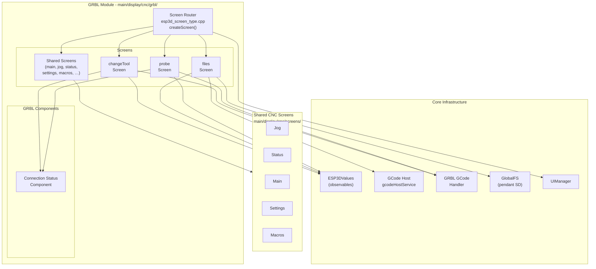
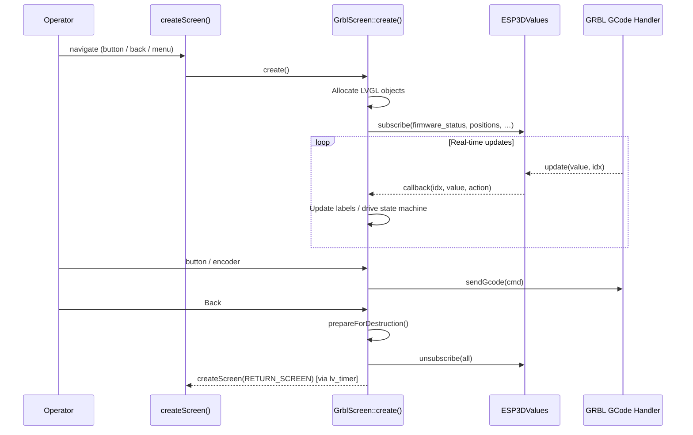
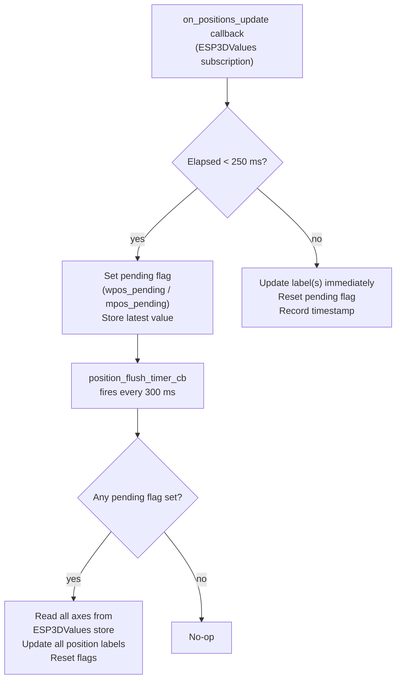
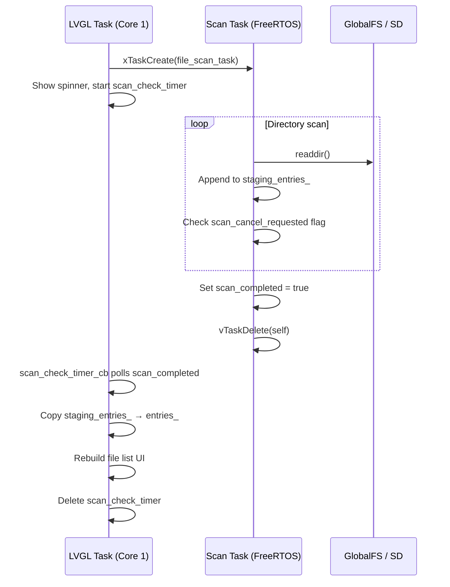

# GRBL Module

## Overview

The `grbl_module` is the **GRBL firmware-specific UI layer** of the Pibot CNC pendant. It provides a complete set of LVGL screens, a connection-status overlay component, and a centralized screen router — all tuned to the classic GRBL CNC controller protocol (not FluidNC or grblHAL).

Its responsibilities are:

- Parsing and reacting to GRBL status reports (`<Idle|MPos:…>`, `[PRB:…]`, `error:…`, etc.) via `ESP3DValues` subscriptions
- Displaying real-time machine state (positions, firmware status, pin states)
- Letting the operator interact with the machine: tool changes, probing, file streaming, settings
- Routing every screen-creation request to the correct `create()` function via a single `createScreen()` dispatcher

The module lives at `main/display/cnc/grbl/` and is compiled only when the GRBL CNC target is selected in the build system.

---

## Architecture Overview

### Key Architectural Constraints

| Constraint | Detail |
|---|---|
| **LVGL single-thread** | All UI operations run on Core 1. No LVGL calls from FreeRTOS scan tasks. |
| **Screen transitions via timer** | Destruction and creation use `lv_timer_create` to avoid destroying objects inside event callbacks (`ESP3D_TRANSITION_TIMER_BODY` macro). |
| **Value updates via subscriptions** | Screens subscribe to `ESP3DValues` observables; callbacks are dispatched by the GRBL GCode handler on the LVGL thread. |
| **Memory safety** | All heap allocations use `std::nothrow` with explicit `nullptr` checks. Probe parameters stored in `std::map` with static per-screen guard. |
| **Cooperative cancellation** | The async SD scan task checks a `scan_cancel_requested` flag inside its `readdir` loop — never force-killed. |

---

## Module Components

### 1. Screen Router

**File:** `main/display/cnc/grbl/screens/esp3d_screen_type.cpp`

Single `createScreen(ESP3DScreenType)` dispatcher that maps every `ESP3DScreenType` enum value to the corresponding `create()` function. It is the **only entry point** for screen navigation within the GRBL module, and applies compile-time feature guards (`ESP3D_WIFI_FEATURE`, `ESP3D_BT_SERIAL_FEATURE`, etc.) so unused screen types are excluded from the binary.

→ See [grbl_module_screen_router.md](grbl_module_screen_router.md)

---

### 2. Connection Status Component

**File:** `main/display/cnc/grbl/components/connection_status.h`

A lightweight LVGL overlay widget placed in the top-right corner of any screen that needs connection-state feedback. It subscribes to `server_status` and `transport_status` observables, derives a visual icon from the two-character status codes, and opens the `connection_status_screen` on click.

| Char | Meaning |
|---|---|
| `?` | Disconnected / not connected |
| `A` | Authentication failed |
| `T` | Connecting (transport or server handshake) |
| `C` | Connected — full CNC control active |
| `.` | Radio off |

→ See [grbl_module_connection_status.md](grbl_module_connection_status.md)

---

### 3. Change Tool Screen

**File:** `main/display/cnc/grbl/screens/change_tool_screen.cpp`

Operator interface for CNC tool changes. Supports two modes:

- **SET mode (M61Q)** — immediately sets the current tool number in firmware without movement.
- **CHANGE mode (M6T)** — full automated tool change via FluidNC `atc_manual` macro (moves to change position → pauses for operator to install the tool → slow-feed probe).

After an M61Q, the operator is offered an optional probe step via an integrated **Probe** button that hands off to the probe screen and returns the result.

State machine: `IDLE → MOVING_TO_CHANGE → WAITING_USER → PROBING → SUCCESS / FAILED / CANCELLED`

→ See [grbl_module_change_tool.md](grbl_module_change_tool.md)

---

### 4. Files Screen

**File:** `main/display/cnc/grbl/screens/files_screen.cpp`

File browser for the **local pendant SD card** (GRBL has no firmware-side SD). Key features:

- **Async directory scan** (FreeRTOS task) keeps the LVGL spinner animated while the SD card is read — zero LVGL calls in the task, zero filesystem calls in the LVGL thread.
- **Four file action modes** (Process/Macro/Rename/Delete) cycled via hardware switch or touch tap on the footer.
- **Job streaming** via `gcodeHostService.addStream()` — the GCode host sends lines using `ok` flow-control to the connected GRBL controller.
- Supports file extension filtering, macro tagging via `MacroManager`, rename, and delete.
- Redirect mechanism: after launching a job, the screen transitions to the Status screen via a deferred timer.

→ See [grbl_module_files.md](grbl_module_files.md)

---

### 5. Probe Screen

**File:** `main/display/cnc/grbl/screens/probe_screen.cpp`

CNC probe interface with a **four-step state machine**:

`PRE_CHECK → SEEK → RETRACT → FEED → APPLY_OFFSET`

Operator-configurable parameters per axis (offset, max-travel, retract distance, feedrate) are stored in a static `std::map` persisted across screen re-creations and edited via the shared `inputScreen`. Supports up to 6 axes (X Y Z A B C), grblHAL `|Pn:O` probe-disconnected detection, real-time pin indicators, and dynamic timeout calculation.

→ See [grbl_module_probe.md](grbl_module_probe.md)

---

## Data Flow: Screen Lifecycle

---

## Data Flow: Position Display Throttle

All GRBL screens showing MPos/WPos apply a shared throttle pattern (250 ms minimum interval) to avoid flooding the LVGL thread with 10 Hz position updates from the GRBL controller:

---

## Async SD Scan Pattern (Files Screen)

The files screen uses a strict two-layer ownership model to maintain thread safety between the FreeRTOS scan task and the LVGL UI thread:

**Rule**: The scan task **never** calls any `lv_*` function. The LVGL timer **never** calls any filesystem function.

---

## Relationships to Other Modules

| Module | Relationship |
|---|---|
| **fluidnc_module** | Sibling module for FluidNC firmware; identical screen structure, different GCode handler |
| **grblhal_module** | Sibling module for grblHAL firmware; adds UVW axes, `$376` naming, `|Pn:O` probe detection |
| **UI Framework & Screens** | Parent module; provides `GenericScreen`, `ListMenuScreen`, `UIManager`, shared CNC screens (main, jog, status, settings, macros) |
| **CNC Firmware Integration** | `ESP3DGCodeHandlerService` (GRBL target) parses controller responses and pushes values to `ESP3DValues`; `gcodeHostService` streams GCode files |
| **Core Platform & Infrastructure** | `ESP3DValues` observable system, `ESP3DSettings` (NVS), logging macros |
| **Storage & Configuration** | `GlobalFileSystem` used by files screen for SD listing, rename, delete |

---

## Sub-module Documentation Index

| Sub-module | Description | File |
|---|---|---|
| Screen Router | Centralized `createScreen()` dispatcher for all GRBL screens | [grbl_module_screen_router.md](grbl_module_screen_router.md) |
| Connection Status Component | Overlay widget tracking connection state with click-to-open | [grbl_module_connection_status.md](grbl_module_connection_status.md) |
| Change Tool Screen | M6T / M61Q tool change with state machine and optional probe | [grbl_module_change_tool.md](grbl_module_change_tool.md) |
| Files Screen | Pendant SD file browser with async scan and GCode job streaming | [grbl_module_files.md](grbl_module_files.md) |
| Probe Screen | 4-step CNC probe sequence with per-axis parameters and pin indicators | [grbl_module_probe.md](grbl_module_probe.md) |

## Documents de conception (depot)

- [fluidnc](https://github.com/luc-github/Pibot-cnc-pendant-firmware/blob/main/docs/ux_flows/fluidnc/)
