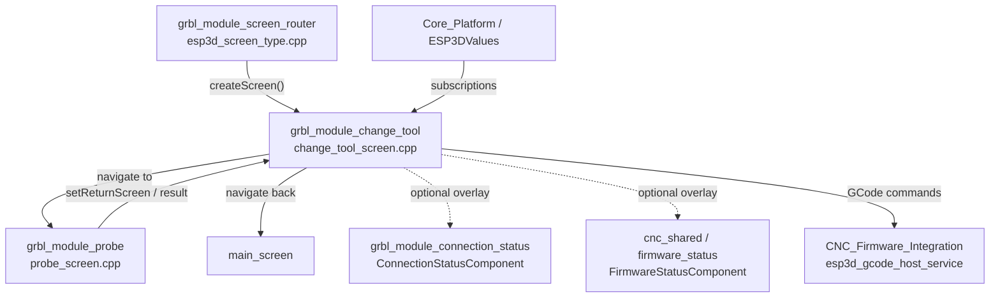
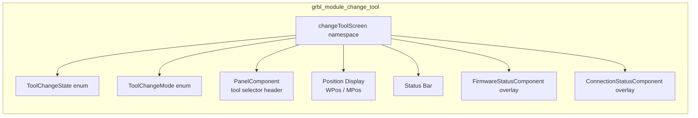
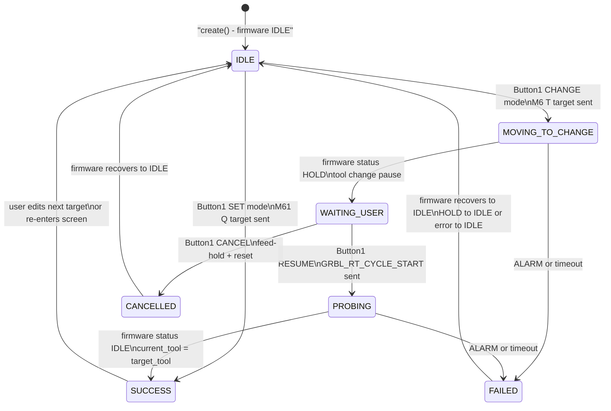
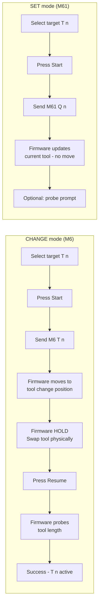
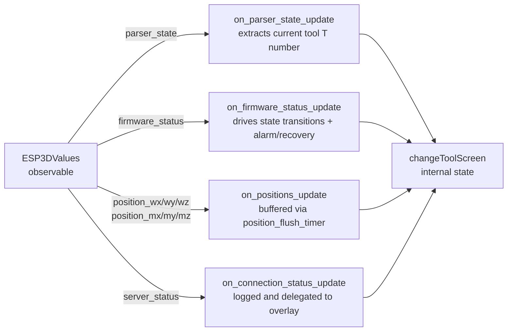
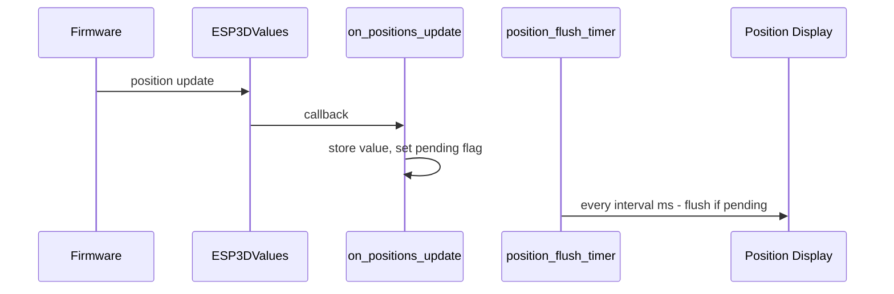
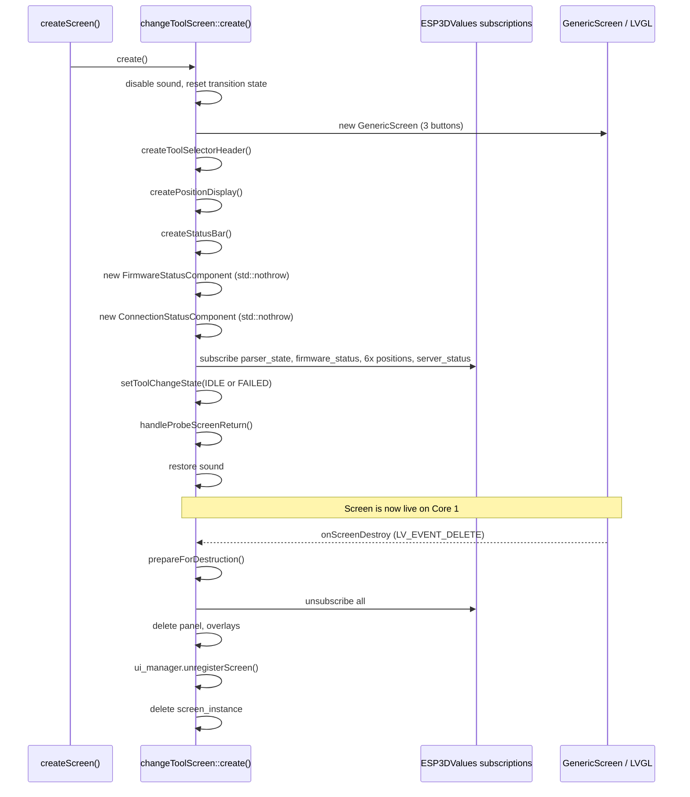
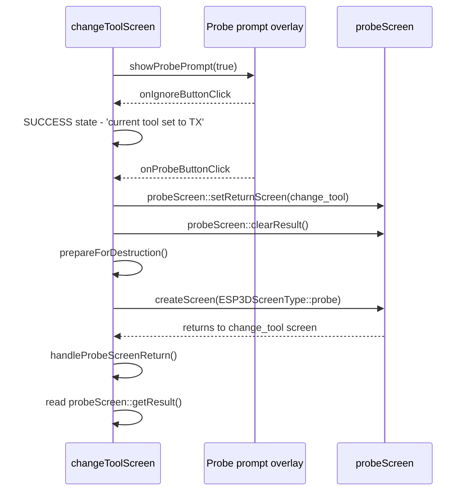
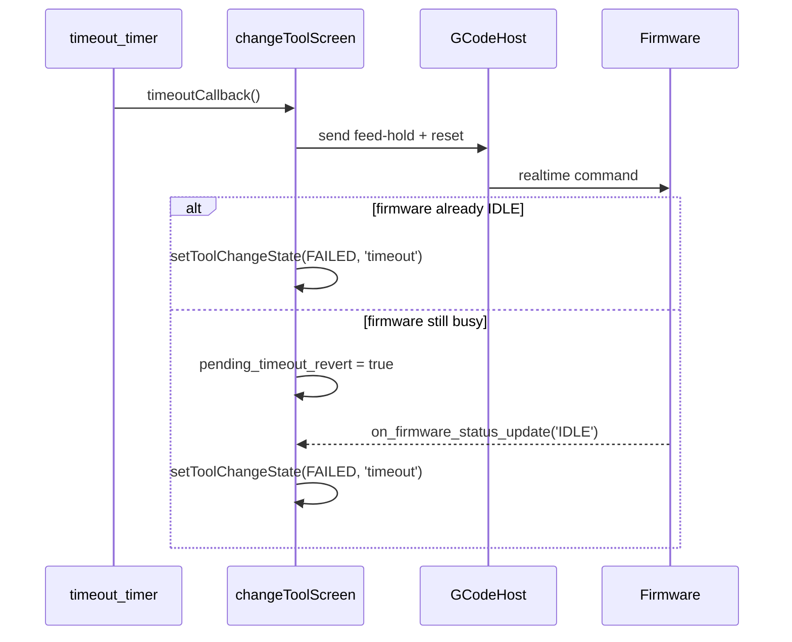
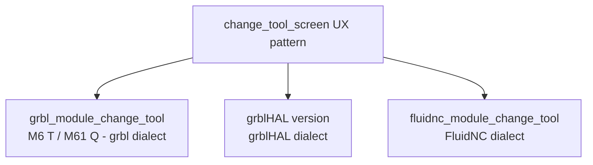

# grbl_module_change_tool

## Introduction

The `grbl_module_change_tool` module implements the **Tool Change screen** for the grbl CNC firmware target. It provides a complete user workflow for managing tool changes on a grbl-controlled CNC machine, supporting two distinct operation modes: a physical **CHANGE** (M6T) that pauses the firmware to let the operator physically swap the cutting tool, and a logical **SET** (M61Q) that updates the active tool number in firmware state without moving the machine.

The screen is LVGL-driven, runs on Core 1, and follows the same safe timer-based transition and lifecycle patterns used across the rest of the pendant UI. It subscribes to the `ESP3DValues` observable system for firmware state, parser state, and live machine positions; all updates are validated for change before touching LVGL objects.

**Source file:** `main/display/cnc/grbl/screens/change_tool_screen.cpp`  
**Screen type enum:** `ESP3DScreenType::change_tool`

---

## Architecture

### Module Position in the System

The screen is registered in the grbl screen router ([grbl_module_screen_router](grbl_module_screen_router.md)) alongside all other grbl-target screens. When the router receives `ESP3DScreenType::change_tool`, it delegates to `changeToolScreen::create()`.

---

## Component Structure

| Component | Role |
|-----------|------|
| `ToolChangeState` | Internal state machine — drives UI label, button labels, and allowed actions |
| `ToolChangeMode` | Selects the GCode to send — CHANGE (`M6 T<n>`) or SET (`M61 Q<n>`) |
| `PanelComponent` | Interactive header showing **Mode** and **Target tool** fields; encoder navigates/edits |
| Position display | Two-row live display of Work-Position (WPos) and Machine-Position (MPos) per axis |
| Status bar | Single-line text area reflecting the current state message |
| `FirmwareStatusComponent` | Optional overlay — shows firmware alarm/busy state; shared across CNC screens |
| `ConnectionStatusComponent` | Optional overlay — shows transport link health; tappable to open connection status screen |

---

## State Machine

The tool change lifecycle is modelled as an explicit state machine. The current state drives which actions the centre button exposes (Start / Resume / Cancel) and whether the panel and back button are accessible.

### States Reference

| State | Meaning | Centre Button Label |
|-------|---------|---------------------|
| `IDLE` | Ready to start | **Start** |
| `MOVING_TO_CHANGE` | M6 command sent; firmware moving to change position | **Cancel** |
| `WAITING_USER` | Firmware halted (HOLD); operator swaps tool manually | **Resume** |
| `PROBING` | Firmware probing tool length after resume | **Cancel** |
| `SUCCESS` | Tool change confirmed; `current_tool` updated | **Start** (next change) |
| `FAILED` | Error, alarm, timeout, or same-tool detected | **Start** (retry) |
| `CANCELLED` | User cancelled; firmware being reset | *(disabled)* |

---

## Tool Change Modes

The active mode is toggled by pressing **OK (Button 0)** while the **Mode** panel item is focused.

---

## Button Layout

The screen uses three hardware/virtual buttons mapped to `GenericScreen`:

| Button | Physical ID | Normal label | Context-sensitive behaviour |
|--------|-------------|-------------|-----------------------------|
| **OK** | Button 0 | OK icon | Toggle Mode field OR toggle encoder editing on Target field |
| **Change / Action** | Button 1 | Change icon | Start / Resume / Cancel depending on `current_state` |
| **Back** | Button 2 | Back icon | Navigate to return screen (blocked during active operations and probe decision) |

### Button 1 Behaviour by State

| `current_state` | Button 1 action | GCode / command sent |
|-----------------|-----------------|----------------------|
| `IDLE` + CHANGE mode | **Start** tool change | `M6 T<target>` |
| `IDLE` + SET mode | **Set** current tool | `M61 Q<target>` |
| `WAITING_USER` | **Resume** (cycle start) | `GRBL_RT_CYCLE_START` (realtime, high priority) |
| `MOVING_TO_CHANGE` or `PROBING` | **Cancel** | feed-hold + reset sequence |

---

## Data Flow

### Value Subscriptions

### Position Update Throttling

Position values arrive at high frequency from the firmware. A dedicated LVGL timer (`position_flush_timer`) coalesces updates and writes to the display at most every `POSITION_DISPLAY_MIN_INTERVAL_MS + 50 ms`. Pending flags (`wpos_update_pending`, `mpos_update_pending`) track dirty state between ticks.

### `on_firmware_status_update` Transition Logic

This is the primary driver of the state machine. It handles four categories of event:

1. **`MOVING_TO_CHANGE` → HOLD detected** → transition to `WAITING_USER` (operator must swap tool)
2. **`WAITING_USER` → RUN detected** → transition to `PROBING` (firmware is now probing)
3. **`PROBING` → IDLE detected** → transition to `SUCCESS`; `current_tool` set to `target_tool`
4. **ALARM detected (any non-editable state)** → revert tool in firmware; transition to `FAILED`
5. **HOLD→IDLE or error→IDLE recovery** → transition back to `IDLE` or `FAILED` (same-tool guard)

---

## Screen Lifecycle

### Destruction Guard

The module uses the project-standard `ESP3D_TRANSITION_*` macros to guard against double-free and premature destruction:

- `is_prepared_for_destruction` — set before any navigation starts; suppresses subscription callbacks.
- `cleanup_timer` + `transition_timer` — two-phase LVGL timer sequence: `cleanup_timer_cb` finalises teardown, then `transition_timer_cb` calls `createScreen()` for the next screen.
- Back navigation is blocked while `current_state` is `MOVING_TO_CHANGE`, `WAITING_USER`, or `PROBING`, and while `awaiting_probe_decision` is true.

---

## Probe Screen Integration

When a `SET` (M61Q) operation succeeds and an optional probe step is desired, the screen presents an in-screen prompt offering two choices:

- **Probe** — navigates to `grbl_module_probe` with the change tool screen set as the return target.
- **Ignore** — dismisses the prompt and stays on the SUCCESS state.

---

## Panel Component — Tool Selector

The header area is an interactive `PanelComponent` with two items:

| Panel Item | ID | Content | Encoder interaction |
|-----------|-----|---------|---------------------|
| **Mode** | `ITEM_ID_MODE` | `CHANGE` or `SET` text | Not encoder-editable; toggled with OK button |
| **Target** | `ITEM_ID_TARGET` | `T<n>` target tool number | Encoder increments/decrements value in editing mode |

The encoder transitions between **navigation mode** (focus moves between items) and **editing mode** (encoder changes the focused item's value) via `panel_component->enableEncoderFor()`. The target tool value is persisted in `saved_target_tool` across screen re-creation (e.g., returning from the probe screen).

---

## Timeout Handling

A watchdog `timeout_timer` is started when `MOVING_TO_CHANGE` begins. If firmware does not reach `HOLD` within the configured timeout:

The `pending_timeout_revert` flag is a deferred-failure mechanism: if the firmware is not yet IDLE when the timeout fires, the FAILED state is applied on the next IDLE transition instead, avoiding a race between the timer and the firmware status callback.

---

## Parser State — Current Tool Extraction

`on_parser_state_update` parses the grbl `$G`/`$I` style parser state string to extract the active tool number (`T<n>`), keeping `current_tool` in sync with what the firmware reports. Updates are applied only when `current_state` is an editable state (IDLE, SUCCESS, FAILED, CANCELLED) to avoid overwriting an in-progress operation.

---

## Dependencies

| Dependency | Module reference | Used for |
|-----------|-----------------|----------|
| `GenericScreen` | [common_screens](common_screens.md) | Screen container + 3-button virtual button bar |
| `PanelComponent` | [ui_components](ui_components.md) | Interactive mode/target selector with encoder support |
| `FirmwareStatusComponent` | [cnc_shared](cnc_shared.md) | Optional firmware alarm overlay |
| `ConnectionStatusComponent` | [grbl_module_connection_status](grbl_module_connection_status.md) | Optional transport health overlay |
| `probeScreen` | [grbl_module_probe](grbl_module_probe.md) | Optional post-SET probe workflow |
| `ESP3DValues` / `esp3dXValues` | [values](values.md) | Observable system for firmware state, positions, connection |
| `ESP3DGCodeHostService` | [gcode_host](gcode_host.md) | Sending M6, M61, real-time cycle-start, feed-hold commands |
| `ESP3DTranslationService` | [translations](translations.md) | All user-visible status messages |
| `UIManager` / `ui_manager` | [ui_core](ui_core.md) | Screen registration, orientation angle |
| `createScreen()` router | [grbl_module_screen_router](grbl_module_screen_router.md) | Screen transitions to/from change_tool |

---

## Relationship to Parallel Implementations

The grbl change tool screen is one of three parallel implementations sharing the same UX design:

All three implement identical state machines and UX flows. The grbl variant uses grbl-specific GCode commands (`M6 T<n>`, `M61 Q<n>`, `GRBL_RT_CYCLE_START`) and parses grbl's status response format. See [fluidnc_module_change_tool](fluidnc_module_change_tool.md) for the FluidNC equivalent.

---

## LVGL Constraints

- All UI operations (object creation, event callbacks, timer callbacks) run on **Core 1** in the LVGL task context — never from communication or GCode host tasks.
- The `position_flush_timer` coalesces high-frequency position updates so the LVGL task is not overloaded by direct `lv_label_set_text` calls on every firmware status poll.
- Screen destruction is deferred via `cleanup_timer` / `transition_timer` to avoid deleting LVGL objects inside event callbacks.
- All heap allocations for overlay components use `std::nothrow`; allocation failure downgrades the overlay to absent rather than crashing the firmware.

---

## Memory Notes

- `screen_instance` (`GenericScreen*`), `panel_component`, `firmware_status_component`, and `connection_status_component` are heap-allocated with `new (std::nothrow)`.
- `last_firmware_state` is a `std::string` used only in non-critical update paths; not on hot paths.
- Static state variables (`current_tool`, `target_tool`, `saved_target_tool`, `returning_from_probe`, etc.) are module-scoped statics. They persist across screen re-creation within the same firmware session so that navigating away to the probe screen and returning does not lose the user's tool selection or operation context.

## Documents de conception (depot)

- [change_tool_screen](https://github.com/luc-github/Pibot-cnc-pendant-firmware/blob/main/docs/ux_flows/fluidnc/change_tool_screen.md)
