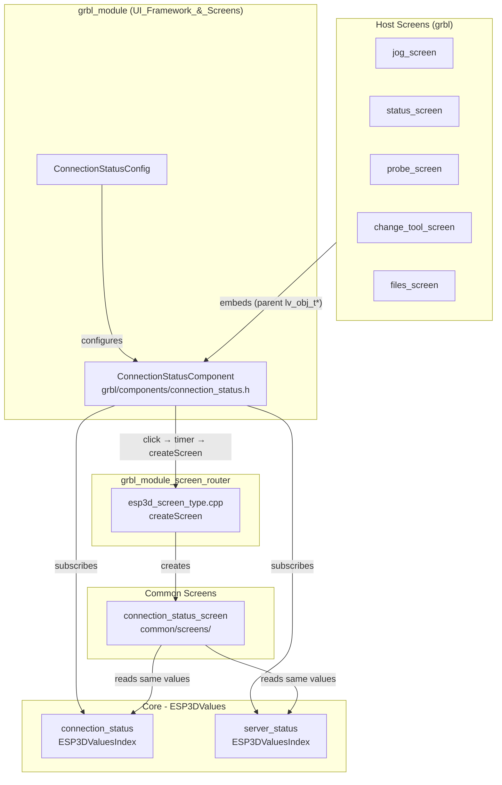
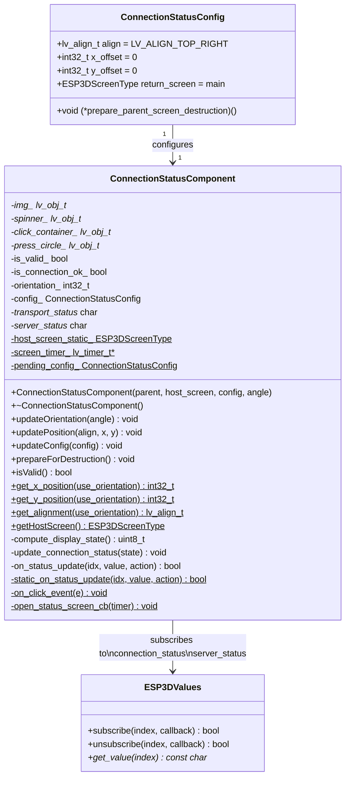
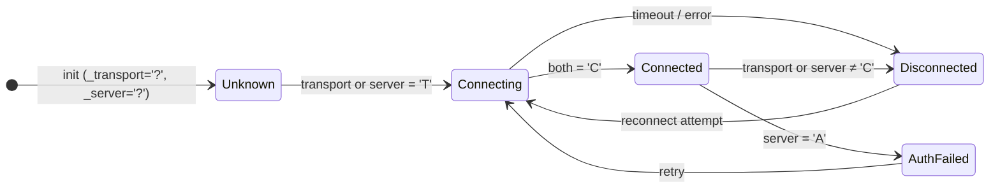
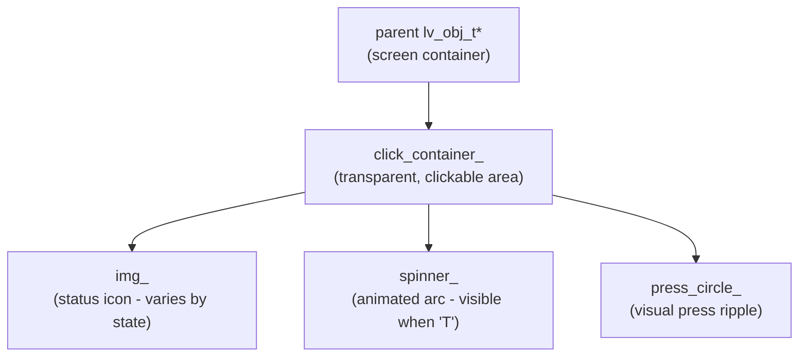
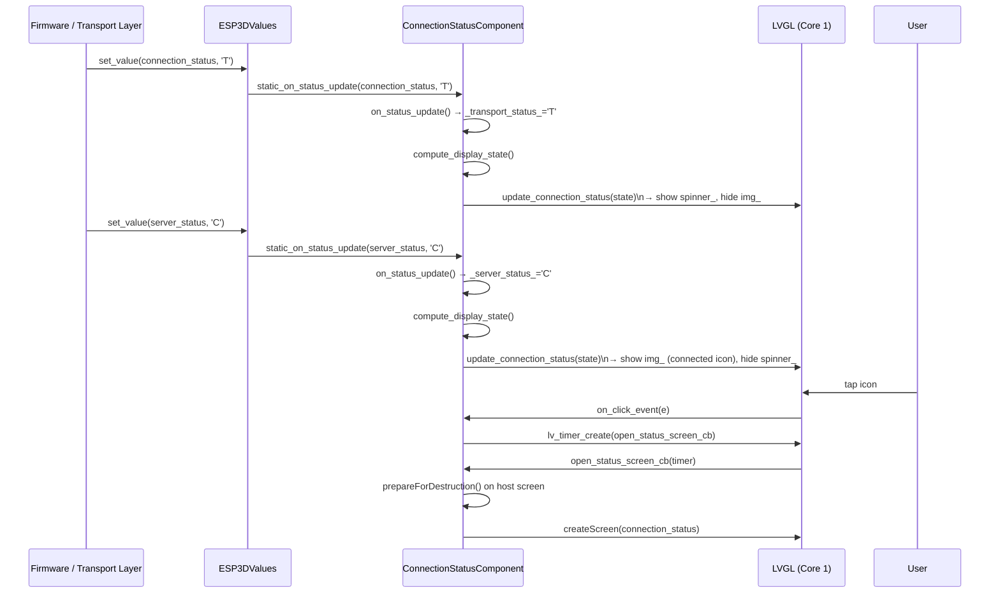
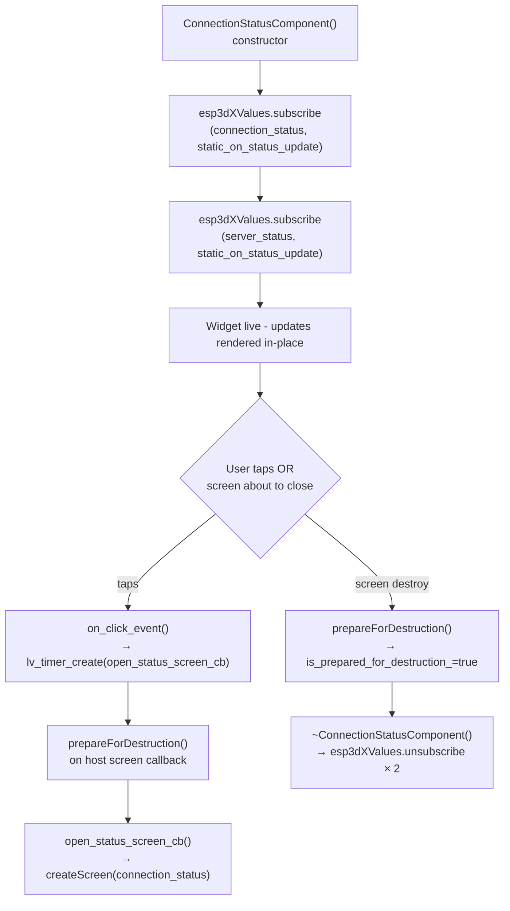
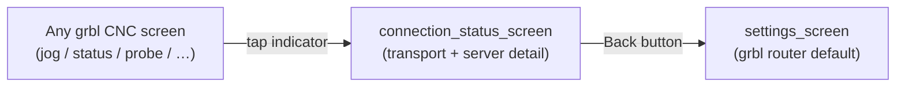

# grbl_module_connection_status

## Introduction

`grbl_module_connection_status` is the grbl-firmware-specific **connection status indicator widget**. It is a compact, clickable LVGL component displayed in the top-right corner of CNC screens. The widget reflects the live connection state between the pendant and a grbl CNC controller by combining two independent status signals (transport layer + server/application layer) into a single icon, and opens the full [connection_status_screen](connection_status_screen.md) when the user taps it.

**Source file:** `main/display/cnc/grbl/components/connection_status.h`

---

## Architecture Overview

The component sits at the intersection of the UI layer and the reactive value system. It owns its own LVGL objects, subscribes directly to `ESP3DValues` for live updates, and delegates detailed connection management to a dedicated full-screen view.



---

## Component Relationship Diagram



---

## Connection State Reference

The component tracks two independent status characters, each delivered via `ESP3DValues`:

| `ESP3DValuesIndex`   | Character | Meaning                                        |
|----------------------|-----------|------------------------------------------------|
| `connection_status`  | `U`       | Unknown / initializing                         |
| `connection_status`  | `T`       | Transport connecting (WiFi assoc, BT pairing…) |
| `connection_status`  | `C`       | Transport connected                            |
| `connection_status`  | `?`       | Transport disconnected / not configured        |
| `connection_status`  | `.`       | Radio off                                      |
| `server_status`      | `T`       | Server/application handshake in progress       |
| `server_status`      | `C`       | Server connected — full CNC control            |
| `server_status`      | `A`       | Authentication failed                          |
| `server_status`      | `?`       | Server disconnected                            |

The private method `compute_display_state()` merges both characters into a single `uint8_t` icon selector passed to `update_connection_status()`. The displayed state follows a **worst-case priority**: any non-`C` condition in either layer drives the indicator to a degraded state. Only when **both** transport and server are `C` does the component show a fully connected icon.



**Visual feedback while `Connecting` (`T`):** the `spinner_` LVGL object is made visible; it is hidden for all other states.

---

## LVGL Object Hierarchy



- `click_container_` is sized to the icon area and receives `LV_EVENT_CLICKED` → routed to `on_click_event`.
- `img_` displays the composite state icon (connected / disconnected / auth-failed / radio-off).
- `spinner_` replaces the icon with an animated arc during `T` (connecting) state.
- `press_circle_` provides tactile-style press feedback.

---

## Data Flow



**Thread-safety note:** `static_on_status_update` is invoked from `ESP3DValues::handle()`, which runs on the LVGL task (Core 1). All subsequent LVGL calls inside the callback are therefore safe without additional locking. The timer-based screen transition (`open_status_screen_cb`) defers the screen creation to the next LVGL tick — this matches the safe screen-transition pattern mandated in [`docs/architecture/screen_transitions_flow.md`](https://github.com/luc-github/Pibot-cnc-pendant-firmware/blob/main/docs/architecture/screen_transitions_flow.md).

---

## Subscription Lifecycle



The static callback (`static_on_status_update`) delegates to the instance method `on_status_update` via the static `host_screen_static_` pointer. Because `static_on_status_update` is registered as the subscription callback, it remains valid even after intermediate screen transitions — the `is_prepared_for_destruction_` guard prevents acting on a destroyed widget.

---

## Public API Reference

### `ConnectionStatusConfig`

```cpp
struct ConnectionStatusConfig {
    lv_align_t align = LV_ALIGN_TOP_RIGHT;          // LVGL anchor point
    int32_t    x_offset = 0;                         // Horizontal offset from anchor
    int32_t    y_offset = 0;                         // Vertical offset from anchor
    ESP3DScreenType return_screen = ESP3DScreenType::main; // Screen to return to from detail view
    void (*prepare_parent_screen_destruction)(void) = nullptr; // Called before navigating away
};
```

| Field | Default | Purpose |
|-------|---------|---------|
| `align` | `LV_ALIGN_TOP_RIGHT` | LVGL alignment anchor for the component |
| `x_offset` | `0` | Horizontal pixel offset from the anchor |
| `y_offset` | `0` | Vertical pixel offset from the anchor |
| `return_screen` | `ESP3DScreenType::main` | Return destination after closing `connection_status_screen` |
| `prepare_parent_screen_destruction` | `nullptr` | Optional hook called before the host screen is torn down during navigation |

### `ConnectionStatusComponent`

#### Constructor

```cpp
ConnectionStatusComponent(lv_obj_t *parent,
                          ESP3DScreenType host_screen,
                          const ConnectionStatusConfig& config,
                          int32_t angle = 0);
```

| Parameter | Description |
|-----------|-------------|
| `parent` | LVGL object to parent the widget to (typically `screen_instance_->getContainer()`) |
| `host_screen` | Identifies the calling screen; stored in `host_screen_static_` for screen-router callbacks |
| `config` | Positioning and navigation configuration |
| `angle` | Initial orientation angle (0°, 90°, 180°, 270°) from `ui_manager.getOrientationAngle()` |

#### Instance Methods

| Method | Description |
|--------|-------------|
| `updateOrientation(angle)` | Re-positions the widget for a new display rotation |
| `updatePosition(align, x, y)` | Moves the widget to a new LVGL anchor/offset without rebuilding objects |
| `updateConfig(config)` | Replaces the stored config (affects next click navigation) |
| `prepareForDestruction()` | Sets the destruction guard; must be called before the host screen's LVGL objects are deleted |
| `isValid()` | Returns `true` if the component was successfully constructed |

#### Static Helpers

| Method | Description |
|--------|-------------|
| `get_x_position(use_orientation)` | Returns the canonical x offset adjusted for orientation |
| `get_y_position(use_orientation)` | Returns the canonical y offset adjusted for orientation |
| `get_alignment(use_orientation)` | Returns the canonical LVGL alignment for orientation |
| `getHostScreen()` | Returns the `ESP3DScreenType` of the currently active host screen |

---

## Integration Pattern

Host screens in the grbl module embed this component as a member. The typical usage pattern is:

```cpp
// In screen creation (e.g., jog_screen, status_screen, probe_screen)
ConnectionStatusConfig css_cfg;
css_cfg.align         = ConnectionStatusComponent::get_alignment();
css_cfg.x_offset      = ConnectionStatusComponent::get_x_position();
css_cfg.y_offset      = ConnectionStatusComponent::get_y_position();
css_cfg.return_screen = ESP3DScreenType::jog;           // this screen
css_cfg.prepare_parent_screen_destruction = prepareForDestruction;  // host screen cleanup

connection_status_ = new ConnectionStatusComponent(
    container,
    ESP3DScreenType::jog,
    css_cfg,
    ui_manager.getOrientationAngle()
);

// In screen destruction
if (connection_status_) {
    connection_status_->prepareForDestruction();
    delete connection_status_;
    connection_status_ = nullptr;
}
```

The widget is embedded in the following grbl screens:

| Screen | Effect of connection state on that screen |
|--------|-------------------------------------------|
| `jog_screen` | `systemSetLockState` toggled; axis display delayed 1 s on reconnect |
| `status_screen` | `systemSetLockState` toggled; action area state updated |
| `probe_screen` | `systemSetLockState` toggled; axis count refresh triggered |
| `change_tool_screen` | Log only (no lock effect) |
| `files_screen` | Used for job launch gating |
| `main_screen` | Lock button visibility and state driven by `server_status` |

---

## Screen Navigation on Click

When the user taps the indicator, the component:

1. Plays a selection beep (`ESP3D_SELECTION_BEEP`).
2. Creates a one-shot `lv_timer_t` (`screen_timer_`) to defer the transition to the next LVGL tick.
3. In `open_status_screen_cb`, calls `prepare_parent_screen_destruction` (if set) then invokes `createScreen(ESP3DScreenType::connection_status)`.
4. The grbl screen router (`esp3d_screen_type.cpp::createScreen`) instantiates `connectionStatusScreen` with `return_screen = ESP3DScreenType::settings`.



> **Note:** The `return_screen` in `ConnectionStatusScreenConfig` is set to `ESP3DScreenType::settings` by the grbl screen router, overriding whatever `return_screen` was set in the host's `ConnectionStatusConfig`. This is consistent across grbl, grblHAL, and FluidNC routers.

---

## Orientation Awareness

The component adapts its position for all four display rotations. The three static helpers (`get_alignment`, `get_x_position`, `get_y_position`) query `ui_manager.getOrientationAngle()` internally when `use_orientation = true` (default), so callers can use them directly in screen creation without storing the angle separately. Passing `false` returns the canonical un-rotated value (useful for resetting to defaults).

---

## Counterpart Modules

This component has structurally **identical** counterparts for the other supported firmware targets. The interface, lifecycle, and state machine are the same across all three:

| Module | File | Firmware |
|--------|------|----------|
| `grbl_module_connection_status` *(this module)* | `main/display/cnc/grbl/components/connection_status.h` | grbl |
| `fluidnc_module_connection_status` | `main/display/cnc/fluidnc/components/connection_status.h` | FluidNC |
| grblHAL (embedded in `grblhal_module`) | `main/display/cnc/grblhal/components/connection_status.h` | grblHAL |

Firmware-specific differences, if any, are isolated to the `.cpp` implementation file (not the header), specifically in `compute_display_state()` and how `update_connection_status()` maps states to icons.

---

## Dependencies

| Dependency | Role |
|------------|------|
| `lvgl` | LVGL UI rendering and event system |
| [ESP3DValues](values.md) | Observable value system — delivers `connection_status` and `server_status` updates |
| `screens/esp3d_screen_type.h` | `ESP3DScreenType` enum for navigation targets |
| [connection_status_screen](connection_status_screen.md) | Full-screen detail view opened on tap |
| [UIManager](ui_core.md) | Orientation angle, style application, screen registration |
| [grbl_module_screen_router](grbl_module_screen_router.md) | `createScreen()` — instantiates `connection_status_screen` |

---

## Key Constraints

- **LVGL thread only.** All methods must be called from the LVGL task (Core 1). The subscription callback `static_on_status_update` is already guaranteed to run on Core 1 via `ESP3DValues::handle()`.
- **No blocking.** Screen transitions use `lv_timer_create` — never call `createScreen` directly inside an event callback.
- **`prepareForDestruction()` is mandatory** before deleting the component or before the parent screen's LVGL objects are freed, to prevent the subscription callback from acting on dangling pointers.
- **Static members are global per-firmware-target.** Because `host_screen_static_`, `screen_timer_`, and `pending_config_` are `static`, only one `ConnectionStatusComponent` instance may be active per firmware module at a time. This is enforced by the screen architecture — each firmware module has exactly one active screen at any given moment.
