# grbl_module_files

## Overview

The `grbl_module_files` module implements the **Files screen** for the GRBL CNC firmware target. It provides a touch- and encoder-driven interface for browsing the **local pendant SD card**, launching G-code jobs, managing macros, renaming files, and deleting files.

> **GRBL distinction**: Unlike FluidNC (see [fluidnc_module_files.md](fluidnc_module_files.md)), GRBL exposes no firmware-side SD card or file-listing protocol. All file operations therefore target the pendant's own SD card, and jobs are streamed line-by-line by the G-code host rather than triggered remotely.

**Source file**: `main/display/cnc/grbl/screens/files_screen.cpp`  
**Namespace**: `filesScreen`  
**Parent module**: [grbl_module.md](grbl_module.md) → [UI_Framework_&_Screens](UI_Framework_and_Screens.md)

---

## Table of Contents

1. [Purpose and Scope](#purpose-and-scope)
2. [Architecture Overview](#architecture-overview)
3. [Key Data Structures](#key-data-structures)
4. [Component Interaction Diagram](#component-interaction-diagram)
5. [Async File Scan Subsystem](#async-file-scan-subsystem)
6. [File Action Modes](#file-action-modes)
7. [Screen Lifecycle](#screen-lifecycle)
8. [Navigation and Transition Flow](#navigation-and-transition-flow)
9. [Data Flow](#data-flow)
10. [State Machine](#state-machine)
11. [Memory Safety Patterns](#memory-safety-patterns)
12. [Dependencies](#dependencies)
13. [Related Modules](#related-modules)

---

## Purpose and Scope

`grbl_module_files` is responsible for:

| Responsibility | Details |
|---|---|
| **SD browsing** | Lists files and directories from the pendant's local SD via `globalFs` |
| **Job launching** | Streams G-code files line-by-line to GRBL via `gcodeHostService.addStream()` |
| **Extension filtering** | Accepts only files matching the configured extension list (`esp3d_files_extensions` NVS setting) |
| **Directory navigation** | Navigates into subdirectories and back to parent with live path tracking |
| **File operations** | Rename and delete files (directories are navigation-only) |
| **Macro management** | Tags/untags files as macros via `macroManager`; saves on mode exit or screen leave |
| **Action mode switching** | Switches between four operation modes via hardware switch or touch footer zone |
| **Async scanning** | Runs the SD `readdir` loop in a separate FreeRTOS task so the LVGL spinner stays animated |

---

## Architecture Overview

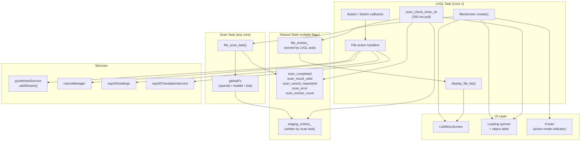

The design enforces a strict **two-thread separation**:

- The **scan task** writes only to `staging_entries_` and volatile flag variables.
- The **LVGL task** reads `staging_entries_` only after `scan_completed` is set (sequenced handoff), then atomically swaps it into `file_entries_`.
- LVGL widget calls are **never** made from the scan task.

---

## Key Data Structures

### `FileEntry`

Represents a single item in the file listing.

```cpp
struct FileEntry {
    std::string name;   // Display name (filename or "..")
    std::string size;   // File size as decimal string; empty for non-files
    enum class Type : uint8_t {
        File,    // Regular file matching the extension filter
        Dir,     // Subdirectory — navigation only
        Parent,  // ".." entry — go up one level
        Info,    // Non-selectable informational row ("Loading…", "No files")
        Error    // Non-selectable error row ("No SD card", "SD card error")
    } type;
};
```

`Info` and `Error` entries are tagged non-selectable via `ui_manager.tagListNodeNonSelectable()` so the user cannot accidentally act on them.

### `FileListState`

Tracks the async scan lifecycle, visible only to the LVGL task:

| State | Meaning |
|---|---|
| `Idle` | No scan running, or list explicitly cleared |
| `Done` | Scan completed successfully; `file_entries_` is populated |
| `Error` | Scan failed (no SD card, or directory open error) |

### `FileActionMode`

Controls what happens when a file entry is selected or the OK button is pressed:

| Value | Switch pos. | Symbol | Action |
|---|---|---|---|
| `Process_file` | 0 | `LV_SYMBOL_DRIVE` | Launch job via gcode host |
| `Set_as_macro` | 1 | `ESP3D_SYMBOL_ROBOT` | Show file info / toggle macro flag |
| `Rename_file` | 2 | `LV_SYMBOL_EDIT` | Open rename input screen |
| `Delete_file` | 3 | `LV_SYMBOL_TRASH` | Confirm and delete the file |

The active mode is always reflected in the footer text (symbol + translated label).

### Async Scan State Variables

| Variable | Written by | Read by | Role |
|---|---|---|---|
| `staging_entries_` | scan task | LVGL task (after handoff) | Intermediate scan buffer |
| `file_entries_` | LVGL task only | LVGL task only | Live, displayed list |
| `scan_completed` *(volatile)* | scan task | LVGL task | Completion signal |
| `scan_result_valid` *(volatile)* | scan task | LVGL task | Whether the scan succeeded |
| `scan_cancel_requested` *(volatile)* | LVGL task | scan task | Cooperative stop signal |
| `scan_error` *(volatile)* | scan task | LVGL task | Error type on failure |
| `scan_entries_count` *(volatile)* | scan task | LVGL task | Real-time counter for spinner label |
| `pending_rescan` | LVGL task | LVGL task (timer) | Re-scan needed after cooperative cancel |

---

## Component Interaction Diagram

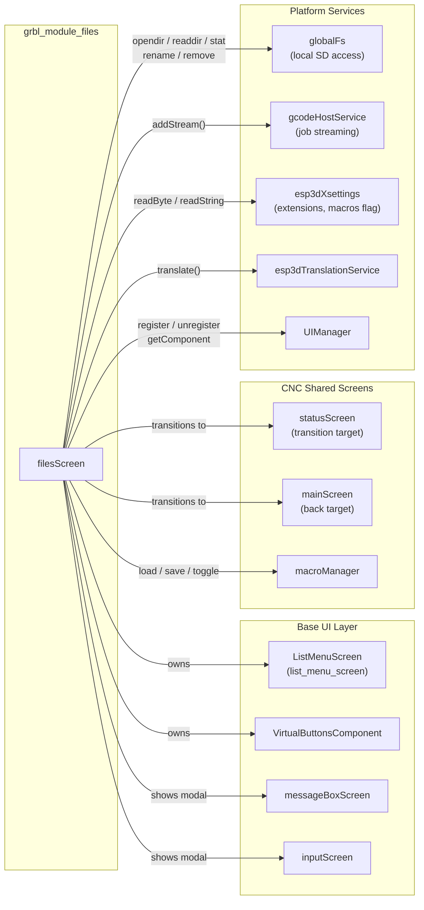

---

## Async File Scan Subsystem

The scan subsystem mirrors the pattern established by `languages_screen` but adds **cooperative cancellation** to handle fast directory navigation without force-killing a task that might hold a filesystem lock.

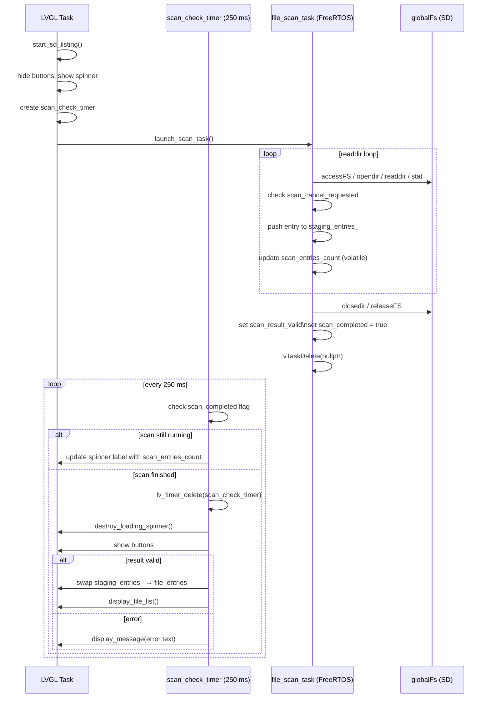

### Cooperative Cancellation Flow

When the user navigates into a subdirectory while a scan is still running:

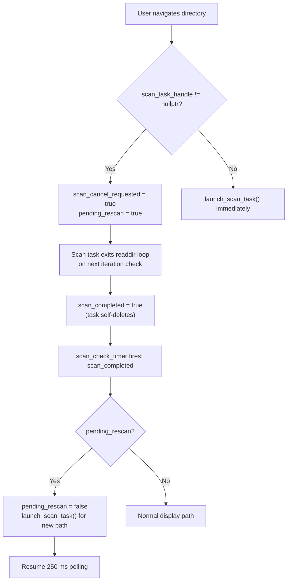

> **Why cooperative, not forced?** `vTaskDelete` on a task mid-`accessFS` could leave the filesystem mutex held, deadlocking future SD access. The task checks `scan_cancel_requested` itself, closes the directory cleanly, then terminates.

---

## File Action Modes

Mode selection is driven by hardware switch events (`LV_EVENT_SWITCH_PRESSED`) or, when `ESP3D_HARDWARE_SWITCH_FEATURE` is not defined, by a touch-enabled footer zone that cycles through the four states.

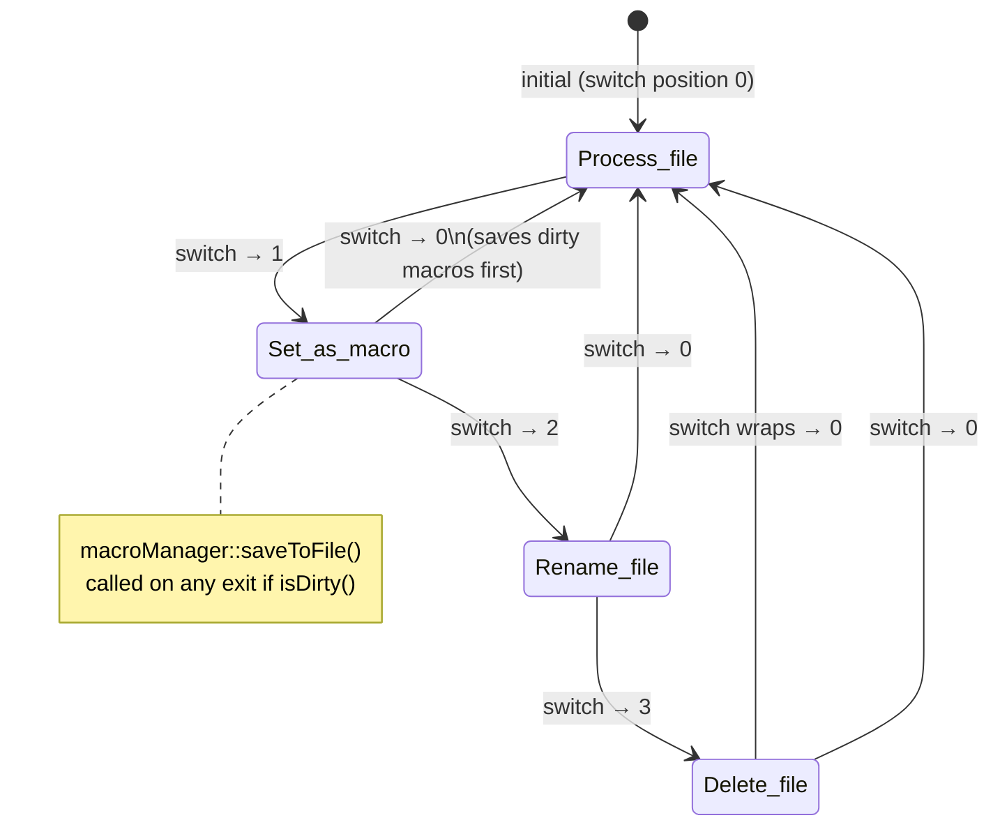

### Per-Mode Behavior on File Click

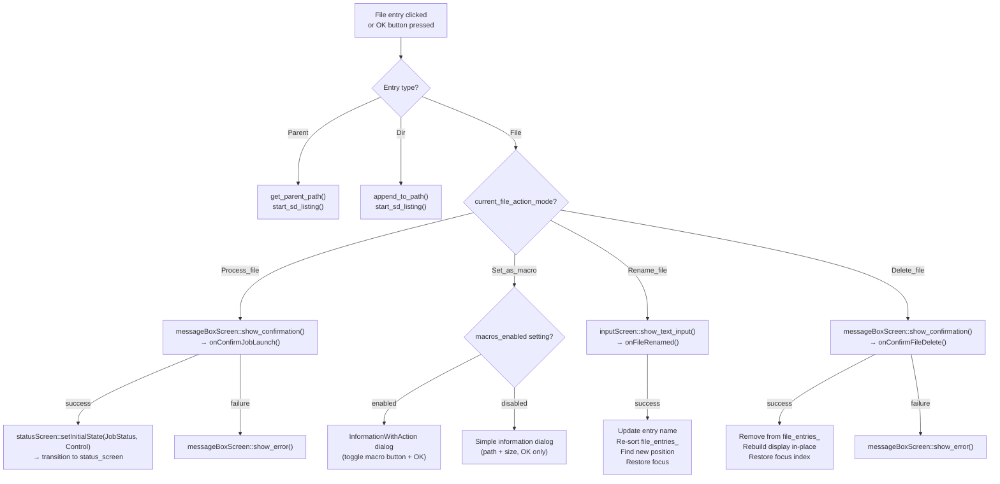

### Directory vs. File Operation Matrix

| Operation | File | Directory | Parent (`..`) |
|---|---|---|---|
| Process (run job) | ✅ Confirmation → stream | ❌ Error beep | ❌ |
| Set as macro | ✅ Info dialog + toggle | ❌ Error beep | ❌ |
| Rename | ✅ Text input screen | ❌ Error beep | ❌ |
| Delete | ✅ Confirmation → delete | ❌ Error beep | ❌ |
| Click (any mode) | Per mode above | ✅ Navigate into | ✅ Navigate out |

---

## Screen Lifecycle

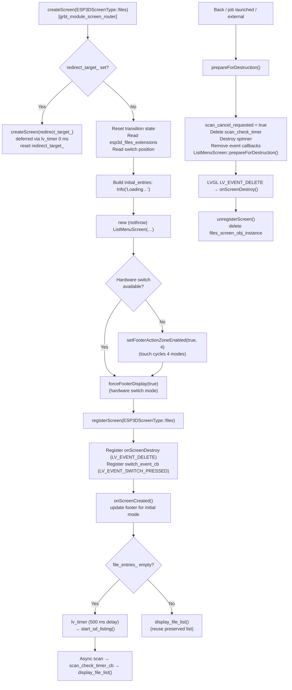

### Key Lifecycle Invariant

`file_entries_` is **never cleared** in `prepareForDestruction()`. The list persists across modal transitions (confirm dialog → cancel → back to files screen) so the user's scroll position and file content are preserved without a costly re-scan. The list is only cleared by:

| Trigger | Function |
|---|---|
| User clicks **Refresh** button | `onRefreshButtonRelease()` |
| New scan starts (including after dir navigation) | `start_sd_listing()` |

---

## Navigation and Transition Flow

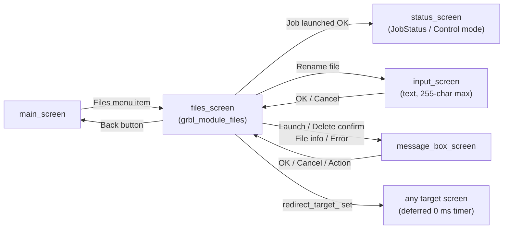

The `redirect_target_` mechanism allows other screens to request a post-files redirect: `setRedirectTarget(target)` stores the target; `create()` detects it, resets the flag, and schedules `createScreen(target)` via a zero-delay `lv_timer`. This prevents nested creation calls.

---

## Data Flow

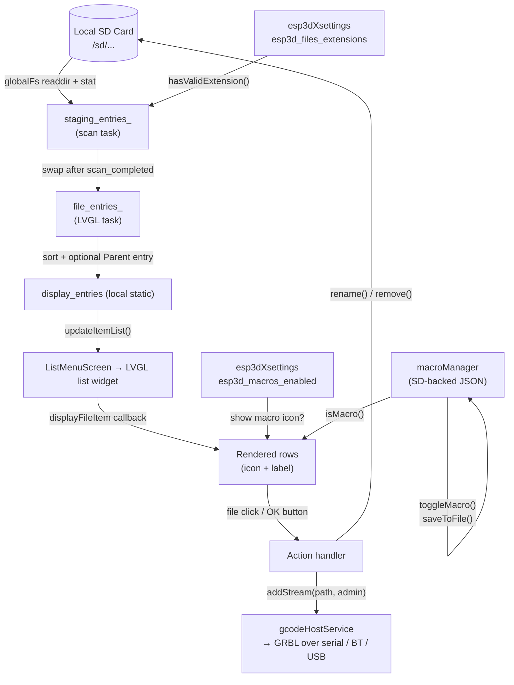

### Extension Filtering

`esp3d_files_extensions` contains a semicolon-delimited list (e.g., `gcode;gco;nc;tap;txt`). The scan task calls `hasValidExtension()` for each `DT_REG` entry using **exact token matching** with sentinel semicolons, preventing partial matches (e.g., `g` would not match `gco`). Comparison is case-insensitive. The special value `*` bypasses filtering and accepts all files.

### Entry Sort Order

After scan completion `file_entries_` is sorted by `compareFileEntries()`:

1. `Parent` always first
2. `Error` / `Info` second (preserve insertion order)
3. `File` before `Dir` (files are the primary content)
4. Within the same type: case-insensitive alphabetical (`strcasecmp`)

---

## State Machine

### Full Screen State

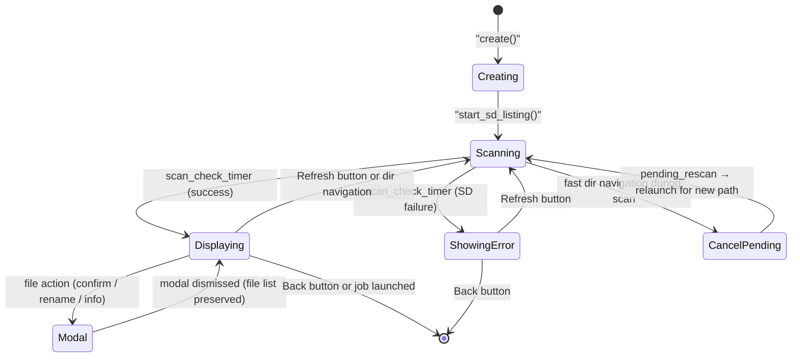

### In-Place Deletion Update

Rather than rescanning after a successful deletion, the module performs an optimistic local update to avoid the latency of a full SD re-scan:

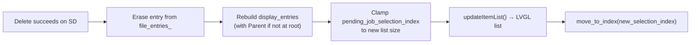

The same approach is used for rename: the entry is updated in `file_entries_`, the list is re-sorted, the renamed file's new position is located, and `pending_job_selection_index` is updated accordingly.

---

## Memory Safety Patterns

The module targets an ESP32 with severely constrained DRAM. Several safeguards are applied:

### Heap Guard in Scan Task

```
MIN_FREE_HEAP_BYTES = 30 000 bytes
```

If free internal heap drops below this threshold during the `readdir` loop, the scan stops early with the entries collected so far. The spinner label reflects the partial count; the UI behaves identically to a normal scan completion.

### `std::bad_alloc` Catch Sites

Every `std::vector::emplace_back()` or `insert()` executed on the LVGL task is wrapped in `try/catch(const std::exception &e)`. On allocation failure the existing partial list is retained, or the empty-list path displays a translated "No files" row, rather than propagating to `std::terminate` (which resets the board).

### `new (std::nothrow)` with Null-Check for Screen Object

```cpp
files_screen_obj_instance =
    new (std::nothrow) ListMenuScreen(…);
if (!files_screen_obj_instance || !files_screen_obj_instance->isValid()) {
    delete files_screen_obj_instance;
    files_screen_obj_instance = nullptr;
    return;  // Previous screen stays active
}
```

### Static Buffers for Recurring Allocations

`display_entries`, `initial_entries`, and `message_entries` are declared `static` inside their functions to avoid repeated heap allocations on every list refresh, following the ESP32 embedded memory discipline defined in the project's coding rules.

---

## Dependencies

### Runtime Dependencies

| Component | Usage |
|---|---|
| `ListMenuScreen` | Base screen class hosting the scrollable list, virtual buttons, and footer |
| `VirtualButtonsComponent` | Three buttons: OK/Set, Refresh, Back; `getSwitchPosition()` for initial mode |
| `messageBoxScreen` | `show_confirmation`, `show_information`, `show_error`, `InformationWithAction` dialogs |
| `inputScreen` | `show_text_input()` for file rename (max 255 chars) |
| `statusScreen` | Transition target after job launch; `setInitialState(JobStatus, Control)` called before transition |
| `mainScreen` | Back-navigation target |
| `macroManager` | `isMacro()`, `toggleMacro()`, `isDirty()`, `saveToFile()` |
| `gcodeHostService` | `addStream(path, ESP3DAuthenticationLevel::admin, false)` — streams G-code file to GRBL |
| `globalFs` | `accessFS`, `opendir`, `readdir`, `closedir`, `releaseFS`, `stat`, `rename`, `remove` |
| `esp3dXsettings` | `readString(esp3d_files_extensions)`, `readByte(esp3d_macros_enabled)` |
| `esp3dTranslationService` | All user-visible strings |
| `UIManager` | `registerScreen`, `unregisterScreen`, `getComponent`, `tagListNodeNonSelectable`, `getOrientationAngle` |
| `esp3d_task_create_unpinned` | Creates the scan FreeRTOS task (stack 4096 bytes, idle+1 priority) |
| LVGL timers | `lv_timer_create` for scan poll (250 ms), transition, cleanup, delayed start (500 ms) |

### Build-time Feature Guards

| Macro | Effect when **not** defined | Effect when **defined** |
|---|---|---|
| `ESP3D_HARDWARE_SWITCH_FEATURE` | Footer action zone enabled; touch cycles through 4 modes | Hardware switch drives mode changes only; footer is display-only |

---

## Related Modules

| Module | Relationship |
|---|---|
| [grbl_module.md](grbl_module.md) | Parent module grouping all GRBL-specific screens and components |
| [grbl_module_screen_router.md](grbl_module_screen_router.md) | `createScreen(ESP3DScreenType::files)` routes to `filesScreen::create()` |
| [grbl_module_connection_status.md](grbl_module_connection_status.md) | Sibling component; shares the GRBL transport connection context |
| [grbl_module_change_tool.md](grbl_module_change_tool.md) | Sibling screen in the GRBL module navigated from the same menu |
| [fluidnc_module_files.md](fluidnc_module_files.md) | FluidNC counterpart: uses firmware-side file events (`onFileEntryUpdate`) instead of a local SD scan task |
| [common_screens.md](common_screens.md) | Provides `ListMenuScreen`, `inputScreen`, `messageBoxScreen` — all used by this module |
| [ui_components.md](ui_components.md) | `VirtualButtonsComponent`, `ListMenuComponent`, `PanelComponent` |
| [cnc_shared.md](cnc_shared.md) | Shared CNC screens: `statusScreen`, `macrosScreen`, `mainScreen`, `macroManager` |


## Documents de conception (depot)

- [files_screen](https://github.com/luc-github/Pibot-cnc-pendant-firmware/blob/main/docs/ux_flows/grblhal/files_screen.md)
