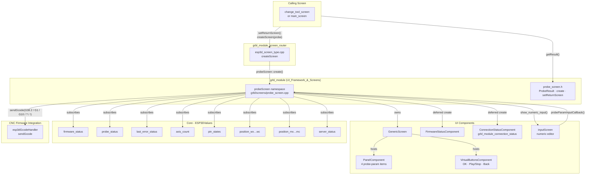
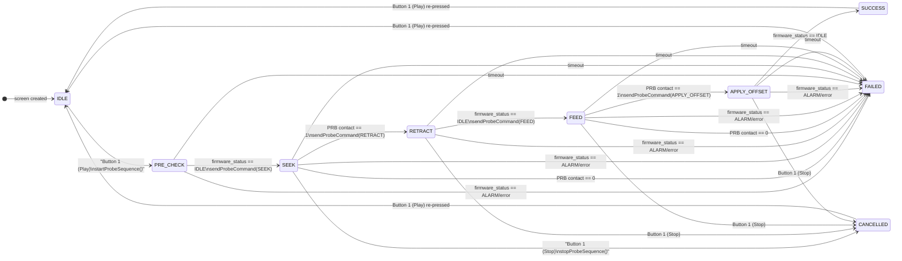
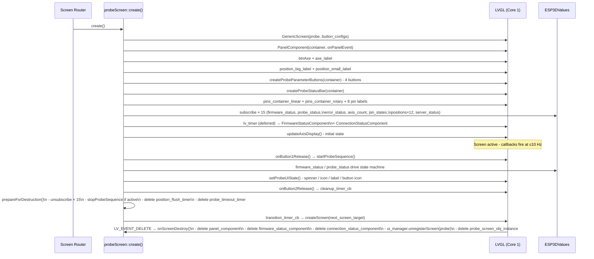

# grbl_module_probe

## Introduction

`grbl_module_probe` is the grbl-firmware-specific **tool-length / work-zero probing screen**. It provides a full-screen CNC probe interface that runs a two-pass G38.2 probing cycle on any available axis, lets the user configure four per-axis parameters (offset, max travel, retract distance, feed rate), displays live work and machine positions, shows active limit and probe pin states, and writes the result back to the work coordinate system via `G10 L20 P0`.

**Source files:**
- `main/display/cnc/grbl/screens/probe_screen.cpp` — full implementation (namespace `probeScreen`)
- `main/display/cnc/grbl/screens/probe_screen.h` — public API (`create`, `setReturnScreen`, `clearResult`, `getResult`, `ProbeResult`)

The screen is a first-class grbl module: it subscribes directly to `ESP3DValues` observables, sends G-code through `esp3dGcodeHandler`, and integrates with the shared `UIManager` lock system for connection-gating.

---

## Architecture Overview



---

## UI Layout

```
┌─────────────────────────────────────────┐
│  [FirmwareStatus]       [ConnStatus]    │  ← overlays, deferred
│                                         │
│              [Z]                        │  ← btnAxe (axis selector)
│          0000.000                       │  ← position_big_label (WPos)
│        MPos:0000.000                    │  ← position_small_label (MPos)
│                                         │
│  ┌──────────────┐  ┌──────────────┐    │
│  │  O: 10.0     │  │  T: -50.0   │    │  ← Offset | MaxTravel
│  └──────────────┘  └──────────────┘    │
│  ┌──────────────┐  ┌──────────────┐    │
│  │  R: 3.0      │  │  F: 200     │    │  ← Retract | FeedRate
│  └──────────────┘  └──────────────┘    │
│                                         │
│  [status label ...........]  [●/✓/✗]  │  ← probe_status_label + icon/spinner
│                                         │
│  [X][Y][Z]          [A][B][C][P][O]   │  ← pin state indicators
│                                         │
│  [OK]          [▶/■]         [←]       │  ← VirtualButtons
└─────────────────────────────────────────┘
```

- **`btnAxe`** — axis chip at top center. Tappable on touch-only builds (cycles all axes) or only on the extended-axis slot on hardware-switch builds. Becomes a `lock_b` icon when the switch is in position 3 on ≤3-axis machines.
- **`position_big_label`** — current work position (WPos) for the selected axis, large font (22 px).
- **`position_small_label`** — current machine position (MPos), prefixed `MPos:`, medium font (14 px).
- **Probe parameter buttons** — 2×2 grid, each navigable via `PanelComponent` and tappable to open a numeric editor.
- **Status bar** — left: scrolling text label; right: LVGL spinner (active) or icon (`ok_b` green / `close_b` red).
- **Pin state indicators** — up to 8 compact squares (X Y Z A B C P O), hidden when the pin is inactive.
- **Virtual buttons** — OK (toggle encoder mode), Play/Stop (start/abort probe), Back (return).

---

## Data Types

### `ProbeResult` (public, `probe_screen.h`)

```cpp
enum class ProbeResult : uint8_t {
    NONE      = 0,  // no probe performed / result cleared
    SUCCESS   = 1,  // completed successfully
    FAILED    = 2,  // error, alarm, or no contact
    CANCELLED = 3   // user cancelled
};
```

Used for inter-screen communication. The calling screen (e.g. `change_tool_screen`) reads this after the user returns from the probe screen via `probeScreen::getResult()`.

### `ProbeState` (private, internal state machine)

```cpp
enum class ProbeState {
    IDLE,         // ready to start
    PRE_CHECK,    // sent "?", waiting for Idle
    SEEK,         // G38.2 fast pass in progress
    RETRACT,      // retract move in progress
    FEED,         // G38.2 slow precise pass in progress
    APPLY_OFFSET, // G10 L20 P0 in progress
    SUCCESS,      // terminal — probe OK
    FAILED,       // terminal — error / no contact
    CANCELLED     // terminal — user stopped
};
```

### `ProbeAxisValues` (private, per-axis parameters)

```cpp
struct ProbeAxisValues {
    float offset;      // Probe offset applied via G10 L20 P0 (mm)
    float max_travel;  // Max probe travel distance; negative = toward workpiece (mm)
    float retract;     // Retract distance after fast contact (mm, always positive)
    float feed_rate;   // Fast-pass feed rate (mm/min); slow pass = feed_rate / 2
};
```

Stored in a `std::map<uint32_t, ProbeAxisValues>` keyed by real axis index (0=X, 1=Y, 2=Z, 3=A/U, 4=B/V, 5=C/W). Values survive axis-count changes: `initializeProbeAxisValues()` only inserts missing entries, preserving any user modifications made during the session.

### `ProbeInputContext` (private, input editor state)

```cpp
struct ProbeInputContext {
    std::string title;
    std::string value;
    std::string unit;
    float min_value;
    float max_value;
    int decimal_places;
};
```

Populated by `openInputEditorForProbeParam()` immediately before launching `inputScreen::show_numeric_input()`. Held in a static variable because the input screen is a separate LVGL screen that destroys and recreates the probe screen's context.

---

## Probe Sequence State Machine



**Active states** (spinner visible, Play button becomes Stop): `PRE_CHECK`, `SEEK`, `RETRACT`, `FEED`, `APPLY_OFFSET`.

**Terminal states** (icon visible, `ProbeResult` set): `SUCCESS` → green `ok_b`; `FAILED` / `CANCELLED` → red `close_b`.

Transitions are driven by two independent subscription callbacks:
- `on_firmware_status_update` — reacts to `"IDLE"` / `"RUN"` / `"ALARM"` / `"error:"` in the `firmware_status` observable.
- `on_probe_status_update` — parses `[PRB:x,y,z:0|1]` from the `probe_status` observable.

---

## G-code Commands

| Phase | Command template | Example (Z axis) | Notes |
|---|---|---|---|
| `PRE_CHECK` | `?` (realtime) | `?` | High-priority realtime status query |
| `SEEK` | `G91 G38.2 [axis][max_travel] F[feed_rate]` | `G91 G38.2 Z-50.0 F200` | Relative, stops on contact or full travel |
| `RETRACT` | `G91 G1 [axis][±retract] F200` | `G91 G1 Z3.0 F200` | Direction is opposite to `max_travel` sign |
| `FEED` | `G91 G38.2 [axis][max_travel] F[feed_rate/2]` | `G91 G38.2 Z-50.0 F100` | Half speed for precision |
| `APPLY_OFFSET` | `G10 L20 P0 [axis][offset]` | `G10 L20 P0 Z10.0` | Sets WCS zero with plate thickness offset |
| Stop / timeout | `!` (realtime) | `!` | High-priority feed hold sent by `stopProbeSequence()` |

`[axis]` is resolved via `getAxisLetter(real_index)`, which reads the `axis_names` observable (`"XYZUVW"` / `"XYZABC"`) honoring grblHAL `$376` UVW renaming. Falls back to `"XYZABC"` when unset (standard grbl always uses `"XYZABC"`).

---

## Probe Parameter System

The four parameters are displayed in a 2×2 button grid and are independently editable per axis:

| Button index | Short label | Full label | Unit | Constraints | Default Z | Default X/Y |
|---|---|---|---|---|---|---|
| 0 | `O:` | Offset | mm / in | −9999.9 … +9999.9, 3 dp | 10.0 | 0.0 |
| 1 | `T:` | Max Travel | mm / in | −9999.9 … +9999.9, 3 dp | −50.0 | +30.0 |
| 2 | `R:` | Retract Distance | mm / in | 0.0 … +9999.9, 3 dp | 3.0 | 5.0 |
| 3 | `F:` | Feed Rate | mm-or-in/min | 1.0 … +9999.9, 0 dp (integer) | 200 | 300 |

Default sets differ by axis family:
- **X, Y** — offset=0, travel=+30, retract=5, feed=300
- **Z** — offset=10, travel=−50 (negative = toward workpiece), retract=3, feed=200
- **A/B/C (rotary)** — offset=0, travel=+360, retract=10, feed=100

### Editing flow

1. User taps a parameter button (or navigates with encoder then presses OK).
2. `onPanelEvent(ON_ACTIVE, item_id)` → `openInputEditorForProbeParam(item_id)`.
3. `inputScreen::show_numeric_input()` is launched with title, current value, unit, min/max, and decimal places.
4. On confirmation, the C-function callback `probeParamInputCallback(value, user_data)` fires.
5. `onProbeParamValueChanged(item_id, new_value)` updates `probe_axis_values_map[effective_index]` and refreshes the button label.
6. Focus is restored to the edited item and its border highlight is re-applied.

The unit string for items 0–2 is resolved from the `current_unit` observable (`"1"` = inch / other = mm). Item 3 appends `/min` via the `unit_per_min` translation label.

---

## Axis Handling

### Selection modes

| Build flag | Axis cycling | Lock behaviour |
|---|---|---|
| Touch-only (`!ESP3D_HARDWARE_SWITCH_FEATURE`) | `btnAxe` tap cycles ALL real axes (X→Y→Z→A→…→X) | No lock position |
| Hardware switch (`ESP3D_HARDWARE_SWITCH_FEATURE`) | `btnAxe` only clickable when `axis_count > 4` and `axis_index == 3` — cycles extended axes (A/B/C) | Switch position 3 on ≤3-axis machine = user lock |

### Effective axis index

`getCurrentAxisEffectiveIndex()` maps the UI slot (`axis_index` 0–3) and `extended_axis_index` to the real axis index (0–5):

| `axis_count` | `axis_index` | `extended_axis_index` | Real index |
|---|---|---|---|
| ≤ 3 | 0/1/2 | — | 0/1/2 (X/Y/Z) |
| ≤ 3 | 3 | — | lock state (no probe) |
| 4 | 0/1/2/3 | — | 0/1/2/3 (X/Y/Z/A) |
| ≥ 5 | 0/1/2 | — | 0/1/2 (X/Y/Z) |
| ≥ 5 | 3 | 0/1/2 | 3/4/5 (A/B/C) |

### UVW renaming support

Both the displayed axis label (`getAxisName` → `getAxisLetter`) and all G-code commands (`getAxisLetter`) resolve axis letters from the `axis_names` observable. On a grblHAL machine with `$376=1` the 4th axis is probed as `U` (not `A`). When `axis_names` is unset (standard grbl, or grblHAL ≤ 3 axes), the fallback is `"XYZABC"`.

Each axis letter is stored in per-index static storage (`static char letters[6][2]`) so the returned pointer stays valid across the call.

---

## Position Display

Two LVGL labels display the current axis position, updated through `ESP3DValues` subscriptions to all twelve position observables:

- **`position_big_label`** — WPos (`position_wx` … `position_wc`), large font (22 px).
- **`position_small_label`** — MPos (`position_mx` … `position_mc`), prefixed `MPos:`, medium font (14 px).

### Throttling (Layer 3)

Position callbacks fire at 10 Hz (one per status-report field). A 250 ms minimum display interval prevents LVGL from being flooded:

- WPos and MPos groups maintain **separate timestamps** (`last_wpos_display_update_ms` / `last_mpos_display_update_ms`) because all callbacks from one status report arrive in the same LVGL tick. A shared timestamp would starve the second group.
- When throttled, a per-group pending flag is set (`wpos_update_pending` / `mpos_update_pending`). A `position_flush_timer` fires every 300 ms to catch any missed updates.
- When the displayed axis receives a fresh value and the throttle gate passes, the corresponding pending flag is cleared immediately.

---

## Pin State Indicators

Eight compact square labels show limit and probe pin activity:

| Index | Pin | Source character | Visibility |
|---|---|---|---|
| 0–5 | X Y Z A B C (or U V W per `$376`) | `getAxisLetter(i)` | Hidden when index ≥ `axis_count` |
| 6 | Probe triggered (P) | `'P'` (fixed) | Always visible slot |
| 7 | Probe disconnected (O) | `'O'` (fixed) | grblHAL extension; mutually exclusive with P |

Labels live in two `LV_FLEX_FLOW_ROW` containers:
- `pins_container_linear` — X, Y, Z (top-left, absolute position).
- `pins_container_rotary` — A, B, C, P, O (top-right, `LV_ALIGN_TOP_RIGHT`).

Hidden flex items take no horizontal space, so `O` reusing the `P` slot adds no layout cost.

### Change detection (Layer 2)

`on_pins_state_update()` compares the incoming `|Pn:` string against `last_known_pin_states[12]` with `strcmp`. All LVGL hide/show operations are skipped when the string is unchanged — the callback fires at 10 Hz with identical values between actual pin events.

### Probe-disconnected gate (`|Pn:O`)

`probe_disconnected_` is set by `updatePinsStates()` from the `'O'` character. Two effects apply:

1. **Play button proactively disabled** — `update_button(1, &play_b, false)` while not in an active probe sequence, so the UI communicates the problem before the user taps.
2. **`startProbeSequence()` defensive gate** — even if the button is somehow tapped while disconnected, the function refuses, shows `probe_error_disconnected` translation, and plays an error beep.

---

## Lock and Connection Gate

The screen participates in the `UIManager` two-tier lock system:

| Lock tier | Trigger | Effect |
|---|---|---|
| **System lock** | `server_status ≠ "C"` or `canSendData() == false` | Play button disabled; probe param buttons disabled (`LV_STATE_DISABLED`); position labels dimmed (30% opacity) |
| **User lock** | Switch in position 3 on ≤3-axis machine | Same visual effect; axis label replaced by `lock_b` icon |

Both tiers are evaluated together in `updateAxisDisplay()` via `ui_manager.getLockState()`. `on_connection_status_update()` calls `systemSetLockState()` immediately on status change; `on_axis_count_update()` is deferred via `pending_axis_display_update` until after connection is confirmed (`"C"`), preventing a spurious axis-count read before firmware has responded.

---

## LVGL Lifecycle



**Key invariants:**

- `prepareForDestruction()` is guarded by `ESP3D_PREPARE_DESTRUCTION_GUARD` — idempotent; safe to call multiple times.
- Screen C++ objects are deleted in `onScreenDestroy` (triggered by LVGL `LV_EVENT_DELETE`), not inside the cleanup timer.
- `FirmwareStatusComponent` and `ConnectionStatusComponent` are created in a deferred timer (`ESP3D_DEFERED_SCREEN_CREATION_DELAY_MS`) to keep `create()` fast and to avoid LVGL object contention during the screen load animation.
- The probe timeout timer (`probe_timeout_timer`) is a one-shot `lv_timer_t`. In `probeTimeoutCallback`, the pointer is NULLed **before** calling `stopProbeSequence()` — this avoids a double-delete because `stopProbeSequence()` also tries to cancel the timer.

### Timeout calculation

```
timeout_ms = clamp(((|max_travel| / feed_rate) × 60 × 1.5) + 5 s, 10 s, 120 s) × 1000
```

Applied at `startProbeSequence()`. The 1.5× safety factor covers communication latency; the +5 s margin covers handshake delays. The 120 s ceiling prevents indefinitely long timeouts on misconfigured parameters.

---

## Subscriptions Reference

| `ESP3DValuesIndex` | Callback | Purpose |
|---|---|---|
| `firmware_status` | `on_firmware_status_update` | Drives PRE_CHECK→SEEK→RETRACT→FEED→APPLY_OFFSET→SUCCESS/FAILED transitions on Idle/Run/Alarm |
| `probe_status` | `on_probe_status_update` | Parses `[PRB:x,y,z:0\|1]` — contact detection for SEEK and FEED phases |
| `last_error_status` | `on_error_status_update` | Any firmware error message during an active probe → immediate FAILED |
| `axis_count` | `on_axis_count_update` | Re-initialises axis values map; refreshes axis label and probe parameter displays |
| `pin_states` | `on_pins_state_update` | Limit/probe pin indicator squares; sets `probe_disconnected_` gate |
| `position_wx` … `position_wc` | `on_positions_update` | WPos DRO (big label), throttled at 250 ms |
| `position_mx` … `position_mc` | `on_positions_update` | MPos DRO (small label), throttled at 250 ms |
| `server_status` | `on_connection_status_update` | System lock control; `"C"` = unlocked, anything else = locked |

---

## Public API Reference

**Header:** `main/display/cnc/grbl/screens/probe_screen.h`

### `probeScreen::create()`

```cpp
void create();
```

Creates the full probe screen and makes it the active LVGL screen. Called exclusively by the grbl screen router (`esp3d_screen_type.cpp::createScreen`). Throws `std::runtime_error` on critical failures (subscription failure, UIManager registration failure). Non-critical component failures (`FirmwareStatusComponent`, `ConnectionStatusComponent`) are logged and silently skipped — the screen remains operational without those overlay widgets.

### `probeScreen::setReturnScreen()`

```cpp
void setReturnScreen(ESP3DScreenType screen);
```

Overrides the default return destination (`main` screen, `RETURN_SCREEN`) for the Back button and for on-completion navigation. Must be called **before** `create()` if a non-default return target is needed. The value is reset to `RETURN_SCREEN` when the screen is destroyed.

### `probeScreen::clearResult()`

```cpp
void clearResult();
```

Resets `last_result` to `ProbeResult::NONE`. Should be called by the opening screen before pushing the probe screen, so a stale result from a previous session is not misread on return.

### `probeScreen::getResult()`

```cpp
ProbeResult getResult();
```

Returns the outcome of the most recent probe sequence. Poll this immediately after the user returns from the probe screen.

| `ProbeResult` | Meaning |
|---|---|
| `NONE` | No probe performed, or `clearResult()` was called |
| `SUCCESS` | Two-pass cycle completed and `G10 L20 P0` confirmed by idle state |
| `FAILED` | No contact, alarm, firmware error, or timeout |
| `CANCELLED` | User pressed the Stop button |

---

## Integration Pattern

The canonical caller is `change_tool_screen`, which chains probe-result checking with tool-change acknowledgement:

```cpp
// Before launching the probe screen:
probeScreen::clearResult();
probeScreen::setReturnScreen(ESP3DScreenType::change_tool);
createScreen(ESP3DScreenType::probe);

// When returning from probe screen (in change_tool_screen::create()):
ProbeResult result = probeScreen::getResult();
if (result == ProbeResult::SUCCESS) {
    // proceed with tool change confirmation
} else if (result == ProbeResult::FAILED) {
    // show error state
}
```

---

## Encoder Navigation (PanelComponent)

`PanelComponent` manages focus across the four probe parameter buttons. The encoder generates `LV_EVENT_KEY` events on the LVGL screen object; `encoder_event_handler` forwards them to `panel_component->handleEncoderEvent(e)`.

Button 0 (OK) toggles `PanelComponent` between `PANEL_NAVIGATION_MODE` (encoder scrolls focus) and `PANEL_EDITING_MODE` (encoder adjusts value) on hardware-encoder builds (`ESP3D_HARDWARE_ENCODER_FEATURE`). On touch-only builds, items are activated directly by tap without a mode distinction.

**Focus highlight:** the focused parameter button gets a thicker border (`ESP3D_BORDER_WIDTH_THICK`) in the `border_focus` theme token color. Unfocused buttons use `ESP3D_BORDER_WIDTH_STANDARD` with `ESP3D_MENU_BORDER_COLOR`. `onPanelEvent(ON_FOCUS, item_id)` applies this to all four buttons on every focus change. `onPanelEvent(ON_ACTIVE, item_id)` opens the numeric input editor for the focused parameter.

---

## Counterpart Modules

The probe screen is structurally identical across all three firmware targets. Differences are confined to the `.cpp` file:

| Module | File | Firmware | Notable differences |
|---|---|---|---|
| `grbl_module_probe` *(this module)* | `main/display/cnc/grbl/screens/probe_screen.cpp` | grbl | Standard grbl state strings; no `|Pn:O` grblHAL extension in practice |
| `fluidnc_module_probe` (see [fluidnc_module_probe](fluidnc_module_probe.md)) | `main/display/cnc/fluidnc/screens/probe_screen.cpp` | FluidNC | Commands delivered via WebSocket; file-system-aware |
| grblHAL probe (within `grblhal_module`) | `main/display/cnc/grblhal/screens/probe_screen.cpp` | grblHAL | `$376` UVW renaming; `|Pn:O` probe-disconnected gate; `server_status == "R"` PASSIVE blocks probe start |

The `|Pn:O` gate and UVW renaming code is present in this grbl variant (code is shared-by-copy), but `server_status == "R"` (PASSIVE mode) is a grblHAL-only concept — grbl uses only `"C"` and `"?"`.

---

## Dependencies

| Dependency | Role |
|---|---|
| `lvgl` | UI rendering, event system, timers |
| [values](values.md) | `ESP3DValues` observable system — all real-time data delivery |
| [grbl_module_connection_status](grbl_module_connection_status.md) | Connection indicator overlay embedded in this screen |
| [cnc_shared](cnc_shared.md) | `FirmwareStatusComponent` overlay |
| [ui_components](ui_components.md) | `PanelComponent` (encoder navigation), `VirtualButtonsComponent` |
| [common_screens](common_screens.md) | `inputScreen::show_numeric_input()` — numeric parameter editor |
| [grbl_module_screen_router](grbl_module_screen_router.md) | `createScreen()` — sole entry point that calls `probeScreen::create()` |
| [gcode_host](gcode_host.md) | `esp3dGcodeHandler.sendGcode()` — dispatches all probe G-code and realtime commands |
| [ui_core](ui_core.md) | `UIManager` — lock state, theme tokens, orientation, screen registration |
| `esp3dTranslationService` | All user-visible strings (idle, processing, probe step labels, error messages) |

---

## Key Constraints

- **LVGL thread only.** All methods — including all subscription callbacks — run on Core 1 (LVGL task). No additional synchronisation is needed inside this module.
- **No blocking in callbacks.** `on_firmware_status_update` and `on_probe_status_update` only call `lv_obj_*` and `sendProbeCommand()`. `sendProbeCommand()` enqueues G-code non-blocking via `esp3dGcodeHandler.sendGcode()`.
- **`prepareForDestruction()` is mandatory** before any navigation away from the screen. The `ESP3D_CLEANUP_TIMER_BODY` macro in `cleanup_timer_cb` and the Back button handler both call it before launching the transition timer.
- **No probe during lock.** `startProbeSequence()` is gated by the Play button's `isLockable = true` flag in `VirtualButtonsComponent`, which disables the button automatically when `ui_manager.getLockState()` is true.
- **Axis change during active probe.** If the switch position or axis button changes the selected axis while a probe sequence is running, `stopProbeSequence()` is called immediately and the state transitions to `FAILED` with the `probe_error_axis` translation string — a safe abort rather than a silent axis mismatch.
- **`std::map` allocation.** `probe_axis_values_map` allocates dynamically but is populated once at screen creation and never grown during a probe sequence. On a 3-axis machine it holds 3 entries; on a 6-axis machine, 6 entries.
- **`std::string` in state-machine callbacks.** `last_firmware_state` and temporary comparisons in `on_firmware_status_update` use `std::string`. These run at ≤10 Hz and allocate only on value change — acceptable for a non-realtime UI path. See [esp32_memory_constraints](https://github.com/luc-github/Pibot-cnc-pendant-firmware/blob/main/docs/guides/esp32_memory_constraints.md) for the project-wide rules on `std::string` usage.
