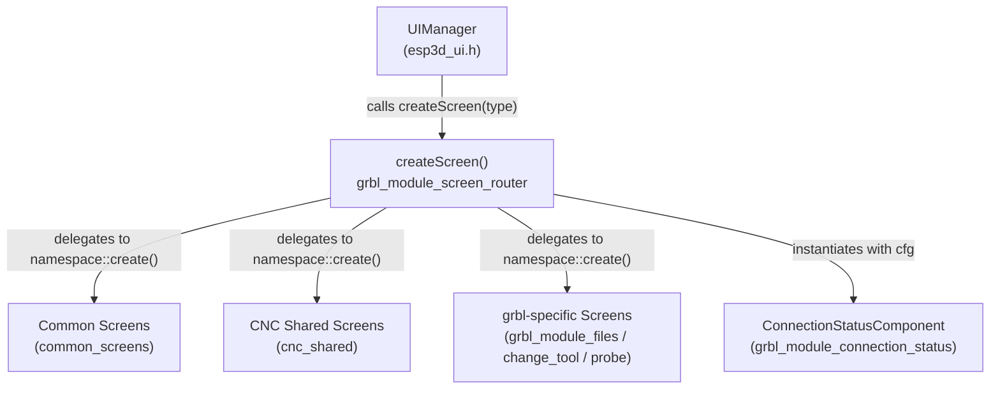
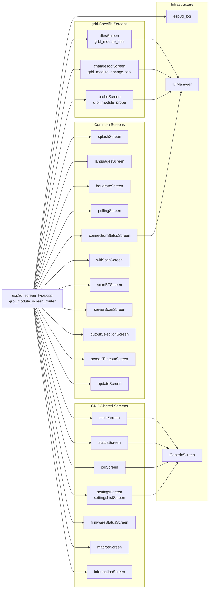
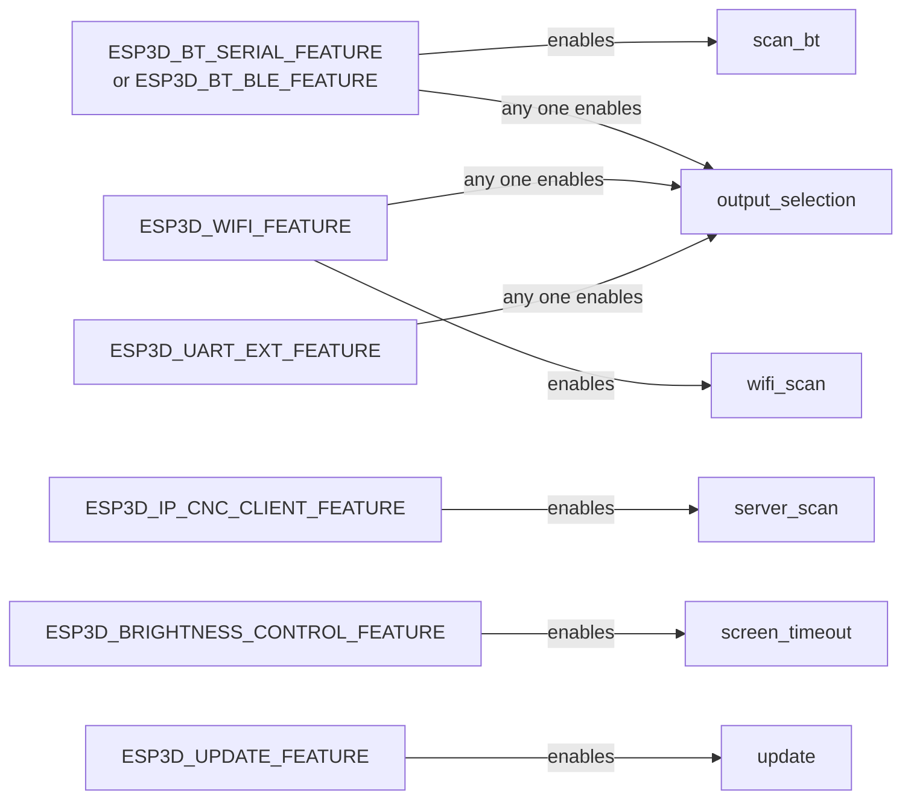
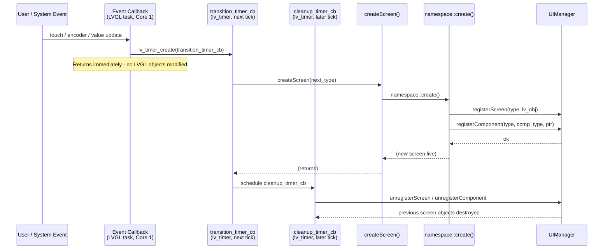

# grbl_module_screen_router

## Overview

The `grbl_module_screen_router` is the centralized screen dispatch layer for the **grbl CNC firmware target**. It owns a single public function — `createScreen(ESP3DScreenType)` — that translates a screen-type token into a concrete LVGL screen creation call. Every screen transition in the grbl target is funnelled through this one entry point, giving the rest of the system a stable, firmware-agnostic API for navigation.

The module lives at:

```
main/display/cnc/grbl/screens/esp3d_screen_type.cpp   (implementation)
main/display/cnc/grbl/screens/esp3d_screen_type.h     (enum + forward declaration)
```

A structurally identical counterpart (`grblhal_module_screen_router`) exists under `main/display/cnc/grblhal/screens/`. Both share the same enum definition and the same routing logic; they differ only in which firmware-specific screen implementations they include.

---

## Architecture

### Position in the UI Hierarchy



`UIManager` (see [ui_core.md](ui_core.md)) manages the active screen registry and owns the lifecycle of LVGL objects. When a transition is needed it calls `createScreen()` with a typed token; the router resolves that token to the correct `namespace::create()` function without the caller needing to know which implementation files are involved.

---

## Core Types

### `ESP3DScreenType` Enum

Defined in `esp3d_screen_type.h`. Every navigable destination has an enumerator; several are conditionally compiled based on hardware/feature flags:

| Enumerator | Condition | Description |
|---|---|---|
| `none` | always | Sentinel / no screen |
| `splash` | always | Boot splash |
| `main` | always | Main CNC navigation hub |
| `settings` | always | Settings circular menu |
| `settings_list` | always | Flat settings list |
| `information` | always | Firmware / device information |
| `languages` | always | Language selection |
| `baudrate` | always | Baud rate picker |
| `polling` | always | Polling interval picker |
| `status` | always | Real-time CNC status (feed, spindle, overrides) |
| `jog` | always | Jogging / axis movement |
| `files` | always | File manager (grbl-native scan) |
| `macros` | always | Macro manager |
| `change_tool` | always | Tool change workflow |
| `probe` | always | Probing workflow |
| `firmware_status` | always | Firmware message log / status |
| `connection_status` | always | Transport + server connection status |
| `message_box` | always | Modal message / confirmation dialog |
| `input` | always | Generic text / numeric / PIN input |
| `output_selection` | BT or WiFi or UART ext | Transport output selector |
| `screen_timeout` | `ESP3D_BRIGHTNESS_CONTROL_FEATURE` | Display timeout picker |
| `scan_bt` | `ESP3D_BT_SERIAL_FEATURE` or `ESP3D_BT_BLE_FEATURE` | Bluetooth device scan |
| `wifi_scan` | `ESP3D_WIFI_FEATURE` | WiFi AP scan |
| `server_scan` | `ESP3D_IP_CNC_CLIENT_FEATURE` | CNC-over-IP server scan |
| `update` | `ESP3D_UPDATE_FEATURE` | OTA / SD update |
| `empty` | always | Sentinel (end of enum) |

> **Note:** `message_box`, `input`, and `firmware_status` appear in the enum but are not dispatched through `createScreen()`. These are modal overlays launched directly by the screens that need them (e.g. via `messageBoxScreen::show_confirmation()` or `inputScreen::show_numeric_input()`).

### `ComponentType` Enum

Also defined in `esp3d_screen_type.h`. Used by `UIManager` as part of the component registry key (`screenType_componentType`):

| Enumerator | LVGL Component |
|---|---|
| `generic_screen` | `GenericScreen` base |
| `circular_menu_screen` | `CircularMenuScreen` |
| `virtual_buttons` | `VirtualButtonsComponent` |
| `circular_menu` | `CircularMenuComponent` |
| `list_menu` | `ListMenuComponent` |
| `list_menu_screen` | `ListMenuScreen` |
| `connection_status` | `ConnectionStatusComponent` |
| `firmware_status` | `FirmwareStatusComponent` |
| `message_box` | Message box widget |
| `panel` | `PanelComponent` |

### Debug String Tables

When `ESP3D_LOG` is enabled the header also defines two string arrays and two helper macros:

```cpp
#define SCREEN_STR(index)    screen_type_names[static_cast<uint8_t>(index)]
#define COMPONENT_STR(index) component_type_names[static_cast<uint8_t>(index)]
```

These are used by `createScreen()` to emit a human-readable log line on every transition:

```
esp3d_log("Creating screen of type: %s", SCREEN_STR(screen_type));
```

---

## Public API

### `createScreen(ESP3DScreenType screen_type)`

```cpp
// main/display/cnc/grbl/screens/esp3d_screen_type.h
void createScreen(ESP3DScreenType screen_type);
```

**Thread / LVGL safety:** Must be called exclusively from the LVGL task (Core 1). All screen transitions use timer callbacks (`lv_timer_*`) to defer destruction and creation out of event handlers; `createScreen` itself is the final step of that deferred sequence.

**Error handling:** An unknown `screen_type` value logs an error with `esp3d_log_e` and falls back to `mainScreen::create()`, preventing a blank display.

---

## Screen-to-Namespace Routing

```mermaid
flowchart TD
    IN["createScreen(ESP3DScreenType)"]

    IN --> SPLASH["splash\n→ splashScreen::create()"]
    IN --> MAIN["main\n→ mainScreen::create()"]
    IN --> STATUS["status\n→ statusScreen::create()"]
    IN --> JOG["jog\n→ jogScreen::create()"]
    IN --> FILES["files\n→ filesScreen::create()"]
    IN --> MACROS["macros\n→ macrosScreen::create()"]
    IN --> PROBE["probe\n→ probeScreen::create()"]
    IN --> CHANGE["change_tool\n→ changeToolScreen::create()"]
    IN --> SETTINGS["settings\n→ settingsScreen::create()"]
    IN --> SLIST["settings_list\n→ settingsListScreen::create()"]
    IN --> INFO["information\n→ informationScreen::create()"]
    IN --> LANG["languages\n→ languagesScreen::create()"]
    IN --> BAUD["baudrate\n→ baudrateScreen::create()"]
    IN --> POLL["polling\n→ pollingScreen::create()"]
    IN --> CONN["connection_status\n→ connectionStatusScreen::create(cfg)\ncfg.return_screen = settings"]

    IN -->|"#if BT_SERIAL or BT_BLE"| BTSC["scan_bt\n→ scanBTScreen::create()"]
    IN -->|"#if WIFI_FEATURE"| WIFI["wifi_scan\n→ wifiScanScreen::create()"]
    IN -->|"#if IP_CNC_CLIENT"| SRVSCAN["server_scan\n→ serverScanScreen::create()"]
    IN -->|"#if BT or WIFI or UART_EXT"| OUT["output_selection\n→ outputSelectionScreen::create()"]
    IN -->|"#if BRIGHTNESS_CONTROL"| TOUT["screen_timeout\n→ screenTimeoutScreen::create()"]
    IN -->|"#if UPDATE_FEATURE"| UPD["update\n→ updateScreen::create()"]

    IN -->|"default / unknown"| FALLBACK["⚠ esp3d_log_e + mainScreen::create()"]
```



---

## Component Dependencies



---

## Compile-Time Feature Gating

Several screen types are fully excluded from the binary when their backing feature is disabled. The same `#if` guards appear in both the enum (in the header) and in the `switch` (in the implementation), ensuring the compiler never sees an unresolvable enumerator or a missing `namespace::create` symbol.



Feature flags are declared as `OPTION()` in `CMakeLists.txt` and converted to preprocessor defines by `cmake/features.cmake`. Mutual-exclusion constraints (e.g. Bluetooth and WiFi cannot both be active) are validated by `cmake/sanity_check.cmake`. See [`docs/features/feature_resource_matrix.md`](https://github.com/luc-github/Pibot-cnc-pendant-firmware/blob/main/docs/features/feature_resource_matrix.md) for the full compatibility matrix.

---

## Screen Transition Flow

All navigation follows the timer-based deferred pattern required by the LVGL single-thread model (Core 1). `createScreen` is always the *destination* step — it never destroys the previous screen directly.



> **LVGL Constraint (Critical):** LVGL objects must never be created or destroyed inside the event callback that triggered the transition. The two-timer pattern (transition then cleanup) ensures both operations happen on separate LVGL ticks, safely outside the event stack. Violating this causes use-after-free crashes. See [`docs/architecture/screen_transitions_flow.md`](https://github.com/luc-github/Pibot-cnc-pendant-firmware/blob/main/docs/architecture/screen_transitions_flow.md) for the authoritative reference.

---

## `connection_status` Special Case

The `connection_status` case is the only one that passes a configuration struct to `create()`. The router hard-codes `cfg.return_screen = ESP3DScreenType::settings`, meaning the Back button on the connection status screen always returns to the Settings screen. Callers that need a different return destination must invoke `connectionStatusScreen::create(cfg)` directly rather than going through the router.

```cpp
case ESP3DScreenType::connection_status:
{
    connectionStatusScreen::ConnectionStatusScreenConfig cfg;
    cfg.return_screen = ESP3DScreenType::settings;
    connectionStatusScreen::create(cfg);
    break;
}
```

The `ConnectionStatusScreenConfig` struct (defined in `main/display/screens/connection_status_screen.h`) currently contains only the `return_screen` field, defaulting to `ESP3DScreenType::main`.

---

## grbl vs. grblHAL Router Comparison

Both firmware targets have a structurally identical router file. The only meaningful difference is the `filesScreen` implementation that gets linked:

| Aspect | grbl | grblHAL |
|---|---|---|
| File path | `main/display/cnc/grbl/screens/esp3d_screen_type.cpp` | `main/display/cnc/grblhal/screens/esp3d_screen_type.cpp` |
| Enum / header | `main/display/cnc/grbl/screens/esp3d_screen_type.h` | `main/display/cnc/grblhal/screens/esp3d_screen_type.h` |
| `filesScreen` | Native SD scan via `file_scan_task` + `scan_check_timer_cb` | Push-based updates via `onFileEntryUpdate` + `watchdog_timer_cb` |
| All other screens | Identical routing and implementation | Identical routing and implementation |

The two `switch` bodies are identical. Target selection happens at build time through `CMakeLists.txt`; only one firmware target is compiled per build.

---

## Related Documentation

| Topic | Reference |
|---|---|
| Screen architecture overview | [`docs/architecture/screens_architecture.md`](https://github.com/luc-github/Pibot-cnc-pendant-firmware/blob/main/docs/architecture/screens_architecture.md) |
| Safe screen transition patterns | [`docs/architecture/screen_transitions_flow.md`](https://github.com/luc-github/Pibot-cnc-pendant-firmware/blob/main/docs/architecture/screen_transitions_flow.md) |
| grbl files screen | [grbl_module_files.md](grbl_module_files.md) |
| grbl probe screen | [grbl_module_probe.md](grbl_module_probe.md) |
| grbl tool change screen | [grbl_module_change_tool.md](grbl_module_change_tool.md) |
| grbl connection status component | [grbl_module_connection_status.md](grbl_module_connection_status.md) |
| CNC shared screens (status, jog, macros, …) | [cnc_shared.md](cnc_shared.md) |
| Common screens (splash, scan, settings pickers) | [common_screens.md](common_screens.md) |
| UIManager, theme, and style system | [ui_core.md](ui_core.md) |
| Feature flag compatibility matrix | [`docs/features/feature_resource_matrix.md`](https://github.com/luc-github/Pibot-cnc-pendant-firmware/blob/main/docs/features/feature_resource_matrix.md) |
| UX screen-by-screen flows | [`docs/ux_flows/`](ux_flows/) |
