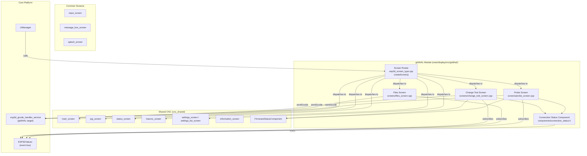
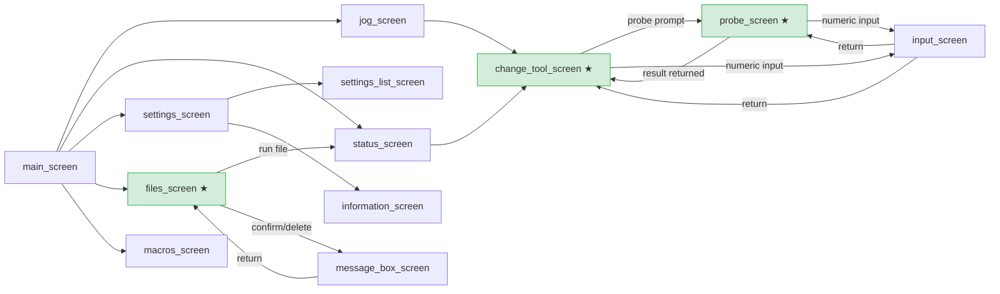
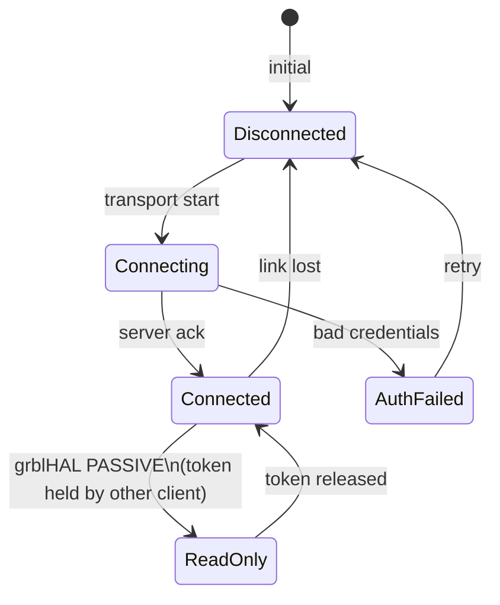
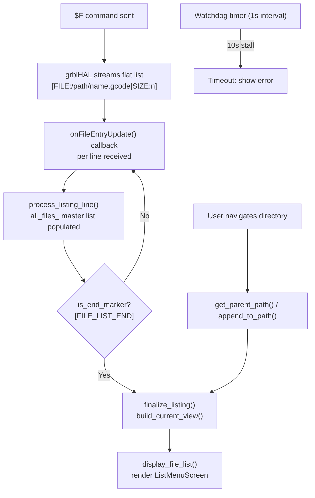
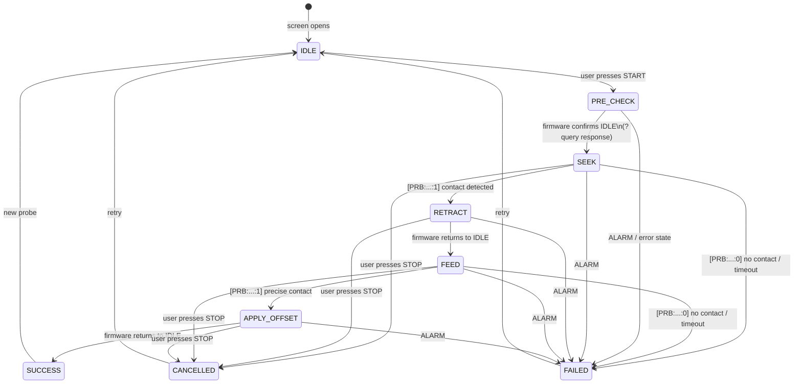
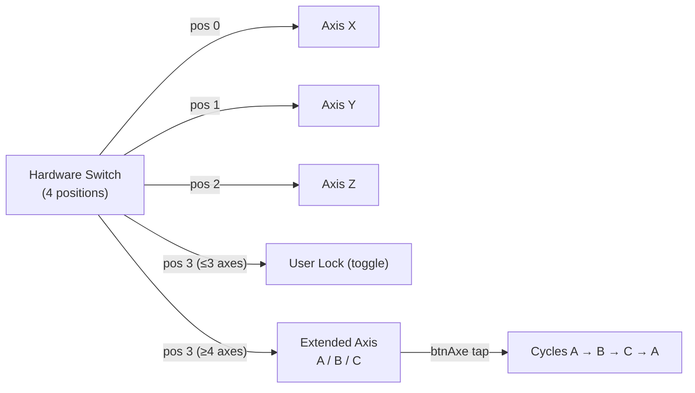
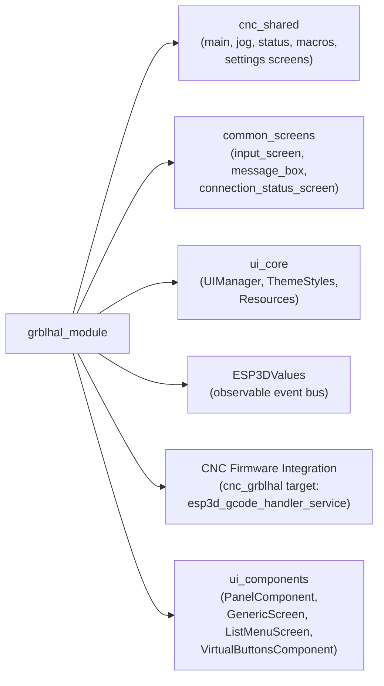

# grblHAL Module

## Overview

The `grblhal_module` is the dedicated UI integration layer for the **grblHAL CNC firmware**. It lives under `main/display/cnc/grblhal/` and provides all screen logic, components, and protocol handling that are specific to grblHAL — as opposed to the shared CNC infrastructure in `cnc_shared` or the firmware-agnostic screens in `common_screens`.

grblHAL is an advanced real-time CNC motion controller with features that require specialized UI handling:
- A **manual tool change protocol** based on grblHAL-specific realtime bytes (`0xA3`) and firmware states (`TOOL`)
- A **flat SD card file listing** via `$F` (recursive, full paths, no directory markers)
- A **PASSIVE connection mode** (`R` status) where the remote session has read-only access because another client holds the control token
- **Extended axis naming** configurable via `$376` (UVW renaming scheme)
- **Probe-disconnected detection** via `|Pn:O` in status reports

This module mirrors the structure of the `grbl_module` and `fluidnc_module`, each implementing firmware-specific screen variants on top of the shared `cnc_shared` infrastructure and the common UI framework.

---

## Architecture Overview

---

## Module Components

The module is organized into five distinct sub-components:

| Sub-module | File | Responsibility |
|---|---|---|
| [Screen Router](#screen-router) | `screens/esp3d_screen_type.cpp` | Central `createScreen()` dispatcher for all screen types |
| [Connection Status](#connection-status-component) | `components/connection_status.h` | Clickable connection indicator with grblHAL PASSIVE state support |
| [Change Tool Screen](#change-tool-screen) | `screens/change_tool_screen.cpp` | M6 / M61Q tool change with full grblHAL protocol state machine |
| [Files Screen](#files-screen) | `screens/files_screen.cpp` | SD card browser using grblHAL's flat `$F` listing |
| [Probe Screen](#probe-screen) | `screens/probe_screen.cpp` | Multi-step G38.2 probe sequence with offset application |

---

## Screen Navigation Flow

> ★ = grblHAL-specific screens. All other screens are shared via `cnc_shared` or `common_screens`.

---

## Screen Router

**File:** `main/display/cnc/grblhal/screens/esp3d_screen_type.cpp`  
**Detailed docs:** [grblhal_module_screen_router.md](grblhal_module_screen_router.md)

The module's single `createScreen(ESP3DScreenType)` function is the **sole entry point** for all screen transitions within the grblHAL firmware target. It is called by all timer-based transition callbacks system-wide.

**Key behaviors:**
- Dispatches to `mainScreen::create()`, `filesScreen::create()`, `probeScreen::create()`, `changeToolScreen::create()`, and all shared screens
- Conditionally compiles transport-specific screens (`scan_bt`, `wifi_scan`, `server_scan`, `output_selection`) based on build flags
- Falls back to `mainScreen::create()` on unknown screen types
- Handles the `connection_status` screen with a pre-configured return target of `ESP3DScreenType::settings`

---

## Connection Status Component

**File:** `main/display/cnc/grblhal/components/connection_status.h`  
**Detailed docs:** [grblhal_module_connection_status.md](grblhal_module_connection_status.md)

The `ConnectionStatusComponent` is a clickable overlay widget displayed on all grblHAL CNC screens. It renders a connection icon that reflects the current transport and server state, and navigates to `connection_status_screen` on click.

**grblHAL-specific connection states:**

| Status Char | Meaning |
|---|---|
| `?` | Disconnected / not connected |
| `A` | Authentication failed |
| `T` | Connecting (transport or server handshake in progress) |
| `C` | Connected — full control |
| `R` | Connected — **read-only** (grblHAL PASSIVE: token held by another client) |
| `.` | Radio off |

The `R` (PASSIVE) state is unique to grblHAL: it signals that another client currently holds the control token, making the pendant read-only. This state is absent from the grbl and fluidnc variants.

---

## Change Tool Screen

**File:** `main/display/cnc/grblhal/screens/change_tool_screen.cpp`  
**Detailed docs:** [grblhal_module_change_tool.md](grblhal_module_change_tool.md)

The change tool screen implements grblHAL's **manual tool change protocol** (`T<n> M6`) and the instant **set-current-tool** command (`M61Q<n>`). It exposes a two-item panel (mode toggle + target tool selector) and a virtual 3-button bar that adapts dynamically to the current protocol state.

### Tool Change Modes

| Mode | Command | Description |
|---|---|---|
| **SET** (default) | `M61Q<n>` | Sets current tool number without movement (instant) |
| **CHANGE** | `T<n> M6` | Full grblHAL manual tool change: machine moves to change position, user installs tool, then resumes |

### grblHAL Tool Change Protocol State Machine

```mermaid
stateDiagram-v2
    [*] --> IDLE
    IDLE --> MOVING_TO_CHANGE : T&#60;n&#62; M6 sent\n(CHANGE mode)
    IDLE --> SUCCESS : M61Q&#60;n&#62; sent\n(SET mode)
    MOVING_TO_CHANGE --> WAITING_ACK : firmware enters\n"TOOL" state
    WAITING_ACK --> WAITING_USER : user sends 0xA3 ack
    WAITING_USER --> PROBING : user requests $TPW\n(tool setter probe)
    WAITING_USER --> COMPLETING : user sends ~ (cycle start)
    PROBING --> WAITING_USER : $TPW probe done\n(TOOL state re-entered)
    COMPLETING --> SUCCESS : firmware returns to IDLE

    MOVING_TO_CHANGE --> FAILED : timeout / ALARM
    WAITING_ACK --> FAILED : timeout
    WAITING_USER --> CANCELLED : user cancels
    PROBING --> FAILED : ALARM / timeout
    COMPLETING --> FAILED : timeout / ALARM
    SUCCESS --> IDLE : new cycle
    FAILED --> IDLE : reset
    CANCELLED --> IDLE : reset
```

### Virtual Button Layout by State

| State | Button 0 (Left) | Button 1 (Center) | Button 2 (Right) |
|---|---|---|---|
| IDLE / SUCCESS / FAILED | OK (encoder nav) | START (if valid) | BACK |
| MOVING_TO_CHANGE | — | CANCEL | — |
| WAITING_ACK | — | ACK (0xA3) | — |
| WAITING_USER | $TPW (probe) | FINISH (~) | — |
| PROBING | — | CANCEL | — |
| COMPLETING | — | CANCEL | — |

After a successful `M61Q`, a **probe prompt** appears asking the user whether to run the tool-setter probe (`$TPW`) or skip it. Navigating to the probe screen sets `probeScreen::setReturnScreen(change_tool)` and the result is consumed on re-entry via `handleProbeScreenReturn()`.

---

## Files Screen

**File:** `main/display/cnc/grblhal/screens/files_screen.cpp`  
**Detailed docs:** [grblhal_module_files.md](grblhal_module_files.md)

The files screen provides an SD card browser tailored to grblHAL's flat file listing protocol. Unlike per-directory querying (used by other firmwares), grblHAL returns **all files recursively in a single `$F` response** with full absolute paths.

### grblHAL SD Card Protocol

| Command | Purpose |
|---|---|
| `$F` | List all CNC files recursively (flat, no `[DIR:]` entries) |
| `$F=<path>` | Run / execute a file |
| `$FD=<path>` | Delete a file |

**No rename command** exists in grblHAL. The 4-position hardware switch maps: Run / Macro / Delete / Run (position 3 repeats Run instead of Rename).

### File Listing Architecture

**Key design decisions:**
- The flat `all_files_` master list is built once per scan and persists across screen transitions (survives message box dialogs)
- Directory navigation is **purely local** — no per-directory rescan needed
- The `[FILE_LIST_END]` sentinel is synthesized by the grblHAL gcode handler on the terminating `ok` response
- Memory guard: collection stops if free heap drops below 30 KB

### File Action Modes (Switch Control)

| Switch Position | Action | Icon |
|---|---|---|
| 0 | Run file (`$F=<path>`) | Drive |
| 1 | Toggle macro tag (pendant-side) | Robot |
| 2 | Delete file (`$FD=<path>`) | Trash |
| 3 | Run file again (no rename in grblHAL) | Drive |

---

## Probe Screen

**File:** `main/display/cnc/grblhal/screens/probe_screen.cpp`  
**Detailed docs:** [grblhal_module_probe.md](grblhal_module_probe.md)

The probe screen executes a **4-step CNC probing sequence** using standard G-code commands supported by grblHAL. It supports up to 6 axes (X/Y/Z/A/B/C) with axis naming configurable via grblHAL's `$376` parameter (UVW renaming).

### Probe Sequence State Machine

### G-code Commands per Step

| Step | G-code Sent | Description |
|---|---|---|
| PRE_CHECK | `?` (realtime byte) | Query machine state — must be IDLE to proceed |
| SEEK | `G91 G38.2 <axis><max_travel> F<feedrate>` | Fast first-pass probe |
| RETRACT | `G91 G1 <axis><retract> F200` | Back off from contact point |
| FEED | `G91 G38.2 <axis><max_travel> F<feedrate/2>` | Slow precise second-pass probe |
| APPLY_OFFSET | `G10 L20 P0 <axis><offset>` | Set work coordinate origin |

### Probe Parameters (per axis)

Each axis maintains its own configurable probe parameters, editable via the PanelComponent:

| Parameter | Label | Default (Z) | Description |
|---|---|---|---|
| Offset | `O:` | 10.0 mm | Tool length / surface offset applied after contact |
| Max Travel | `T:` | −50.0 mm | Maximum probe travel (negative = downward for Z) |
| Retract | `R:` | 3.0 mm | Distance to back off before the second pass |
| Feed Rate | `F:` | 200 mm/min | First-pass probe speed (second pass = F/2) |

### Multi-Axis and Switch Behavior

The probe screen is also callable from the [Change Tool Screen](#change-tool-screen) as part of the `M61Q` post-change probe workflow. Results are communicated back via `probeScreen::getResult()` / `setReturnScreen()`.

---

## Key Dependencies

| Dependency | Purpose |
|---|---|
| `cnc_shared` | Shared CNC screens (main, jog, status, macros, settings) |
| `common_screens` | Modal dialogs (input, message box), network scan screens |
| `ui_core` | UIManager, theme tokens, resource loading |
| `ui_components` | PanelComponent, GenericScreen, ListMenuScreen |
| `CNC_Firmware_Integration / cnc_grblhal` | grblHAL gcode handler, PositionData, FirmwareMessage |
| `ESP3DValues` | Observable system state: firmware_status, parser_state, positions, probe_status, pin_states |
| `translations` | Localized strings for all UI text |

---

## Comparison with grbl and FluidNC Modules

| Feature | grblHAL | grbl | FluidNC |
|---|---|---|---|
| Tool change protocol | `T<n> M6` + `0xA3` ack + `$TPW` | — | `M6T<n>` (single command) |
| Set current tool | `M61Q<n>` | — | — |
| File listing | `$F` flat (all files, full paths) | `$F` per-directory | Per-directory via firmware entries |
| File delete | `$FD=<path>` | `$FD=<path>` | Firmware command |
| File rename | ❌ Not supported | ❌ Not supported | ✅ Supported |
| SD end marker | `[FILE_LIST_END]` (synthesized) | Firmware-driven | Firmware-driven |
| PASSIVE / read-only mode | ✅ `R` status | ❌ | ❌ |
| Probe disconnected detection | ✅ `\|Pn:O` flag | ❌ | ❌ |
| Axis UVW renaming (`$376`) | ✅ | ❌ | ❌ |

---

## Sub-module Documentation

- [grblhal_module_screen_router.md](grblhal_module_screen_router.md) — Centralized screen creation dispatcher
- [grblhal_module_connection_status.md](grblhal_module_connection_status.md) — Connection state component with PASSIVE mode
- [grblhal_module_change_tool.md](grblhal_module_change_tool.md) — M6/M61Q tool change protocol and state machine
- [grblhal_module_files.md](grblhal_module_files.md) — SD card file browser with flat `$F` listing
- [grblhal_module_probe.md](grblhal_module_probe.md) — G38.2 multi-step probe sequence

## Documents de conception (depot)

- [grblhal](https://github.com/luc-github/Pibot-cnc-pendant-firmware/blob/main/docs/ux_flows/grblhal/)

## Documents de conception (depot)

- [grblHAL_pendant_connection_flow](https://github.com/luc-github/Pibot-cnc-pendant-firmware/blob/main/docs/ux_flows/grblhal/grblHAL_pendant_connection_flow.md)
