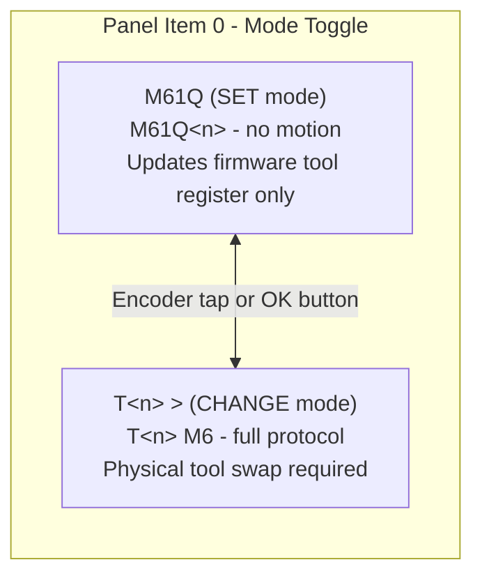
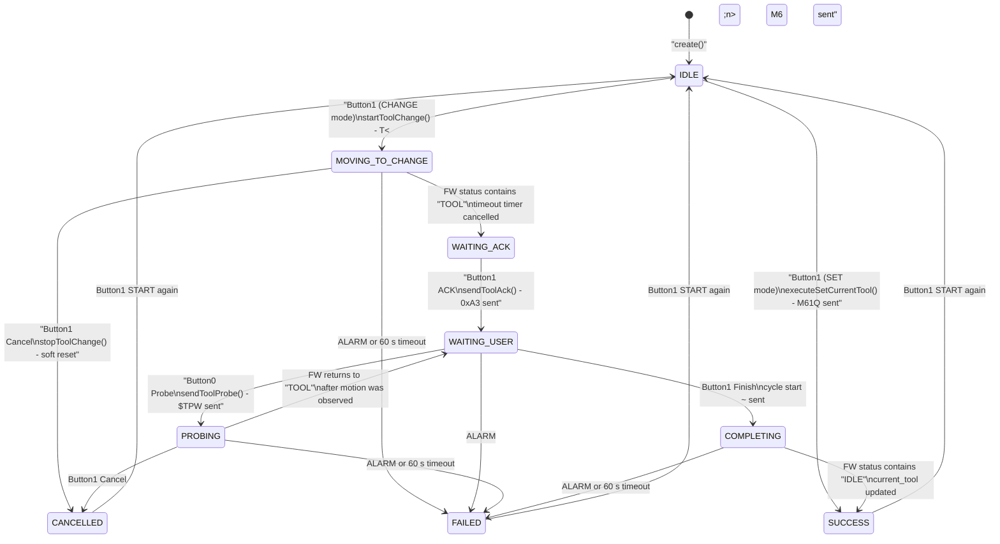
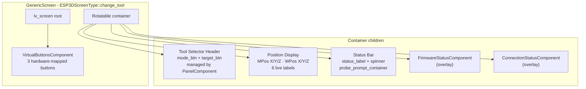
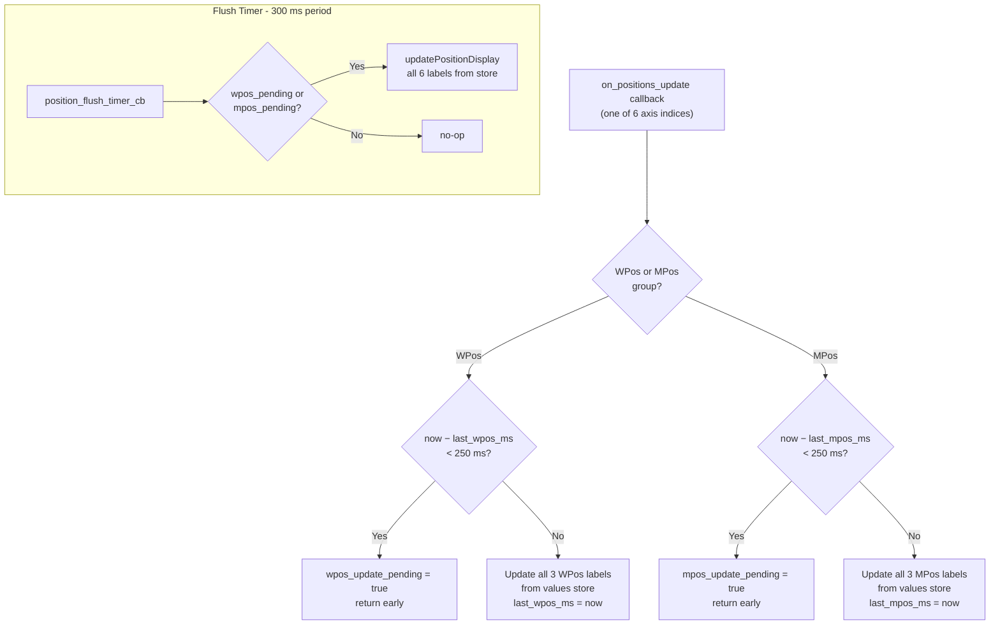
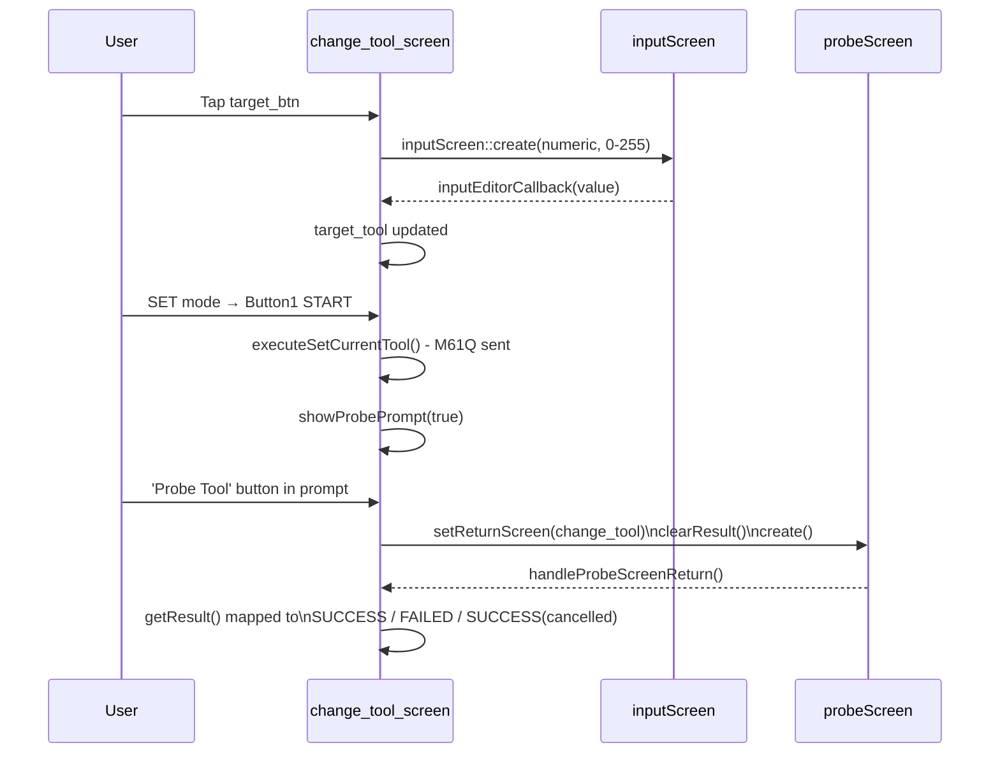
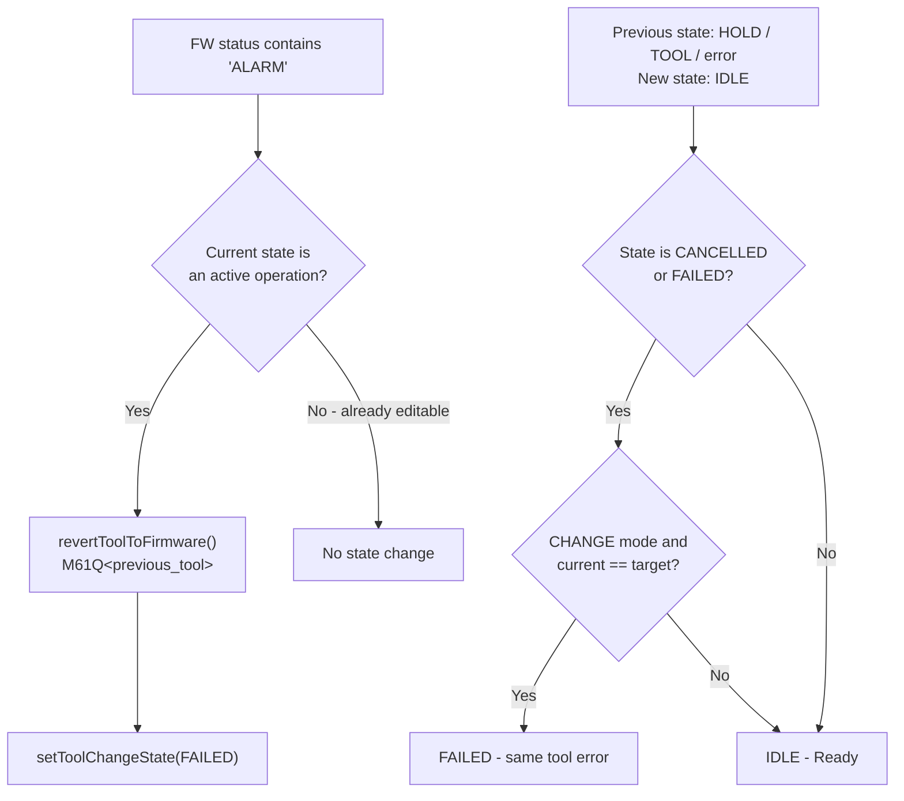
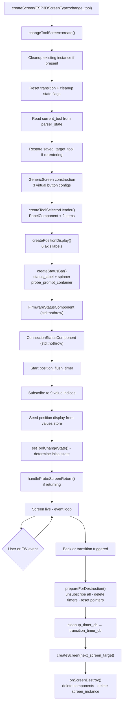

# grblHAL Module — Change Tool Screen

## Introduction

The `grblhal_module_change_tool` module implements the **Tool Change screen** for the grblHAL firmware target. It provides a complete user interface for two distinct tool-management operations:

- **CHANGE mode** (`T<n> M6`): Drives the full grblHAL manual tool-change protocol — sends the motion command, waits for the firmware "TOOL" paused state, acknowledges the pause, optionally probes the new tool length with the tool setter (`$TPW`), then resumes machining with cycle start (`~`).
- **SET mode** (`M61Q<n>`): Instantly updates the firmware's current-tool register with no motion, then optionally prompts the user to probe the new tool on the probe screen.

The screen is integrated as a child of the [`grblhal_module`](grblhal_module.md) and is reachable from the main screen via the standard screen router ([`grblhal_module_screen_router`](grblhal_module_screen_router.md)).

---

## Architecture Overview

```mermaid
graph TD
    subgraph grblhal_module_change_tool
        CT_SCREEN[change_tool_screen.cpp]
        CT_SM[ToolChangeState Machine]
        CT_MODE[ToolChangeMode - CHANGE / SET]
        CT_PANEL["PanelComponent\nMode toggle + Target tool"]
        CT_POS[Position Display\nMPos / WPos X·Y·Z]
        CT_STATUS["Status Bar + Spinner"]
        CT_PROBE_PROMPT[Probe Prompt Buttons]
    end

    subgraph UI_Framework
        GENERIC[GenericScreen]
        VBUTTONS[VirtualButtonsComponent]
        PANEL_COMP[PanelComponent]
        INPUT_SCR[inputScreen - numeric editor]
    end

    subgraph grblhal_shared_components
        FW_STATUS[FirmwareStatusComponent]
        CONN_STATUS[ConnectionStatusComponent]
        PROBE_SCR[probeScreen]
    end

    subgraph Core_Platform
        VALUES[ESP3DValues - Observable Store]
        GCODE[esp3dGcodeHandler]
        TRANS[ESP3DTranslationService]
    end

    CT_SCREEN --> GENERIC
    CT_SCREEN --> CT_SM
    CT_SCREEN --> CT_PANEL
    CT_SCREEN --> CT_POS
    CT_SCREEN --> CT_STATUS
    CT_SCREEN --> CT_PROBE_PROMPT
    GENERIC --> VBUTTONS
    CT_PANEL --> PANEL_COMP
    CT_SCREEN --> FW_STATUS
    CT_SCREEN --> CONN_STATUS
    CT_SCREEN --> INPUT_SCR
    CT_SCREEN --> PROBE_SCR
    CT_SM --> GCODE
    CT_SCREEN --> VALUES
    CT_SCREEN --> TRANS
```



---

## grblHAL Manual Tool-Change Protocol

The CHANGE mode implementation faithfully follows the [grblHAL manual tool-change protocol](https://github.com/grblHAL/core/wiki/Manual-tool-change-protocol):

```
T<n> M6
  │
  └─► grblHAL enters "TOOL" paused state
           │
           └─► Pendant sends 0xA3 realtime ack
                    │
                    └─► User physically installs tool
                             │
                             ├─► (Optional) Pendant sends $TPW
                             │        └─► Tool-setter probe cycles
                             │
                             └─► Pendant sends ~ (cycle start)
                                      │
                                      └─► grblHAL returns to IDLE
```

> **Important**: grblHAL uses the standard `T<n> M6` syntax. The FluidNC-only `M6T<n>` form is **not** used here. See [`fluidnc_module_change_tool`](fluidnc_module_change_tool.md) for the FluidNC counterpart.

---

## Tool Change Modes



| Mode | GCode Sent | Motion | Protocol Steps | Probe Option |
|---|---|---|---|---|
| **SET** (`M61Q`) | `M61Q<n>` | None | Instant register update | Yes — navigates to [`probeScreen`](grblhal_module_probe.md) via probe prompt |
| **CHANGE** (`T<n> M6`) | `T<n> M6` | Yes | Full 5-step protocol | Built-in `$TPW` during WAITING_USER state |

---

## State Machine

The screen owns a single-threaded state machine (`ToolChangeState`) driven exclusively by firmware status callbacks running on the LVGL thread (Core 1).



### State Descriptions

| State | Description |
|---|---|
| `IDLE` | Ready. Panel and target tool selector are editable. Both modes available. |
| `MOVING_TO_CHANGE` | `T<n> M6` sent. Waiting for firmware to reach "TOOL" paused state. 60 s timeout active. Cancel available. |
| `WAITING_ACK` | Firmware paused in "TOOL" state. Only the ACK action (0xA3) is offered. No timeout — user-driven. |
| `WAITING_USER` | Ack sent. User must physically install the new tool. `$TPW` (probe) and `~` (finish) are both available. |
| `PROBING` | `$TPW` sent. Waiting for the tool-setter probe cycle to complete. Detected when firmware re-enters "TOOL" state after having left it. 60 s timeout active. |
| `COMPLETING` | Cycle start `~` sent. Waiting for firmware to return to "IDLE". |
| `SUCCESS` | Operation completed. `current_tool` updated to `target_tool`. Panel re-enabled. |
| `FAILED` | Operation failed (alarm, timeout, or same-tool error). Panel re-enabled for retry. |
| `CANCELLED` | User aborted. Soft reset issued. Tool number reverted in firmware via `M61Q<previous_tool>`. |

---

## Component Composition



### Panel Items

The `PanelComponent` manages two interactive items inside the Tool Selector Header:

| Constant | Panel Role | Default Label | Interaction |
|---|---|---|---|
| `ITEM_ID_MODE` (`panel_id_mode`) | Mode toggle button | `M61Q` or `T<n> >` | Encoder tap → toggle CHANGE ↔ SET instantly |
| `ITEM_ID_TARGET` (`panel_id_target`) | Target tool button | `T<n>` | Encoder scroll → increment/decrement · tap → opens numeric [`inputScreen`](common_screens.md) (range 0–255) |

Encoder navigation cycles focus between these two items. In SET mode the mode button label reads `M61Q`; in CHANGE mode it reads `T<n> >` where `<n>` is `current_tool`.

---

## Value Subscriptions

The screen subscribes to the following [`ESP3DValues`](values.md) observables on creation and unsubscribes in `prepareForDestruction()`:

| Value Index | Callback | Purpose |
|---|---|---|
| `parser_state` | `on_parser_state_update` | Reads `T` field to track `current_tool` number |
| `firmware_status` | `on_firmware_status_update` | Primary state machine driver (TOOL / IDLE / ALARM / HOLD transitions) |
| `position_wx` `position_wy` `position_wz` | `on_positions_update` | Updates WPos display (throttled per group) |
| `position_mx` `position_my` `position_mz` | `on_positions_update` | Updates MPos display (throttled per group) |
| `server_status` | `on_connection_status_update` | Connection monitoring (logged; overlays handled by `ConnectionStatusComponent`) |

---

## Position Display Throttling

Position updates arrive at high frequency from the firmware status poll. A two-level throttle prevents excessive LVGL redraws while guaranteeing eventual consistency.



**Design rationale**: WPos and MPos maintain separate timestamps and separate pending flags because all six position callbacks fire in the same LVGL tick (from a single firmware status report). A shared timestamp would starve whichever group fires second; a shared flag would be cleared when one group passes the gate while the other is still pending.

---

## Virtual Button Mapping

Button labels and enabled states change dynamically based on `current_state` and firmware status. All updates go through `updateVirtualButtons()`.

| State | Button 0 (Left) | Button 1 (Center) | Button 2 (Right) |
|---|---|---|---|
| `IDLE` / `SUCCESS` / `FAILED` / `CANCELLED` | `ok_b` ✓ | `change_b` (enabled only if fw=IDLE and valid op) | `back_b` ✓ |
| `MOVING_TO_CHANGE` / `PROBING` / `COMPLETING` | — | `stop_b` Cancel | — |
| `WAITING_ACK` | — | `ok_b` ACK (0xA3) | — |
| `WAITING_USER` | `zero_b` $TPW probe | `play_b` Finish (~) | — |
| *Awaiting probe decision* | disabled | disabled | disabled |

The center button is additionally disabled in CHANGE mode when `current_tool == target_tool` (would be a no-op change).

---

## GCode Commands Issued

All commands are routed through `esp3dGcodeHandler` (see [`cnc_grblhal`](cnc_grblhal.md)):

| Operation | Command | `ESP3DCommandType` | Priority |
|---|---|---|---|
| Start tool change | `T<n> M6` | `normal` | default |
| Acknowledge pause | `0xA3` (`GRBLHAL_RT_TOOL_ACK`) | `realtime` | high |
| Tool-setter probe | `$TPW` | `normal` | default |
| Resume machining | `~` (`GRBL_RT_CYCLE_START`) | `realtime` | high |
| Abort / cancel | `0x18` (`GRBL_RT_SOFT_RESET`) | `realtime` | high |
| Set tool register | `M61Q<n>` | `normal` | default |
| Revert after cancel/timeout | `M61Q<previous_tool>` | `normal` | default |

---

## Sub-Screen Navigation



When the user taps "Ignore" in the probe prompt, the operation stays `SUCCESS` (M61Q already succeeded) without navigating away.

---

## Timeout Handling

A 60-second LVGL timer (`TOOL_CHANGE_TIMEOUT_MS = 60 000 ms`) is created when:
- `T<n> M6` is sent (`MOVING_TO_CHANGE` state)
- `$TPW` is sent (`PROBING` state)
- Cycle start `~` is sent (`COMPLETING` state)

On expiry:
1. Timer is deleted.
2. `revertToolToFirmware()` sends `M61Q<previous_tool>`.
3. If firmware is already `IDLE` → `FAILED` state set immediately.
4. If firmware is still busy → `pending_timeout_revert = true`; the `FAILED` state is applied on the next `on_firmware_status_update` call.

The timeout timer is cancelled when:
- Firmware naturally reaches `WAITING_ACK` (M6 motion phase complete — user-driven from here).
- Firmware returns to `IDLE` (`COMPLETING` → `SUCCESS`).
- `$TPW` probe completes (`PROBING` → `WAITING_USER`).
- User triggers `stopToolChange()` (Cancel button).

---

## Alarm and Error Recovery



---

## Screen Lifecycle



### Initial State Determination

On `create()`, the initial `ToolChangeState` is determined as follows:

| Firmware Status | Condition | Initial State | Message |
|---|---|---|---|
| Contains `"TOOL"` | Any | `WAITING_ACK` | Re-entered with pending grblHAL tool change |
| Not `"IDLE"` or unavailable | Any | `FAILED` | Firmware busy or disconnected |
| `"IDLE"` | CHANGE mode and `current_tool == target_tool` | `FAILED` | Same-tool error |
| `"IDLE"` | Otherwise | `IDLE` | Ready |

### Lifecycle Guards

| Guard | Purpose |
|---|---|
| `is_prepared_for_destruction` | Prevents double `prepareForDestruction()` calls |
| `cleanup_executed` | Prevents double cleanup timer execution |
| `ESP3D_PREPARE_DESTRUCTION_GUARD` macro | Atomically sets both flags at function entry |
| `std::nothrow` on all `new` | Allocation failure degrades gracefully — no uncaught exception in LVGL context |
| Null and `lv_obj_is_valid()` checks | Safe after partial construction or after `prepareForDestruction()` |

---

## State Persistence Across Re-Entry

The screen uses static-local variables to preserve context when navigating away to a sub-screen (input editor or probe screen) and returning:

| Variable | Preserved | Cleared When |
|---|---|---|
| `saved_target_tool` | Yes — set in `prepareForDestruction()` | Successful completion, or normal IDLE restore |
| `current_tool` | Yes — static | Updated live by `on_parser_state_update` |
| `previous_tool` | Yes — static | Overwritten at each `startToolChange()` call |
| `returning_from_probe` | Yes — static | Cleared in `handleProbeScreenReturn()` |
| `current_mode` | Yes — static | Never cleared; persists across sessions |
| `last_firmware_state` | Yes — static | Updated on each `on_firmware_status_update` call |
| `first_init` (local static) | Once only | Never — controls first-time target default |

---

## Dependencies Summary

| Module / Component | Role | Reference |
|---|---|---|
| `GenericScreen` | Base screen, container, virtual button infrastructure | [ui_core](ui_core.md) |
| `PanelComponent` | Mode toggle and target tool selector with encoder navigation | [ui_components](ui_components.md) |
| `FirmwareStatusComponent` | Firmware state overlay at top of container | [firmware_status](cnc_shared.md) |
| `ConnectionStatusComponent` | Connection state overlay | [grblhal_module_connection_status](grblhal_module_connection_status.md) |
| `probeScreen` | Optional tool-length probing after SET mode | [grblhal_module_probe](grblhal_module_probe.md) |
| `inputScreen` | Numeric editor for target tool number (0–255) | [common_screens](common_screens.md) |
| `ESP3DValues` | Observable store: `firmware_status`, `parser_state`, positions | [values](values.md) |
| `esp3dGcodeHandler` | Sends all GCode and realtime commands to the firmware | [cnc_grblhal](cnc_grblhal.md) |
| `ESP3DTranslationService` | All user-visible strings | [translations](translations.md) |
| `esp3d_screen_type.cpp` | `createScreen()` router that instantiates this screen | [grblhal_module_screen_router](grblhal_module_screen_router.md) |

---

## File Reference

| File | Description |
|---|---|
| `main/display/cnc/grblhal/screens/change_tool_screen.cpp` | Full implementation — `changeToolScreen` namespace |
| `main/display/cnc/grblhal/screens/change_tool_screen.h` | Public API: `changeToolScreen::create()` |
| `main/display/cnc/grblhal/screens/esp3d_screen_type.cpp` | Screen router: maps `ESP3DScreenType::change_tool` → `changeToolScreen::create()` |

---

## Parallel Implementations

The tool-change screen exists in all three CNC firmware targets. The grblHAL variant is differentiated by the grblHAL-specific `0xA3` realtime acknowledge command and the `$TPW` tool-setter probe integration:

| Target | Module | Key Differentiator |
|---|---|---|
| **grblHAL** | `grblhal_module_change_tool` *(this document)* | `T<n> M6` + 0xA3 ack + optional `$TPW` + `~` resume |
| **grbl** | [`grbl_module_change_tool`](grbl_module_change_tool.md) | Same structure; different realtime constants |
| **FluidNC** | [`fluidnc_module_change_tool`](fluidnc_module_change_tool.md) | `M6T<n>` syntax; different state detection logic |


## Documents de conception (depot)

- [change_tool_screen](https://github.com/luc-github/Pibot-cnc-pendant-firmware/blob/main/docs/ux_flows/grblhal/change_tool_screen.md)
