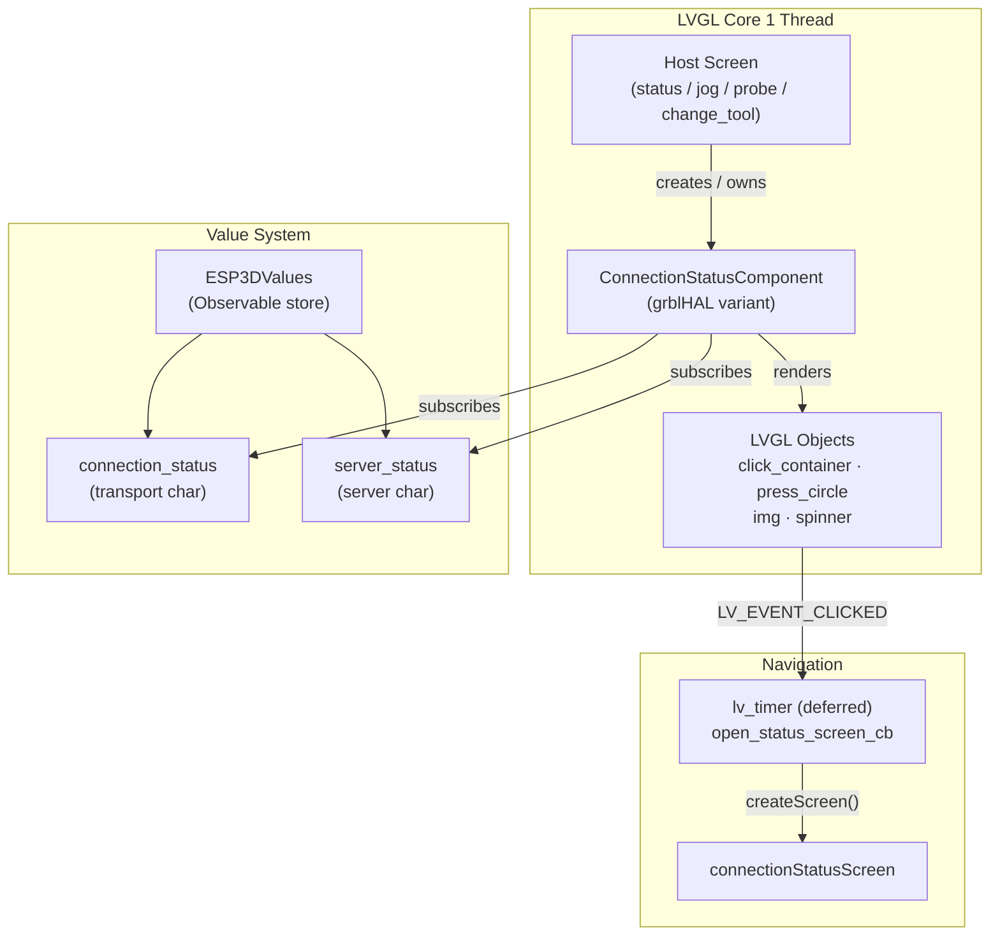
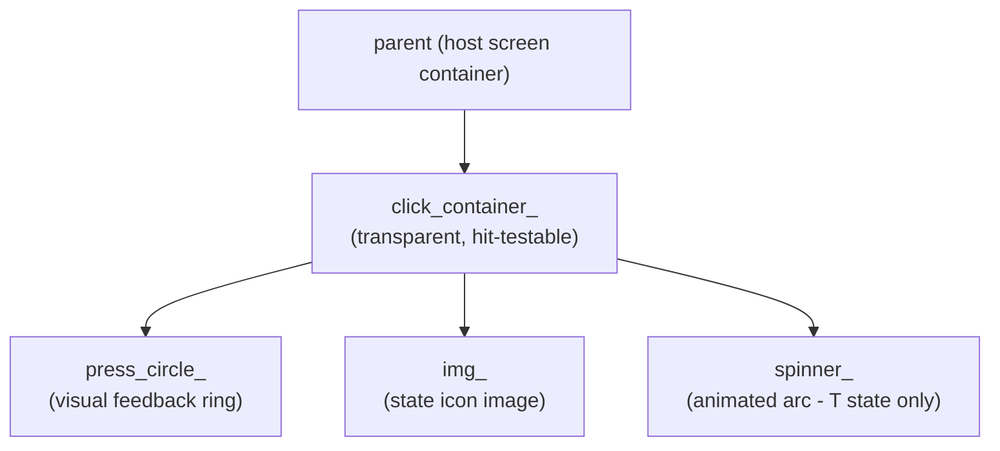
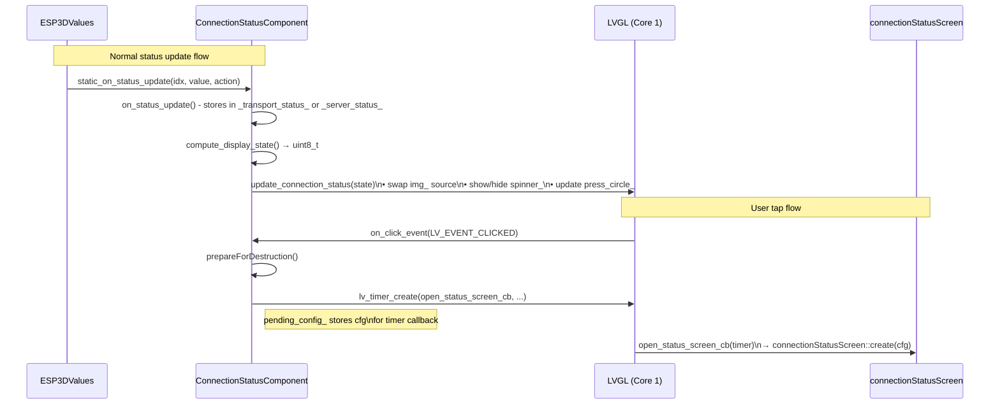
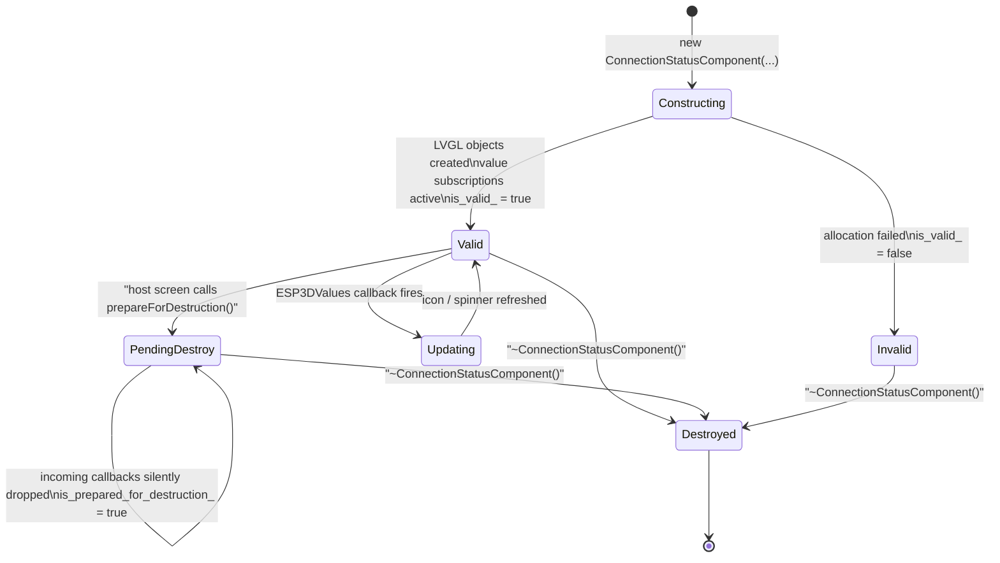
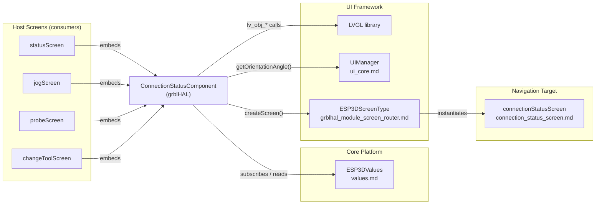

# grblHAL Module — Connection Status Component

## Introduction

The `grblhal_module_connection_status` module provides the **connection status indicator widget** used across all grblHAL firmware screens. It is a compact, clickable LVGL component that permanently occupies the corner of the host screen and gives the operator a live, at-a-glance view of the CNC link state. A single tap on the icon navigates to the full [connection status screen](connection_status_screen.md).

The component is architecturally identical to its counterparts in the [fluidnc](fluidnc_module_connection_status.md) and [grbl](grbl_module_connection_status.md) modules, with one grblHAL-specific extension: the `"R"` (read-only / PASSIVE token) connection state, which has no equivalent in the other firmware targets.

**Source files**

| File | Role |
|------|------|
| `main/display/cnc/grblhal/components/connection_status.h` | Class declaration — `ConnectionStatusComponent`, `ConnectionStatusConfig` |

---

## Architecture Overview



---

## Connection State Model

The component tracks two independent status characters sourced from `ESP3DValues` and combines them into a single `display_state` byte via `compute_display_state()`.

| Source index | Member field | Meaning |
|---|---|---|
| `ESP3DValuesIndex::connection_status` | `_transport_status_` | Physical/radio link layer (UART, BT, WiFi…) |
| `ESP3DValuesIndex::server_status` | `_server_status_` | Application-level CNC session |

### Status character reference

| Char | Name | Description | grblHAL only |
|------|------|-------------|:---:|
| `?` | Unknown / Disconnected | Default; transport or session not yet established | |
| `.` | Radio off | Transport disabled (WiFi/BT turned off) | |
| `T` | Connecting | Transport connecting or server handshake in progress | |
| `A` | Auth failed | Server rejected authentication | |
| `C` | Connected (full) | Session established with full control | |
| `R` | Connected (read-only) | Connected but grblHAL PASSIVE token not held — display-only mode | ✓ |

> **grblHAL PASSIVE note:** The `"R"` state is unique to grblHAL. It indicates that the pendant has a live connection but does not currently hold the motion-control token, so CNC commands are blocked. The icon reflects this with a distinct visual state. The grbl and fluidnc variants never emit `"R"`.

---

## Component Structure

### `ConnectionStatusConfig`

Plain configuration struct; callers pass this at construction time and can update it later via `updateConfig()`.

```cpp
struct ConnectionStatusConfig {
    lv_align_t align = LV_ALIGN_TOP_RIGHT;                    // Corner placement
    int32_t x_offset = 0;                                     // Pixel offset X
    int32_t y_offset = 0;                                     // Pixel offset Y
    ESP3DScreenType return_screen = ESP3DScreenType::main;    // Where to go on Back
    void (*prepare_parent_screen_destruction)(void) = nullptr;// Pre-destroy hook
};
```

| Field | Purpose |
|-------|---------|
| `align` | LVGL alignment anchor — defaults to top-right corner |
| `x_offset` / `y_offset` | Fine-tune offset within the anchor |
| `return_screen` | The screen the `connection_status_screen` navigates back to when dismissed |
| `prepare_parent_screen_destruction` | Optional callback invoked just before the parent screen is destroyed (e.g. to unsubscribe sibling components) |

---

### `ConnectionStatusComponent`

The main widget class. One instance lives per host screen that embeds a connection indicator.

#### LVGL Object Hierarchy



| Object | LVGL type | Role |
|--------|-----------|------|
| `click_container_` | `lv_obj_t` | Transparent hit area; receives `LV_EVENT_CLICKED` |
| `press_circle_` | `lv_obj_t` | Circular highlight shown on press for tactile feedback |
| `img_` | `lv_obj_t` (image) | Displays the icon corresponding to the current connection state |
| `spinner_` | `lv_obj_t` (spinner) | Rotating arc; visible only while `_transport_status_ == 'T'` |

#### Public API

| Method | Description |
|--------|-------------|
| `ConnectionStatusComponent(parent, host_screen, config, angle)` | Constructor — creates LVGL objects, subscribes to value updates |
| `~ConnectionStatusComponent()` | Destructor — unsubscribes from values, deletes LVGL objects safely |
| `updateOrientation(angle)` | Re-positions the widget for a new display rotation angle |
| `updatePosition(align, x, y)` | Moves the widget to a new anchor/offset without full re-creation |
| `updateConfig(config)` | Hot-updates the full configuration (useful when screen transitions change the return target) |
| `prepareForDestruction()` | Called by the host screen before destroying itself; disarms callbacks to prevent use-after-free |
| `isValid() → bool` | Guard — returns `false` if construction failed (allocation error) |

#### Static Helpers (orientation-aware placement)

These static helpers let sibling components calculate their own positions relative to where the connection status icon will appear, even before an instance exists.

| Method | Description |
|--------|-------------|
| `get_x_position(get_orientation)` | Returns the X pixel offset adjusted for the current display orientation |
| `get_y_position(get_orientation)` | Returns the Y pixel offset adjusted for the current display orientation |
| `get_alignment(get_orientation)` | Returns the `lv_align_t` anchor adjusted for the current display orientation |
| `getHostScreen() → ESP3DScreenType` | Returns the screen type of the current host — used by `connection_status_screen` to set its return target |

---

## Data & Event Flow



### Callback Bridge Pattern

LVGL event callbacks are plain C function pointers and cannot carry a C++ `this` pointer. The component bridges this with static members:

```
static bool static_on_status_update(idx, value, action)
    └─► delegates to instance → on_status_update(idx, value, action)

static void on_click_event(lv_event_t *e)
    └─► reads host_screen_static_ and pending_config_
        schedules open_status_screen_cb timer

static void open_status_screen_cb(lv_timer_t *timer)
    └─► calls createScreen(ESP3DScreenType::connection_status)
```

The timer-deferred navigation pattern is **mandatory** per the LVGL threading rules documented in [`screens_architecture`](https://github.com/luc-github/Pibot-cnc-pendant-firmware/blob/main/docs/architecture/screens_architecture.md): UI objects must never be destroyed synchronously inside an event callback.

---

## Lifecycle & Safety



**Key safety invariants:**

1. `is_valid_` is checked at the top of `static_on_status_update` — stale callbacks after construction failure are silently dropped.
2. `is_prepared_for_destruction_` short-circuits all incoming callbacks after `prepareForDestruction()` is called, preventing stale LVGL object access during teardown.
3. Screen navigation is **always deferred** to an `lv_timer` — never triggered synchronously inside an LVGL event callback.
4. `pending_config_` (static member) stores the configuration for the timer callback, avoiding a dangling reference to a stack-allocated struct.

---

## Dependencies



| Dependency | Type | Notes |
|------------|------|-------|
| `ESP3DValues` → [`values`](values.md) | Runtime | Observable store providing `connection_status` and `server_status` change events |
| LVGL | External library | All widget rendering; strictly confined to Core 1 |
| `UIManager` | Singleton | Supplies current orientation angle for positioning |
| `ESP3DScreenType` | Enum | Identifies the host screen and the navigation target |
| `connectionStatusScreen` → [`connection_status_screen`](connection_status_screen.md) | Navigation target | Full-detail screen opened on tap |

---

## Cross-Firmware Variants

All three firmware modules expose an **identical public API** for `ConnectionStatusComponent` and `ConnectionStatusConfig`. The sole behavioral difference is in `compute_display_state()`, which maps the two raw status characters to a display state byte:

| Variant | Extra state | Header path |
|---------|-------------|-------------|
| **grblHAL** (this module) | `"R"` read-only / PASSIVE token | `main/display/cnc/grblhal/components/connection_status.h` |
| grbl → [`grbl_module_connection_status`](grbl_module_connection_status.md) | — | `main/display/cnc/grbl/components/connection_status.h` |
| fluidnc → [`fluidnc_module_connection_status`](fluidnc_module_connection_status.md) | — | `main/display/cnc/fluidnc/components/connection_status.h` |

This design ensures all host screens can be updated identically across firmware targets — only the grblHAL variant produces a distinct visual for the PASSIVE (`"R"`) state.

---

## Usage Pattern

Typical embedding in a grblHAL host screen:

```cpp
#include "cnc/grblhal/components/connection_status.h"

static ConnectionStatusComponent* cs_component = nullptr;

// --- Screen creation ---
static void onScreenAboutToDestroy();

ConnectionStatusConfig cs_config;
cs_config.align               = ConnectionStatusComponent::get_alignment();
cs_config.x_offset            = ConnectionStatusComponent::get_x_position();
cs_config.y_offset            = ConnectionStatusComponent::get_y_position();
cs_config.return_screen       = ESP3DScreenType::main;
cs_config.prepare_parent_screen_destruction = onScreenAboutToDestroy;

cs_component = new (std::nothrow) ConnectionStatusComponent(
    container,
    ESP3DScreenType::status,   // host_screen identity
    cs_config,
    ui_manager.getOrientationAngle()
);

if (!cs_component || !cs_component->isValid()) {
    // Handle allocation failure — do NOT throw in LVGL context
    delete cs_component;
    cs_component = nullptr;
}

// --- Orientation change ---
if (cs_component) {
    cs_component->updateOrientation(new_angle);
}

// --- Pre-destroy hook (called from ConnectionStatusConfig callback) ---
static void onScreenAboutToDestroy() {
    if (cs_component) {
        cs_component->prepareForDestruction();
    }
}

// --- LV_EVENT_DELETE handler ---
static void onScreenDestroy(lv_event_t *e) {
    delete cs_component;
    cs_component = nullptr;
}
```

> **Memory note:** Use `new (std::nothrow)` and always check `isValid()`. The embedded heap can be very small (< 1 KB largest free block under load). Never throw inside an LVGL event or screen callback — an uncaught exception resets the board. See [`esp32_memory_constraints`](https://github.com/luc-github/Pibot-cnc-pendant-firmware/blob/main/docs/guides/esp32_memory_constraints.md).

---

## Related Documentation

| Document | Relevance |
|----------|-----------|
| [`connection_status_screen`](connection_status_screen.md) | Full-detail screen this component navigates to on tap |
| [`grblhal_module_screen_router`](grblhal_module_screen_router.md) | `createScreen()` dispatcher; routes `ESP3DScreenType::connection_status` to `connectionStatusScreen` |
| [`grblhal_module_change_tool`](grblhal_module_change_tool.md) | Host screen that embeds this component |
| [`grblhal_module_probe`](grblhal_module_probe.md) | Host screen that embeds this component and reacts to `"C"` to release the system lock |
| [`grbl_module_connection_status`](grbl_module_connection_status.md) | grbl counterpart (identical API, no `"R"` state) |
| [`fluidnc_module_connection_status`](fluidnc_module_connection_status.md) | fluidnc counterpart (identical API, no `"R"` state) |
| [`values`](values.md) | `ESP3DValues` observable store that powers status updates |
| [`connection_management`](https://github.com/luc-github/Pibot-cnc-pendant-firmware/blob/main/docs/architecture/connection_management.md) | Overall connection lifecycle and status character semantics |
| [`screens_architecture`](https://github.com/luc-github/Pibot-cnc-pendant-firmware/blob/main/docs/architecture/screens_architecture.md) | LVGL screen system and mandatory timer-based transition rules |
| [`esp32_memory_constraints`](https://github.com/luc-github/Pibot-cnc-pendant-firmware/blob/main/docs/guides/esp32_memory_constraints.md) | Heap fragmentation and safe allocation patterns for ESP32 |
