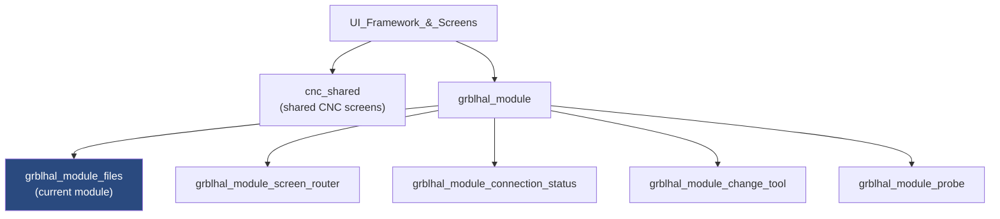
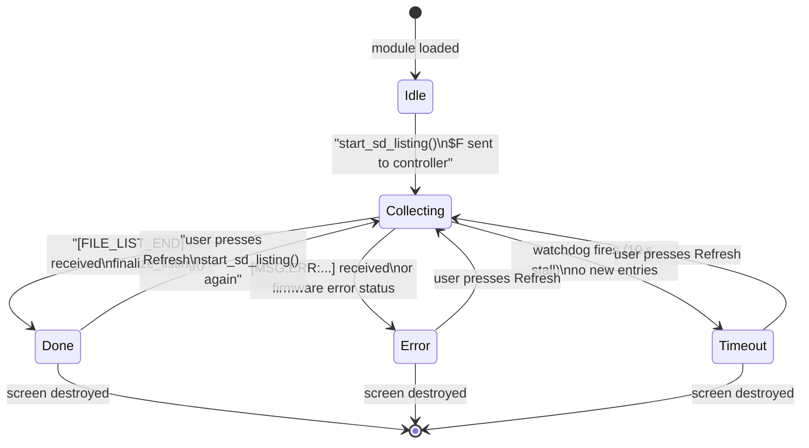
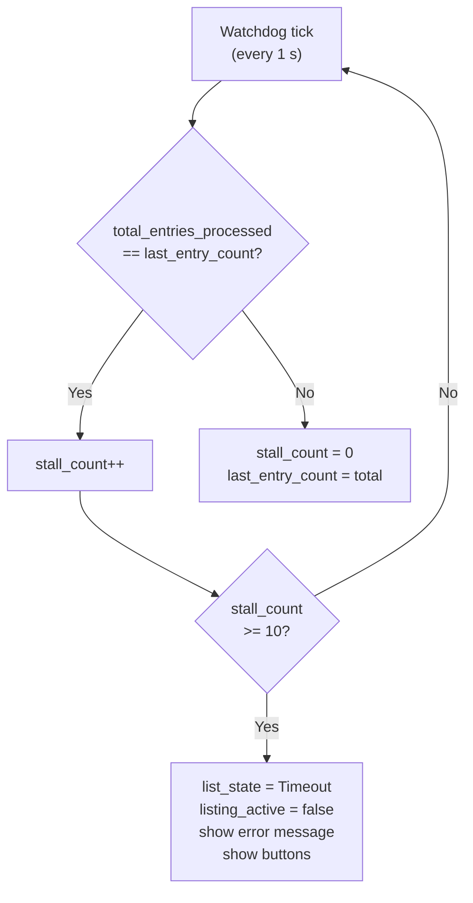
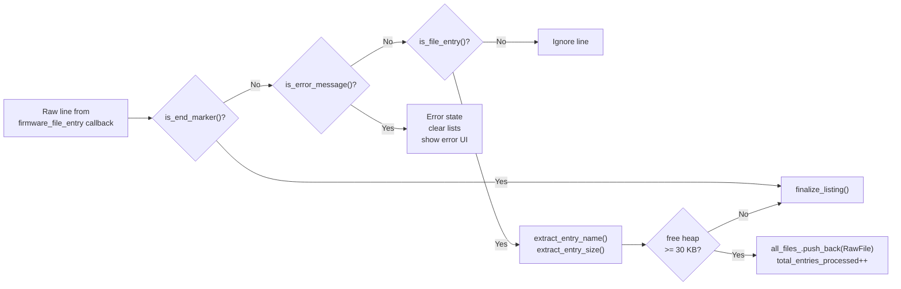
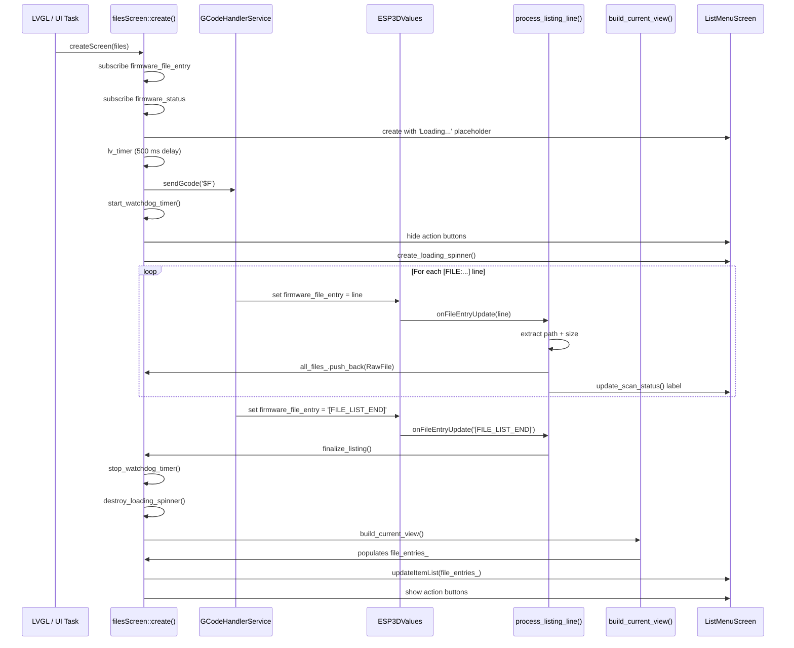
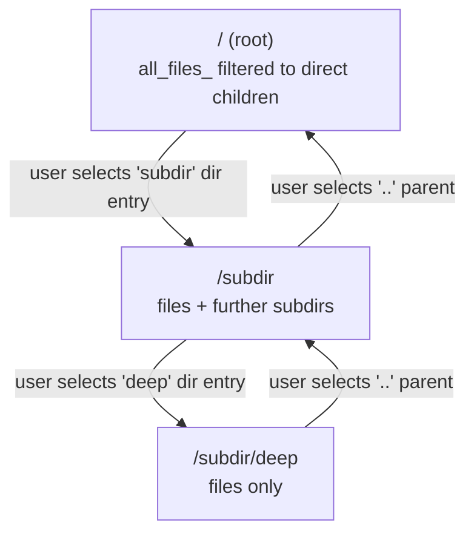
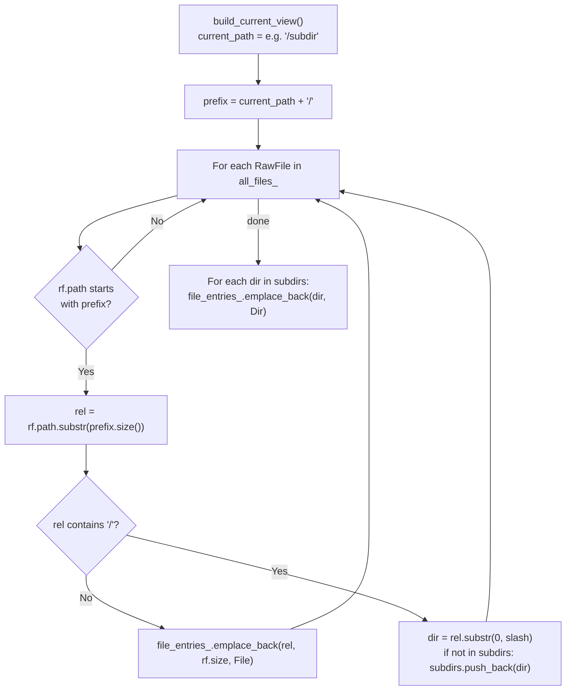
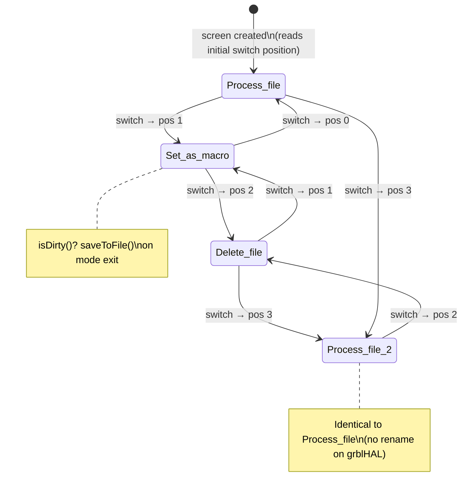
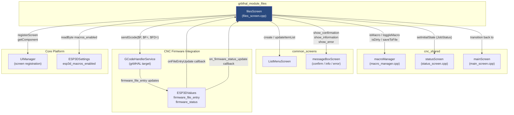

# grblHAL Files Screen Module

The **grblHAL Files Screen** (`grblhal_module_files`) implements the SD-card file browser for pendant firmware targets that communicate with a [grblHAL](https://github.com/grblHAL) controller. It is the grblHAL-specific counterpart to the equivalent screens in the FluidNC and Grbl modules, but differs fundamentally in how the file tree is obtained and navigated:

- **grblHAL lists the whole SD card flat and recursively** in one `$F` request — no `[DIR:]` entries are emitted. The response is a sequence of `[FILE:/absolute/path.ext|SIZE:n]` lines terminated by a synthesized `[FILE_LIST_END]` sentinel.
- **All directory navigation happens locally** on the pendant after the single initial scan. No per-directory re-queries are issued to the controller.
- **Rename is not supported** by the grblHAL SD protocol; the 4-position switch's fourth position therefore repeats *Run* rather than exposing a rename action.

---

## Table of Contents

1. [Module Position in the System](#1-module-position-in-the-system)
2. [File Structure](#2-file-structure)
3. [Architecture Overview](#3-architecture-overview)
4. [Core Data Structures](#4-core-data-structures)
5. [State Machines](#5-state-machines)
6. [grblHAL SD Protocol](#6-grblhal-sd-protocol)
7. [File Listing Flow](#7-file-listing-flow)
8. [Local Directory Navigation](#8-local-directory-navigation)
9. [File Action Modes](#9-file-action-modes)
10. [Component Interactions](#10-component-interactions)
11. [Key Functions Reference](#11-key-functions-reference)
12. [Memory Safety Strategy](#12-memory-safety-strategy)
13. [Dependencies](#13-dependencies)

---

## 1. Module Position in the System



The files screen belongs to the `grblhal_module` subtree inside `UI_Framework_&_Screens`. It is created by the screen router ([grblhal_module_screen_router.md](grblhal_module_screen_router.md)) and shares common CNC infrastructure (status screen, macro manager, message box) via [cnc_shared.md](cnc_shared.md).

---

## 2. File Structure

```
main/display/cnc/grblhal/screens/
└── files_screen.cpp       ← entire module (namespace filesScreen)
    ├── FileEntry           data structure for display rows
    ├── RawFile             flat-listing record from $F
    ├── FileListState       enum – async listing state machine
    ├── FileActionMode      enum – 4-position switch actions
    ├── build_current_view()  local tree navigation
    ├── process_listing_line() line parser for $F output
    └── compareFileEntries()  sort comparator
```

Everything lives inside the **`filesScreen` namespace**, with static internal linkage. There is no public header — the screen is reached exclusively through `createScreen(ESP3DScreenType::files)` dispatched by the screen router.

---

## 3. Architecture Overview

```mermaid
graph LR
    subgraph "grblHAL Controller"
        CTRL["grblHAL\n$F / $F= / $FD="]
    end

    subgraph "CNC Firmware Integration"
        HANDLER["esp3d_gcode_handler_service\n(grblHAL target)"]
        VALUES["ESP3DValues\nfirmware_file_entry\nfirmware_status"]
    end

    subgraph "grblhal_module_files"
        LISTING["Flat Listing\nall_files_ (RawFile[])"]
        VIEW["Current View\nfile_entries_ (FileEntry[])"]
        NAV["Local Navigation\ncurrent_path"]
        PARSE["process_listing_line()"]
        BUILD["build_current_view()"]
        WATCHDOG["Watchdog Timer\n(10 s stall detection)"]
    end

    subgraph "UI Layer"
        LMS["ListMenuScreen\n(common_screens)"]
        SPINNER["Loading Spinner"]
        MSGBOX["messageBoxScreen\n(confirm/cancel)"]
        MACROS["macroManager\n(cnc_shared)"]
        STATUS["statusScreen\n(cnc_shared)"]
    end

    CTRL -->|"$F output lines"| HANDLER
    HANDLER -->|"firmware_file_entry\ncallback"| VALUES
    VALUES -->|"onFileEntryUpdate()"| PARSE
    PARSE -->|"push_back(RawFile)"| LISTING
    PARSE -->|"[FILE_LIST_END]"| BUILD
    LISTING -->|"local rebuild"| BUILD
    BUILD -->|"populates"| VIEW
    NAV -->|"path prefix filter"| BUILD
    VIEW -->|"updateItemList()"| LMS
    WATCHDOG -->|"stall detected"| VIEW
    LMS -->|"item click"| MSGBOX
    MSGBOX -->|"confirm launch"| CTRL
    MSGBOX -->|"confirm delete"| CTRL
    LMS -->|"item click"| MACROS
    MSGBOX -->|"launch confirmed"| STATUS

    style LISTING fill:#1a3a5c,color:#fff
    style BUILD fill:#1a3a5c,color:#fff
```



### Key architectural decisions

| Decision | Rationale |
|---|---|
| Single `$F` scan, local navigation | grblHAL emits the entire tree at once — no per-directory command exists |
| `RawFile` master list kept in memory | Enables instant subdirectory traversal without controller round-trips |
| `[FILE_LIST_END]` sentinel | grblHAL's `"ok"` line is intercepted by the gcode handler which synthesises this marker; the screen relies on the sentinel, not on parsing `"ok"` |
| No rename action on position 3 | `$F` protocol has no rename command; position 3 of the switch repeats *Run* |
| Watchdog timer (10 s) | Guards against the controller failing to emit the end-of-listing sentinel |

---

## 4. Core Data Structures

### 4.1 `RawFile`

```cpp
struct RawFile {
    std::string path;   // full absolute path, e.g. "/subdir/CUBE.gcode"
    std::string size;   // size in bytes as string (may be empty)
};
static std::vector<RawFile> all_files_;
```

The **master flat listing** — one entry per file reported by `$F`. Populated once per scan. Directory navigation never touches the controller again; `build_current_view()` derives the visible tree from this vector.

### 4.2 `FileEntry`

```cpp
struct FileEntry {
    std::string name;   // display name (basename or directory component)
    std::string size;   // formatted size (empty for directories)
    enum class Type : uint8_t {
        File, Dir, Parent, Info, Error
    } type;
};
static std::vector<FileEntry> file_entries_;   // current directory view
```

The **display list** for the current directory. Rebuilt by `build_current_view()` every time the user navigates into or out of a directory. `Info` and `Error` rows are tagged non-selectable by the UI manager.

### 4.3 `FileActionMode`

```cpp
enum class FileActionMode : uint8_t {
    Process_file   = 0,  // LV_SYMBOL_DRIVE  – $F=<path>
    Set_as_macro   = 1,  // ESP3D_SYMBOL_ROBOT – pendant-side macro tagging
    Delete_file    = 2,  // LV_SYMBOL_TRASH  – $FD=<path>
    Process_file_2 = 3   // LV_SYMBOL_DRIVE  – repeats Run (no rename on grblHAL)
};
```

Maps directly to the 4-position hardware switch position. On touch-only hardware, positions 0–2 are emulated (position 3 is suppressed).

---

## 5. State Machines

### 5.1 File Listing State Machine (`FileListState`)



| State | Meaning |
|---|---|
| `Idle` | Initial state, no scan started yet |
| `Collecting` | Receiving `[FILE:...]` lines from `$F`; `listing_active = true` |
| `Done` | Full listing received; `all_files_` is the authoritative source |
| `Error` | SD card mount error or firmware error status received |
| `Timeout` | Watchdog fired; no progress for 10 consecutive seconds |

### 5.2 Watchdog Timer Logic

The watchdog fires every **1 second** (`WATCHDOG_INTERVAL_MS = 1000`). It compares `total_entries_processed` against `last_entry_count`. If unchanged for `MAX_STALL_COUNT = 10` consecutive ticks (10 seconds), the listing is aborted with a `Timeout` state.



---

## 6. grblHAL SD Protocol

### 6.1 Commands

| Command | Purpose |
|---|---|
| `$F` | List all files recursively, flat format, absolute paths |
| `$F=<absolute-path>` | Run (stream) a file |
| `$FD=<absolute-path>` | Delete a file |

> **Note:** Rename is not supported. The 4-position switch's third position (index 3) therefore repeats the *Run* action.

### 6.2 Listing Response Format

```
[FILE:/path/to/file.gcode|SIZE:315841]
[FILE:/another/file.nc|SIZE:1024]
[FILE:/deep/subdir/file.tap|SIZE:4096]
...
[FILE_LIST_END]
```

- Each line begins with `[FILE:` and contains the **full absolute path** (no separate `[DIR:]` entries).
- The `|SIZE:n` segment is optional but typically present.
- The `[FILE_LIST_END]` sentinel is **synthesized by the gcode handler** (`esp3d_gcode_handler_service` for grblHAL target) when it sees the `"ok"` that terminates the `$F` command. The screen itself never parses raw `"ok"` lines.

### 6.3 Error Detection

```
[MSG:ERR: Failed to mount device]
```

Detected by `is_error_message()`. Causes immediate transition to the `Error` state, clearing both `all_files_` and `file_entries_`.

### 6.4 Parsing Pipeline



---

## 7. File Listing Flow

The complete sequence from screen creation to a populated file list:



### Master List Persistence

`all_files_` is **not cleared on screen destruction or messageBox transitions**. This means:
- Returning from a confirmation dialog immediately re-displays the existing list without a re-scan.
- `all_files_` is only cleared explicitly by `start_sd_listing()` (new scan) or on SD error.

---

## 8. Local Directory Navigation

### 8.1 Model



There are **no controller requests** during navigation. Every directory change rebuilds `file_entries_` from `all_files_` using `build_current_view()`.

### 8.2 `build_current_view()` Logic



### 8.3 Path Helpers

| Function | Input | Output |
|---|---|---|
| `get_parent_path(path)` | `/subdir/deep` | `/subdir` |
| `get_parent_path(path)` | `/subdir` | `/` |
| `get_parent_path(path)` | `/` | `/` (no-op) |
| `append_to_path(name)` | `/` + `"subdir"` | `/subdir` |
| `append_to_path(name)` | `/subdir` + `"deep"` | `/subdir/deep` |

### 8.4 Sort Order (`compareFileEntries`)

```
1. Parent (..) entry — always first
2. Error / Info placeholder rows — second
3. Files (alphabetical, case-insensitive)
4. Directories (alphabetical, case-insensitive)
```

---

## 9. File Action Modes

The 4-position hardware switch (or 3-position touch emulation) controls what happens when the user selects a file:



### Action Details

| Switch Position | Icon | Action on File Select |
|---|---|---|
| 0 — `Process_file` | `LV_SYMBOL_DRIVE` | Show confirmation → `$F=<path>` → transition to `statusScreen` |
| 1 — `Set_as_macro` | `ESP3D_SYMBOL_ROBOT` (or `LV_SYMBOL_FILE` if macros disabled) | Show file info / toggle macro tag via `macroManager` |
| 2 — `Delete_file` | `LV_SYMBOL_TRASH` | Show confirmation → `$FD=<path>` → update local `all_files_` |
| 3 — `Process_file_2` | `LV_SYMBOL_DRIVE` | Same as position 0 (grblHAL has no rename) |

#### Directory selection (any mode)

- **Dir entry**: descend into directory (local, no network request).
- **Parent `..` entry**: ascend to parent (local).
- **Error / Info row**: ignored (non-selectable).
- **Directory in Delete mode**: rejected with `ESP3D_ERROR_BEEP` — only files can be deleted.

#### Footer display

The footer bar always shows the current action mode icon and a translated label. On touch hardware the footer's left zone doubles as a mode-cycle button (3 states: Run → Macro → Delete).

---

## 10. Component Interactions

### 10.1 Interaction Diagram



### 10.2 Screen Lifecycle Events

| Event | Handler | Effect |
|---|---|---|
| Screen created | `create()` → `onScreenCreated()` | Subscribe to values; decide scan vs. reuse list |
| LVGL `LV_EVENT_DELETE` | `onScreenDestroy()` | Unregister from UIManager; delete C++ instance |
| `prepareForDestruction()` | Called before any transition | Stop watchdog; unsubscribe; hide spinner; save macros if dirty |
| `redirect_target_` set | `create()` start | Deferred redirect via `lv_timer`; skips full screen build |

### 10.3 Transition Targets

| User action | Destination screen |
|---|---|
| Confirm job launch | `statusScreen` (JobStatus / Control mode) |
| Back button | `mainScreen` |
| Confirm / cancel dialog closes | Returns to `filesScreen` (re-created, reuses `all_files_`) |

---

## 11. Key Functions Reference

### 11.1 `process_listing_line(const char *line) → bool`

Parses a single line emitted by the grblHAL gcode handler. Returns `true` to continue, `false` when the listing is complete or aborted.

```
Input variants
  [FILE:/path/name.ext|SIZE:n]  → add RawFile to all_files_
  [FILE_LIST_END]               → finalize_listing()
  [MSG:ERR: ...]                → error state, clear lists
  anything else                 → ignored
```

Memory guard: if free internal heap drops below `MIN_FREE_HEAP_BYTES` (30 KB), `finalize_listing()` is called immediately to stop collecting and display what has been gathered so far.

### 11.2 `build_current_view()`

Rebuilds `file_entries_` from `all_files_` for the current directory (`current_path`). Immediate file children become `File` entries; deeper paths contribute at most one `Dir` entry for their immediate subdirectory component.

Called by: `display_file_list()`, which is in turn called by `finalize_listing()` and by every local navigation action.

### 11.3 `display_file_list()`

Single authoritative entry point for populating the list widget. Sequence:

1. Call `build_current_view()`.
2. Update the list title to `current_path`.
3. If `file_entries_` is empty → display `no_files` info message.
4. Sort with `compareFileEntries()`.
5. Prepend a `Parent` entry if `current_path != "/"`.
6. Call `ListMenuScreen::updateItemList()`.
7. Restore focus to `pending_job_selection_index` if set (returns from cancel).

### 11.4 `compareFileEntries(a, b) → bool`

Strict weak ordering for `std::sort`. Priority: Parent → Error/Info → File (alpha) → Dir (alpha). Case-insensitive via `strcasecmp`.

### 11.5 `RawFile` (struct)

Internal storage for each file returned by `$F`. Fields: `path` (full absolute path), `size` (byte count as string). Stored in `all_files_` (static, persists across screen visits).

### 11.6 `finalize_listing()`

Shared termination for both the normal end-of-list path and the low-memory / stall cutoff path:

1. `stop_watchdog_timer()`
2. `list_state = Done`, `listing_active = false`
3. `destroy_loading_spinner()`
4. `display_file_list()`
5. Show action buttons

### 11.7 `setRedirectTarget(ESP3DScreenType target)`

Sets a one-shot redirect. When `create()` is next called (e.g., after a messageBox closes), it immediately navigates to `target` via a zero-delay LVGL timer instead of building the files screen again. Used after a successful job launch to jump to `statusScreen`.

---

## 12. Memory Safety Strategy

The ESP32 heap is severely constrained (see [docs/guides/esp32_memory_constraints.md](https://github.com/luc-github/Pibot-cnc-pendant-firmware/blob/main/docs/guides/esp32_memory_constraints.md)). The module applies several defensive patterns:

### 12.1 Minimum Free Heap Guard

```cpp
static const uint32_t MIN_FREE_HEAP_BYTES = 30000; // 30 KB
```

Checked in `process_listing_line()` before every `push_back`. If the threshold is breached, `finalize_listing()` is called immediately — the user gets whatever files were already collected.

### 12.2 `std::bad_alloc` Containment

Every `std::vector` mutation that occurs within an LVGL callback context is wrapped in `try/catch(const std::exception&)`. An uncaught `std::bad_alloc` in LVGL context calls `std::terminate` and reboots the board. On catch, the function logs the error and returns with the partially built structure, never propagating the exception.

### 12.3 `file_entries_` Preservation Across Dialogs

`prepareForDestruction()` deliberately **does not clear** `file_entries_` or `all_files_`. This preserves the user's directory view across confirmation-dialog round-trips (confirm launch, confirm delete, cancel). The lists are only cleared by:

- `start_sd_listing()` — explicit refresh
- `on_firmware_status_update()` — SD card error
- `process_listing_line()` — mount error line

### 12.4 `new (std::nothrow)` for Screen Instance

```cpp
files_screen_obj_instance = new (std::nothrow) ListMenuScreen(...);
```

Prevents a thrown `std::bad_alloc` from escaping. Null is checked immediately; on failure the function returns without showing the screen.

---

## 13. Dependencies

### 13.1 Compile-Time Dependencies

| Dependency | Module | Role |
|---|---|---|
| `ListMenuScreen` | [common_screens.md](common_screens.md) | Base widget for the scrollable file list |
| `messageBoxScreen` | [common_screens.md](common_screens.md) | Confirmation and error dialogs |
| `macroManager` | [cnc_shared.md](cnc_shared.md) | Pendant-side macro tagging and persistence |
| `statusScreen` | [cnc_shared.md](cnc_shared.md) | Transition target after job launch |
| `mainScreen` | [cnc_shared.md](cnc_shared.md) | Back-navigation target |
| `ESP3DGCodeHandlerService` | [cnc_grblhal.md](cnc_grblhal.md) | Sends `$F`, `$F=`, `$FD=` commands |
| `ESP3DValues` | [values.md](values.md) | Delivers `firmware_file_entry` and `firmware_status` callbacks |
| `ESP3DSettings` | [esp3d_core.md](esp3d_core.md) | Reads `esp3d_macros_enabled` setting |
| `ESP3DTranslationService` | [translations.md](translations.md) | Localized UI strings |
| `UIManager` | [ui_core.md](ui_core.md) | Screen registration and component lookup |
| `VirtualButtonsComponent` | [ui_components.md](ui_components.md) | Action buttons and switch position read |
| `esp3d_resources` | [ui_core.md](ui_core.md) | Image descriptors (`ok_b`, `refresh_b`, `back_b`, etc.) |

### 13.2 Runtime Value Subscriptions

| `ESP3DValuesIndex` | Direction | Purpose |
|---|---|---|
| `firmware_file_entry` | Subscribe | Receives each parsed `[FILE:...]` line and the `[FILE_LIST_END]` sentinel |
| `firmware_status` | Subscribe | Detects `"error:"` prefixed status to abort listing on SD failure |

Both subscriptions are established in `create()` and torn down in `prepareForDestruction()`. `start_sd_listing()` unsubscribes and resubscribes `firmware_file_entry` defensively to prevent double-subscription across refresh cycles.

### 13.3 Sibling grblHAL Screens

| Screen | Module | Relationship |
|---|---|---|
| Screen router | [grblhal_module_screen_router.md](grblhal_module_screen_router.md) | Dispatches `createScreen(ESP3DScreenType::files)` |
| Connection status | [grblhal_module_connection_status.md](grblhal_module_connection_status.md) | Independent; shown on the main and status screens |
| Change tool | [grblhal_module_change_tool.md](grblhal_module_change_tool.md) | Launched when controller reports tool-change request |
| Probe | [grblhal_module_probe.md](grblhal_module_probe.md) | Independent probing workflow |

For the equivalent files screen implementations in other firmware targets, see [fluidnc_module_files.md](fluidnc_module_files.md) (event-driven, per-directory scan) and [grbl_module_files.md](grbl_module_files.md) (background scan task with `dirent`).
