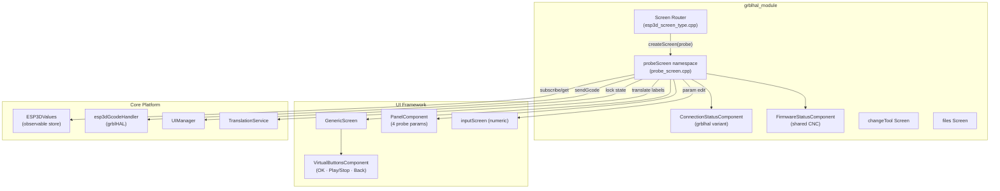
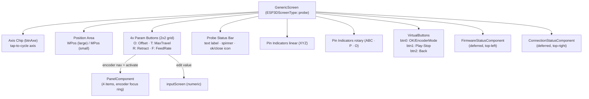
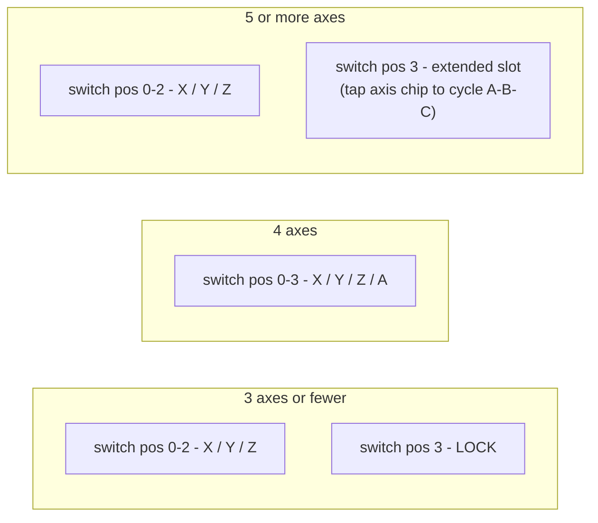
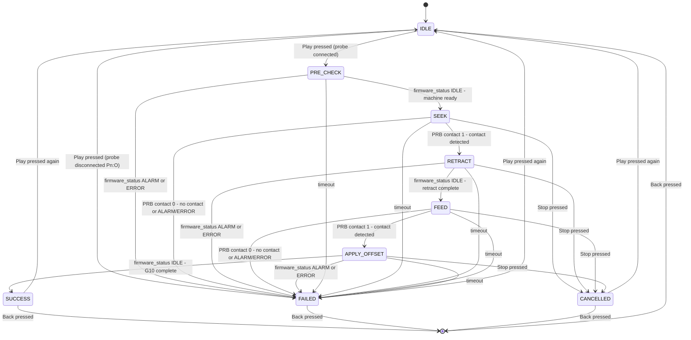
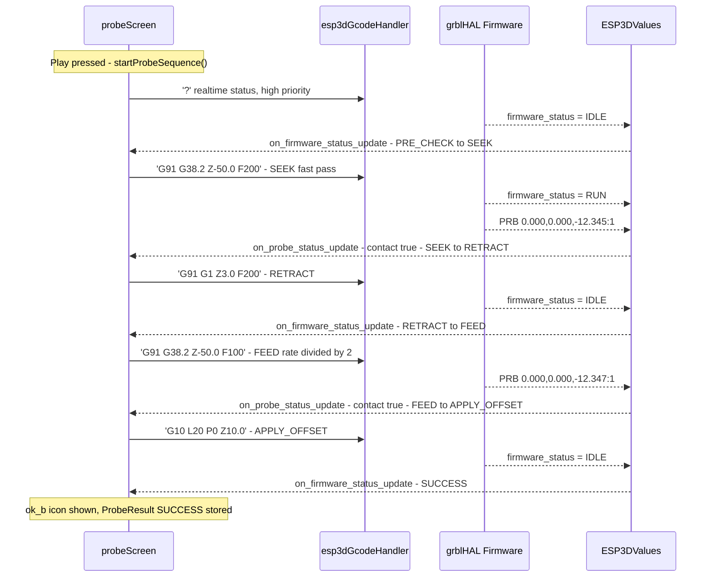
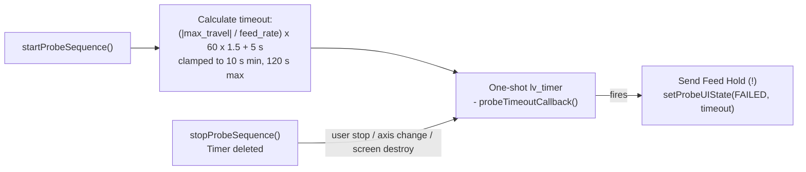
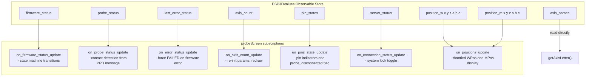
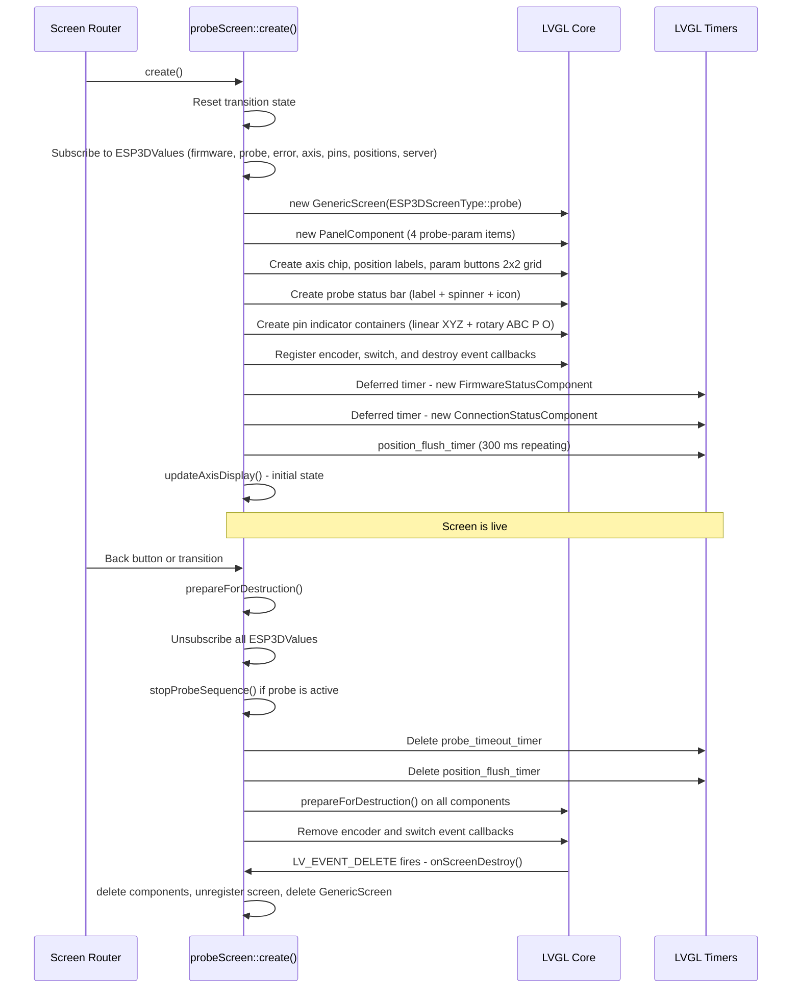
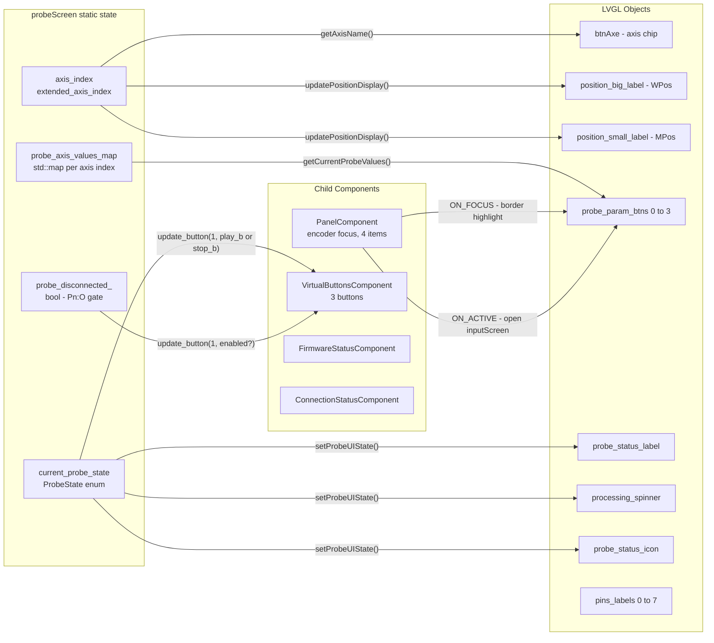

# grblhal_module_probe

## Introduction

The `grblhal_module_probe` module implements the **tool-length / workpiece probing screen** for the **grblHAL** firmware target. It provides a touch/encoder-driven UI that guides the operator through a two-pass probing cycle (fast seek → retract → slow precise feed → apply offset), monitors the machine state via grblHAL real-time status reports, and communicates the probe result back to the calling screen.

The module lives at:
```
main/display/cnc/grblhal/screens/probe_screen.cpp
namespace probeScreen
```

It is one of three parallel probe-screen implementations — the other two target [grbl_module_probe](grbl_module_probe.md) and [fluidnc_module_probe](fluidnc_module_probe.md) — each adapted to its firmware's status-reporting protocol while sharing the same visual structure.

---

## Architecture Overview



See [grblhal_module](grblhal_module.md) for the broader screen set.  
See [cnc_grblhal](cnc_grblhal.md) for the GCode handler that dispatches commands.  
See [gcode_host](gcode_host.md) for streaming and flow-control mechanics.

---

## Component Inventory

### Data Structures

#### `ProbeAxisValues`
Per-axis probe parameter set. One instance is kept per axis index in a `std::map<uint32_t, ProbeAxisValues>` that **persists across axis switches** — user edits on one axis are not lost when the operator selects another axis.

| Field | Type | Default (Z) | Description |
|---|---|---|---|
| `offset` | `float` | `10.0` mm | Work-coordinate offset applied after contact via `G10 L20` |
| `max_travel` | `float` | `−50.0` mm | Maximum probe travel; negative = downward (Z), positive = upward |
| `retract` | `float` | `3.0` mm | Retract distance between seek and feed passes (always positive) |
| `feed_rate` | `float` | `200.0` mm/min | Fast-seek feed rate; feed pass runs at `feed_rate / 2` |

Default values per axis family:

| Axis | offset | max_travel | retract | feed_rate |
|---|---|---|---|---|
| X, Y | 0 mm | +30 mm | 5 mm | 300 mm/min |
| Z | 10 mm | −50 mm | 3 mm | 200 mm/min |
| A, B, C | 0 mm | +360 mm | 10 mm | 100 mm/min |

#### `ProbeInputContext`
Transient context passed to the [inputScreen](common_screens.md) when the operator opens a numeric editor for one of the four probe parameters.

#### `ProbeResult` (public API enum)
Terminal result returned to the caller after the screen exits:
- `NONE` — no probe has run yet
- `SUCCESS` — contact detected and offset applied
- `FAILED` — probe did not trigger or a grblHAL error occurred
- `CANCELLED` — operator pressed Stop

#### `ProbeState` (internal state machine enum)
See [Probe State Machine](#probe-state-machine) below.

---

### UI Components



#### Probe Parameter Buttons (2 × 2 Grid)

| ID | Short Label | Full Label | Unit | Constraints |
|---|---|---|---|---|
| 0 | `O:` | Offset | mm / in | `-9999.9 … +9999.9`, 3 decimals |
| 1 | `T:` | Max Travel | mm / in | `-9999.9 … +9999.9`, 3 decimals |
| 2 | `R:` | Retract Distance | mm / in | `0 … +9999.9` (positive only), 3 decimals |
| 3 | `F:` | Feed Rate | mm/min | `1 … +9999`, 0 decimals (integer) |

The focused item is highlighted with a thicker `border_focus`-colored border; all others show `ESP3D_MENU_BORDER_COLOR` at standard width. The [PanelComponent](ui_components.md) drives encoder-based navigation between these four items.

#### Virtual Buttons

| Index | Idle icon | Active (probing) icon | Function |
|---|---|---|---|
| 0 | `ok_b` | `ok_b` | Toggle encoder mode (navigation vs editing) |
| 1 | `play_b` | `stop_b` | Start probe / stop probe. Disabled while probe is disconnected (`Pn:O`). |
| 2 | `back_b` | `back_b` | Navigate back (with transition cleanup) |

#### Pin Indicators
Eight square indicator labels are maintained — one per machine pin character:

| Index | Pin char | Container | Shown when |
|---|---|---|---|
| 0–2 | X, Y, Z | `pins_container_linear` | `axis_count` covers it AND pin is active |
| 3–5 | A / U, B / V, C / W | `pins_container_rotary` | `axis_count` covers it AND pin is active |
| 6 | P | `pins_container_rotary` | Probe contact triggered (`Pn:P`) |
| 7 | O | `pins_container_rotary` | Probe **disconnected** (`Pn:O`) |

`P` and `O` are mutually exclusive in grblHAL reports and share the same flex slot, so no extra horizontal space is consumed.

---

## Axis Management

### Axis Count Modes

The screen adapts to grblHAL's configured axis count (received via `ESP3DValuesIndex::axis_count`):



The lock position (switch slot 3 on machines with 3 axes or fewer) sets `UIManager::userSetLockState(true)`, graying out all interactive elements and disabling the Play button.

### UVW Renaming (grblHAL `$376`)
`getAxisLetter(uint32_t axis_index)` reads the `axis_names` observable (`ESP3DValuesIndex::axis_names`). When grblHAL reports `"XYZUVW"`, axes 3/4/5 are named U/V/W instead of A/B/C. All GCode commands (`G38.2`, `G1`, `G10 L20`) and pin indicator labels automatically honor this naming.

---

## Probe State Machine



Each terminal state (`SUCCESS`, `FAILED`, `CANCELLED`) sets `ProbeResult` for inter-screen communication and updates the status-bar icon (`ok_b` green / `close_b` red).

---

## GCode Probe Sequence



### GCode Commands Per Step

| Step | GCode template | Notes |
|---|---|---|
| PRE_CHECK | `?` (realtime) | Sent at high priority; verifies machine is Idle before probing |
| SEEK | `G91 G38.2 {axis}{max_travel} F{feed_rate}` | Fast probe pass; incremental mode |
| RETRACT | `G91 G1 {axis}{±retract} F200` | Direction is opposite to `max_travel` sign |
| FEED | `G91 G38.2 {axis}{max_travel} F{feed_rate/2}` | Slow precise pass at half the seek speed |
| APPLY_OFFSET | `G10 L20 P0 {axis}{offset}` | Sets work-coordinate offset at probe contact point |
| STOP | `!` (feed hold, realtime) | High priority; sent on user cancel, axis change, or timeout |

---

## Safety and Timeout



Additionally, the screen **refuses to start** a probe sequence when `probe_disconnected_` is `true` (set by `Pn:O` in the pin-states string). The Play button is also proactively disabled in this state.

---

## Data Flow and Subscriptions



### Position Display Throttling

Position updates arrive at 10 Hz (grblHAL status poll). The screen applies a **250 ms minimum interval** per group (WPos and MPos independently), with a flush timer that fires 300 ms later to apply any pending update that was throttled. WPos and MPos each carry their own `last_*_display_update_ms` timestamp so that one group passing the gate cannot starve the other — both groups are dispatched from a single grblHAL status report in the same LVGL tick.

### Pin State Change Detection

`on_pins_state_update` compares the incoming string against the last known value using `strcmp`. If identical, all LVGL hide/show operations are skipped. This avoids 8+ object updates per second when the machine is idle.

---

## Screen Lifecycle



All cleanup follows the **prepare-then-destroy** pattern used across the [UI Framework](ui_core.md): `prepareForDestruction()` unsubscribes and detaches event handlers first; the LVGL `LV_EVENT_DELETE` callback then frees memory. This prevents dangling callbacks from firing after object deletion.

---

## Inter-Screen Communication (Public API)

```cpp
namespace probeScreen {
    // Called before navigating to the probe screen to configure its return target
    void setReturnScreen(ESP3DScreenType screen);

    // Entry point — called by the screen router
    void create();

    // Called after returning from the probe screen to read the outcome
    ProbeResult getResult();

    // Reset result to NONE (call before launching a new probe sequence)
    void clearResult();
}
```

Typical caller pattern (e.g., from [changeTool screen](grblhal_module_change_tool.md)):
```cpp
probeScreen::clearResult();
probeScreen::setReturnScreen(ESP3DScreenType::change_tool);
// transition to probe screen via UIManager ...

// ... after returning:
if (probeScreen::getResult() == ProbeResult::SUCCESS) {
    // offset has been applied; resume tool change workflow
}
```

---

## Lock and Disable Behavior

| Condition | Effect |
|---|---|
| `server_status != "C"` (not connected) | `systemSetLockState(true)` — all elements grayed, Play disabled |
| Switch in position 3 on machine with 3 axes or fewer | `userSetLockState(true)` — same visual lockout |
| `probe_disconnected_` (`Pn:O` received) | Play button proactively disabled; probe start blocked with error feedback |
| Any of the above conditions cleared | Elements re-enabled, `panel_component->updateFocusVisuals()` called |

When locked, the four probe-parameter buttons receive `LV_STATE_DISABLED` and their label opacity drops to 30%. Position labels are similarly dimmed. The Back button (`isLockable = false`) always remains active.

---

## Component Interaction Diagram



---

## Key Design Decisions

1. **Persistent per-axis parameter map** — `probe_axis_values_map` is never cleared on axis switch. Defaults are only inserted for new entries (guarded by `map::find`), preserving any user modifications across axis changes within a single screen session.

2. **Two-pass probe (seek then feed)** — The fast seek at full feed rate quickly finds approximate contact; the slow feed pass at `feed_rate / 2` from the retracted position achieves precise repeatability. This is standard probing practice for grblHAL / Grbl controllers.

3. **grblHAL-specific `Pn:O` safety gate** — The `O` pin character signals that the probe input is open (disconnected). The screen detects this in `on_pins_state_update` and both disables the Play button and refuses `startProbeSequence()`, preventing a false-contact or runaway condition unique to grblHAL's extended pin reporting.

4. **No dynamic memory allocation during probing** — GCode command strings are built in stack-allocated `char cmd[128]` buffers. The `probe_axis_values_map` is the only heap allocation and is populated at creation time, not during the probe sequence itself.

5. **Deferred overlay component creation** — `FirmwareStatusComponent` and `ConnectionStatusComponent` are created via a single-shot LVGL timer (`ESP3D_DEFERED_SCREEN_CREATION_DELAY_MS`) after the main screen layout is complete, preventing LVGL task overload during the initial render.

6. **Per-group position throttle timestamps** — WPos and MPos each have independent `last_*_display_update_ms` timestamps. A shared timestamp would cause one group's gate-pass to starve the other, since both groups are dispatched from a single grblHAL status report in the same LVGL tick.

7. **Axis change aborts active probe** — If the hardware switch or touch axis selector changes while a probe sequence is running, `stopProbeSequence()` is called immediately (Feed Hold `!`) and the state transitions to `FAILED` with an "axis changed" message. This prevents probing on the wrong axis.

---

## Related Documentation

| Document | Relationship |
|---|---|
| [grblhal_module](grblhal_module.md) | Parent module — screen set, screen router |
| [grblhal_module_change_tool](grblhal_module_change_tool.md) | Primary caller of the probe screen for tool-change workflow |
| [grblhal_module_files](grblhal_module_files.md) | Sibling screen in the grblHAL screen set |
| [grblhal_module_connection_status](grblhal_module_connection_status.md) | `ConnectionStatusComponent` used as overlay |
| [grbl_module_probe](grbl_module_probe.md) | Equivalent probe screen for grbl firmware |
| [fluidnc_module_probe](fluidnc_module_probe.md) | Equivalent probe screen for FluidNC firmware |
| [cnc_shared](cnc_shared.md) | Shared `FirmwareStatusComponent`, jog screen, status screen |
| [cnc_grblhal](cnc_grblhal.md) | `esp3dGcodeHandler` — dispatches all probe GCode commands |
| [gcode_host](gcode_host.md) | Streaming, flow control, `ESP3DCommandType` priority levels |
| [ui_components](ui_components.md) | `PanelComponent`, `VirtualButtonsComponent` |
| [common_screens](common_screens.md) | `inputScreen` used for probe parameter numeric editing |
| [ui_core](ui_core.md) | `GenericScreen`, `UIManager`, `ThemeStyles` |
| [values](values.md) | `ESP3DValues` observable store — all subscribed indices |


## Documents de conception (depot)

- [probe_screen](https://github.com/luc-github/Pibot-cnc-pendant-firmware/blob/main/docs/ux_flows/grblhal/probe_screen.md)
