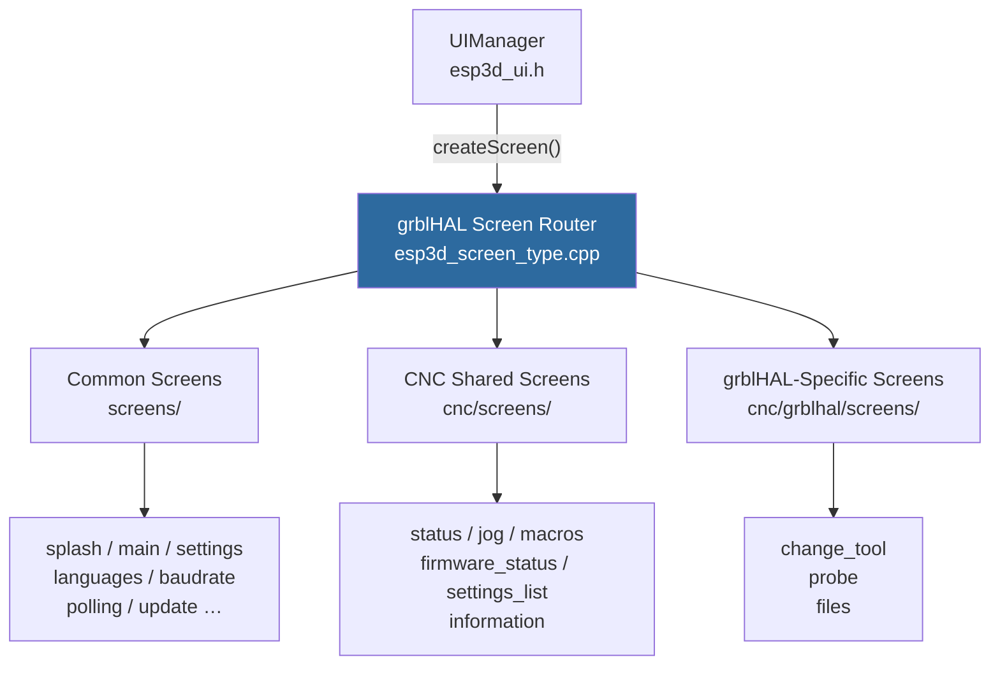
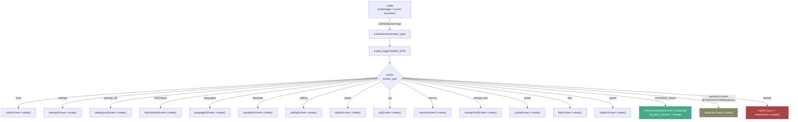
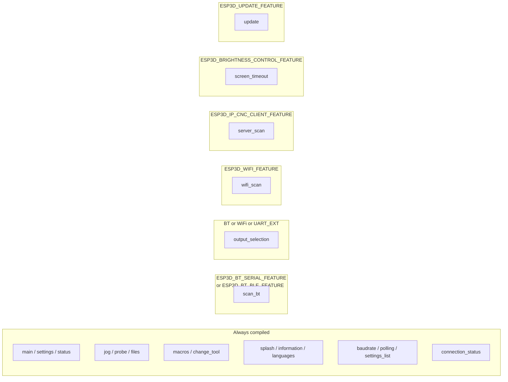
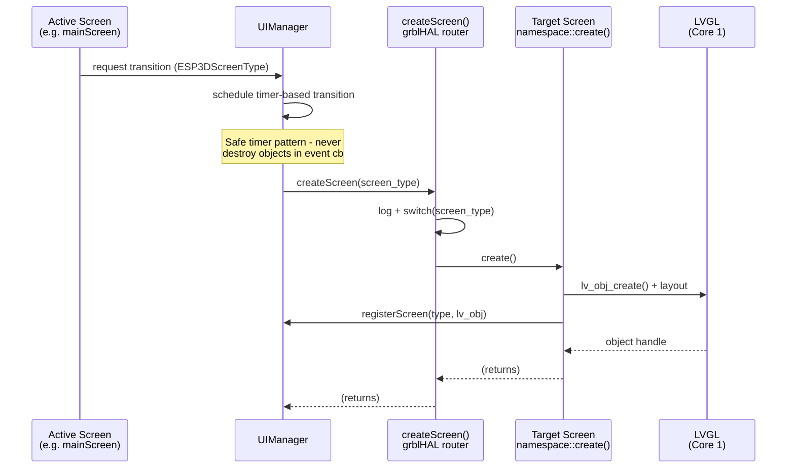
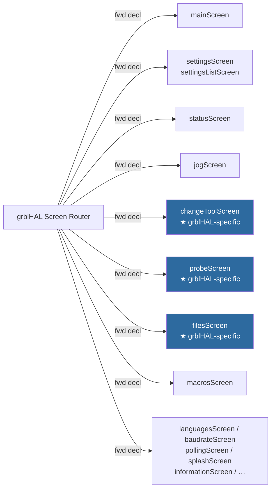

# grblHAL Module — Screen Router

The **grblHAL screen router** is the single entry-point for creating every UI screen in the grblHAL firmware variant. It implements the *Factory* pattern: callers supply an `ESP3DScreenType` enum value, and the router delegates to the correct screen namespace's `create()` function. All conditional-compilation guards that control optional-feature screens (Bluetooth, Wi-Fi, server scan, brightness, OTA update) live here — no other code needs to know which screen types are actually compiled in.

---

## Table of Contents

1. [Module Overview](#1-module-overview)
2. [Architecture Position](#2-architecture-position)
3. [Component Reference](#3-component-reference)
4. [Screen Type Catalogue](#4-screen-type-catalogue)
5. [Dispatch Flow](#5-dispatch-flow)
6. [Feature-Gated Screens](#6-feature-gated-screens)
7. [Relationship to the grbl Screen Router](#7-relationship-to-the-grbl-screen-router)
8. [Data Flow Diagram](#8-data-flow-diagram)
9. [Dependencies](#9-dependencies)
10. [Design Rules & Constraints](#10-design-rules--constraints)

---

## 1. Module Overview

| Property | Value |
|---|---|
| **Source file** | `main/display/cnc/grblhal/screens/esp3d_screen_type.cpp` |
| **Header** | `main/display/cnc/grblhal/screens/esp3d_screen_type.h` |
| **Public API** | `void createScreen(ESP3DScreenType screen_type)` |
| **CNC target** | grblHAL |
| **LVGL thread** | Core 1 — must only be called from the LVGL task |

The router's entire runtime behaviour is one `switch` statement over the `ESP3DScreenType` enum. Each `case` calls the corresponding namespace's `create()` function and returns. No screen state is held inside the router itself.

---

## 2. Architecture Position

The router sits at the boundary between the **UI Framework** (UIManager, screen lifecycle) and the **grblHAL-specific screen implementations**.



> **See also**
> - [grblhal_module_connection_status.md](grblhal_module_connection_status.md) — `connection_status` screen component wired here
> - [grblhal_module_change_tool.md](grblhal_module_change_tool.md) — `change_tool` screen
> - [grblhal_module_files.md](grblhal_module_files.md) — `files` screen
> - [grblhal_module_probe.md](grblhal_module_probe.md) — `probe` screen
> - [grbl_module_screen_router.md](grbl_module_screen_router.md) — grbl counterpart (structurally identical)

---

## 3. Component Reference

### `ESP3DScreenType` enum (`esp3d_screen_type.h`)

A `uint8_t`-backed enum class that names every possible screen in the system. Both the grblHAL and grbl routers share this same enum; each router compiles only the `case` branches whose feature flags are active.

```cpp
enum class ESP3DScreenType : uint8_t {
    none = 0,
    splash, main, settings, information, languages,
#if (ESP3D_BT_SERIAL_FEATURE || ESP3D_BT_BLE_FEATURE)
    scan_bt,
#endif
    baudrate, change_tool, probe, macros, files, jog, status,
    output_selection, message_box, polling, screen_timeout,
    input, settings_list, firmware_status, connection_status,
#if ESP3D_WIFI_FEATURE
    wifi_scan,
#endif
#if ESP3D_IP_CNC_CLIENT_FEATURE
    server_scan,
#endif
#if ESP3D_UPDATE_FEATURE
    update,
#endif
    empty
};
```

### `ComponentType` enum (`esp3d_screen_type.h`)

Enumerates reusable sub-components registered in `UIManager`. Used throughout the screen system but **not** dispatched by the router itself.

```cpp
enum class ComponentType : uint8_t {
    none = 0,
    generic_screen, circular_menu_screen, virtual_buttons,
    circular_menu, list_menu, list_menu_screen,
    connection_status, firmware_status, message_box, panel
};
```

### `createScreen(ESP3DScreenType screen_type)` (`esp3d_screen_type.cpp`)

The sole public function of this module.

| Aspect | Detail |
|---|---|
| **Signature** | `void createScreen(ESP3DScreenType screen_type)` |
| **Thread** | Must be called on the LVGL task thread (Core 1) |
| **Side-effects** | Calls one screen namespace's `create()`, which allocates LVGL objects |
| **Error path** | Unknown enum value → `esp3d_log_e()` + fallback to `mainScreen::create()` |
| **Logging** | On entry: `esp3d_log("Creating screen of type: %s", SCREEN_STR(screen_type))` |

**`connection_status` special case** — this is the only `case` that passes a configuration struct to `create()`:

```cpp
case ESP3DScreenType::connection_status: {
    connectionStatusScreen::ConnectionStatusScreenConfig cfg;
    cfg.return_screen = ESP3DScreenType::settings;
    connectionStatusScreen::create(cfg);
    break;
}
```

The return target is hard-coded to `settings` for this firmware variant.

### `SCREEN_STR(index)` macro (`esp3d_screen_type.h`)

Compile-time helper that maps an `ESP3DScreenType` value to a human-readable string for logging. Only defined when `ESP3D_LOG` is enabled.

---

## 4. Screen Type Catalogue

The table below lists every `case` dispatched by the grblHAL router, the namespace it calls, and the source module that owns the screen implementation.

| `ESP3DScreenType` | Namespace called | Owning module / doc |
|---|---|---|
| `splash` | `splashScreen` | [common_screens](grblhal_module.md) |
| `main` | `mainScreen` | [cnc_shared / navigation_screens](grblhal_module.md) |
| `settings` | `settingsScreen` | [cnc_shared / settings](grblhal_module.md) |
| `settings_list` | `settingsListScreen` | [cnc_shared / settings](grblhal_module.md) |
| `information` | `informationScreen` | [cnc_shared / navigation_screens](grblhal_module.md) |
| `languages` | `languagesScreen` | [common_screens](grblhal_module.md) |
| `baudrate` | `baudrateScreen` | [common_screens](grblhal_module.md) |
| `polling` | `pollingScreen` | [common_screens](grblhal_module.md) |
| `status` | `statusScreen` | [cnc_shared / status_screen](grblhal_module.md) |
| `jog` | `jogScreen` | [cnc_shared / jog_screen](grblhal_module.md) |
| `macros` | `macrosScreen` | [cnc_shared / macro_system](grblhal_module.md) |
| `change_tool` | `changeToolScreen` | [grblhal_module_change_tool.md](grblhal_module_change_tool.md) |
| `probe` | `probeScreen` | [grblhal_module_probe.md](grblhal_module_probe.md) |
| `files` | `filesScreen` | [grblhal_module_files.md](grblhal_module_files.md) |
| `connection_status` | `connectionStatusScreen` | [grblhal_module_connection_status.md](grblhal_module_connection_status.md) |
| `output_selection` *(optional)* | `outputSelectionScreen` | [common_screens](grblhal_module.md) |
| `scan_bt` *(optional)* | `scanBTScreen` | [common_screens](grblhal_module.md) |
| `wifi_scan` *(optional)* | `wifiScanScreen` | [common_screens](grblhal_module.md) |
| `server_scan` *(optional)* | `serverScanScreen` | [common_screens](grblhal_module.md) |
| `screen_timeout` *(optional)* | `screenTimeoutScreen` | [common_screens](grblhal_module.md) |
| `update` *(optional)* | `updateScreen` | [common_screens](grblhal_module.md) |

> **Not routed here:** `none`, `message_box`, `input`, `firmware_status`, `empty`
> These screen types are managed directly by their owner screens (modal overlays, inline components) and are never requested via `createScreen()`.

---

## 5. Dispatch Flow



---

## 6. Feature-Gated Screens

Several screens are conditionally compiled based on build-time feature flags. The router uses the same flags to include or exclude the corresponding `case` branches.



The `output_selection` screen is included when **any** of the following flags are set:
- `ESP3D_BT_SERIAL_FEATURE`
- `ESP3D_BT_BLE_FEATURE`
- `ESP3D_WIFI_FEATURE`
- `ESP3D_UART_EXT_FEATURE`

> **Memory note:** On ESP32 with Bluetooth active, available heap can drop to ~10 KB. Feature flags that disable unused services reduce both binary size and runtime heap footprint. See [`docs/guides/esp32_memory_constraints.md`](https://github.com/luc-github/Pibot-cnc-pendant-firmware/blob/main/docs/guides/esp32_memory_constraints.md).

---

## 7. Relationship to the grbl Screen Router

The grblHAL and grbl routers are structurally identical. They share:
- The same `ESP3DScreenType` enum and `ComponentType` enum (defined in `esp3d_screen_type.h`)
- The same dispatched screen type list
- The same feature compilation guards

They differ only in which **screen implementation namespaces** they forward-declare and call:

| Screen | grbl router calls | grblHAL router calls |
|---|---|---|
| `change_tool` | `grbl/screens/change_tool_screen.cpp` | `grblhal/screens/change_tool_screen.cpp` |
| `probe` | `grbl/screens/probe_screen.cpp` | `grblhal/screens/probe_screen.cpp` |
| `files` | `grbl/screens/files_screen.cpp` | `grblhal/screens/files_screen.cpp` |

All other screens (common + CNC shared) resolve to the same physical `.cpp` translation units for both routers.

See [grbl_module_screen_router.md](grbl_module_screen_router.md) for the grbl variant.

---

## 8. Data Flow Diagram

This diagram shows the lifecycle of a screen transition request from the moment a UI event fires through to LVGL object creation.



> **LVGL threading constraint:** `createScreen()` **must** be called from the LVGL task (Core 1). Screen objects must never be created or destroyed from ISRs, FreeRTOS tasks on Core 0, or inside LVGL event callbacks. Use `lv_timer_create()` for deferred transitions.
> See [`docs/architecture/screen_transitions_flow.md`](https://github.com/luc-github/Pibot-cnc-pendant-firmware/blob/main/docs/architecture/screen_transitions_flow.md) for the transition timer pattern.

---

## 9. Dependencies

### Direct includes

| Header | Purpose |
|---|---|
| `esp3d_screen_type.h` | `ESP3DScreenType` enum, `SCREEN_STR` macro, `createScreen` declaration |
| `esp3d_log.h` | `esp3d_log()` / `esp3d_log_e()` logging macros |
| `screens/connection_status_screen.h` | `ConnectionStatusScreenConfig` struct (the only direct header include besides the module's own header) |

### Forward-declared namespaces

The router uses C++ namespace forward declarations — no additional header inclusions — to keep coupling minimal. Each namespace is resolved at link time to its screen's `.cpp` translation unit.



### Runtime dependencies (via UIManager)

The router itself does not interact with `UIManager` directly. The `create()` functions it invokes call `UIManager::registerScreen()` internally. See [ui_core module](grblhal_module.md) for `UIManager` documentation.

---

## 10. Design Rules & Constraints

### Adding a new screen to the grblHAL router

1. **Define the enum value** in `ESP3DScreenType` in `esp3d_screen_type.h`. Mirror the change in the `screen_type_names[]` debug array (same file, inside `#if ESP3D_LOG`).
2. **Add a forward declaration** in `esp3d_screen_type.cpp`:
   ```cpp
   namespace myNewScreen {
       void create();
   }
   ```
3. **Add a `case`** in `createScreen()`:
   ```cpp
   case ESP3DScreenType::my_new_screen:
       myNewScreen::create();
       break;
   ```
4. **Wrap with a feature guard** if the screen is optional:
   ```cpp
   #if YOUR_FEATURE_FLAG
   case ESP3DScreenType::my_new_screen:
       myNewScreen::create();
       break;
   #endif
   ```
5. **Implement `myNewScreen::create()`** following the transition-timer and LVGL lifecycle patterns documented in [`docs/architecture/screen_transitions_flow.md`](https://github.com/luc-github/Pibot-cnc-pendant-firmware/blob/main/docs/architecture/screen_transitions_flow.md).

### Invariants

| Rule | Rationale |
|---|---|
| `createScreen()` is call-and-return only | The router holds no state; all screen state lives in the screen's own translation unit |
| Every `case` must have `break` | Fall-through would invoke two `create()` functions sequentially, producing duplicate LVGL objects |
| Unknown types fall back to `main` with an error log | Prevents blank display on unexpected enum values |
| `connection_status` always returns to `settings` | grblHAL-variant policy enforced at the router level; grbl router has the same hard-code |
| All `create()` calls happen on Core 1 | LVGL is single-threaded; Core 0 access causes data races and assertion failures |
| All conditionals use braces `{}` | Logging macros (`esp3d_log`) expand to nothing in production; a bare `if (cond) esp3d_log(...)` becomes `if (cond) ;` — broken control flow |

### LVGL constraints summary

- Never call `createScreen()` directly from an LVGL event callback.
- Always schedule navigation with `lv_timer_create()` + `lv_timer_set_repeat_count(t, 1)`.
- Use `lv_obj_del_async()` (not `lv_obj_del()`) when deleting a screen from an event context.
- Apply change detection before `lv_obj_*` calls to avoid unnecessary redraws.

> Full transition rules: [`docs/architecture/screen_transitions_flow.md`](https://github.com/luc-github/Pibot-cnc-pendant-firmware/blob/main/docs/architecture/screen_transitions_flow.md)
> Screen architecture overview: [`docs/architecture/screens_architecture.md`](https://github.com/luc-github/Pibot-cnc-pendant-firmware/blob/main/docs/architecture/screens_architecture.md)
> Logging guide: [`docs/guides/esp3d_log_guide.md`](https://github.com/luc-github/Pibot-cnc-pendant-firmware/blob/main/docs/guides/esp3d_log_guide.md)
