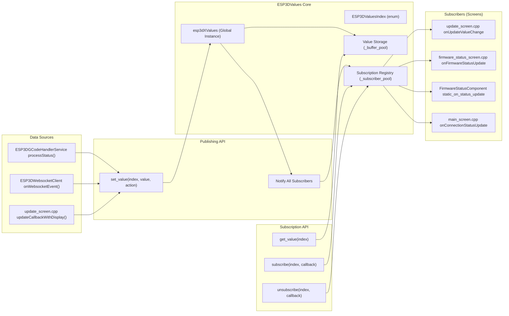
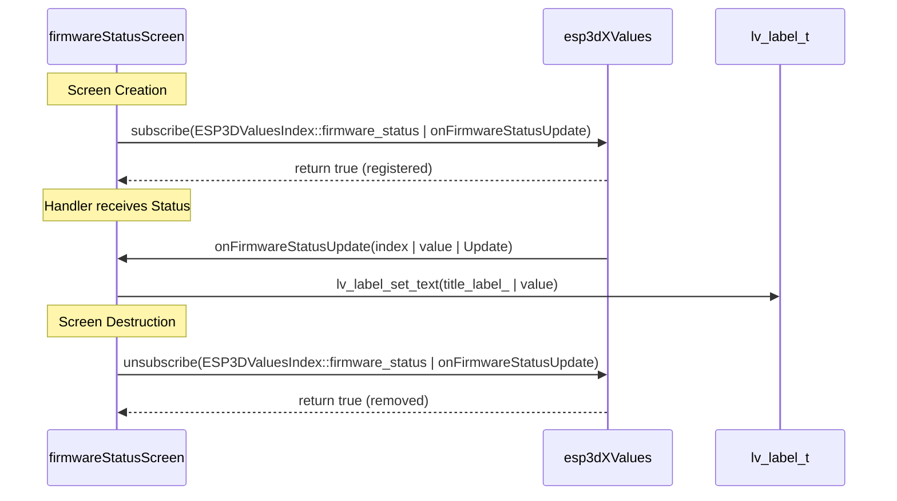

# Adding Real-time Values
Relevant source files

- [main/display/cnc/esp3d_system_translations_defs.inc](https://github.com/luc-github/Pibot-cnc-pendant-firmware/blob/cbc90b5e/main/display/cnc/esp3d_system_translations_defs.inc)
- [main/display/cnc/screens/firmware_status_screen.cpp](https://github.com/luc-github/Pibot-cnc-pendant-firmware/blob/cbc90b5e/main/display/cnc/screens/firmware_status_screen.cpp)
- [main/display/cnc/screens/main_screen.cpp](https://github.com/luc-github/Pibot-cnc-pendant-firmware/blob/cbc90b5e/main/display/cnc/screens/main_screen.cpp)
- [main/display/cnc/screens/settings_list_screen.cpp](https://github.com/luc-github/Pibot-cnc-pendant-firmware/blob/cbc90b5e/main/display/cnc/screens/settings_list_screen.cpp)
- [main/display/esp3d_translations_defs.inc](https://github.com/luc-github/Pibot-cnc-pendant-firmware/blob/cbc90b5e/main/display/esp3d_translations_defs.inc)
- [main/display/screens/polling_screen.cpp](https://github.com/luc-github/Pibot-cnc-pendant-firmware/blob/cbc90b5e/main/display/screens/polling_screen.cpp)
- [main/display/screens/screen_timeout_screen.cpp](https://github.com/luc-github/Pibot-cnc-pendant-firmware/blob/cbc90b5e/main/display/screens/screen_timeout_screen.cpp)
- [main/display/screens/update_screen.cpp](https://github.com/luc-github/Pibot-cnc-pendant-firmware/blob/cbc90b5e/main/display/screens/update_screen.cpp)
- [main/target/cnc/esp3d_system_values_defs.inc](https://github.com/luc-github/Pibot-cnc-pendant-firmware/blob/cbc90b5e/main/target/cnc/esp3d_system_values_defs.inc)
- [main/target/cnc/fluidnc/esp3d_gcode_handler_service.h](https://github.com/luc-github/Pibot-cnc-pendant-firmware/blob/cbc90b5e/main/target/cnc/fluidnc/esp3d_gcode_handler_service.h)

This page explains how to extend the ESP3DValues pub/sub system to add new real-time data streams that propagate from the G-code handler or network modules to UI screens. This is essential for displaying new firmware information, machine states, or sensor data in the pendant interface.

---

## System Architecture

The `ESP3DValues` system provides a centralized pub/sub architecture for distributing real-time data from various services to multiple UI components without tight coupling. The singleton instance `esp3dXValues` manages all global states. Data typically enters the system via `set_value()` and leaves via callback notifications to subscribers.

### Data Flow Diagram

Titled: "Real-time Value Propagation Flow"



Sources:

- `set_value` usage in update: [main/display/screens/update_screen.cpp#58-71](https://github.com/luc-github/Pibot-cnc-pendant-firmware/blob/cbc90b5e/main/display/screens/update_screen.cpp#L58-L71)
- `subscribe` usage in main: [main/display/cnc/screens/main_screen.cpp#74-85](https://github.com/luc-github/Pibot-cnc-pendant-firmware/blob/cbc90b5e/main/display/cnc/screens/main_screen.cpp#L74-L85)
- `subscribe` usage in status screen: [main/display/cnc/screens/firmware_status_screen.cpp#76-84](https://github.com/luc-github/Pibot-cnc-pendant-firmware/blob/cbc90b5e/main/display/cnc/screens/firmware_status_screen.cpp#L76-L84)

---

## Value Index Definition

All real-time values are identified by the `ESP3DValuesIndex` enum. This system uses an X-Macro pattern to maintain consistency between the enumeration and the static definitions stored in RAM/Flash.

### Key Files for Definitions

1. `esp3d_system_values_defs.inc`: Contains system-wide values including position strings (`position_wx`), overrides, and job management data [main/target/cnc/esp3d_system_values_defs.inc#1-110](https://github.com/luc-github/Pibot-cnc-pendant-firmware/blob/cbc90b5e/main/target/cnc/esp3d_system_values_defs.inc#L1-L110)
2. `esp3d_target_values_defs.inc`: Contains firmware-specific values defined per target (e.g., FluidNC vs grblHAL).
3. `esp3d_values.h`: Declares the `ESP3DValuesIndex` enumeration dynamically using the include files above.

### Common Value Categories

| Index | Purpose | Subscriber Example |
| --- | --- | --- |
| `server_status` | Connection state: 'C' (Connected), 'T' (Connecting), '?' (Disconnected) | `onConnectionStatusUpdate` in `main_screen.cpp`[main/display/cnc/screens/main_screen.cpp#74-85](https://github.com/luc-github/Pibot-cnc-pendant-firmware/blob/cbc90b5e/main/display/cnc/screens/main_screen.cpp#L74-L85) |
| `firmware_status` | Machine state (Idle, Run, Hold, Alarm) | `firmware_status_screen.cpp`[main/display/cnc/screens/firmware_status_screen.cpp#76-86](https://github.com/luc-github/Pibot-cnc-pendant-firmware/blob/cbc90b5e/main/display/cnc/screens/firmware_status_screen.cpp#L76-L86) |
| `message_history` | Buffer for MSG:ERR or MSG:INFO messages | `firmware_status_screen.cpp`[main/display/cnc/screens/firmware_status_screen.cpp#77](https://github.com/luc-github/Pibot-cnc-pendant-firmware/blob/cbc90b5e/main/display/cnc/screens/firmware_status_screen.cpp#L77-L77) |
| `update_progress` | Flash progress percentage (0-100) | `update_screen.cpp`[main/display/screens/update_screen.cpp#138-149](https://github.com/luc-github/Pibot-cnc-pendant-firmware/blob/cbc90b5e/main/display/screens/update_screen.cpp#L138-L149) |

Sources:

- `esp3d_system_values_defs.inc` content: [main/target/cnc/esp3d_system_values_defs.inc#18-105](https://github.com/luc-github/Pibot-cnc-pendant-firmware/blob/cbc90b5e/main/target/cnc/esp3d_system_values_defs.inc#L18-L105)
- Connection status handling: [main/display/cnc/screens/main_screen.cpp#74-85](https://github.com/luc-github/Pibot-cnc-pendant-firmware/blob/cbc90b5e/main/display/cnc/screens/main_screen.cpp#L74-L85)
- Update progress handling: [main/display/screens/update_screen.cpp#138-149](https://github.com/luc-github/Pibot-cnc-pendant-firmware/blob/cbc90b5e/main/display/screens/update_screen.cpp#L138-L149)

---

## Adding a New Value Index

To add a new real-time value, follow these steps:

### 1. Update the Definition Include

Add the new value to `esp3d_system_values_defs.inc` using the `ESP3D_VAL_DEF` macro. You must specify the buffer size (in bytes) required to hold the string representation of the value.

```
// Format: ESP3D_VAL_DEF(name, type, size, initial_value)
ESP3D_VAL_DEF(probe_result, string_t, 32, "0.000")
```

*Reference for current definitions:*[main/target/cnc/esp3d_system_values_defs.inc#102-106](https://github.com/luc-github/Pibot-cnc-pendant-firmware/blob/cbc90b5e/main/target/cnc/esp3d_system_values_defs.inc#L102-L106)

### 2. Publishing the Value

Use the `set_value` method on the `esp3dXValues` global instance.

Example from `update_screen.cpp`:
The update service calls back to the UI, which propagates the progress to the global values system:
[main/display/screens/update_screen.cpp#62-63](https://github.com/luc-github/Pibot-cnc-pendant-firmware/blob/cbc90b5e/main/display/screens/update_screen.cpp#L62-L63)

```
esp3dXValues.set_value(ESP3DValuesIndex::update_progress, 
                         std::to_string(percent).c_str());
```

---

## Subscribing to Values in Screens

Screens and UI components subscribe to value updates to react in real-time.

### Code Entity Mapping: Subscription Lifecycle

Titled: "Subscription Lifecycle in GenericScreen"



Sources:

- Status screen subscription: [main/display/cnc/screens/firmware_status_screen.cpp#76-86](https://github.com/luc-github/Pibot-cnc-pendant-firmware/blob/cbc90b5e/main/display/cnc/screens/firmware_status_screen.cpp#L76-L86)
- Main screen subscription: [main/display/cnc/screens/main_screen.cpp#74-85](https://github.com/luc-github/Pibot-cnc-pendant-firmware/blob/cbc90b5e/main/display/cnc/screens/main_screen.cpp#L74-L85)

### Implementation Pattern

1. Define a Callback: The callback signature must be `bool(ESP3DValuesIndex, const char *, ESP3DValuesCbAction)`.
2. Filter Actions: Always check if `action == ESP3DValuesCbAction::Update`[main/display/screens/update_screen.cpp#131-133](https://github.com/luc-github/Pibot-cnc-pendant-firmware/blob/cbc90b5e/main/display/screens/update_screen.cpp#L131-L133)
3. Update LVGL Objects: Ensure you verify object validity using `lv_obj_is_valid()` before updating UI elements [main/display/screens/update_screen.cpp#140-141](https://github.com/luc-github/Pibot-cnc-pendant-firmware/blob/cbc90b5e/main/display/screens/update_screen.cpp#L140-L141)
4. Unsubscribe: In `prepareForDestruction()`, remove the subscription to prevent the system from calling a pointer to a destroyed screen.

---

## Best Practices

| Requirement | Implementation Detail |
| --- | --- |
| Unsubscribe | Must be called in `prepareForDestruction` for both system and target values [main/display/cnc/screens/main_screen.cpp#56-59](https://github.com/luc-github/Pibot-cnc-pendant-firmware/blob/cbc90b5e/main/display/cnc/screens/main_screen.cpp#L56-L59) |
| Initial Sync | After subscribing, the callback is not automatically fired. You may need to call `get_value(index)` to set the initial UI state. |
| Heap Safety | Avoid complex logic inside the callback; just update labels, styles, or icons. |
| Return Value | Return `true` to maintain the subscription. Returning `false` will cause `esp3dXValues` to automatically remove the subscriber. |

Sources:

- Destruction guard usage: [main/display/screens/polling_screen.cpp#103-106](https://github.com/luc-github/Pibot-cnc-pendant-firmware/blob/cbc90b5e/main/display/screens/polling_screen.cpp#L103-L106)
- Callback return logic: [main/display/screens/update_screen.cpp#162](https://github.com/luc-github/Pibot-cnc-pendant-firmware/blob/cbc90b5e/main/display/screens/update_screen.cpp#L162-L162)
- UI Refresh pattern: [main/display/cnc/screens/firmware_status_screen.cpp#76-86](https://github.com/luc-github/Pibot-cnc-pendant-firmware/blob/cbc90b5e/main/display/cnc/screens/firmware_status_screen.cpp#L76-L86)