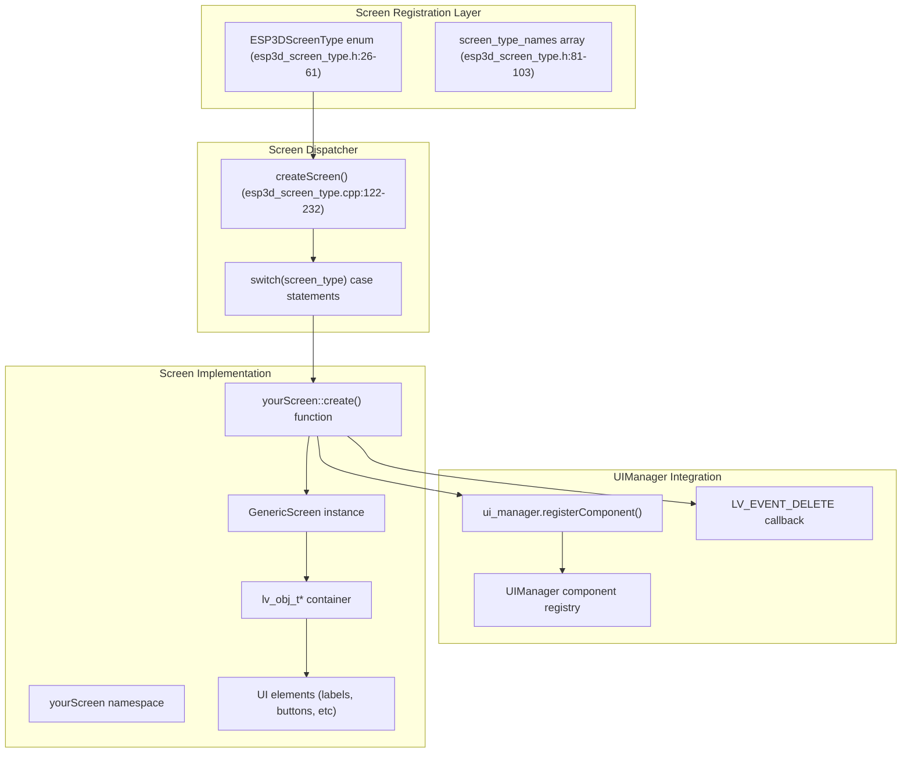
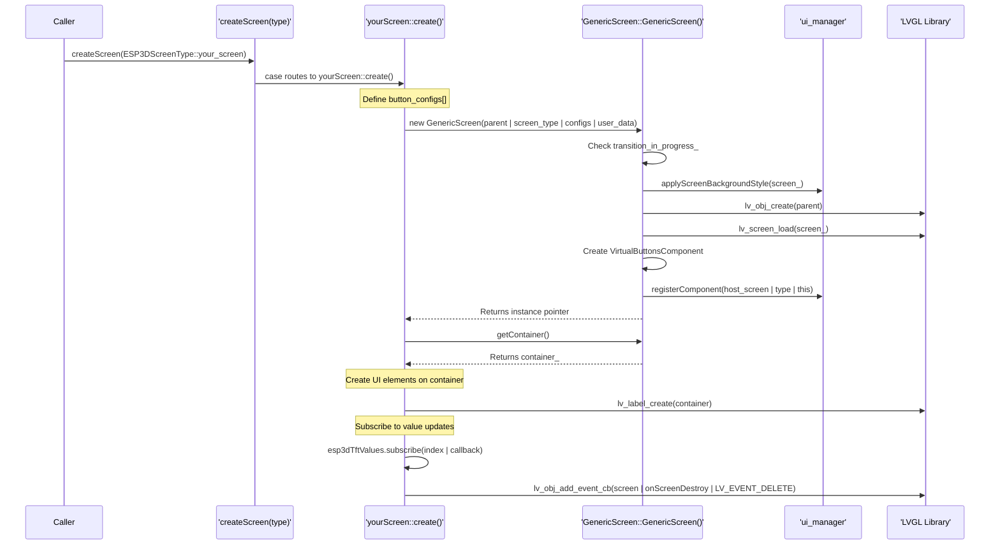
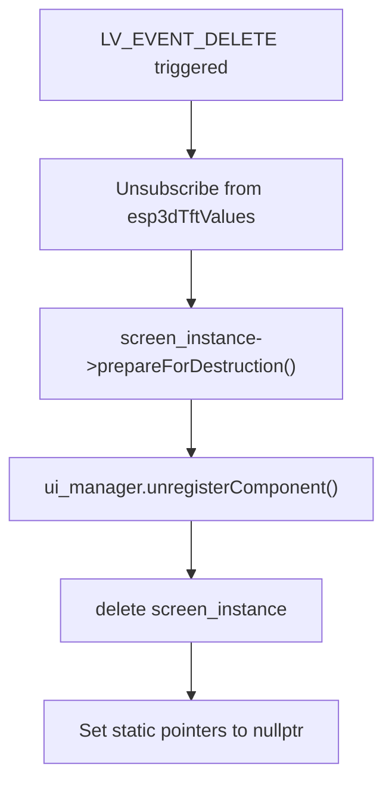

# Adding New Screens
Relevant source files

- [main/display/cnc/fluidnc/screens/esp3d_screen_type.cpp](https://github.com/luc-github/Pibot-cnc-pendant-firmware/blob/cbc90b5e/main/display/cnc/fluidnc/screens/esp3d_screen_type.cpp)
- [main/display/cnc/fluidnc/screens/esp3d_screen_type.h](https://github.com/luc-github/Pibot-cnc-pendant-firmware/blob/cbc90b5e/main/display/cnc/fluidnc/screens/esp3d_screen_type.h)
- [main/display/cnc/fluidnc/screens/files_screen.cpp](https://github.com/luc-github/Pibot-cnc-pendant-firmware/blob/cbc90b5e/main/display/cnc/fluidnc/screens/files_screen.cpp)
- [main/display/cnc/grblhal/screens/esp3d_screen_type.cpp](https://github.com/luc-github/Pibot-cnc-pendant-firmware/blob/cbc90b5e/main/display/cnc/grblhal/screens/esp3d_screen_type.cpp)
- [main/display/esp3d_screen_transition.h](https://github.com/luc-github/Pibot-cnc-pendant-firmware/blob/cbc90b5e/main/display/esp3d_screen_transition.h)
- [main/display/esp3d_translations_init.cpp](https://github.com/luc-github/Pibot-cnc-pendant-firmware/blob/cbc90b5e/main/display/esp3d_translations_init.cpp)
- [main/display/esp3d_translations_list.h](https://github.com/luc-github/Pibot-cnc-pendant-firmware/blob/cbc90b5e/main/display/esp3d_translations_list.h)
- [main/display/screens/generic_screen.cpp](https://github.com/luc-github/Pibot-cnc-pendant-firmware/blob/cbc90b5e/main/display/screens/generic_screen.cpp)
- [main/display/screens/generic_screen.h](https://github.com/luc-github/Pibot-cnc-pendant-firmware/blob/cbc90b5e/main/display/screens/generic_screen.h)
- [tools/language_packs/template.lng](https://github.com/luc-github/Pibot-cnc-pendant-firmware/blob/cbc90b5e/tools/language_packs/template.lng)
- [tools/language_packs/ui_fr-fr.lng](https://github.com/luc-github/Pibot-cnc-pendant-firmware/blob/cbc90b5e/tools/language_packs/ui_fr-fr.lng)

This guide provides a step-by-step process for adding new application screens to the PiBot CNC Pendant firmware. It covers the technical requirements, code structure, and integration points needed to create a functional screen that integrates with the existing UI framework.

For information about screen lifecycle management and the base classes, see [7.2. Screen Lifecycle Management](https://github.com/luc-github/Pibot-cnc-pendant-firmware/blob/cbc90b5e/7.2. Screen Lifecycle Management) For details on reusable components that can be integrated into screens, see [8. Reusable UI Components](https://github.com/luc-github/Pibot-cnc-pendant-firmware/blob/cbc90b5e/8. Reusable UI Components)

---

## Overview

The screen system is built on a hierarchical architecture where each screen:

1. Is identified by an `ESP3DScreenType` enum value [main/display/cnc/fluidnc/screens/esp3d_screen_type.h#26-61](https://github.com/luc-github/Pibot-cnc-pendant-firmware/blob/cbc90b5e/main/display/cnc/fluidnc/screens/esp3d_screen_type.h#L26-L61)
2. Implements a `create()` function within a dedicated namespace [main/display/cnc/fluidnc/screens/esp3d_screen_type.cpp#25-115](https://github.com/luc-github/Pibot-cnc-pendant-firmware/blob/cbc90b5e/main/display/cnc/fluidnc/screens/esp3d_screen_type.cpp#L25-L115)
3. Is routed through a centralized `createScreen()` dispatcher [main/display/cnc/fluidnc/screens/esp3d_screen_type.cpp#122-232](https://github.com/luc-github/Pibot-cnc-pendant-firmware/blob/cbc90b5e/main/display/cnc/fluidnc/screens/esp3d_screen_type.cpp#L122-L232)
4. Extends `GenericScreen` for common functionality like orientation and styling [main/display/screens/generic_screen.h#26-54](https://github.com/luc-github/Pibot-cnc-pendant-firmware/blob/cbc90b5e/main/display/screens/generic_screen.h#L26-L54)
5. Registers itself with `UIManager` for lifecycle management [main/display/screens/generic_screen.cpp#160-165](https://github.com/luc-github/Pibot-cnc-pendant-firmware/blob/cbc90b5e/main/display/screens/generic_screen.cpp#L160-L165)

Screen Registration Layer Architecture

Sources:[main/display/cnc/fluidnc/screens/esp3d_screen_type.h#26-103](https://github.com/luc-github/Pibot-cnc-pendant-firmware/blob/cbc90b5e/main/display/cnc/fluidnc/screens/esp3d_screen_type.h#L26-L103)[main/display/cnc/fluidnc/screens/esp3d_screen_type.cpp#122-232](https://github.com/luc-github/Pibot-cnc-pendant-firmware/blob/cbc90b5e/main/display/cnc/fluidnc/screens/esp3d_screen_type.cpp#L122-L232)[main/display/screens/generic_screen.h#26-54](https://github.com/luc-github/Pibot-cnc-pendant-firmware/blob/cbc90b5e/main/display/screens/generic_screen.h#L26-L54)

---

## Screen Creation Sequence

The following diagram shows the complete flow from screen creation request to active screen, using actual function and variable names from the codebase:

Screen Initialization Sequence

Sources:[main/display/cnc/fluidnc/screens/esp3d_screen_type.cpp#122-232](https://github.com/luc-github/Pibot-cnc-pendant-firmware/blob/cbc90b5e/main/display/cnc/fluidnc/screens/esp3d_screen_type.cpp#L122-L232)[main/display/screens/generic_screen.cpp#35-177](https://github.com/luc-github/Pibot-cnc-pendant-firmware/blob/cbc90b5e/main/display/screens/generic_screen.cpp#L35-L177)[main/display/screens/generic_screen.h#52-54](https://github.com/luc-github/Pibot-cnc-pendant-firmware/blob/cbc90b5e/main/display/screens/generic_screen.h#L52-L54)

---

## Step-by-Step Implementation Guide

### 1. Add Screen Type to Enumeration

Add your screen type to the `ESP3DScreenType` enum in [main/display/cnc/fluidnc/screens/esp3d_screen_type.h#26-61](https://github.com/luc-github/Pibot-cnc-pendant-firmware/blob/cbc90b5e/main/display/cnc/fluidnc/screens/esp3d_screen_type.h#L26-L61) If `ESP3D_LOG` is enabled, also add the string name to the `screen_type_names` array at [main/display/cnc/fluidnc/screens/esp3d_screen_type.h#81-103](https://github.com/luc-github/Pibot-cnc-pendant-firmware/blob/cbc90b5e/main/display/cnc/fluidnc/screens/esp3d_screen_type.h#L81-L103)

### 2. Add Forward Declaration and Dispatcher Case

In [main/display/cnc/fluidnc/screens/esp3d_screen_type.cpp#25-115](https://github.com/luc-github/Pibot-cnc-pendant-firmware/blob/cbc90b5e/main/display/cnc/fluidnc/screens/esp3d_screen_type.cpp#L25-L115) add a forward declaration for your screen's `create()` function within its namespace. Then, add a case statement to the `createScreen()` function [main/display/cnc/fluidnc/screens/esp3d_screen_type.cpp#125-231](https://github.com/luc-github/Pibot-cnc-pendant-firmware/blob/cbc90b5e/main/display/cnc/fluidnc/screens/esp3d_screen_type.cpp#L125-L231)

### 3. Implement the create() Function

The `create()` function is the entry point for screen instantiation. It typically follows this pattern:

1. Check for existing instance: Prevent duplicate creation using a static instance pointer (e.g., `files_screen_obj_instance`) [main/display/cnc/fluidnc/screens/files_screen.cpp#105](https://github.com/luc-github/Pibot-cnc-pendant-firmware/blob/cbc90b5e/main/display/cnc/fluidnc/screens/files_screen.cpp#L105-L105)
2. Define Button Configuration: Use the `virtual_button_conf_t` structure to define the bottom virtual buttons.
3. Instantiate GenericScreen: This handles base LVGL screen creation, background styling, and component registration [main/display/screens/generic_screen.cpp#35-177](https://github.com/luc-github/Pibot-cnc-pendant-firmware/blob/cbc90b5e/main/display/screens/generic_screen.cpp#L35-L177)
4. Get Container: Access the rotatable container via `getContainer()`[main/display/screens/generic_screen.h#63](https://github.com/luc-github/Pibot-cnc-pendant-firmware/blob/cbc90b5e/main/display/screens/generic_screen.h#L63-L63) to place your UI elements.
5. Create UI Elements: Use standard LVGL functions (`lv_label_create`, etc.) on the container.
6. Subscribe to Values: If the screen needs real-time data (like position), subscribe to `esp3dTftValues` using `onFileEntryUpdate` style callbacks [main/display/cnc/fluidnc/screens/files_screen.cpp#149-150](https://github.com/luc-github/Pibot-cnc-pendant-firmware/blob/cbc90b5e/main/display/cnc/fluidnc/screens/files_screen.cpp#L149-L150)
7. Setup Cleanup: Add an `LV_EVENT_DELETE` callback to the screen object to handle destruction. Use `ESP3D_TRANSITION_START` or `ESP3D_CLEANUP_TIMER_BODY` macros if using the standard transition pattern [main/display/esp3d_screen_transition.h#73-130](https://github.com/luc-github/Pibot-cnc-pendant-firmware/blob/cbc90b5e/main/display/esp3d_screen_transition.h#L73-L130)

Sources:[main/display/screens/generic_screen.cpp#35-177](https://github.com/luc-github/Pibot-cnc-pendant-firmware/blob/cbc90b5e/main/display/screens/generic_screen.cpp#L35-L177)[main/display/cnc/fluidnc/screens/esp3d_screen_type.cpp#122-232](https://github.com/luc-github/Pibot-cnc-pendant-firmware/blob/cbc90b5e/main/display/cnc/fluidnc/screens/esp3d_screen_type.cpp#L122-L232)[main/display/esp3d_screen_transition.h#73-130](https://github.com/luc-github/Pibot-cnc-pendant-firmware/blob/cbc90b5e/main/display/esp3d_screen_transition.h#L73-L130)[main/display/cnc/fluidnc/screens/files_screen.cpp#105](https://github.com/luc-github/Pibot-cnc-pendant-firmware/blob/cbc90b5e/main/display/cnc/fluidnc/screens/files_screen.cpp#L105-L105)

---

## Component Integration

Screens often utilize specialized components. The `GenericScreen` constructor automatically registers itself as a `ComponentType::generic_screen`[main/display/screens/generic_screen.cpp#160-165](https://github.com/luc-github/Pibot-cnc-pendant-firmware/blob/cbc90b5e/main/display/screens/generic_screen.cpp#L160-L165)

| Component | Class / Type | Purpose |
| --- | --- | --- |
| Virtual Buttons | `VirtualButtonsComponent` | Manages the 3 bottom navigation/action buttons [main/display/screens/generic_screen.h#31](https://github.com/luc-github/Pibot-cnc-pendant-firmware/blob/cbc90b5e/main/display/screens/generic_screen.h#L31-L31) |
| List Menus | `ListMenuScreen` | Base class for scrollable lists like file browsing [main/display/cnc/fluidnc/screens/files_screen.cpp#42](https://github.com/luc-github/Pibot-cnc-pendant-firmware/blob/cbc90b5e/main/display/cnc/fluidnc/screens/files_screen.cpp#L42-L42) |
| Status Indicators | `ConnectionStatusComponent` | Shows network/communication status [main/display/cnc/fluidnc/screens/esp3d_screen_type.h#72](https://github.com/luc-github/Pibot-cnc-pendant-firmware/blob/cbc90b5e/main/display/cnc/fluidnc/screens/esp3d_screen_type.h#L72-L72) |

### Configuring Virtual Buttons

Buttons are configured during `GenericScreen` initialization [main/display/screens/generic_screen.cpp#147-157](https://github.com/luc-github/Pibot-cnc-pendant-firmware/blob/cbc90b5e/main/display/screens/generic_screen.cpp#L147-L157)

- `configs`: An array of `virtual_button_conf_t`.
- `hardware_btn_id`: Maps to physical buttons (0, 1, 2).
- `updateButtonsStyles()`: Updates button visuals when themes change [main/display/screens/generic_screen.h#67-73](https://github.com/luc-github/Pibot-cnc-pendant-firmware/blob/cbc90b5e/main/display/screens/generic_screen.h#L67-L73)

Sources:[main/display/screens/generic_screen.cpp#147-157](https://github.com/luc-github/Pibot-cnc-pendant-firmware/blob/cbc90b5e/main/display/screens/generic_screen.cpp#L147-L157)[main/display/screens/generic_screen.h#31-73](https://github.com/luc-github/Pibot-cnc-pendant-firmware/blob/cbc90b5e/main/display/screens/generic_screen.h#L31-L73)

---

## Lifecycle and Cleanup

Every screen must implement a cleanup mechanism, typically triggered by `LV_EVENT_DELETE`.

Screen Cleanup Process

The `prepareForDestruction()` method in `GenericScreen` is responsible for unregistering the component from the `UIManager` and cleaning up virtual buttons [main/display/screens/generic_screen.cpp#252-272](https://github.com/luc-github/Pibot-cnc-pendant-firmware/blob/cbc90b5e/main/display/screens/generic_screen.cpp#L252-L272) Specific screens like `files_screen` extend this to stop timers (e.g., `watchdog_timer`) and clear buffers [main/display/cnc/fluidnc/screens/files_screen.cpp#139-142](https://github.com/luc-github/Pibot-cnc-pendant-firmware/blob/cbc90b5e/main/display/cnc/fluidnc/screens/files_screen.cpp#L139-L142)

Sources:[main/display/screens/generic_screen.cpp#252-272](https://github.com/luc-github/Pibot-cnc-pendant-firmware/blob/cbc90b5e/main/display/screens/generic_screen.cpp#L252-L272)[main/display/screens/generic_screen.h#58](https://github.com/luc-github/Pibot-cnc-pendant-firmware/blob/cbc90b5e/main/display/screens/generic_screen.h#L58-L58)[main/display/cnc/fluidnc/screens/files_screen.cpp#139-142](https://github.com/luc-github/Pibot-cnc-pendant-firmware/blob/cbc90b5e/main/display/cnc/fluidnc/screens/files_screen.cpp#L139-L142)

---

## Translation Integration

Text should never be hardcoded. Use the `ESP3DTranslationService` and the `ESP3DLabel` enum.

1. Define Label: Add a label definition in the `.inc` definition files (e.g., `esp3d_translations_defs.inc`).
2. Generate Enum: The `ESP3D_TR_DEF` macro generates the enum value in `ESP3DLabel`[main/display/esp3d_translations_list.h#37-47](https://github.com/luc-github/Pibot-cnc-pendant-firmware/blob/cbc90b5e/main/display/esp3d_translations_list.h#L37-L47)
3. Implement Fallback: Ensure the string is added to the English fallback table `kEnglishTexts`[main/display/esp3d_translations_init.cpp#33-37](https://github.com/luc-github/Pibot-cnc-pendant-firmware/blob/cbc90b5e/main/display/esp3d_translations_init.cpp#L33-L37)
4. Retrieve Text: In your screen, retrieve the text using `esp3d_translations_english(ESP3DLabel::label_name)`[main/display/esp3d_translations_init.cpp#45-51](https://github.com/luc-github/Pibot-cnc-pendant-firmware/blob/cbc90b5e/main/display/esp3d_translations_init.cpp#L45-L51)

Sources:[main/display/esp3d_translations_init.cpp#33-51](https://github.com/luc-github/Pibot-cnc-pendant-firmware/blob/cbc90b5e/main/display/esp3d_translations_init.cpp#L33-L51)[main/display/esp3d_translations_list.h#32-47](https://github.com/luc-github/Pibot-cnc-pendant-firmware/blob/cbc90b5e/main/display/esp3d_translations_list.h#L32-L47)[tools/language_packs/template.lng#11-47](https://github.com/luc-github/Pibot-cnc-pendant-firmware/blob/cbc90b5e/tools/language_packs/template.lng#L11-L47)