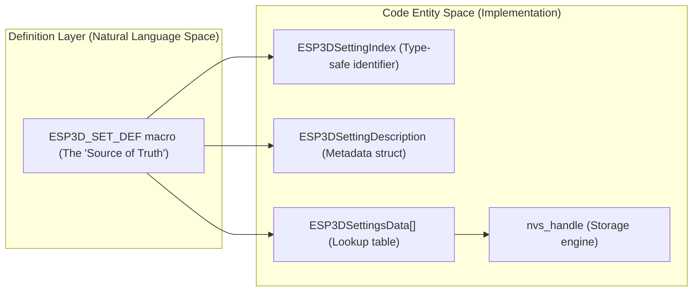
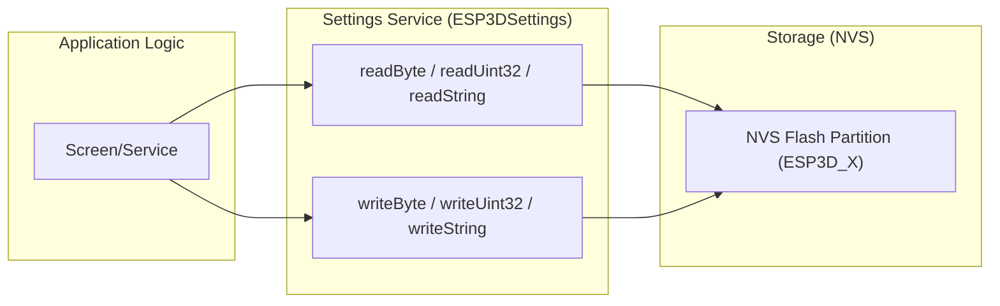
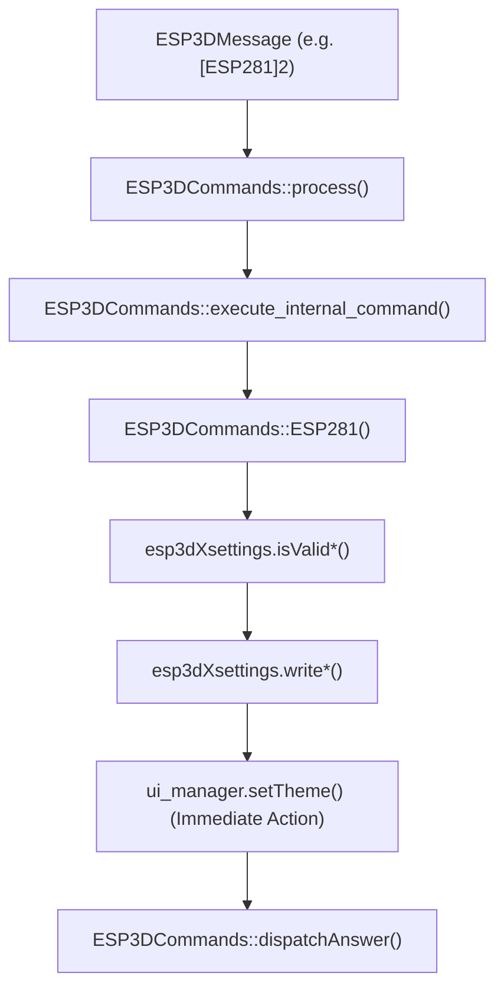

# Adding New Settings
Relevant source files

- [main/core/commands/esp0.cpp](https://github.com/luc-github/Pibot-cnc-pendant-firmware/blob/cbc90b5e/main/core/commands/esp0.cpp)
- [main/core/commands/esp100.cpp](https://github.com/luc-github/Pibot-cnc-pendant-firmware/blob/cbc90b5e/main/core/commands/esp100.cpp)
- [main/core/commands/esp132.cpp](https://github.com/luc-github/Pibot-cnc-pendant-firmware/blob/cbc90b5e/main/core/commands/esp132.cpp)
- [main/core/commands/esp133.cpp](https://github.com/luc-github/Pibot-cnc-pendant-firmware/blob/cbc90b5e/main/core/commands/esp133.cpp)
- [main/core/commands/esp281.cpp](https://github.com/luc-github/Pibot-cnc-pendant-firmware/blob/cbc90b5e/main/core/commands/esp281.cpp)
- [main/core/commands/esp400.cpp](https://github.com/luc-github/Pibot-cnc-pendant-firmware/blob/cbc90b5e/main/core/commands/esp400.cpp)
- [main/core/commands/esp950.cpp](https://github.com/luc-github/Pibot-cnc-pendant-firmware/blob/cbc90b5e/main/core/commands/esp950.cpp)
- [main/core/esp3d_commands.cpp](https://github.com/luc-github/Pibot-cnc-pendant-firmware/blob/cbc90b5e/main/core/esp3d_commands.cpp)
- [main/core/esp3d_settings.cpp](https://github.com/luc-github/Pibot-cnc-pendant-firmware/blob/cbc90b5e/main/core/esp3d_settings.cpp)
- [main/core/includes/esp3d_commands.h](https://github.com/luc-github/Pibot-cnc-pendant-firmware/blob/cbc90b5e/main/core/includes/esp3d_commands.h)
- [main/core/includes/esp3d_settings.h](https://github.com/luc-github/Pibot-cnc-pendant-firmware/blob/cbc90b5e/main/core/includes/esp3d_settings.h)
- [main/core/includes/esp3d_settings_defs.inc](https://github.com/luc-github/Pibot-cnc-pendant-firmware/blob/cbc90b5e/main/core/includes/esp3d_settings_defs.inc)
- [main/target/cnc/fluidnc/esp3d_target_settings_defs.inc](https://github.com/luc-github/Pibot-cnc-pendant-firmware/blob/cbc90b5e/main/target/cnc/fluidnc/esp3d_target_settings_defs.inc)

This guide explains how to add new persistent settings to the Pibot CNC Pendant firmware using the X-macro based settings system. Settings are stored in NVS (Non-Volatile Storage) and can optionally be configured via INI files during firmware updates.

---

## Overview of the Settings System

The settings system uses X-macros for compile-time code generation, producing type-safe enums, metadata tables, and validation checks from a single definition. Settings are categorized into:

- Core settings ([main/core/includes/esp3d_settings_defs.inc#43-250](https://github.com/luc-github/Pibot-cnc-pendant-firmware/blob/cbc90b5e/main/core/includes/esp3d_settings_defs.inc#L43-L250)) - System, network, services, UI, and authentication.
- Target settings ([main/target/cnc/fluidnc/esp3d_target_settings_defs.inc#21-240](https://github.com/luc-github/Pibot-cnc-pendant-firmware/blob/cbc90b5e/main/target/cnc/fluidnc/esp3d_target_settings_defs.inc#L21-L240)) - CNC/firmware-specific settings like jog steps, probe configuration, or tool change behavior.

All settings are managed by the `ESP3DSettings` class ([main/core/esp3d_settings.cpp#180-181](https://github.com/luc-github/Pibot-cnc-pendant-firmware/blob/cbc90b5e/main/core/esp3d_settings.cpp#L180-L181)) with automatic NVS persistence and schema versioning. The global instance is named `esp3dXsettings` ([main/core/esp3d_settings.cpp#62](https://github.com/luc-github/Pibot-cnc-pendant-firmware/blob/cbc90b5e/main/core/esp3d_settings.cpp#L62-L62)).

Sources:[main/core/includes/esp3d_settings.h#107-113](https://github.com/luc-github/Pibot-cnc-pendant-firmware/blob/cbc90b5e/main/core/includes/esp3d_settings.h#L107-L113)[main/core/esp3d_settings.cpp#62](https://github.com/luc-github/Pibot-cnc-pendant-firmware/blob/cbc90b5e/main/core/esp3d_settings.cpp#L62-L62)[main/core/esp3d_settings.cpp#127-130](https://github.com/luc-github/Pibot-cnc-pendant-firmware/blob/cbc90b5e/main/core/esp3d_settings.cpp#L127-L130)

---

## X-Macro Pattern Architecture

The X-macro pattern allows defining each setting once using the `ESP3D_SET_DEF` macro, which expands multiple times during compilation to generate different code artifacts.

### Natural Language to Code Entity Mapping (Architecture)

Title: Settings System Entity Mapping



Sources:[main/core/includes/esp3d_settings.h#102-113](https://github.com/luc-github/Pibot-cnc-pendant-firmware/blob/cbc90b5e/main/core/includes/esp3d_settings.h#L102-L113)[main/core/esp3d_settings.cpp#115-125](https://github.com/luc-github/Pibot-cnc-pendant-firmware/blob/cbc90b5e/main/core/esp3d_settings.cpp#L115-L125)[main/core/esp3d_settings.cpp#156-160](https://github.com/luc-github/Pibot-cnc-pendant-firmware/blob/cbc90b5e/main/core/esp3d_settings.cpp#L156-L160)

---

## Step 1: Define Your Setting

### Setting Definition Syntax

```
ESP3D_SET_DEF(enum_name,        // Identifier used in code (e.g., esp3d_baud_rate)
              "nvs_key",         // NVS storage key (max 15 chars, e.g., "sys_baud")
              type,              // byte_t, integer_t, string_t, ip_t, float_t
              size,              // Max size (bytes for byte/int, string length)
              "default_value",   // Default as string
              ini_info)          // INI_ENTRY("section", "key") or NO_INI
```

### Example: Adding a Target Feature Flag

Add to [main/target/cnc/fluidnc/esp3d_target_settings_defs.inc](https://github.com/luc-github/Pibot-cnc-pendant-firmware/blob/cbc90b5e/main/target/cnc/fluidnc/esp3d_target_settings_defs.inc):

```
ESP3D_SET_DEF(esp3d_new_feature_enabled,
              "tgt_new_feat",
              byte_t,
              1,
              "1",
              INI_ENTRY("pendant", "New_feature_enabled"))
```

Sources:[main/core/includes/esp3d_settings_defs.inc#34-40](https://github.com/luc-github/Pibot-cnc-pendant-firmware/blob/cbc90b5e/main/core/includes/esp3d_settings_defs.inc#L34-L40)[main/core/includes/esp3d_settings.h#168-178](https://github.com/luc-github/Pibot-cnc-pendant-firmware/blob/cbc90b5e/main/core/includes/esp3d_settings.h#L168-L178)[main/target/cnc/fluidnc/esp3d_target_settings_defs.inc#39-44](https://github.com/luc-github/Pibot-cnc-pendant-firmware/blob/cbc90b5e/main/target/cnc/fluidnc/esp3d_target_settings_defs.inc#L39-L44)

---

## Step 2: NVS Key Rules and Validation

### NVS Key Constraints

| Rule | Requirement | Rationale |
| --- | --- | --- |
| Maximum length | 15 characters | ESP-IDF NVS API limitation ([main/core/esp3d_settings.cpp#158-159](https://github.com/luc-github/Pibot-cnc-pendant-firmware/blob/cbc90b5e/main/core/esp3d_settings.cpp#L158-L159)) |
| Uniqueness | Must be globally unique | Prevents storage collisions |
| Naming convention | Use prefixes | `sys_`, `net_`, `tgt_`, `jog_` ([main/core/includes/esp3d_settings_defs.inc#15](https://github.com/luc-github/Pibot-cnc-pendant-firmware/blob/cbc90b5e/main/core/includes/esp3d_settings_defs.inc#L15-L15)[main/target/cnc/fluidnc/esp3d_target_settings_defs.inc#15](https://github.com/luc-github/Pibot-cnc-pendant-firmware/blob/cbc90b5e/main/target/cnc/fluidnc/esp3d_target_settings_defs.inc#L15-L15)) |

### Compile-Time Validation

The system automatically validates NVS keys at compile time using `static_assert` within an anonymous namespace in the implementation file ([main/core/esp3d_settings.cpp#157-159](https://github.com/luc-github/Pibot-cnc-pendant-firmware/blob/cbc90b5e/main/core/esp3d_settings.cpp#L157-L159)):

```
#define ESP3D_SET_DEF_VALIDATE(enum_name, nvs_key, type, size, default_val, ini_section, ini_key) \
    static_assert(const_strlen(nvs_key) <= NVS_KEY_MAX_LEN, \
                  "NVS key '" nvs_key "' exceeds 15 character limit");
```

Sources:[main/core/esp3d_settings.cpp#145-174](https://github.com/luc-github/Pibot-cnc-pendant-firmware/blob/cbc90b5e/main/core/esp3d_settings.cpp#L145-L174)[main/core/includes/esp3d_settings_defs.inc#12-16](https://github.com/luc-github/Pibot-cnc-pendant-firmware/blob/cbc90b5e/main/core/includes/esp3d_settings_defs.inc#L12-L16)

---

## Step 3: Setting Types and Sizes

### Type Reference ([main/core/includes/esp3d_settings.h#151-162](https://github.com/luc-github/Pibot-cnc-pendant-firmware/blob/cbc90b5e/main/core/includes/esp3d_settings.h#L151-L162))

| Type | C Type | Size Field | Use Case |
| --- | --- | --- | --- |
| `byte_t` | `uint8_t` | 1 | Boolean flags, small enums |
| `integer_t` | `uint32_t` | 4 | Baud rates, ports, intervals |
| `string_t` | `char[]` | Max length | SSIDs, passwords, hostnames |
| `ip_t` | `uint32_t` | 4 | IPv4 addresses ([main/core/includes/esp3d_settings.h#156](https://github.com/luc-github/Pibot-cnc-pendant-firmware/blob/cbc90b5e/main/core/includes/esp3d_settings.h#L156-L156)) |
| `float_t` | `char[]` | 15 | Floating point values (stored as string) |

Sources:[main/core/includes/esp3d_settings.h#151-162](https://github.com/luc-github/Pibot-cnc-pendant-firmware/blob/cbc90b5e/main/core/includes/esp3d_settings.h#L151-L162)[main/core/includes/esp3d_settings.h#171-173](https://github.com/luc-github/Pibot-cnc-pendant-firmware/blob/cbc90b5e/main/core/includes/esp3d_settings.h#L171-L173)

---

## Step 4: Reading and Writing Settings

Settings are accessed via the global `esp3dXsettings` instance ([main/core/esp3d_settings.cpp#62](https://github.com/luc-github/Pibot-cnc-pendant-firmware/blob/cbc90b5e/main/core/esp3d_settings.cpp#L62-L62)).

### Data Flow Diagram

Title: Setting Access Flow



### Implementation Example

```
#include "esp3d_settings.h"
 
// Reading an integer setting
uint32_t baud = esp3dXsettings.readUint32(ESP3DSettingIndex::esp3d_baud_rate);
 
// Writing a string setting
esp3dXsettings.writeString(ESP3DSettingIndex::esp3d_sta_ssid, "MyNetwork");
```

Sources:[main/core/esp3d_settings.cpp#57](https://github.com/luc-github/Pibot-cnc-pendant-firmware/blob/cbc90b5e/main/core/esp3d_settings.cpp#L57-L57)[main/core/esp3d_settings.cpp#62](https://github.com/luc-github/Pibot-cnc-pendant-firmware/blob/cbc90b5e/main/core/esp3d_settings.cpp#L62-L62)[main/core/esp100.cpp#80-82](https://github.com/luc-github/Pibot-cnc-pendant-firmware/blob/cbc90b5e/main/core/esp100.cpp#L80-L82)[main/core/esp100.cpp#208-209](https://github.com/luc-github/Pibot-cnc-pendant-firmware/blob/cbc90b5e/main/core/esp100.cpp#L208-L209)

---

## Step 5: Exposing in ESP400 Command

The `[ESP400]` command exports settings to external clients (WebUI, Serial) in JSON or text format ([main/core/commands/esp400.cpp#98-100](https://github.com/luc-github/Pibot-cnc-pendant-firmware/blob/cbc90b5e/main/core/commands/esp400.cpp#L98-L100)). To include your setting:

1. Define Labels/Values: Add string arrays for the UI labels if it's a list-type setting ([main/core/commands/esp400.cpp#32-36](https://github.com/luc-github/Pibot-cnc-pendant-firmware/blob/cbc90b5e/main/core/commands/esp400.cpp#L32-L36)).
2. Dispatch: Call `dispatchSetting()` in the `ESP400` function ([main/core/commands/esp400.cpp#128-134](https://github.com/luc-github/Pibot-cnc-pendant-firmware/blob/cbc90b5e/main/core/commands/esp400.cpp#L128-L134)).

```
// Example in esp400.cpp for a list setting
if (!dispatchSetting(json, "system/system",
                     ESP3DSettingIndex::esp3d_baud_rate, "baud", BaudRateList,
                     BaudRateList, sizeof(BaudRateList) / sizeof(char*), -1,
                     -1, -1, nullptr, true, target, requestId)) {
    esp3d_log_e("Error sending response to clients");
}
```

Sources:[main/core/commands/esp400.cpp#32-36](https://github.com/luc-github/Pibot-cnc-pendant-firmware/blob/cbc90b5e/main/core/commands/esp400.cpp#L32-L36)[main/core/commands/esp400.cpp#128-134](https://github.com/luc-github/Pibot-cnc-pendant-firmware/blob/cbc90b5e/main/core/commands/esp400.cpp#L128-L134)[main/core/commands/esp400.cpp#160-166](https://github.com/luc-github/Pibot-cnc-pendant-firmware/blob/cbc90b5e/main/core/commands/esp400.cpp#L160-L166)

---

## Step 6: Implementing Manual Command Handlers

For settings that require immediate action (like changing baud rates or themes), specific `ESP` commands are implemented in the `ESP3DCommands` class ([main/core/includes/esp3d_commands.h#34](https://github.com/luc-github/Pibot-cnc-pendant-firmware/blob/cbc90b5e/main/core/includes/esp3d_commands.h#L34-L34)).

### Command Processing Flow

Title: ESP Command to Settings Update Flow



Sources:[main/core/esp3d_commands.cpp#135-142](https://github.com/luc-github/Pibot-cnc-pendant-firmware/blob/cbc90b5e/main/core/esp3d_commands.cpp#L135-L142)[main/core/commands/esp281.cpp#31-108](https://github.com/luc-github/Pibot-cnc-pendant-firmware/blob/cbc90b5e/main/core/commands/esp281.cpp#L31-L108)[main/core/commands/esp132.cpp#29-86](https://github.com/luc-github/Pibot-cnc-pendant-firmware/blob/cbc90b5e/main/core/commands/esp132.cpp#L29-L86)

---

## Step 7: Schema Versioning

When adding or modifying settings, you must update the versioning system to ensure NVS is correctly initialized.

- Major Version: Increment in `ESP3D_SETTINGS_VERSION_MAJOR` if you change the size or type of an existing setting. This triggers a full reset of all settings to defaults during `checkSchemaVersion()` ([main/core/esp3d_settings.cpp#240-244](https://github.com/luc-github/Pibot-cnc-pendant-firmware/blob/cbc90b5e/main/core/esp3d_settings.cpp#L240-L244)).
- Minor Version: Increment in `ESP3D_SETTINGS_VERSION_MINOR` if you add a new setting. This preserves existing settings while initializing the new one ([main/core/esp3d_settings.cpp#248-251](https://github.com/luc-github/Pibot-cnc-pendant-firmware/blob/cbc90b5e/main/core/esp3d_settings.cpp#L248-L251)).

Sources:[main/core/esp3d_settings.cpp#233-257](https://github.com/luc-github/Pibot-cnc-pendant-firmware/blob/cbc90b5e/main/core/esp3d_settings.cpp#L233-L257)[main/core/includes/esp3d_settings_version.h#1-10](https://github.com/luc-github/Pibot-cnc-pendant-firmware/blob/cbc90b5e/main/core/includes/esp3d_settings_version.h#L1-L10)