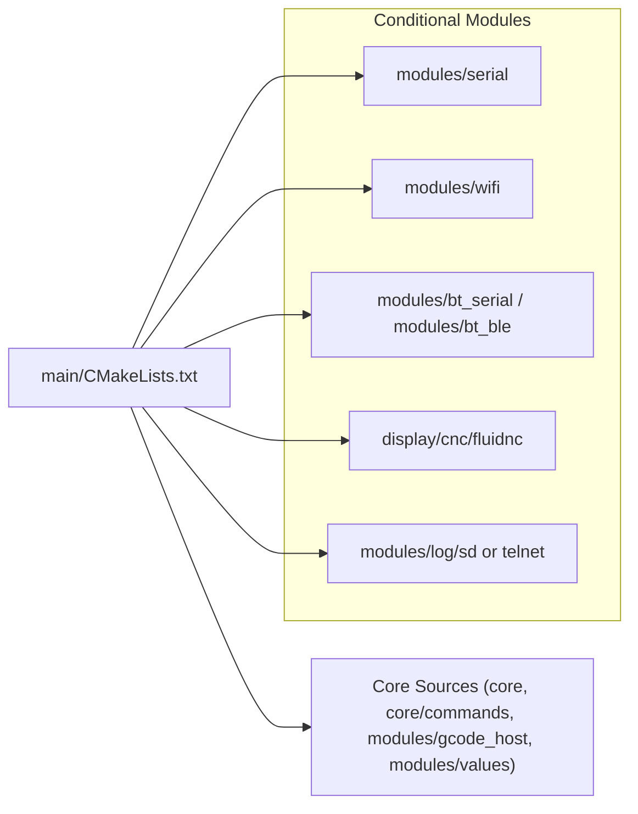
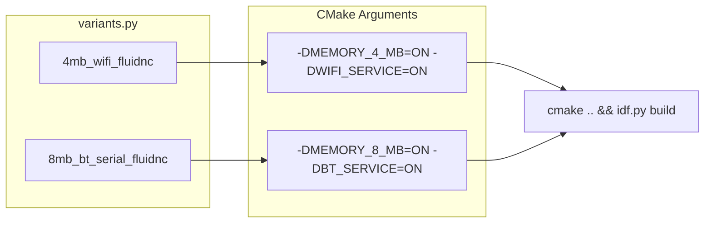

# Build System and Feature Flags
Relevant source files

- [CMakeLists.txt](https://github.com/luc-github/Pibot-cnc-pendant-firmware/blob/cbc90b5e/CMakeLists.txt)
- [boards/ESP32_C3_BARE/build_scripts/common.py](https://github.com/luc-github/Pibot-cnc-pendant-firmware/blob/cbc90b5e/boards/ESP32_C3_BARE/build_scripts/common.py)
- [boards/ESP32_S3_WROOM_CAM/build_scripts/common.py](https://github.com/luc-github/Pibot-cnc-pendant-firmware/blob/cbc90b5e/boards/ESP32_S3_WROOM_CAM/build_scripts/common.py)
- [boards/fysetc_wifi_pro/build_scripts/common.py](https://github.com/luc-github/Pibot-cnc-pendant-firmware/blob/cbc90b5e/boards/fysetc_wifi_pro/build_scripts/common.py)
- [boards/pibot_pendant_v1_0/board_config.cmake](https://github.com/luc-github/Pibot-cnc-pendant-firmware/blob/cbc90b5e/boards/pibot_pendant_v1_0/board_config.cmake)
- [boards/pibot_pendant_v1_0/build_scripts/common.py](https://github.com/luc-github/Pibot-cnc-pendant-firmware/blob/cbc90b5e/boards/pibot_pendant_v1_0/build_scripts/common.py)
- [boards/pibot_pendant_v1_0/sdkconfig.4mb.bt](https://github.com/luc-github/Pibot-cnc-pendant-firmware/blob/cbc90b5e/boards/pibot_pendant_v1_0/sdkconfig.4mb.bt)
- [boards/pibot_pendant_v1_0/sdkconfig.4mb.bt_ble](https://github.com/luc-github/Pibot-cnc-pendant-firmware/blob/cbc90b5e/boards/pibot_pendant_v1_0/sdkconfig.4mb.bt_ble)
- [boards/pibot_pendant_v1_0/sdkconfig.4mb.bt_serial](https://github.com/luc-github/Pibot-cnc-pendant-firmware/blob/cbc90b5e/boards/pibot_pendant_v1_0/sdkconfig.4mb.bt_serial)
- [boards/pibot_pendant_v1_0/sdkconfig.4mb.wifi](https://github.com/luc-github/Pibot-cnc-pendant-firmware/blob/cbc90b5e/boards/pibot_pendant_v1_0/sdkconfig.4mb.wifi)
- [boards/pibot_pendant_v1_0/sdkconfig.8mb.bt](https://github.com/luc-github/Pibot-cnc-pendant-firmware/blob/cbc90b5e/boards/pibot_pendant_v1_0/sdkconfig.8mb.bt)
- [boards/pibot_pendant_v1_0/sdkconfig.8mb.bt_ble](https://github.com/luc-github/Pibot-cnc-pendant-firmware/blob/cbc90b5e/boards/pibot_pendant_v1_0/sdkconfig.8mb.bt_ble)
- [boards/pibot_pendant_v1_0/sdkconfig.8mb.bt_serial](https://github.com/luc-github/Pibot-cnc-pendant-firmware/blob/cbc90b5e/boards/pibot_pendant_v1_0/sdkconfig.8mb.bt_serial)
- [boards/pibot_pendant_v1_0/sdkconfig.8mb.wifi](https://github.com/luc-github/Pibot-cnc-pendant-firmware/blob/cbc90b5e/boards/pibot_pendant_v1_0/sdkconfig.8mb.wifi)
- [cmake/features.cmake](https://github.com/luc-github/Pibot-cnc-pendant-firmware/blob/cbc90b5e/cmake/features.cmake)
- [cmake/postbuild.cmake](https://github.com/luc-github/Pibot-cnc-pendant-firmware/blob/cbc90b5e/cmake/postbuild.cmake)
- [cmake/sanity_check.cmake](https://github.com/luc-github/Pibot-cnc-pendant-firmware/blob/cbc90b5e/cmake/sanity_check.cmake)
- [dependencies.lock](https://github.com/luc-github/Pibot-cnc-pendant-firmware/blob/cbc90b5e/dependencies.lock)
- [main/CMakeLists.txt](https://github.com/luc-github/Pibot-cnc-pendant-firmware/blob/cbc90b5e/main/CMakeLists.txt)
- [tools/build_scripts/build_mgr.py](https://github.com/luc-github/Pibot-cnc-pendant-firmware/blob/cbc90b5e/tools/build_scripts/build_mgr.py)
- [tools/build_scripts/gen_ota_initial.py](https://github.com/luc-github/Pibot-cnc-pendant-firmware/blob/cbc90b5e/tools/build_scripts/gen_ota_initial.py)
- [tools/flash_scripts/flash_mgr.py](https://github.com/luc-github/Pibot-cnc-pendant-firmware/blob/cbc90b5e/tools/flash_scripts/flash_mgr.py)

## Purpose and Scope

This document describes the CMake-based build system and compile-time feature flags used in the PiBot CNC Pendant firmware. It covers the multi-tier configuration strategy (board, memory, radio, and target firmware), the component dependency model, and how preprocessor flags are used to optimize the binary for specific hardware capabilities and memory constraints.

---

## Build System Architecture

The firmware uses a sophisticated CMake structure built on top of the ESP-IDF build system. It automates the selection of board configurations, memory sizes, and target CNC firmwares.

### Configuration Hierarchy

The build process follows a specific resolution order defined in the root `CMakeLists.txt`:

1. Hardware Selection: Defines the physical board (e.g., `ESP32_PIBOT_CNC_PENDANT_V1`). [CMakeLists.txt#6](https://github.com/luc-github/Pibot-cnc-pendant-firmware/blob/cbc90b5e/CMakeLists.txt#L6-L6)
2. Flash and PSRAM Size: Configures partition tables and application-level buffer sizing. [CMakeLists.txt#30-44](https://github.com/luc-github/Pibot-cnc-pendant-firmware/blob/cbc90b5e/CMakeLists.txt#L30-L44)
3. Target Firmware: Sets the G-code dialect and UI layout (FluidNC, grblHAL, Marlin, etc.). [CMakeLists.txt#49-55](https://github.com/luc-github/Pibot-cnc-pendant-firmware/blob/cbc90b5e/CMakeLists.txt#L49-L55)
4. Communication Services: Enables/disables Serial, USB, WiFi, or Bluetooth. [CMakeLists.txt#62-68](https://github.com/luc-github/Pibot-cnc-pendant-firmware/blob/cbc90b5e/CMakeLists.txt#L62-L68)

### Board-Specific Configuration

Each board has a dedicated directory (e.g., `boards/pibot_pendant_v1_0/`) containing a `board_config.cmake` file. This file forces hardware-specific defaults:

- SDK Config Selection: Dynamically selects the `sdkconfig` variant based on memory size and radio stack. For the PiBot board, WiFi and BT are mutually exclusive due to the lack of PSRAM. [boards/pibot_pendant_v1_0/board_config.cmake#11-32](https://github.com/luc-github/Pibot-cnc-pendant-firmware/blob/cbc90b5e/boards/pibot_pendant_v1_0/board_config.cmake#L11-L32)
- Hardware Defaults: Forces `TFT_UI_SERVICE`, `SD_CARD_SERVICE`, and hardware input flags (`HARDWARE_ENCODER`, `HARDWARE_BUTTONS`, `HARDWARE_SWITCH`, `HARDWARE_POTENTIOMETER`) to `ON`. [boards/pibot_pendant_v1_0/board_config.cmake#49-101](https://github.com/luc-github/Pibot-cnc-pendant-firmware/blob/cbc90b5e/boards/pibot_pendant_v1_0/board_config.cmake#L49-L101)
- Resolution and Layout: Sets `RESOLUTION_SCREEN` (e.g., `res_320_240`) and disables dynamic rotation to optimize LVGL performance. [boards/pibot_pendant_v1_0/board_config.cmake#63-72](https://github.com/luc-github/Pibot-cnc-pendant-firmware/blob/cbc90b5e/boards/pibot_pendant_v1_0/board_config.cmake#L63-L72)

Sources:[CMakeLists.txt#1-135](https://github.com/luc-github/Pibot-cnc-pendant-firmware/blob/cbc90b5e/CMakeLists.txt#L1-L135)[boards/pibot_pendant_v1_0/board_config.cmake#1-112](https://github.com/luc-github/Pibot-cnc-pendant-firmware/blob/cbc90b5e/boards/pibot_pendant_v1_0/board_config.cmake#L1-L112)

---

## Feature Flags and Preprocessor Macros

Feature flags are mapped from CMake `OPTION` variables to C++ preprocessor macros in `cmake/features.cmake`. These flags allow the compiler to strip unused code, reducing flash and RAM footprints.

### Mapping Logic (Code Entity Space)

| CMake Option | Preprocessor Macro | Impacted Functionality |
| --- | --- | --- |
| `TFT_UI_SERVICE` | `ESP3D_DISPLAY_FEATURE` | Enables LVGL, UIManager, and Screen stack. [cmake/features.cmake#189](https://github.com/luc-github/Pibot-cnc-pendant-firmware/blob/cbc90b5e/cmake/features.cmake#L189-L189) |
| `TFT_TOUCH_SERVICE` | `ESP3D_TOUCH_FEATURE` | Enables touch controller drivers. [cmake/features.cmake#191](https://github.com/luc-github/Pibot-cnc-pendant-firmware/blob/cbc90b5e/cmake/features.cmake#L191-L191) |
| `HARDWARE_ENCODER` | `ESP3D_HARDWARE_ENCODER_FEATURE` | Enables PCNT-based rotary encoder support. [cmake/features.cmake#208](https://github.com/luc-github/Pibot-cnc-pendant-firmware/blob/cbc90b5e/cmake/features.cmake#L208-L208) |
| `WIFI_SERVICE` | `ESP3D_WIFI_FEATURE` | Enables Network stack and WiFi-based clients. [cmake/features.cmake#141](https://github.com/luc-github/Pibot-cnc-pendant-firmware/blob/cbc90b5e/cmake/features.cmake#L141-L141) |
| `BT_SERVICE` | `ESP3D_BT_FEATURE` | Enables Bluetooth Classic (SPP) and BLE. [cmake/features.cmake#132](https://github.com/luc-github/Pibot-cnc-pendant-firmware/blob/cbc90b5e/cmake/features.cmake#L132-L132) |
| `SOCKET_CLIENT_SERVICE` | `ESP3D_SOCKET_CLIENT_FEATURE` | Enables TCP client for CNC-over-IP. [cmake/features.cmake#177](https://github.com/luc-github/Pibot-cnc-pendant-firmware/blob/cbc90b5e/cmake/features.cmake#L177-L177) |
| `PROD_BUILD` | `ESP3D_LOG=0` | Silences all dev logging and snapshots. [cmake/dev_tools.cmake#17-27](https://github.com/luc-github/Pibot-cnc-pendant-firmware/blob/cbc90b5e/cmake/dev_tools.cmake#L17-L27) |

### Target Firmware Specialization

The `cmake/features.cmake` file handles include path injection based on the `TARGET_FW_*` flags. This ensures that only the relevant G-code parsers and UI components for the chosen CNC controller (e.g., FluidNC) are visible to the compiler. [cmake/features.cmake#6-64](https://github.com/luc-github/Pibot-cnc-pendant-firmware/blob/cbc90b5e/cmake/features.cmake#L6-L64)

Sources:[cmake/features.cmake#1-213](https://github.com/luc-github/Pibot-cnc-pendant-firmware/blob/cbc90b5e/cmake/features.cmake#L1-L213)[cmake/dev_tools.cmake#1-90](https://github.com/luc-github/Pibot-cnc-pendant-firmware/blob/cbc90b5e/cmake/dev_tools.cmake#L1-L90)

---

## Component Dependency and Source Management

The `main/CMakeLists.txt` file acts as a dynamic manifest, appending source directories to the `SOURCES` list only if their corresponding feature flags are enabled.

### Dynamic Source Inclusion Diagram

Sources:[main/CMakeLists.txt#1-200](https://github.com/luc-github/Pibot-cnc-pendant-firmware/blob/cbc90b5e/main/CMakeLists.txt#L1-L200)

---

## Build Sanity Checks

To prevent invalid hardware/software combinations, `cmake/sanity_check.cmake` performs validation during the generation phase.

### Incompatibility Rules

- WiFi vs. Bluetooth: Mutually exclusive on boards without PSRAM (like the PiBot Pendant) because the ESP32 cannot hold both stacks in RAM simultaneously. [cmake/sanity_check.cmake#71-77](https://github.com/luc-github/Pibot-cnc-pendant-firmware/blob/cbc90b5e/cmake/sanity_check.cmake#L71-L77)
- Socket Server vs. Client: A single device cannot act as both the TCP server (incoming) and TCP client (outgoing to CNC) on the same port range. [cmake/sanity_check.cmake#87-93](https://github.com/luc-github/Pibot-cnc-pendant-firmware/blob/cbc90b5e/cmake/sanity_check.cmake#L87-L93)
- CNC over IP Resource Lock: If `SOCKET_CLIENT_SERVICE` is enabled, features like `SSDP_SERVICE` and `WEBUI_SERVER` are forbidden to ensure the WiFi station is dedicated to the CNC link. [cmake/sanity_check.cmake#98-125](https://github.com/luc-github/Pibot-cnc-pendant-firmware/blob/cbc90b5e/cmake/sanity_check.cmake#L98-L125)
- Logging Backends: Backend 1 (SD) requires `SD_CARD_SERVICE=ON`, and Backend 3 (Telnet) requires `SOCKET_SERVER_SERVICE=ON`. [cmake/sanity_check.cmake#144-156](https://github.com/luc-github/Pibot-cnc-pendant-firmware/blob/cbc90b5e/cmake/sanity_check.cmake#L144-L156)

Sources:[cmake/sanity_check.cmake#1-160](https://github.com/luc-github/Pibot-cnc-pendant-firmware/blob/cbc90b5e/cmake/sanity_check.cmake#L1-L160)

---

## Post-Build and Installer Generation

The build system includes a post-build step in `cmake/postbuild.cmake` that packages the resulting binaries into a standardized directory structure.

### Build Artifact Workflow

1. Detection: Detects the configuration name based on memory, radio, and firmware (e.g., `ESP32_PIBOT_CNC_PENDANT_V1_8MB_wifi_fluidnc`). [cmake/postbuild.cmake#11-68](https://github.com/luc-github/Pibot-cnc-pendant-firmware/blob/cbc90b5e/cmake/postbuild.cmake#L11-L68)
2. Packaging: Creates an `installer/` directory. [cmake/postbuild.cmake#73-86](https://github.com/luc-github/Pibot-cnc-pendant-firmware/blob/cbc90b5e/cmake/postbuild.cmake#L73-L86)
3. Binary Naming: Copies and renames the firmware binary to include configuration details. [cmake/postbuild.cmake#89-96](https://github.com/luc-github/Pibot-cnc-pendant-firmware/blob/cbc90b5e/cmake/postbuild.cmake#L89-L96)
4. OTA and Partitions: Generates `ota_data_initial.bin` and copies `partition-table.bin` for flashing. [cmake/postbuild.cmake#98-115](https://github.com/luc-github/Pibot-cnc-pendant-firmware/blob/cbc90b5e/cmake/postbuild.cmake#L98-L115)
5. Flash Manager: Generates a flash map JSON for the variant and includes `flash_mgr.py` for easy distribution. [cmake/postbuild.cmake#122-132](https://github.com/luc-github/Pibot-cnc-pendant-firmware/blob/cbc90b5e/cmake/postbuild.cmake#L122-L132)

Sources:[cmake/postbuild.cmake#1-148](https://github.com/luc-github/Pibot-cnc-pendant-firmware/blob/cbc90b5e/cmake/postbuild.cmake#L1-L148)

---

## Build Variant Automation

The firmware supports automated building of multiple variants using Python scripts that pass specific CMake arguments. Variants are discovered from each board's `build_scripts/variants.py`. [tools/build_scripts/build_mgr.py#125-164](https://github.com/luc-github/Pibot-cnc-pendant-firmware/blob/cbc90b5e/tools/build_scripts/build_mgr.py#L125-L164)

### Variant Mapping Diagram

### Resource Generation

The `common.py` script for each board handles the generation of the `ui_resources` partition binary. This ensures that the boot logo, icons, and fonts match the specific variant's resolution and target firmware. [boards/pibot_pendant_v1_0/build_scripts/common.py#142-168](https://github.com/luc-github/Pibot-cnc-pendant-firmware/blob/cbc90b5e/boards/pibot_pendant_v1_0/build_scripts/common.py#L142-L168)

Sources:[tools/build_scripts/build_mgr.py#1-164](https://github.com/luc-github/Pibot-cnc-pendant-firmware/blob/cbc90b5e/tools/build_scripts/build_mgr.py#L1-L164)[boards/pibot_pendant_v1_0/build_scripts/common.py#1-168](https://github.com/luc-github/Pibot-cnc-pendant-firmware/blob/cbc90b5e/boards/pibot_pendant_v1_0/build_scripts/common.py#L1-L168)