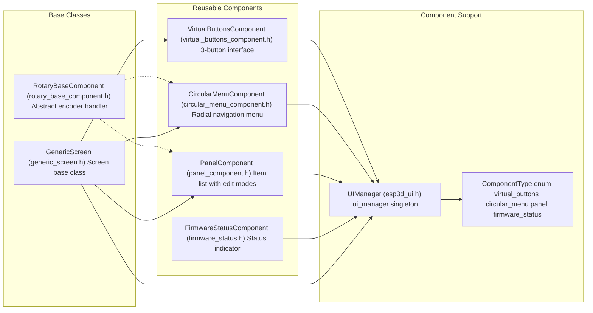
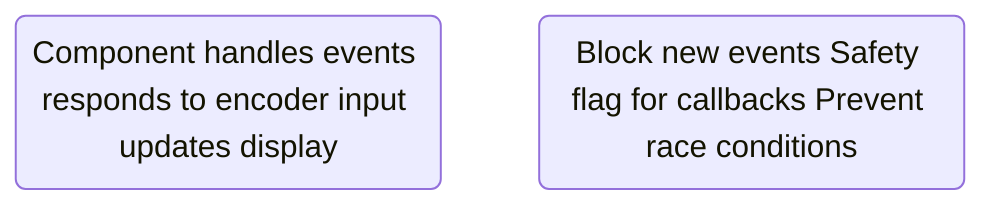
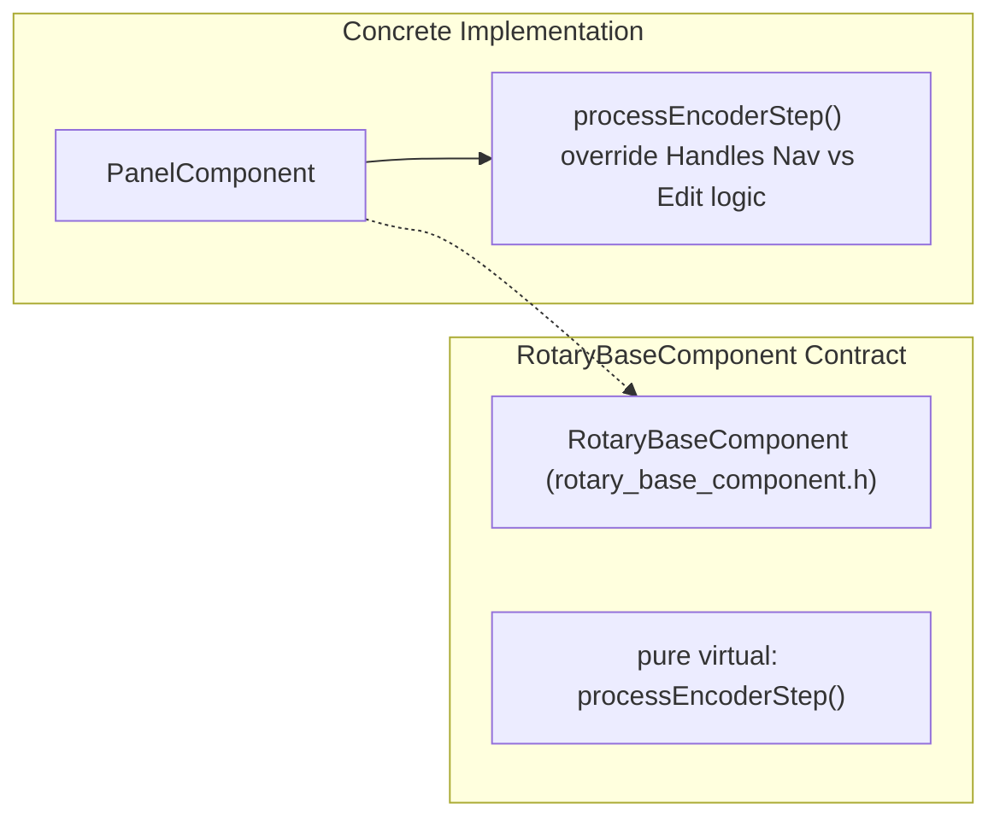
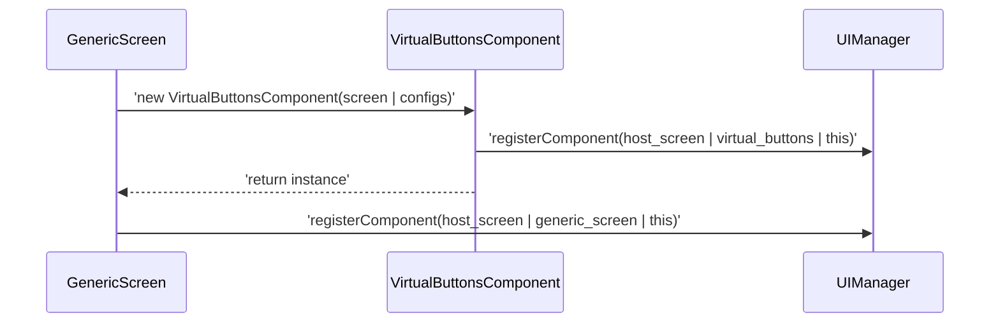

# Creating Custom UI Components
Relevant source files

- [boards/pibot_pendant_v1_0/components/bsp/board_init.h](https://github.com/luc-github/Pibot-cnc-pendant-firmware/blob/cbc90b5e/boards/pibot_pendant_v1_0/components/bsp/board_init.h)
- [boards/pibot_pendant_v1_0/components/bsp/control_event.h](https://github.com/luc-github/Pibot-cnc-pendant-firmware/blob/cbc90b5e/boards/pibot_pendant_v1_0/components/bsp/control_event.h)
- [cmake/dev_tools.cmake](https://github.com/luc-github/Pibot-cnc-pendant-firmware/blob/cbc90b5e/cmake/dev_tools.cmake)
- [components/esp3d_log/esp3d_log.c](https://github.com/luc-github/Pibot-cnc-pendant-firmware/blob/cbc90b5e/components/esp3d_log/esp3d_log.c)
- [components/esp3d_log/esp3d_log.h](https://github.com/luc-github/Pibot-cnc-pendant-firmware/blob/cbc90b5e/components/esp3d_log/esp3d_log.h)
- [components/esp3d_log/library.json](https://github.com/luc-github/Pibot-cnc-pendant-firmware/blob/cbc90b5e/components/esp3d_log/library.json)
- [main/display/components/panel_component.cpp](https://github.com/luc-github/Pibot-cnc-pendant-firmware/blob/cbc90b5e/main/display/components/panel_component.cpp)
- [main/display/components/panel_component.h](https://github.com/luc-github/Pibot-cnc-pendant-firmware/blob/cbc90b5e/main/display/components/panel_component.h)
- [main/display/screens/generic_screen.cpp](https://github.com/luc-github/Pibot-cnc-pendant-firmware/blob/cbc90b5e/main/display/screens/generic_screen.cpp)
- [main/display/screens/generic_screen.h](https://github.com/luc-github/Pibot-cnc-pendant-firmware/blob/cbc90b5e/main/display/screens/generic_screen.h)
- [sdkconfig](https://github.com/luc-github/Pibot-cnc-pendant-firmware/blob/cbc90b5e/sdkconfig)
- [tools/fonts/Conversions.txt](https://github.com/luc-github/Pibot-cnc-pendant-firmware/blob/cbc90b5e/tools/fonts/Conversions.txt)

## Purpose and Scope

This guide covers the patterns and best practices for creating reusable UI components in the PiBot CNC Pendant firmware. Components are self-contained UI elements that can be integrated into multiple screens, providing consistent behavior and appearance across the application.

This document focuses on component architecture, lifecycle management, and integration patterns. For information about creating complete application screens, see [11.2 Adding New Screens](https://github.com/luc-github/Pibot-cnc-pendant-firmware/blob/cbc90b5e/11.2 Adding New Screens) For UI framework fundamentals, see [2.4 UI Layer](https://github.com/luc-github/Pibot-cnc-pendant-firmware/blob/cbc90b5e/2.4 UI Layer) and [7.1 UIManager](https://github.com/luc-github/Pibot-cnc-pendant-firmware/blob/cbc90b5e/7.1 UIManager)

---

## Component Architecture Overview

The firmware provides several patterns for creating UI components, depending on their complexity and whether they need encoder input handling. The `PanelComponent` is a specialized container for interactive items that supports both navigation and edit modes.



Component Architecture Hierarchy

Sources:

- [main/display/components/panel_component.h#56-65](https://github.com/luc-github/Pibot-cnc-pendant-firmware/blob/cbc90b5e/main/display/components/panel_component.h#L56-L65)
- [main/display/screens/generic_screen.h#26-54](https://github.com/luc-github/Pibot-cnc-pendant-firmware/blob/cbc90b5e/main/display/screens/generic_screen.h#L26-L54)
- [main/display/components/panel_component.cpp#52-56](https://github.com/luc-github/Pibot-cnc-pendant-firmware/blob/cbc90b5e/main/display/components/panel_component.cpp#L52-L56)

---

## Component Types and Their Roles

| Component Type | Base Class | Purpose | Registration Required |
| --- | --- | --- | --- |
| `VirtualButtonsComponent` | None | 3-button interface with hardware/virtual input | Yes |
| `CircularMenuComponent` | `RotaryBaseComponent` | Radial navigation menu with encoder | Yes |
| `PanelComponent` | `RotaryBaseComponent` | Grid/List of items with focus and edit modes | Yes |
| `FirmwareStatusComponent` | None | Status indicator with click handler | Yes |
| `GenericScreen` | None | Base class providing standard container and button layout | Yes |

Sources:

- [main/display/components/panel_component.cpp#30-62](https://github.com/luc-github/Pibot-cnc-pendant-firmware/blob/cbc90b5e/main/display/components/panel_component.cpp#L30-L62)
- [main/display/screens/generic_screen.cpp#147-165](https://github.com/luc-github/Pibot-cnc-pendant-firmware/blob/cbc90b5e/main/display/screens/generic_screen.cpp#L147-L165)
- [main/display/components/panel_component.h#38-44](https://github.com/luc-github/Pibot-cnc-pendant-firmware/blob/cbc90b5e/main/display/components/panel_component.h#L38-L44)

---

## Component Lifecycle Pattern

All components follow a standardized two-phase destruction lifecycle to ensure safe cleanup in the face of asynchronous events and screen transitions.



Component Lifecycle State Machine

Sources:

- [main/display/components/panel_component.cpp#65-72](https://github.com/luc-github/Pibot-cnc-pendant-firmware/blob/cbc90b5e/main/display/components/panel_component.cpp#L65-L72)
- [main/display/components/panel_component.cpp#143-150](https://github.com/luc-github/Pibot-cnc-pendant-firmware/blob/cbc90b5e/main/display/components/panel_component.cpp#L143-L150)
- [main/display/screens/generic_screen.cpp#55-60](https://github.com/luc-github/Pibot-cnc-pendant-firmware/blob/cbc90b5e/main/display/screens/generic_screen.cpp#L55-L60)

### Lifecycle Flags

Each component maintains several flags to track its state:

| Flag | Purpose | Set During |
| --- | --- | --- |
| `is_valid_` | Component is operational | Constructor (after setup) [main/display/components/panel_component.cpp#58](https://github.com/luc-github/Pibot-cnc-pendant-firmware/blob/cbc90b5e/main/display/components/panel_component.cpp#L58-L58) |
| `is_prepared_for_destruction_` | Destruction initiated, block events | `prepareForDestruction()`[main/display/components/panel_component.cpp#67](https://github.com/luc-github/Pibot-cnc-pendant-firmware/blob/cbc90b5e/main/display/components/panel_component.cpp#L67-L67) |
| `transition_in_progress_` | Static flag to prevent concurrent screen swaps | `GenericScreen` Constructor [main/display/screens/generic_screen.cpp#60](https://github.com/luc-github/Pibot-cnc-pendant-firmware/blob/cbc90b5e/main/display/screens/generic_screen.cpp#L60-L60) |

Sources:

- [main/display/components/panel_component.h#146-150](https://github.com/luc-github/Pibot-cnc-pendant-firmware/blob/cbc90b5e/main/display/components/panel_component.h#L146-L150)
- [main/display/screens/generic_screen.h#35-42](https://github.com/luc-github/Pibot-cnc-pendant-firmware/blob/cbc90b5e/main/display/screens/generic_screen.h#L35-L42)

---

## The PanelComponent Pattern

`PanelComponent` is a powerful reusable component used in screens that require item selection and value adjustment. It manages a collection of `PanelItem` objects, each of which can be focused or edited using the rotary encoder.

### Unified Callback System

The `PanelComponent` uses a `panel_callback_t` to notify the parent screen of state changes, such as focus gains or value updates.

```
// panel_component.h
typedef void (*panel_callback_t)(int32_t item_id,
                                 PanelCallbackType type,
                                 const std::string &value,
                                 int32_t direction);
```

Sources:

- [main/display/components/panel_component.h#50-53](https://github.com/luc-github/Pibot-cnc-pendant-firmware/blob/cbc90b5e/main/display/components/panel_component.h#L50-L53)
- [main/display/components/panel_component.cpp#30-35](https://github.com/luc-github/Pibot-cnc-pendant-firmware/blob/cbc90b5e/main/display/components/panel_component.cpp#L30-L35)

### Interactive Item Management

Items are added to the panel with a list of possible values. The component handles the cycling of these values and visual updates.

- `addItem()`: Adds an LVGL object to the managed list. It sets up touch events and flags if the item is editable [main/display/components/panel_component.cpp#75-118](https://github.com/luc-github/Pibot-cnc-pendant-firmware/blob/cbc90b5e/main/display/components/panel_component.cpp#L75-L118)
- `setFocusedItem()`: Moves the visual focus and encoder target to a specific ID [main/display/components/panel_component.cpp#218-232](https://github.com/luc-github/Pibot-cnc-pendant-firmware/blob/cbc90b5e/main/display/components/panel_component.cpp#L218-L232)
- `updateItemText()`: Allows the parent screen to update the label text (useful for translations) [main/display/components/panel_component.cpp#234-242](https://github.com/luc-github/Pibot-cnc-pendant-firmware/blob/cbc90b5e/main/display/components/panel_component.cpp#L234-L242)
- `disableItem()`: Skips items during navigation and applies `LV_STATE_DISABLED` to the LVGL object [main/display/components/panel_component.cpp#184-216](https://github.com/luc-github/Pibot-cnc-pendant-firmware/blob/cbc90b5e/main/display/components/panel_component.cpp#L184-L216)

Sources:

- [main/display/components/panel_component.cpp#75-127](https://github.com/luc-github/Pibot-cnc-pendant-firmware/blob/cbc90b5e/main/display/components/panel_component.cpp#L75-L127)
- [main/display/components/panel_component.h#70-90](https://github.com/luc-github/Pibot-cnc-pendant-firmware/blob/cbc90b5e/main/display/components/panel_component.h#L70-L90)

---

## Creating an Encoder-Controlled Component

Components that respond to rotary encoder input should inherit from `RotaryBaseComponent`.



Encoder Component Architecture

Sources:

- [main/display/components/panel_component.h#56-57](https://github.com/luc-github/Pibot-cnc-pendant-firmware/blob/cbc90b5e/main/display/components/panel_component.h#L56-L57)
- [main/display/components/panel_component.h#159](https://github.com/luc-github/Pibot-cnc-pendant-firmware/blob/cbc90b5e/main/display/components/panel_component.h#L159-L159)

### Implementing processEncoderStep

The implementation must override `processEncoderStep` to define how clockwise/counter-clockwise rotations affect the component state. `PanelComponent` uses two modes: `PANEL_NAVIGATION_MODE` for switching items and `PANEL_EDITING_MODE` for changing values [main/display/components/panel_component.h#34-35](https://github.com/luc-github/Pibot-cnc-pendant-firmware/blob/cbc90b5e/main/display/components/panel_component.h#L34-L35)

Sources:

- [main/display/components/panel_component.cpp#244-290](https://github.com/luc-github/Pibot-cnc-pendant-firmware/blob/cbc90b5e/main/display/components/panel_component.cpp#L244-L290)

---

## Integration with GenericScreen

`GenericScreen` provides a base for screens that require a standard 3-button layout at the bottom, managed by `VirtualButtonsComponent`. It also creates a standard `container_` for the main UI content.



GenericScreen Component Integration

Sources:

- [main/display/screens/generic_screen.cpp#147-165](https://github.com/luc-github/Pibot-cnc-pendant-firmware/blob/cbc90b5e/main/display/screens/generic_screen.cpp#L147-L165)
- [main/display/screens/generic_screen.cpp#129-141](https://github.com/luc-github/Pibot-cnc-pendant-firmware/blob/cbc90b5e/main/display/screens/generic_screen.cpp#L129-L141)

---

## Best Practices

### 1. Memory Safety (std::nothrow)

Constructors should use `std::nothrow` for dynamic allocations to prevent uncaught exceptions from crashing the LVGL task.

- Reference:`GenericScreen` allocates `virtual_buttons_` using `std::nothrow`[main/display/screens/generic_screen.cpp#147-148](https://github.com/luc-github/Pibot-cnc-pendant-firmware/blob/cbc90b5e/main/display/screens/generic_screen.cpp#L147-L148)

### 2. Encoder Buffer Management

When creating a new component that uses the encoder, clear the physical encoder buffer to prevent "phantom" pulses from previous screens.

- Reference:`VirtualButtonsComponent::resetEncoderSteps()` is called in the `PanelComponent` constructor [main/display/components/panel_component.cpp#41-45](https://github.com/luc-github/Pibot-cnc-pendant-firmware/blob/cbc90b5e/main/display/components/panel_component.cpp#L41-L45)

### 3. Responsive Navigation

Set appropriate debounce and accumulation limits for encoder handling to ensure the UI feels responsive yet stable.

- Reference:`PanelComponent` sets a 50ms debounce threshold and limits of -10 to 10 [main/display/components/panel_component.cpp#48-49](https://github.com/luc-github/Pibot-cnc-pendant-firmware/blob/cbc90b5e/main/display/components/panel_component.cpp#L48-L49)

### 4. Component Registration

Always register components with `UIManager` in the constructor and unregister in `prepareForDestruction()`. This allows the UI system to manage the component lifecycle correctly.

- Reference:`ui_manager.registerComponent()` call in [main/display/components/panel_component.cpp#52-56](https://github.com/luc-github/Pibot-cnc-pendant-firmware/blob/cbc90b5e/main/display/components/panel_component.cpp#L52-L56)

Sources:

- [main/display/components/panel_component.cpp#30-62](https://github.com/luc-github/Pibot-cnc-pendant-firmware/blob/cbc90b5e/main/display/components/panel_component.cpp#L30-L62)
- [main/display/screens/generic_screen.cpp#147-165](https://github.com/luc-github/Pibot-cnc-pendant-firmware/blob/cbc90b5e/main/display/screens/generic_screen.cpp#L147-L165)
- [main/display/components/panel_component.h#1-20](https://github.com/luc-github/Pibot-cnc-pendant-firmware/blob/cbc90b5e/main/display/components/panel_component.h#L1-L20)