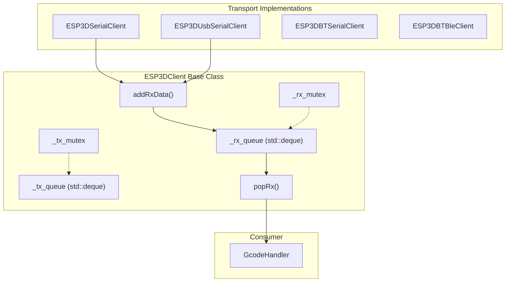
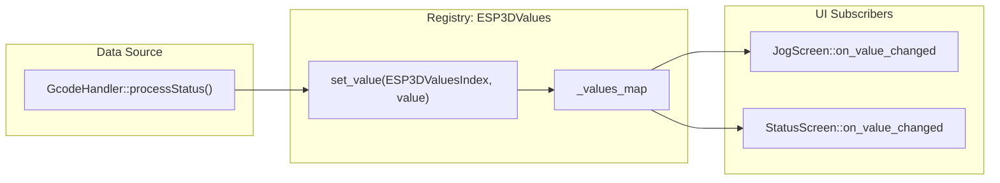

# Debugging and Testing
Relevant source files

- [boards/pibot_pendant_v1_0/components/bsp/board_init.h](https://github.com/luc-github/Pibot-cnc-pendant-firmware/blob/cbc90b5e/boards/pibot_pendant_v1_0/components/bsp/board_init.h)
- [boards/pibot_pendant_v1_0/components/bsp/control_event.h](https://github.com/luc-github/Pibot-cnc-pendant-firmware/blob/cbc90b5e/boards/pibot_pendant_v1_0/components/bsp/control_event.h)
- [cmake/dev_tools.cmake](https://github.com/luc-github/Pibot-cnc-pendant-firmware/blob/cbc90b5e/cmake/dev_tools.cmake)
- [components/esp3d_log/CMakeLists.txt](https://github.com/luc-github/Pibot-cnc-pendant-firmware/blob/cbc90b5e/components/esp3d_log/CMakeLists.txt)
- [components/esp3d_log/esp3d_log.c](https://github.com/luc-github/Pibot-cnc-pendant-firmware/blob/cbc90b5e/components/esp3d_log/esp3d_log.c)
- [components/esp3d_log/esp3d_log.h](https://github.com/luc-github/Pibot-cnc-pendant-firmware/blob/cbc90b5e/components/esp3d_log/esp3d_log.h)
- [components/esp3d_log/esp3d_log_backend.h](https://github.com/luc-github/Pibot-cnc-pendant-firmware/blob/cbc90b5e/components/esp3d_log/esp3d_log_backend.h)
- [components/esp3d_log/library.json](https://github.com/luc-github/Pibot-cnc-pendant-firmware/blob/cbc90b5e/components/esp3d_log/library.json)
- [docs/architecture/authentication_lifecycle.md](https://github.com/luc-github/Pibot-cnc-pendant-firmware/blob/cbc90b5e/docs/architecture/authentication_lifecycle.md?plain=1)
- [docs/features/features.md](https://github.com/luc-github/Pibot-cnc-pendant-firmware/blob/cbc90b5e/docs/features/features.md?plain=1)
- [docs/guides/esp3d_log_guide.md](https://github.com/luc-github/Pibot-cnc-pendant-firmware/blob/cbc90b5e/docs/guides/esp3d_log_guide.md?plain=1)
- [docs/roadmap/ws_client_and_auth_roadmap.md](https://github.com/luc-github/Pibot-cnc-pendant-firmware/blob/cbc90b5e/docs/roadmap/ws_client_and_auth_roadmap.md?plain=1)
- [main/display/components/panel_component.cpp](https://github.com/luc-github/Pibot-cnc-pendant-firmware/blob/cbc90b5e/main/display/components/panel_component.cpp)
- [main/display/components/panel_component.h](https://github.com/luc-github/Pibot-cnc-pendant-firmware/blob/cbc90b5e/main/display/components/panel_component.h)
- [main/modules/log/sd/esp3d_log_sd_backend.cpp](https://github.com/luc-github/Pibot-cnc-pendant-firmware/blob/cbc90b5e/main/modules/log/sd/esp3d_log_sd_backend.cpp)
- [main/modules/log/uart2/esp3d_log_uart2_backend.cpp](https://github.com/luc-github/Pibot-cnc-pendant-firmware/blob/cbc90b5e/main/modules/log/uart2/esp3d_log_uart2_backend.cpp)
- [main/modules/log/websocket/esp3d_log_websocket_backend.cpp](https://github.com/luc-github/Pibot-cnc-pendant-firmware/blob/cbc90b5e/main/modules/log/websocket/esp3d_log_websocket_backend.cpp)
- [sdkconfig](https://github.com/luc-github/Pibot-cnc-pendant-firmware/blob/cbc90b5e/sdkconfig)
- [tools/bt_client/fluidnc_ble.py](https://github.com/luc-github/Pibot-cnc-pendant-firmware/blob/cbc90b5e/tools/bt_client/fluidnc_ble.py)
- [tools/bt_client/fluidnc_bt.py](https://github.com/luc-github/Pibot-cnc-pendant-firmware/blob/cbc90b5e/tools/bt_client/fluidnc_bt.py)
- [tools/fonts/Conversions.txt](https://github.com/luc-github/Pibot-cnc-pendant-firmware/blob/cbc90b5e/tools/fonts/Conversions.txt)
- [tools/fw_simulator/fluidnc.py](https://github.com/luc-github/Pibot-cnc-pendant-firmware/blob/cbc90b5e/tools/fw_simulator/fluidnc.py)
- [tools/fw_simulator/fw_simulator.py](https://github.com/luc-github/Pibot-cnc-pendant-firmware/blob/cbc90b5e/tools/fw_simulator/fw_simulator.py)
- [tools/fw_simulator/grbl.py](https://github.com/luc-github/Pibot-cnc-pendant-firmware/blob/cbc90b5e/tools/fw_simulator/grbl.py)

## Purpose and Scope

This page provides practical guidance for debugging and testing the PiBot CNC Pendant firmware. It covers the centralized logging system, message queue inspection, value subscription validation, screen transition debugging, and communication protocol troubleshooting. These tools are essential for maintaining the stability of the LVGL-based UI and the real-time communication with FluidNC/grblHAL controllers.

---

## Logging System

The firmware uses a specialized logging component, `esp3d_log`, which supports multiline output, timestamps, and pluggable backends.

### Log Level Configuration

Log levels are defined in `esp3d_log.h` and configured globally via `cmake/dev_tools.cmake`.

| Level | Macro | Description |
| --- | --- | --- |
| 0 | N/A | Logging disabled |
| 1 | `esp3d_log_e` | Error messages only |
| 2 | `esp3d_log_w` | Warnings and errors |
| 3 | `esp3d_log_d` | Debug, warnings, and errors |
| 4 | `esp3d_log` | All messages (Verbose) |

Sources:[components/esp3d_log/esp3d_log.h#28-32](https://github.com/luc-github/Pibot-cnc-pendant-firmware/blob/cbc90b5e/components/esp3d_log/esp3d_log.h#L28-L32)[cmake/dev_tools.cmake#37-44](https://github.com/luc-github/Pibot-cnc-pendant-firmware/blob/cbc90b5e/cmake/dev_tools.cmake#L37-L44)

### Logging Implementation

The core output function `esp3d_log_output` handles multiline splitting and assembly into a final buffer. It prepends a header containing the filename, line number, and function name [components/esp3d_log/esp3d_log.c#200-201](https://github.com/luc-github/Pibot-cnc-pendant-firmware/blob/cbc90b5e/components/esp3d_log/esp3d_log.c#L200-L201) Access to internal static formatting buffers is protected by `s_log_mutex` to ensure thread-safety across UI and communication tasks [components/esp3d_log/esp3d_log.c#49-50](https://github.com/luc-github/Pibot-cnc-pendant-firmware/blob/cbc90b5e/components/esp3d_log/esp3d_log.c#L49-L50)

```
// Example usage in code
esp3d_log_d("Initializing %s at baud %d", client_name, baud);
esp3d_log_e("Failed to allocate message buffer");
```

The system includes a utility `esp3d_log_u64_to_str` (aliased as `U64_STR(x)`) because some standard library `printf` implementations on ESP32 lack `%llu` support [components/esp3d_log/esp3d_log.h#108-111](https://github.com/luc-github/Pibot-cnc-pendant-firmware/blob/cbc90b5e/components/esp3d_log/esp3d_log.h#L108-L111) It uses 4 rotating buffers to allow multiple calls within a single log line [components/esp3d_log/esp3d_log.c#100-102](https://github.com/luc-github/Pibot-cnc-pendant-firmware/blob/cbc90b5e/components/esp3d_log/esp3d_log.c#L100-L102)

Sources:[components/esp3d_log/esp3d_log.c#49-129](https://github.com/luc-github/Pibot-cnc-pendant-firmware/blob/cbc90b5e/components/esp3d_log/esp3d_log.c#L49-L129)[components/esp3d_log/esp3d_log.h#108-118](https://github.com/luc-github/Pibot-cnc-pendant-firmware/blob/cbc90b5e/components/esp3d_log/esp3d_log.h#L108-L118)

### Advanced Configuration and Backends

Developers can tune the logging behavior in `cmake/dev_tools.cmake`:

- `ESP3D_LOG_TIMESTAMP`: Prepends `[+SSSSs.MMM]` (seconds/ms since boot) to every line [cmake/dev_tools.cmake#56-57](https://github.com/luc-github/Pibot-cnc-pendant-firmware/blob/cbc90b5e/cmake/dev_tools.cmake#L56-L57)
- `DISABLE_COLOR_LOG`: Toggles ANSI color codes for serial terminals [cmake/dev_tools.cmake#50-51](https://github.com/luc-github/Pibot-cnc-pendant-firmware/blob/cbc90b5e/cmake/dev_tools.cmake#L50-L51)
- `ESP3D_LOG_BUFFER_SIZE`: Sets the maximum size of a formatted log line (default 512 bytes) [cmake/dev_tools.cmake#68-69](https://github.com/luc-github/Pibot-cnc-pendant-firmware/blob/cbc90b5e/cmake/dev_tools.cmake#L68-L69)
- `ESP3D_LOG_PREFIX`: Defaults to `;` so that log output sent over a shared CNC serial line is treated as a comment by the target firmware [components/esp3d_log/esp3d_log.h#50-52](https://github.com/luc-github/Pibot-cnc-pendant-firmware/blob/cbc90b5e/components/esp3d_log/esp3d_log.h#L50-L52)

The firmware supports five backends selected at compile-time via `ESP3D_LOG_BACKEND`[components/esp3d_log/esp3d_log.h#37-41](https://github.com/luc-github/Pibot-cnc-pendant-firmware/blob/cbc90b5e/components/esp3d_log/esp3d_log.h#L37-L41):

1. Serial (0): Standard UART output via `esp_log_write`[components/esp3d_log/CMakeLists.txt#25-26](https://github.com/luc-github/Pibot-cnc-pendant-firmware/blob/cbc90b5e/components/esp3d_log/CMakeLists.txt#L25-L26)
2. SD Card (1): Writes logs to the SD card [main/modules/log/sd/esp3d_log_sd_backend.cpp#1-10](https://github.com/luc-github/Pibot-cnc-pendant-firmware/blob/cbc90b5e/main/modules/log/sd/esp3d_log_sd_backend.cpp#L1-L10)
3. UART2 (2): Output to a secondary UART port [main/modules/log/uart2/esp3d_log_uart2_backend.cpp#1-10](https://github.com/luc-github/Pibot-cnc-pendant-firmware/blob/cbc90b5e/main/modules/log/uart2/esp3d_log_uart2_backend.cpp#L1-L10)
4. Telnet (3): Streams logs over a Telnet connection [main/modules/log/telnet/esp3d_log_telnet_backend.cpp#1-10](https://github.com/luc-github/Pibot-cnc-pendant-firmware/blob/cbc90b5e/main/modules/log/telnet/esp3d_log_telnet_backend.cpp#L1-L10)
5. WebSocket (4): Broadcasts logs to connected WebSocket clients [main/modules/log/websocket/esp3d_log_websocket_backend.cpp#1-10](https://github.com/luc-github/Pibot-cnc-pendant-firmware/blob/cbc90b5e/main/modules/log/websocket/esp3d_log_websocket_backend.cpp#L1-L10)

Sources:[cmake/dev_tools.cmake#59-69](https://github.com/luc-github/Pibot-cnc-pendant-firmware/blob/cbc90b5e/cmake/dev_tools.cmake#L59-L69)[components/esp3d_log/CMakeLists.txt#3-10](https://github.com/luc-github/Pibot-cnc-pendant-firmware/blob/cbc90b5e/components/esp3d_log/CMakeLists.txt#L3-L10)[docs/guides/esp3d_log_guide.md#101-110](https://github.com/luc-github/Pibot-cnc-pendant-firmware/blob/cbc90b5e/docs/guides/esp3d_log_guide.md?plain=1#L101-L110)

---

## Debugging Message Queues

### Queue Architecture Overview

The communication system relies on a dual-queue architecture (RX and TX) implemented in the `ESP3DClient` base class.

Title: Message Queue Code Entities



Sources:[main/core/esp3d_client.cpp#34-247](https://github.com/luc-github/Pibot-cnc-pendant-firmware/blob/cbc90b5e/main/core/esp3d_client.cpp#L34-L247)[docs/architecture/connection_management.md#52-58](https://github.com/luc-github/Pibot-cnc-pendant-firmware/blob/cbc90b5e/docs/architecture/connection_management.md?plain=1#L52-L58)

### Inspecting Queue State

To debug communication lag or "stuck" commands, developers can inspect the queue sizes and memory usage using `getRxMsgsCount()` and `getTxMsgsCount()`[main/core/esp3d_client.cpp#114-147](https://github.com/luc-github/Pibot-cnc-pendant-firmware/blob/cbc90b5e/main/core/esp3d_client.cpp#L114-L147)

---

## Debugging Value Subscriptions

The `esp3dTftValues` service is a pub/sub system for real-time CNC data (positions, overrides, status).

Title: Value Subscription Data Flow



### Common Debugging Patterns

1. Trace Subscriptions: Log every time a callback is triggered to ensure the parser is extracting data correctly.
2. Verify Unsubscription: Ensure `unsubscribe()` is called in `prepareForDestruction()`. Failure to do so causes crashes when the pub/sub system attempts to call a method on a deleted screen object [main/display/cnc/screens/jog_screen.cpp#1123-1161](https://github.com/luc-github/Pibot-cnc-pendant-firmware/blob/cbc90b5e/main/display/cnc/screens/jog_screen.cpp#L1123-L1161)

Sources:[main/display/cnc/screens/jog_screen.cpp#1123-1161](https://github.com/luc-github/Pibot-cnc-pendant-firmware/blob/cbc90b5e/main/display/cnc/screens/jog_screen.cpp#L1123-L1161)[docs/architecture/connection_management.md#52-58](https://github.com/luc-github/Pibot-cnc-pendant-firmware/blob/cbc90b5e/docs/architecture/connection_management.md?plain=1#L52-L58)

---

## UI Component Debugging: PanelComponent

The `PanelComponent` manages interactive elements with rotary encoder navigation. A common issue is "phantom navigation" where encoder pulses from a previous screen affect the new one. The constructor explicitly calls `VirtualButtonsComponent::resetEncoderSteps()` to prevent this [main/display/components/panel_component.cpp#41-45](https://github.com/luc-github/Pibot-cnc-pendant-firmware/blob/cbc90b5e/main/display/components/panel_component.cpp#L41-L45)

### Encoder Mode Debugging

`PanelComponent` operates in two modes: `PANEL_NAVIGATION_MODE` and `PANEL_EDITING_MODE`[main/display/components/panel_component.h#34-35](https://github.com/luc-github/Pibot-cnc-pendant-firmware/blob/cbc90b5e/main/display/components/panel_component.h#L34-L35) If an item is not responding to the encoder, check if `enableEncoderFor()` was called with the correct mode [main/display/components/panel_component.cpp#333-356](https://github.com/luc-github/Pibot-cnc-pendant-firmware/blob/cbc90b5e/main/display/components/panel_component.cpp#L333-L356)

Sources:[main/display/components/panel_component.cpp#29-62](https://github.com/luc-github/Pibot-cnc-pendant-firmware/blob/cbc90b5e/main/display/components/panel_component.cpp#L29-L62)[main/display/components/panel_component.h#34-53](https://github.com/luc-github/Pibot-cnc-pendant-firmware/blob/cbc90b5e/main/display/components/panel_component.h#L34-L53)

---

## Testing Tools

### Firmware Simulator

The `tools/fw_simulator/` directory contains Python scripts to simulate CNC controllers (Marlin, Grbl, FluidNC). This allows testing the pendant without physical CNC hardware [tools/fw_simulator/fw_simulator.py#1-11](https://github.com/luc-github/Pibot-cnc-pendant-firmware/blob/cbc90b5e/tools/fw_simulator/fw_simulator.py#L1-L11)

- `fw_simulator.py`: The main entry point. It detects serial ports and routes G-code to specific firmware logic [tools/fw_simulator/fw_simulator.py#12-32](https://github.com/luc-github/Pibot-cnc-pendant-firmware/blob/cbc90b5e/tools/fw_simulator/fw_simulator.py#L12-L32)
- `fluidnc.py`: Simulates FluidNC status reports and Jog commands.

Sources:[tools/fw_simulator/fw_simulator.py#1-75](https://github.com/luc-github/Pibot-cnc-pendant-firmware/blob/cbc90b5e/tools/fw_simulator/fw_simulator.py#L1-L75)

### Build System & Dev Tools

The `cmake/dev_tools.cmake` file provides several flags to aid development:

- `NO_CONNECTION_LOCK`: Set to `1` in dev builds to keep the UI interactive even when no CNC is connected [cmake/dev_tools.cmake#83-88](https://github.com/luc-github/Pibot-cnc-pendant-firmware/blob/cbc90b5e/cmake/dev_tools.cmake#L83-L88)
- `ESP3D_SNAPSHOT_FEATURE`: Enables the LVGL snapshot API to dump screens to the SD card [cmake/dev_tools.cmake#74-75](https://github.com/luc-github/Pibot-cnc-pendant-firmware/blob/cbc90b5e/cmake/dev_tools.cmake#L74-L75)
- `-Werror=unused-variable`: Enforced at compile-time to ensure code cleanliness [cmake/dev_tools.cmake#11](https://github.com/luc-github/Pibot-cnc-pendant-firmware/blob/cbc90b5e/cmake/dev_tools.cmake#L11-L11)

Sources:[cmake/dev_tools.cmake#1-90](https://github.com/luc-github/Pibot-cnc-pendant-firmware/blob/cbc90b5e/cmake/dev_tools.cmake#L1-L90)

---

## Troubleshooting Checklist

| Symptom | Potential Cause | Debug Step |
| --- | --- | --- |
| UI Freeze | Mutex Deadlock | Check `s_log_mutex` usage in `esp3d_log` output [components/esp3d_log/esp3d_log.c#49-50](https://github.com/luc-github/Pibot-cnc-pendant-firmware/blob/cbc90b5e/components/esp3d_log/esp3d_log.c#L49-L50) |
| Crash on Screen Change | Missing Unsubscribe | Verify `esp3dTftValues.unsubscribe` is called in `prepareForDestruction`. |
| Stale Position Data | Parser Failure | Use `fw_simulator.py` to send known status strings and check log output. |
| No Serial Comm | Baud Mismatch | Verify `ESP3D_LOG` for "Serial initialized" and check NVS settings. |
| Phantom Encoder Clicks | Buffer Not Cleared | Ensure `PanelComponent` constructor clears the encoder buffer [main/display/components/panel_component.cpp#41-45](https://github.com/luc-github/Pibot-cnc-pendant-firmware/blob/cbc90b5e/main/display/components/panel_component.cpp#L41-L45) |

Sources:[main/core/esp3d_client.cpp#42-80](https://github.com/luc-github/Pibot-cnc-pendant-firmware/blob/cbc90b5e/main/core/esp3d_client.cpp#L42-L80)[main/display/components/panel_component.cpp#41-45](https://github.com/luc-github/Pibot-cnc-pendant-firmware/blob/cbc90b5e/main/display/components/panel_component.cpp#L41-L45)[cmake/dev_tools.cmake#83-88](https://github.com/luc-github/Pibot-cnc-pendant-firmware/blob/cbc90b5e/cmake/dev_tools.cmake#L83-L88)[components/esp3d_log/esp3d_log.c#49-50](https://github.com/luc-github/Pibot-cnc-pendant-firmware/blob/cbc90b5e/components/esp3d_log/esp3d_log.c#L49-L50)