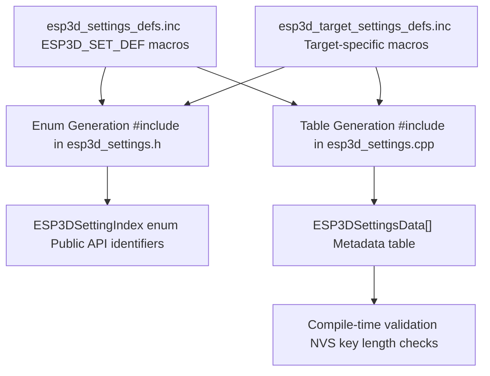
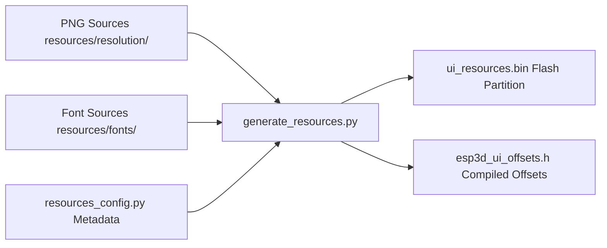

# Development Guide
Relevant source files

- [CMakeLists.txt](https://github.com/luc-github/Pibot-cnc-pendant-firmware/blob/cbc90b5e/CMakeLists.txt)
- [boards/ESP32_C3_BARE/build_scripts/common.py](https://github.com/luc-github/Pibot-cnc-pendant-firmware/blob/cbc90b5e/boards/ESP32_C3_BARE/build_scripts/common.py)
- [boards/ESP32_S3_WROOM_CAM/build_scripts/common.py](https://github.com/luc-github/Pibot-cnc-pendant-firmware/blob/cbc90b5e/boards/ESP32_S3_WROOM_CAM/build_scripts/common.py)
- [boards/fysetc_wifi_pro/build_scripts/common.py](https://github.com/luc-github/Pibot-cnc-pendant-firmware/blob/cbc90b5e/boards/fysetc_wifi_pro/build_scripts/common.py)
- [boards/pibot_pendant_v1_0/board_config.cmake](https://github.com/luc-github/Pibot-cnc-pendant-firmware/blob/cbc90b5e/boards/pibot_pendant_v1_0/board_config.cmake)
- [boards/pibot_pendant_v1_0/build_scripts/common.py](https://github.com/luc-github/Pibot-cnc-pendant-firmware/blob/cbc90b5e/boards/pibot_pendant_v1_0/build_scripts/common.py)
- [cmake/features.cmake](https://github.com/luc-github/Pibot-cnc-pendant-firmware/blob/cbc90b5e/cmake/features.cmake)
- [cmake/sanity_check.cmake](https://github.com/luc-github/Pibot-cnc-pendant-firmware/blob/cbc90b5e/cmake/sanity_check.cmake)
- [docs/guides/ui_resources_guide.md](https://github.com/luc-github/Pibot-cnc-pendant-firmware/blob/cbc90b5e/docs/guides/ui_resources_guide.md?plain=1)
- [docs/ui_resources/development.md](https://github.com/luc-github/Pibot-cnc-pendant-firmware/blob/cbc90b5e/docs/ui_resources/development.md?plain=1)
- [docs/ui_resources/roadmap.md](https://github.com/luc-github/Pibot-cnc-pendant-firmware/blob/cbc90b5e/docs/ui_resources/roadmap.md?plain=1)
- [docs/user documentation/ui_resources_customization.md](https://github.com/luc-github/Pibot-cnc-pendant-firmware/blob/cbc90b5e/docs/user documentation/ui_resources_customization.md?plain=1)
- [main/CMakeLists.txt](https://github.com/luc-github/Pibot-cnc-pendant-firmware/blob/cbc90b5e/main/CMakeLists.txt)
- [tools/build_scripts/build_mgr.py](https://github.com/luc-github/Pibot-cnc-pendant-firmware/blob/cbc90b5e/tools/build_scripts/build_mgr.py)
- [tools/build_scripts/package_user_resources_kit.py](https://github.com/luc-github/Pibot-cnc-pendant-firmware/blob/cbc90b5e/tools/build_scripts/package_user_resources_kit.py)
- [tools/flash_scripts/flash_mgr.py](https://github.com/luc-github/Pibot-cnc-pendant-firmware/blob/cbc90b5e/tools/flash_scripts/flash_mgr.py)
- [tools/fonts/font_c_to_fnt.py](https://github.com/luc-github/Pibot-cnc-pendant-firmware/blob/cbc90b5e/tools/fonts/font_c_to_fnt.py)
- [tools/fonts/requirements.txt](https://github.com/luc-github/Pibot-cnc-pendant-firmware/blob/cbc90b5e/tools/fonts/requirements.txt)
- [tools/fonts/ttf_to_fnt.py](https://github.com/luc-github/Pibot-cnc-pendant-firmware/blob/cbc90b5e/tools/fonts/ttf_to_fnt.py)
- [tools/images/image_c_to_bin.py](https://github.com/luc-github/Pibot-cnc-pendant-firmware/blob/cbc90b5e/tools/images/image_c_to_bin.py)

This document provides practical guidance for developers extending or modifying the PiBot CNC Pendant firmware. It covers common development tasks including adding settings, creating screens, extending G-code support, and working with the translation system.

Related Documentation:

- For system architecture overview, see [System Architecture](Board_Support_Packages.md)
- For settings management details, see [Settings Management](Communication_Transports.md)
- For UI system architecture, see [User Interface System](ui_components.md)
- For G-code handler details, see [G-code Handler Service](UI_Framework_and_Screens.md)

---

## Core Architecture Patterns

Before diving into specific development tasks, understanding these foundational patterns is essential for maintaining code quality and consistency.

### X-Macro Pattern for Settings

The firmware uses X-macros to define settings in a single location, generating both enum values and metadata tables at compile time. This ensures consistency between setting identifiers and their storage keys.

Title: Settings Generation Flow

Sources: [main/core/includes/esp3d_settings.h#97-108](https://github.com/luc-github/Pibot-cnc-pendant-firmware/blob/cbc90b5e/main/core/includes/esp3d_settings.h#L97-L108), [main/core/esp3d_settings.cpp#108-119](https://github.com/luc-github/Pibot-cnc-pendant-firmware/blob/cbc90b5e/main/core/esp3d_settings.cpp#L108-L119), [main/core/esp3d_settings.cpp#125-144](https://github.com/luc-github/Pibot-cnc-pendant-firmware/blob/cbc90b5e/main/core/esp3d_settings.cpp#L125-L144)

### UI Resource Management

Icons and fonts are not compiled into the firmware but reside in a dedicated `ui_resources` flash partition. This allows for customization without full firmware reflashing.

Title: UI Resource Build Flow

Sources: [docs/guides/ui_resources_guide.md#46-56](https://github.com/luc-github/Pibot-cnc-pendant-firmware/blob/cbc90b5e/docs/guides/ui_resources_guide.md?plain=1#L46-L56), [docs/ui_resources/development.md#13-28](https://github.com/luc-github/Pibot-cnc-pendant-firmware/blob/cbc90b5e/docs/ui_resources/development.md?plain=1#L13-L28), [tools/build_scripts/generate_resources.py#156-159](https://github.com/luc-github/Pibot-cnc-pendant-firmware/blob/cbc90b5e/tools/build_scripts/generate_resources.py#L156-L159)

### Component Lifecycle Pattern

All UI components follow a strict two-phase destruction pattern to prevent race conditions from late-arriving hardware events or callbacks.

Title: UI Component Lifecycle

Sources: [main/display/cnc/fluidnc/screens/files_screen.cpp#104-107](https://github.com/luc-github/Pibot-cnc-pendant-firmware/blob/cbc90b5e/main/display/cnc/fluidnc/screens/files_screen.cpp#L104-L107), [main/display/cnc/fluidnc/screens/files_screen.cpp#139-145](https://github.com/luc-github/Pibot-cnc-pendant-firmware/blob/cbc90b5e/main/display/cnc/fluidnc/screens/files_screen.cpp#L139-L145)

---

## Build System and Feature Flags

The firmware uses a CMake-based build system integrated with the ESP-IDF. Feature selection is handled via `OPTION()` flags in the root `CMakeLists.txt`, which are then translated into C++ preprocessor defines in `cmake/features.cmake`.

- Firmware Targets: Only one firmware target (e.g., `TARGET_FW_FLUIDNC`) can be active at a time [cmake/sanity_check.cmake#43](https://github.com/luc-github/Pibot-cnc-pendant-firmware/blob/cbc90b5e/cmake/sanity_check.cmake#L43-L43).
- Hardware Features: Flags like `HARDWARE_ENCODER` or `HARDWARE_BUTTONS` control the inclusion of specific input drivers [boards/pibot_pendant_v1_0/board_config.cmake#92-95](https://github.com/luc-github/Pibot-cnc-pendant-firmware/blob/cbc90b5e/boards/pibot_pendant_v1_0/board_config.cmake#L92-L95).
- Resource Constraints: WiFi and Bluetooth are mutually exclusive on ESP32 boards without PSRAM to avoid memory contention [cmake/sanity_check.cmake#71-77](https://github.com/luc-github/Pibot-cnc-pendant-firmware/blob/cbc90b5e/cmake/sanity_check.cmake#L71-L77).
- Logging Backends: The `ESP3D_LOG_BACKEND` flag (0=Serial, 1=SD, 2=UART2, 3=Telnet, 4=WebSocket) determines which output module is linked [main/CMakeLists.txt#25-33](https://github.com/luc-github/Pibot-cnc-pendant-firmware/blob/cbc90b5e/main/CMakeLists.txt#L25-L33).

For details, see [Build System and Feature Flags](guide_build_system.md).

Sources: [CMakeLists.txt#6-55](https://github.com/luc-github/Pibot-cnc-pendant-firmware/blob/cbc90b5e/CMakeLists.txt#L6-L55), [cmake/features.cmake#6-64](https://github.com/luc-github/Pibot-cnc-pendant-firmware/blob/cbc90b5e/cmake/features.cmake#L6-L64), [cmake/sanity_check.cmake#68-77](https://github.com/luc-github/Pibot-cnc-pendant-firmware/blob/cbc90b5e/cmake/sanity_check.cmake#L68-L77), [main/CMakeLists.txt#25-33](https://github.com/luc-github/Pibot-cnc-pendant-firmware/blob/cbc90b5e/main/CMakeLists.txt#L25-L33)

---

## Adding New Screens

Screens are the primary UI containers. Adding a new screen involves extending the `GenericScreen` class and registering the new type in the `UIManager`.

1. Enum Definition: Add a new value to `ESP3DScreenType`[main/display/cnc/fluidnc/screens/esp3d_screen_type.h#26-61](https://github.com/luc-github/Pibot-cnc-pendant-firmware/blob/cbc90b5e/main/display/cnc/fluidnc/screens/esp3d_screen_type.h#L26-L61).
2. Implementation: Create a new class/namespace inheriting from `GenericScreen` patterns.
3. Registration: Update the centralized `createScreen()` function to instantiate your class [main/display/cnc/fluidnc/screens/esp3d_screen_type.cpp#122-232](https://github.com/luc-github/Pibot-cnc-pendant-firmware/blob/cbc90b5e/main/display/cnc/fluidnc/screens/esp3d_screen_type.cpp#L122-L232).

For details, see [Adding New Screens](guide_adding_screens.md).

Sources: [main/display/cnc/fluidnc/screens/esp3d_screen_type.h#26-61](https://github.com/luc-github/Pibot-cnc-pendant-firmware/blob/cbc90b5e/main/display/cnc/fluidnc/screens/esp3d_screen_type.h#L26-L61), [main/display/cnc/fluidnc/screens/esp3d_screen_type.cpp#122-232](https://github.com/luc-github/Pibot-cnc-pendant-firmware/blob/cbc90b5e/main/display/cnc/fluidnc/screens/esp3d_screen_type.cpp#L122-L232)

---

## Adding New Settings

Settings are persistent configuration values stored in NVS. The system uses an X-macro pattern defined in `.inc` files to manage metadata, validation, and defaults.

- Definition: Modify `esp3d_settings_defs.inc` or `esp3d_target_settings_defs.inc`.
- Validation: Implement custom logic in `isValidIntegerSetting()` or similar functions in `esp3d_settings.cpp`.
- Access: Use `esp3dTftsettings.readUint32()` or `esp3dTftsettings.readString()`.

For details, see [Adding New Settings](guide_adding_settings.md).

Sources: [main/core/includes/esp3d_settings.h#97-108](https://github.com/luc-github/Pibot-cnc-pendant-firmware/blob/cbc90b5e/main/core/includes/esp3d_settings.h#L97-L108), [main/core/esp3d_settings.cpp#699-737](https://github.com/luc-github/Pibot-cnc-pendant-firmware/blob/cbc90b5e/main/core/esp3d_settings.cpp#L699-L737)

---

## Adding Real-time Values

The `esp3dTftValues` service manages real-time system state (e.g., positions, status).

- Index: Add a new index to `ESP3DValuesIndex`.
- Propagation: Update the G-code status parser to extract and set the value.
- Subscription: Screens can subscribe to updates using `add_callback()`[main/display/cnc/fluidnc/screens/files_screen.cpp#149-150](https://github.com/luc-github/Pibot-cnc-pendant-firmware/blob/cbc90b5e/main/display/cnc/fluidnc/screens/files_screen.cpp#L149-L150).

For details, see [Adding Real-time Values](guide_adding_realtime_values.md).

Sources: [main/display/cnc/fluidnc/screens/files_screen.cpp#149-150](https://github.com/luc-github/Pibot-cnc-pendant-firmware/blob/cbc90b5e/main/display/cnc/fluidnc/screens/files_screen.cpp#L149-L150), [main/display/cnc/fluidnc/screens/files_screen.cpp#170-171](https://github.com/luc-github/Pibot-cnc-pendant-firmware/blob/cbc90b5e/main/display/cnc/fluidnc/screens/files_screen.cpp#L170-L171)

---

## Extending G-code Support

G-code handling is centralized in the `ESP3DGcodeHandlerService`.

- Commands: Extend `sendGcode()` to support new custom commands.
- Parsing: Modify parsing logic to handle new fields in the controller's status report (e.g., `MPos`, `WCO`, or custom firmware fields).

For details, see [Extending G-code Support](guide_extending_gcode.md).

Sources: [main/display/cnc/fluidnc/screens/files_screen.cpp#159-160](https://github.com/luc-github/Pibot-cnc-pendant-firmware/blob/cbc90b5e/main/display/cnc/fluidnc/screens/files_screen.cpp#L159-L160)

---

## Working with Translations

The translation system uses X-macros to compile translations directly into the firmware, avoiding external file dependencies for core UI strings.

- Labels: Add new `ESP3D_TR_DEF` entries in `esp3d_translations_defs.inc`[main/display/esp3d_translations_list.h#36-47](https://github.com/luc-github/Pibot-cnc-pendant-firmware/blob/cbc90b5e/main/display/esp3d_translations_list.h#L36-L47).
- English Fallback: Update the English table in `esp3d_translations_init.cpp`[main/display/esp3d_translations_init.cpp#31-37](https://github.com/luc-github/Pibot-cnc-pendant-firmware/blob/cbc90b5e/main/display/esp3d_translations_init.cpp#L31-L37).
- Usage: Retrieve strings using `esp3dTranslationService.translate(ESP3DLabel::my_label)`.

For details, see [Working with Translations](guide_translations.md).

Sources: [main/display/esp3d_translations_init.cpp#31-37](https://github.com/luc-github/Pibot-cnc-pendant-firmware/blob/cbc90b5e/main/display/esp3d_translations_init.cpp#L31-L37), [main/display/esp3d_translations_list.h#36-47](https://github.com/luc-github/Pibot-cnc-pendant-firmware/blob/cbc90b5e/main/display/esp3d_translations_list.h#L36-L47), [tools/language_packs/template.lng#11-122](https://github.com/luc-github/Pibot-cnc-pendant-firmware/blob/cbc90b5e/tools/language_packs/template.lng#L11-L122)

---

## Creating Custom UI Components

Reusable components should inherit standard lifecycle patterns to ensure stability.

- Lifecycle: Implement `prepareForDestruction()` to clean up LVGL objects and timers [main/display/cnc/fluidnc/screens/files_screen.cpp#139-145](https://github.com/luc-github/Pibot-cnc-pendant-firmware/blob/cbc90b5e/main/display/cnc/fluidnc/screens/files_screen.cpp#L139-L145).
- Registration: Use `ComponentType` to identify the component [main/display/cnc/fluidnc/screens/esp3d_screen_type.h#64-76](https://github.com/luc-github/Pibot-cnc-pendant-firmware/blob/cbc90b5e/main/display/cnc/fluidnc/screens/esp3d_screen_type.h#L64-L76).

For details, see [Creating Custom UI Components](guide_custom_ui_components.md).

Sources: [main/display/cnc/fluidnc/screens/files_screen.cpp#139-145](https://github.com/luc-github/Pibot-cnc-pendant-firmware/blob/cbc90b5e/main/display/cnc/fluidnc/screens/files_screen.cpp#L139-L145), [main/display/cnc/fluidnc/screens/esp3d_screen_type.h#64-76](https://github.com/luc-github/Pibot-cnc-pendant-firmware/blob/cbc90b5e/main/display/cnc/fluidnc/screens/esp3d_screen_type.h#L64-L76)

---

## Debugging and Testing

The firmware includes several tools for development:

- Logging: Use `esp3d_log()` for debug-only messages [main/display/cnc/fluidnc/screens/files_screen.cpp#187](https://github.com/luc-github/Pibot-cnc-pendant-firmware/blob/cbc90b5e/main/display/cnc/fluidnc/screens/files_screen.cpp#L187-L187).
- Feature Flags: Toggle features in `CMakeLists.txt` to isolate components [CMakeLists.txt#62-79](https://github.com/luc-github/Pibot-cnc-pendant-firmware/blob/cbc90b5e/CMakeLists.txt#L62-L79).
- Safety Checks: The `cmake/sanity_check.cmake` script prevents invalid hardware/software combinations at build time [cmake/sanity_check.cmake#71-77](https://github.com/luc-github/Pibot-cnc-pendant-firmware/blob/cbc90b5e/cmake/sanity_check.cmake#L71-L77).

For details, see [Debugging and Testing](guide_debugging.md).

Sources: [main/display/cnc/fluidnc/screens/files_screen.cpp#187](https://github.com/luc-github/Pibot-cnc-pendant-firmware/blob/cbc90b5e/main/display/cnc/fluidnc/screens/files_screen.cpp#L187-L187), [CMakeLists.txt#62-79](https://github.com/luc-github/Pibot-cnc-pendant-firmware/blob/cbc90b5e/CMakeLists.txt#L62-L79), [cmake/sanity_check.cmake#71-77](https://github.com/luc-github/Pibot-cnc-pendant-firmware/blob/cbc90b5e/cmake/sanity_check.cmake#L71-L77)

## Documents de conception (depot)

- [lua_interpreter](https://github.com/luc-github/Pibot-cnc-pendant-firmware/blob/main/docs/architecture/lua_interpreter.md)
- [lua_scripting](https://github.com/luc-github/Pibot-cnc-pendant-firmware/blob/main/docs/user%20documentation/lua_scripting.md)
