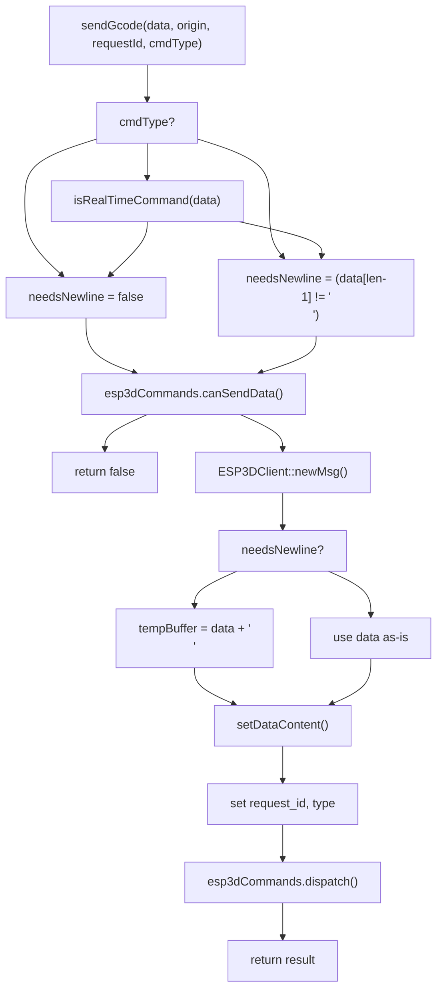
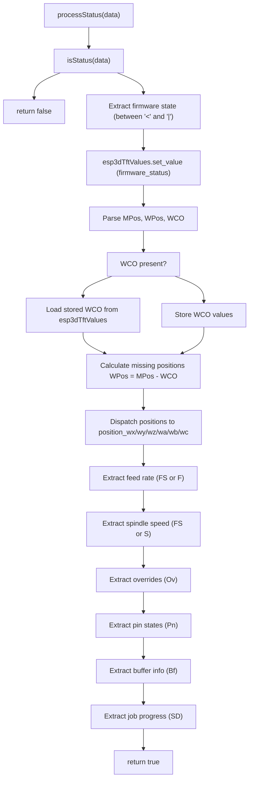
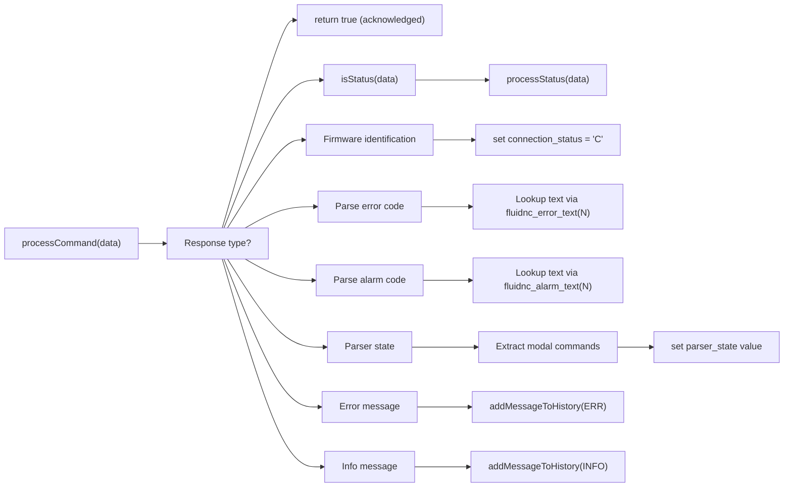
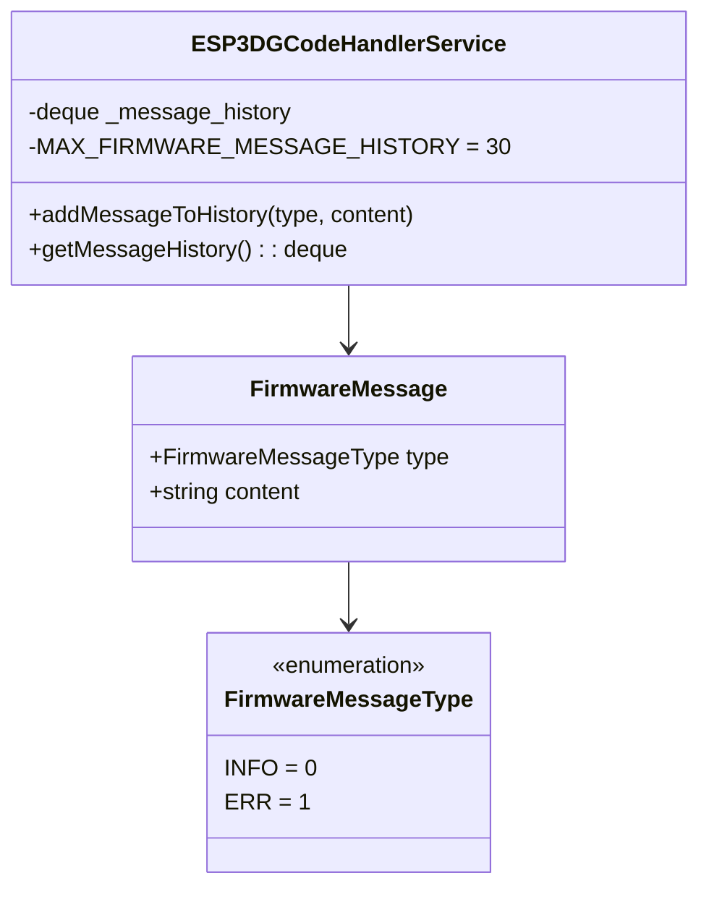

# Extending G-code Support
Relevant source files

- [docs/ux_flows/grblhal/grblHAL_pendant_connection_flow.md](https://github.com/luc-github/Pibot-cnc-pendant-firmware/blob/cbc90b5e/docs/ux_flows/grblhal/grblHAL_pendant_connection_flow.md?plain=1)
- [docs/ux_flows/grblhal/jog_screen.md](https://github.com/luc-github/Pibot-cnc-pendant-firmware/blob/cbc90b5e/docs/ux_flows/grblhal/jog_screen.md?plain=1)
- [docs/ux_flows/grblhal/macros_screen.md](https://github.com/luc-github/Pibot-cnc-pendant-firmware/blob/cbc90b5e/docs/ux_flows/grblhal/macros_screen.md?plain=1)
- [docs/ux_flows/grblhal/probe_screen.md](https://github.com/luc-github/Pibot-cnc-pendant-firmware/blob/cbc90b5e/docs/ux_flows/grblhal/probe_screen.md?plain=1)
- [docs/ux_flows/grblhal/status_screen.md](https://github.com/luc-github/Pibot-cnc-pendant-firmware/blob/cbc90b5e/docs/ux_flows/grblhal/status_screen.md?plain=1)
- [main/display/cnc/screens/firmware_status_screen.cpp](https://github.com/luc-github/Pibot-cnc-pendant-firmware/blob/cbc90b5e/main/display/cnc/screens/firmware_status_screen.cpp)
- [main/display/screens/update_screen.cpp](https://github.com/luc-github/Pibot-cnc-pendant-firmware/blob/cbc90b5e/main/display/screens/update_screen.cpp)
- [main/target/cnc/fluidnc/esp3d_gcode_handler_service.h](https://github.com/luc-github/Pibot-cnc-pendant-firmware/blob/cbc90b5e/main/target/cnc/fluidnc/esp3d_gcode_handler_service.h)
- [main/target/cnc/grblhal/esp3d_gcode_handler_service.h](https://github.com/luc-github/Pibot-cnc-pendant-firmware/blob/cbc90b5e/main/target/cnc/grblhal/esp3d_gcode_handler_service.h)

Purpose: This document guides developers through extending the G-code handler service to support new firmware commands, parse additional status information, and integrate custom functionality with FluidNC/grblHAL firmware. It covers command classification, status parsing, response processing, and integration with the real-time values system.

For information about the overall G-code handler architecture and value subscription system, see [G-code Handler Service](UI_Framework_and_Screens.md) and [Real-time Value System](ui_core.md). For adding new real-time values to the system, see [Adding Real-time Values](guide_adding_realtime_values.md).

---

## Command Classification System

The G-code handler classifies commands into several categories to determine proper handling, acknowledgment requirements, and transmission protocols.

### Command Type Enumeration

The system defines command types in [main/target/cnc/fluidnc/esp3d_gcode_handler_service.h#82-86](https://github.com/luc-github/Pibot-cnc-pendant-firmware/blob/cbc90b5e/main/target/cnc/fluidnc/esp3d_gcode_handler_service.h#L82-L86):

```
enum class ESP3DCommandType : int8_t {
    unknown = -1,
    normal = 0,
    realtime = 1
};
```

### Classification Arrays

Commands are classified using static arrays in the implementation. For example, `screenCommands` identifies UI display commands like `M117` which are forwarded to the status bar.

Sources: [main/target/cnc/fluidnc/esp3d_gcode_handler_service.h#82-86](https://github.com/luc-github/Pibot-cnc-pendant-firmware/blob/cbc90b5e/main/target/cnc/fluidnc/esp3d_gcode_handler_service.h#L82-L86)[main/target/cnc/fluidnc/esp3d_gcode_handler_service.h#157](https://github.com/luc-github/Pibot-cnc-pendant-firmware/blob/cbc90b5e/main/target/cnc/fluidnc/esp3d_gcode_handler_service.h#L157-L157)

---

## Sending G-code Commands

### The sendGcode() Interface

The primary method for sending G-code is `ESP3DGCodeHandlerService::sendGcode()` defined at [main/target/cnc/fluidnc/esp3d_gcode_handler_service.h#134-138](https://github.com/luc-github/Pibot-cnc-pendant-firmware/blob/cbc90b5e/main/target/cnc/fluidnc/esp3d_gcode_handler_service.h#L134-L138)

```
bool sendGcode(const char* data, 
               ESP3DClientType origin = ESP3DClientType::system,
               ESP3DRequest requestId = {.id = 0},
               ESP3DCommandType cmdType = ESP3DCommandType::unknown,
               ESP3DMessagePriority priority = ESP3DMessagePriority::normal);
```

### Command Flow Diagram

This diagram shows how `ESP3DGCodeHandlerService` interacts with the `ESP3DCommands` and `ESP3DClient` entities to dispatch G-code.

Title: "G-code Dispatch Flow"



### Real-time vs Normal Command Handling

The system supports standard GRBL real-time commands defined as macros in [main/target/cnc/fluidnc/esp3d_gcode_handler_service.h#42-79](https://github.com/luc-github/Pibot-cnc-pendant-firmware/blob/cbc90b5e/main/target/cnc/fluidnc/esp3d_gcode_handler_service.h#L42-L79):

- Core commands: `GRBL_RT_STATUS_REPORT` (`?`), `GRBL_RT_FEED_HOLD` (`!`), `GRBL_RT_SOFT_RESET` (`0x18`) [main/target/cnc/fluidnc/esp3d_gcode_handler_service.h#46-49](https://github.com/luc-github/Pibot-cnc-pendant-firmware/blob/cbc90b5e/main/target/cnc/fluidnc/esp3d_gcode_handler_service.h#L46-L49)
- Overrides: Feed (`0x90`-`0x94`), Rapid (`0x95`-`0x97`), and Spindle (`0x99`-`0x9E`) [main/target/cnc/fluidnc/esp3d_gcode_handler_service.h#57-74](https://github.com/luc-github/Pibot-cnc-pendant-firmware/blob/cbc90b5e/main/target/cnc/fluidnc/esp3d_gcode_handler_service.h#L57-L74)

Sources: [main/target/cnc/fluidnc/esp3d_gcode_handler_service.h#42-86](https://github.com/luc-github/Pibot-cnc-pendant-firmware/blob/cbc90b5e/main/target/cnc/fluidnc/esp3d_gcode_handler_service.h#L42-L86)[main/target/cnc/fluidnc/esp3d_gcode_handler_service.h#134-138](https://github.com/luc-github/Pibot-cnc-pendant-firmware/blob/cbc90b5e/main/target/cnc/fluidnc/esp3d_gcode_handler_service.h#L134-L138)

---

## Extending Status Parsing

### Status Message Format

FluidNC and grblHAL status reports follow the pattern `<State|Field1:Value1|Field2:Value2|...>`. The parser extracts fields and dispatches them to the values system.

### Status Processing Architecture

Title: "Firmware Status Parsing Architecture"



### grblHAL Specific Extensions

For grblHAL, the handler implements an MPG state machine to manage control tokens [main/target/cnc/grblhal/esp3d_gcode_handler_service.h#104-109](https://github.com/luc-github/Pibot-cnc-pendant-firmware/blob/cbc90b5e/main/target/cnc/grblhal/esp3d_gcode_handler_service.h#L104-L109):

- `DISCONNECTED`: No transport connection.
- `UNKNOWN`: Transport connected, MPG state not yet determined.
- `PASSIVE`: Connected, read-only (token held by another sender).
- `ACTIVE`: Connected, full control (token held by this pendant).

It uses specific realtime commands like `GRBLHAL_RT_MPG_MODE_TOGGLE` (`0x8B`) to acquire the token [main/target/cnc/grblhal/esp3d_gcode_handler_service.h#86](https://github.com/luc-github/Pibot-cnc-pendant-firmware/blob/cbc90b5e/main/target/cnc/grblhal/esp3d_gcode_handler_service.h#L86-L86)

Sources: [main/target/cnc/fluidnc/esp3d_gcode_handler_service.h#149](https://github.com/luc-github/Pibot-cnc-pendant-firmware/blob/cbc90b5e/main/target/cnc/fluidnc/esp3d_gcode_handler_service.h#L149-L149)[main/target/cnc/grblhal/esp3d_gcode_handler_service.h#104-109](https://github.com/luc-github/Pibot-cnc-pendant-firmware/blob/cbc90b5e/main/target/cnc/grblhal/esp3d_gcode_handler_service.h#L104-L109)

---

## Processing New Response Types

### Command Processing Flow

The main dispatcher `processCommand()` routes incoming firmware responses based on prefixes [main/target/cnc/fluidnc/esp3d_gcode_handler_service.h#149](https://github.com/luc-github/Pibot-cnc-pendant-firmware/blob/cbc90b5e/main/target/cnc/fluidnc/esp3d_gcode_handler_service.h#L149-L149):

Title: "Response Dispatcher Flow"



Sources: [main/target/cnc/fluidnc/esp3d_gcode_handler_service.h#149](https://github.com/luc-github/Pibot-cnc-pendant-firmware/blob/cbc90b5e/main/target/cnc/fluidnc/esp3d_gcode_handler_service.h#L149-L149)

---

## Message History System

### Architecture

The message history system provides a ring buffer for firmware messages (`MSG:ERR` and `MSG:INFO`) at [main/target/cnc/fluidnc/esp3d_gcode_handler_service.h#102-114](https://github.com/luc-github/Pibot-cnc-pendant-firmware/blob/cbc90b5e/main/target/cnc/fluidnc/esp3d_gcode_handler_service.h#L102-L114):

Title: "Message History Structure"



### Consuming Message History

The `FirmwareStatusScreen` subscribes to message history updates to refresh the UI message list [main/display/cnc/screens/firmware_status_screen.cpp#77](https://github.com/luc-github/Pibot-cnc-pendant-firmware/blob/cbc90b5e/main/display/cnc/screens/firmware_status_screen.cpp#L77-L77) It uses `refreshMessageList()` to pull data from the `esp3dGcodeHandler` history buffer [main/display/cnc/screens/firmware_status_screen.cpp#80](https://github.com/luc-github/Pibot-cnc-pendant-firmware/blob/cbc90b5e/main/display/cnc/screens/firmware_status_screen.cpp#L80-L80)

Sources: [main/target/cnc/fluidnc/esp3d_gcode_handler_service.h#102-114](https://github.com/luc-github/Pibot-cnc-pendant-firmware/blob/cbc90b5e/main/target/cnc/fluidnc/esp3d_gcode_handler_service.h#L102-L114)[main/display/cnc/screens/firmware_status_screen.cpp#77-80](https://github.com/luc-github/Pibot-cnc-pendant-firmware/blob/cbc90b5e/main/display/cnc/screens/firmware_status_screen.cpp#L77-L80)

---

## Practical Examples

### Example: Tool Change State Machine

The tool change screen demonstrates complex G-code integration with state tracking:

1. IDLE: Waiting for user input.
2. MOVING_TO_CHANGE: Command `M6T<num>` sent.
3. WAITING_USER: Firmware in `HOLD` state.
4. PROBING: User resumed; machine performing ETS probe.
5. SUCCESS/FAILED: Operation terminal states.

### Example: Extracting Parser State Values

Utility functions in the handler allow extracting specific modal values from the `$G` parser state response. For example, `parseMCodes` extracts spindle/coolant states [main/target/cnc/fluidnc/esp3d_gcode_handler_service.h#88-95](https://github.com/luc-github/Pibot-cnc-pendant-firmware/blob/cbc90b5e/main/target/cnc/fluidnc/esp3d_gcode_handler_service.h#L88-L95)

Sources: [main/target/cnc/fluidnc/esp3d_gcode_handler_service.h#88-95](https://github.com/luc-github/Pibot-cnc-pendant-firmware/blob/cbc90b5e/main/target/cnc/fluidnc/esp3d_gcode_handler_service.h#L88-L95)

---

## Summary Checklist

When extending G-code support:

- Classify command type: Determine if the command is `realtime` (immediate, no newline) or `normal`[main/target/cnc/fluidnc/esp3d_gcode_handler_service.h#82-86](https://github.com/luc-github/Pibot-cnc-pendant-firmware/blob/cbc90b5e/main/target/cnc/fluidnc/esp3d_gcode_handler_service.h#L82-L86)
- Extend status parsing: Update `processStatus` to handle new fields in the `<...>` status report [main/target/cnc/fluidnc/esp3d_gcode_handler_service.h#149](https://github.com/luc-github/Pibot-cnc-pendant-firmware/blob/cbc90b5e/main/target/cnc/fluidnc/esp3d_gcode_handler_service.h#L149-L149)
- Dispatch to Values: Use `esp3dTftValues.set_value()` to propagate parsed data to the UI.
- Handle startup: Add initialization commands to `sendStartupCommands()` if the new feature requires machine configuration [main/target/cnc/fluidnc/esp3d_gcode_handler_service.h#163](https://github.com/luc-github/Pibot-cnc-pendant-firmware/blob/cbc90b5e/main/target/cnc/fluidnc/esp3d_gcode_handler_service.h#L163-L163)

Sources: [main/target/cnc/fluidnc/esp3d_gcode_handler_service.h#82-163](https://github.com/luc-github/Pibot-cnc-pendant-firmware/blob/cbc90b5e/main/target/cnc/fluidnc/esp3d_gcode_handler_service.h#L82-L163)