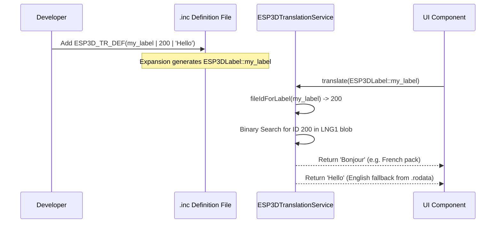

# Working with Translations
Relevant source files

- [docs/architecture/gcode_host_streaming_flow.md](https://github.com/luc-github/Pibot-cnc-pendant-firmware/blob/cbc90b5e/docs/architecture/gcode_host_streaming_flow.md?plain=1)
- [docs/roadmap/grbl_no_sd_preparation.md](https://github.com/luc-github/Pibot-cnc-pendant-firmware/blob/cbc90b5e/docs/roadmap/grbl_no_sd_preparation.md?plain=1)
- [docs/ux_flows/grblhal/change_tool_screen.md](https://github.com/luc-github/Pibot-cnc-pendant-firmware/blob/cbc90b5e/docs/ux_flows/grblhal/change_tool_screen.md?plain=1)
- [docs/ux_flows/grblhal/files_screen.md](https://github.com/luc-github/Pibot-cnc-pendant-firmware/blob/cbc90b5e/docs/ux_flows/grblhal/files_screen.md?plain=1)
- [docs/ux_flows/grblhal/settings_list_screen.md](https://github.com/luc-github/Pibot-cnc-pendant-firmware/blob/cbc90b5e/docs/ux_flows/grblhal/settings_list_screen.md?plain=1)
- [main/core/commands/esp460.cpp](https://github.com/luc-github/Pibot-cnc-pendant-firmware/blob/cbc90b5e/main/core/commands/esp460.cpp)
- [main/core/esp3d_hal.cpp](https://github.com/luc-github/Pibot-cnc-pendant-firmware/blob/cbc90b5e/main/core/esp3d_hal.cpp)
- [main/core/includes/esp3d_hal.h](https://github.com/luc-github/Pibot-cnc-pendant-firmware/blob/cbc90b5e/main/core/includes/esp3d_hal.h)
- [main/display/cnc/fluidnc/screens/change_tool_screen.h](https://github.com/luc-github/Pibot-cnc-pendant-firmware/blob/cbc90b5e/main/display/cnc/fluidnc/screens/change_tool_screen.h)
- [main/display/cnc/fluidnc/screens/esp3d_screen_type.cpp](https://github.com/luc-github/Pibot-cnc-pendant-firmware/blob/cbc90b5e/main/display/cnc/fluidnc/screens/esp3d_screen_type.cpp)
- [main/display/cnc/fluidnc/screens/esp3d_screen_type.h](https://github.com/luc-github/Pibot-cnc-pendant-firmware/blob/cbc90b5e/main/display/cnc/fluidnc/screens/esp3d_screen_type.h)
- [main/display/cnc/fluidnc/screens/files_screen.cpp](https://github.com/luc-github/Pibot-cnc-pendant-firmware/blob/cbc90b5e/main/display/cnc/fluidnc/screens/files_screen.cpp)
- [main/display/cnc/grblhal/screens/esp3d_screen_type.cpp](https://github.com/luc-github/Pibot-cnc-pendant-firmware/blob/cbc90b5e/main/display/cnc/grblhal/screens/esp3d_screen_type.cpp)
- [main/display/esp3d_translations_init.cpp](https://github.com/luc-github/Pibot-cnc-pendant-firmware/blob/cbc90b5e/main/display/esp3d_translations_init.cpp)
- [main/display/esp3d_translations_list.h](https://github.com/luc-github/Pibot-cnc-pendant-firmware/blob/cbc90b5e/main/display/esp3d_translations_list.h)
- [main/modules/translations/esp3d_translation_service.cpp](https://github.com/luc-github/Pibot-cnc-pendant-firmware/blob/cbc90b5e/main/modules/translations/esp3d_translation_service.cpp)
- [main/modules/translations/esp3d_translation_service.h](https://github.com/luc-github/Pibot-cnc-pendant-firmware/blob/cbc90b5e/main/modules/translations/esp3d_translation_service.h)
- [tools/language_packs/template.lng](https://github.com/luc-github/Pibot-cnc-pendant-firmware/blob/cbc90b5e/tools/language_packs/template.lng)
- [tools/language_packs/ui_fr-fr.lng](https://github.com/luc-github/Pibot-cnc-pendant-firmware/blob/cbc90b5e/tools/language_packs/ui_fr-fr.lng)

## Purpose and Scope

This page explains the internationalization (i18n) system used throughout the PiBot CNC Pendant firmware. It details how to add new translatable strings using the X-macro pattern, the structure of language files, the architecture of the `ESP3DTranslationService`, and the process for runtime language switching.

The system is designed for high memory efficiency, using memory-mapped `LNG1` blobs for active translations and a flash-resident English fallback table, ensuring zero DRAM usage for string storage.

---

## Translation System Architecture

The translation system uses a triple-expansion X-macro pattern. A single definition of a translation string is used to generate the `ESP3DLabel` enumeration, a lookup map for file-based IDs, and the default English string values stored in flash `.rodata`.

### Translation Data Flow

Sources:[main/display/esp3d_translations_list.h#36-47](https://github.com/luc-github/Pibot-cnc-pendant-firmware/blob/cbc90b5e/main/display/esp3d_translations_list.h#L36-L47)[main/display/esp3d_translations_init.cpp#26-37](https://github.com/luc-github/Pibot-cnc-pendant-firmware/blob/cbc90b5e/main/display/esp3d_translations_init.cpp#L26-L37)[main/modules/translations/esp3d_translation_service.cpp#132-139](https://github.com/luc-github/Pibot-cnc-pendant-firmware/blob/cbc90b5e/main/modules/translations/esp3d_translation_service.cpp#L132-L139)

---

## Implementation Details

### The X-Macro Pattern

The system relies on the `ESP3D_TR_DEF(label, id, text)` macro. It is expanded in different contexts:

1. Enum Generation: In `esp3d_translations_list.h`, it creates the `ESP3DLabel` enum class used in C++ code. [main/display/esp3d_translations_list.h#37-47](https://github.com/luc-github/Pibot-cnc-pendant-firmware/blob/cbc90b5e/main/display/esp3d_translations_list.h#L37-L47)
2. English Fallback Table: In `esp3d_translations_init.cpp`, it populates `kEnglishTexts[]`, a `const char* const` array stored in flash. [main/display/esp3d_translations_init.cpp#31-37](https://github.com/luc-github/Pibot-cnc-pendant-firmware/blob/cbc90b5e/main/display/esp3d_translations_init.cpp#L31-L37)
3. ID Mapping: In `esp3d_translations_id_map.h`, it creates a mapping between the enum and the stable `file_id` (represented as `l_X`) used in language packs. [main/modules/translations/esp3d_translation_service.cpp#132-139](https://github.com/luc-github/Pibot-cnc-pendant-firmware/blob/cbc90b5e/main/modules/translations/esp3d_translation_service.cpp#L132-L139)

### Fixed ID Ranges

To prevent conflicts between core UI elements and specific CNC firmware features, IDs are partitioned:

- 0-499: Core UI labels (Settings, Files, Info). [tools/language_packs/template.lng#7](https://github.com/luc-github/Pibot-cnc-pendant-firmware/blob/cbc90b5e/tools/language_packs/template.lng#L7-L7)
- 500-999: CNC System labels (Jogging, Probing, Tool Change). [tools/language_packs/template.lng#8](https://github.com/luc-github/Pibot-cnc-pendant-firmware/blob/cbc90b5e/tools/language_packs/template.lng#L8-L8)
- 1000+: Target-specific labels (FluidNC/grblHAL unique features). [tools/language_packs/template.lng#9](https://github.com/luc-github/Pibot-cnc-pendant-firmware/blob/cbc90b5e/tools/language_packs/template.lng#L9-L9)

Sources:[main/display/esp3d_translations_init.cpp#31-37](https://github.com/luc-github/Pibot-cnc-pendant-firmware/blob/cbc90b5e/main/display/esp3d_translations_init.cpp#L31-L37)[tools/language_packs/template.lng#6-9](https://github.com/luc-github/Pibot-cnc-pendant-firmware/blob/cbc90b5e/tools/language_packs/template.lng#L6-L9)

---

## Working with Language Files

Language files exist in two forms: raw `.lng` text files for development and binary `LNG1` blobs stored in the `ui_resources` partition for production.

### File Format (.lng)

The source files use an INI-style format with `[translations]` and `[info]` sections. [tools/language_packs/template.lng#11-196](https://github.com/luc-github/Pibot-cnc-pendant-firmware/blob/cbc90b5e/tools/language_packs/template.lng#L11-L196)

```
[translations]
l_0=English
l_1=Settings
l_500=Change Tool
 
[info]
code=en
name=English (default)
```

- l_X: The key represents the fixed ID defined in the `.inc` files. IDs are permanent and must never be changed once assigned. [tools/language_packs/template.lng#3](https://github.com/luc-github/Pibot-cnc-pendant-firmware/blob/cbc90b5e/tools/language_packs/template.lng#L3-L3)
- l_0: By convention, ID 0 is the name of the language itself. [tools/language_packs/template.lng#14](https://github.com/luc-github/Pibot-cnc-pendant-firmware/blob/cbc90b5e/tools/language_packs/template.lng#L14-L14)

Sources:[tools/language_packs/template.lng#3-14](https://github.com/luc-github/Pibot-cnc-pendant-firmware/blob/cbc90b5e/tools/language_packs/template.lng#L3-L14)[tools/language_packs/ui_fr-fr.lng#1-77](https://github.com/luc-github/Pibot-cnc-pendant-firmware/blob/cbc90b5e/tools/language_packs/ui_fr-fr.lng#L1-L77)

### Binary Blob Layout (LNG1)

For runtime performance, translations are compiled into binary blobs via `lang_packs.py`. The layout consists of:

1. Header: 40-byte `LangBlobHeader` including magic `'LNG1'`, language code, and entry count. [main/modules/translations/esp3d_translation_service.cpp#51-57](https://github.com/luc-github/Pibot-cnc-pendant-firmware/blob/cbc90b5e/main/modules/translations/esp3d_translation_service.cpp#L51-L57)
2. Index: Sorted array of `LangBlobEntry` containing the `file_id` and string offset. [main/modules/translations/esp3d_translation_service.cpp#58-61](https://github.com/luc-github/Pibot-cnc-pendant-firmware/blob/cbc90b5e/main/modules/translations/esp3d_translation_service.cpp#L58-L61)
3. Pool: NUL-terminated UTF-8 strings. [main/modules/translations/esp3d_translation_service.cpp#48](https://github.com/luc-github/Pibot-cnc-pendant-firmware/blob/cbc90b5e/main/modules/translations/esp3d_translation_service.cpp#L48-L48)

Sources:[main/modules/translations/esp3d_translation_service.cpp#45-65](https://github.com/luc-github/Pibot-cnc-pendant-firmware/blob/cbc90b5e/main/modules/translations/esp3d_translation_service.cpp#L45-L65)

---

## Using Translations in Code

### Accessing Strings

The primary interface is `esp3dTranslationService.translate(ESP3DLabel label, ...)`. It supports `printf`-style formatting and returns a pointer directly to the mmapped flash or `.rodata` when no formatting is required (zero-copy). [main/modules/translations/esp3d_translation_service.h#64-67](https://github.com/luc-github/Pibot-cnc-pendant-firmware/blob/cbc90b5e/main/modules/translations/esp3d_translation_service.h#L64-L67)

```
// Example: Setting a label text with translation
lv_label_set_text(status_label, esp3dTranslationService.translate(ESP3DLabel::loading));
```

For applications requiring raw strings (e.g., the `[ESP460]DUMP` command), `getRawTranslation()` is used to preserve format specifiers. [main/modules/translations/esp3d_translation_service.h#71](https://github.com/luc-github/Pibot-cnc-pendant-firmware/blob/cbc90b5e/main/modules/translations/esp3d_translation_service.h#L71-L71)[main/core/commands/esp460.cpp#61](https://github.com/luc-github/Pibot-cnc-pendant-firmware/blob/cbc90b5e/main/core/commands/esp460.cpp#L61-L61)

### Language Management

The `ESP3DTranslationService` singleton manages the lifecycle of translation data:

1. Scanning: `getLanguagesList()` scans partition slots (identified by `ESP3D_LANG_SLOT_IDS_INIT`) for available `LNG1` blobs. [main/modules/translations/esp3d_translation_service.h#81](https://github.com/luc-github/Pibot-cnc-pendant-firmware/blob/cbc90b5e/main/modules/translations/esp3d_translation_service.h#L81-L81)[main/modules/translations/esp3d_translation_service.cpp#67-68](https://github.com/luc-github/Pibot-cnc-pendant-firmware/blob/cbc90b5e/main/modules/translations/esp3d_translation_service.cpp#L67-L68)
2. Loading: `begin()` reads the language setting (`ESP3DSettingIndex::esp3d_ui_language`) and maps the corresponding flash partition blob. [main/modules/translations/esp3d_translation_service.cpp#180-205](https://github.com/luc-github/Pibot-cnc-pendant-firmware/blob/cbc90b5e/main/modules/translations/esp3d_translation_service.cpp#L180-L205)
3. Lookup: `lookup(label)` first checks the active binary blob using a binary search; if the label is missing or no blob is loaded, it falls back to `esp3d_translations_english(label)`. [main/modules/translations/esp3d_translation_service.cpp#278-305](https://github.com/luc-github/Pibot-cnc-pendant-firmware/blob/cbc90b5e/main/modules/translations/esp3d_translation_service.cpp#L278-L305)

Sources:[main/modules/translations/esp3d_translation_service.cpp#180-205](https://github.com/luc-github/Pibot-cnc-pendant-firmware/blob/cbc90b5e/main/modules/translations/esp3d_translation_service.cpp#L180-L205)[main/modules/translations/esp3d_translation_service.h#64-71](https://github.com/luc-github/Pibot-cnc-pendant-firmware/blob/cbc90b5e/main/modules/translations/esp3d_translation_service.h#L64-L71)

---

## Adding New Translatable Strings

To add a new string to the firmware:

1. Identify Category: Choose Core (0-499), System (500-999), or Target (1000+).
2. Edit .inc File: Add a new `ESP3D_TR_DEF` at the end of the appropriate section.

- Example: `ESP3D_TR_DEF(my_new_status, 550, "Status Active")`
3. Use in UI: Reference the new enum member: `ESP3DLabel::my_new_status`.
4. Update Translations: Add `l_550=Status Actif` to `.lng` files.

### Implementation Flow for New String



Sources:[main/display/esp3d_translations_list.h#37-47](https://github.com/luc-github/Pibot-cnc-pendant-firmware/blob/cbc90b5e/main/display/esp3d_translations_list.h#L37-L47)[main/modules/translations/esp3d_translation_service.cpp#132-139](https://github.com/luc-github/Pibot-cnc-pendant-firmware/blob/cbc90b5e/main/modules/translations/esp3d_translation_service.cpp#L132-L139)[main/modules/translations/esp3d_translation_service.cpp#278-305](https://github.com/luc-github/Pibot-cnc-pendant-firmware/blob/cbc90b5e/main/modules/translations/esp3d_translation_service.cpp#L278-L305)

---

## Testing and Debugging

- Validation: The service validates blobs during initialization, checking the "LNG1" magic header, entry sorting, and string termination. [main/modules/translations/esp3d_translation_service.cpp#83-120](https://github.com/luc-github/Pibot-cnc-pendant-firmware/blob/cbc90b5e/main/modules/translations/esp3d_translation_service.cpp#L83-L120)
- Missing Labels: If a label index exceeds the internal tables, the fallback mechanism returns `???`. [main/display/esp3d_translations_init.cpp#47-49](https://github.com/luc-github/Pibot-cnc-pendant-firmware/blob/cbc90b5e/main/display/esp3d_translations_init.cpp#L47-L49)
- Dumping: The `ESP460` command enables dumping the current translation table for verification. [main/core/commands/esp460.cpp#51-77](https://github.com/luc-github/Pibot-cnc-pendant-firmware/blob/cbc90b5e/main/core/commands/esp460.cpp#L51-L77)
- Language Selection: The `languages_screen` (implemented via `ListMenuScreen`) allows runtime switching by scanning the filesystem/partitions for available packs. [main/display/cnc/fluidnc/screens/esp3d_screen_type.cpp#134-136](https://github.com/luc-github/Pibot-cnc-pendant-firmware/blob/cbc90b5e/main/display/cnc/fluidnc/screens/esp3d_screen_type.cpp#L134-L136)

Sources:[main/modules/translations/esp3d_translation_service.cpp#83-120](https://github.com/luc-github/Pibot-cnc-pendant-firmware/blob/cbc90b5e/main/modules/translations/esp3d_translation_service.cpp#L83-L120)[main/display/esp3d_translations_init.cpp#45-51](https://github.com/luc-github/Pibot-cnc-pendant-firmware/blob/cbc90b5e/main/display/esp3d_translations_init.cpp#L45-L51)[main/core/commands/esp460.cpp#51-77](https://github.com/luc-github/Pibot-cnc-pendant-firmware/blob/cbc90b5e/main/core/commands/esp460.cpp#L51-L77)[main/display/cnc/fluidnc/screens/esp3d_screen_type.cpp#134-136](https://github.com/luc-github/Pibot-cnc-pendant-firmware/blob/cbc90b5e/main/display/cnc/fluidnc/screens/esp3d_screen_type.cpp#L134-L136)