# HTTP Service Module

## Introduction

The HTTP service module (`main/modules/http/`) is the primary remote-access gateway of the firmware. It hosts a single ESP-IDF `httpd` server instance that simultaneously serves the embedded WebUI, exposes a REST-like command/file API, handles multipart file uploads, upgrades connections to WebSocket, and optionally implements the WebDAV protocol — all on a single TCP port over plain HTTP or TLS (HTTPS).

The module is **network-dependent**: it is started by [`ESP3DNetworkServices`](network.md) only after the WiFi stack is ready, and it shuts down cleanly when the network goes away. It is **conditionally compiled**: most subsystems (HTTPS, SD card, WebDAV, WebSocket, authentication, PSRAM cache, camera, SSDP) are gated behind `CMakeLists.txt` feature flags that are validated by `cmake/sanity_check.cmake`.

> ⚠️ **SKU constraint** — The HTTP service and `SOCKET_CLIENT_SERVICE` are mutually exclusive in the default build (CNC-over-WiFi TCP blocks WebUI). See `cmake/sanity_check.cmake` and [`docs/features/feature_resource_matrix.md`](https://github.com/luc-github/Pibot-cnc-pendant-firmware/blob/main/docs/features/feature_resource_matrix.md).

---

## Architecture Overview

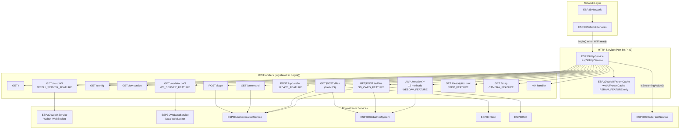

---

## Component Relationships

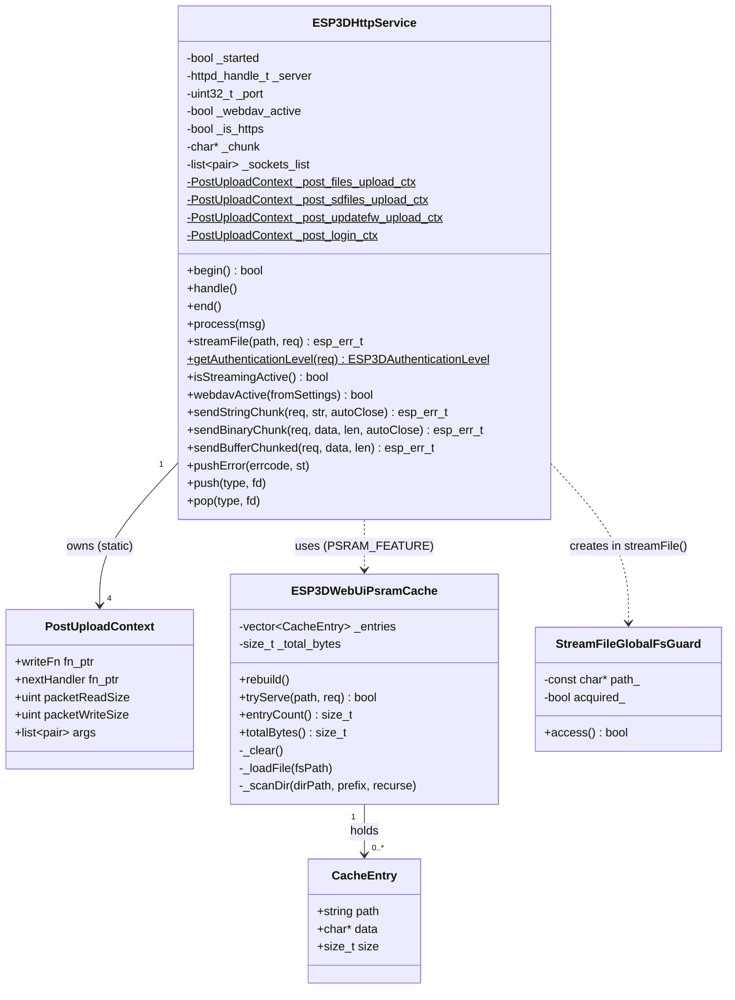

---

## Module File Layout

```
main/modules/http/
├── esp3d_http_service.h            # Class declaration, enums, PostUploadContext
├── esp3d_http_service.cpp          # Lifecycle + core utilities
├── esp3d_webui_psram_cache.h       # PSRAM cache declaration (PSRAM_FEATURE)
├── esp3d_webui_psram_cache.cpp     # PSRAM cache implementation
└── handlers/
    ├── flash/
    │   ├── esp3d_files.cpp         # GET|POST /files — flash FS browser
    │   └── esp3d_upload_files.cpp  # Multipart upload → flash write
    ├── sd/
    │   ├── esp3d_sdfiles.cpp       # GET|POST /sdfiles — SD card browser
    │   └── esp3d_upload_sdfiles.cpp
    ├── updatefw/
    │   └── esp3d_updatefw.cpp      # POST /updatefw — OTA / partition raw write
    ├── webdav/
    │   ├── esp3d_webdav_propfind.cpp
    │   └── ...                     # One file per WebDAV method
    └── ...                         # command, config, root, login, ws handlers
```

---

## Lifecycle

### Startup (`begin()`)

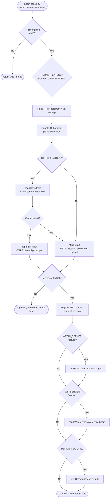

### Shutdown (`end()`)

1. Stops `esp3dWsWebUiService` and `esp3dWsServerDataService`.
2. Unregisters all URI handlers.
3. Calls `httpd_ssl_stop` (HTTPS) or `httpd_stop` (HTTP) and frees TLS cert/key buffers.
4. Clears all active WebUI authentication sessions (`clearSessions(ESP3DClientType::webui)`).
5. Resets `_server = nullptr` and `_started = false`.

### Periodic maintenance (`handle()`)

Called from `ESP3DNetworkServices::handle()` on a timer tick. Delegates to `esp3dWsWebUiService.handle()` and `esp3dWsServerDataService.handle()` for zombie-client cleanup.

---

## URI Route Map

| URI | Method(s) | Feature Guard | Handler | Auth Required |
|-----|-----------|---------------|---------|---------------|
| `/` | GET | always | `root_get_handler` | No |
| `/favicon.ico` | GET | always | `favicon_ico_handler` | No |
| `/command` | GET | always | `command_handler` | Yes |
| `/config` | GET | always | `config_handler` | No |
| `/files` | GET | always | `files_handler` | Yes |
| `/files` | POST | always | `post_multipart_handler` → flash upload | Yes |
| `/login` | POST | always | `post_multipart_handler` → `login_handler` | No |
| `/sdfiles` | GET | `ESP3D_SD_CARD_FEATURE` | `sdfiles_handler` | Yes |
| `/sdfiles` | POST | `ESP3D_SD_CARD_FEATURE` | `post_multipart_handler` → SD upload | Yes |
| `/updatefw` | POST | `ESP3D_UPDATE_FEATURE` | `post_multipart_handler` → FW/partition write | Admin |
| `/ws` | GET ↑WS | `ESP3D_WEBUI_SERVER_FEATURE` | `websocket_webui_handler` | No |
| `/wsdata` | GET ↑WS | `ESP3D_WS_SERVER_SERVICE_FEATURE` | `websocket_data_handler` | No |
| `/snap` | GET | `ESP3D_CAMERA_FEATURE` | `snap_handler` | Yes |
| `/description.xml` | GET | `ESP3D_SSDP_FEATURE` | `description_xml_handler` | No |
| `/webdav/?*` | GET, PUT, DELETE, MKCOL, PROPFIND, OPTIONS, HEAD, MOVE, COPY, LOCK, UNLOCK, PROPPATCH | `ESP3D_WEBDAV_SERVICES_FEATURE` | `webdav_*_handler` | Yes |
| *(catch-all)* | any | always | `file_not_found_handler` (404) | No |

> WebDAV uses `httpd_uri_match_wildcard` URI matching. When `ESP3D_WEBDAV_SERVICES_FEATURE` is disabled, exact-match mode is used to avoid interference with WebSocket route selection on some IDF builds.

---

## Authentication Flow

Authentication is entirely optional at compile time (`ESP3D_AUTHENTICATION_FEATURE`). When disabled, every request is treated as `admin`.

Three levels are defined in `esp3d_authentication_types.h`:
- `guest` — unauthenticated
- `user` — password-protected, reduced privileges
- `admin` — full access

### Level Resolution Order

```mermaid
flowchart TD
    A([getAuthenticationLevel called]) --> B{"POST args present?\nSUBMIT + USER + PASSWORD"}
    B -- Found and SUBMIT=YES --> C{USER == admin?}
    C -- Yes and password OK --> ADMIN([admin])
    C -- No: user and password OK --> USER([user])
    B -- Missing or SUBMIT not YES --> D{Authorization header?\nBasic auth}
    D -- admin creds match --> ADMIN
    D -- user creds match --> USER
    D -- No match --> E{ESPSESSIONID cookie\npresent?}
    E -- Valid cookie and record found --> F{Session timeout\nconfigured?}
    F -- No timeout --> G[Refresh last_time]
    G --> SESS([return record.level])
    F -- Within timeout --> G
    F -- Expired --> H[Clear session record\nSet-Cookie Max-Age=0]
    H --> GUEST([guest])
    E -- No cookie or no record --> GUEST

    ADMIN --> I{Level != guest:\ncreate/update session}
    USER --> I
    I -- No existing session --> J[create_session_id\ncreateRecord\nSet-Cookie: ESPSESSIONID=...]
    I -- Existing session --> K[Update record.level\nand last_time]
```

Sessions are stored in `ESP3DAuthenticationService` (see [authentication.md](authentication.md)). Session IDs are 24-character strings derived from the client IP and socket ID. Cookies use `HttpOnly; SameSite=Strict` attributes.

> ⚠️ **HTTPS security headers** — When running over TLS, `Strict-Transport-Security` (`max-age=31536000`) and `Content-Security-Policy: upgrade-insecure-requests` are added to every response. The CSP header causes the browser to transparently upgrade `ws://` → `wss://` for all sub-requests emitted by the WebUI JS, including WebSocket connections constructed from the host IP without a scheme prefix.

---

## Upload Pipeline

All file uploads (flash, SD, firmware) share a single `post_multipart_handler` entry point. The target is selected by the `PostUploadContext` stored in `httpd_uri_t::user_ctx`.

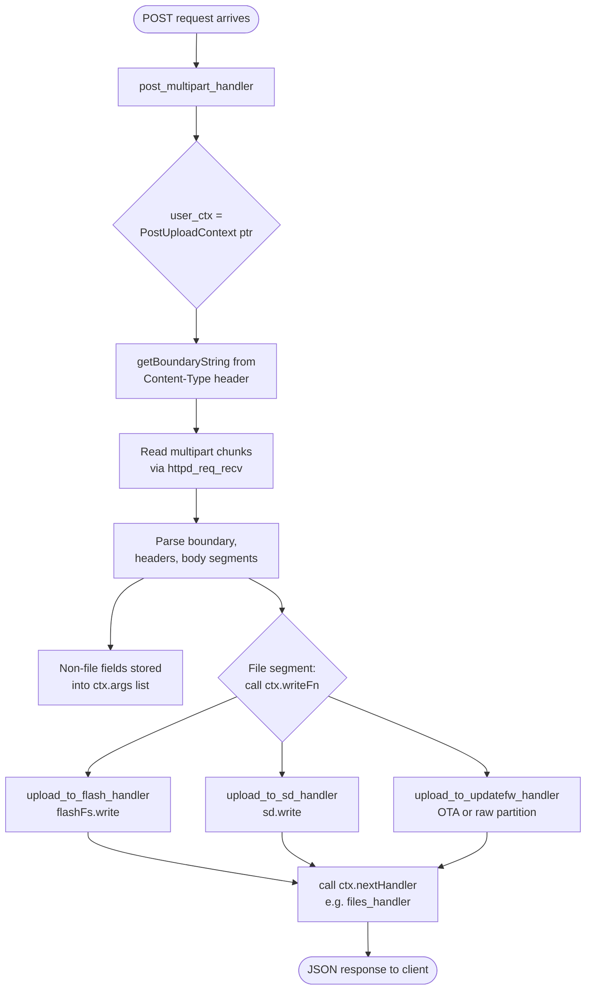

### Upload States (`ESP3DUploadState`)

| State | Meaning |
|-------|---------|
| `upload_start` | First chunk for this file — open/create target |
| `file_write` | Intermediate chunk — append data |
| `upload_end` | Last chunk — close/commit target |
| `upload_aborted` | Transport error — discard and clean up |

### Upload Error Codes (`ESP3DUploadError`)

| Code | Meaning |
|------|---------|
| `no_error` | Success |
| `authentication_failed` | Auth check rejected the request |
| `file_create_failed` | Could not create target file |
| `write_failed` | Write I/O error |
| `not_enough_space` | Filesystem full |
| `start_update_failed` | OTA `esp_ota_begin` failed |
| `mount_sd_failed` | SD card not accessible |
| `memory_allocation` | `malloc` returned null |
| `access_denied` | Streaming active — writes blocked |
| `wrong_size` | Uploaded size mismatch |
| `update_failed` | OTA `esp_ota_end` or validation failed |

Errors are broadcast as `ERROR:<code>:<message>\n` over the WebUI WebSocket via `pushError()`, which calls `esp3dWsWebUiService.BroadcastTxt()`.

### Static Upload Contexts

Four `PostUploadContext` instances are declared as `static` members of `ESP3DHttpService`:

| Context | URI | writeFn | nextHandler |
|---------|-----|---------|-------------|
| `_post_files_upload_ctx` | POST `/files` | `upload_to_flash_handler` | `files_handler` |
| `_post_sdfiles_upload_ctx` | POST `/sdfiles` | `upload_to_sd_handler` | `sdfiles_handler` |
| `_post_updatefw_upload_ctx` | POST `/updatefw` | `upload_to_updatefw_handler` | `updatefw_handler` |
| `_post_login_ctx` | POST `/login` | `NULL` | `login_handler` |

The `writeFn = NULL` in the login context means no file data is written; only the `args` list (SUBMIT, USER, PASSWORD fields) is populated for `getAuthenticationLevel()` to consume.

---

## File Serving (`streamFile`)

Used by `root_get_handler` and `files_handler` for serving static content from flash.

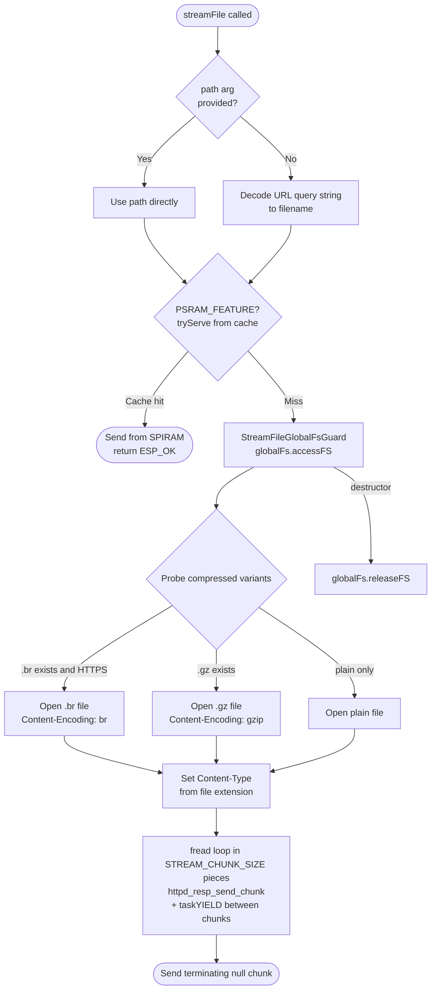

`StreamFileGlobalFsGuard` is a RAII wrapper (anonymous namespace) that guarantees `globalFs.releaseFS()` is called on every exit path, including early returns during the chunked send loop.

**Compressed variant priority:**
1. `.br` (Brotli) — served only over HTTPS (`_is_https` flag), since browsers only advertise `Accept-Encoding: br` on secure connections.
2. `.gz` (Gzip) — served when available on both HTTP and HTTPS.
3. Plain file — fallback.

> **PSRAM boards** — `_chunk` is allocated in SPIRAM via `heap_caps_malloc(STREAM_CHUNK_SIZE, MALLOC_CAP_SPIRAM)`. On non-PSRAM boards it is a static `.bss` array. `STREAM_CHUNK_SIZE` is defined per-board in `boards/*/components/bsp/tasks_def.h`.

---

## PSRAM WebUI Cache (`ESP3DWebUiPsramCache`)

Active only when `ESP3D_PSRAM_FEATURE` is defined. Preloads read-mostly WebUI assets from flash into SPIRAM at HTTP service startup so they can be served without touching the flash bus while a G-code stream is running (see [gcode_host_streaming_flow.md](https://github.com/luc-github/Pibot-cnc-pendant-firmware/blob/main/docs/architecture/gcode_host_streaming_flow.md)).

### Cached Asset Patterns

| Asset Type | Locations scanned | Name filter |
|------------|-------------------|-------------|
| Main page | `<mp>/` | `index.html[.gz]` |
| Preferences | `<mp>/` | `preferences.json[.gz]` |
| Themes | `<mp>/themes/` and `<mp>/` | `theme-*` |
| Extensions | `<mp>/extensions/` and `<mp>/` | `esp3dext-*/` (full subtree, unfiltered) |
| Language packs | `<mp>/languages/` and `<mp>/` | `lang-*.json[.gz]` |

Extension subdirectories (`esp3dext-<name>/`) are cached in full — including nested `assets/` folders — via `_scanDir(..., recurse=true)`.

### Cache Lifecycle

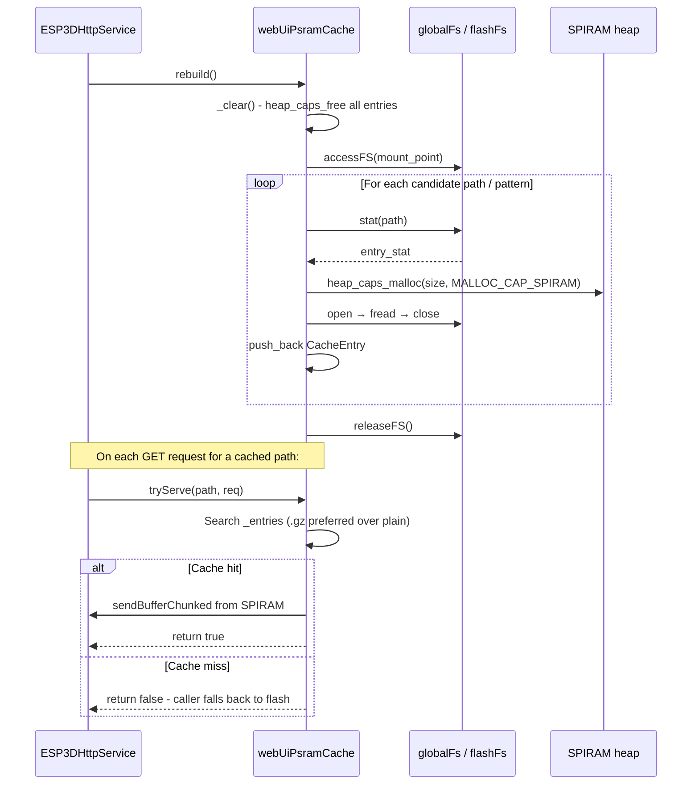

`rebuild()` is called once after a successful `begin()` and should be called again after any flash write that modifies cached content (e.g., a WebUI OTA update).

---

## Flash File Handler (`/files`)

Implemented in `handlers/flash/esp3d_files.cpp`. Responds to GET (directory listing + file operations) and POST (file upload via `post_multipart_handler`).

### GET `/files` — JSON Response Format

Query parameters: `path` (URL-decoded), `action` (`delete` / `deletedir` / `createdir`), `filename`.

```json
{
  "files": [
    {"name": "index.html.gz", "size": "142 KB", "time": "2024-01-15 10:30:00"},
    {"name": "themes", "size": "-1"}
  ],
  "path": "/",
  "occupation": "42",
  "status": "ok",
  "total": "1.50 MB",
  "used": "630 KB"
}
```

- Directories always use `"size": "-1"`.
- The `time` field is only included when `ESP3D_TIMESTAMP_FEATURE` is defined.
- **Mount prefix stripping**: The handler normalizes paths such as `/fs/fs/…` (doubled mount prefix from some WebUI versions) before any filesystem call. All repeated occurrences of the flash mount point prefix are stripped until none remain.

---

## SD Card File Handler (`/sdfiles`)

Implemented in `handlers/sd/esp3d_sdfiles.cpp`. Structurally identical to the flash handler but operates on the `sd` singleton (`ESP3DSD`) instead of `flashFs`. Guarded by `ESP3D_SD_CARD_FEATURE`.

Space reporting uses `uint64_t` instead of `size_t` to accommodate large SD cards that exceed 4 GB.

---

## WebDAV Handler (`/webdav/?*`)

Implemented across `handlers/webdav/`. Guarded by `ESP3D_WEBDAV_SERVICES_FEATURE`. Operates on `globalFs` so it spans both flash and SD card via the global filesystem abstraction (see [filesystem.md](filesystem.md)).

### Supported Methods

| HTTP Method | Handler | Semantics |
|-------------|---------|-----------|
| `GET` | `webdav_get_handler` | Download a file |
| `PUT` | `webdav_put_handler` | Upload / overwrite a file |
| `DELETE` | `webdav_delete_handler` | Delete file or empty directory |
| `MKCOL` | `webdav_mkcol_handler` | Create a directory |
| `PROPFIND` | `webdav_propfind_handler` | List properties (`Depth: 0` or `Depth: 1`) |
| `PROPPATCH` | `webdav_proppatch_handler` | Property update stub (returns 200) |
| `OPTIONS` | `webdav_options_handler` | Advertise allowed methods |
| `HEAD` | `webdav_head_handler` | File metadata without body |
| `MOVE` | `webdav_move_handler` | Rename / move |
| `COPY` | `webdav_copy_handler` | Copy a file |
| `LOCK` | `webdav_lock_handler` | Advisory lock (stub for clients that require it) |
| `UNLOCK` | `webdav_unlock_handler` | Release an advisory lock |

### PROPFIND Depth Handling

`Depth: 1` on a directory emits one `<D:response>` XML element per direct child, obtained via `globalFs.readdir()`. Infinity depth or any value other than `0` / `1` is capped to `1`. Each element carries `getlastmodified`, `creationdate`, `resourcetype`, `getcontentlength` (files only), and `displayname`.

WebDAV can be toggled at runtime without restarting the server via `webdavActive(fromSettings=true)`, which re-reads the `esp3d_webdav_on` NVS key.

### PROPFIND Response Flow

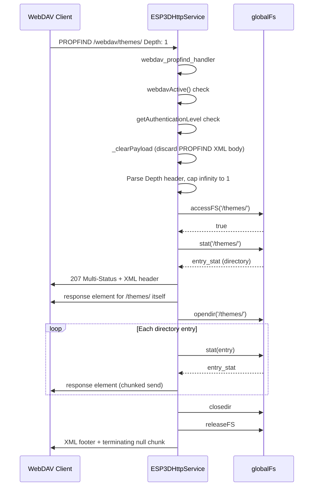

---

## HTTPS / TLS Support

Guarded by `ESP3D_HTTPS_FEATURE`. Uses `esp_https_server` on top of mbedTLS.

### Certificate Loading (`_loadCerts`)

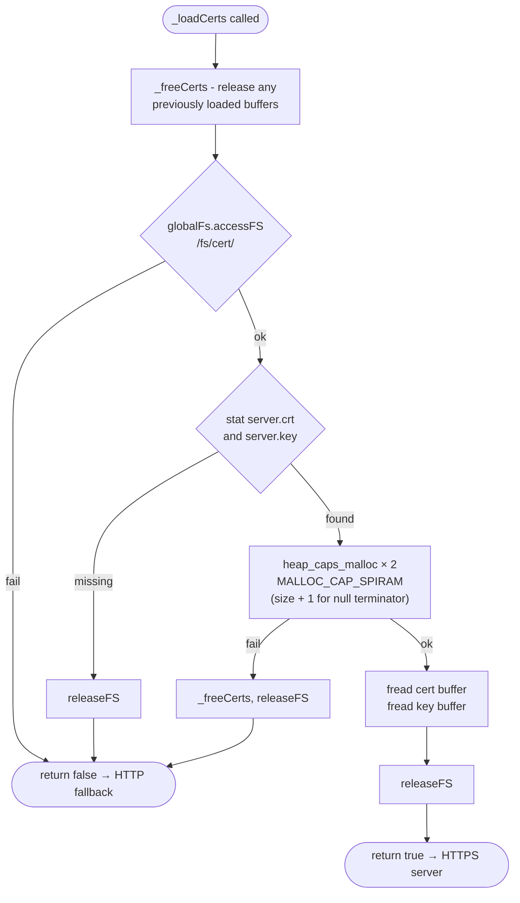

- Certificates are stored in SPIRAM for the full lifetime of the server instance.
- The `+1` null terminator is required by the mbedTLS PEM parser.
- If no certificate is found at startup, the server falls back to plain HTTP so the user can upload a certificate via the WebUI without needing a serial connection.
- On `end()` or start failure, `_freeCerts()` always releases both buffers to prevent leaks across `begin()` retries.

### HTTPS Response Headers

| Header | Value | Purpose |
|--------|-------|---------|
| `Strict-Transport-Security` | `max-age=31536000` | HSTS — browser auto-upgrades future HTTP requests |
| `Content-Security-Policy` | `upgrade-insecure-requests` | WebUI sub-requests (XHR, WebSocket) silently upgraded to TLS |

---

## WebSocket Integration

The HTTP service acts as the **transport layer** for WebSocket connections. It owns the `httpd` server handle; the WebSocket services (see [websocket_server.md](websocket_server.md)) own the client state.

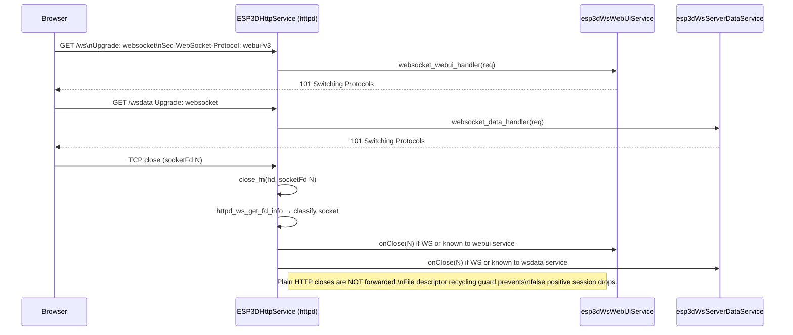

Socket type classification (`httpd_ws_get_fd_info` + checking each service's client registry) prevents forwarding plain HTTP `close_fn` events to WebSocket services. This matters because the `httpd` reuses file descriptors: a new HTTP connection can receive the same fd as a recently closed WebSocket.

---

## Streaming-Active Guard

`isStreamingActive()` queries `gcodeHostService.getState()` and returns `true` when a G-code stream is in the `processing` state.

**Effect on HTTP handlers:**
- Flash and SD **file writes are rejected immediately** (not queued or deferred) by returning `ESP3DUploadError::access_denied`. This prevents contention between HTTP upload I/O and the G-code streaming task on the shared flash/SD bus.
- **File reads** for static WebUI content are served from the PSRAM cache (when `ESP3D_PSRAM_FEATURE` is active), bypassing the flash bus entirely.

---

## Common Response Utilities

All handlers share these helpers on `ESP3DHttpService`:

| Method | Description |
|--------|-------------|
| `httpd_resp_set_http_hdr(req)` | Sets `User-Agent` and `Host` response headers; adds HSTS + CSP on HTTPS |
| `sendStringChunk(req, str, autoClose)` | Sends a null-terminated string as one chunked response segment |
| `sendBinaryChunk(req, data, len, autoClose)` | Sends a raw binary buffer as one chunked segment |
| `sendBufferChunked(req, data, len)` | Slices a large buffer into `STREAM_CHUNK_SIZE` chunks with `taskYIELD` between each |
| `hasArg(req, name)` / `getArg(req, name)` | Reads form fields parsed into the active `PostUploadContext::args` list |
| `pushError(errcode, msg)` | Broadcasts `ERROR:<code>:<msg>\n` over the WebUI WebSocket |
| `getBoundaryString(req)` | Extracts the MIME boundary from the `Content-Type` header using a static fixed-size buffer |
| `streamFile(path, req)` | Serves a file from flash, preferring PSRAM cache then `.br` then `.gz` then plain |

---

## Full Request Processing Example

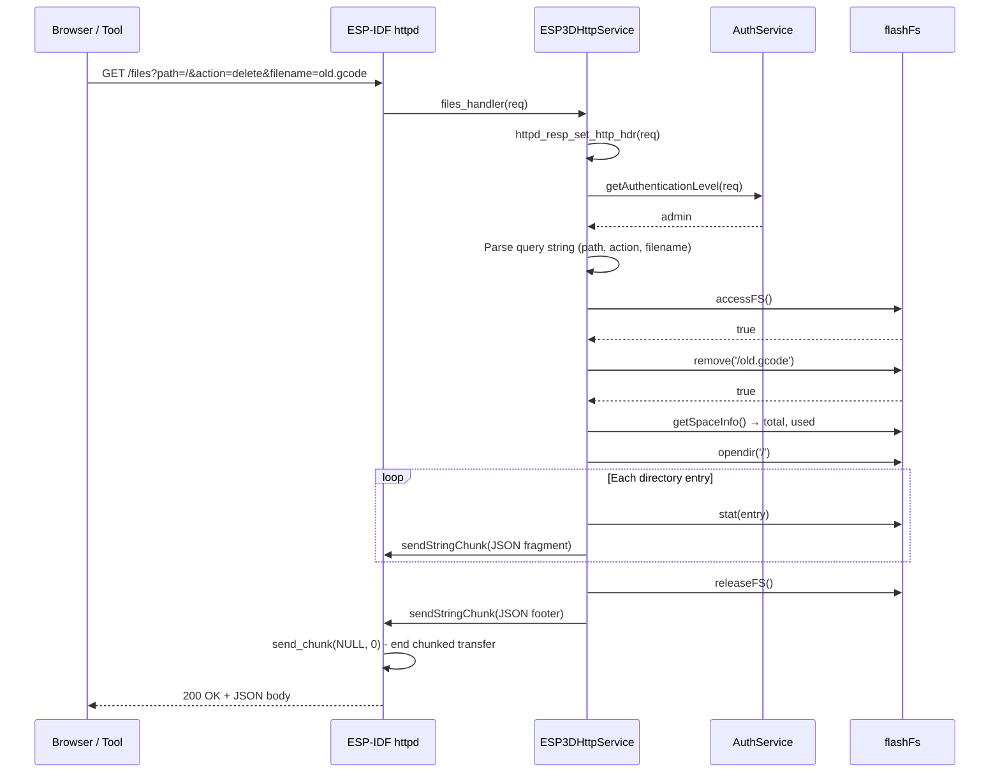

---

## Build Configuration

### Feature Flags

| CMake Option | When ON |
|--------------|---------|
| `ESP3D_WEBUI_SERVER_FEATURE` | Registers `/ws`; starts `esp3dWsWebUiService` |
| `ESP3D_WS_SERVER_SERVICE_FEATURE` | Registers `/wsdata`; starts `esp3dWsServerDataService` |
| `ESP3D_WEBDAV_SERVICES_FEATURE` | Registers 12 WebDAV handlers; enables wildcard URI matching |
| `ESP3D_SD_CARD_FEATURE` | Registers `/sdfiles` (GET + POST) |
| `ESP3D_UPDATE_FEATURE` | Registers POST `/updatefw`; exposes `setUpdateTargetPartition()` |
| `ESP3D_HTTPS_FEATURE` | Uses `esp_https_server`; enables cert loading + security headers |
| `ESP3D_SSDP_FEATURE` | Registers GET `/description.xml` |
| `ESP3D_CAMERA_FEATURE` | Registers GET `/snap` |
| `ESP3D_PSRAM_FEATURE` | Enables SPIRAM `_chunk` buffer and `webUiPsramCache` |
| `ESP3D_AUTHENTICATION_FEATURE` | Enables session management, Basic Auth, cookie handling |
| `ESP3D_TIMESTAMP_FEATURE` | Adds `"time"` field to file listing JSON responses |

### sdkconfig Requirements

| Config Key | Minimum | Reason |
|------------|---------|--------|
| `CONFIG_HTTPD_WS_SUPPORT` | must be `y` when WebUI or WS data is enabled | WebSocket upgrade support in `httpd` |
| `CONFIG_HTTPD_MAX_REQ_HDR_LEN` | ≥ 1024 when `WEBUI_SERVER_FEATURE` is enabled | WS upgrade headers (Origin, Sec-WebSocket-Key, etc.) |

Both constraints are enforced at compile time with `#error` directives.

### NVS Settings Read at `begin()`

| Setting Index | Type | Purpose |
|---------------|------|---------|
| `esp3d_http_on` | byte (`ESP3DState`) | Enable / disable the HTTP service |
| `esp3d_http_port` | uint32 | HTTP listening port (default 80) |
| `esp3d_https_port` | uint32 | HTTPS listening port (default 443) |
| `esp3d_webdav_on` | byte (`ESP3DState`) | Enable / disable WebDAV (readable at runtime via `webdavActive(true)`) |
| `esp3d_ws_on` | byte (`ESP3DState`) | Enable / disable the data WebSocket server |

---

## Memory Considerations

> See [`docs/guides/esp32_memory_constraints.md`](https://github.com/luc-github/Pibot-cnc-pendant-firmware/blob/main/docs/guides/esp32_memory_constraints.md) for the full fragmentation playbook.

| Resource | Size / Allocation strategy |
|----------|---------------------------|
| `_chunk` | `STREAM_CHUNK_SIZE` bytes — static `.bss` (non-PSRAM) or SPIRAM (PSRAM). Single buffer reused for all file streaming. Never reallocated during operation. |
| `PostUploadContext::args` | `std::list<std::pair<std::string,std::string>>` — populated per request, cleared between uploads. Contains only small text fields. |
| TLS cert + key buffers | SPIRAM allocations sized to file content `+1` byte. Allocated in `_loadCerts()`, freed in `_freeCerts()` (called by `end()` and on any start failure). |
| PSRAM cache entries | Each `CacheEntry::data` is an individual SPIRAM allocation. Allocation failure for a single file is logged and skipped; the cache degrades gracefully rather than aborting. |
| WebDAV `response_body` | Built as `std::string` per PROPFIND entry and immediately flushed as a chunk. Peak allocation is proportional to one directory entry, not the full listing. |

---

## Dependencies

| Module | Relationship |
|--------|-------------|
| [network.md](network.md) | `ESP3DNetworkServices` starts and stops the HTTP service when WiFi comes up/down |
| [wifi.md](wifi.md) | `esp3dWifiClient.getLocalIpString()` used to populate the `Host` response header |
| [websocket_server.md](websocket_server.md) | `esp3dWsWebUiService` and `esp3dWsServerDataService` share the `httpd` server handle owned by this module |
| [authentication.md](authentication.md) | `esp3dAuthenthicationService` manages session records and credential validation for all authenticated endpoints |
| [filesystem.md](filesystem.md) | `globalFs`, `flashFs`, and `sd` provide all file I/O for handlers and the PSRAM cache |
| [gcode_host.md](gcode_host.md) | `gcodeHostService.getState()` provides the streaming-active guard that protects flash/SD writes |
| [ssdp.md](ssdp.md) | `description_xml_handler` generates the SSDP device description XML |
| [mdns.md](mdns.md) | Registered independently at the network layer; HTTP service does not interact with mDNS directly |
| [settings.md](settings.md) | NVS-backed port numbers, enable flags, and runtime toggles (WebDAV, WS) |


## Documents de conception (depot)

- [webdav](https://github.com/luc-github/Pibot-cnc-pendant-firmware/blob/main/docs/features/webdav.md)
- [compression-support](https://github.com/luc-github/Pibot-cnc-pendant-firmware/blob/main/docs/guides/compression-support.md)
