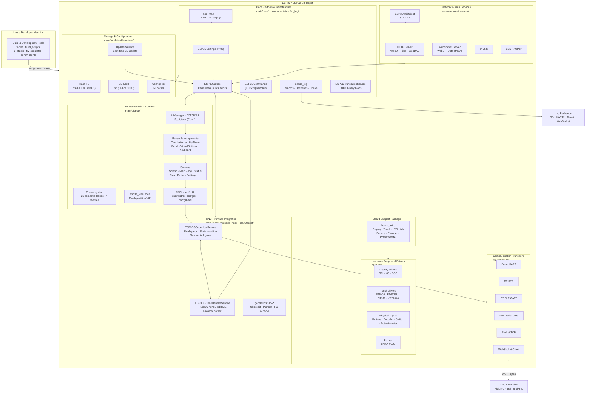
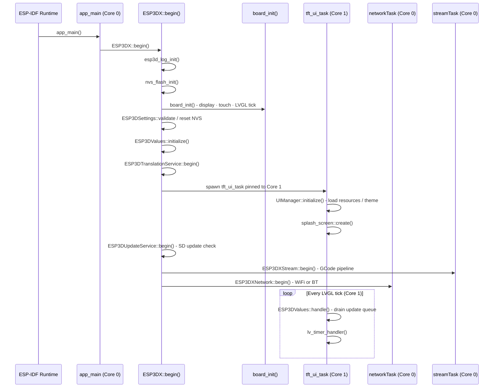
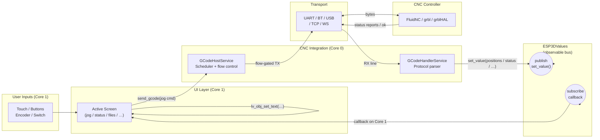
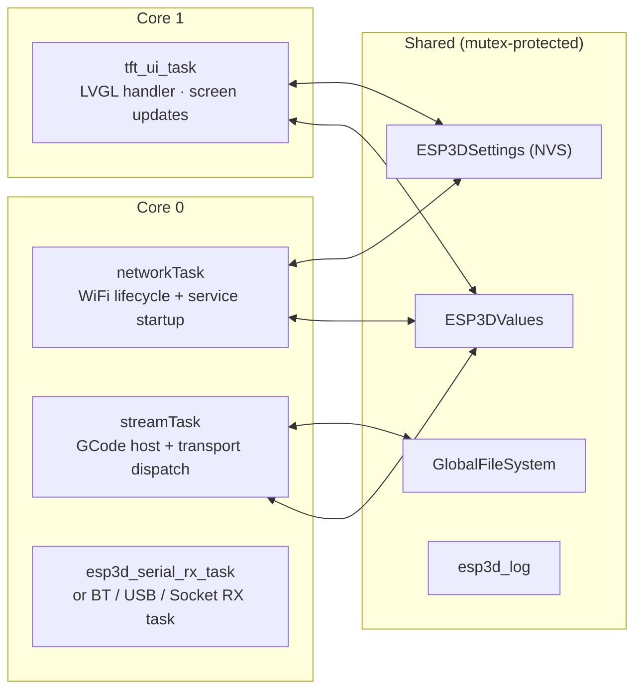
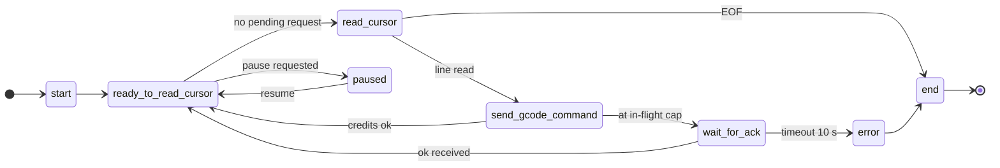
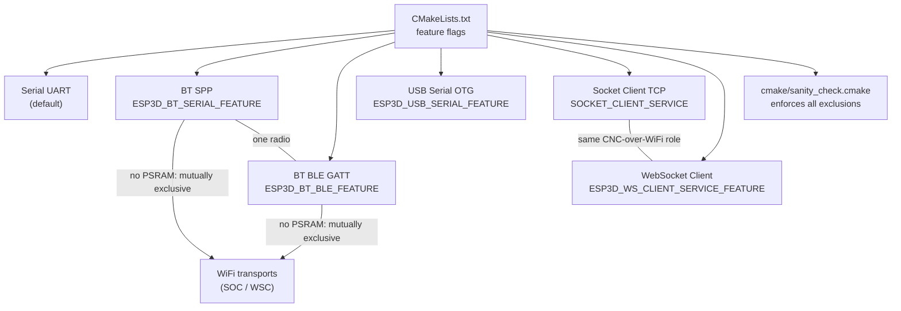
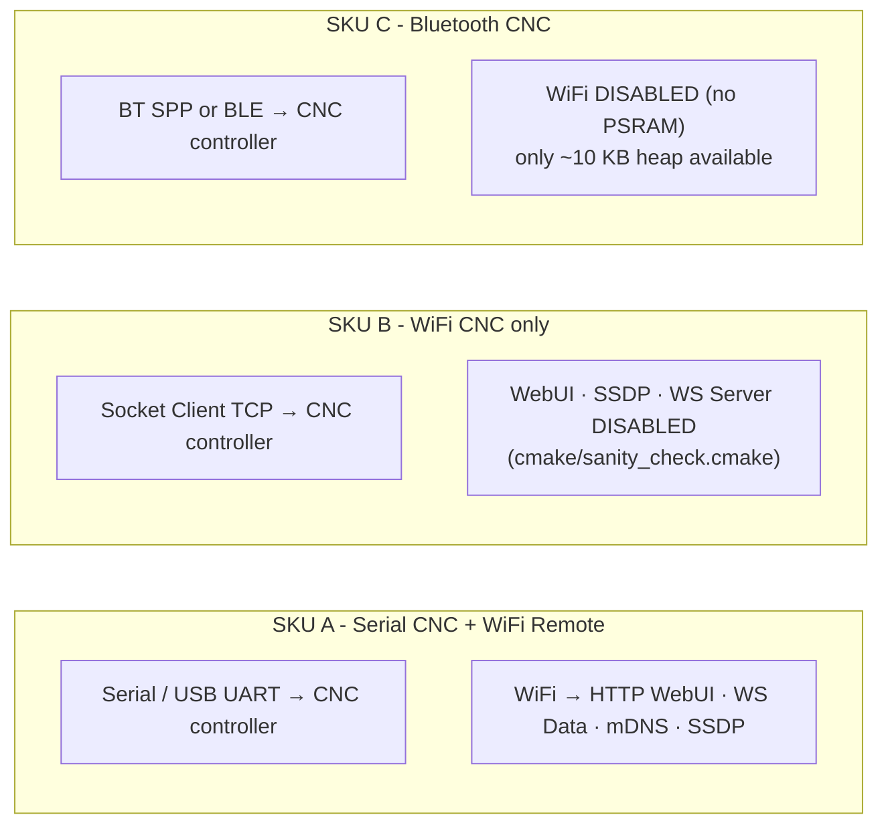

# Pibot-cnc-pendant-firmware Repository Overview

## Purpose

`Pibot-cnc-pendant-firmware` is an ESP-IDF 5.x firmware project for a touchscreen CNC pendant running on ESP32/ESP32-S3 hardware. It provides a multi-transport, multi-firmware-target pendant UI for CNC machines controlled by FluidNC, grbl, or grblHAL. The firmware handles real-time GCode streaming, machine status display, jog control, probing, file management, and remote access — all on a single constrained MCU with no external PSRAM on the primary target board.

---

## End-to-End Architecture

### Top-Level Module Map



---

### Boot and Initialization Sequence



---

### Core Data Flow



---

### FreeRTOS Task Layout



---

### CNC GCode Flow-Control State Machine



---

### Transport Selection (Build-time)



---

### WiFi / CNC Product Model



---

## Core Modules Reference

| Module | Path | Primary Documentation |
|---|---|---|
| **Board Support Packages** | `boards/*/components/bsp/` | `docs/guides/board_build_guidelines.md` |
| **Hardware Peripheral Drivers** | `hardware/` | `docs/architecture/display_drivers.md`, `docs/architecture/Input_system.md` |
| **Core Platform & Infrastructure** | `main/core/`, `components/esp3d_log/` | `docs/guides/esp32_memory_constraints.md`, `docs/guides/esp3d_log_guide.md` |
| **UI Framework & Screens** | `main/display/` | `docs/architecture/screens_architecture.md`, `docs/architecture/screen_transitions_flow.md`, `docs/ui_resources/theme_palette.md`, `docs/ui_resources/ui_style_guide.md` |
| **CNC Firmware Integration** | `main/modules/gcode_host/`, `main/target/` | `docs/architecture/gcode_host_architecture.md`, `docs/architecture/gcode_host_streaming_flow.md` |
| **Communication Transports** | `main/modules/serial/`, `bt_serial/`, `bt_ble/`, `usb_serial/`, `socket_client/`, `websocket_client/` | `docs/architecture/connection_management.md`, `docs/architecture/websockets_protocol.md` |
| **Network & Web Services** | `main/modules/network/`, `wifi/`, `http/`, `websocket_server/`, `mdns/`, `ssdp/` | `docs/features/feature_resource_matrix.md`, `docs/features/mdns.md` |
| **Storage & Configuration** | `main/modules/filesystem/`, `update/`, `config_file/` | `docs/architecture/shared_sd_mechanism_V2.0.md`, `docs/ui_resources/development.md` |
| **Build & Development Tools** | `tools/` | `docs/guides/tools.md`, `docs/guides/board_build_guidelines.md` |
| **Log Backends** | `main/modules/log/` | `docs/guides/esp3d_log_guide.md` |

### Key Architecture Documents

| Document | Topic |
|---|---|
| `docs/architecture/connection_management.md` | Transport lifecycle, connection states (`U/T/C/?/A`) |
| `docs/architecture/gcode_host_architecture.md` | Core + CNC domain split, CMake wiring |
| `docs/architecture/gcode_host_streaming_flow.md` | State machine, pause/resume/abort, flow gates |
| `docs/architecture/esp3d_message_priority_system.md` | Normal vs high-priority message routing |
| `docs/architecture/screens_architecture.md` | Screen registration, `GenericScreen` base |
| `docs/architecture/screen_transitions_flow.md` | Safe timer-based transition idiom |
| `docs/architecture/Input_system.md` | Encoder, buttons, switch, potentiometer pipeline |
| `docs/architecture/display_drivers.md` | SPI/I80/RGB driver stack, orientation math |
| `docs/architecture/shared_sd_mechanism_V2.0.md` | SD bus arbitration between ESP32 and MCU |
| `docs/features/feature_resource_matrix.md` | Feature compatibility, WiFi/CNC SKU model |
| `docs/guides/esp32_memory_constraints.md` | Heap fragmentation, worst-case RAM budgets |
| `docs/guides/esp3d_log_guide.md` | Logging macros, backends, runtime hooks |
| `docs/ui_resources/development.md` | `ui_resources` partition binary format, SD update pipeline |
| `docs/ui_resources/theme_palette.md` | 26 semantic color tokens, per-theme RGBA values |
| `docs/ui_resources/ui_style_guide.md` | `ThemeStyles` architecture, `apply*` function catalog |
| `docs/guides/ui_resources_guide.md` | Adding icons and fonts, SD-card update workflow |
| `docs/hardware/pibot-cnc-pendant-hardware-documentation.md` | Physical pendant hardware reference |

### Build Commands

```bash
# Build for a specific board/variant
idf.py build

# Flash and monitor
idf.py flash monitor

# Multi-board build (via build manager)
python tools/build_scripts/build_mgr.py

# Generate UI resources partition
python tools/build_scripts/generate_resources.py

# Launch UI Studio (theme/image/font editor)
cd tools/ui_studio && python app.py
```

---

## Module Documentation

| Module | Contenu |
|---|---|
| [Board_Support_Packages](Board_Support_Packages.md) | Les 16 cartes supportees : BSP, factory apps, bootloaders, scripts de build |
| [Hardware_Peripheral_Drivers](Hardware_Peripheral_Drivers.md) | Pilotes d'affichage (SPI/I80/RGB), tactiles, entrees physiques, bus, buzzer |
| [Core_Platform_&_Infrastructure](Core_Platform_and_Infrastructure.md) | Point d'entree, esp3d_core, commandes [ESPxxx], valeurs observables, logs, traductions |
| [UI_Framework_&_Screens](UI_Framework_and_Screens.md) | Framework LVGL, composants reutilisables, ecrans generiques et CNC (FluidNC/grbl/grblHAL) |
| [CNC_Firmware_Integration](CNC_Firmware_Integration.md) | G-code host, streaming, parseurs de protocole FluidNC / grbl / grblHAL |
| [Communication_Transports](Communication_Transports.md) | UART, Bluetooth SPP/BLE, USB OTG, sockets TCP, WebSocket client |
| [Network_&_Web_Services](Network_and_Web_Services.md) | WiFi, serveur HTTP/WebUI, WebSocket serveur, mDNS, SSDP, authentification |
| [Storage_&_Configuration](Storage_and_Configuration.md) | Systemes de fichiers (flash/SD), service de mise a jour, fichier de config INI |
| [Build_&_Development_Tools](Build_and_Development_Tools.md) | Scripts de build, simulateur firmware, UI Studio, clients de communication |
| [embedded_webui](embedded_webui.md) | Page web embarquee minimale (terminal, fichiers, mise a jour) servie depuis la flash |
| [logging_backends](logging_backends.md) | Backends de journalisation (seriemoniteur, SD, reseau) |

---

## Modules complementaires

- [logging_backends](logging_backends.md)


---

## Developer Guides (tutorials)

Guides pratiques pour **etendre** le firmware (extraits de l'analyse DeepWiki) :

- [guide_development](guide_development.md) — vue d'ensemble des guides
- [guide_build_system](guide_build_system.md) — systeme de build et feature flags
- [guide_adding_screens](guide_adding_screens.md) — ajouter un ecran
- [guide_adding_settings](guide_adding_settings.md) — ajouter un setting persistant
- [guide_adding_realtime_values](guide_adding_realtime_values.md) — ajouter une valeur temps reel
- [guide_extending_gcode](guide_extending_gcode.md) — etendre le support G-code
- [guide_translations](guide_translations.md) — travailler avec les traductions
- [guide_custom_ui_components](guide_custom_ui_components.md) — creer un composant UI
- [guide_debugging](guide_debugging.md) — debogage et tests

References complementaires :

- [settings_reference](settings_reference.md) — catalogue complet des settings (clés NVS, types, defauts)
- [glossary](glossary.md) — glossaire du projet


## Documents de conception (depot)

- [features.md](https://github.com/luc-github/Pibot-cnc-pendant-firmware/blob/main/docs/features/features.md)
- [feature_resource_matrix.md](https://github.com/luc-github/Pibot-cnc-pendant-firmware/blob/main/docs/features/feature_resource_matrix.md)
- [esp32_memory_constraints.md](https://github.com/luc-github/Pibot-cnc-pendant-firmware/blob/main/docs/guides/esp32_memory_constraints.md)


## Documents de conception (depot)

- [user_documentation](https://github.com/luc-github/Pibot-cnc-pendant-firmware/blob/main/docs/user%20documentation/user_doc/user_documentation.md)
