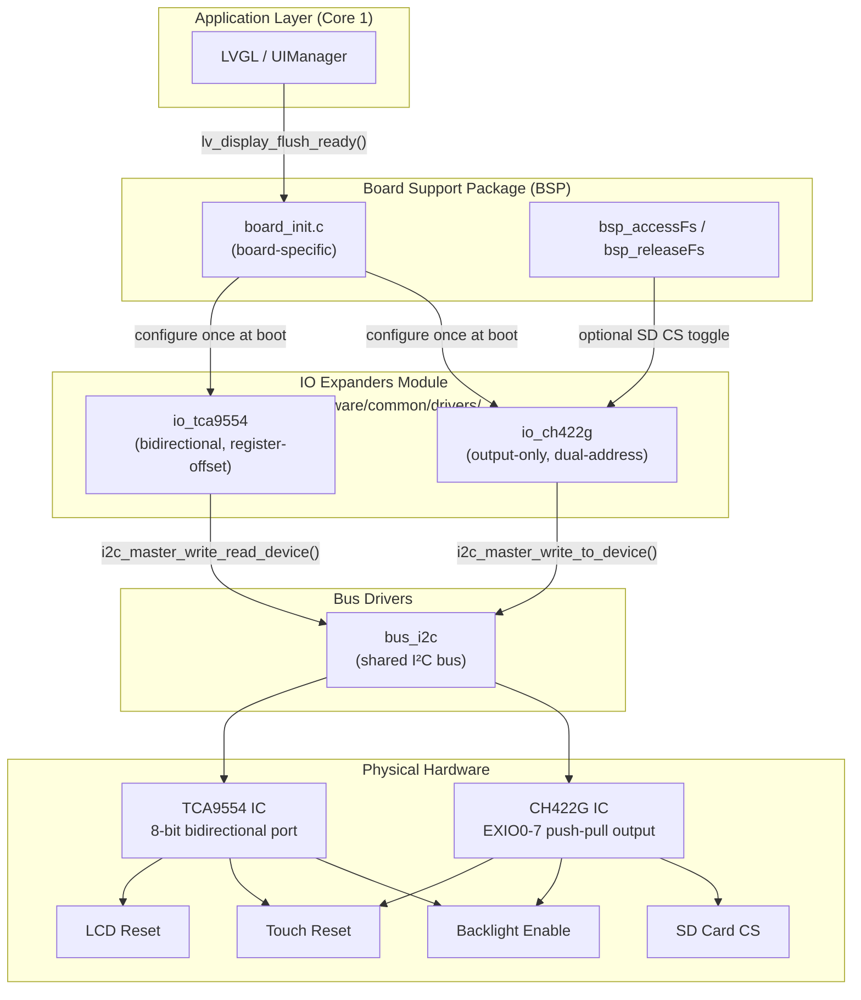
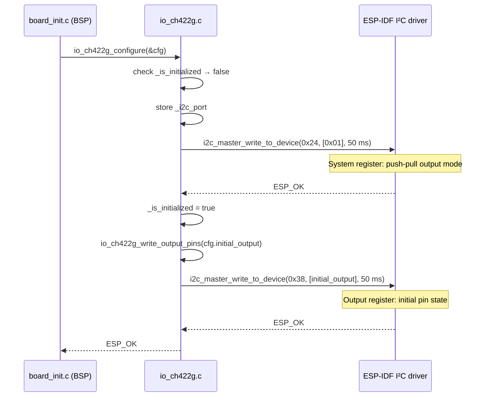
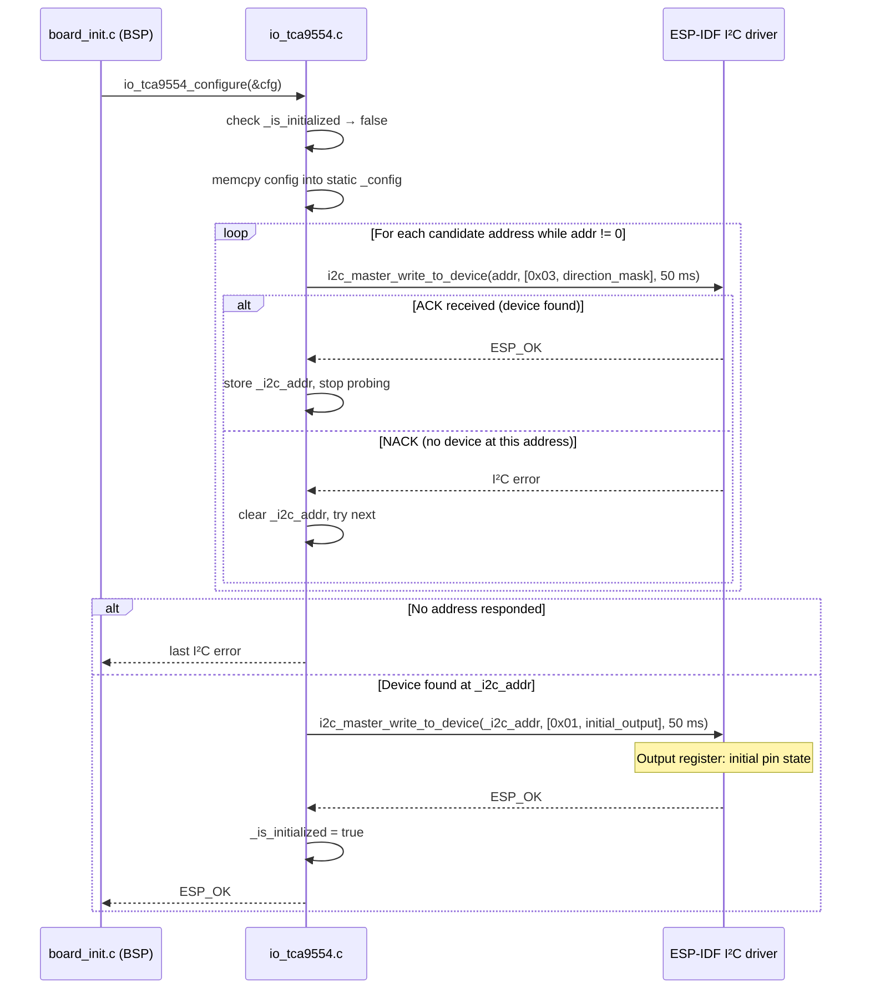
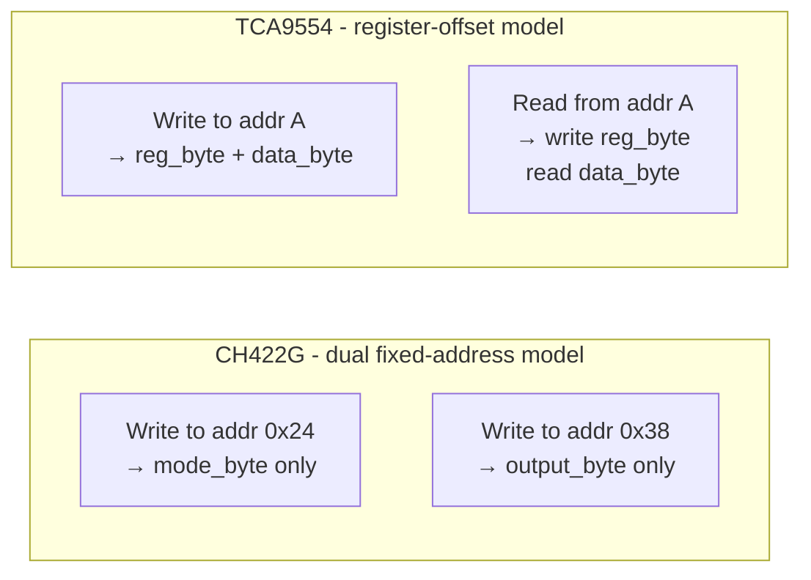
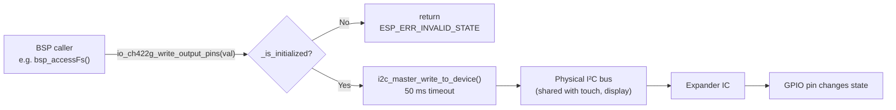

# IO Expanders Module

## Introduction

The `io_expanders` module provides thin, board-agnostic C drivers for two I²C GPIO expander ICs used across the supported board family: the **CH422G** and the **TCA9554**. Both chips address a fundamental ESP32 constraint — the number of directly accessible GPIO pins is often too small to simultaneously connect a display controller, a touch controller, an SD card, a buzzer, and any additional board circuitry. Instead of using general-purpose GPIO, those boards route selected signals (backlight enable, touch reset, SD card-select, LCD reset) through an I²C expander that requires only two shared bus wires regardless of how many signals it controls.

This module lives entirely under `hardware/common/drivers/` and is shared across all boards that instantiate it. It has no knowledge of which board it is running on — all board-specific policy (which pins are inputs, what the initial output state should be, which I²C port to use) is injected via a configuration structure supplied by the board's BSP layer.

---

## Architecture and Position in the System

The IO expanders sit immediately above the I²C bus driver and are consumed exclusively by the board BSP initialization code. They are not reachable from the application layer or from LVGL.



### Key design constraints

| Constraint | Impact |
|---|---|
| I²C timeout fixed at **50 ms** | Short enough to avoid blocking LVGL polling on Core 1 during a flush cycle |
| **No dynamic allocation** | Both drivers use file-scope static variables exclusively — safe on a fragmented heap |
| **Singleton per chip type** | Each driver manages exactly one device instance; boards that need two expanders of the same type must use a different driver or extend the state |
| **All functions are C** | Headers are wrapped in `extern "C"` so BSP code written in C++ can include them without mangling issues |

---

## Component Descriptions

### CH422G — Output-Only Expander

**Files:** `hardware/common/drivers/io_ch422g/io_ch422g.c` · `io_ch422g.h` · `io_ch422g_config.h`

The CH422G is an 8-bit I²C GPIO expander with an unusual addressing model: instead of a single I²C device address with a register-select byte, it exposes each functional register at its own **fixed bus address**:

| Register | I²C address | Purpose |
|---|---|---|
| System / Mode | `0x24` | Write `0x01` to enable push-pull output mode on EXIO0–7 |
| Output data | `0x38` | Per-bit output value for EXIO0–7 |

This means the chip supports **output only** — there is no readable input register, and direction is not configurable by the application. The driver reflects this constraint by offering only `io_ch422g_write_output_pins()`.

**Board usage:** `esp32s3_8048_touch_lcd_7`  
On that board the SD card chip-select (`SD_CS`) is not connected to any ESP32 GPIO; it is routed through EXIO3 of the CH422G instead. Since the SPI2_HOST bus has no other device, `SD_CS` is driven low once at boot and never needs to toggle per-transaction.

### TCA9554 — Bidirectional Expander

**Files:** `hardware/common/drivers/io_tca9554/io_tca9554.c` · `io_tca9554.h` · `io_tca9554_config.h`

The TCA9554 is a standard 8-bit I²C GPIO expander that follows the conventional register-offset model: all registers are accessed through a **single device address** with a register-select byte prepended to each transaction.

| Register | Offset | Purpose |
|---|---|---|
| Input port | `0x00` | Read current logic state of all pins (bypasses output latch) |
| Output port | `0x01` | Latch value driven on output-configured pins |
| Polarity inversion | `0x02` | Per-bit: `1` = invert the reported input state |
| Configuration | `0x03` | Per-bit direction: `1` = input, `0` = output |

The driver supports **address probing**: the board supplies up to three candidate addresses (zero-terminated array in `io_tca9554_config_t`). During `io_tca9554_configure()` the driver iterates the list and stops at the first address that ACKs a configuration register write. This accommodates boards where the hardware address pins (`A0`–`A2`) may be wired in different ways across revisions.

**Board usage:** `esp32s3_hmi43v3`  
On that board both the display backlight enable and the touch reset line are routed through the TCA9554, so the expander must be initialized *before* both the display driver and the touch controller.

---

## Configuration Structures

### `io_ch422g_config_t`

```c
typedef struct {
    i2c_port_t i2c_port;    // I²C port number (I2C_NUM_0 or I2C_NUM_1)
    int i2c_clk_speed;      // I²C clock speed in Hz (typically 400000)
    uint8_t initial_output; // Per-bit initial state of EXIO0–7
} io_ch422g_config_t;
```

`i2c_clk_speed` is stored in the config but the current driver does not call `i2c_param_config()` itself — it assumes the bus has already been initialized by the `bus_i2c` driver. The field is present for documentation and consistency with other driver configs.

### `io_tca9554_config_t`

```c
typedef struct {
    uint8_t i2c_addr[3];    // Candidate addresses, 0-terminated (e.g. {0x20, 0x21, 0})
    i2c_port_t i2c_port;    // I²C port number
    int i2c_clk_speed;      // I²C clock speed in Hz
    uint8_t direction_mask; // Per-bit: 1 = input, 0 = output
    uint8_t initial_output; // Initial value written to the output port
} io_tca9554_config_t;
```

`direction_mask` and `initial_output` are pure board policy — the driver does not assume any default. A `direction_mask` of `0xFF` makes all pins inputs; `0x00` makes all pins outputs.

---

## API Reference

### CH422G API

#### `io_ch422g_configure()`

```c
esp_err_t io_ch422g_configure(const io_ch422g_config_t *config);
```

Initializes the CH422G. Performs two I²C writes:
1. `0x01` → system register (`0x24`) — selects push-pull output mode.
2. `config->initial_output` → output register (`0x38`) — sets the initial pin state.

Safe to call multiple times; subsequent calls return `ESP_OK` immediately without re-initializing.

| Parameter | Description |
|---|---|
| `config` | Pointer to a filled `io_ch422g_config_t`. Must not be `NULL`. |

**Returns:** `ESP_OK` on success; `ESP_ERR_INVALID_ARG` if `config` is `NULL`; an I²C error code if the bus transaction fails.

---

#### `io_ch422g_write_output_pins()`

```c
esp_err_t io_ch422g_write_output_pins(uint8_t pin_val);
```

Writes `pin_val` to the EXIO0–7 output register (I²C addr `0x38`). Bit 0 corresponds to EXIO0, bit 7 to EXIO7. Must be called only after `io_ch422g_configure()`.

**Returns:** `ESP_OK` on success; `ESP_ERR_INVALID_STATE` if not initialized; I²C error otherwise.

---

#### `io_ch422g_deinit()`

```c
void io_ch422g_deinit(void);
```

Clears the internal initialized flag. Does not write to the hardware. After this call, all API functions that check initialization will return `ESP_ERR_INVALID_STATE` until `io_ch422g_configure()` is called again.

---

### TCA9554 API

#### `io_tca9554_configure()`

```c
esp_err_t io_tca9554_configure(const io_tca9554_config_t *config);
```

Initializes the TCA9554. Probes each address in `config->i2c_addr[]` in order; the first that ACKs a configuration register write is used for all subsequent operations. Then writes `config->initial_output` to the output port register.

Safe to call multiple times; subsequent calls return `ESP_OK` immediately without re-probing.

| Parameter | Description |
|---|---|
| `config` | Pointer to a filled `io_tca9554_config_t`. Must not be `NULL`. |

**Returns:** `ESP_OK` on success; `ESP_ERR_INVALID_ARG` if `config` is `NULL`; the last I²C error code if no address ACKed.

---

#### `io_tca9554_set_configuration()`

```c
esp_err_t io_tca9554_set_configuration(uint8_t val);
```

Writes `val` to the configuration register (`0x03`). Each bit independently sets direction: `1` = input, `0` = output. The initial direction is already applied by `io_tca9554_configure()` via `config->direction_mask`; call this function only if direction needs to change at runtime.

**Returns:** `ESP_OK` on success; `ESP_ERR_INVALID_STATE` if not initialized; I²C error otherwise.

---

#### `io_tca9554_write_output_pins()`

```c
esp_err_t io_tca9554_write_output_pins(uint8_t pin_val);
```

Writes `pin_val` to the output port register (`0x01`). Only affects pins configured as outputs; pins configured as inputs ignore this value.

**Returns:** `ESP_OK` on success; `ESP_ERR_INVALID_STATE` if not initialized; I²C error otherwise.

---

#### `io_tca9554_read_output_pins()`

```c
esp_err_t io_tca9554_read_output_pins(uint8_t *pin_val);
```

Reads back the **output latch register** (`0x01`) — the value last written, not the actual pin state. Useful for read-modify-write sequences without requiring an external shadow register.

**Returns:** `ESP_OK` on success; `ESP_ERR_INVALID_STATE` if not initialized or `pin_val` is `NULL`; I²C error otherwise.

---

#### `io_tca9554_read_input_pins()`

```c
esp_err_t io_tca9554_read_input_pins(uint8_t *pin_val);
```

Reads the **input port register** (`0x00`), which reflects the actual logic level on each pin regardless of direction setting. On output-configured pins this reads back the driven state; on input-configured pins it reads the external signal level.

**Returns:** `ESP_OK` on success; `ESP_ERR_INVALID_STATE` if not initialized or `pin_val` is `NULL`; I²C error otherwise.

---

#### `io_tca9554_set_polarity_inversion()`

```c
esp_err_t io_tca9554_set_polarity_inversion(uint8_t val);
```

Writes `val` to the polarity inversion register (`0x02`). Per-bit: `1` = the corresponding input pin is reported inverted through `io_tca9554_read_input_pins()`. Does not affect output pins or the output register.

**Returns:** `ESP_OK` on success; `ESP_ERR_INVALID_STATE` if not initialized; I²C error otherwise.

---

#### `io_tca9554_deinit()`

```c
void io_tca9554_deinit(void);
```

Clears the internal address and initialized flag. Does not write to the hardware. After this call, all API functions will return `ESP_ERR_INVALID_STATE` until `io_tca9554_configure()` is called again.

---

## Initialization Flow

### CH422G Initialization



### TCA9554 Initialization (with address probing)



---

## I²C Communication Models

The two drivers use fundamentally different I²C transaction patterns, reflecting the different chip architectures:



| Aspect | CH422G | TCA9554 |
|---|---|---|
| I²C addresses used | Two (`0x24`, `0x38`) | One (probed from candidate list) |
| Register select | Encoded in the destination address | First byte of every transaction |
| Read capability | None | Input port and output latch |
| Direction control | Fixed output-only | Per-bit via configuration register |
| I²C transaction type | `write_to_device` only | `write_to_device` + `write_read_device` |

---

## Data Flow: Runtime Pin Write

Once initialized, a pin write from the BSP layer follows a minimal synchronous path with no task switches or queues:



The 50 ms timeout is intentionally short. If the I²C bus is locked or the device is absent, the call returns an error without stalling the LVGL task.

---

## Board × Expander Matrix

| Board | Expander | Signals routed through expander |
|---|---|---|
| `esp32s3_8048_touch_lcd_7` | CH422G | SD_CS (EXIO3 active-low), Touch Reset (EXIO2), LCD Reset (EXIO1), EXIO5 held high |
| `esp32s3_hmi43v3` | TCA9554 | Backlight enable, Touch reset |

Boards not listed manage all required signals through direct ESP32 GPIOs and do not link these drivers.

---

## Usage Pattern (BSP Perspective)

The following shows the canonical sequence for integrating an IO expander in a board's `board_init.c`:

```c
// 1. Initialize the shared I²C bus first (see bus_drivers module)
ret = bus_i2c_init(&i2c_bus_config);
if (ret != ESP_OK) { return ret; }

// 2. Configure the expander (CH422G example)
io_ch422g_config_t ch422g_cfg = {
    .i2c_port       = I2C_PORT_IDX,
    .i2c_clk_speed  = I2C_FREQ_HZ,
    .initial_output = CH422G_INITIAL_OUTPUT,  // board-specific constant
};
ret = io_ch422g_configure(&ch422g_cfg);
if (ret != ESP_OK) {
    esp3d_log_e("CH422G IO expander initialization failed: %d", ret);
    return ret;
}

// 3. Initialize display and touch drivers that depend on expander pins
ret = init_lvgl();
// ...
```

**Ordering constraint:** The IO expander must be configured before any driver that relies on a pin it controls. On `esp32s3_hmi43v3`, TCA9554 must initialize before both the display and touch controllers, since both depend on expander-controlled signals (backlight, touch reset).

---

## Design Notes

### Why static singletons?

Both drivers store all state in file-scope static variables (`_is_initialized`, `_i2c_port`, `_config`, `_i2c_addr`). On a memory-constrained ESP32 with a fragmented heap, avoiding `malloc()` in driver init paths eliminates a class of allocation failure at the cost of flexibility. The hardware itself is a singleton — there is at most one CH422G and one TCA9554 per board. See [esp32_memory_constraints.md](https://github.com/luc-github/Pibot-cnc-pendant-firmware/blob/main/docs/guides/esp32_memory_constraints.md) for the general heap constraints that motivate this pattern across the codebase.

### Why no interrupt support?

The TCA9554 has an `INT` output that goes low when any input pin changes; the CH422G has no interrupt output at all. Interrupt-driven reads are not currently wired because:
- The boards that use these expanders do not connect the `INT` line to an ESP32 GPIO.
- The signals routed through the expanders (backlight, reset, SD CS) are either write-only or polled infrequently enough that a periodic check is sufficient.

If interrupt-driven input reading is added in the future, `io_tca9554_read_input_pins()` is already present and can be called from a deferred task triggered by a GPIO ISR — the I²C transaction itself must not run inside the ISR.

### I²C timeout and LVGL safety

The 50 ms timeout (`I2C_TIMEOUT_MS`) prevents the calling context from blocking indefinitely if the expander does not respond. Since `board_init()` runs before the LVGL task starts, and runtime writes (e.g., `bsp_accessFs`) can be triggered from any context, a bounded timeout is critical. 50 ms is well above the worst-case I²C transaction time at 100–400 kHz but short enough not to affect UI responsiveness, which requires flush callbacks to complete well within one frame period (~16 ms at 60 Hz).

---

## Related Modules

| Module | Relationship |
|---|---|
| [bsp.md](bsp.md) | BSP layer that instantiates and configures IO expanders during `board_init()` |
| [bus_drivers.md](bus_drivers.md) | Provides the shared I²C bus (`bus_i2c`) that both expander drivers depend on — must be initialized before any expander call |
| [bsp_touch_controllers.md](bsp_touch_controllers.md) | Touch drivers (FT5x06, GT911) share the same I²C bus and may depend on expander-controlled reset lines |
| [bsp_display_drivers_i80.md](bsp_display_drivers_i80.md) | I80 display drivers may require expander-controlled reset/backlight lines before panel initialization |
