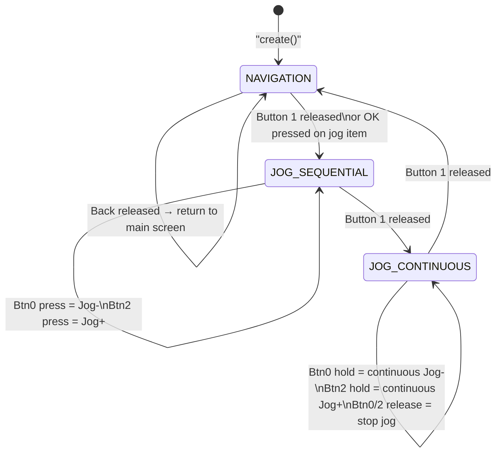
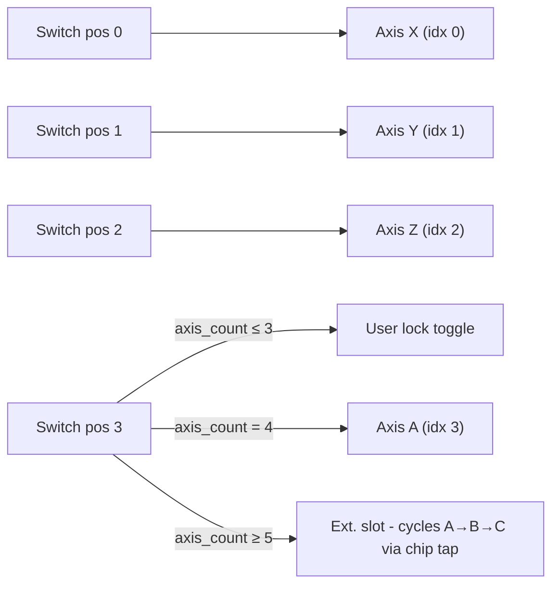
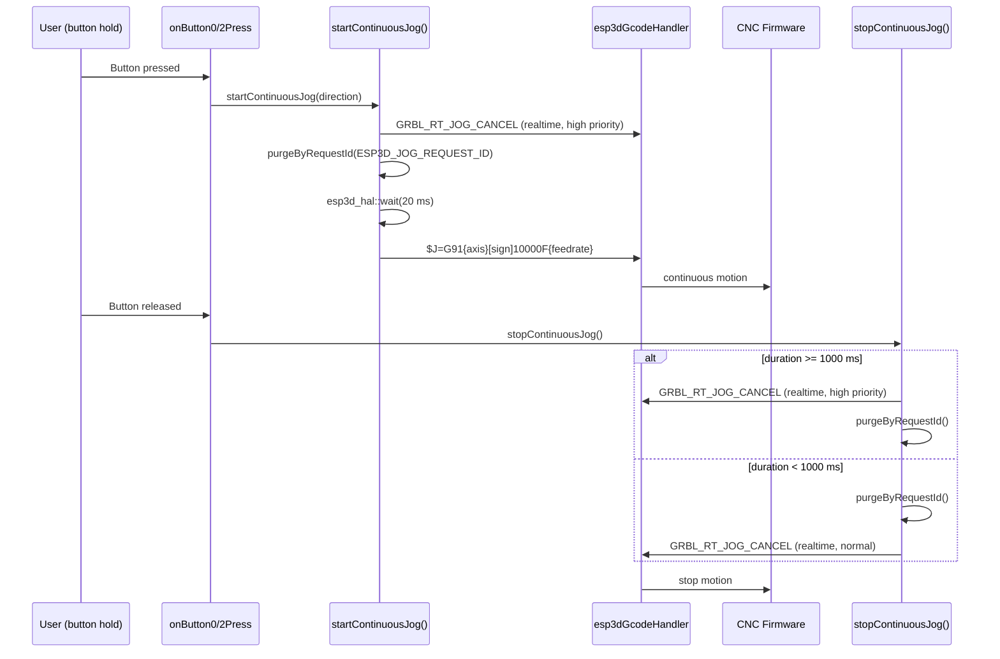
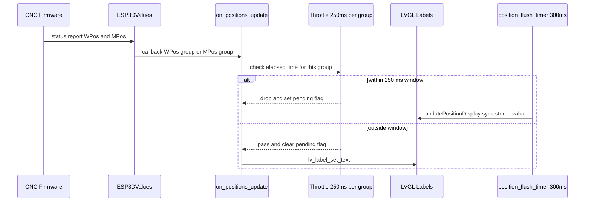
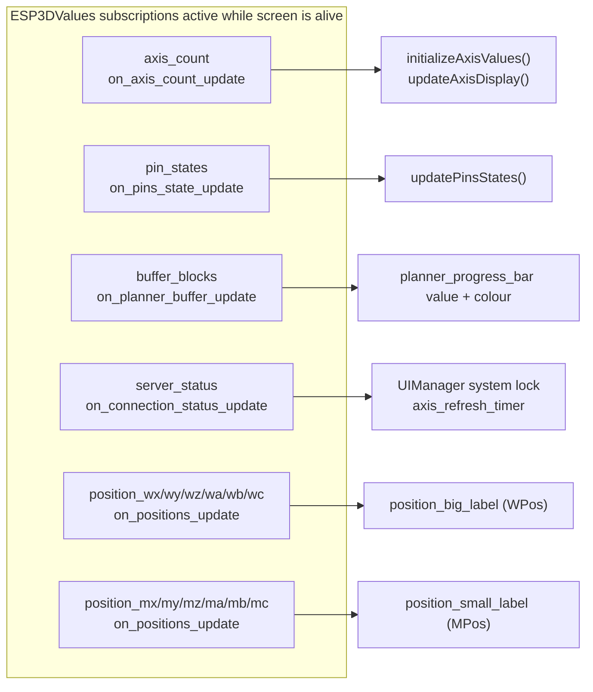
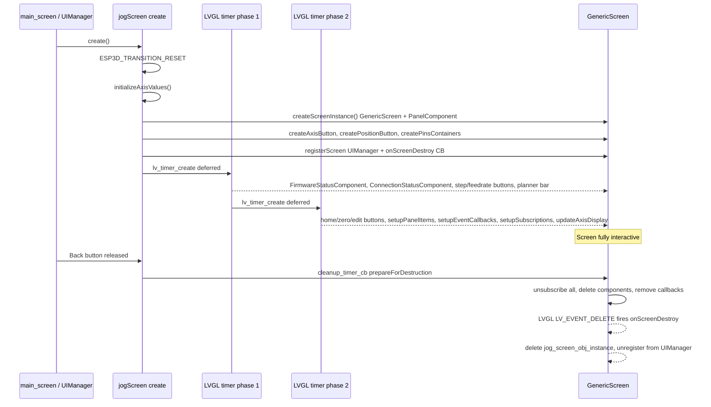
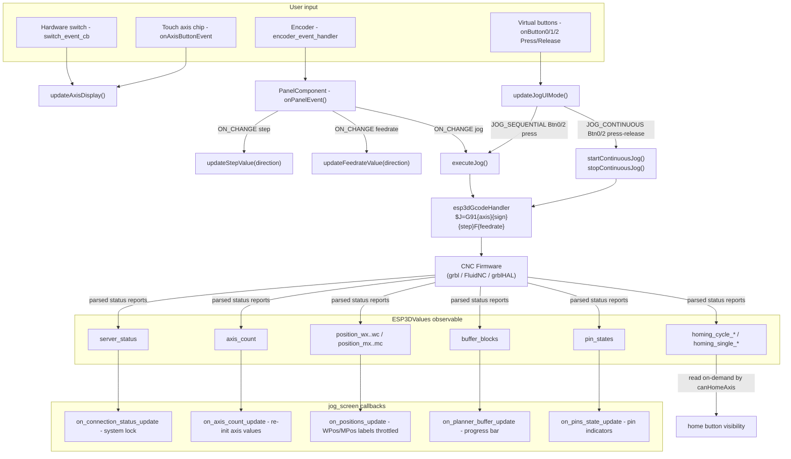

# Jog Screen

## Introduction

The jog screen (`main/display/cnc/screens/jog_screen.cpp`, namespace `jogScreen`) is the primary CNC manual motion control interface. It provides real-time axis position display, step-based and continuous jogging, homing, and work-coordinate zeroing — all driven by a rotary encoder, a 4-position hardware switch (or touch), and three virtual buttons.

The screen is shared across all supported CNC firmware targets (FluidNC, grbl, grblHAL). It lives in the `cnc_shared` module group and is reachable from the main screen. It returns to `ESP3DScreenType::main` on Back.

---

## Architecture Overview

```mermaid
graph TD
    subgraph "UI Framework"
        UIManager["UIManager<br/>(screen lifecycle, theming, lock)"]
        GenericScreen["GenericScreen<br/>(LVGL screen + container)"]
        PanelComponent["PanelComponent<br/>(encoder-driven item list)"]
        VirtualButtons["VirtualButtonsComponent<br/>(3 bottom buttons)"]
        FirmwareStatus["FirmwareStatusComponent<br/>(top-right status bar)"]
        ConnectionStatus["ConnectionStatusComponent<br/>(top-left transport icon)"]
    end

    subgraph "jogScreen namespace"
        CREATE["create()"]
        AXIS_DISPLAY["updateAxisDisplay()"]
        POS_DISPLAY["updatePositionDisplay()"]
        JOG_EXEC["executeJog()"]
        CONT_JOG["startContinuousJog()\nstopContinuousJog()"]
        MODE_MGR["updateJogUIMode()"]
        AXIS_VALUES["AxisValues map<br/>(step / feedrate per axis)"]
    end

    subgraph "Core Services"
        ESP3DValues["ESP3DValues<br/>(observable system)"]
        ESP3DSettings["ESP3DSettings<br/>(NVS settings)"]
        GCodeHost["ESP3DGCodeHostService<br/>(gcode pipeline)"]
        GCodeHandler["esp3dGcodeHandler<br/>(send gcode)"]
        Translation["ESP3DTranslationService"]
    end

    subgraph "Input Hardware"
        Switch["4-pos switch<br/>(axis selector / lock)"]
        Encoder["Rotary encoder"]
        Touch["Touch / virtual buttons"]
    end

    CREATE --> GenericScreen
    CREATE --> PanelComponent
    CREATE --> FirmwareStatus
    CREATE --> ConnectionStatus
    CREATE --> VirtualButtons

    AXIS_DISPLAY --> UIManager
    AXIS_DISPLAY --> POS_DISPLAY
    MODE_MGR --> VirtualButtons
    MODE_MGR --> PanelComponent

    JOG_EXEC --> GCodeHandler
    CONT_JOG --> GCodeHandler
    CONT_JOG --> GCodeHost

    Switch -->|switch_event_cb| AXIS_DISPLAY
    Encoder -->|encoder_event_handler| PanelComponent
    Touch -->|onButton*Press/Release| MODE_MGR

    ESP3DValues -->|on_positions_update| POS_DISPLAY
    ESP3DValues -->|on_axis_count_update| AXIS_DISPLAY
    ESP3DValues -->|on_connection_status_update| UIManager
    ESP3DValues -->|on_planner_buffer_update| AXIS_DISPLAY
    ESP3DValues -->|on_pins_state_update| AXIS_DISPLAY

    ESP3DSettings --> AXIS_VALUES
    Translation --> AXIS_VALUES
```



---

## Screen Layout

```
┌──────────────────────────────────────────────┐
│ [ConnStatus]               [FirmwareStatus]  │
│                                              │
│              ┌──────┐                        │
│              │  X   │   ← Axis chip/button   │
│              └──────┘                        │
│   ┌──────────────────────────────────────┐   │
│   │           123.456                    │   │  ← WPos (big label)
│   │         MPos:125.000                 │   │  ← MPos (small label)
│   └──────────────────────────────────────┘   │
│   ┌─────────────┐  ┌─────────────────────┐   │
│   │  1.000mm    │  │  3000mm/min         │   │  ← Step / Feedrate buttons
│   └─────────────┘  └─────────────────────┘   │
│   ████████████████████████████░░░░░░░░░░░░░  │  ← Planner buffer bar
│                                              │
│   [X][Y][Z]           [A][B][C]              │  ← Limit/probe pin indicators
│                                              │
│  [home] [homeAll]          [zero]            │  ← Home / Zero buttons
│──────────────────────────────────────────────│
│  [OK/Jog-] [mode]          [Back/Jog+]      │  ← Virtual buttons
└──────────────────────────────────────────────┘
```

### UI Elements

| Element | LVGL object | Description |
|---|---|---|
| Axis chip | `btnAxe` + `axe_label` | Shows current axis letter (X/Y/Z/A/B/C) or lock icon; tappable to cycle axis (touch-only) or cycle extended axes (hardware switch + >4 axes) |
| Position button | `position_btn` | Contains WPos big label and MPos small label; is also the `jog` panel item |
| Step button | `step_btn` | Cycles through preset step sizes + Custom slot; is the `step` panel item |
| Feedrate button | `feedrate_btn` | Cycles through preset feedrates + Custom slot; is the `feedrate` panel item |
| Planner bar | `planner_progress_bar` | Colour-coded bar showing free planner buffer (green/yellow/red) |
| Pin indicators | `pins_labels[0..5]` | Square chips for X/Y/Z (linear row) and A/B/C (rotary row); hidden unless that pin is active |
| Home button | `home_btn` | Homes the current single axis (`$H{axis}`); hidden when single-axis homing is disabled |
| Home All button | `home_all_btn` | Homes all axes (`$H`); hidden when no axis has a homing cycle |
| Zero button | `zero_btn` | Zeroes WPos for the current axis (`G92 {axis}0`) |
| Edit indicator | `edit_btn` | Small edit symbol; appears above Step or Feedrate when on the Custom slot in editing mode; tapping or pressing OK launches the numeric input |
| Virtual buttons | `VirtualButtonsComponent` | 3 buttons whose meaning changes with `JogUIMode` |

---

## Jog UI Modes

The centre virtual button (Button 1) cycles through three modes on each release. The mode governs what the left (Button 0) and right (Button 2) virtual buttons do.



### Mode Mapping

| Mode | Button 0 | Button 1 (centre) | Button 2 |
|---|---|---|---|
| **NAVIGATION** | OK — toggle encoder editing mode; or enter jog mode when jog item is focused | Mode cycle | Back |
| **JOG_SEQUENTIAL** | Jog − (single step on press) | Mode cycle | Jog + (single step on press) |
| **JOG_CONTINUOUS** | Jog − (large distance on hold; stops on release) | Mode cycle | Jog + (large distance on hold; stops on release) |

> **LVGL constraint**: Button press/release callbacks run on Core 1 inside the LVGL task. `startContinuousJog()` and `stopContinuousJog()` send GCode via `esp3dGcodeHandler` and must never block the LVGL thread. See [screens_architecture.md](https://github.com/luc-github/Pibot-cnc-pendant-firmware/blob/main/docs/architecture/screens_architecture.md) for the threading model.

---

## Axis Management

### Axis Count and Selection

The screen supports 3 to 6 axes. A 4-position hardware switch (positions 0–3) selects the active axis. Position 3 is special:

- **`axis_count <= 3`**: position 3 = **lock state** — toggles the user lock; the axis chip displays a lock icon.
- **`axis_count = 4`**: position 3 = the 4th real axis (A, or U when grblHAL `$376` renames it).
- **`axis_count >= 5`**: position 3 = extended axis slot that cycles through A/B/C via axis chip tap.



> **Touch-only boards** (`!ESP3D_HARDWARE_SWITCH_FEATURE`): tapping the axis chip cycles through all real axes in ordinal order (X→Y→Z→A→B→C→X). The lock position is excluded from the touch cycle.

### Axis Naming

`axisLetter(real_idx)` reads `ESP3DValuesIndex::axis_names` from the values system. This string is populated by grblHAL when `$376` renames axes (e.g. `"XYZUVW"`). FluidNC and standard grbl fall back to `"XYZABC"`. Both the displayed axis chip and the jog GCode command letter use the same source, so the letter is always firmware-accurate.

---

## Step and Feedrate Management

### AxisValues Struct

Each real axis (indices 0–5) has an `AxisValues` entry in `axis_values_map`:

```cpp
struct AxisValues {
    std::vector<std::string> step_values;      // preset list from settings (e.g. "0.01;0.1;1;10")
    std::vector<std::string> feedrate_values;  // preset list from settings
    size_t current_step_index;                 // 0..step_values.size() (last = Custom slot)
    size_t current_feedrate_index;
    std::string step_unit;                     // "mm" / "in" / "deg"
    std::string feedrate_unit;                 // "mm/min" / "in/min" / "deg/min"
    std::string custom_step_value;             // session-only typed override; never persisted
    std::string custom_feedrate_value;
};
```

### Settings Source

| Axis | Step presets (string) | Feedrate presets (string) | Saved step idx (byte) | Saved feedrate idx (byte) |
|---|---|---|---|---|
| X | `esp3d_x_jog_steps` | `esp3d_x_jog_feedrates` | `esp3d_x_jog_step_idx` | `esp3d_x_jog_feedrate_idx` |
| Y | `esp3d_y_jog_steps` | `esp3d_y_jog_feedrates` | `esp3d_y_jog_step_idx` | `esp3d_y_jog_feedrate_idx` |
| Z | `esp3d_z_jog_steps` | `esp3d_z_jog_feedrates` | `esp3d_z_jog_step_idx` | `esp3d_z_jog_feedrate_idx` |
| A | `esp3d_a_jog_steps` | `esp3d_a_jog_feedrates` | `esp3d_a_jog_step_idx` | `esp3d_a_jog_feedrate_idx` |
| B | `esp3d_b_jog_steps` | `esp3d_b_jog_feedrates` | `esp3d_b_jog_step_idx` | `esp3d_b_jog_feedrate_idx` |
| C | `esp3d_c_jog_steps` | `esp3d_c_jog_feedrates` | `esp3d_c_jog_step_idx` | `esp3d_c_jog_feedrate_idx` |

Preset strings are semicolon-separated (e.g. `"0.01;0.1;1;10;50"`). The selected index byte is persisted to NVS on every encoder step. Indices are validated at load time and reset to 0 if out of bounds, handling preset list changes across firmware upgrades cleanly. The `axis_values_map` is not cleared across screen transitions unless `axis_count` changes, preserving user-selected indices when navigating back to the jog screen.

### Custom Slot

The cycler includes one extra slot past the presets (index == `step_values.size()`). When selected:

- The edit indicator (`EDIT`) appears above the active Step or Feedrate button.
- Pressing OK, or tapping the indicator, opens the [input_screen.md](physical_input.md) for floating-point input.
- The typed value is stored in `custom_step_value` / `custom_feedrate_value` — **session-only, never written to NVS**.
- If no value has been typed yet, the first preset is used as the actual jog value so the machine never receives an empty command string.

Units are resolved from `ESP3DValuesIndex::current_unit` (G20 = inches, G21 = mm) for linear axes. Rotary axes always use degrees/degrees-per-minute regardless of the work unit.

---

## Jog Command Generation

### Single-step Jog (`executeJog`)

Builds and sends:
```
$J=G91{axis}{sign}{step}F{feedrate}
```

Before sending, the planner buffer (`ESP3DValuesIndex::buffer_blocks`) is compared against `ESP3D_PLANNER_BUFFER_SIZE_THRESHOLD = 5`. If available blocks are at or below this threshold the command is silently dropped to avoid overflowing the firmware's motion planner.

### Continuous Jog (`startContinuousJog` / `stopContinuousJog`)

Sends a single `$J=G91` with a very large distance so the machine jogs until explicitly cancelled:



The 20 ms delay before sending the large-distance command gives the firmware time to process the pre-start cancel and clear its internal buffer.

---

## Position Display



**WPos** (work position) drives the large label. **MPos** (machine position) drives the `MPos:...` small label. They have **independent** 250 ms timestamps and pending flags because `handle()` dispatches all position callbacks from a single status report in the same LVGL tick — a shared timestamp would throttle the second group whenever the first passed through.

The 300 ms flush timer runs continuously and only calls `updatePositionDisplay()` when either pending flag is set. This guarantees the display converges to the correct value even when motion has stopped and no further status reports arrive.

---

## Planner Buffer Bar

The bar maps available buffer blocks to 0–100 %. Colour thresholds are computed from `planner_buffer_max_size` (read from `ESP3DValuesIndex::planner_blocks` at creation):

| Available blocks | Bar colour | Design token |
|---|---|---|
| 0 – 5 | Red | `ESP3D_ACCENT_ALERT_COLOR` |
| 6 – `(5 + max/2)` | Yellow | `ESP3D_ACCENT_ACTION_COLOR` |
| Above yellow threshold | Green | `ESP3D_ACCENT_SELECT_COLOR` |

The red threshold is fixed at 5 to match `ESP3D_PLANNER_BUFFER_SIZE_THRESHOLD`. The yellow/green boundary divides the remaining range equally so the bar is visually proportional regardless of the firmware's planner size.

---

## Lock System

The screen participates in two independent lock dimensions managed by `UIManager`:

| Lock type | Trigger | UIManager call | Visual effect |
|---|---|---|---|
| **User lock** | Switch to position 3 when `axis_count <= 3` | `userSetLockState(true/false)` | Lock icon on axis chip; lock beep |
| **System lock** | `server_status != "C"` or `canSendData() == false` | `systemSetLockState(true/false)` | All jog/home/zero disabled; labels dimmed |

Both combine in `ui_manager.getLockState()`. When locked:
- All interactive buttons are visually disabled (`LV_STATE_DISABLED`).
- Position labels are dimmed using the `text_disabled` opacity token.
- The jog command path aborts before sending.
- `updateAxisDisplay()` applies change detection before any LVGL calls to avoid redundant work on every status report.

`on_connection_status_update` schedules a 1-second deferred `updateAxisDisplay()` via `axis_refresh_timer` to batch rapid consecutive status changes and avoid LVGL thread saturation during reconnection.

---

## Homing Buttons

Visibility is evaluated on every `updateAxisDisplay()` call using three helpers that read from `ESP3DValues`:

| Helper | Values index read | Returns true when |
|---|---|---|
| `canHomeAxis(idx)` | `homing_cycle_{x\|y\|z\|a\|b\|c}` | Value is `"1"` |
| `canHomeSingleAxis(idx)` | `homing_single_{x\|y\|z\|a\|b\|c}` | Value is `"1"` |
| `anyAxisCanHome()` | Iterates all active axes via `canHomeAxis` | At least one axis returns true |

Button layout adapts dynamically to the visible combination:

| Visible buttons | Layout |
|---|---|
| Home + HomeAll + Zero | Left / Centre / Right |
| HomeAll + Zero | Left / Right |
| Home + Zero | Left / Right |
| Zero only | Centre |

---

## Panel Component Integration

The `PanelComponent` manages three encoder-navigable items. See [screens_architecture.md](https://github.com/luc-github/Pibot-cnc-pendant-firmware/blob/main/docs/architecture/screens_architecture.md) for the full `PanelComponent` contract.

| Item | LVGL object | Panel mode interaction | Encoder action |
|---|---|---|---|
| `step_item_id` | `step_btn` | NAVIGATION → EDITING (OK) | Cycle step preset (±1 slot, wraps to Custom) |
| `feedrate_item_id` | `feedrate_btn` | NAVIGATION → EDITING (OK) | Cycle feedrate preset (±1 slot, wraps to Custom) |
| `jog_item_id` | `position_btn` | Always EDITING when focused | Execute single jog in encoder direction |

The `onPanelEvent()` unified callback handles all panel events and applies automatic mode switching:

- Focusing `jog_item_id` while in **NAVIGATION** → auto-switch to **JOG_SEQUENTIAL**.
- Focusing `step_item_id` or `feedrate_item_id` while in **JOG_SEQUENTIAL** → auto-switch back to **NAVIGATION**.
- `suppress_focus_event_` prevents re-entrancy during programmatic transitions.

> **Touch-only boards** (`!ESP3D_HARDWARE_ENCODER_FEATURE`): the encoder is emulated when a panel item is active. `setEncoderEmulation(true)` remaps Button 1 to CW step and Button 2 to CCW step, swapping icons accordingly. See [input_emulation.md](https://github.com/luc-github/Pibot-cnc-pendant-firmware/blob/main/docs/architecture/input_emulation.md) for the full emulation architecture.

---

## Event Subscriptions



All subscriptions are cleaned up in `prepareForDestruction()`. Each callback guards against post-unsubscribe delivery (a queued value snapshot may arrive after `unsubscribe()` returns) with a `jog_screen_obj_instance->isValid()` guard at entry.

---

## Screen Lifecycle



Creation is split across two deferred LVGL timer phases (`ESP3D_DEFERED_SCREEN_CREATION_DELAY_MS` between each) to stay within budget and avoid starving other LVGL tasks during the initialization burst.

Focus and editing state (`last_focused_item_id`, `last_focused_was_editing`) survive screen transitions. Returning from the Custom-value input screen restores the previously active panel item and its editing mode exactly as it was before the transition.

---

## Data Flow Summary



---

## Key Constants and Thresholds

| Constant | Value | Purpose |
|---|---|---|
| `ESP3D_PLANNER_BUFFER_SIZE_THRESHOLD` | 5 | Minimum free planner blocks before a jog command is sent |
| `CONTINUOUS_JOG_DISTANCE_LINEAR_MM` | 10 000 mm | Distance sent for continuous linear (X/Y/Z) jog |
| `CONTINUOUS_JOG_DISTANCE_ROTARY_DEG` | 36 000 deg | Distance sent for continuous rotary (A/B/C) jog |
| `POSITION_DISPLAY_MIN_INTERVAL_MS` | 250 ms | Per-group throttle interval for WPos/MPos label updates |
| `position_flush_timer` period | 300 ms | Timer that syncs labels after a throttled update when motion stops |
| Continuous jog stop strategy threshold | 1 000 ms | Duration above which realtime cancel is preferred over queue purge |

---

## Related Documentation

- [screens_architecture.md](https://github.com/luc-github/Pibot-cnc-pendant-firmware/blob/main/docs/architecture/screens_architecture.md) — overall screen-based UI architecture, `GenericScreen`, `UIManager`, and LVGL threading model
- [screen_transitions_flow.md](https://github.com/luc-github/Pibot-cnc-pendant-firmware/blob/main/docs/architecture/screen_transitions_flow.md) — timer-safe transition patterns used by `cleanup_timer_cb` and `transition_timer_cb`
- [Input_system.md](https://github.com/luc-github/Pibot-cnc-pendant-firmware/blob/main/docs/architecture/Input_system.md) — hardware encoder, 4-position switch, and virtual-button subsystem
- [input_emulation.md](https://github.com/luc-github/Pibot-cnc-pendant-firmware/blob/main/docs/architecture/input_emulation.md) — encoder emulation for touch-only boards (Button 1/2 remapped to CW/CCW steps)
- [gcode_host_architecture.md](https://github.com/luc-github/Pibot-cnc-pendant-firmware/blob/main/docs/architecture/gcode_host_architecture.md) — GCode pipeline, `purgeByRequestId`, and priority system used by jog and cancel commands
- [gcode_host_streaming_flow.md](https://github.com/luc-github/Pibot-cnc-pendant-firmware/blob/main/docs/architecture/gcode_host_streaming_flow.md) — planner buffer flow control referenced by the progress bar
- [ui_style_guide.md](https://github.com/luc-github/Pibot-cnc-pendant-firmware/blob/main/docs/ui_resources/ui_style_guide.md) — `ThemeStyles`, `applyButtonDefaultStyle`, and colour token constants used throughout this screen


## Documents de conception (depot)

- [jog_screen](https://github.com/luc-github/Pibot-cnc-pendant-firmware/blob/main/docs/ux_flows/fluidnc/jog_screen.md)
- [jog_screen](https://github.com/luc-github/Pibot-cnc-pendant-firmware/blob/main/docs/ux_flows/grblhal/jog_screen.md)
