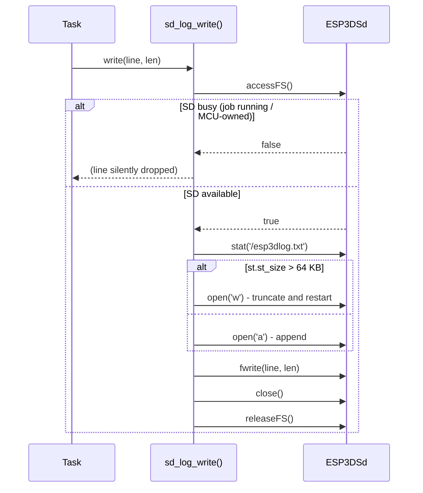
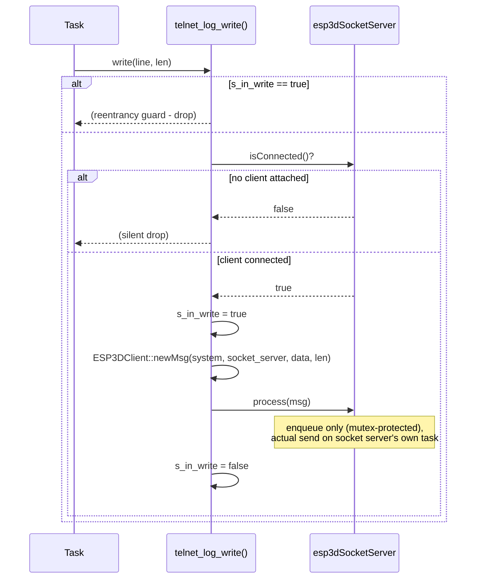

# logging_backends — Log Output Backend Implementations

This module contains the four app-dependent log output backends for the `esp3d_log` subsystem: SD card, secondary UART, Telnet, and WebSocket. For the full system overview (macros, level gating, format, hooks, build configuration), see [esp3d_log.md](esp3d_log.md).

---

## Context

The `esp3d_log` component (`components/esp3d_log/`) is kept dependency-free so it can be included in any build. Backends that depend on app-level services (filesystem, network, UART driver) cannot live inside that component. They live here — one subdirectory per backend under `main/modules/log/` — and are conditionally compiled in by `main/CMakeLists.txt` when the corresponding `ESP3D_LOG_BACKEND` value is selected.

```
main/modules/log/
├── sd/
│   └── esp3d_log_sd_backend.cpp        # Backend 1: SD card
├── uart2/
│   └── esp3d_log_uart2_backend.cpp     # Backend 2: secondary UART
├── telnet/
│   └── esp3d_log_telnet_backend.cpp    # Backend 3: reuses esp3dSocketServer
└── websocket/
    └── esp3d_log_websocket_backend.cpp # Backend 4: reuses esp3dWsServerDataService
```

The dependency-free serial backend (value 0) lives inside the component at `components/esp3d_log/backends/esp3d_log_serial.c` and is always available.

---

## Shared Interface

Every backend implements the same four-function struct defined in `components/esp3d_log/esp3d_log_backend.h`:

```c
typedef struct {
    void (*init)(void);                       // called once from esp3d_log_init()
    void (*write)(const char *data, int len); // called per formatted line
    void (*flush)(void);                      // called after each write()
    void (*deinit)(void);                     // release resources
} esp3d_log_backend_t;

// Each backend source file provides exactly one of these:
const esp3d_log_backend_t *esp3d_log_get_backend(void);
```

The core dispatcher (`esp3d_log_output()` in `esp3d_log.c`) calls `backend->write()` for every formatted line, then `backend->flush()` immediately after. The `data` pointer passed to `write()` is a static buffer valid only for the duration of that call — backends must consume it synchronously or copy it.

### Compile Guard

All four backends are gated by the same condition used by the core:

```cpp
#if ESP3D_LOG || ESP3D_X_BENCHMARK
// ... implementation ...
#endif
```

Backends therefore participate in benchmark builds (`ESP3D_X_BENCHMARK`) even when general logging is disabled.

---

## Shared Design Principles

All four backends follow the same constraints:

| Principle | Rationale |
|---|---|
| **Never block the calling task** | `write()` may be called from the LVGL task on Core 1. Any block there delays UI rendering. |
| **Best-effort / drop-on-busy** | Retrying or queueing internally would turn a log call into a flow-control event that can stall real-time tasks. |
| **No heap allocation** | Static initializers and stack-local state only; no `malloc()` inside `write()`. |
| **Reentrancy guard where needed** | Some backends route through services that internally call `esp3d_log_*`, creating a re-entry path through `esp3d_log_output()`. A `volatile bool s_in_write` prevents infinite recursion. |
| **No-op `flush()` for three backends** | SD closes the file handle inside each `write()`. UART2 and WebSocket would have to block on hardware drain. Only the serial backend flushes (`fflush(stdout)`). |

---

## Backend 1 — SD Card

**File:** `main/modules/log/sd/esp3d_log_sd_backend.cpp`  
**Requires:** `SD_CARD_SERVICE=ON` (enforced by `cmake/sanity_check.cmake`)  
**Dependency:** `ESP3DSd` via `filesystem/esp3d_sd.h`



### Behaviour

- **Every `write()` is self-contained.** Acquires the SD (`accessFS()`), opens the file, writes, closes, then releases (`releaseFS()`). The SD is never held open between calls.
- **SD-busy → silent drop.** If `accessFS()` returns false (another task is streaming a job, or the shared-SD MCU owns the bus), the line is discarded. A logger must never stall the calling task waiting for a shared resource.
- **File capped at 64 KB.** Once `/esp3dlog.txt` exceeds `SD_LOG_MAX_SIZE`, the next `write()` opens in `"w"` mode (truncate and restart). This prevents unbounded growth without a separate rotation task.
- **`flush()` is a no-op** — the file handle is already closed at the end of every `write()`.
- **`init()` is a no-op** — nothing to pre-open; the per-call open/close pattern is the design.

### Consequence

During an active job (or any period when the SD is owned elsewhere), SD logging goes silent for that duration. This is by design. See [`shared_sd_mechanism_V2.0.md`](https://github.com/luc-github/Pibot-cnc-pendant-firmware/blob/main/docs/architecture/shared_sd_mechanism_V2.0.md) for the SD arbitration model.

---

## Backend 2 — Secondary UART

**File:** `main/modules/log/uart2/esp3d_log_uart2_backend.cpp`  
**Requires:** Board `board_config.h` must define three macros (see below). **No board in this repo currently defines them.**  
**Dependency:** ESP-IDF `driver/uart.h`, `driver/gpio.h`

### Required Board Defines

```c
// Must be a UART port genuinely separate from UART_PORT_IDX (the CNC serial link).
#define ESP3D_LOG_UART_PORT_IDX   UART_NUM_1    // e.g. UART_NUM_1 or UART_NUM_2
#define ESP3D_LOG_UART_TX_PIN     GPIO_NUM_xx
#define ESP3D_LOG_UART_RX_PIN     GPIO_NUM_xx
// Optional — defaults to 115200 if omitted:
#define ESP3D_LOG_UART_BAUD_RATE_BPS  115200
```

If any of the first three are absent, a `#error` fires at compile time with an explanatory message. There is no silent fallback. Silently reusing the primary UART's pins would corrupt CNC communication.

### Behaviour

- **`init()`** installs the UART driver with:
  - TX ring buffer: 512 bytes (ISR-drained — `write()` copies data in and returns immediately)
  - RX ring buffer: 256 bytes (required by the ESP-IDF driver API; never read — this is a one-way log channel)
  - If any ESP-IDF init call fails, `s_initialized` stays `false` and all subsequent `write()` calls are no-ops.
- **`write()`** calls `uart_write_bytes()`. Safe from any task including LVGL.
- **`flush()`** is a no-op — blocking on `uart_wait_tx_done()` would stall the calling task.
- **`deinit()`** calls `uart_driver_delete()` to release the port.

### Testing

Since no board defines the required pins today, verifying the backend compiles requires temporarily adding the three defines to a board's `board_config.h` with arbitrary `GPIO_NUM_*` values, building, then reverting.

---

## Backend 3 — Telnet

**File:** `main/modules/log/telnet/esp3d_log_telnet_backend.cpp`  
**Requires:** `SOCKET_SERVER_SERVICE=ON` (enforced by `cmake/sanity_check.cmake`)  
**Dependency:** `ESP3DSocketServer` via `socket_server/esp3d_socket_server.h`, `ESP3DClient` via `esp3d_client.h`



### Behaviour

- **Reuses `esp3dSocketServer`** rather than opening a second TCP server. One log line becomes one `ESP3DMessage` routed via `ESP3DClientType::socket_server`, the same path any other socket-bound text takes.
- **`process()` only enqueues.** The actual socket write happens later on the socket server's own task. `write()` is therefore safe to call from any task, including LVGL.
- **No early-boot dependency.** The `isConnected()` guard returns false until a telnet client actually connects. The backend does nothing before that.
- **Reentrancy guard (`s_in_write`).** `ESP3DSocketServer::process()` calls `esp3d_log_e()` when its send queue is full. Without the guard that error log would re-enter `telnet_log_write()` through `esp3d_log_output()`, recursing indefinitely on a persistently full queue.

### Build Constraint

`SOCKET_SERVER_SERVICE` and `SOCKET_CLIENT_SERVICE` (CNC-over-WiFi TCP) are mutually exclusive. The Telnet backend cannot be used with CNC-over-WiFi variants. See [`feature_resource_matrix.md`](https://github.com/luc-github/Pibot-cnc-pendant-firmware/blob/main/docs/features/feature_resource_matrix.md) for the compatibility table.

---

## Backend 4 — WebSocket

**File:** `main/modules/log/websocket/esp3d_log_websocket_backend.cpp`  
**Requires:** `WIFI_SERVICE=ON`, `WEB_SERVICES=ON`, and `WS_SERVER_SERVICE=ON` together (enforced by `cmake/sanity_check.cmake`)  
**Dependency:** `ESP3DWsDataService` via `websocket_server/esp3d_ws_data_service.h`, `ESP3DClient` via `esp3d_client.h`

### Behaviour

- **Reuses `esp3dWsServerDataService`** the same way the Telnet backend reuses `esp3dSocketServer`. One log line becomes one `ESP3DMessage` routed via `ESP3DClientType::websocket_server`.
- **Call path: `process()` → `BroadcastTxt()` → `pushMsgTxt()` → `httpd_ws_send_frame_async()`.** The final call is the ESP-IDF `httpd` API designed to be invoked safely from any task — it queues the frame on the httpd server's own worker. `write()` is safe from any task, including LVGL.
- **No early-boot dependency.** The `isConnected()` guard returns false until a WS client is attached.
- **Reentrancy guard (`s_in_write`), stricter than Telnet's.** `process()` calls `esp3d_log()` unconditionally on *every* single invocation (not just on failure). Without the guard, the very first backend call would immediately re-enter `ws_log_write()` through `esp3d_log_output()` and recurse without end.

### Build Constraint

No PiBot variant ships `WS_SERVER_SERVICE=ON` by default — all WiFi variants use `SOCKET_CLIENT_SERVICE`, which is mutually exclusive with `WS_SERVER_SERVICE`. Testing this backend requires a temporary custom variant. When building one, also enable `WEBUI_SERVER=ON` to avoid an unrelated compile gap in `esp3d_http_service.cpp` that occurs with `WS_SERVER_SERVICE=ON` + `WEBUI_SERVER=OFF`.

---

## Reentrancy Guards Compared

| Backend | Has guard | Trigger for re-entry |
|---|---|---|
| Serial (0) | No | `esp_log_write()` does not call back into `esp3d_log` |
| SD card (1) | No | SD filesystem operations do not call back into `esp3d_log` |
| Secondary UART (2) | No | `uart_write_bytes()` does not call back into `esp3d_log` |
| Telnet (3) | Yes (`s_in_write`) | `esp3dSocketServer::process()` calls `esp3d_log_e()` on a full queue |
| WebSocket (4) | Yes (`s_in_write`) | `esp3dWsServerDataService::process()` calls `esp3d_log()` on every invocation |

---

## The `-u esp3d_log_get_backend` Linker Flag

`components/esp3d_log/CMakeLists.txt` adds:

```cmake
target_link_libraries(${COMPONENT_LIB} INTERFACE "-u esp3d_log_get_backend")
```

whenever `ESP3D_LOG_BACKEND != 0`. **Do not remove this.** Without it, backends 1–4 fail to link with an "undefined reference" error even though the backend `.cpp` compiles cleanly. Root cause: ESP-IDF scans `libmain.a` (where these backends reside) before this component's library, so by the time the reference in `esp3d_log.c.obj` is seen, the linker has already passed `libmain.a` and will not revisit it. The `-u` flag forces the symbol to be treated as "wanted" from the start of the link, pulling the backend object out of `libmain.a` regardless of scan order — the same idiom used by ESP-IDF's own components.

> **Always use a fresh build directory when switching `ESP3D_LOG_BACKEND`.** An incremental build may silently retain the previously compiled backend and report success with no error.

---

## Adding a New Backend

1. **Create a subdirectory** under `main/modules/log/` (e.g., `main/modules/log/mybackend/`).

2. **Implement the four functions** and the factory, following the pattern of an existing backend:

```cpp
#include "esp3d_log_backend.h"

#if ESP3D_LOG || ESP3D_X_BENCHMARK

namespace {

void mybackend_init(void)   { /* open resources — or no-op */ }
void mybackend_flush(void)  { /* flush if buffered — or no-op */ }
void mybackend_deinit(void) { /* close/release — or no-op */ }

void mybackend_write(const char *data, int len) {
    if (!data || len <= 0) { return; }
    // Must never block. Drop on any busy condition.
    // Add a reentrancy guard (volatile bool s_in_write) if the
    // destination service internally calls any esp3d_log_* macro.
}

const esp3d_log_backend_t my_backend = {
    .init   = mybackend_init,
    .write  = mybackend_write,
    .flush  = mybackend_flush,
    .deinit = mybackend_deinit,
};

}  // namespace

extern "C" const esp3d_log_backend_t *esp3d_log_get_backend(void) {
    return &my_backend;
}

#endif
```

3. **Assign a numeric value** (e.g., `5`) and add a prerequisite check to `cmake/sanity_check.cmake` for any required CMake service flags.

4. **Register it in `main/CMakeLists.txt`** under the `ESP3D_LOG_BACKEND` conditional block so exactly one backend subdirectory is ever added to the build.

5. **Document it** in `cmake/dev_tools.cmake` (the comment listing backends) and in [esp3d_log.md](esp3d_log.md) (the backend table in §4).

---

## Integration Points

| Module | Relationship |
|---|---|
| [esp3d_log.md](esp3d_log.md) | Parent system: macros, format pipeline, mutex, hook mechanism that call into these backends |
| `components/esp3d_log/esp3d_log_backend.h` | Defines `esp3d_log_backend_t` — the interface all backends implement |
| `components/esp3d_log/esp3d_log.c` | Calls `esp3d_log_get_backend()` at init; calls `write()` and `flush()` on every log event |
| `main/modules/filesystem/esp3d_sd.h` | SD backend (1) uses `ESP3DSd::accessFS()` / `releaseFS()` — see [`shared_sd_mechanism_V2.0.md`](https://github.com/luc-github/Pibot-cnc-pendant-firmware/blob/main/docs/architecture/shared_sd_mechanism_V2.0.md) |
| [socket_server.md](socket_server.md) | Telnet backend (3) depends on `esp3dSocketServer` |
| [websocket_server.md](websocket_server.md) | WebSocket backend (4) depends on `esp3dWsServerDataService` |
| `cmake/dev_tools.cmake` | Sets `ESP3D_LOG_BACKEND` (default: `0`); comment enumerates all valid values |
| `cmake/sanity_check.cmake` | Enforces service prerequisites for backends 1, 3, and 4 |
| `main/CMakeLists.txt` | Adds exactly one backend subdirectory based on `ESP3D_LOG_BACKEND` |
