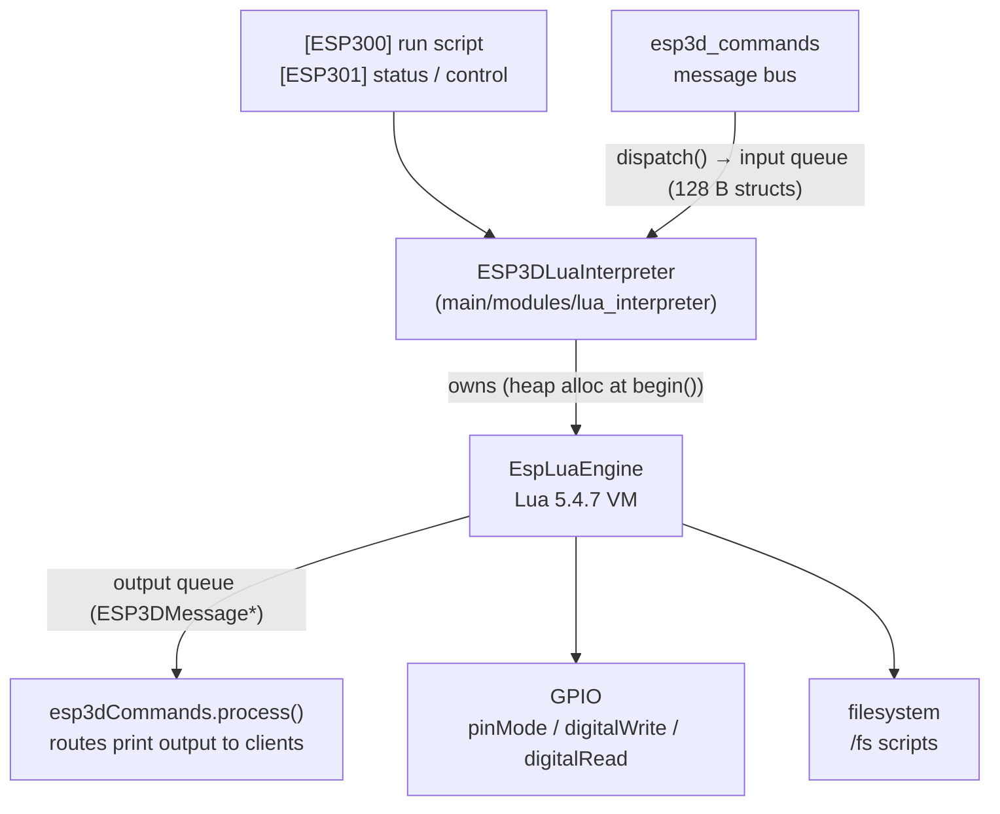

# lua_engine

## Overview

The **lua_engine** feature embeds a **Lua 5.4 scripting engine** in the pendant firmware, allowing user scripts to react to CNC messages and drive GPIO without recompiling. It is gated behind the feature flag `LUA_INTERPRETER_SERVICE` / `ESP3D_LUA_INTERPRETER_FEATURE`.

The feature is split into two layers:

| Layer | Location | Responsibility |
|---|---|---|
| **EspLuaEngine** (IDF component) | `components/EspLuaEngine/` | Lua 5.4.7 VM, pause/resume/stop, function/constant registration |
| **ESP3DLuaInterpreter** (module) | `main/modules/lua_interpreter/` | Script lifecycle, GPIO, filesystem, message-bus integration |

> **Parent module:** [Build_&_Development_Tools](Build_and_Development_Tools.md) — scripting is an extensibility/tooling feature.
> **Note:** the vendored Lua C sources (`components/EspLuaEngine/src/lua-5.4.7/`) are third-party code and intentionally not documented here; this page covers the firmware integration.

---

## Architecture

Scripts run **asynchronously in a dedicated FreeRTOS task**; a hook every 1000 instructions checks pause/stop requests. `handle()` dequeues at most one output message per call to keep stream latency bounded, and `dispatch()` never consumes the source message (normal routing continues).

---

## Usage

- **Run a script**: `[ESP300]/fs/script.lua` — see [esp3d_commands](esp3d_commands.md)
- **Control**: `[ESP301]` status / pause / resume / stop
- **Autostart**: `ESP3D_LUA_AUTOSTART_SCRIPT` (e.g. `"/fs/init.lua"`) in `customizations/lua/customizations.h`

## Lua API exposed to scripts

| Function | Purpose |
|---|---|
| `print(...)` | Output → message bus → connected clients |
| `available()` / `readData()` | Non-blocking read of incoming CNC messages |
| `delay(ms)` / `yield()` / `millis()` | Timing (delay is sliced, checks pause/stop) |
| `pinMode(pin, mode)` / `digitalWrite(pin, v)` / `digitalRead(pin)` | GPIO via IDF driver |

Standard Lua modules loaded: base, table, string, math, utf8. Typical examples (echo CNC responses, button → G-code, LED blink, command + ack-wait) are in the end-user guide below.

---

## Related Design Documents (repository)

- [Lua Interpreter Architecture](https://github.com/luc-github/Pibot-cnc-pendant-firmware/blob/main/docs/architecture/lua_interpreter.md) — task design, queues, lifecycle
- [Lua Scripting Guide](https://github.com/luc-github/Pibot-cnc-pendant-firmware/blob/main/docs/user%20documentation/lua_scripting.md) — end-user guide with examples
