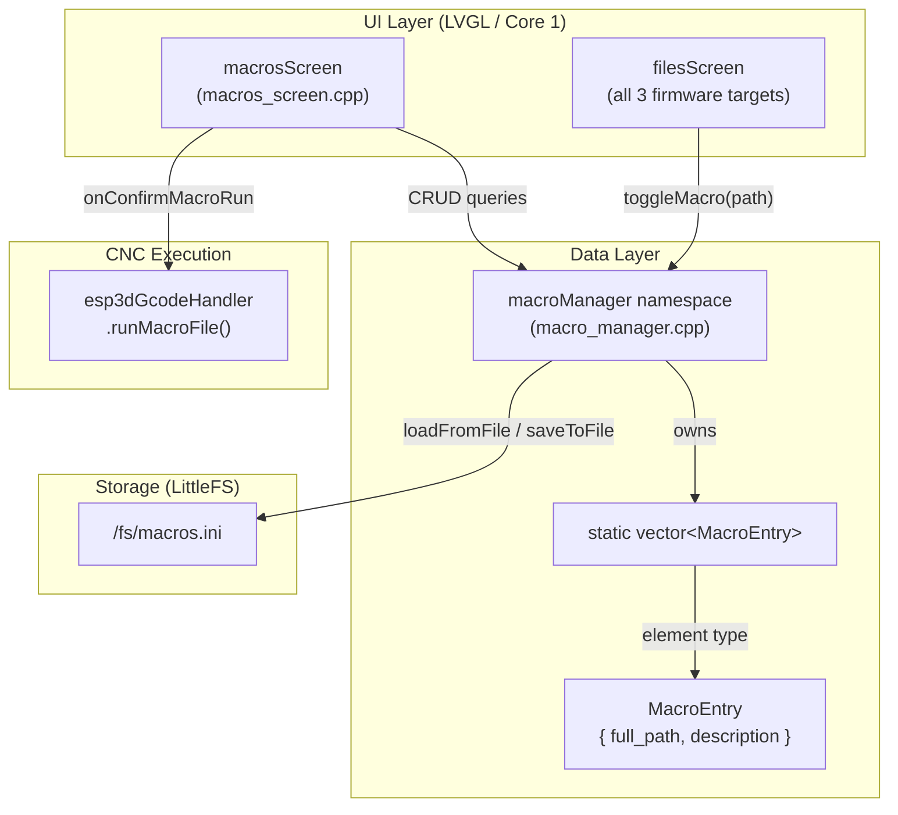
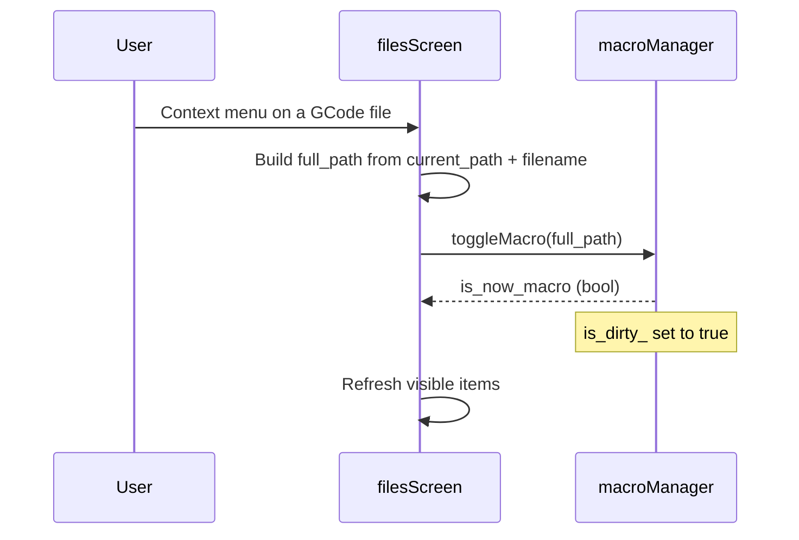
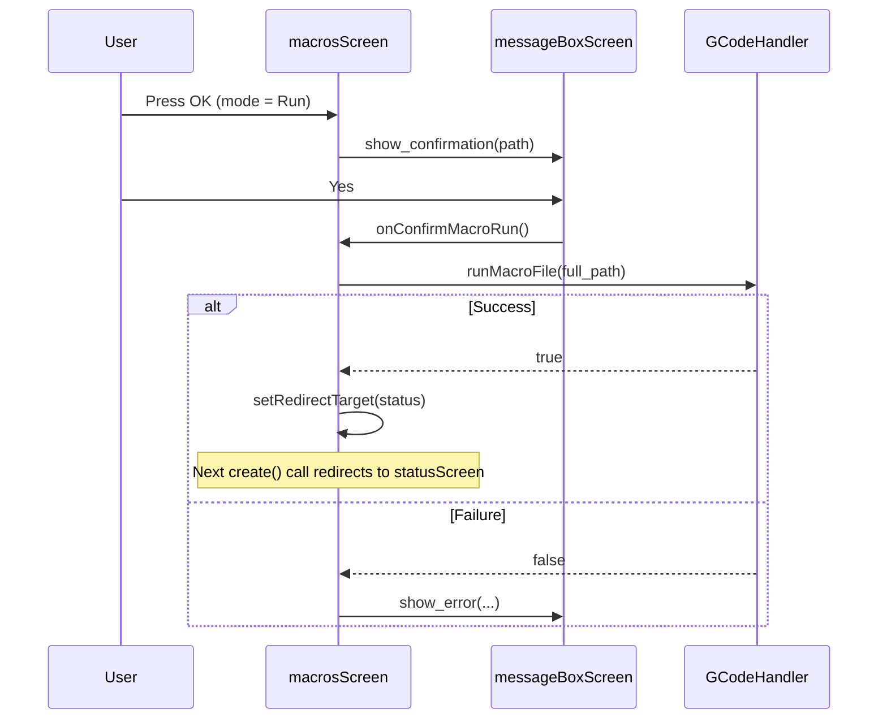
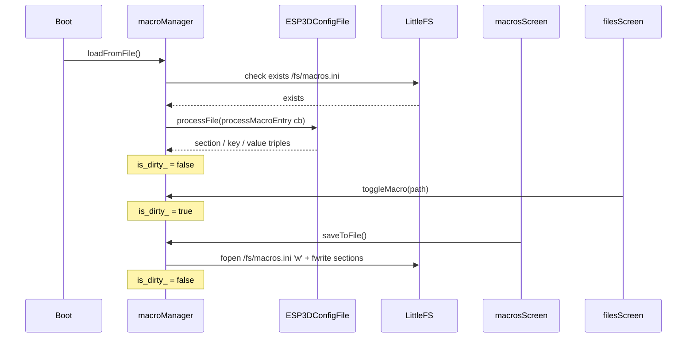
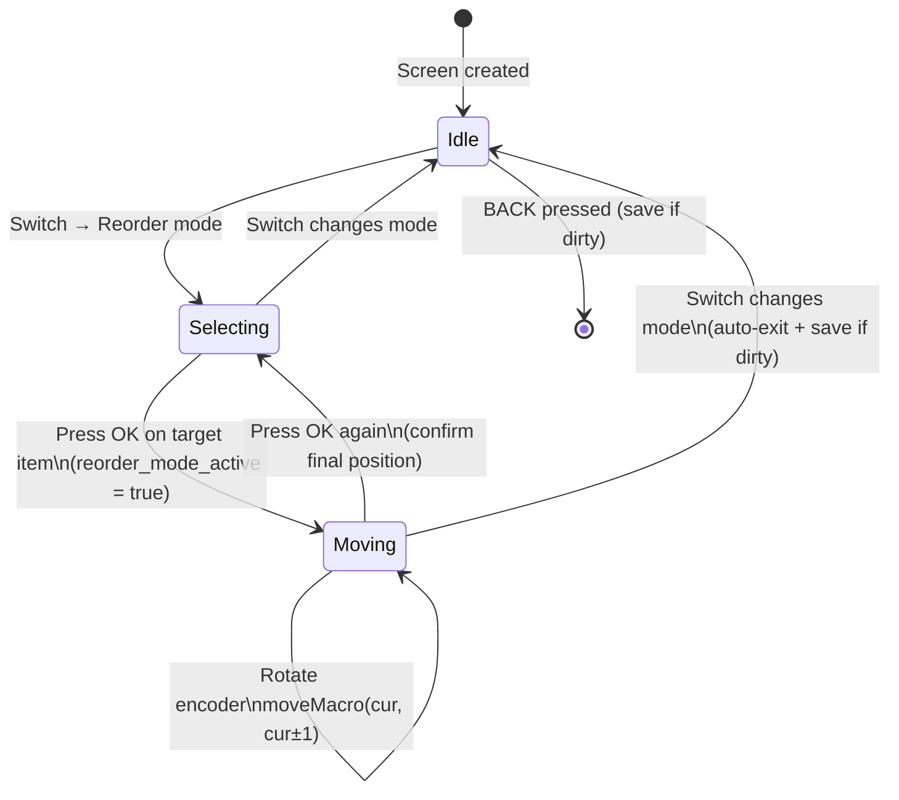

# Macro System

## Introduction

The **macro system** lets the pendant operator register frequently-used GCode files as one-tap shortcuts called *macros*. Once a file is bookmarked as a macro it appears in the dedicated Macros screen, where it can be run, renamed, reordered, or removed without navigating the full file tree every time.

The module is split into two cooperating layers:

| Layer | Location | Responsibility |
|---|---|---|
| `macroManager` namespace | `main/display/cnc/screens/macro_manager.h/.cpp` | In-memory list management + INI persistence |
| `macrosScreen` namespace | `main/display/cnc/screens/macros_screen.cpp` | LVGL user interface built on `ListMenuScreen` |

Both layers are shared across the three supported CNC firmware targets (FluidNC, grbl, grblHAL).

---

## Architecture Overview



---

## Component Descriptions

### `MacroEntry` (data structure)

Defined in `macro_manager.h`.

```cpp
struct MacroEntry {
    std::string full_path;    // e.g. "/jobs/start.gcode"
    std::string description;  // optional human-readable label
};
```

`full_path` is the canonical identifier; `description` is what the UI shows (falls back to the filename when empty).

---

### `macroManager` Namespace

Stateless from the caller's perspective: all state lives in module-static variables inside `macro_manager.cpp`.

#### API Categories

**Query functions** — read-only, safe to call at any time:

| Function | Returns | Description |
|---|---|---|
| `isMacro(path)` | `bool` | True if the path is in the list |
| `getMacroCount()` | `size_t` | Number of registered macros |
| `getMacroAt(index)` | `const MacroEntry*` | Entry at `index`, or `nullptr` |
| `getMacroList()` | `const vector<MacroEntry>&` | Full list reference |

**Modification functions** — set the dirty flag whenever they change the list:

| Function | Returns | Description |
|---|---|---|
| `addMacro(path, desc)` | `bool` | Append; false if already present or list full |
| `removeMacro(path)` | `bool` | Remove by path; false if not found |
| `updateDescription(path, desc)` | `bool` | Edit the description in-place |
| `moveMacro(from, to)` | `bool` | Reorder by indices |
| `toggleMacro(path)` | `bool` | Add if absent, remove if present; returns new macro state |
| `clearAllMacros()` | `void` | Empties the list |

**Persistence functions:**

| Function | Returns | Description |
|---|---|---|
| `loadFromFile()` | `bool` | Parse `/fs/macros.ini` at boot; returns true when file absent |
| `saveToFile()` | `bool` | Write INI; no-op when not dirty |
| `isDirty()` | `bool` | True when in-memory list differs from the last save |
| `markClean()` | `void` | Force-clears dirty flag (used after external file delete) |

#### Capacity Limit

The list is capped at `ESP3D_MAX_MACROS` entries. Attempts to add beyond this limit return `false` and log an error. The same cap is enforced during parsing in `loadFromFile()`.

---

### `macrosScreen` Namespace

Implements the Macros screen using `ListMenuScreen` as its base — title bar + scrollable item list + virtual button row.

See [screen_base_infrastructure.md](screen_base_infrastructure.md) for the general screen class hierarchy and [UI_Framework_&_Screens.md](UI_Framework_and_Screens.md) for the full UI module overview.

#### Screen Layout

```
┌─────────────────────────────┐
│          MACROS             │  ← title bar
├─────────────────────────────┤
│ 🤖  start.gcode            │
│ 🤖  Home all axes           │  ← scrollable macro list
│ 🤖  Tool change             │
│        ...                  │
├─────────────────────────────┤
│ ▶ Run          (mode badge) │  ← footer / mode indicator
├──────┬──────┬───────────────┤
│  OK  │ CLR  │     BACK      │  ← virtual buttons
└──────┴──────┴───────────────┘
```

#### Action Modes

The switch control (hardware rotary switch or footer tap zone on touch-only boards) cycles the screen through four action modes. The current mode is shown in the footer.

| State | Icon | Mode | Behaviour on item press |
|---|---|---|---|
| 0 | `LV_SYMBOL_DRIVE` | **Run** | Confirms, then calls `esp3dGcodeHandler.runMacroFile()` |
| 1 | `LV_SYMBOL_EDIT` | **Edit description** | Opens `inputScreen` text editor |
| 2 | `LV_SYMBOL_LOOP` | **Reorder** | First press selects item; encoder moves it up/down; second press confirms |
| 3 | `LV_SYMBOL_TRASH` | **Remove** | Confirms, then calls `macroManager::removeMacro()` |

> **Note:** The **CLR** button (Button 1) is only visible in **Remove** mode. It triggers a "clear all macros" confirmation dialog.

#### Virtual Buttons

| Button | Label | Action |
|---|---|---|
| 0 | OK / Select | Activates the highlighted item in the current mode |
| 1 | CLR | Clear all macros (visible only in Remove mode) |
| 2 | BACK | Save dirty list, then navigate back to Main screen |

#### Internal Display Entry Type

The screen wraps each macro in a `MacroDisplayEntry` that carries rendering metadata:

```cpp
struct MacroDisplayEntry {
    std::string display_name;  // description if set, else filename
    std::string full_path;     // forwarded to macroManager / gcode handler
    size_t      macro_index;   // index inside macroManager list
    enum class Type : uint8_t { Macro, Info, Error } type;
};
```

`Info` and `Error` rows (e.g. the "No macros" placeholder) are tagged non-selectable via `ui_manager.tagListNodeNonSelectable()`.

---

## Data Flow

### 1 — Registering a Macro from the File Browser



`toggleMacro()` is called identically from the files screens of all three CNC firmware targets — see [fluidnc_module_files.md](fluidnc_module_files.md), [grbl_module_files.md](grbl_module_files.md), and [grblhal_module_files.md](grblhal_module_files.md). The list is written to disk the next time `saveToFile()` is triggered — when the Macros screen is exited or after a structural change inside that screen.

---

### 2 — Running a Macro



The redirect mechanism (`setRedirectTarget`) is used because screen transitions must always happen from a timer callback, never from inside an event handler. When `messageBoxScreen` calls `macrosScreen::create()` after the user dismisses it, that function detects the redirect and schedules a one-shot timer to create `statusScreen` instead. See [modal_dialog_screens.md](modal_dialog_screens.md) for the full modal pattern.

---

### 3 — Persistence Lifecycle



---

### 4 — Reorder Flow



In reorder mode, the encoder intercept callback (`encoderInterceptCallback`) takes priority over list navigation. The selected item's icon changes from the robot symbol to `LV_SYMBOL_LOOP` to give the operator visual feedback that an item is being moved.

---

## INI File Format

The persistence file is stored at `/fs/macros.ini` on the LittleFS partition (mounted at `/fs`).

```ini
[macro_0]
path=/jobs/init.gcode
desc=

[macro_1]
path=/macros/home_all.nc
desc=Home all axes

[macro_2]
path=/jobs/tool_change.nc
desc=Tool change sequence
```

Sections are named `macro_<index>`. The `desc` key may be empty. Parsing is handled by `ESP3DConfigFile` (see [config_file.md](config_file.md)) through the `processMacroEntry` static callback, which accumulates `path` and `desc` fields per section and appends a `MacroEntry` to the in-memory vector each time a new section boundary is encountered.

---

## Memory Safety Considerations

Running on the ESP32's constrained heap requires explicit defensive coding throughout this module.

| Risk | Mitigation |
|---|---|
| `std::vector::emplace_back` throws `std::bad_alloc` | All `emplace_back` calls are wrapped in `try/catch`; partial lists are kept rather than crashing |
| `new ListMenuScreen` allocation failure | Allocated with `std::nothrow`; a validity check guards all subsequent use |
| List grows unbounded | Hard cap at `ESP3D_MAX_MACROS`; enforced in both `addMacro()` and `loadFromFile()` |
| LVGL object deletion inside event callback | Screen follows the timer-based destruction pattern — objects are deleted only via `cleanup_timer_cb` / `transition_timer_cb`, never directly inside event handlers |
| `std::string` in `saveToFile()` | Section headers use `snprintf` into a fixed `char[32]` buffer; path/desc lines are `std::string` but the write loop breaks immediately on `fwrite` failure |

See [`docs/guides/esp32_memory_constraints.md`](https://github.com/luc-github/Pibot-cnc-pendant-firmware/blob/main/docs/guides/esp32_memory_constraints.md) for general heap management guidance applicable to this module.

---

## Integration Points

| Module | How it connects |
|---|---|
| **filesScreen** (FluidNC / grbl / grblHAL) | Calls `macroManager::toggleMacro()` from the file context menu to add/remove macro bookmarks; see [fluidnc_module_files.md](fluidnc_module_files.md), [grbl_module_files.md](grbl_module_files.md), [grblhal_module_files.md](grblhal_module_files.md) |
| **ListMenuScreen / screen infrastructure** | `macrosScreen` is composed on top of `ListMenuScreen`; see [screen_base_infrastructure.md](screen_base_infrastructure.md) |
| **inputScreen** | Launched by `macrosScreen` when editing a description in Edit mode; see [modal_dialog_screens.md](modal_dialog_screens.md) |
| **messageBoxScreen** | Used for run / remove / clear-all confirmation dialogs and error reporting; see [modal_dialog_screens.md](modal_dialog_screens.md) |
| **statusScreen** | `macrosScreen` redirects here after a successful macro launch; see [status_screen.md](status_screen.md) |
| **ESP3DConfigFile** | Drives INI parsing in `loadFromFile()` via the `processMacroEntry` callback; see [config_file.md](config_file.md) |
| **globalFs** | Raw `fopen` / `fwrite` / `close` for `saveToFile()`; `exists()` / `remove()` for the clear-all path; see [filesystem.md](filesystem.md) |
| **esp3dGcodeHandler** | Target-specific handler that routes the macro file to the CNC firmware; see [gcode_host.md](gcode_host.md) |
| **ESP3DTranslationService** | All user-visible strings (mode labels, confirmations, errors) fetched via `esp3dTranslationService.translate()`; see [translations.md](translations.md) |

---

## LVGL Threading Notes

The macro system runs entirely on **Core 1** inside the LVGL task. All calls to `macroManager` functions originate from UI event handlers and are therefore single-threaded; no mutex is needed for the `macro_list_` vector.

`loadFromFile()` is called once during system startup, before the LVGL task takes over, so it is safe at that point.

`saveToFile()` is always triggered from within LVGL callbacks (button release, mode switch) — always on Core 1.

See [UI_Framework_&_Screens.md](UI_Framework_and_Screens.md) for the broader LVGL threading model and the Core 0 / Core 1 separation.


## Documents de conception (depot)

- [macros_screen](https://github.com/luc-github/Pibot-cnc-pendant-firmware/blob/main/docs/ux_flows/grblhal/macros_screen.md)
