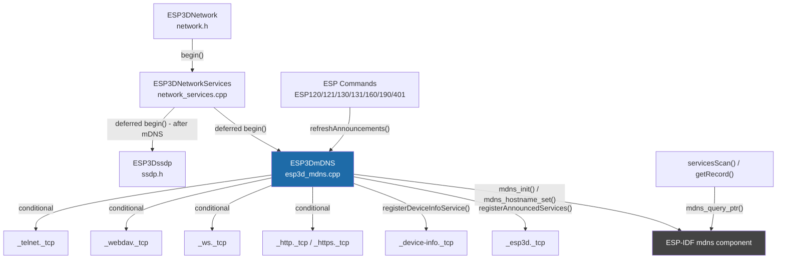
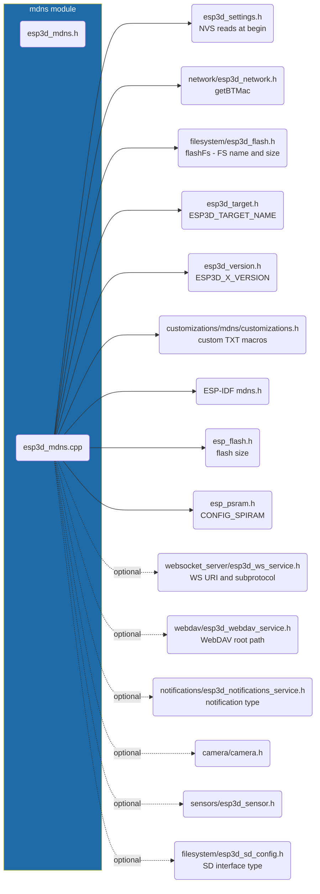
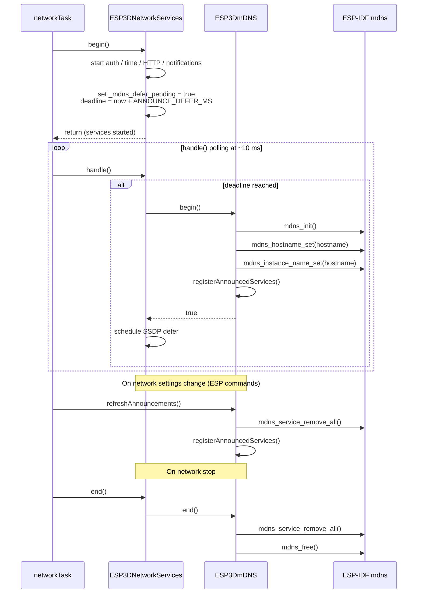
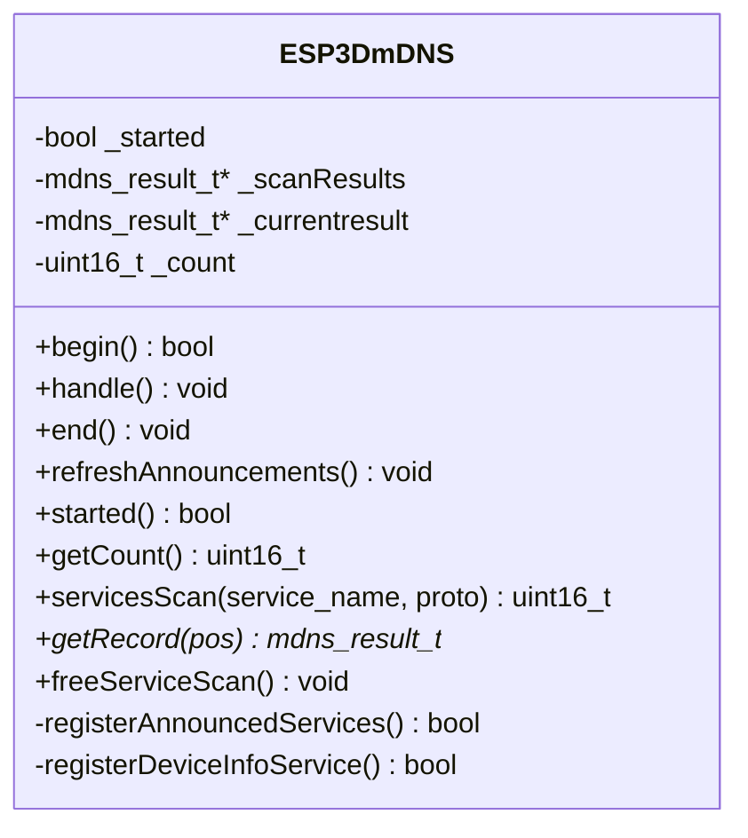
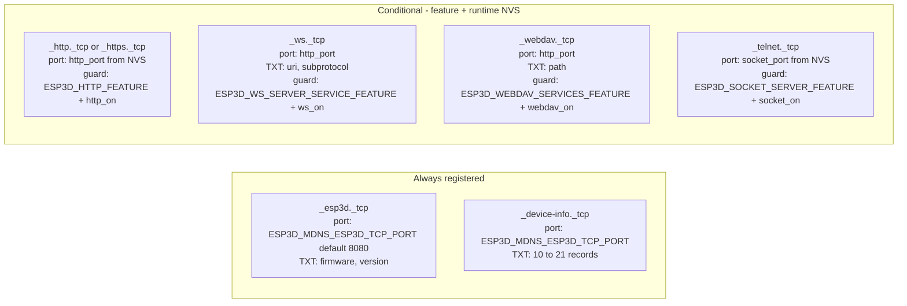
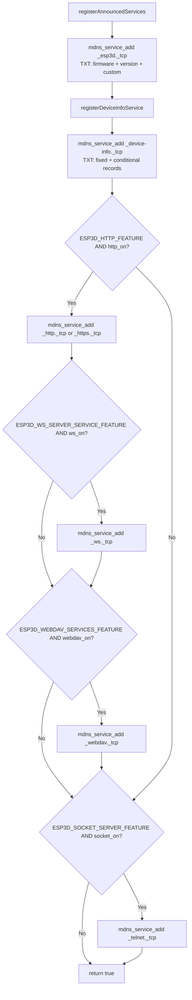
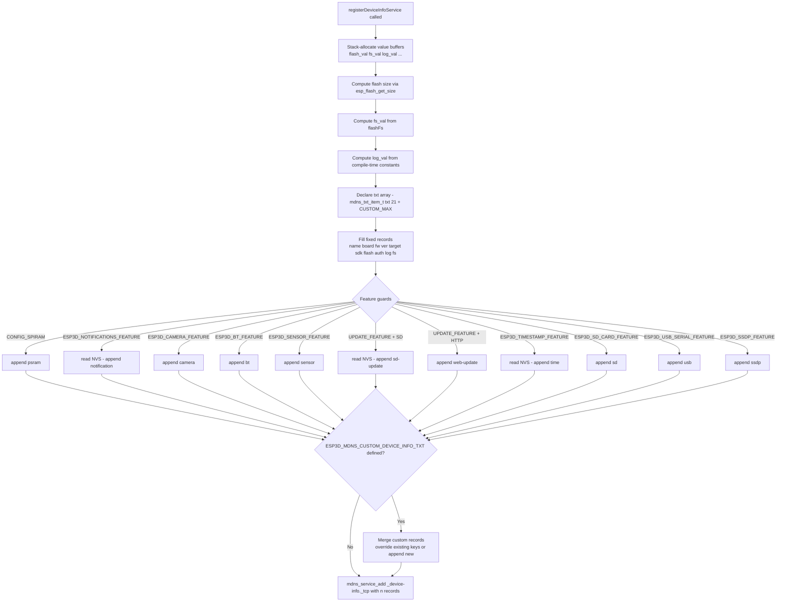
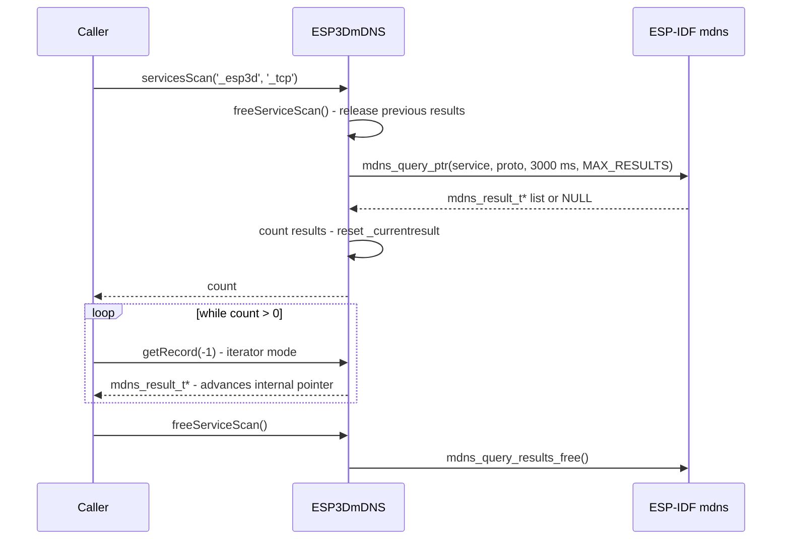
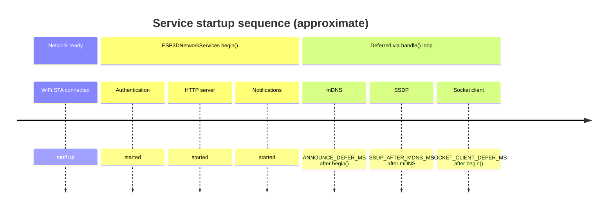

# mDNS Module — ESP3D-X

The mDNS module (`ESP3DmDNS`) makes the pendant visible to other devices on the local network without any manual IP address configuration. After WiFi connects, it registers the device under its hostname (e.g. `pendant.local`) and advertises all active services — HTTP, WebSocket, WebDAV, socket server — as standard mDNS service records. It also exposes a rich `_device-info._tcp` record that encodes compile-time and NVS-sourced device metadata useful for discovery tools and integrations. The module additionally provides a scan API so the firmware itself can discover other ESP3D devices on the network.

**Build guard:** `ESP3D_MDNS_FEATURE`

---

## Architecture overview



---

## Module dependencies



---

## Lifecycle and startup sequence

mDNS is **not started immediately** during `ESP3DNetworkServices::begin()`. It is deferred by `ESP3D_NETSERVICE_ANNOUNCE_DEFER_MS` milliseconds to allow lwIP and the network stack to settle after WiFi association. The `handle()` loop fires the actual `begin()` once the deadline passes.

SSDP (see [ssdp.md](ssdp.md)) starts a further `ESP3D_NETSERVICE_SSDP_AFTER_MDNS_MS` milliseconds after mDNS completes, sequencing the two announcement protocols to avoid simultaneous heap pressure.



---

## Class API



### Method reference

| Method | Description |
|---|---|
| `begin()` | Initialises the ESP-IDF mDNS stack, sets hostname and instance name, then registers all services. Calls `end()` first if already started. |
| `end()` | Removes all registered services, frees the mDNS stack, frees any pending scan results. Safe to call when not started. |
| `handle()` | No-op placeholder — reserved for future periodic work. Called by `ESP3DNetworkServices::handle()`. |
| `refreshAnnouncements()` | Calls `mdns_service_remove_all()` then re-runs `registerAnnouncedServices()`, re-reading NVS. Falls back to a full `end()`/`begin()` cycle if `remove_all` fails. |
| `servicesScan(service, proto)` | Queries the network for a given service type (default `_esp3d._tcp`), blocks up to 3 000 ms, and populates the internal result list. Returns record count. |
| `getRecord(pos)` | Returns record at index `pos`, or the next record in sequence when `pos == -1` (iterator mode). Returns `nullptr` if out of range or not started. |
| `freeServiceScan()` | Releases all scan results via `mdns_query_results_free()` and resets the iterator. |

---

## Registered mDNS services



### Registration call sequence



---

## `_device-info._tcp` TXT records

### Fixed records (always present)

| Key | Value | Source |
|---|---|---|
| `name` | Device hostname | `esp3dWifiClient.getHostName()` |
| `board` | Chip architecture | `CONFIG_IDF_TARGET` (e.g. `"esp32"`, `"esp32s3"`) |
| `fw` | Firmware base | `ESP3D_CODE_BASE` (`"ESP3D-X"`) |
| `ver` | Firmware version | `ESP3D_X_VERSION` (e.g. `"2.0.0.a14"`) |
| `target` | CNC firmware target | `ESP3D_TARGET_NAME` (e.g. `"FluidNC"`, `"grblHAL"`) |
| `sdk` | ESP-IDF version | `IDF_VER` (e.g. `"v5.4.3"`) |
| `flash` | Flash chip size | `esp_flash_get_size()` (e.g. `"16.00 MB"`) |
| `auth` | Authentication state | `"enabled"` / `"disabled"` — compile-time `ESP3D_AUTHENTICATION_FEATURE` |
| `log` | Log backend/level | compile-time `ESP3D_LOG_BACKEND` + `ESP3D_LOG` (e.g. `"serial/debug"`, `"none"`) |
| `fs` | Flash FS name + total size | `flashFs.getFileSystemName()` + `getSpaceInfo()` (e.g. `"LittleFS/1.44 MB"`) |

#### `log` value format

Format: `"<backend>/<level>"` or `"none"` when logging is fully disabled (`ESP3D_LOG == 0`).

| Backend token | Compile condition |
|---|---|
| `serial` | `ESP3D_LOG_BACKEND_SERIAL` (default) |
| `sd` | `ESP3D_LOG_BACKEND_SD` |
| `uart2` | `ESP3D_LOG_BACKEND_UART2` |
| `telnet` | `ESP3D_LOG_BACKEND_TELNET` |
| `websocket` | `ESP3D_LOG_BACKEND_WEBSOCKET` |

| Level token | Compile condition |
|---|---|
| `all` | `ESP3D_LOG >= ESP3D_LOG_LEVEL_ALL` (4) |
| `debug` | `ESP3D_LOG >= ESP3D_LOG_LEVEL_DEBUG` (3) |
| `warning` | `ESP3D_LOG >= ESP3D_LOG_LEVEL_WARNING` (2) |
| `error` | `ESP3D_LOG >= ESP3D_LOG_LEVEL_ERROR` (1) |

See [esp3d_log.md](esp3d_log.md) for the full logging reference.

### Conditional records

A record is absent when the feature is not compiled in, or when the NVS setting reports it is inactive.

| Key | Example value | Gate | Source |
|---|---|---|---|
| `psram` | `"8.00 MB"` | `CONFIG_SPIRAM` | `esp_psram_get_size()` |
| `notification` | `"telegram"` / `"email"` / `"pushover"` / `"ifttt"` / `"whatsapp"` / `"homeassistant"` | `ESP3D_NOTIFICATIONS_FEATURE` **and** type ≠ none (NVS) | `esp3d_notification_type` setting |
| `camera` | `"ESP32 Cam"` | `ESP3D_CAMERA_FEATURE` | `esp3d_camera.GetModelString()` |
| `bt` | `"pendant/AA:BB:CC:DD:EE:FF"` | `ESP3D_BT_SERIAL_FEATURE` or `ESP3D_BT_BLE_FEATURE` | hostname + `esp3dNetwork.getBTMac()` |
| `sensor` | `"DHT22"` / `"BMP280"` / `"BME280"` / `"ANALOG"` | `ESP3D_SENSOR_FEATURE` | `ESP3DSensor::getModelString()` |
| `sd-update` | `"ON"` / `"OFF"` | `ESP3D_UPDATE_FEATURE` + `ESP3D_SD_CARD_FEATURE` (NVS) | `esp3d_check_update_on_sd` |
| `web-update` | `"enabled"` | `ESP3D_UPDATE_FEATURE` + `ESP3D_HTTP_FEATURE` (compile-time) | — |
| `time` | `"ntp"` / `"manual"` | `ESP3D_TIMESTAMP_FEATURE` (NVS) | `esp3d_use_internet_time` |
| `sd` | `"SPI"` / `"SDIO"` | `ESP3D_SD_CARD_FEATURE` (compile-time via board config) | `esp3dSdConfig.interface_type` |
| `usb` | `"enabled"` | `ESP3D_USB_SERIAL_FEATURE` (compile-time) | — |
| `ssdp` | `"enabled"` | `ESP3D_SSDP_FEATURE` (compile-time) | — |

> **`notification`**: absent when type is `none`. A missing record means no active notification channel — not that the feature is absent.

> **`bt`**: Bluetooth and WiFi are mutually exclusive on boards without PSRAM. When BT is active, WiFi is off and mDNS does not run; this record is reserved for future dual-radio capable boards. See [Network_&_Web_Services.md](Network_and_Web_Services.md) for the feature resource model.

---

## TXT record build flow



---

## Customization

Board-level and project-level custom TXT records are injected at compile time through `customizations/mdns/customizations.h`. The same header is present in each board's `customizations/` directory, so board-specific overrides take precedence over the project-level defaults.

### Macros

| Macro | Applies to | Effect |
|---|---|---|
| `ESP3D_MDNS_CUSTOM_ESP3D_TXT` | `_esp3d._tcp` | List of `{ "key", "value" }` entries. Keys already in the built-in list replace their value; new keys are appended. |
| `ESP3D_MDNS_CUSTOM_ESP3D_TXT_MAX` | `_esp3d._tcp` | Stack-allocation size for custom entries. Must equal the number of entries in `ESP3D_MDNS_CUSTOM_ESP3D_TXT`. Default: `0`. |
| `ESP3D_MDNS_CUSTOM_DEVICE_INFO_TXT` | `_device-info._tcp` | Same merge behaviour — override or append. Built-in keys that can be overridden: `name`, `board`, `fw`, `ver`, `target`, `sdk`, `flash`, `auth`, `log`, `fs`, `psram`, `notification`, `camera`, `bt`, `sensor`, `sd-update`, `web-update`, `time`, `sd`, `usb`, `ssdp`. |
| `ESP3D_MDNS_CUSTOM_DEVICE_INFO_TXT_MAX` | `_device-info._tcp` | Stack-allocation ceiling. Each entry costs 8 bytes on ESP32 (two pointers). Default: `0`. |
| `ESP3D_MDNS_ESP3D_TCP_PORT` | Both services | Discovery port for `_esp3d._tcp` and `_device-info._tcp`. Default: `8080`. Override at compile time if needed; not tied to the HTTP listen port. |

### Example: add a `vendor` record

```c
// customizations/mdns/customizations.h
#define ESP3D_MDNS_CUSTOM_DEVICE_INFO_TXT_MAX 2
#define ESP3D_MDNS_CUSTOM_DEVICE_INFO_TXT \
    { "vendor", "MyCompany" },            \
    { "model",  "My Custom Board" },
```

> All string values **must be compile-time string literals**. No heap is allocated during TXT registration; all buffers are stack-local inside `registerDeviceInfoService()` and are consumed by `mdns_service_add()` before the function returns.

---

## Scan API: discovering other ESP3D devices

`ESP3DmDNS` doubles as a client scanner. Any code can query the local network for other ESP3D devices and iterate over the results.



`getRecord(pos)` also supports direct indexed access: pass a non-negative `pos` to walk the linked list by index.

The scan blocks for up to 3 000 ms while waiting for PTR responses. Callers must not run this from the LVGL task — use a background FreeRTOS task instead.

---

## Integration with ESP commands

Several ESP commands call `refreshAnnouncements()` immediately after persisting a network setting change, so the mDNS advertisement stays consistent without a full reboot.

| Command | Trigger |
|---|---|
| `[ESP120]` | WiFi mode change |
| `[ESP121]` | HTTP port or HTTP on/off |
| `[ESP130]` | WiFi SSID / credential change |
| `[ESP131]` | WiFi password change |
| `[ESP160]` | Notification type change |
| `[ESP190]` | Factory reset / hostname change |
| `[ESP401]` | Generic setting write (hostname, WS, HTTP, etc.) |

`refreshAnnouncements()` is guarded by `if (esp3dmDNS.started())` in every call site — it is a no-op when mDNS is not running (e.g. during initial boot before the deferred start fires).

---

## Memory design

All TXT value buffers are **stack-allocated** inside `registerDeviceInfoService()`:

| Buffer | Size | Purpose |
|---|---|---|
| `flash_val[16]` | 16 B | Flash chip size string |
| `fs_val[32]` | 32 B | FS name + size string |
| `log_val[20]` | 20 B | Log backend/level string |
| `psram_val[16]` | 16 B | PSRAM size (conditional) |
| `bt_val[52]` | 52 B | BT hostname + MAC (conditional) |
| `txt[21 + CUSTOM_MAX]` | varies | `mdns_txt_item_t` pointer pairs |

All buffers are consumed by `mdns_service_add()` inside the same stack frame. The ESP-IDF mDNS stack copies the strings internally before the call returns, so no heap allocation is needed and no dangling-pointer risk exists.

The maximum built-in TXT slot count is **21**. This must be incremented in the array declaration when adding new built-in records.

---

## Relationship to SSDP

mDNS and SSDP serve the same device-discovery purpose for different protocols (mDNS/DNS-SD for Bonjour/Avahi clients; SSDP/UPnP for Windows and other UPnP clients). They are always started in sequence — mDNS first, then SSDP — to avoid simultaneous heap pressure from two large network initialisations. See [Network_&_Web_Services.md](Network_and_Web_Services.md) for the network services module overview.



---

## Files

| File | Role |
|---|---|
| `main/modules/mdns/esp3d_mdns.h` | `ESP3DmDNS` class declaration; `ESP3D_MDNS_ESP3D_TCP_PORT` default |
| `main/modules/mdns/esp3d_mdns.cpp` | `begin()`, `end()`, `refreshAnnouncements()`, `registerAnnouncedServices()`, `registerDeviceInfoService()`, scan API |
| `customizations/mdns/customizations.h` | Project-level custom TXT record macros (default: all disabled) |
| `boards/<board>/customizations/mdns/customizations.h` | Board-specific overrides — takes precedence over project-level |
| `main/modules/network/esp3d_network_services.cpp` | Deferred start orchestration; calls `esp3dmDNS.begin()` / `end()` |
| `main/core/commands/esp120.cpp` … `esp401.cpp` | `refreshAnnouncements()` call sites after setting changes |


## Documents de conception (depot)

- [mdns](https://github.com/luc-github/Pibot-cnc-pendant-firmware/blob/main/docs/features/mdns.md)
