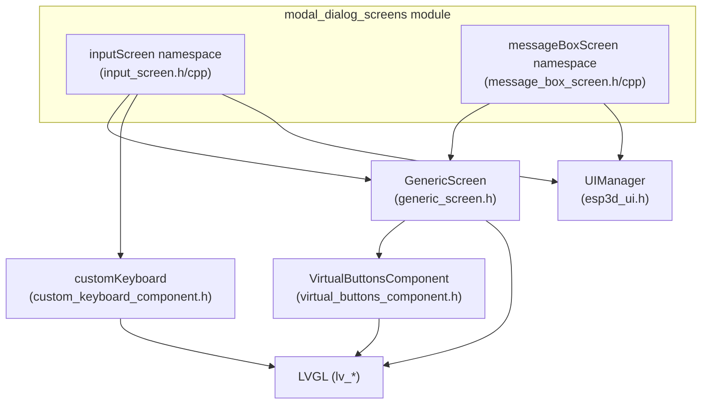
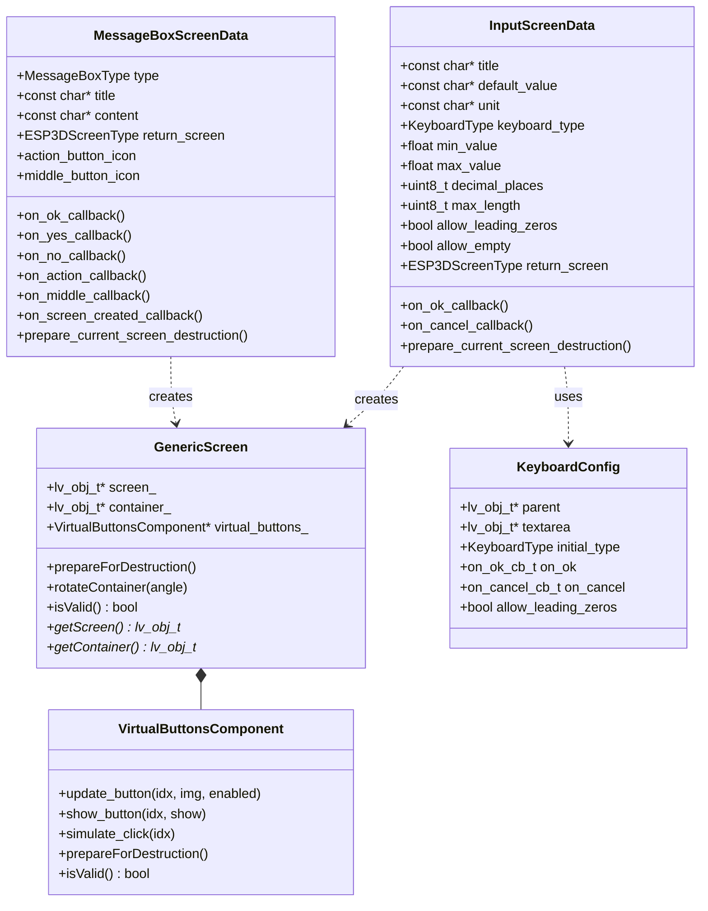
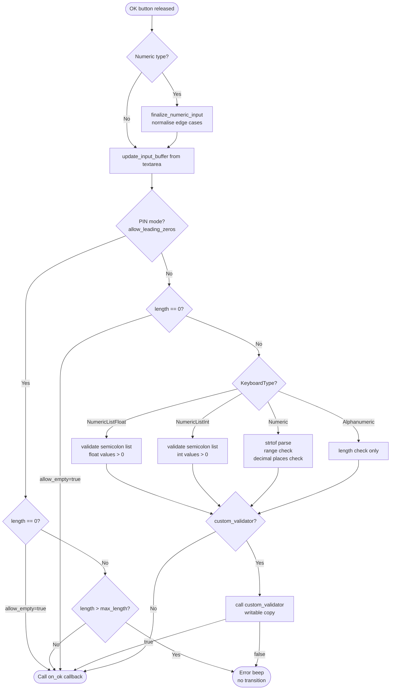
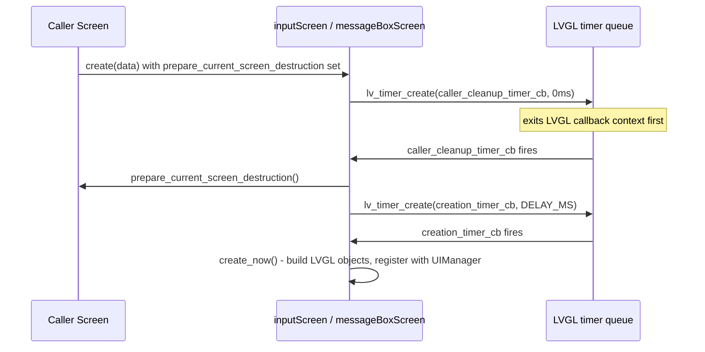
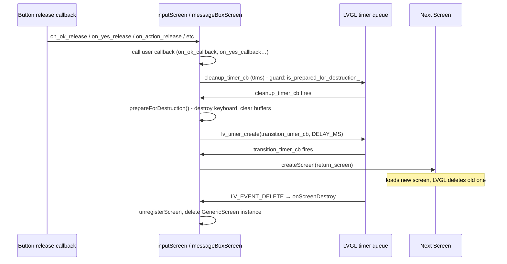
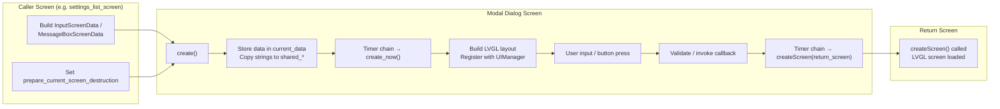

# Modal Dialog Screens

## Overview

The `modal_dialog_screens` module provides two full-screen modal dialog implementations for the
Pibot CNC Pendant firmware UI: an **input screen** for interactive keyboard-based text and numeric
entry, and a **message box screen** for informational, confirmation, and error dialogs. Both screens
follow the same architectural patterns established by `GenericScreen` and `UIManager`, and are
designed to coexist safely within LVGL's single-threaded rendering loop on Core 1.

Both components are consumed across the entire application — from CNC-specific screens (jog, macros,
settings) to system-level flows (Wi-Fi password, BT PIN, firmware update confirmations). They are
never instantiated directly by application code; instead, dedicated convenience functions and a
structured data object (`InputScreenData` / `MessageBoxScreenData`) serve as the public API.

---

## Architecture



Both namespaces (`inputScreen`, `messageBoxScreen`) build on top of `GenericScreen`, which provides
the base LVGL screen object, the content container, and the `VirtualButtonsComponent` row along the
bottom. The `inputScreen` additionally instantiates a `customKeyboard` component inside the
container. `UIManager` is used for screen registration, unregistration, theme-aware styling, and
orientation management.

---

## Component Relationships



---

## Input Screen (`inputScreen`)

### Purpose

`inputScreen` presents a full-screen input dialog with a title, a single-line textarea, and a
virtual keyboard. It supports numeric, alphanumeric, and semicolon-separated list entry, with
configurable range and decimal-place validation. It is the sole mechanism for collecting text or
numeric values from the user across all screens.

### Keyboard Types

| `KeyboardType` enum | Description | Key set |
|---|---|---|
| `Numeric` | Standard numeric input | `0–9`, `.` (optional), `-` (optional), backspace |
| `Alphanumeric` | Full letter + symbol keyboard | A–Z, 0–9, symbols, pages |
| `NumericListFloat` | Semicolon-separated float list | `0–9`, `.`, `;`, backspace |
| `NumericListInt` | Semicolon-separated integer list | `0–9`, `;`, backspace |

For `Numeric` keyboards, the layout is further narrowed at runtime:

- If `decimal_places == 0` → decimal point key hidden → integer-only entry.
- If `min_value >= 0` → minus key hidden → positive-only entry.
- If `allow_leading_zeros == true` → PIN mode; leading zeros are preserved and the
  `LV_EVENT_VALUE_CHANGED` normalisation handler is bypassed.

### Public API

```cpp
namespace inputScreen {

// Full configuration-driven entry point
void create(const InputScreenData& data);

// Convenience wrappers
void show_numeric_input(ESP3DScreenType return_to,
                        const char* title,
                        const char* default_value,
                        const char* unit,
                        void (*on_ok)(const char*, void*),
                        float min_value = 0.0f,
                        float max_value = FLT_MAX,
                        uint8_t decimal_places = 0,
                        void* user_data = nullptr,
                        void (*prepare_cleanup)(void) = nullptr);

void show_text_input(ESP3DScreenType return_to,
                     const char* title,
                     const char* default_value,
                     void (*on_ok)(const char*, void*),
                     uint8_t max_length = 32,
                     void* user_data = nullptr,
                     bool allow_empty = false,
                     void (*prepare_cleanup)(void) = nullptr);

void show_pin_input(ESP3DScreenType return_to,
                    const char* title,
                    const char* default_value,
                    void (*on_ok)(const char*, void*),
                    uint8_t pin_length = 4,
                    void* user_data = nullptr,
                    bool allow_empty = false,
                    void (*prepare_cleanup)(void) = nullptr);

} // namespace inputScreen
```

**`InputScreenData` defaults** — `min_value = 0.0f`, `max_value = FLT_MAX`, `decimal_places = 0`,
`max_length = 32`, `allow_leading_zeros = false`, `allow_empty = false`.

### Validation Logic



### Layout Structure

```
┌─────────────────────────────────┐
│         Title (+ unit)          │  medium font, top-center
│  ┌───────────────────────────┐  │
│  │ Textarea (default_value)  │  │  big font for numeric, medium for text/list
│  └───────────────────────────┘  │
│  ┌───────────────────────────┐  │
│  │                           │  │
│  │   Custom Keyboard         │  │  customKeyboard component
│  │   (type-dependent layout) │  │
│  │                           │  │
│  └───────────────────────────┘  │
│   [OK]         [ ]      [Back]  │  VirtualButtonsComponent
└─────────────────────────────────┘
```

---

## Message Box Screen (`messageBoxScreen`)

### Purpose

`messageBoxScreen` presents a full-screen overlay with a typed title bar, a text content area, and
up to three action buttons. Four dialog types are supported, each with distinct colour coding and
button layout.

### Dialog Types

| `MessageBoxType` | Title bar colour | Button layout | Typical use |
|---|---|---|---|
| `Information` | `accent_active` (blue) | Centre: OK | Notices, status messages |
| `Confirmation` | `accent_select` (darkened) | Left: Yes, Right: No | Destructive action guard |
| `Error` | `accent_alert` (red) + glow outline | Centre: OK | Failure conditions |
| `InformationWithAction` | `accent_active` + glow outline | Left: Action, Centre: Middle (opt), Right: OK | Tool change, file operations |

When `return_screen == ESP3DScreenType::none`, buttons are suppressed entirely — this allows
displaying a non-dismissible progress/status message box.

### Public API

```cpp
namespace messageBoxScreen {

// Full configuration-driven entry point
void create(const MessageBoxScreenData& data);

// Convenience wrappers
void show_information(ESP3DScreenType return_to, const char* title, const char* content,
                      void (*callback)(void*) = nullptr, void* user_data = nullptr,
                      void (*prepare_cleanup)(void) = nullptr);

void show_confirmation(ESP3DScreenType return_to, const char* title, const char* content,
                       void (*on_yes)(void*), void (*on_no)(void*) = nullptr,
                       void* user_data = nullptr,
                       void (*prepare_cleanup)(void) = nullptr);

void show_error(ESP3DScreenType return_to, const char* title, const char* content,
                void (*callback)(void*) = nullptr, void* user_data = nullptr,
                void (*prepare_cleanup)(void) = nullptr);

} // namespace messageBoxScreen
```

### Layout Structure

```
┌──────────────────────────────────┐
│  ╔═══════════ Title ════════════╗ │  accent-coloured title bar (type-dependent)
│  ╚═════════════════════════════╝ │
│                                  │
│                                  │
│          Content text            │  wrapping label, centred, medium font
│                                  │
│                                  │
│  [Action]   [Middle]    [OK]     │  VirtualButtonsComponent (layout varies by type)
└──────────────────────────────────┘
```

---

## Shared Lifecycle Pattern

Both screens implement an identical timer-based lifecycle to ensure safe LVGL object management.
LVGL's single-threaded constraint means that no LVGL object may be destroyed from inside an event
callback; all transitions must be deferred via timers.

### Creation Timer Chain (with caller cleanup)

When a modal dialog is opened from an existing screen that must destroy itself first, a two-stage
timer chain runs:



When no caller cleanup is needed, `create_now()` is called directly without any timer.

Shared strings (`shared_title`, `shared_placeholder`, `shared_unit`) are populated before the timers
fire so that `const char*` pointers passed from stack-allocated caller contexts remain valid across
the delay.

### Dismissal Timer Chain

When the user presses OK, Yes, No, Action, or Cancel, the following sequence runs:



**Guard flags** prevent double-execution: `is_prepared_for_destruction_` blocks any second button
press, and `cleanup_executed_` prevents `prepareForDestruction()` from running twice via the
`ESP3D_PREPARE_DESTRUCTION_GUARD` macro.

### State Variables (per namespace, static)

| Variable | Purpose |
|---|---|
| `transition_timer` | Deferred screen switch timer |
| `cleanup_timer` | Triggers `prepareForDestruction` before transition |
| `caller_cleanup_timer` | Deferred caller screen destruction (0 ms) |
| `creation_timer` | Deferred `create_now()` after caller cleanup |
| `is_prepared_for_destruction_` | Guards against double cleanup / late button presses |
| `cleanup_executed_` | Guards `prepareForDestruction` idempotency |
| `next_screen_target` | Stores target screen type across timer delay |
| `shared_title`, `shared_placeholder`, `shared_unit` | Keep string data alive across timer gaps |

---

## Data Flow



---

## LVGL Safety Constraints

The following rules are enforced throughout both screens, consistent with the project's
[LVGL constraints](https://github.com/luc-github/Pibot-cnc-pendant-firmware/blob/main/CLAUDE.md):

| Rule | Implementation |
|---|---|
| Never destroy LVGL objects inside event callbacks | All destruction deferred via `lv_timer_create` |
| Change detection before updating UI | `is_prepared_for_destruction_` gate on all button handlers |
| No blocking in LVGL task | All timers are 0 ms or `ESP3D_TRANSITION_SCREEN_DELAY_MS` — no blocking waits |
| No dynamic allocation in hot paths | Input buffer uses `std::string`; keyboard created once per screen |
| Guard `std::string` allocations | `std::bad_alloc` is caught in `validate_input()` custom validator path |
| Shared string storage | `shared_title`, `shared_placeholder`, `shared_unit` survive timer gaps without dangling pointers |
| `lv_obj_is_valid()` before use | Applied to `textarea`, `keyboard`, `container` before every LVGL call |

---

## Integration Points

### Called by (consumers)

Both screens are invoked from a wide range of application screens. Refer to the following module
documentation for usage context:

- **[screens_architecture.md](https://github.com/luc-github/Pibot-cnc-pendant-firmware/blob/main/docs/architecture/screens_architecture.md)** — overall screen hierarchy and how modal
  dialogs fit into the navigation flow.
- **[screen_transitions_flow.md](https://github.com/luc-github/Pibot-cnc-pendant-firmware/blob/main/docs/architecture/screen_transitions_flow.md)** — the transition timer pattern and
  `createScreen()` dispatch.
- **[Input_system.md](https://github.com/luc-github/Pibot-cnc-pendant-firmware/blob/main/docs/architecture/Input_system.md)** — how physical encoder and button events are routed into
  the virtual buttons that close these screens.

Key callers include:

| Screen | Uses `inputScreen` | Uses `messageBoxScreen` |
|---|---|---|
| `settings_list_screen` | Wi-Fi SSID/password, BT PIN, server address/port, jog feedrates, steps | Reset confirmation, forget Wi-Fi/BT |
| `macros_screen` | Macro description edit | Confirm run / clear-all / delete |
| `jog_screen` | Custom step value edit | — |
| `status_screen` | Feed/spindle override values | — |
| `files_screen` (all firmware variants) | File rename | Confirm delete, confirm job launch |
| `scan_bt_screen` | BT PIN entry | — |
| `wifi_scan_screen` | Wi-Fi password entry | — |
| `change_tool_screen` (all firmware variants) | Tool offset probe values | Ignore / probe choice |

### Dependencies

| Dependency | Role |
|---|---|
| `GenericScreen` ([screens_architecture.md](https://github.com/luc-github/Pibot-cnc-pendant-firmware/blob/main/docs/architecture/screens_architecture.md)) | Base screen, container, `VirtualButtonsComponent` factory |
| `UIManager` ([ui_style_guide.md](https://github.com/luc-github/Pibot-cnc-pendant-firmware/blob/main/docs/ui_resources/ui_style_guide.md)) | Style application, screen registration, orientation angle |
| `customKeyboard` | Key input, OK/Cancel events, PIN mode |
| `ESP3DScreenType` | Enum identifying registered screens for `UIManager` |
| `esp3d_log` / `esp3d_log_e` | Diagnostic output (verbose / error level) |
| LVGL `lv_timer_*` | Deferred execution for safe object lifecycle |

---

## Usage Examples

### Numeric input — integer, positive only

```cpp
inputScreen::show_numeric_input(
    ESP3DScreenType::settings_list,   // return screen
    "Jog feedrate",                   // title
    current_feedrate.c_str(),         // default value
    "mm/min",                         // unit
    [](const char* value, void* ud) { // OK callback
        saveFeedrate(value);
    },
    1.0f,      // min_value
    10000.0f,  // max_value
    0,         // decimal_places → integer mode
    nullptr,   // user_data
    prepareForDestruction  // caller cleanup
);
```

### Numeric input — float with decimals

```cpp
inputScreen::show_numeric_input(
    ESP3DScreenType::jog,
    "Step size",
    "0.1",
    "mm",
    onStepSaved,
    0.001f, 100.0f,
    3,       // 3 decimal places
    user_data,
    prepareForDestruction
);
```

### PIN input — optional empty (clear PIN)

```cpp
inputScreen::show_pin_input(
    ESP3DScreenType::settings_list,
    translationService.translate(ESP3DLabel::bt_pin),
    current_pin.c_str(),
    onPinSaved,
    4,      // pin_length
    nullptr,
    true,   // allow_empty → clearing the PIN means no authentication
    prepareForDestruction
);
```

### Confirmation dialog

```cpp
messageBoxScreen::show_confirmation(
    ESP3DScreenType::macros,
    translationService.translate(ESP3DLabel::clear_all),
    translationService.translate(ESP3DLabel::clear_all_confirm),
    onConfirmClearAll,   // on_yes
    nullptr,             // on_no (just returns)
    nullptr,
    prepareForDestruction
);
```

### Error dialog — acknowledge only

```cpp
messageBoxScreen::show_error(
    ESP3DScreenType::main,
    "Connection failed",
    error_message.c_str()
    // no callback, no prepare_cleanup needed
);
```

### Information-with-action — tool change

```cpp
MessageBoxScreenData data(
    "Tool Change",                    // title
    message.c_str(),                  // content
    ESP3DScreenType::none,            // return_screen=none → no auto-dismiss
    onProbeButtonClick,               // action button (left)
    nullptr,                          // middle button (unused)
    onIgnoreButtonClick,              // OK button (right)
    user_data,
    prepareForDestruction,
    &probe_b,                         // action button icon
    nullptr,                          // middle button icon
    onScreenCreatedCallback,          // called after LVGL layout is built
    user_data
);
messageBoxScreen::create(data);
```

---

## Related Documentation

- [screens_architecture.md](https://github.com/luc-github/Pibot-cnc-pendant-firmware/blob/main/docs/architecture/screens_architecture.md) — full UI screen hierarchy, `GenericScreen`,
  `UIManager`, `VirtualButtonsComponent`.
- [screen_transitions_flow.md](https://github.com/luc-github/Pibot-cnc-pendant-firmware/blob/main/docs/architecture/screen_transitions_flow.md) — timer-based transition pattern
  (`ESP3D_TRANSITION_START`, `ESP3D_CLEANUP_TIMER_BODY` macros).
- [Input_system.md](https://github.com/luc-github/Pibot-cnc-pendant-firmware/blob/main/docs/architecture/Input_system.md) — hardware button / encoder / touch routing into virtual
  buttons.
- [ui_style_guide.md](https://github.com/luc-github/Pibot-cnc-pendant-firmware/blob/main/docs/ui_resources/ui_style_guide.md) — `ThemeStyles`, `applyLabelStyle`,
  `applyTextareaInputStyle`, colour tokens.
- [theme_palette.md](https://github.com/luc-github/Pibot-cnc-pendant-firmware/blob/main/docs/ui_resources/theme_palette.md) — `accent_active`, `accent_alert`,
  `accent_select`, `accent_action` token values used in the message box title bars.
- [features_ui.md](https://github.com/luc-github/Pibot-cnc-pendant-firmware/blob/main/docs/features/features_ui.md) — which SKUs expose which input/dialog flows.
