# Network & Web Services Module

## Introduction

The **Network & Web Services** module is the central connectivity layer of the Pibot CNC Pendant firmware. It owns the entire radio lifecycle — from raw hardware bring-up through to the application-level services that let the pendant talk to a CNC controller, serve a WebUI, and announce itself on the local network.

The module runs inside a single dedicated FreeRTOS task on **Core 0**, protected by a binary mutex. All sub-services (HTTP server, WebSocket servers, mDNS, SSDP, authentication, NTP, notifications, and CNC transports) are started **only after the selected radio interface is fully operational**, ensuring stable initialization under the ESP32's tight memory constraints.

### Key Responsibilities

| Responsibility | Owner |
|---|---|
| Radio mode state machine (WiFi / Bluetooth / off) | `ESP3DNetwork` |
| FreeRTOS task lifecycle & mutex | `ESP3DXNetwork` / `networkTask` |
| WiFi STA connection, reconnect, static IP | `ESP3DWifiClient` |
| WiFi AP provisioning mode | `ESP3DWifiClient` |
| Bluetooth Classic SPP (serial profile) | `ESP3DBTSerialClient` |
| Bluetooth BLE (GATT client) | `ESP3DBTBleClient` |
| HTTP / HTTPS server & REST handlers | `ESP3DHttpService` |
| WebSocket server — WebUI channel | `ESP3DWebUiService` |
| WebSocket server — binary data channel | `ESP3DWsDataService` |
| mDNS / Bonjour announcements and scan | `ESP3DmDNS` |
| SSDP / UPnP device discovery | `ESP3Dssdp` |
| Session-based authentication | `ESP3DAuthenticationService` |
| NTP time synchronisation | `TimeService` |
| Push notifications (Telegram, email, etc.) | `ESP3DNotificationsService` |
| TCP socket CNC transport (Telnet-style) | `ESP3DSocketClient` |
| WebSocket CNC transport | `ESP3DWebsocketClient` |

---

## Module Architecture

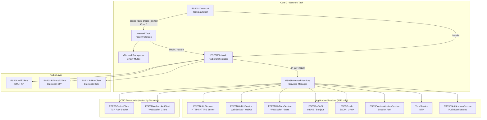

---

## Core Components

### `ESP3DXNetwork` — Task Launcher

**Files:** `main/modules/network/esp3d_x_network.h` / `esp3d_x_network.cpp`

`ESP3DXNetwork` is the entry point called by [`ESP3DX::begin()`](Core_Platform_and_Infrastructure.md) during firmware initialisation. Its sole job is to pin-create the `networkTask` FreeRTOS task and then delegate all periodic work to `ESP3DNetwork::handle()` through the task loop.

```cpp
bool ESP3DXNetwork::begin() {
    // Pins networkTask to NETWORK_TASK_CORE (Core 0)
    BaseType_t res = esp3d_task_create_pinned(networkTask, "tftNetwork",
                                              STACKDEPTH, NULL,
                                              TASKPRIORITY, &xHandle, TASKCORE);
}
```

The global instance `esp3dXnetwork` is used internally by the task loop. No other module calls it directly.

---

### `networkTask` — FreeRTOS Task Body

**File:** `main/modules/network/esp3d_x_network.cpp`

This is the main loop for all network activity. It runs on **Core 0** and never returns.

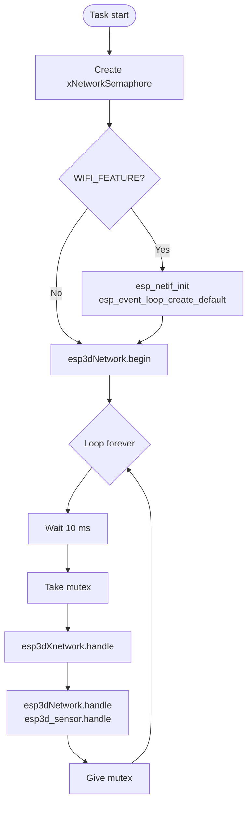

The mutex (`xNetworkSemaphore`) serialises concurrent access. Any other task that calls network APIs must acquire this semaphore first.

---

### `ESP3DNetwork` — Radio Orchestrator

**File:** `main/modules/network/esp3d_network.h`

`ESP3DNetwork` is a **final singleton** (`esp3dNetwork`) that owns the radio-mode state machine. It selects which radio back-end is active and manages all mode transitions.

#### Radio Mode Enum

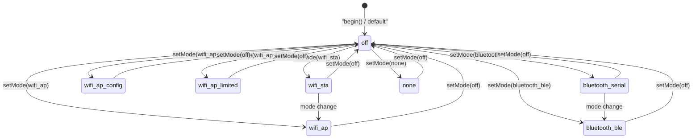

| `ESP3DRadioMode` | Value | Description |
|---|---|---|
| `off` | 0 | Radio disabled |
| `wifi_sta` | 1 | WiFi Station — connects to an existing AP |
| `wifi_ap` | 2 | WiFi Access Point — hosts its own network |
| `wifi_ap_config` | 3 | WiFi AP configuration / captive portal |
| `bluetooth_serial` | 4 | Bluetooth Classic (SPP profile) |
| `bluetooth_ble` | 5 | Bluetooth Low Energy (GATT) |
| `wifi_ap_limited` | 6 | WiFi AP with limited functionality |
| `none` | 7 | Radio initialised but idle |

> ⚠️ **Mutual exclusion:** WiFi and Bluetooth cannot run simultaneously on this hardware (no PSRAM). `cmake/sanity_check.cmake` enforces this at build time. See [`docs/features/feature_resource_matrix.md`](https://github.com/luc-github/Pibot-cnc-pendant-firmware/blob/main/docs/features/feature_resource_matrix.md).

#### Key Methods

| Method | Description |
|---|---|
| `begin()` | Reads mode from NVS settings, starts the configured radio back-end |
| `handle()` | Called every 10 ms — polls the active transport and triggers service updates |
| `end()` | Stops all active services and the radio |
| `setMode(mode, restart)` | Synchronous mode switch; stops current mode, starts new one |
| `setModeAsync(mode)` | Posts a mode change for execution on the next `handle()` tick (safe from callbacks) |
| `getLocalIp()` | Returns `ESP3DIpInfos` (IP + DNS) for the active STA interface |
| `getBTMac()` | Returns the Bluetooth MAC address string |

---

### `ESP3DNetworkServices` — Services Manager

**File:** `main/modules/network/esp3d_network_services.h`

`ESP3DNetworkServices` starts all application-level services once the WiFi stack is ready. It uses **deferred startup** with absolute deadlines to absorb the WiFi IP acquisition delay and avoid tight polling.

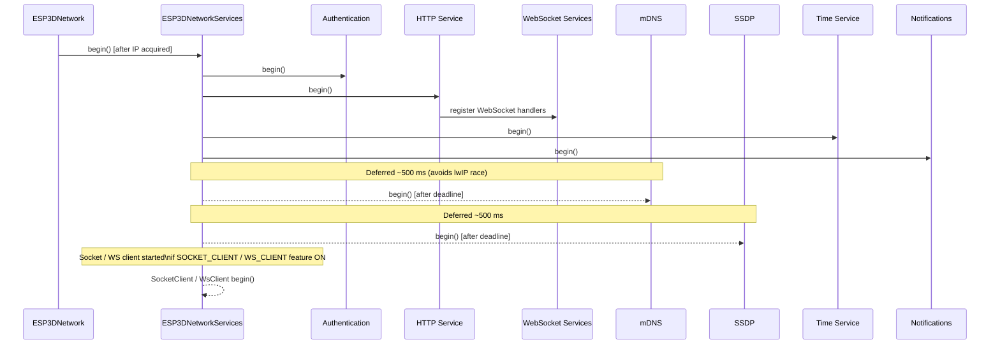

Deferred start state is tracked per-service with boolean flags and `int64_t` deadline timestamps:

```cpp
// Excerpt from ESP3DNetworkServices private members
bool _mdns_defer_pending;
std::int64_t _mdns_defer_deadline_ms;
bool _ssdp_defer_pending;
std::int64_t _ssdp_defer_deadline_ms;
#if ESP3D_SOCKET_CLIENT_FEATURE
bool _socket_client_defer_pending;
std::int64_t _socket_client_defer_deadline_ms;
#endif
```

> ℹ️ `esp3dNetworkServices` is only instantiated when `ESP3D_WIFI_FEATURE` is enabled.

---

## WiFi Sub-module

**Files:** `main/modules/wifi/esp3d_wifi_client.h`, `esp3d_wifi_sta.cpp`, `esp3d_wifi_ap.cpp`

`ESP3DWifiClient` (global `esp3dWifiClient`) manages both the STA and AP netifs through the ESP-IDF WiFi driver. A single FreeRTOS event group (`_s_wifi_event_group`) synchronises connection state with the network task.

### WiFi STA Connection Flow

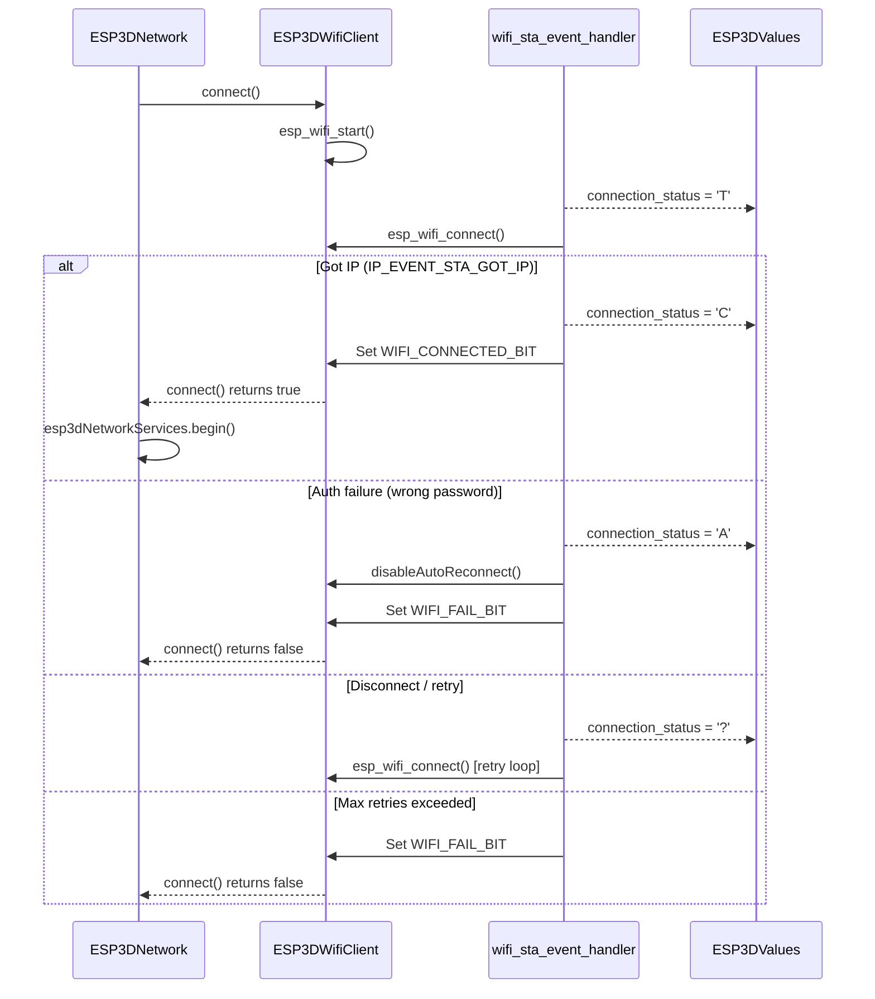

### Connection Status Values

Published to [`ESP3DValues`](Core_Platform_and_Infrastructure.md) (`ESP3DValuesIndex::connection_status`) and consumed by the UI layer (see [UI Framework & Screens](UI_Framework_and_Screens.md)).

| Value | Meaning | Trigger |
|---|---|---|
| `"U"` | Unconnected — no radio active | `ESP3DNetwork::startNoRadioMode()` |
| `"T"` | Trying — STA connection in progress | `WIFI_EVENT_STA_START` handler |
| `"C"` | Connected — IP acquired, services running | `IP_EVENT_STA_GOT_IP` handler |
| `"?"` | Unknown / lost — retrying or timed out | `WIFI_EVENT_STA_DISCONNECTED` / `IP_EVENT_STA_LOST_IP` |
| `"A"` | Auth failed — wrong password, no further retry | `WIFI_REASON_AUTH_FAIL` / `WIFI_REASON_4WAY_HANDSHAKE_TIMEOUT` |

### Auto-Reconnect Logic

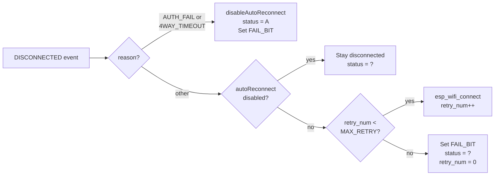

`disableAutoReconnect()` is also set by `userDisconnect()` (user-initiated disconnect via UI). It is cleared on every `WIFI_EVENT_STA_START` event so that explicit mode changes and reboots work normally.

### `ESP3DIpInfos` Structure

```cpp
struct ESP3DIpInfos {
    esp_netif_ip_info_t ip_info;    // IP / netmask / gateway
    esp_netif_dns_info_t dns_info;  // Primary DNS
};
```

Populated by `ESP3DWifiClient::getLocalIp()` and used by the HTTP service, mDNS, and SSDP.

---

## Bluetooth Sub-modules

> ⚠️ WiFi and Bluetooth are **mutually exclusive** on this platform. The CMake build system forbids enabling both simultaneously.

### Bluetooth Classic SPP — `ESP3DBTSerialClient`

**Files:** `main/modules/bt_serial/`  
See [Communication Transports](Communication_Transports.md) for full transport details.

The client implements a four-state connection machine and shares the init-command / auto-reconnect patterns common to all CNC transports:

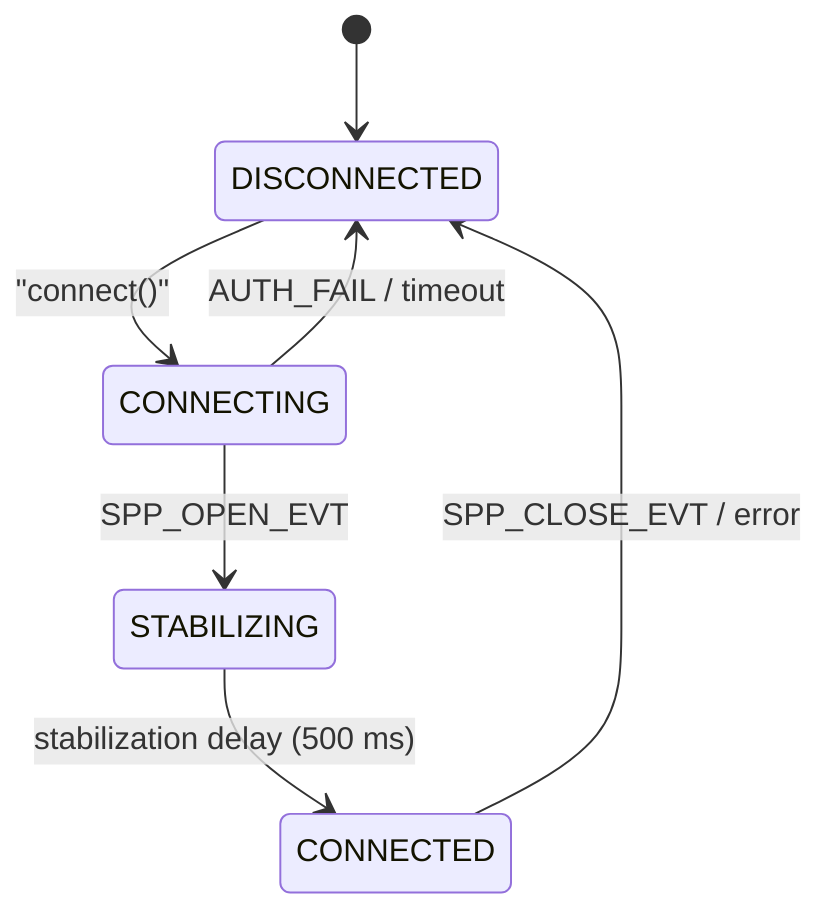

Key implementation details:
- `sendInitCommand()` sent once after `STABILIZING → CONNECTED` transition
- RX line-assembly buffer with 1 500 ms flush timeout (same as UART serial)
- 5 000 ms throttle on init-command retries
- `pthread_mutex_t` protection for TX queue, RX queue, RX buffer, and connection state

### Bluetooth BLE — `ESP3DBTBleClient`

**Files:** `main/modules/bt_ble/`  
See [Communication Transports](Communication_Transports.md) for full transport details.

- Implements GATTC (client) to connect to a CNC controller advertising a UART-over-BLE service
- MTU negotiation (default 23 bytes, max 247 bytes for BTT modules)
- Identical auto-reconnect pattern and init-command protocol to BT Serial

---

## HTTP Service

**Files:** `main/modules/http/`

`ESP3DHttpService` (global `esp3dHttpService`) is an ESP-IDF `httpd`-based server that serves the embedded WebUI, exposes the REST command interface, and hosts WebSocket upgrades for both UI and data channels.

### Registered URL Handlers

| Path | Method(s) | Description |
|---|---|---|
| `/` | GET | Root redirect to WebUI index |
| `/command` | GET / POST | ESP3D command execution |
| `/config` | GET | JSON configuration export |
| `/login` | POST | Session login (auth enabled) |
| `/files` | GET / POST | Flash filesystem browse & upload |
| `/sdfiles` | GET / POST | SD card browse & upload |
| `/updatefw` | POST | OTA firmware / raw partition update |
| `/description.xml` | GET | SSDP UPnP schema (SSDP enabled) |
| `/favicon.ico` | GET | Browser favicon |
| `/ws` | WS Upgrade | WebSocket — WebUI channel |
| `/wsdata` | WS Upgrade | WebSocket — binary data channel |
| `/webdav/*` | DAV verbs | WebDAV file access (WebDAV enabled) |
| `/snap` | GET | Camera snapshot (camera enabled) |

### File Upload Contexts

Multi-part uploads are routed through `PostUploadContext` structs — one per upload destination — allowing each destination to supply its own writer and completion handler:

```cpp
struct PostUploadContext {
    esp_err_t (*writeFn)(const uint8_t *data, size_t datasize,
                         ESP3DUploadState state, const char *filename,
                         size_t filesize);
    esp_err_t (*nextHandler)(httpd_req_t *req);
    uint packetReadSize;
    uint packetWriteSize;
    std::list<std::pair<std::string, std::string>> args;
};
```

Upload destinations: flash filesystem, SD card, OTA firmware, raw partition (`ui_resources`, etc.).

### WebUI PSRAM Cache

When PSRAM is available, `ESP3DWebUiPsramCache` pre-loads WebUI files from flash into PSRAM for faster HTTP serving. A `.gz` compressed variant is preferred over the plain file when both exist.

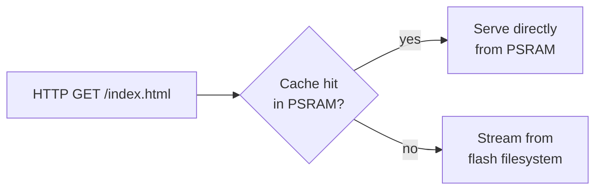

The cache is rebuilt on service start and can be invalidated after an OTA update.

---

## WebSocket Services

**Files:** `main/modules/websocket_server/`

Two WebSocket services are registered as handlers on the HTTP server, differentiated by path.

### `ESP3DWebUiService` — WebUI Channel (`/ws`)

Inherits `ESP3DWsService`. Handles the real-time command/status channel consumed by the embedded browser interface:
- Pushes JSON notifications to connected WebUI clients via `pushNotification()`
- Processes text-format ESP3D commands from browser → CNC pipeline
- Validates authentication sessions on WebSocket open

### `ESP3DWsDataService` — Binary Data Channel (`/wsdata`)

Inherits `ESP3DWsService`. Implements the V1 binary wire protocol for file transfers:

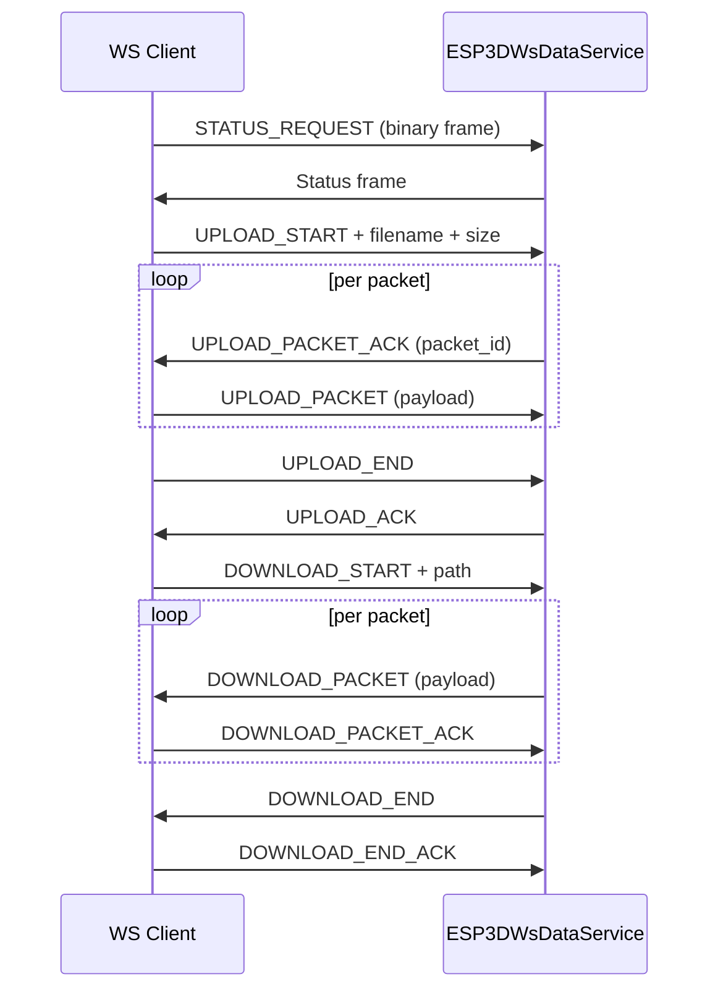

Each connected client is tracked by `ESP3DWebSocketInfos`:

```cpp
struct ESP3DWebSocketInfos {
    int socket_id;
    struct sockaddr_storage source_addr;
    char *buffer;
    uint buf_position;
    char session_id[25];   // populated when ESP3D_AUTHENTICATION_FEATURE is ON
};
```

For the full binary protocol specification, see [`docs/architecture/websockets_protocol.md`](https://github.com/luc-github/Pibot-cnc-pendant-firmware/blob/main/docs/architecture/websockets_protocol.md).

---

## Discovery Services

### mDNS — `ESP3DmDNS`

**File:** `main/modules/mdns/esp3d_mdns.h`

Registers the pendant on the local network under its configured hostname and announces all active services as mDNS TXT records. Also provides a scan API used by the [`server_scan_screen`](UI_Framework_and_Screens.md) to discover nearby ESP3D devices.

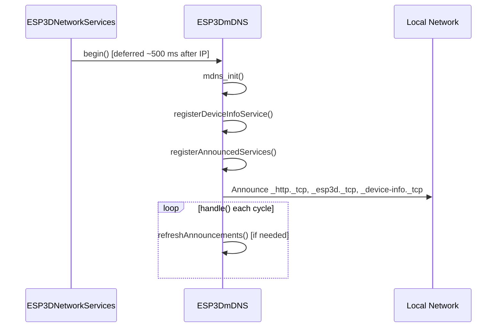

Key methods:

| Method | Description |
|---|---|
| `begin()` | Initialises mDNS and registers all services |
| `refreshAnnouncements()` | Re-registers after a service restart |
| `servicesScan(service, proto)` | Scans for `_esp3d._tcp` peers |
| `getRecord(pos)` | Returns one scan result by index |
| `freeServiceScan()` | Releases scan result memory |

For the full TXT record reference, see [`docs/features/mdns.md`](features/mdns.md).

### SSDP — `ESP3Dssdp`

**Files:** `main/modules/ssdp/esp3d_ssdp.h`, `components/SSDP_IDF/`

Implements UPnP Simple Service Discovery Protocol. Responds to M-SEARCH multicast UDP packets on `239.255.255.255:1900` and serves the device description XML via the HTTP `/description.xml` endpoint.

The SSDP task is configured via `ssdp_config_t` with fields for UPnP UUID, friendly name, model, manufacturer, presentation URL, and service descriptions.

> ⚠️ **Build constraint:** `SSDP_SERVICE` is **forbidden** when `SOCKET_CLIENT_SERVICE` is ON. See `cmake/sanity_check.cmake` and [`docs/features/feature_resource_matrix.md`](https://github.com/luc-github/Pibot-cnc-pendant-firmware/blob/main/docs/features/feature_resource_matrix.md).

---

## Authentication Service

**Files:** `main/modules/authentication/`

`ESP3DAuthenticationService` manages session-based authentication across all connected clients (HTTP, WebSocket, socket server).

### Session Record

```cpp
struct ESP3DAuthenticationRecord {
    ESP3DAuthenticationLevel level;  // guest | user | admin
    int socket_id;
    ESP3DClientType client_type;     // http | ws_webui | ws_data | socket_server
    char session_id[25];
    int64_t last_time;               // last activity timestamp (ms)
};
```

### Session Lifecycle

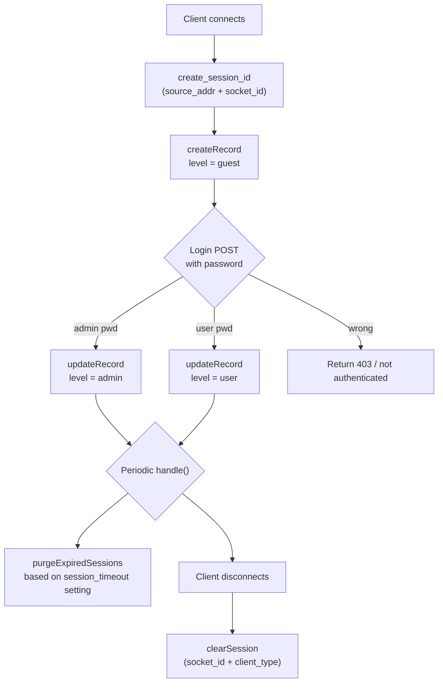

Sessions are protected by `pthread_mutex_t _sessions_mutex` because the list is accessed concurrently from httpd worker threads, the socket server task, the WebSocket service, and `handle()`.

For detailed authentication flows, see [`docs/architecture/authentication_lifecycle.md`](https://github.com/luc-github/Pibot-cnc-pendant-firmware/blob/main/docs/architecture/authentication_lifecycle.md).

---

## Time Service

**File:** `main/modules/time/esp3d_time_service.h`

`TimeService` (global `esp3dTimeService`) configures lwIP SNTP synchronisation and manages the device clock. Supports up to `CONFIG_LWIP_SNTP_MAX_SERVERS` NTP servers and a configurable POSIX timezone string.

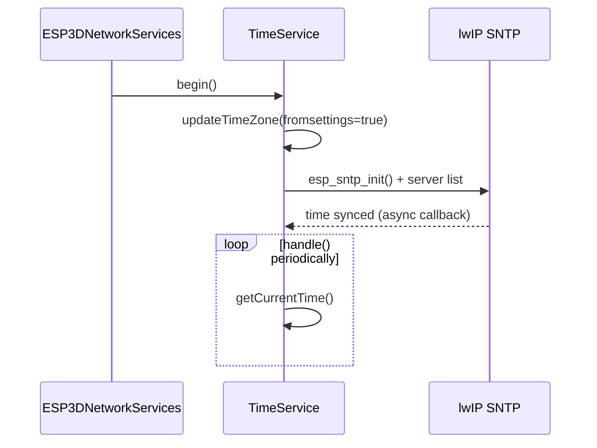

---

## Notifications Service

**File:** `main/modules/notifications/esp3d_notifications_service.h`

`ESP3DNotificationsService` abstracts multiple push-notification back-ends behind a single `sendMSG(title, message)` interface. The active provider is selected from settings during `begin()`.

| Provider class | Channel |
|---|---|
| `TelegramProvider` | Telegram Bot API |
| `EmailNotificationProvider` | SMTP email |
| `IFTTTProvider` | IFTTT Webhooks |
| `PushoverProvider` | Pushover |
| `HomeAssistantProvider` | Home Assistant REST |
| `WhatsAppProvider` | WhatsApp Business API |

Auto-notification on connect is controlled by `_autonotification` flag, settable via HTTP command handler.

For architecture details, see [`docs/architecture/notifications_system.md`](https://github.com/luc-github/Pibot-cnc-pendant-firmware/blob/main/docs/architecture/notifications_system.md).

---

## CNC Network Transports

These transports are started by `ESP3DNetworkServices` when the pendant is configured to reach the CNC controller over WiFi. Only one can be active at a time.

### TCP Socket Client — `ESP3DSocketClient`

**File:** `main/modules/socket_client/esp3d_socket_client.h`  
See [Communication Transports](Communication_Transports.md) for full details. Also see [`docs/architecture/socket_client.md`](architecture/socket_client.md).

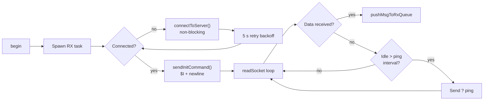

Notable features:
- Self-healing retry loop inside the RX task (no external supervision needed)
- `stopAutoConnect()` prevents reconnect when WiFi SSID/password changes
- Backoff counter for consecutive ECONNRESET errors to give Telnet server time to clear stale sessions
- `_requires_explicit_connect` flag gating auto-start

### WebSocket CNC Client — `ESP3DWebsocketClient`

**File:** `main/modules/websocket_client/esp3d_websocket_client.h`  
See [Communication Transports](Communication_Transports.md) for full details.

- Connects to a WebSocket endpoint on the CNC controller (configurable host, port, path)
- Uses the `esp_websocket_client` IDF component with configurable subprotocol
- Internal `_chunk_queue` bridges the IDF event callback to the RX task safely
- Shares the same init-command (`$I\n`) and inactivity ping patterns as the socket client
- `stopAutoConnect()` / `_requires_explicit_connect` flag mirrors the socket client API

> ⚠️ **Build constraint:** `WS_CLIENT_SERVICE` and `SOCKET_CLIENT_SERVICE` cannot coexist with `WEBUI_SERVER`, `WS_SERVER_SERVICE`, or `SSDP_SERVICE`. See `cmake/sanity_check.cmake`.

---

## Data Flow

### UI → Network → CNC (Command Path)

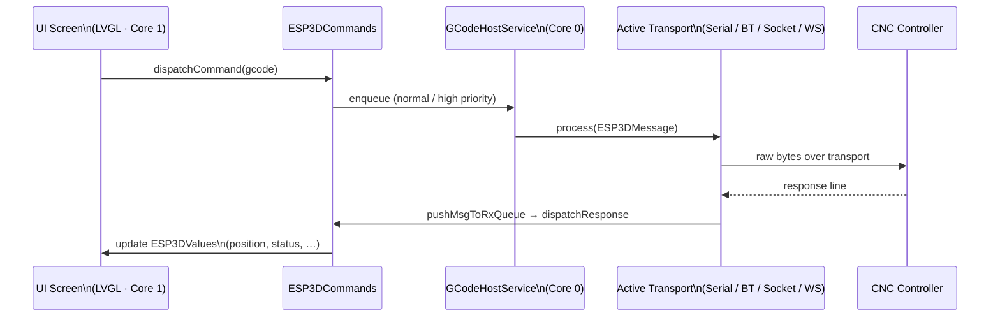

For the full GCode host state machine and flow control details, see:
- [`docs/architecture/gcode_host_architecture.md`](https://github.com/luc-github/Pibot-cnc-pendant-firmware/blob/main/docs/architecture/gcode_host_architecture.md)
- [`docs/architecture/gcode_host_streaming_flow.md`](https://github.com/luc-github/Pibot-cnc-pendant-firmware/blob/main/docs/architecture/gcode_host_streaming_flow.md)

### Network Service Startup Sequence

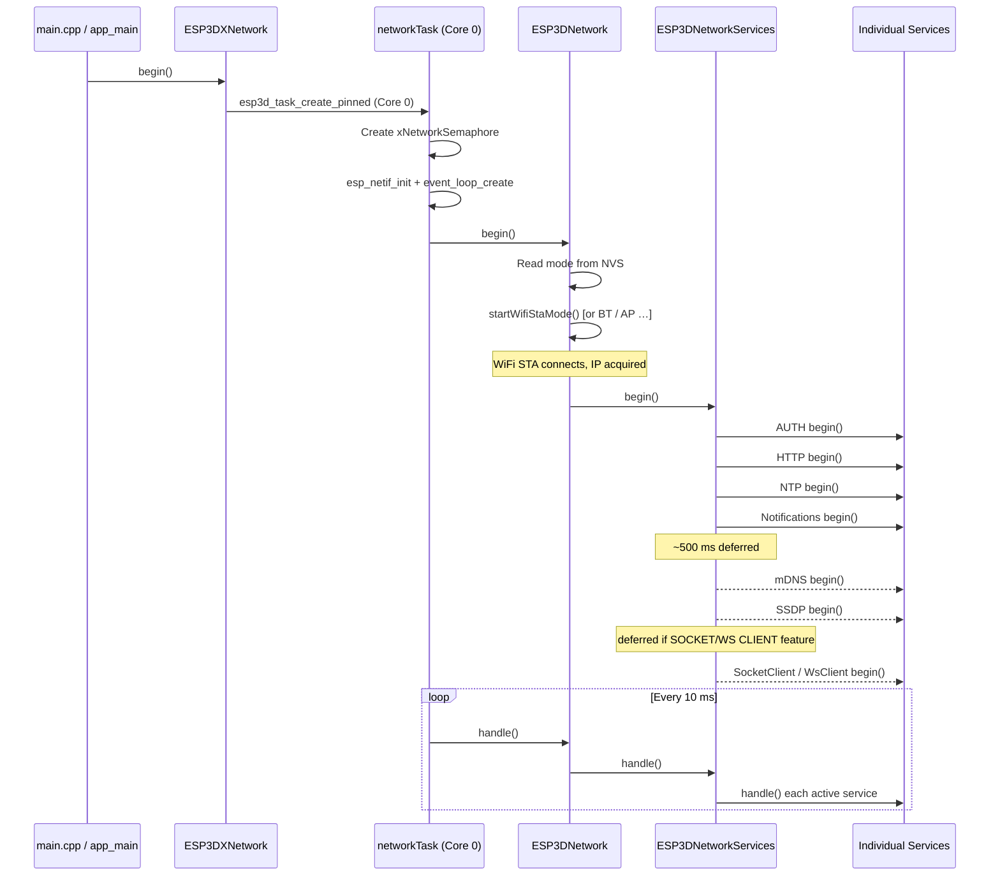

---

## Component Interaction Diagram

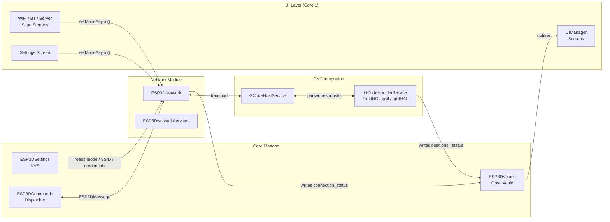

---

## Build Configuration

The network module is entirely feature-gated. Options are set in `CMakeLists.txt` and validated in `cmake/sanity_check.cmake`.

### Feature Flags

| CMake Option | Guard Macro | Effect |
|---|---|---|
| `WIFI_FEATURE` | `ESP3D_WIFI_FEATURE` | WiFi, HTTP, WebSocket server, mDNS, SSDP |
| `BT_SERIAL_FEATURE` | `ESP3D_BT_SERIAL_FEATURE` | Bluetooth Classic SPP transport |
| `BT_BLE_FEATURE` | `ESP3D_BT_BLE_FEATURE` | Bluetooth BLE (GATT) transport |
| `SOCKET_CLIENT_SERVICE` | `ESP3D_SOCKET_CLIENT_FEATURE` | TCP socket CNC transport |
| `WS_CLIENT_SERVICE` | `ESP3D_WS_CLIENT_SERVICE_FEATURE` | WebSocket CNC transport |
| `WEBUI_SERVER` | `ESP3D_WEBUI_SERVER_FEATURE` | Embedded WebUI WebSocket channel |
| `WS_SERVER_SERVICE` | `ESP3D_WS_SERVER_SERVICE_FEATURE` | Binary data WebSocket channel |
| `SSDP_SERVICE` | `ESP3D_SSDP_FEATURE` | SSDP / UPnP discovery |
| `MDNS_FEATURE` | `ESP3D_MDNS_FEATURE` | mDNS / Bonjour |
| `AUTHENTICATION_FEATURE` | `ESP3D_AUTHENTICATION_FEATURE` | Session-based auth |
| `HTTPS_FEATURE` | `ESP3D_HTTPS_FEATURE` | TLS / HTTPS (requires cert + key) |
| `NOTIFICATIONS_FEATURE` | `ESP3D_NOTIFICATIONS_FEATURE` | Push notifications |

### SKU Compatibility Matrix

| Scenario | `SOCKET_CLIENT` | `WEBUI_SERVER` | `SSDP` | `WS_SERVER` |
|---|:---:|:---:|:---:|:---:|
| Serial / USB CNC + WiFi Remote (**default**) | OFF | ✅ ON | ✅ ON | ✅ ON |
| WiFi CNC only (socket client) | ✅ ON | ❌ OFF | ❌ OFF | ❌ OFF |
| Bluetooth CNC | OFF | OFF | OFF | OFF |

> 🔴 `sanity_check.cmake` aborts the build if forbidden combinations are detected.  
> Full compatibility table: [`docs/features/feature_resource_matrix.md`](https://github.com/luc-github/Pibot-cnc-pendant-firmware/blob/main/docs/features/feature_resource_matrix.md).

### Memory Budget

WiFi requires approximately **~200 KB DRAM** at runtime, leaving very little for the rest of the system:

| Configuration | Available Heap (approx.) |
|---|---|
| WiFi active (STA + services) | ~75 KB |
| Bluetooth active | ~10 KB |
| WiFi + HTTP + WebSocket + mDNS | < 50 KB |

Always verify `esp_get_minimum_free_heap_size()` in the boot logs after enabling new services.  
See [`docs/guides/esp32_memory_constraints.md`](https://github.com/luc-github/Pibot-cnc-pendant-firmware/blob/main/docs/guides/esp32_memory_constraints.md) for the full fragmentation playbook, especially the *Serial CNC + WiFi remote — fragmentation playbook* subsection.

---

## Related Documentation

| Document | Description |
|---|---|
| [Communication Transports](Communication_Transports.md) | Serial, USB serial, BT Serial, BT BLE, Socket, WebSocket transports |
| [CNC Firmware Integration](CNC_Firmware_Integration.md) | GCode host service, flow control, firmware-specific parsers |
| [Core Platform & Infrastructure](Core_Platform_and_Infrastructure.md) | ESP3DValues, ESP3DSettings, ESP3DCommands |
| [UI Framework & Screens](UI_Framework_and_Screens.md) | UIManager, screen transitions, WiFi/BT/server scan screens |
| [`docs/architecture/connection_management.md`](https://github.com/luc-github/Pibot-cnc-pendant-firmware/blob/main/docs/architecture/connection_management.md) | Connection lifecycle and shared init sequence across transports |
| [`docs/architecture/websockets_protocol.md`](https://github.com/luc-github/Pibot-cnc-pendant-firmware/blob/main/docs/architecture/websockets_protocol.md) | WebSocket V1 binary protocol reference |
| [`docs/architecture/authentication_lifecycle.md`](https://github.com/luc-github/Pibot-cnc-pendant-firmware/blob/main/docs/architecture/authentication_lifecycle.md) | Session auth detailed lifecycle |
| [`docs/architecture/notifications_system.md`](https://github.com/luc-github/Pibot-cnc-pendant-firmware/blob/main/docs/architecture/notifications_system.md) | Notifications service architecture |
| [`docs/architecture/socket_client.md`](architecture/socket_client.md) | TCP socket client implementation details |
| [`docs/features/feature_resource_matrix.md`](https://github.com/luc-github/Pibot-cnc-pendant-firmware/blob/main/docs/features/feature_resource_matrix.md) | Feature compatibility, WiFi/BT/CNC usage model, net "tickets" |
| [`docs/features/mdns.md`](features/mdns.md) | mDNS registered services and `_device-info._tcp` TXT record reference |
| [`docs/guides/esp32_memory_constraints.md`](https://github.com/luc-github/Pibot-cnc-pendant-firmware/blob/main/docs/guides/esp32_memory_constraints.md) | Heap, fragmentation, WiFi vs BT RAM budgets |
| [`docs/guides/https_tls_setup.md`](https://github.com/luc-github/Pibot-cnc-pendant-firmware/blob/main/docs/guides/https_tls_setup.md) | TLS certificate setup for HTTPS |
| [`docs/guides/tools.md`](https://github.com/luc-github/Pibot-cnc-pendant-firmware/blob/main/docs/guides/tools.md) | WebSocket test client, serial bridge, BT client tools |
