# Network Scan Screens

## Introduction

The **network scan screens** module provides three asynchronous scan-and-select screens that let the user discover and configure network endpoints directly from the pendant's touchscreen. Each screen scans for a different type of network target, presents results in a scrollable list, and persists the user's choice to NVS before initiating a connection.

| Screen | File | Build guard | Target |
|---|---|---|---|
| `wifiScanScreen` | `wifi_scan_screen.cpp` | `ESP3D_WIFI_FEATURE` | WiFi access points (802.11) |
| `scanBTScreen` | `scan_bt_screen.cpp` | `ESP3D_BT_SERIAL_FEATURE \|\| ESP3D_BT_BLE_FEATURE` | Bluetooth Classic / BLE devices |
| `serverScanScreen` | `server_scan_screen.cpp` | `ESP3D_IP_CNC_CLIENT_FEATURE` | CNC servers discovered via mDNS |

All three screens share an identical structural pattern: a `ListMenuScreen` base, a FreeRTOS scan task that runs off the LVGL thread, a polled completion timer, a loading spinner, and three virtual buttons (**Select / Refresh / Back**). The sections below describe the shared architecture, then document each screen's specialisations.

---

## Architecture Overview

```mermaid
graph TB
    subgraph UI_Framework["UI Framework (LVGL - Core 1)"]
        UM["UIManager"]
        GS["GenericScreen"]
        LMS["ListMenuScreen"]
        LMC["ListMenuComponent"]
        VBC["VirtualButtonsComponent"]
    end

    subgraph network_scan_screens["network_scan_screens (current module)"]
        WSS["wifiScanScreen\nwifi_scan_screen.cpp"]
        BTS["scanBTScreen\nscan_bt_screen.cpp"]
        SSS["serverScanScreen\nserver_scan_screen.cpp"]
    end

    subgraph Dependencies["External Dependencies"]
        WIFI["ESP3DWifiClient\nesp3d_wifi_client.h"]
        BT_S["ESP3DBTSerialClient\nesp3d_bt_serial_client.h"]
        BT_B["ESP3DBTBleClient\nesp3d_bt_ble_client.h"]
        NET["ESP3DNetwork\nesp3d_network.h"]
        mDNS["ESP3DmDNS\nesp3d_mdns.h"]
        SOCK["ESP3DSocketClient\nesp3d_socket_client.h"]
        WS["ESP3DWebsocketClient\nesp3d_websocket_client.h"]
        SETT["ESP3DSettings\nesp3d_settings.h"]
        TRANS["ESP3DTranslationService"]
        INP["inputScreen"]
        MSG["messageBoxScreen"]
        CONN["connectionStatusScreen"]
    end

    LMS -->|extends| GS
    LMS -->|owns| LMC
    GS -->|owns| VBC
    GS -->|registers with| UM

    WSS -->|instantiates| LMS
    BTS -->|instantiates| LMS
    SSS -->|instantiates| LMS

    WSS -->|scans via| WIFI
    WSS -->|checks mode| NET
    WSS -->|password via| INP
    WSS -->|connects via| SOCK
    WSS -->|connects via| WS
    WSS -->|navigates to| CONN

    BTS -->|scans via| BT_S
    BTS -->|scans via| BT_B
    BTS -->|checks mode| NET
    BTS -->|PIN via| INP

    SSS -->|discovers via| mDNS
    SSS -->|checks mode| NET
    SSS -->|connects via| SOCK
    SSS -->|connects via| WS

    WSS -->|reads/writes| SETT
    BTS -->|reads/writes| SETT
    SSS -->|reads/writes| SETT

    WSS -->|errors via| MSG
    BTS -->|errors via| MSG
    SSS -->|errors via| MSG

    WSS -->|i18n| TRANS
    BTS -->|i18n| TRANS
    SSS -->|i18n| TRANS
```

---

## Common Lifecycle Pattern

All three screens follow the same lifecycle governed by LVGL timers and FreeRTOS tasks.

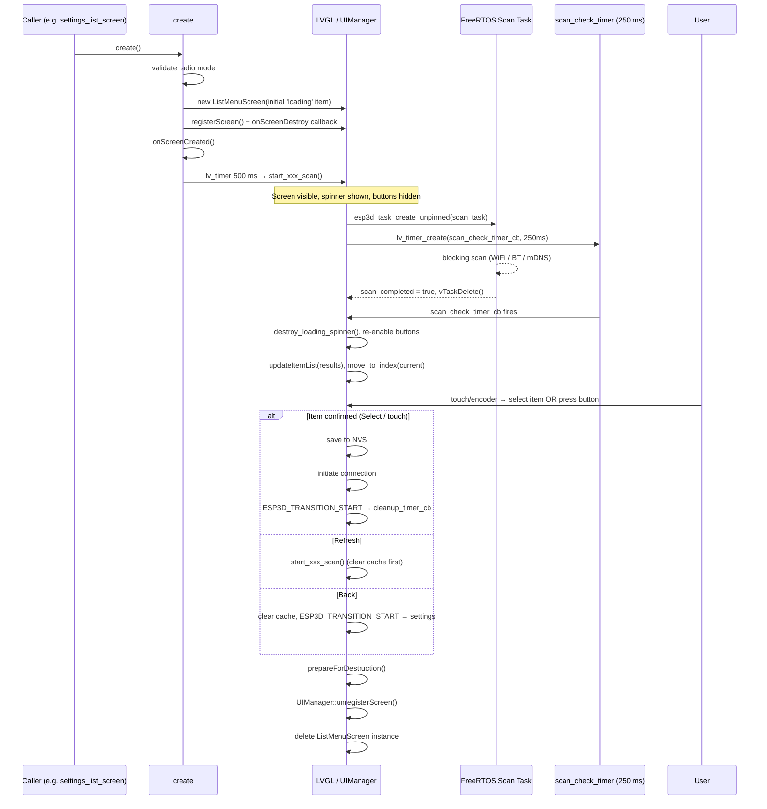

---

## Screen Transition & Destruction Guard

All three screens use a consistent set of macros to avoid double-free and race conditions between LVGL callbacks and navigation transitions.

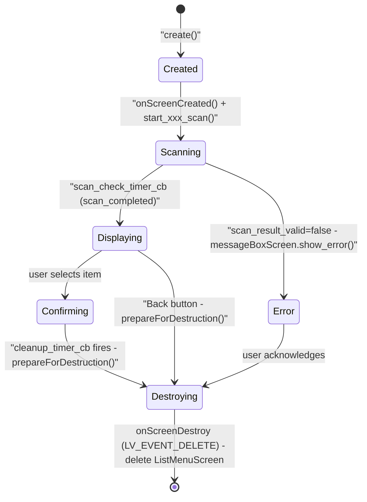

Key lifecycle guards:

| Variable | Purpose |
|---|---|
| `is_prepared_for_destruction_` | Set by `prepareForDestruction()`; prevents re-entry via `ESP3D_PREPARE_DESTRUCTION_GUARD` |
| `cleanup_executed_` | Prevents the cleanup body from running more than once |
| `transition_timer` | Delayed screen switch; destroyed by `cleanup_timer_cb` before the next screen is created |
| `cleanup_timer` | Bridges the gap between button-release and destruction; created by `ESP3D_TRANSITION_START` |

---

## Component Dependencies

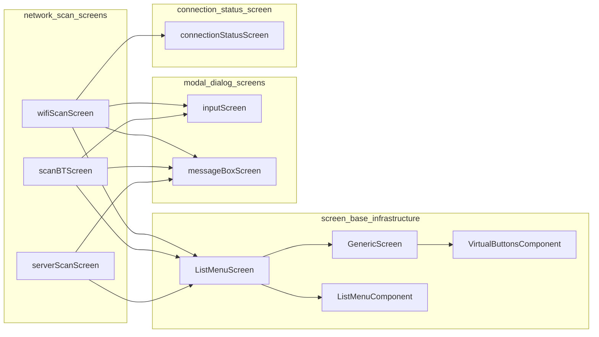

> See [screen_base_infrastructure](screen_base_infrastructure.md) for `ListMenuScreen`, `GenericScreen`, `ListMenuComponent`, and `VirtualButtonsComponent`.
>
> See [modal_dialog_screens](modal_dialog_screens.md) for `inputScreen` and `messageBoxScreen`.
>
> See [connection_status_screen](connection_status_screen.md) for the post-connect status screen used after WiFi credential confirmation.

---

## Data Structures

Each screen defines a private `struct` that holds per-item data. The struct is passed generically through `ListMenuComponent`'s `void*`-based item API; the display callback casts it back to the concrete type.

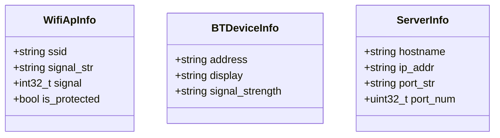

---

## Shared Async Scan Infrastructure

The following data flow is identical across all three screens. Only the blocking API call and result type differ.

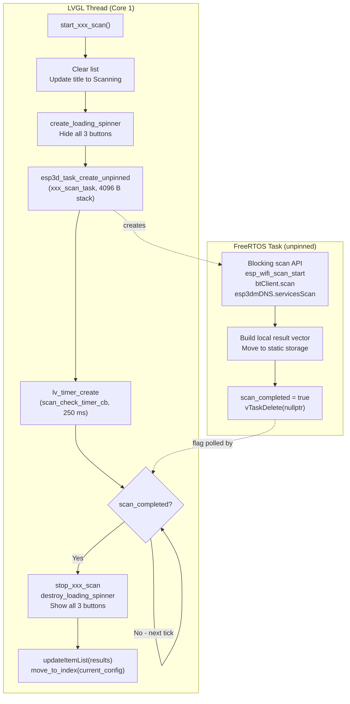

### Memory Safety

All scan tasks guard result-vector growth against `std::bad_alloc`. On allocation failure the loop breaks and whatever entries were collected so far are displayed. The `ListMenuScreen` is constructed with `new (std::nothrow)` and validated before registering with `UIManager`; a null result leaves the previous screen intact.

```cpp
// Pattern used in all three scan tasks:
try {
    local_xxx.emplace_back(...);
} catch (const std::exception &e) {
    esp3d_log_e("OOM: %s — keeping %d entries", e.what(), local_xxx.size());
    break;
}
```

---

## Button Layout

All three screens use the same three-button configuration.

```
┌──────────┬──────────┬──────────┐
│  Select  │ Refresh  │   Back   │
│ (ok_b)   │(refresh_b│ (back_b) │
│ Button 0 │ Button 1 │ Button 2 │
└──────────┴──────────┴──────────┘
```

| Button | Press sound | Release action |
|---|---|---|
| 0 – Select | `ESP3D_SELECTION_BEEP` | Invoke `onXxxItemClick` for the focused item |
| 1 – Refresh | `ESP3D_SELECTION_BEEP` | Clear cache, re-run scan |
| 2 – Back | `ESP3D_BACK_BEEP` | Clear cache, transition to `settings` |

All three buttons are hidden via `show_button(N, false)` during the active scan and restored in `destroy_loading_spinner()`.

---

## WiFi Scan Screen (`wifiScanScreen`)

### Purpose

Scans for visible 802.11 access points, displays them sorted by signal strength (descending), and lets the user connect by selecting an AP. Protected networks trigger a password prompt via `inputScreen`.

### Radio Mode Support

The screen guards creation with a radio mode check. It handles three distinct WiFi driver states at scan time:

| Radio mode | Driver state at scan | Behaviour |
|---|---|---|
| `wifi_sta` | Running STA | `esp_wifi_scan_start()` runs directly |
| `wifi_ap_config` | AP-only (`WIFI_MODE_AP`) | Temporarily switches to `WIFI_MODE_APSTA`; restores `WIFI_MODE_AP` after scan |
| Any (SSID empty / uninitialised) | Stopped or not initialised | Full `esp_wifi_init()` + `set_mode(STA)` + `start()`; torn down after scan |

### List Item Layout

```
┌─────────────────────────────────────────────────────────┐
│ [✓]  MyNetwork                          75%  [lock]     │
│      OpenNetwork                        60%             │
│      AnotherAP                          30%  [lock]     │
└─────────────────────────────────────────────────────────┘
  ↑                                        ↑    ↑
  LV_SYMBOL_OK (active SSID)          signal  lock icon
```

- **Active SSID** (matches `esp3d_sta_ssid` NVS value): shown with `LV_SYMBOL_OK` in `ESP3D_INDICATOR_SUCCESS_COLOR`
- **Lock icon** (`ESP3D_SYMBOL_LOCK`): displayed when `authmode != WIFI_AUTH_OPEN`
- Long SSIDs are truncated with `LV_LABEL_LONG_DOT`; label width is reduced dynamically when the signal percentage and/or lock icon are present

### Selection and Credential Flow

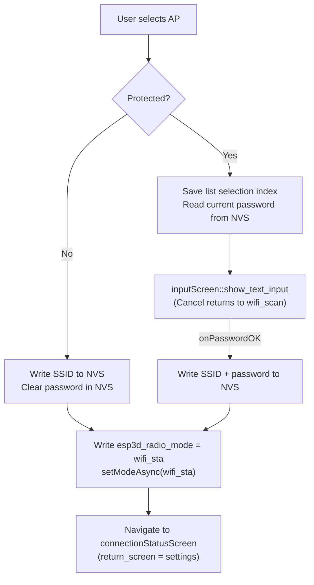

> `setModeAsync()` is used instead of the synchronous `setMode()` to avoid blocking the LVGL task for the duration of WiFi reconnection (`xEventGroupWaitBits(portMAX_DELAY)`, up to 10 retries).

### Scan Result Caching

`scanned_aps_` is **preserved** across the transition to `inputScreen` so the list is instantly restored on Cancel. The `saved_selection_` index restores the highlight to the previously focused item. The cache is only cleared on **Refresh** or **Back**.

### NVS Keys Written

| Setting index | Value written |
|---|---|
| `esp3d_sta_ssid` | Selected AP SSID |
| `esp3d_sta_password` | Password (empty for open networks) |
| `esp3d_radio_mode` | `wifi_sta` (ensures `begin()` auto-connects on next boot) |

### Scan Task

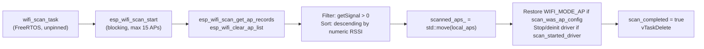

---

## Bluetooth Scan Screen (`scanBTScreen`)

### Purpose

Scans for nearby Bluetooth Classic (SPP) or BLE (GATT) devices and lets the user select one as the CNC host. BT Classic requires a PIN confirmation (empty = `SEC_NONE`); BLE connects directly using the stack's own pairing mechanism.

### Countdown Timer

Because BT scanning has a known maximum duration (returned by `getScanMaxDuration()`), the spinner label shows a live countdown. Each `scan_check_timer_cb` tick recalculates remaining seconds from `(scan_max_duration - elapsed_ms) / 1000` and updates the label.

### List Item Layout

```
┌─────────────────────────────────────────────────────────┐
│ [✓]  None                                               │
│ [✓]  FluidNC CNC  (currently connected, inserted)       │
│      Printer001                                  88%    │
│      OtherDevice                                 45%    │
└─────────────────────────────────────────────────────────┘
```

- **None** (MAC `00:00:00:00:00:00`): always first; selects no host
- **Currently connected device**: if absent from scan results, inserted at position 1 with no signal percentage
- Devices whose name is empty after `str_trim` are discarded from the result set

### BT Classic PIN Flow

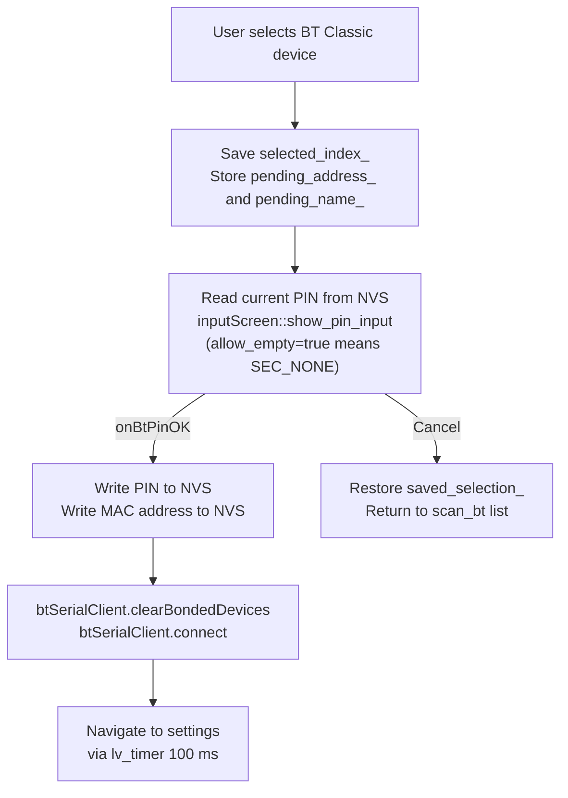

### BLE Flow

BLE selection saves the address immediately and calls `btBleClient.connect()`. No sub-screen is shown. `refresh_visible_items()` updates the active-device marker in-place on the existing list.

### NVS Keys Written

| Mode | Setting index | Value |
|---|---|---|
| BT Serial | `esp3d_btserial_address` | MAC address string |
| BT Serial | `esp3d_btserial_pin` | PIN string (empty = `SEC_NONE`) |
| BT BLE | `esp3d_btble_address` | MAC address string |

### Scan Task

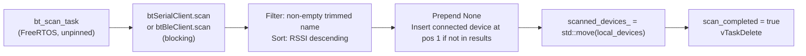

---

## Server Scan Screen (`serverScanScreen`)

### Purpose

Discovers CNC servers on the LAN using mDNS service discovery. The mDNS service type is selected at build time:

- `ESP3D_SOCKET_CLIENT_FEATURE` → queries `_telnet._tcp`
- `ESP3D_WS_CLIENT_SERVICE_FEATURE` → queries `_ws._tcp`

The user selects a discovered server; its resolved IPv4 address and port are saved to NVS and a connection is initiated.

### List Item Layout

```
┌─────────────────────────────────────────────────────────┐
│ [✓]  fluidnc.local                                23    │
│      grblhal-machine.local                        80    │
└─────────────────────────────────────────────────────────┘
  ↑                                                  ↑
  hostname (mDNS service name)                    port
```

- **Active server**: `LV_SYMBOL_OK` when both IP and port match `esp3d_socket_client_address` / `esp3d_socket_client_port`
- Port is right-aligned; hostname is truncated with `LV_LABEL_LONG_DOT` when needed

### Selection Flow

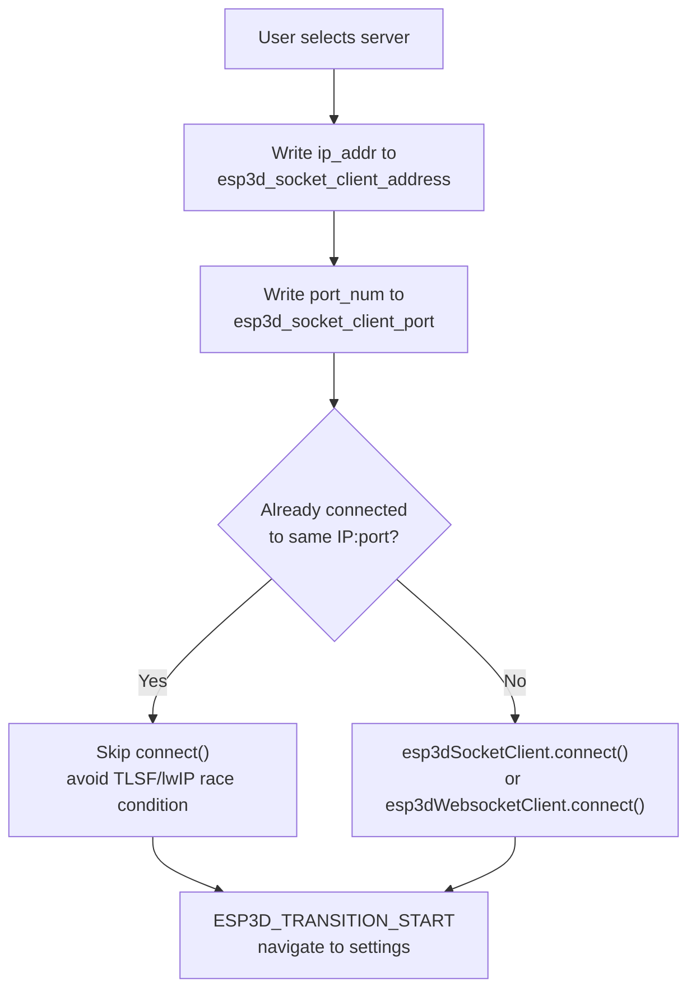

> The already-connected guard prevents a known crash: calling `connect()` on an active socket triggers `closeSocket()` while lwIP may be delivering packets. This corrupts TLSF free-block pointers and causes a `StoreProhibited` exception a few seconds later.

### NVS Keys Written

| Setting index | Value |
|---|---|
| `esp3d_socket_client_address` | Resolved IPv4 string |
| `esp3d_socket_client_port` | Port number (uint32) |

### Scan Task

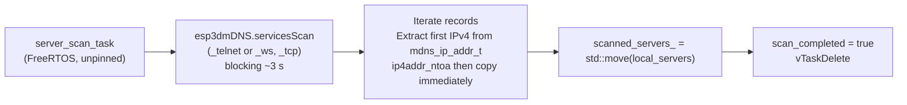

> `ip4addr_ntoa` returns a pointer into a static buffer. The string must be copied into a `std::string` immediately to avoid stale-pointer bugs.

---

## Full Connection Setup Data Flow

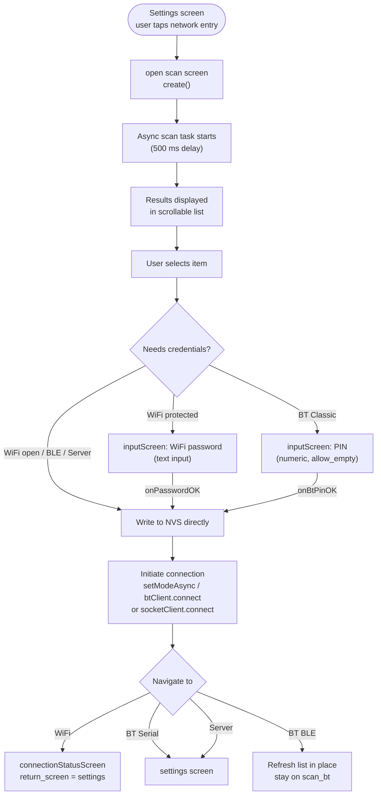

---

## Integration in the Screen System

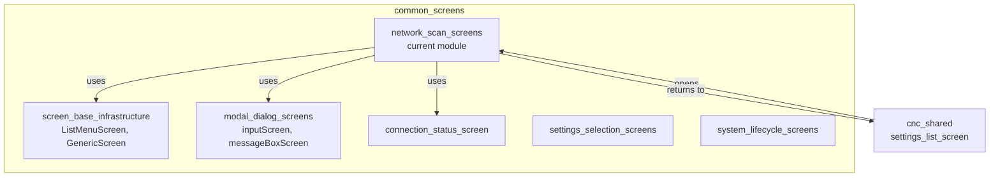

**Entry points** from `settings_list_screen.cpp`:

| Handler | Screen opened |
|---|---|
| `onWifiSSIDClick` / `onForgetWifiClick` | `wifiScanScreen::create()` |
| BT host selection / `onForgetBTHostClick` | `scanBTScreen::create()` |
| `onServerAddressClick` | `serverScanScreen::create()` |

---

## ESP32 Constraints

| Concern | Mitigation |
|---|---|
| **LVGL single-thread rule** | All blocking scan calls run in dedicated FreeRTOS tasks; LVGL objects are only touched from the 250 ms check-timer callback running on Core 1 |
| **RAM fragmentation** | Result vectors use `emplace_back` with `try/catch`; `shrink_to_fit()` after clearing; `ListMenuScreen` uses `new (std::nothrow)` |
| **Heap diagnostics** | Every `create()`, `prepareForDestruction()`, and `onScreenDestroy()` logs `esp_get_free_heap_size()` |
| **Stack size** | All three scan tasks use 4096 bytes of stack via `esp3d_task_create_unpinned` |
| **WiFi driver state** | `wifiScanScreen` handles three driver states: running STA, AP-only (APSTA workaround during scan), and uninitialised (full init + start, torn down after scan) |
| **Double connect crash** | `serverScanScreen` checks `isConnected() && same IP:port` before calling `connect()` to avoid a known race in the TLSF/lwIP allocator |
| **WiFi / BT mutual exclusion** | Both cannot be active simultaneously on this board; the radio mode guard at `create()` prevents opening the wrong scan screen |

---

## Related Documentation

- [screen_base_infrastructure](screen_base_infrastructure.md) — `ListMenuScreen`, `GenericScreen`, `ListMenuComponent`, `VirtualButtonsComponent`
- [modal_dialog_screens](modal_dialog_screens.md) — `inputScreen` (password / PIN entry) and `messageBoxScreen` (error dialogs)
- [connection_status_screen](connection_status_screen.md) — Post-WiFi-connect status screen with connecting spinner and auth-fail retry
- [screens_architecture](https://github.com/luc-github/Pibot-cnc-pendant-firmware/blob/main/docs/architecture/screens_architecture.md) — Overall screen system design and `UIManager`
- [screen_transitions_flow](https://github.com/luc-github/Pibot-cnc-pendant-firmware/blob/main/docs/architecture/screen_transitions_flow.md) — Safe timer-based transition pattern (`ESP3D_TRANSITION_START`, `ESP3D_CLEANUP_TIMER_BODY`)
- [connection_management](https://github.com/luc-github/Pibot-cnc-pendant-firmware/blob/main/docs/architecture/connection_management.md) — Transport lifecycle, radio modes, and connection states
- [`docs/features/feature_resource_matrix.md`](https://github.com/luc-github/Pibot-cnc-pendant-firmware/blob/main/docs/features/feature_resource_matrix.md) — WiFi vs BT build exclusions and RAM budgets
- [`docs/features/mdns.md`](mdns.md) — mDNS registered services (relevant for `serverScanScreen`)
- [`docs/guides/esp32_memory_constraints.md`](https://github.com/luc-github/Pibot-cnc-pendant-firmware/blob/main/docs/guides/esp32_memory_constraints.md) — Heap fragmentation, WiFi vs BT RAM allocation
