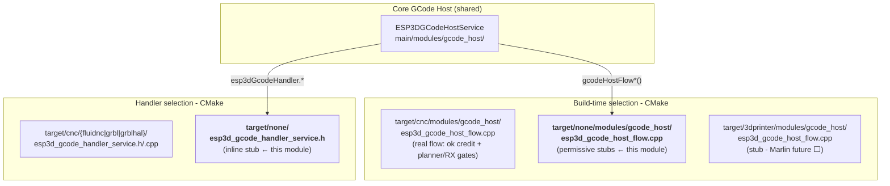

# None Target — Null CNC Firmware Stub

The `none_target` module is the **null firmware target** for the [CNC Firmware Integration](CNC_Firmware_Integration.md) layer. It provides compile-safe, no-op stub implementations of every interface that the [GCode host service](gcode_host.md) and its flow-control layer require, allowing the firmware to build and run without any active CNC firmware backend (no FluidNC, Grbl, or GrblHAL).

**Read these first:**

- [`gcode_host.md`](gcode_host.md) — central scheduler; how the host task calls into handler and flow hooks
- [`cnc_gcode_host_flow.md`](cnc_gcode_host_flow.md) — the real flow-control implementation this module replaces at link time
- [`gcode_host_architecture.md`](https://github.com/luc-github/Pibot-cnc-pendant-firmware/blob/main/docs/architecture/gcode_host_architecture.md) — layer table; CMake target selection; why the split is link-time, not runtime

---

## What this module does

`none_target` satisfies the two link-time interfaces that every firmware build must provide:

1. **`ESP3DGCodeHandlerService`** — the handler singleton that the host task calls for command classification, ACK detection, startup strings, and firmware session lifecycle.
2. **`gcodeHostFlow*` functions** — the flow-gate hooks the host task calls on every send, ACK, NACK, and reset event.

All implementations are pure no-ops or safe constant returns. No transport is opened, no GCode is sent, and no firmware responses are parsed.

---

## Architecture placement



CMake links **exactly one** flow implementation and **exactly one** handler per build:

```
TARGET_FW_NONE  →  target/none/modules/gcode_host/   (flow stubs)
                   target/none/                        (handler stub)

TARGET_FW_GRBL / GRBLHAL / FLUIDNC
                →  target/cnc/modules/gcode_host/     (real flow)
                   target/cnc/{grbl|grblhal|fluidnc}/  (real handler)
```

---

## Source files

```
main/target/none/
├── esp3d_gcode_handler_service.h          ← stub handler class + enums (header-only)
└── modules/gcode_host/
    └── esp3d_gcode_host_flow.cpp          ← no-op flow-control functions
```

---

## `esp3d_gcode_handler_service.h` — Handler stub

### Enums

Both enums are declared here and must also exist in every real handler header so call sites compile identically regardless of the selected target.

#### `FW_GCodeCommand`

```cpp
enum class FW_GCodeCommand : uint8_t {
  reset_stream_numbering = 0,
};
```

Identifies firmware-level injected commands. `getFwCommandString()` returns `""` for every value in the none target.

#### `ESP3DCommandType`

```cpp
enum class ESP3DCommandType : int8_t {
  unknown  = -1,
  normal   =  0,
  realtime =  1
};
```

Classifies a GCode line as queued or real-time. The none target treats every command as `unknown` and never routes realtime traffic.

---

### `ESP3DGCodeHandlerService`

A `final` class with no member state. Every method is defined inline in the header. A global instance is declared at file scope:

```cpp
extern ESP3DGCodeHandlerService esp3dGcodeHandler;
```

#### Lifecycle methods

| Method | Return | Behaviour |
|---|---|---|
| `begin()` | `true` | Always reports success; no real initialisation. |
| `handle()` | — | No-op; called periodically by the host task. |
| `end()` | — | No-op; called on shutdown. |
| `started()` | `false` | Signals that no firmware session is active. The host task uses this to skip the active-streaming loop. |

#### Command classification

| Method | Return | Behaviour |
|---|---|---|
| `getType(const char *)` | `ESP3DDataType::unknown` | No parsing; every line is opaque. |
| `isRealTimeCommand(const char *)` *(static)* | `false` | No realtime commands recognised. |
| `hasMultiLineReport(const char *)` | `false` | No multi-line responses expected. |
| `processCommand(const char *)` | `false` | Command is dropped silently. |

#### ACK / flow-control queries

These are called by the host task and by the flow-control layer. The none-target values are chosen so the host never deadlocks waiting for events that will never arrive.

| Method | Return | Why this value |
|---|---|---|
| `isAckNeeded()` | `false` | No pending ACK → host never enters `wait_for_ack`. |
| `hasAck(const char *)` | `true` | Every received line is treated as an implicit ACK; no credit is held indefinitely. |
| `getLineResend()` | `0` | No line resend ever requested. |
| `getStreamMaxInFlight() const` | `1` | Conservative window; keeps the host flow loop trivially correct if ever called. |
| `canAcceptStreamLine(size_t) const` | `true` | Always ready; no transport backpressure. |

#### Communication

| Method | Return | Behaviour |
|---|---|---|
| `sendGcode(const char *, ...)` | `false` | GCode is silently dropped; no transport attached. |
| `forwardToScreen(const char *)` | `false` | Nothing to forward; no firmware responses arrive. |
| `getLastError()` | `""` | No error state tracked. |

#### Startup and diagnostics

| Method | Return | Behaviour |
|---|---|---|
| `getInitCommand()` | `""` | No firmware-specific initialisation string. |
| `sendStartupCommands()` | `false` | No commands sent. |
| `resetStartupCommandsSent()` | — | No-op. |
| `sendPingCommand()` | `false` | No keepalive sent. |
| `updateReportingInterval(uint32_t)` | `false` | No reporting configured. |
| `getFwCommandString(FW_GCodeCommand)` | `""` | No firmware command strings defined. |

---

## `esp3d_gcode_host_flow.cpp` — Flow-control stubs

Provides the no-op implementations of the flow-gate hook functions declared in `esp3d_gcode_host_flow.h`. The [cnc_gcode_host_flow](cnc_gcode_host_flow.md) module provides the real implementations for CNC builds; the none target replaces them at link time.

### Functions

| Function | Returns | Behaviour vs. real implementation |
|---|---|---|
| `gcodeHostFlowReset()` | — | No-op. Real: atomically zeroes `pending_ok`, empties the in-flight ring, resets `inflight_bytes`. |
| `gcodeHostFlowCanSendLine(size_t line_len)` | `true` | Always permits sending; `line_len` ignored. Real: checks four concurrent gates (ok credit, planner blocks, RX window, RX bytes snapshot). |
| `gcodeHostFlowOnLineSent(const char *cmd)` | — | No-op; `cmd` discarded. Real: increments `pending_ok` and pushes wire byte length into the in-flight ring when `hasAck(cmd)` is true. |
| `gcodeHostFlowOnAck()` | — | No-op. Real: decrements `pending_ok`, pops the oldest ring entry, reduces `inflight_bytes`. |
| `gcodeHostFlowOnNack()` | — | No-op. Real: same accounting as `OnAck`; `error:N` releases one credit. |
| `gcodeHostFlowOnError()` | — | No-op. Real: calls `gcodeHostFlowReset()`. |
| `gcodeHostFlowAtInFlightCap()` | `false` | Reports window always open. Real: returns `true` when `pending_ok >= getStreamMaxInFlight()`. |
| `gcodeHostFlowPendingOk()` | `0` | No in-flight lines tracked. Real: returns `s_pending_ok` under mutex; host uses this to decide whether to enter `wait_for_ack`. |

> **Note:** `gcodeHostFlowReset()` is present in this none-target stub. The function is also called in the real [cnc_gcode_host_flow](cnc_gcode_host_flow.md) but is listed there as an internal reset triggered by `gcodeHostFlowOnError()` — both the none stub and the real implementation share the same public declaration in `esp3d_gcode_host_flow.h`.

---

## Conservative default values — rationale

The stub return values are chosen to keep the [GCode host task](gcode_host.md) in a safe idle state regardless of how many times it ticks:

| Stub value | Effect |
|---|---|
| `started()` → `false` | Host skips the active-streaming loop entirely. |
| `gcodeHostFlowCanSendLine()` → `true` | No deadlock if the host does iterate; no saved pending line, no livelock. |
| `gcodeHostFlowAtInFlightCap()` → `false` | Host never enters `wait_for_ack` after a no-op send. |
| `hasAck()` → `true`, `gcodeHostFlowPendingOk()` → `0` | No line is ever retried or held waiting for an ACK that will never arrive. |
| `isAckNeeded()` → `false` | Consistent redundant guard at the host level. |
| `getStreamMaxInFlight()` → `1` | Trivially satisfies any `pending_ok < max_in_flight` check. |

---

## Memory footprint

All `ESP3DGCodeHandlerService` methods are `inline` in the header; no translation unit is generated for the class itself. `esp3d_gcode_host_flow.cpp` compiles to eight trivial functions, several of which reduce to a single `ret` instruction.

No dynamic allocation, no FreeRTOS objects, no mutex, no static state. The none target adds negligible code size to the firmware image.

---

## See also

| Document | Relation |
|---|---|
| [`gcode_host.md`](gcode_host.md) | Full gcode_host module: scheduler, dual queues, state machine, how flow hooks are called |
| [`cnc_gcode_host_flow.md`](cnc_gcode_host_flow.md) | Real flow implementation — linked instead of this file for CNC targets; describes all four gates and the in-flight ring |
| [`gcode_host_architecture.md`](https://github.com/luc-github/Pibot-cnc-pendant-firmware/blob/main/docs/architecture/gcode_host_architecture.md) | Layer table, CMake selection, performance rules, future 3D-printer path |
| [`CNC_Firmware_Integration.md`](CNC_Firmware_Integration.md) | Parent module overview |
| [`cnc_fluidnc.md`](cnc_fluidnc.md) | FluidNC handler — `processStatus()`, `hasAck()`, buffer cache |
| [`cnc_grblhal.md`](cnc_grblhal.md) | GrblHAL handler |
| [`cnc_grbl.md`](cnc_grbl.md) | GRBL handler |
