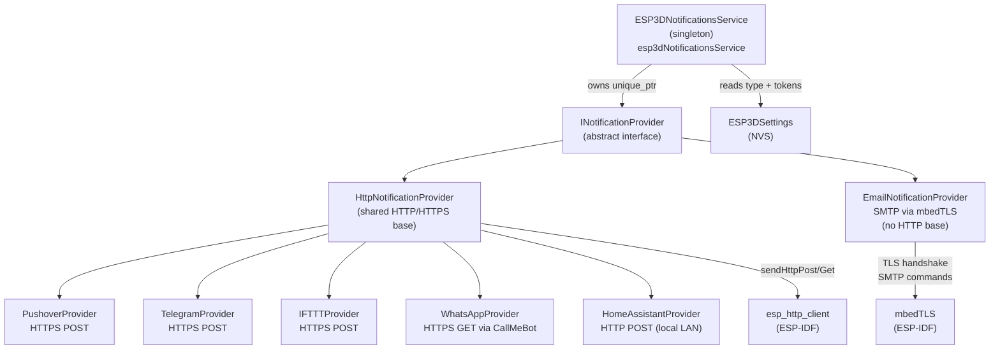
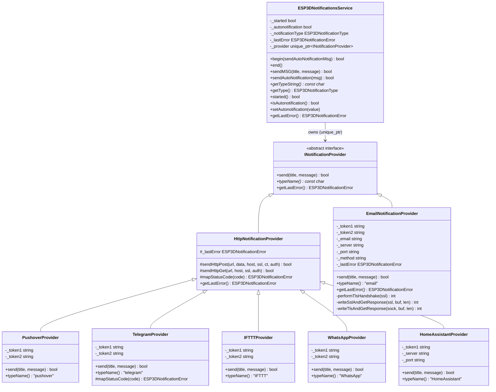
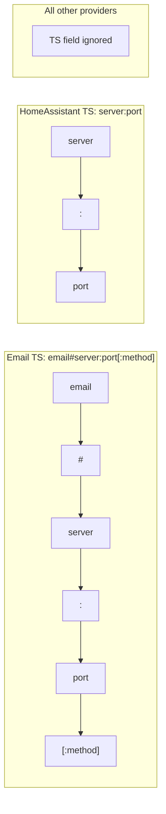
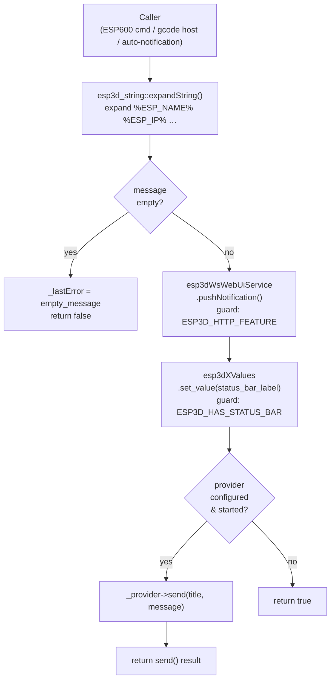
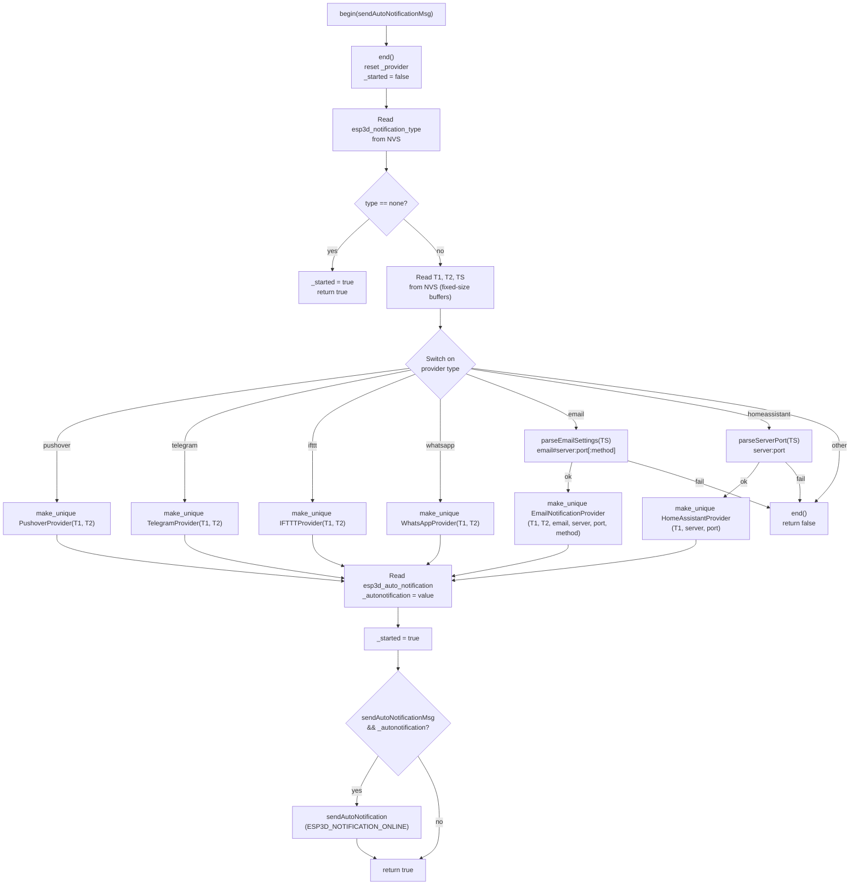
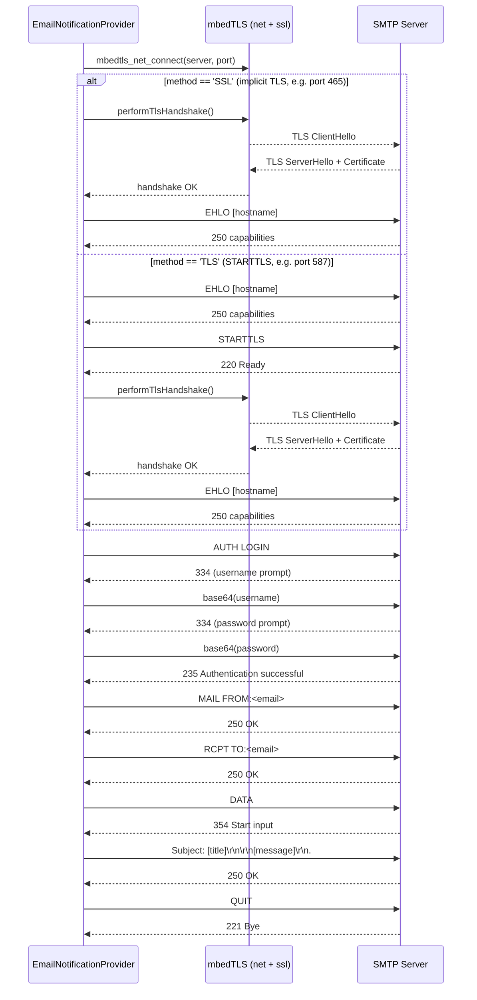
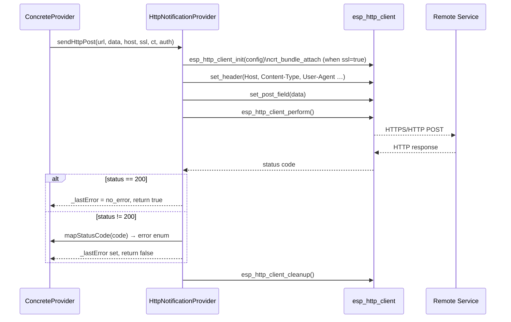
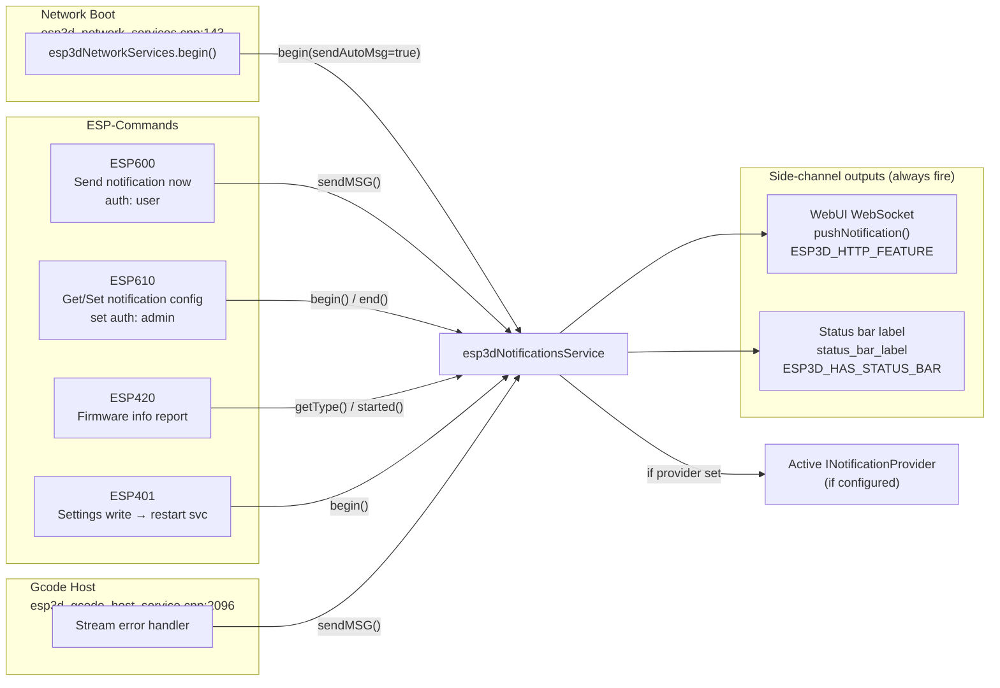

# Notifications Module

The notifications module provides a **pluggable, single-channel push-notification system** for the ESP3D-X pendant firmware. When a notable event occurs — device boot, a manual command, or a gcode stream error — the module dispatches a short title + message to one externally configured service: Pushover, Email (SMTP/TLS), Telegram, IFTTT, WhatsApp, or Home Assistant.

Only one provider is active at a time. The active provider is selected at boot from NVS settings, instantiated by the `ESP3DNotificationsService` singleton, and remains live until `end()` is called or settings are reconfigured via `[ESP610]`.

Feature guard: `ESP3D_NOTIFICATIONS_FEATURE`.

---

## Architecture Overview



---

## Component Hierarchy



---

## Provider Types

| Enum value | `ESP3DNotificationType` | Transport | token1 | token2 | token_setting (`TS`) |
|---|---|---|---|---|---|
| 0 | `none` | — | — | — | — |
| 1 | `pushover` | HTTPS POST `api.pushover.net` | user key | app token | *(unused)* |
| 2 | `email` | SMTP SSL (465) / STARTTLS (587) | SMTP username | SMTP password | `email#server:port[:method]` |
| ~~3~~ | ~~`line`~~ | *(removed — gap preserved)* | — | — | — |
| 4 | `telegram` | HTTPS POST `api.telegram.org` | bot token | chat id | *(unused)* |
| 5 | `ifttt` | HTTPS POST `maker.ifttt.com` | event name | webhook key | *(unused)* |
| 6 | `whatsapp` | HTTPS GET `api.callmebot.com` | phone number | API key | *(unused)* |
| 7 | `homeassistant` | HTTP POST (plain, local LAN) | HA long-lived token | *(unused)* | `server:port` |

> ⚠️ Enum value `3` was removed (LINE provider). The gap is intentional — persisted NVS values from older firmware may still contain `3`. Do not reuse this value.

---

## NVS Settings

| Setting index | Size | Content |
|---|---|---|
| `esp3d_notification_type` | byte | `ESP3DNotificationType` cast |
| `esp3d_notification_token_1` | 64 B (`SIZE_OF_SETTING_NOFIFICATION_T1`) | Primary credential (username, user key, bot token, phone …) |
| `esp3d_notification_token_2` | 64 B (`SIZE_OF_SETTING_NOFIFICATION_T2`) | Secondary credential (password, app token, chat id, API key …) |
| `esp3d_notification_token_setting` | 128 B (`SIZE_OF_SETTING_NOFIFICATION_TS`) | Provider-specific extra config (see table above) |
| `esp3d_auto_notification` | byte (bool) | Send "online" message automatically at network boot |

`T1` and `T2` are **protected keys** — they are scrambled in `.ok` config exports and never echoed back by `[ESP610]` GET queries.

### Token Setting Parsing



---

## Data Flow — sendMSG()



> **Key invariant:** The local UI echo (WebUI push + status bar) always fires regardless of provider state or send result. Even `type=none` will echo locally.

---

## Service Lifecycle — begin()



---

## Email SMTP Sequence (mbedTLS)

Unlike HTTP-based providers, `EmailNotificationProvider` implements a full SMTP conversation over mbedTLS directly, bypassing `esp_http_client`.



> **Buffer constraints:** Fixed 512 B (`BUF_SIZE`) for all SMTP I/O, 128 B for base64 encoding. No VLAs. `calloc()` failures are checked and logged. Connection timeout: 5000 ms.

---

## HTTP Provider Sequence (shared base)

All providers except Email share this path through `HttpNotificationProvider`.



> `TelegramProvider` overrides `mapStatusCode()`: HTTP 401 → `invalid_token1`, 400 → `invalid_token2`, 404 → `invalid_url`. All other providers use the default mapping (non-200 → `invalid_data`).

---

## Integration Points



---

## Error Model

```mermaid
graph TD
    E0["no_error - Operation succeeded"]
    E1["empty_message - sendMSG called with empty string"]
    E2["invalid_message - Provider-level message validation failed"]
    E3["invalid_data - HTTP non-200 (default mapping)"]
    E4["invalid_url - URL build failed or HTTP 404"]
    E5["invalid_token1 - HTTP 401 (Telegram) or bad primary credential"]
    E6["invalid_token2 - HTTP 400 (Telegram) or bad secondary credential"]
    E7["error - Network or TLS failure"]
```



`ESP3DNotificationsService::getLastError()` delegates to `_provider->getLastError()` when a provider is active; it falls back to its own `_lastError` (e.g. `empty_message`) when no provider exists. `[ESP600]` reports the numeric error value on send failure.

---

## Customization

Auto-notification message templates are defined per-board in `customizations/notifications/customizations.h` (overridable per board under `boards/<board>/customizations/notifications/`):

```c
// Default (customizations/notifications/customizations.h)
#define ESP3D_NOTIFICATION_TITLE  "Hi from ESP3D"
#define ESP3D_NOTIFICATION_ONLINE "Hi, %ESP_NAME% is now online at %ESP_IP%"

// PiBot board override (boards/pibot_pendant_v1_0/customizations/notifications/)
#define ESP3D_NOTIFICATION_TITLE  "PiBot CNC Pendant"
#define ESP3D_NOTIFICATION_ONLINE "Hi, %ESP_NAME% is now online at %ESP_IP%"
```

The `%ESP_NAME%` and `%ESP_IP%` placeholders (and any others supported by `esp3d_string::expandString()`) are expanded in both title and message before every send.

---

## Commands Reference

| Command | Direction | Auth level | Description |
|---|---|---|---|
| `[ESP600]<message>` | Write | user | Send a notification immediately using the active provider |
| `[ESP610]` | Read | — | Return current `type`, `AUTO`, `TS` (never returns T1/T2) |
| `[ESP610] type=… T1=… T2=… TS=… AUTO=…` | Write | admin | Update notification settings and restart the service live (no reboot) |
| `[ESP420]` | Read | — | Firmware info report — includes active notification type string |

---

## Key Files

| File | Role |
|---|---|
| `main/modules/notifications/esp3d_notifications_service.h/.cpp` | Singleton orchestrator — settings parsing, provider lifecycle, `sendMSG()` |
| `main/modules/notifications/esp3d_notification_provider.h` | `INotificationProvider` abstract interface + `ESP3DNotificationError` enum |
| `main/modules/notifications/esp3d_http_notification_provider.h/.cpp` | Shared HTTP/HTTPS POST+GET base (`esp_http_client`) for all HTTP providers |
| `main/modules/notifications/esp3d_email_notification.h/.cpp` | Email: raw mbedTLS SMTP client (SSL implicit + STARTTLS) |
| `main/modules/notifications/esp3d_pushover_notification.h/.cpp` | Pushover HTTPS POST |
| `main/modules/notifications/esp3d_telegram_notification.h/.cpp` | Telegram HTTPS POST + custom `mapStatusCode()` |
| `main/modules/notifications/esp3d_ifttt_notification.h/.cpp` | IFTTT webhooks HTTPS POST |
| `main/modules/notifications/esp3d_whatsapp_notification.h/.cpp` | WhatsApp via CallMeBot HTTPS GET |
| `main/modules/notifications/esp3d_homeassistant_notification.h/.cpp` | Home Assistant local HTTP POST |
| `main/core/commands/esp600.cpp` | `[ESP600]` — send notification now |
| `main/core/commands/esp610.cpp` | `[ESP610]` — get/set config, restart service without reboot |
| `main/modules/network/esp3d_network_services.cpp:143` | Auto-notification trigger on network ready |
| `main/modules/gcode_host/esp3d_gcode_host_service.cpp:2096` | Auto-notification trigger on stream error |
| `customizations/notifications/customizations.h` | Title + online message templates |

---

## Related Documentation

- [authentication.md](authentication.md) — authentication levels required by ESP600 (user) and ESP610 SET (admin)
- [network.md](network.md) — network lifecycle that triggers the "online" auto-notification via `esp3dNetworkServices.begin()`
- [gcode_host.md](gcode_host.md) — gcode streaming layer that triggers error notifications
- [mdns.md](mdns.md) — `notification` TXT record advertising the active provider type on `_device-info._tcp`
- [websocket_server.md](websocket_server.md) — WebUI WebSocket service that receives the side-channel `pushNotification()` call
- [values.md](values.md) — `ESP3DValues` observable that receives the `status_bar_label` update on every `sendMSG()`


## Documents de conception (depot)

- [notifications_system.md](https://github.com/luc-github/Pibot-cnc-pendant-firmware/blob/main/docs/architecture/notifications_system.md)
