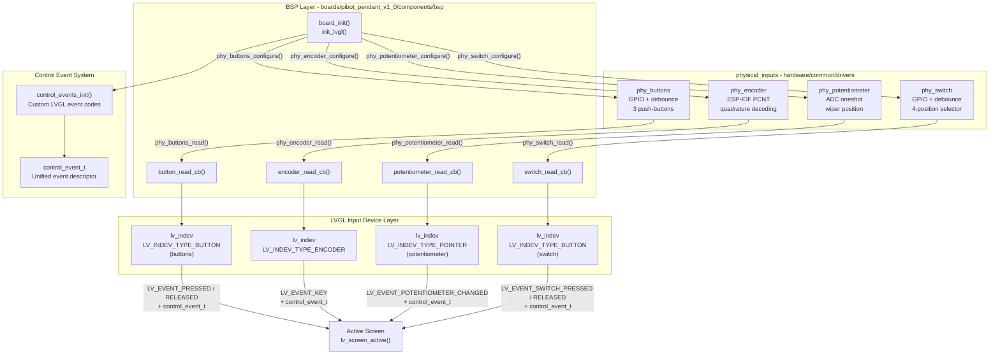
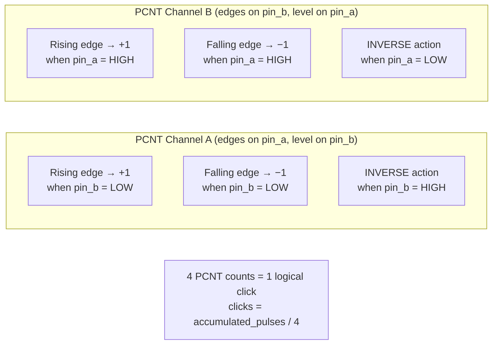
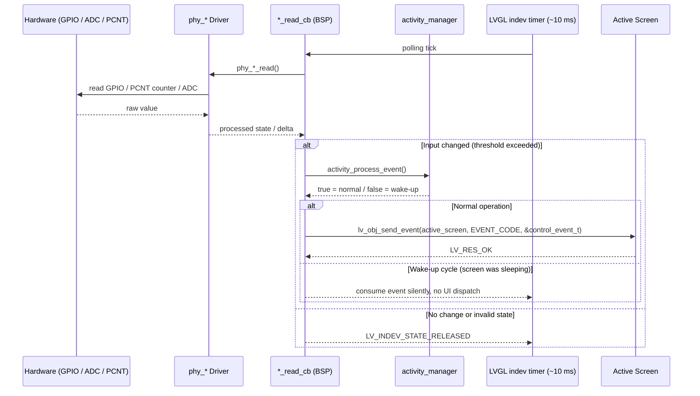
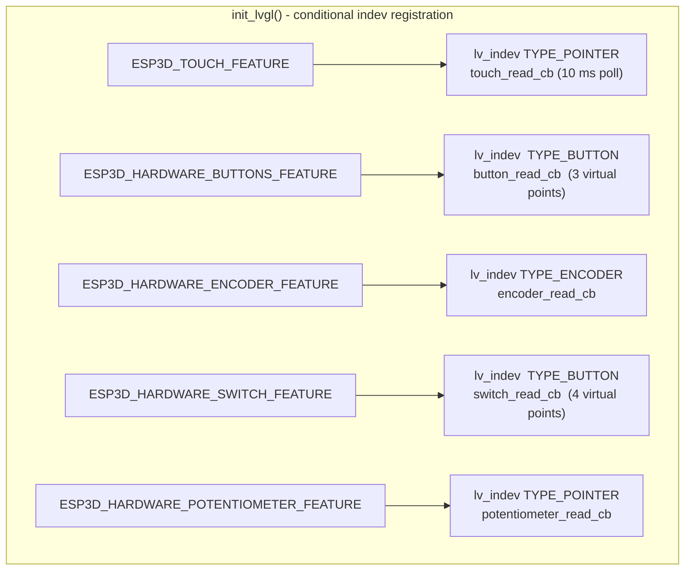
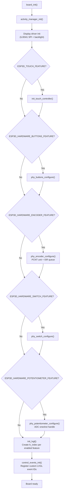
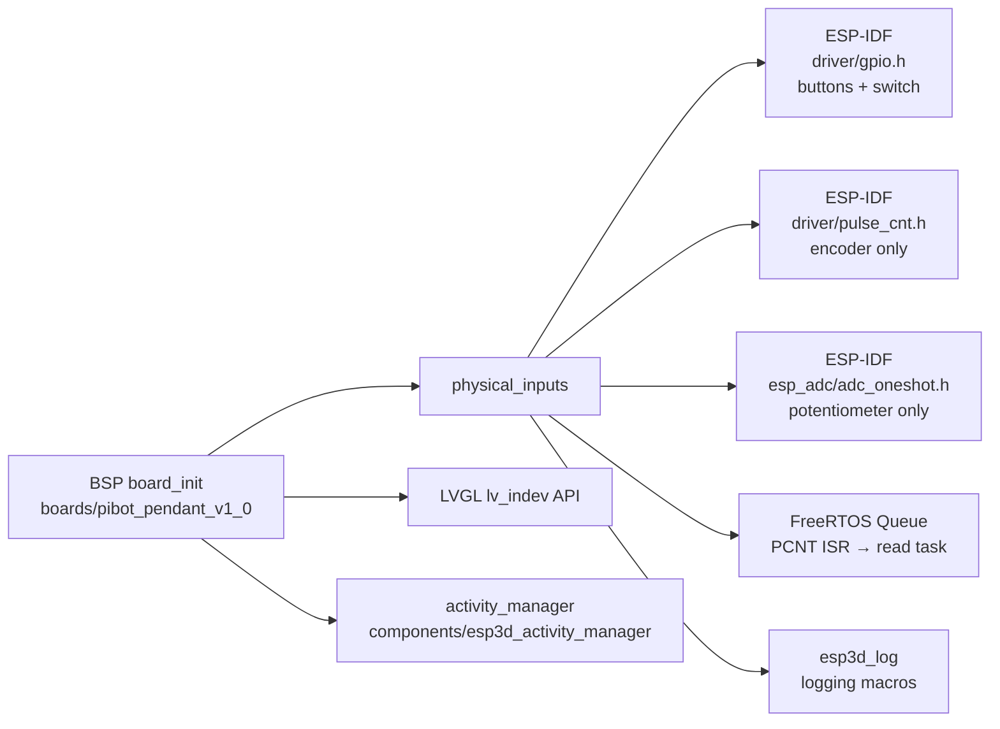

# Physical Inputs Module

## Introduction

The **physical_inputs** module provides low-level hardware drivers for the discrete, non-touch input devices used on CNC pendant boards. It is the only sub-module in the BSP layer that exclusively handles human-operated mechanical controls: pushbuttons, a quadrature rotary encoder, a multi-position selector switch, and an analog potentiometer.

Each driver is self-contained: it exposes a **configure / read / deinit** lifecycle and remains board-agnostic. Board-specific wiring (GPIO numbers, ADC channels, pull-up policy, debounce timing, etc.) is injected at runtime through typed configuration structures, keeping the driver code shared across every supported board variant.

The module lives at:

```
hardware/common/drivers/
├── phy_buttons/
│   ├── phy_buttons_config.h        ← configuration type
│   └── phy_buttons.h / .c          ← implementation
├── phy_encoder/
│   ├── phy_encoder_config.h        ← configuration type
│   └── phy_encoder.h / .c          ← implementation (PCNT-based)
├── phy_potentiometer/
│   ├── phy_potentiometer_config.h  ← configuration type
│   └── phy_potentiometer.h / .c    ← implementation (ADC oneshot)
└── phy_switch/
    ├── phy_switch_config.h         ← configuration type
    └── phy_switch.h / .c           ← implementation
```

---

## Architecture Overview



---

## Component Descriptions

### 1. `phy_buttons` — Physical Push-Buttons

**Files:** `phy_buttons_config.h`, `phy_buttons.h`, `phy_buttons.c`

Manages up to **3 independent push-buttons** connected to GPIO pins. The driver handles debouncing and active-level polarity internally, exposing a simple array-of-booleans read interface.

#### Configuration Structure

```c
typedef struct {
    gpio_num_t button_pins[3]; // GPIO pins for the 3 buttons
    bool       pullups_enabled; // Enable internal pull-up resistors
    uint32_t   debounce_ms;     // Debounce time in milliseconds
    bool       active_low;      // true = pressed when GPIO reads 0
} phy_buttons_config_t;
```

| Field              | Type         | Description                                            |
|--------------------|--------------|--------------------------------------------------------|
| `button_pins[3]`   | `gpio_num_t` | GPIO numbers, one per button (index 0–2)               |
| `pullups_enabled`  | `bool`       | Enables ESP-IDF internal pull-ups                      |
| `debounce_ms`      | `uint32_t`   | Contact bounce filter, typically 20–50 ms              |
| `active_low`       | `bool`       | `true` for buttons wired to GND; `false` for VCC side  |

#### API

| Function | Description |
|---|---|
| `phy_buttons_configure(const phy_buttons_config_t *)` | Initialize GPIO pins and debounce state |
| `phy_buttons_read(bool states[3])` | Fill `states[]` with current pressed/released status |
| `phy_buttons_deinit(void)` | Release GPIO resources |

---

### 2. `phy_encoder` — Quadrature Rotary Encoder

**Files:** `phy_encoder_config.h`, `phy_encoder.h`, `phy_encoder.c`

Implements hardware-accelerated quadrature decoding using the ESP-IDF **PCNT (Pulse Counter)** peripheral. Two PCNT channels decode both edges of both phase signals (**4× resolution**). Watch points fire ISR callbacks when the counter reaches configured limits, ensuring fast rotation is never silently dropped.

#### Configuration Structure

```c
typedef struct {
    gpio_num_t pin_a;               // Phase A GPIO
    gpio_num_t pin_b;               // Phase B GPIO
    bool       pullups_enabled;     // Enable internal pull-ups
    uint32_t   debounce_us;         // Informational; hardware uses pcnt_glitch_ns
    uint32_t   min_step_interval_us;// Reserved — not used in PCNT mode
    uint32_t   steps_per_rev;       // Mechanical steps per revolution
    int32_t    pcnt_high_limit;     // PCNT upper bound before auto-reset
    int32_t    pcnt_low_limit;      // PCNT lower bound before auto-reset
    uint32_t   pcnt_glitch_ns;      // Hardware glitch filter threshold in nanoseconds
} phy_encoder_config_t;
```

| Field | Description |
|---|---|
| `pin_a` / `pin_b` | Phase A and B GPIO connections (quadrature signal pair) |
| `steps_per_rev` | Used by higher layers to convert raw clicks → revolutions |
| `pcnt_high_limit` / `pcnt_low_limit` | ISR watch points; PCNT counter auto-clears at these limits to prevent wrapping |
| `pcnt_glitch_ns` | Hardware debounce; default 500 ns balances noise rejection vs. sensitivity |

#### API

| Function | Description |
|---|---|
| `phy_encoder_configure(const phy_encoder_config_t *)` | Initialize PCNT unit, both channels, watch points, ISR queue |
| `phy_encoder_read(int32_t *steps)` | Return delta clicks since last read; clears internal PCNT counter |
| `phy_encoder_get_total_steps(int32_t *total_steps)` | Return total accumulated steps since initialization |
| `phy_encoder_reset_steps(void)` | Zero the total step accumulator |
| `phy_encoder_get_config(phy_encoder_config_t *)` | Copy current configuration out |
| `phy_encoder_deinit(void)` | Stop, disable, and delete PCNT unit; free FreeRTOS queue |

#### Internal PCNT ISR Callback

```c
// ISR context — sends the watch-point value to the FreeRTOS queue
static bool encoder_pcnt_on_reach(pcnt_unit_handle_t unit,
                                  const pcnt_watch_event_data_t *edata,
                                  void *user_ctx);
```

Runs in **ISR context**. Pushes the watch-point value to `encoder_queue` via `xQueueSendFromISR`. The main `phy_encoder_read()` drains the queue: if a limit event is found, it resets the PCNT counter and clears `accumulated_pulses`.

#### 4× Quadrature Decoding — Channel Configuration



Every edge on either channel contributes to the count. `phy_encoder_read()` converts raw PCNT units to logical clicks:

```c
int32_t new_clicks = accumulated_pulses / 4;
int32_t clicks     = new_clicks - encoder_steps; // delta since last read
```

---

### 3. `phy_potentiometer` — Analog Potentiometer

**Files:** `phy_potentiometer_config.h`, `phy_potentiometer.h`, `phy_potentiometer.c`

Reads a continuous position signal from a resistive potentiometer via the ESP-IDF **ADC oneshot** API. The raw 12-bit ADC value is optionally averaged over multiple samples to reduce noise before being returned to the caller.

#### Configuration Structure

```c
typedef struct {
    gpio_num_t      pin;             // GPIO pin connected to wiper
    adc_channel_t   channel;         // ADC channel number
    adc_bitwidth_t  width;           // ADC resolution (typically ADC_BITWIDTH_12)
    adc_atten_t     atten;           // Input voltage range (attenuation)
    bool            filter_enabled;  // Enable sample averaging
    uint32_t        filter_samples;  // Number of samples to average
} phy_potentiometer_config_t;
```

| Field | Description |
|---|---|
| `channel` | Mapped from `pin` using board-specific ADC channel assignments |
| `width` | `ADC_BITWIDTH_12` → raw range 0–4095 |
| `atten` | `ADC_ATTEN_DB_11` → full-scale ≈ 3.3 V (most common) |
| `filter_enabled` / `filter_samples` | Multi-sample averaging; reduces ADC noise at cost of latency |

#### API

| Function | Description |
|---|---|
| `phy_potentiometer_configure(const phy_potentiometer_config_t *)` | Initialize ADC oneshot handle and channel calibration |
| `phy_potentiometer_read(uint32_t *value)` | Read raw ADC value (0–4095); returns `ESP_ERR_INVALID_RESPONSE` if change is below driver threshold |
| `phy_potentiometer_deinit(void)` | Delete ADC oneshot handle |

---

### 4. `phy_switch` — 4-Position Selector Switch

**Files:** `phy_switch_config.h`, `phy_switch.h`, `phy_switch.c`

Decodes a **3-wire, 4-position rotary selector switch** where each switch position activates a unique combination of 3 GPIO inputs. The driver validates that the GPIO bit pattern is a known valid state before reporting a position, and returns `ESP_ERR_INVALID_RESPONSE` during mechanical transition states.

#### Configuration Structure

```c
typedef struct {
    gpio_num_t pins[3];        // Three GPIO pins encoding the 4 positions
    bool       pullups_enabled; // Enable internal pull-up resistors
    uint32_t   debounce_ms;     // Debounce time in milliseconds
} phy_switch_config_t;
```

| Field | Description |
|---|---|
| `pins[3]` | Each pin encodes one bit of the 4-position state |
| `pullups_enabled` | Enables GPIO pull-ups (wiper pulls a pin to GND at each position) |
| `debounce_ms` | Prevents spurious transitions during mechanical contact switching |

#### API

| Function | Description |
|---|---|
| `phy_switch_configure(const phy_switch_config_t *)` | Initialize GPIO pins |
| `phy_switch_read(bool states[4])` | Fill `states[]` with decoded 4-position state; returns `ESP_ERR_INVALID_RESPONSE` for invalid pin patterns |
| `phy_switch_deinit(void)` | Release GPIO resources |

> **Important:** The BSP `switch_read_cb` treats `ESP_ERR_INVALID_RESPONSE` as a silent no-op and does **not** call `activity_process_event()` for invalid states. This prevents phantom display wake-ups during mechanical contact bouncing between positions.

---

## Data Flow



---

## Control Event System

All four physical input types share a unified event descriptor that is passed as `user_data` in LVGL event callbacks:

```c
// boards/pibot_pendant_v1_0/components/bsp/control_event.h
typedef struct {
    lv_indev_t      *indev;          // LVGL input device handle (set per callback)
    uint32_t         btn_id;         // Button/switch position index (0-based)
    lv_indev_type_t  type;           // LVGL indev type of the source
    control_family_t family_id;      // CONTROL_FAMILY_BUTTONS | CONTROL_FAMILY_ENCODER
                                     // | CONTROL_FAMILY_POTENTIOMETER | CONTROL_FAMILY_SWITCH
    int32_t          steps;          // Encoder: ±1 per click; Pot: mapped 0–100 value
    uint32_t         press_duration; // Buttons: ms held before release; others: 0
} control_event_t;
```

Static `control_event_t` instances are declared per callback (not heap-allocated per event), avoiding any dynamic allocation in the polling hot path.

### Custom LVGL Event Codes

Two additional LVGL event codes are registered at startup by `control_events_init()` (called at the end of `board_init()`):

| Event Code | Source Callback | Meaning |
|---|---|---|
| `LV_EVENT_SWITCH_PRESSED` | `switch_read_cb` | Switch moved to a new valid position |
| `LV_EVENT_SWITCH_RELEASED` | `switch_read_cb` | Switch leaving a position (transitioning) |
| `LV_EVENT_POTENTIOMETER_CHANGED` | `potentiometer_read_cb` | Wiper value changed beyond adaptive threshold |

Standard LVGL event codes used for the remaining inputs:

| Event Code | Source Callback | Meaning |
|---|---|---|
| `LV_EVENT_PRESSED` | `button_read_cb` | Button pressed |
| `LV_EVENT_RELEASED` | `button_read_cb` | Button released (carries `press_duration`) |
| `LV_EVENT_KEY` | `encoder_read_cb` | Encoder rotated: `LV_KEY_LEFT` or `LV_KEY_RIGHT` |

---

## LVGL Integration

Each physical input is registered as an **LVGL input device** (`lv_indev_t`) inside `init_lvgl()`, guarded by a compile-time feature flag:



> ⚠️ **LVGL thread safety:** All `*_read_cb` functions run on **Core 1** within the LVGL timer task. They must never block, must never perform dynamic allocation in the hot path, and must complete quickly. The LVGL task must remain responsive at all times — see [screens_architecture.md](https://github.com/luc-github/Pibot-cnc-pendant-firmware/blob/main/docs/architecture/screens_architecture.md) for global LVGL constraints.

### Encoder: Adaptive Rate Limiting

The encoder callback applies speed-adaptive throttling before dispatching `LV_EVENT_KEY` to prevent LVGL from being overwhelmed during rapid rotation:

| Time since last dispatched event | Minimum dispatch interval |
|---|---|
| ≥ `ENCODER_SPEED_THRESHOLD_SLOW_MS` | 80 ms |
| ≥ `ENCODER_SPEED_THRESHOLD_NORMAL_MS` | 40 ms |
| ≥ `ENCODER_SPEED_THRESHOLD_FAST_MS` | 20 ms |
| < fast threshold | 10 ms |

Additionally, events per polling tick are capped at `max_events_per_call = 5`. Direction is optionally inverted by the `ENCODER_INVERT_ROTATION` compile-time flag.

### Potentiometer: Adaptive Threshold

The potentiometer callback uses a hysteresis strategy to distinguish real user input from ADC noise. Raw ADC values (0–4095) are mapped linearly to 0–100 before applying the threshold:

| Condition | Mapped change threshold |
|---|---|
| After `POT_INACTIVITY_THRESHOLD_MS` of silence | `POT_WAKE_THRESHOLD_MAPPED` (high) |
| Direction reversal during active use | 1 unit |
| Descending value during active use | 2 units |
| Ascending value during active use | 3 units |

### Button: Wake-Up Consumption

When a button press wakes the system from display sleep, that specific press-and-release cycle is fully consumed (not forwarded to the active screen):

```c
if (activity_process_event()) {
    // System was already awake — dispatch LV_EVENT_PRESSED normally
    button_consumed_for_wakeup[i] = false;
} else {
    // System just woke up — suppress this press event
    button_consumed_for_wakeup[i] = true;
}
// The subsequent LV_EVENT_RELEASED for a consumed press is also suppressed.
```

---

## Initialization Sequence



---

## Board Support Matrix

The physical inputs driver code is shared across all boards via `hardware/common/drivers/`. Only `pibot_pendant_v1_0` currently enables all four physical input types through its feature flags:

| Board | Buttons (3×) | Encoder | Switch (4-pos) | Potentiometer |
|---|:---:|:---:|:---:|:---:|
| `pibot_pendant_v1_0` | ✅ | ✅ | ✅ | ✅ |
| `esp32_2432s028r` | — | — | — | — |
| `esp32_3248s035c` | — | — | — | — |
| `esp32_3248s035r` | — | — | — | — |
| `esp32s3_4827s043c` | — | — | — | — |
| `esp32s3_8048*` (touch panels) | — | — | — | — |
| `esp32s3_bzm_tft35_gt911` | — | — | — | — |
| `esp32s3_hmi43v3` | — | — | — | — |
| `esp32s3_zx3d50ce02s_usrc_4832` | — | — | — | — |
| `dlc32_max_lcd` | — | — | — | — |
| `fysetc_wifi_pro` | — | — | — | — |

Boards without physical inputs follow the same `board_init` pattern; `phy_*_configure()` calls are absent because the corresponding feature flags are set to `OFF` in their `CMakeLists.txt`.

---

## Memory and Real-Time Constraints

| Driver | Heap allocation | Interrupt usage |
|---|---|---|
| `phy_buttons` | None — static GPIO state only | None |
| `phy_encoder` | `xQueueCreate(10)` once at `configure` time | `encoder_pcnt_on_reach` runs in ISR; only `xQueueSendFromISR` used |
| `phy_potentiometer` | ADC oneshot handle once at `configure` time | None |
| `phy_switch` | None — static GPIO state only | None |

**No dynamic allocation** occurs during normal operation (after `board_init` completes). The encoder ISR exclusively uses `xQueueSendFromISR` — the only safe FreeRTOS call from ISR context. All BSP read callbacks use only stack-allocated locals and `static` variables to avoid heap fragmentation. See [esp32_memory_constraints.md](https://github.com/luc-github/Pibot-cnc-pendant-firmware/blob/main/docs/guides/esp32_memory_constraints.md) for the platform-wide allocation policy.

---

## Dependency Map



- **ESP-IDF GPIO driver** — used by `phy_buttons` and `phy_switch` for digital I/O.
- **ESP-IDF PCNT driver** — used exclusively by `phy_encoder` for hardware quadrature decoding.
- **ESP-IDF ADC oneshot** — used exclusively by `phy_potentiometer`.
- **FreeRTOS Queue** — bridges the PCNT ISR to `phy_encoder_read()` in task context.
- **`esp3d_log`** — see [esp3d_log_guide.md](https://github.com/luc-github/Pibot-cnc-pendant-firmware/blob/main/docs/guides/esp3d_log_guide.md) for macro usage and log levels.
- **`activity_manager`** — called by BSP callbacks (not by drivers) to maintain display activity and detect wake-up cycles.
- **LVGL** — input devices are registered by the BSP layer, not by the drivers themselves. See [Input_system.md](https://github.com/luc-github/Pibot-cnc-pendant-firmware/blob/main/docs/architecture/Input_system.md) and [screens_architecture.md](https://github.com/luc-github/Pibot-cnc-pendant-firmware/blob/main/docs/architecture/screens_architecture.md) for how screens consume `control_event_t` payloads.

---

## Related Documentation

| Document | Topic |
|---|---|
| [Input_system.md](https://github.com/luc-github/Pibot-cnc-pendant-firmware/blob/main/docs/architecture/Input_system.md) | How LVGL input devices are consumed by UI screens |
| [screens_architecture.md](https://github.com/luc-github/Pibot-cnc-pendant-firmware/blob/main/docs/architecture/screens_architecture.md) | Screen event-handling patterns and LVGL thread rules |
| [screen_transitions_flow.md](https://github.com/luc-github/Pibot-cnc-pendant-firmware/blob/main/docs/architecture/screen_transitions_flow.md) | How physical inputs trigger screen transitions |
| [display_drivers.md](https://github.com/luc-github/Pibot-cnc-pendant-firmware/blob/main/docs/architecture/display_drivers.md) | SPI/RGB/i80 display drivers co-initialized in `board_init` |
| [pibot-cnc-pendant-hardware-documentation.md](https://github.com/luc-github/Pibot-cnc-pendant-firmware/blob/main/docs/hardware/pibot-cnc-pendant-hardware-documentation.md) | GPIO pin assignments, schematics, and board layout |
| [esp32_memory_constraints.md](https://github.com/luc-github/Pibot-cnc-pendant-firmware/blob/main/docs/guides/esp32_memory_constraints.md) | ESP32 heap constraints and allocation rules |
| [esp3d_log_guide.md](https://github.com/luc-github/Pibot-cnc-pendant-firmware/blob/main/docs/guides/esp3d_log_guide.md) | Logging macro usage, levels, and debug workflow |
