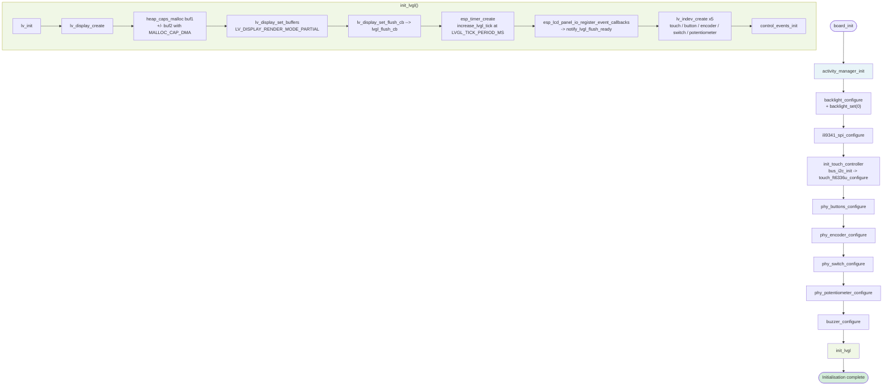
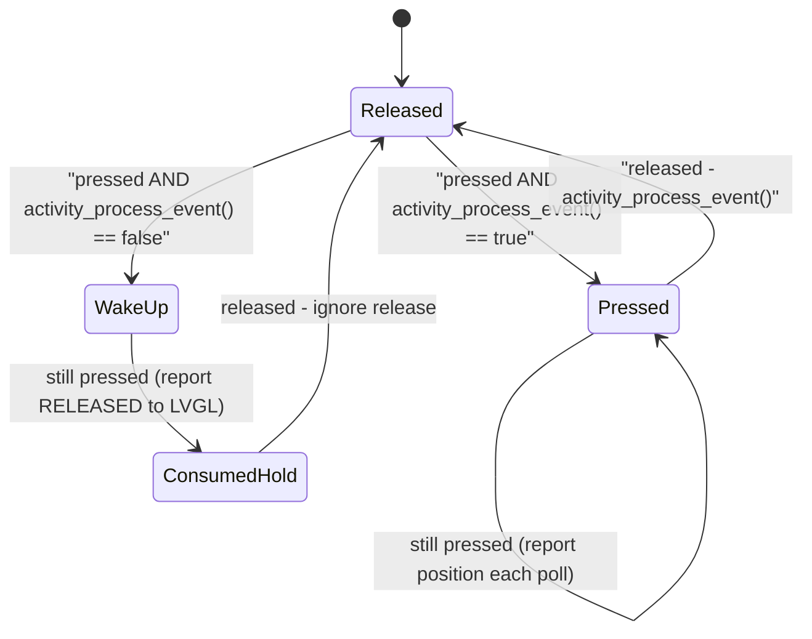
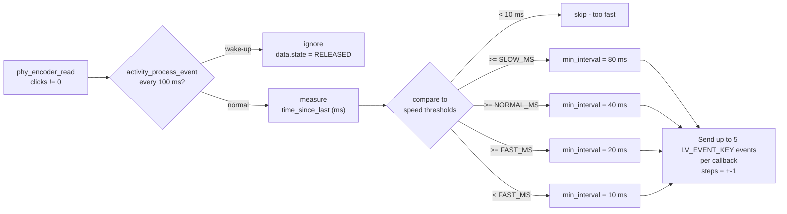
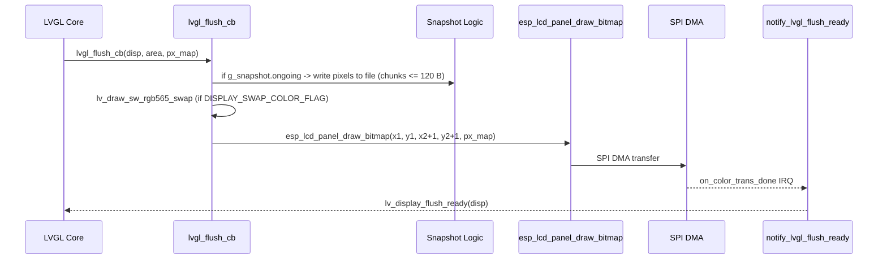
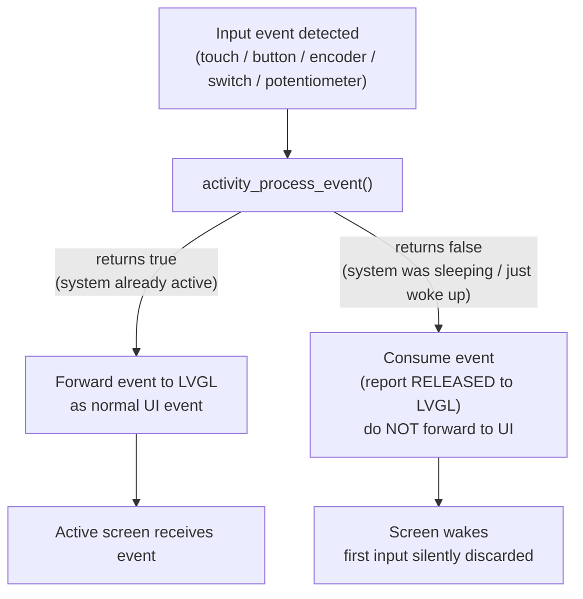
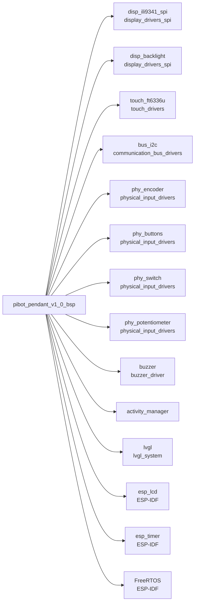

# PiBot Pendant v1.0 — Board Support Package (BSP)

The `pibot_pendant_v1_0_bsp` module is the hardware abstraction layer for the **PiBot CNC Pendant v1.0** board. It initialises every piece of hardware on the pendant — display, touch, physical buttons, rotary encoder, 4-position switch, analog potentiometer, buzzer, and backlight — and wires each peripheral into the LVGL input-device subsystem so the rest of the firmware can operate on pure UI events without knowing anything about the underlying hardware.

Within the family of supported boards this is the most input-rich BSP: it is the only board that simultaneously supports a capacitive touch panel, physical push-buttons, a rotary encoder, a multi-position switch, and an analog potentiometer.

---

## Table of Contents

1. [Module Files](#1-module-files)
2. [Hardware Overview](#2-hardware-overview)
3. [Architecture](#3-architecture)
4. [Component Details](#4-component-details)
   - 4.1 [board\_init.c — Master Initialisation](#41-board_initc--master-initialisation)
   - 4.2 [control\_event.h — Unified Event Structure](#42-control_eventh--unified-event-structure)
   - 4.3 [control\_types.c — Custom LVGL Event Registration](#43-control_typesc--custom-lvgl-event-registration)
   - 4.4 [esp3d\_snapshot.h — Screen Capture State](#44-esp3d_snapshoth--screen-capture-state)
5. [Initialisation Sequence](#5-initialisation-sequence)
6. [Input Subsystems](#6-input-subsystems)
   - 6.1 [Capacitive Touch (FT6336U)](#61-capacitive-touch-ft6336u)
   - 6.2 [Physical Buttons](#62-physical-buttons)
   - 6.3 [Rotary Encoder](#63-rotary-encoder)
   - 6.4 [4-Position Switch](#64-4-position-switch)
   - 6.5 [Analog Potentiometer](#65-analog-potentiometer)
7. [Display Pipeline](#7-display-pipeline)
   - 7.1 [LVGL Flush & DMA Completion](#71-lvgl-flush--dma-completion)
   - 7.2 [Screen Snapshot Feature](#72-screen-snapshot-feature)
8. [Activity Manager Integration](#8-activity-manager-integration)
9. [Custom LVGL Events](#9-custom-lvgl-events)
10. [Feature Flags](#10-feature-flags)
11. [Dependencies](#11-dependencies)
12. [Related Modules](#12-related-modules)

---

## 1. Module Files

| File | Purpose |
|------|---------|
| `boards/pibot_pendant_v1_0/components/bsp/board_init.c` | Master board initialisation; all LVGL callbacks |
| `boards/pibot_pendant_v1_0/components/bsp/control_event.h` | `control_event_t` — unified payload for all input events |
| `boards/pibot_pendant_v1_0/components/bsp/control_types.c` | Registers custom LVGL event codes at runtime |
| `boards/pibot_pendant_v1_0/components/bsp/esp3d_snapshot.h` | `snapshot_state_t` — state struct for screen capture |

---

## 2. Hardware Overview

| Peripheral | Part / Interface | Feature Flag |
|-----------|-----------------|--------------|
| Display | ILI9341 over SPI | `ESP3D_DISPLAY_FEATURE` |
| Backlight | PWM via `disp_backlight` | `ESP3D_BRIGHTNESS_CONTROL_FEATURE` |
| Touch | FT6336U over I2C | `ESP3D_TOUCH_FEATURE` |
| Physical buttons | 3 GPIO buttons via `phy_buttons` | `ESP3D_HARDWARE_BUTTONS_FEATURE` |
| Rotary encoder | Quadrature encoder via `phy_encoder` (PCNT) | `ESP3D_HARDWARE_ENCODER_FEATURE` |
| 4-position switch | 4 GPIO inputs via `phy_switch` | `ESP3D_HARDWARE_SWITCH_FEATURE` |
| Potentiometer | ADC via `phy_potentiometer` | `ESP3D_HARDWARE_POTENTIOMETER_FEATURE` |
| Buzzer | PWM/GPIO via `buzzer` | `ESP3D_BUZZER_FEATURE` |

The ILI9341 display uses an SPI bus (`disp_ili9341_spi` driver). The FT6336U capacitive touch controller shares an I2C bus (`bus_i2c`) initialised with the pin pair defined by `TOUCH_SDA_PIN` / `TOUCH_SCL_PIN` in `board_config.h`.

---

## 3. Architecture

```mermaid
graph TD
    subgraph BSP["pibot_pendant_v1_0_bsp"]
        BI[board_init.c]
        CE[control_event.h]
        CT[control_types.c]
        SN[esp3d_snapshot.h]
    end

    subgraph HW_Drivers["Hardware Drivers"]
        ILI[disp_ili9341_spi]
        BL[disp_backlight]
        FT[touch_ft6336u]
        I2C[bus_i2c]
        PENC[phy_encoder]
        PBTN[phy_buttons]
        PSWI[phy_switch]
        PPOT[phy_potentiometer]
        BUZ[buzzer]
    end

    subgraph LVGL_Layer["LVGL Layer"]
        LDISP[lv_display]
        LINDEV_T[touch indev]
        LINDEV_B[button indev]
        LINDEV_E[encoder indev]
        LINDEV_S[switch indev]
        LINDEV_P[potentiometer indev]
    end

    subgraph App["Application Layer"]
        AM[activity_manager]
        UI[ESP3DXUi / UIManager]
        SCR[Screens]
    end

    BI -->|configures| ILI
    BI -->|configures| BL
    BI -->|configures| FT
    BI -->|init I2C bus| I2C
    I2C --> FT
    BI -->|configures| PENC
    BI -->|configures| PBTN
    BI -->|configures| PSWI
    BI -->|configures| PPOT
    BI -->|configures| BUZ

    BI -->|lv_display_create| LDISP
    BI -->|lv_indev_create| LINDEV_T
    BI -->|lv_indev_create| LINDEV_B
    BI -->|lv_indev_create| LINDEV_E
    BI -->|lv_indev_create| LINDEV_S
    BI -->|lv_indev_create| LINDEV_P

    FT -.->|touch_ft6336u_read| LINDEV_T
    PBTN -.->|phy_buttons_read| LINDEV_B
    PENC -.->|phy_encoder_read| LINDEV_E
    PSWI -.->|phy_switch_read| LINDEV_S
    PPOT -.->|phy_potentiometer_read| LINDEV_P

    CE -->|payload type| LINDEV_B
    CE -->|payload type| LINDEV_E
    CE -->|payload type| LINDEV_S
    CE -->|payload type| LINDEV_P
    CT -->|registers custom events| LVGL_Layer

    LINDEV_T -->|LV_EVENT_PRESSED| SCR
    LINDEV_B -->|LV_EVENT_PRESSED/RELEASED + control_event_t| SCR
    LINDEV_E -->|LV_EVENT_KEY + control_event_t| SCR
    LINDEV_S -->|LV_EVENT_SWITCH_PRESSED/RELEASED + control_event_t| SCR
    LINDEV_P -->|LV_EVENT_POTENTIOMETER_CHANGED + control_event_t| SCR

    BI -->|activity_manager_init| AM
    AM -.->|activity_process_event| LINDEV_T
    AM -.->|activity_process_event| LINDEV_B
    AM -.->|activity_process_event| LINDEV_E
    AM -.->|activity_process_event| LINDEV_S
    AM -.->|activity_process_event| LINDEV_P

    SN -.->|g_snapshot| BI

    UI -->|get_lvgl_display| BI
    UI -->|get_lvgl_lock| BI
    UI -->|get_touch_indev| BI
    UI -->|get_button_indev| BI
    UI -->|get_encoder_indev| BI
    UI -->|get_switch_indev| BI
    UI -->|get_potentiometer_indev| BI
```



---

## 4. Component Details

### 4.1 `board_init.c` — Master Initialisation

This single file is the entry point for all hardware on the pendant. It owns:

- **Module-level statics** (all guarded by feature flags): `lvgl_display`, `lvgl_buf1/2`, `lvgl_tick_timer`, and one `lv_indev_t *` per input device.
- **`board_init()`** — the only function called by the outer firmware (via `board_init.h`). It executes the full hardware initialisation sequence in a strict dependency order (see §5).
- **LVGL flush pipeline** — `lvgl_flush_cb()` + `notify_lvgl_flush_ready()` (see §7).
- **Five LVGL read callbacks** — one per input device (see §6).
- **Accessor functions** — `get_lvgl_display()`, `get_lvgl_lock()`, `get_touch_indev()`, etc., called by `ESP3DXUi` during UI task startup.

```c
// Public API exposed by board_init.c
esp_err_t      board_init(void);
const char    *board_get_name(void);
const char    *board_get_version(void);

lv_display_t  *get_lvgl_display(void);
_lock_t        *get_lvgl_lock(void);

lv_indev_t    *get_touch_indev(void);         // ESP3D_TOUCH_FEATURE
lv_indev_t    *get_button_indev(void);        // ESP3D_HARDWARE_BUTTONS_FEATURE
lv_indev_t    *get_encoder_indev(void);       // ESP3D_HARDWARE_ENCODER_FEATURE
lv_indev_t    *get_switch_indev(void);        // ESP3D_HARDWARE_SWITCH_FEATURE
lv_indev_t    *get_potentiometer_indev(void); // ESP3D_HARDWARE_POTENTIOMETER_FEATURE
```

### 4.2 `control_event.h` — Unified Event Structure

All non-touch input devices (buttons, encoder, switch, potentiometer) deliver events to the active LVGL screen using a common payload. The pointer to this struct is passed as the `user_data` argument of `lv_obj_send_event()`.

```c
typedef struct {
    lv_indev_t       *indev;          // LVGL indev handle that originated this event
    uint32_t          btn_id;         // Button/switch channel index (0-based)
    lv_indev_type_t   type;           // LV_INDEV_TYPE_BUTTON / ENCODER / POINTER
    control_family_t  family_id;      // Which physical input family
    int32_t           steps;          // Encoder clicks (+-1) or potentiometer mapped value (0-100)
    uint32_t          press_duration; // Milliseconds since the corresponding PRESSED event
} control_event_t;
```

`control_family_t` is declared in `control_types.h` and enumerates `CONTROL_FAMILY_BUTTONS`, `CONTROL_FAMILY_ENCODER`, `CONTROL_FAMILY_SWITCH`, `CONTROL_FAMILY_POTENTIOMETER`. Screens use `family_id` to distinguish which physical device sent the event when multiple indevs share the same LVGL event code (e.g. both button and switch indevs raise `LV_EVENT_PRESSED`).

### 4.3 `control_types.c` — Custom LVGL Event Registration

LVGL only defines a fixed set of built-in event codes. To express switch and potentiometer state changes cleanly, three additional codes are registered at runtime after `lv_init()`:

| Global variable | Value at start | Assigned by |
|----------------|---------------|-------------|
| `LV_EVENT_SWITCH_PRESSED` | `LV_EVENT_ALL` (sentinel) | `lv_event_register_id()` |
| `LV_EVENT_SWITCH_RELEASED` | `LV_EVENT_ALL` | `lv_event_register_id()` |
| `LV_EVENT_POTENTIOMETER_CHANGED` | `LV_EVENT_ALL` | `lv_event_register_id()` |

`control_events_init()` is called at the end of `init_lvgl()` (inside `board_init()`). After the call, all three globals hold unique `lv_event_code_t` values that can be used with `lv_obj_add_event_cb()` and `lv_obj_send_event()` anywhere in the application. See §9 for usage examples.

### 4.4 `esp3d_snapshot.h` — Screen Capture State

When `ESP3D_SNAPSHOT_FEATURE` is enabled, the flush callback intercepts the raw pixel data that LVGL pushes to the display and accumulates it into a file. The entire snapshot subsystem is coordinated through a single global struct:

```c
typedef struct {
    FILE                *file;             // Open file receiving pixel data
    volatile bool        error;            // Set on any write failure
    uint32_t             expected_pixels;  // Total pixels in one full frame
    volatile uint32_t    captured_pixels;  // Running count of pixels written
    SemaphoreHandle_t    mutex;            // Guards concurrent flush access
    volatile bool        initialized;      // Snapshot system ready
    volatile bool        ongoing;          // A capture is in progress
} snapshot_state_t;

extern snapshot_state_t g_snapshot;
```

The `ongoing` flag is the sole gate: the flush callback checks it atomically before attempting to take the mutex. Pixel data is written in chunks of up to 120 bytes to stay within the safe stack-buffer limit for embedded targets (see memory constraints in CLAUDE.md). When `captured_pixels >= expected_pixels`, `ongoing` is cleared, stopping the capture.

Refer to the ``lvgl_system`` module for the higher-level snapshot API (`esp3d_snapshot_deinit`).

---

## 5. Initialisation Sequence

`board_init()` runs once from the application entry point before the LVGL UI task starts. The order is fixed by hardware dependencies.



**Failure handling**: every step checks `ret != ESP_OK` and returns immediately with an error log. The caller (`ESP3DX::begin()`) is responsible for halting startup if board initialisation fails.

**Backlight** is set to 0 before display initialisation so the user never sees garbage on the panel during the init sequence. It is raised to the configured brightness level later by the UI layer once the first screen is rendered.

---

## 6. Input Subsystems

All input devices are polled by LVGL's internal timer via their registered read callbacks. The polling period for each indev uses LVGL's default refresh period **except** the touch indev, whose timer is explicitly shortened to **10 ms** to reduce the chance of missing rapid press/release cycles.

### 6.1 Capacitive Touch (FT6336U)

**Callback**: `touch_read_cb()`  
**LVGL type**: `LV_INDEV_TYPE_POINTER`  
**Polling period**: 10 ms (overridden from default)

The callback implements edge-detection to avoid flooding LVGL with repeated pressed/released transitions:



- **Wake-up cycle**: the very first touch after screen timeout is consumed (reported as `RELEASED` to LVGL) so it only wakes the display and is never forwarded to the application as a UI action.
- **Position reporting**: while held, coordinates are forwarded to LVGL on every polling cycle.

### 6.2 Physical Buttons

**Callback**: `button_read_cb()`  
**LVGL type**: `LV_INDEV_TYPE_BUTTON`  
**Channels**: 3 (indices 0, 1, 2)

Processing order within one callback invocation: **all released transitions are handled before pressed transitions**. This prevents the corner case where a button that transitions released to pressed in the same poll cycle fires its press before its release.

Each button:
- Gets its own `control_event_t` with `family_id = CONTROL_FAMILY_BUTTONS` and `btn_id = i`.
- Accumulates `press_duration` (ms) between the start of the press and the release.
- Routes events directly to the active screen via `lv_obj_send_event(active_screen, LV_EVENT_PRESSED/RELEASED, &button_events[i])`.
- Applies the same wake-up consumption logic as touch: the first press after inactivity is consumed.

The active screen pointer is validated before each event dispatch; if the screen is destroyed mid-callback, the event is silently dropped with a log message.

### 6.3 Rotary Encoder

**Callback**: `encoder_read_cb()`  
**LVGL type**: `LV_INDEV_TYPE_ENCODER`  
**Direction**: software-invertible via `ENCODER_INVERT_ROTATION`

The encoder uses an **adaptive speed algorithm** to balance responsiveness against LVGL overload:



Activity notification is throttled to once per 100 ms to prevent blocking the callback on frequent encoder spins.

Each event sent to the active screen carries a `control_event_t` with:
- `family_id = CONTROL_FAMILY_ENCODER`
- `steps = +1` (clockwise) or `-1` (counter-clockwise)
- `type = LV_INDEV_TYPE_ENCODER`

### 6.4 4-Position Switch

**Callback**: `switch_read_cb()`  
**LVGL type**: `LV_INDEV_TYPE_BUTTON` (4 virtual channels)  
**Custom events**: `LV_EVENT_SWITCH_PRESSED`, `LV_EVENT_SWITCH_RELEASED`

The switch models an exclusive rotary selector: only one position can be active at a time. The driver (`phy_switch_read`) returns `ESP_ERR_INVALID_RESPONSE` for physically impossible multi-position states (hardware wiring error or contact bounce). Those states are silently dropped and **do not trigger the activity manager**, preventing spurious wake-ups.

Processing: released transitions fire before pressed transitions (same pattern as buttons). Events are dispatched directly to the active screen:

```c
lv_obj_send_event(active_screen, LV_EVENT_SWITCH_PRESSED,  &switch_events[i]);
lv_obj_send_event(active_screen, LV_EVENT_SWITCH_RELEASED, &switch_events[i]);
```

The `control_event_t` payload carries `btn_id = i` (0–3) and `family_id = CONTROL_FAMILY_SWITCH`.

### 6.5 Analog Potentiometer

**Callback**: `potentiometer_read_cb()`  
**LVGL type**: `LV_INDEV_TYPE_POINTER` (repurposed for analog value)  
**Custom event**: `LV_EVENT_POTENTIOMETER_CHANGED`  
**Mapped range**: 0–100 (from ADC raw 0–4095)

The potentiometer ADC is noisy, so the callback applies an **adaptive threshold** scheme:

| Condition | Threshold |
|-----------|-----------|
| Inactive longer than `POT_INACTIVITY_THRESHOLD_MS` | `POT_WAKE_THRESHOLD_MAPPED` (high — suppresses ADC noise) |
| Direction change detected (active use) | 1 (ultra-sensitive) |
| Descending value (active use) | 2 |
| Ascending value (active use) | 3 |

A **last activity timestamp** tracks when the potentiometer last produced a real change. If no real change occurs within `POT_INACTIVITY_THRESHOLD_MS`, the threshold reverts to the high noise-suppression value so idle ADC dithering does not repeatedly wake the screen.

On first call, `initialization_done` latches the current value so there is no startup jump.

The `control_event_t.steps` field carries the **mapped value (0–100)**, not a delta. Screens receiving `LV_EVENT_POTENTIOMETER_CHANGED` read `.steps` as the absolute potentiometer position.

---

## 7. Display Pipeline

### 7.1 LVGL Flush & DMA Completion



`lv_display_flush_ready()` is called **only** from `notify_lvgl_flush_ready()` (the SPI DMA completion callback registered via `esp_lcd_panel_io_register_event_callbacks()`), never from `lvgl_flush_cb()` directly. This ensures LVGL waits for hardware completion before starting the next render cycle.

`DISPLAY_SWAP_COLOR_FLAG` is a compile-time constant in `board_config.h`. When set, the RGB565 byte order is swapped before the DMA transfer to match the ILI9341's native byte order.

### 7.2 Screen Snapshot Feature

When `ESP3D_SNAPSHOT_FEATURE` is enabled, `lvgl_flush_cb()` intercepts pixel data before it reaches the SPI bus. The snapshot is accumulated across multiple flush calls (LVGL flushes partial areas in `LV_DISPLAY_RENDER_MODE_PARTIAL` mode) until `captured_pixels >= expected_pixels`.

Key constraints:

- **Chunk size**: pixel data is written in at most 120-byte chunks to stay within the safe stack-buffer limit for embedded targets.
- **Mutex**: `g_snapshot.mutex` is attempted with a zero timeout (`xSemaphoreTake(..., 0)`). If the mutex is unavailable, the flush proceeds without writing, keeping LVGL unblocked.
- **Error recovery**: any `fwrite` failure sets `g_snapshot.error = true` and `g_snapshot.ongoing = false`, cleanly terminating the capture without affecting the display pipeline.
- **Pixel format**: inferred from `sizeof(lv_color_t)` at runtime — 2 bytes for RGB565, 4 bytes for ARGB8888.

---

## 8. Activity Manager Integration

All five input callbacks query the **activity manager** before processing any event. This creates a unified screen wake-up mechanism across all input types.



Each input type has slightly different activity-check throttling:

| Input | When `activity_process_event()` is called |
|-------|------------------------------------------|
| Touch | On every press transition (not-pressed to pressed) |
| Buttons | On every press transition; on release if press was not a wake-up |
| Encoder | At most once per 100 ms window |
| Switch | On every valid pressed transition; invalid (multi-position) states skip it entirely |
| Potentiometer | Only when a real change above the adaptive threshold is detected |

See [`activity_manager`](esp3d_activity_manager.md) for `activity_manager_init()` and `activity_process_event()` implementation details.

---

## 9. Custom LVGL Events

This BSP registers three LVGL event codes that are absent from all other board BSPs in the project:

| Event code | Trigger | Payload (`user_data`) |
|-----------|---------|----------------------|
| `LV_EVENT_SWITCH_PRESSED` | Switch channel transitions to active | `control_event_t *` with `family_id = CONTROL_FAMILY_SWITCH`, `btn_id = 0..3` |
| `LV_EVENT_SWITCH_RELEASED` | Switch channel transitions to inactive | Same |
| `LV_EVENT_POTENTIOMETER_CHANGED` | Potentiometer crosses adaptive threshold | `control_event_t *` with `steps = 0..100` |

These codes are registered by `control_events_init()` using `lv_event_register_id()`, which returns unique integers beyond `LV_EVENT_LAST`. The globals are declared `extern` in `control_types.h` and visible to all screens.

**Usage in screens:**

```c
// Register in a screen's create() function
lv_obj_add_event_cb(screen_obj, my_handler, LV_EVENT_SWITCH_PRESSED,       NULL);
lv_obj_add_event_cb(screen_obj, my_handler, LV_EVENT_POTENTIOMETER_CHANGED, NULL);

// In the handler
void my_handler(lv_event_t *e) {
    control_event_t *ctrl = (control_event_t *)lv_event_get_user_data(e);

    if (ctrl->family_id == CONTROL_FAMILY_SWITCH) {
        uint32_t position = ctrl->btn_id;   // 0-3
    }
    if (ctrl->family_id == CONTROL_FAMILY_POTENTIOMETER) {
        int32_t value = ctrl->steps;        // 0-100
    }
}
```

Primary consumers of these events: [`cnc_shared_screens`](cnc_shared.md) (`jog_screen`, `status_screen`, `macros_screen`).

---

## 10. Feature Flags

All optional hardware is controlled by compile-time flags defined in `board_config.h` (or `sdkconfig`). The BSP compiles cleanly with any combination:

| Flag | Guards |
|------|--------|
| `ESP3D_DISPLAY_FEATURE` | Entire display and LVGL subsystem |
| `ESP3D_BRIGHTNESS_CONTROL_FEATURE` | Backlight PWM initialisation |
| `ESP3D_TOUCH_FEATURE` | `init_touch_controller`, `touch_read_cb`, `touch_indev` |
| `ESP3D_HARDWARE_BUTTONS_FEATURE` | `button_read_cb`, `button_indev` |
| `ESP3D_HARDWARE_ENCODER_FEATURE` | `encoder_read_cb`, `encoder_indev` |
| `ESP3D_HARDWARE_SWITCH_FEATURE` | `switch_read_cb`, `switch_indev`, `LV_EVENT_SWITCH_*` |
| `ESP3D_HARDWARE_POTENTIOMETER_FEATURE` | `potentiometer_read_cb`, `potentiometer_indev`, `LV_EVENT_POTENTIOMETER_CHANGED` |
| `ESP3D_BUZZER_FEATURE` | `buzzer_configure` |
| `ESP3D_SNAPSHOT_FEATURE` | Snapshot block inside `lvgl_flush_cb` and `snapshot_state_t` |
| `DISPLAY_USE_DOUBLE_BUFFER_FLAG` | Allocates `lvgl_buf2` (DMA double buffer) |
| `ENCODER_INVERT_ROTATION` | Swaps encoder clockwise/counter-clockwise direction |

Build variant combinations are managed by [`pibot_pendant_v1_0_build`](pibot_pendant_v1_0_build_scripts.md).

---

## 11. Dependencies



| Dependency | Purpose |
|-----------|---------|
| [`display_drivers_spi`](display_drivers_spi.md) | ILI9341 SPI panel driver and backlight driver |
| [`touch_drivers`](touch_drivers.md) | FT6336U capacitive touch driver |
| [`communication_bus_drivers`](bus_drivers.md) | Shared I2C bus initialisation for the touch controller |
| [`physical_input_drivers`](physical_input.md) | Encoder (PCNT), GPIO buttons, 4-position switch, potentiometer (ADC) |
| [`buzzer_driver`](buzzer.md) | Buzzer tone output |
| [`activity_manager`](esp3d_activity_manager.md) | Screen timeout and wake-up management |
| ``lvgl_system`` | LVGL core, display, indev, event, and timer subsystems |
| `esp_lcd` (ESP-IDF) | LCD panel IO abstraction and DMA completion callbacks |
| `esp_timer` (ESP-IDF) | High-resolution tick timer driving `lv_tick_inc` |
| `FreeRTOS` (ESP-IDF) | `SemaphoreHandle_t` mutex used in snapshot state |

---

## 12. Related Modules

| Module | Relationship |
|--------|-------------|
| [`pibot_pendant_v1_0_factory_app`](pibot_pendant_v1_0_factory_app.md) | Factory test application for the same hardware; uses its own lightweight ILI9341 driver (`ili9341.c`) without LVGL |
| [`pibot_pendant_v1_0_bootloader`](pibot_pendant_v1_0_bootloader.md) | Custom bootloader with button-triggered OTA recovery (`is_button_pressed`, `backup_and_erase_otadata`, `beep_confirm`) |
| [`pibot_pendant_v1_0_build`](pibot_pendant_v1_0_build_scripts.md) | Build scripts (`build_one.py`, `variants.py`, `common.py`) controlling which feature flags are compiled in |
| [`bsp`](bsp.md) | All other board BSPs — reference for understanding what is common (touch, display, buttons) vs. unique to this board (encoder, switch, potentiometer) |
| [`cnc_shared_screens`](cnc_shared.md) | Primary consumer of `LV_EVENT_SWITCH_PRESSED`, `LV_EVENT_POTENTIOMETER_CHANGED`, and the `control_event_t` payload |
| ``lvgl_system`` | Owns `esp3d_snapshot_deinit()` and `lv_timer_pause_all/resume_all` used alongside the snapshot capture feature |
| [`activity_monitoring`](activity_monitoring.md) | UI-side activity monitoring that complements the BSP-side `activity_manager` integration |


## Documents de conception (depot)

- [pibot-cnc-pendant-hardware-documentation.md](https://github.com/luc-github/Pibot-cnc-pendant-firmware/blob/main/docs/hardware/pibot-cnc-pendant-hardware-documentation.md)
