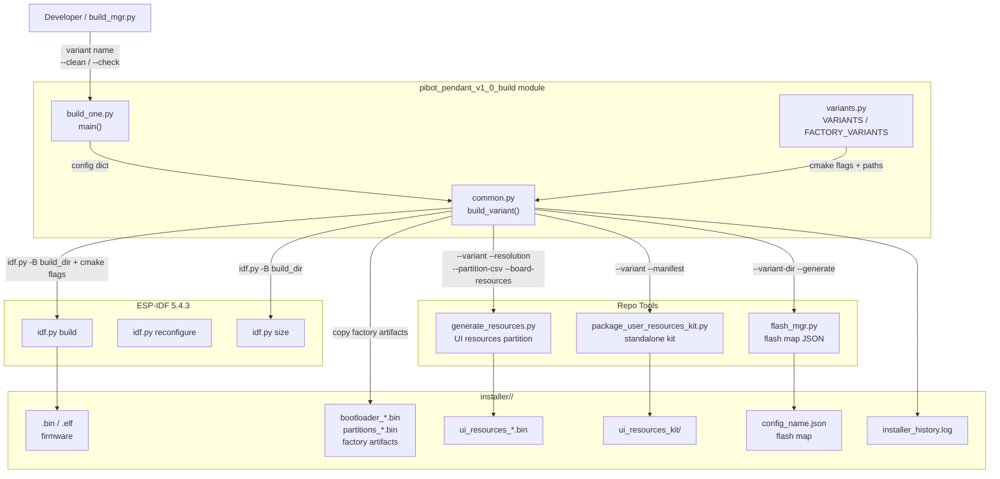
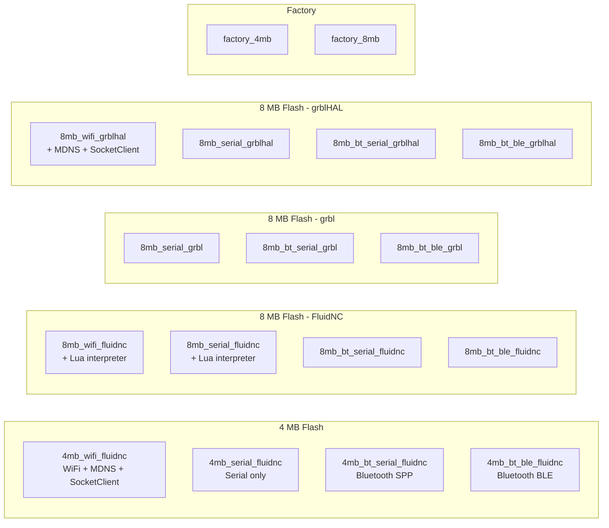
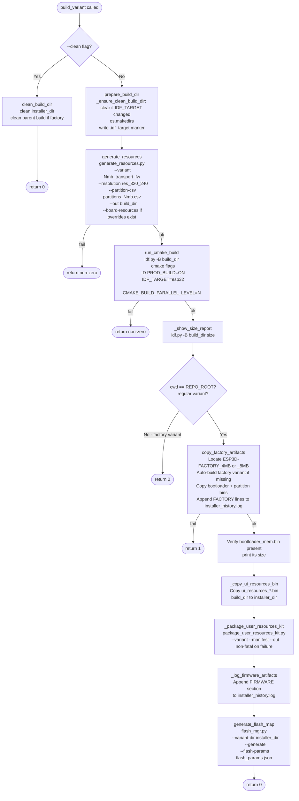
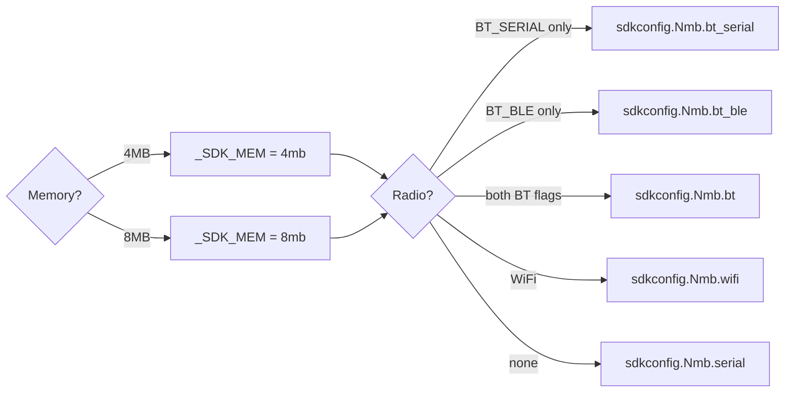
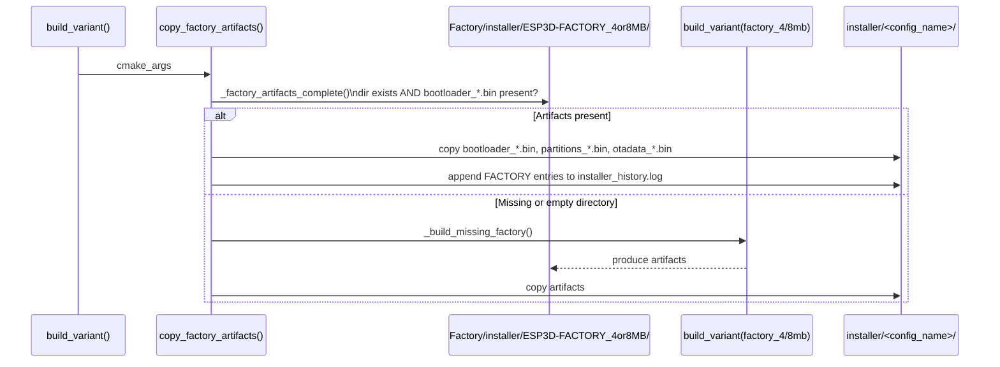
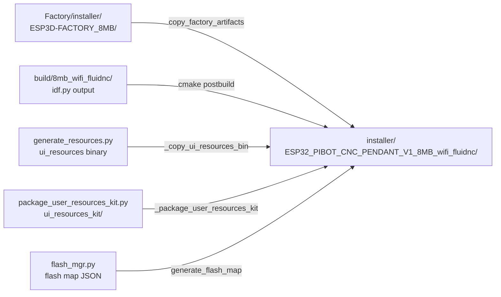
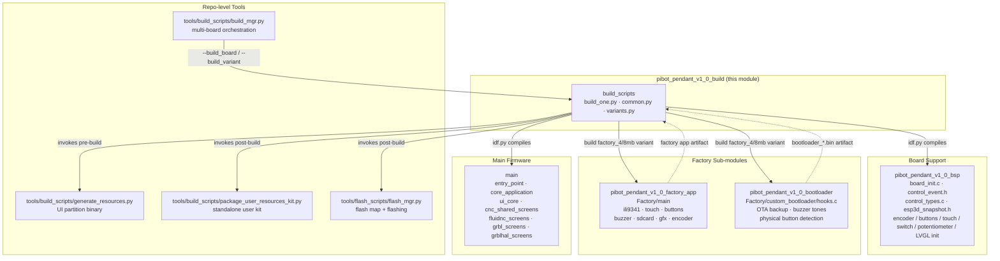

# pibot_pendant_v1_0_build

Build system scripts for the **PiBot CNC Pendant v1.0** board. This module is the single authoritative place for defining which firmware configurations exist for this board, how they are compiled, and how all output artifacts are assembled into an installer-ready directory. It wraps ESP-IDF's `idf.py` with board-specific logic: variant flag resolution, UI-resource generation, factory-artifact injection, user-kit packaging, and flash-map generation.

---

## Table of Contents

1. [Module Location and File Map](#1-module-location-and-file-map)
2. [Architecture Overview](#2-architecture-overview)
3. [Variant System](#3-variant-system)
4. [Build Pipeline](#4-build-pipeline)
5. [Factory Artifact Management](#5-factory-artifact-management)
6. [Installer Output Structure](#6-installer-output-structure)
7. [Partition Layout Reference](#7-partition-layout-reference)
8. [Board Configuration Constants](#8-board-configuration-constants)
9. [Tool Integration](#9-tool-integration)
10. [Usage Reference](#10-usage-reference)
11. [Component Relationships](#11-component-relationships)

---

## 1. Module Location and File Map

```
boards/pibot_pendant_v1_0/
├── build_scripts/
│   ├── build_one.py     ← CLI entry point for single-variant builds
│   ├── common.py        ← Build orchestration: pipeline, helpers, naming
│   └── variants.py      ← All variant definitions (flags + paths)
├── board_config.cmake   ← CMake board profile (IDF_TARGET, sdkconfig selection, hw flags)
├── flash_params.json    ← Chip/flash protocol parameters for flash_mgr
├── partitions_4mb.csv   ← Flash partition table for 4 MB builds
├── partitions_8mb.csv   ← Flash partition table for 8 MB builds
├── sdkconfig.<mem>.<radio>  ← Per-radio sdkconfig defaults (applied once at first configure)
├── resources/           ← Board-specific UI resource overrides (boot logo, etc.)
├── Factory/             ← Factory test app (see pibot_pendant_v1_0_factory_app)
└── components/bsp/      ← Board support package (see pibot_pendant_v1_0_bsp)
```

---

## 2. Architecture Overview

The build module is a pure Python layer that sits between the developer and ESP-IDF. It never compiles code directly — instead it drives `idf.py` with the correct flags, coordinates pre- and post-build steps, and ensures all output lands in the right installer directory.



---

## 3. Variant System

### 3.1 Variant Structure

Every variant is a Python dictionary with four keys:

| Key | Type | Description |
|-----|------|-------------|
| `name` | `str` | Unique variant identifier (also the CLI argument) |
| `cmake` | `list[str]` | Flat list of `-D flag=value` arguments passed to `idf.py` |
| `cwd` | `str` | Working directory for `idf.py` (`REPO_ROOT` for regular, `FACTORY_DIR` for factory) |
| `build_dir` | `str` | Absolute path to the isolated build directory |

### 3.2 Flag Composition — `make_variant_args()`

`variants.py` defines `ROOT_CMAKE_OPTIONS`: a master list of every CMake option the project recognises. `DEFAULT_OFF_CMAKE_ARGS` is generated from this list with every flag set to `OFF`. `make_variant_args(*on_flags)` copies that baseline and enables only the listed flags:

```python
# Result is a clean, deterministic cmake arg list with no stale options
make_variant_args("ESP32_PIBOT_CNC_PENDANT_V1=ON", "MEMORY_8_MB=ON", "WIFI_SERVICE=ON", ...)
# → [..., "-D", "ESP32_PIBOT_CNC_PENDANT_V1=ON", ..., "-D", "MEMORY_8_MB=ON",
#    ..., "-D", "WIFI_SERVICE=ON", ...]
```

This "deny-all, allow-selected" pattern prevents stale flags from a previous build leaking into a different variant's configuration.

### 3.3 Full Variant Matrix



#### Feature flags per variant category

| Flag | 4MB WiFi | 4MB Serial | 4MB BT-SPP | 4MB BT-BLE | 8MB WiFi | 8MB Serial | 8MB BT |
|------|:---:|:---:|:---:|:---:|:---:|:---:|:---:|
| `SERIAL_SERVICE` | ✓ | ✓ | ✓ | ✓ | ✓ | ✓ | ✓ |
| `UART_EXT_SERVICE` | ✓ | ✓ | ✓ | ✓ | ✓ | ✓ | ✓ |
| `TFT_UI_SERVICE` | ✓ | ✓ | ✓ | ✓ | ✓ | ✓ | ✓ |
| `TFT_TOUCH_SERVICE` | ✓ | ✓ | ✓ | ✓ | ✓ | ✓ | ✓ |
| `SD_CARD_SERVICE` | ✓ | ✓ | ✓ | ✓ | ✓ | ✓ | ✓ |
| `BUZZER_SERVICE` | ✓ | ✓ | ✓ | ✓ | ✓ | ✓ | ✓ |
| `UPDATE_SERVICE` | ✓ | ✓ | ✓ | ✓ | ✓ | ✓ | ✓ |
| `FACTORY_SERVICE` | ✓ | ✓ | ✓ | ✓ | ✓ | ✓ | ✓ |
| `WIFI_SERVICE` | ✓ | — | — | — | ✓ | — | — |
| `MDNS_SERVICE` | ✓ | — | — | — | ✓¹ | — | — |
| `SOCKET_CLIENT_SERVICE` | ✓ | — | — | — | ✓¹ | — | — |
| `BT_SERVICE` | — | — | ✓ | ✓ | — | — | ✓ |
| `BT_SERIAL_SERVICE` | — | — | ✓ | — | — | — | ✓² |
| `BT_BLE_SERVICE` | — | — | — | ✓ | — | — | ✓² |
| `LUA_INTERPRETER_SERVICE` | — | — | — | — | ✓³ | ✓³ | — |

> ¹ WiFi variants use `SOCKET_CLIENT_SERVICE` (CNC over TCP) + `MDNS_SERVICE`. This matches the WiFi-as-CNC-transport model described in [feature_resource_matrix.md](https://github.com/luc-github/Pibot-cnc-pendant-firmware/blob/main/docs/features/feature_resource_matrix.md).  
> ² `BT_SERIAL_SERVICE` and `BT_BLE_SERVICE` are mutually exclusive — never both `ON`.  
> ³ Lua is available only in 8 MB WiFi/serial FluidNC builds. BT variants and all 4 MB builds cannot accommodate it within the ESP32 RAM budget.

### 3.4 Variant Naming Convention

The installer output directory name is derived by `build_config_name()`:

```
ESP32_PIBOT_CNC_PENDANT_V1_{MEMORY}{radio}_{firmware}
```

| Component | Values |
|-----------|--------|
| `{MEMORY}` | `4MB`, `8MB` |
| `{radio}` | `_wifi`, `_serial`, `_bt_serial`, `_bt_ble`, `_bt` |
| `{firmware}` | `fluidnc`, `grblhal`, `grbl` |

Examples:

```
ESP32_PIBOT_CNC_PENDANT_V1_8MB_wifi_fluidnc
ESP32_PIBOT_CNC_PENDANT_V1_4MB_bt_serial_fluidnc
ESP32_PIBOT_CNC_PENDANT_V1_8MB_serial_grblhal
```

The **resource variant string** (used by `generate_resources.py`) uses a shorter form:

```
{N}mb_{transport}_{firmware}          e.g.  8mb_wifi_fluidnc
```

Factory variants produce no resource variant string — they carry no `ui_resources` partition.

---

## 4. Build Pipeline

### 4.1 Full Sequence — `build_variant(config)`



### 4.2 Check-Only Path — `check_variant(config)`

Used by `build_one.py --check` and `build_mgr.py --check_*`. Runs only the CMake configure step — no compilation — so it validates flag legality and `sanity_check.cmake` rules quickly:

```
idf.py -B build_dir [cmake flags] -D PROD_BUILD=ON reconfigure
```

### 4.3 IDF Target Guard — `prepare_build_dir()`

Each build directory stores a `.idf_target` marker file. On every invocation, `_ensure_clean_build_dir()` reads this file and wipes the directory if the stored value differs from `EXPECTED_IDF_TARGET` (`"esp32"`). This prevents cross-target contamination when the same repo builds both `esp32` and `esp32s3` boards.

### 4.4 sdkconfig Selection (CMake side)

`board_config.cmake` selects the correct sdkconfig defaults file at CMake configure time. The selection applies **only once** when `build/<variant>/sdkconfig` does not yet exist, preserving subsequent `menuconfig` changes:



### 4.5 Parallel Builds

Parallel compilation is controlled via the `CMAKE_BUILD_PARALLEL_LEVEL` environment variable (`idf.py` has no `-j` CLI option). Pass `--jobs=N` through `build_mgr.py`:

```bash
python tools/build_scripts/build_mgr.py --build_board pibot_pendant_v1_0 --jobs=8
```

`common.py` extracts `--jobs=N` from `sys.argv` and injects the value into the subprocess environment.

---

## 5. Factory Artifact Management

Regular firmware variants depend on factory-app artifacts (custom bootloader binary, partition-table binaries) produced by the factory build. These are managed by `copy_factory_artifacts()`.



**Completeness check**: `_factory_artifacts_complete()` verifies that at least one `bootloader_*.bin` is present inside the directory. CMake's `file(MAKE_DIRECTORY)` can leave an empty directory behind on a failed factory build — directory existence alone is not sufficient.

The factory installer's `size_report.txt` is **not** copied to avoid overwriting the regular variant's own size report.

> For details on the factory app itself, see [pibot_pendant_v1_0_factory_app.md](pibot_pendant_v1_0_factory_app.md).  
> For the custom bootloader hooks, see [pibot_pendant_v1_0_bootloader.md](pibot_pendant_v1_0_bootloader.md).

---

## 6. Installer Output Structure

After a successful regular-variant build, the installer directory is self-contained for flashing:

```
installer/
└── ESP32_PIBOT_CNC_PENDANT_V1_8MB_wifi_fluidnc/
    ├── bootloader_8MB.bin                                ← FACTORY
    ├── partitions_8MB.bin                                ← FACTORY
    ├── otadata_initial_8MB.bin                           ← FACTORY
    ├── ESP32_PIBOT_CNC_PENDANT_V1_8MB_wifi_fluidnc.bin  ← FIRMWARE — main app
    ├── ESP32_PIBOT_CNC_PENDANT_V1_8MB_wifi_fluidnc.elf  ← FIRMWARE — debug symbols
    ├── ui_resources_8mb_wifi_fluidnc.bin                 ← FIRMWARE — UI partition image
    ├── ESP32_PIBOT_CNC_PENDANT_V1_8MB_wifi_fluidnc.json ← flash map (addresses + files)
    ├── installer_history.log                             ← timestamped audit log
    ├── size_report.txt                                   ← ROM/RAM usage summary
    └── ui_resources_kit/
        ├── README.md                                     ← end-user customisation guide
        ├── build_ui_resources_from_manifest.py           ← standalone builder script
        ├── ui_resources_manifest_8mb_wifi_fluidnc.json   ← source file list + offsets
        └── res_320_240/                                  ← default PNG/font sources
```

`installer_history.log` tags each file as `FACTORY` or `FIRMWARE` on every build run, creating a timestamped audit trail useful for diagnosing partial or mismatched builds.



---

## 7. Partition Layout Reference

Both layouts use a custom bootloader that requires `CONFIG_PARTITION_TABLE_OFFSET=0xC000` (44 KB bootloader, vs the ESP-IDF default 32 KB). The `ui_resources` partition (custom subtype `0x42`) is the UI resource store — see [ui_resources/development.md](https://github.com/luc-github/Pibot-cnc-pendant-firmware/blob/main/docs/ui_resources/development.md).

### 4 MB layout — single OTA slot

| Partition | Type | Offset | Size | Notes |
|-----------|------|--------|------|-------|
| `nvs` | data/nvs | `0xD000` | 12 KB | NVS-backed settings (`ESP3DSettings`) |
| `otadata` | data/ota | `0x10000` | 8 KB | OTA slot selector |
| `app0` | app/ota_0 | `0x20000` | 2,880 KB | Single app slot — OTA overwrites in place |
| `ui_resources` | data/`0x42` | `0x2F0000` | 192 KB | UI icons, fonts, theme colors |
| `flashfs` | data/spiffs | `0x320000` | 576 KB | LittleFS user file storage |

### 8 MB layout — dual OTA (A/B)

| Partition | Type | Offset | Size | Notes |
|-----------|------|--------|------|-------|
| `nvs` | data/nvs | `0xD000` | 12 KB | NVS-backed settings |
| `otadata` | data/ota | `0x10000` | 8 KB | OTA slot selector |
| `app0` | app/ota_0 | `0x20000` | 3,200 KB | OTA slot A |
| `app1` | app/ota_1 | `0x340000` | 3,200 KB | OTA slot B |
| `ui_resources` | data/`0x42` | `0x660000` | 192 KB | UI icons, fonts, theme colors |
| `flashfs` | data/spiffs | `0x690000` | 896 KB | LittleFS user file storage |

> **4 MB vs 8 MB**: The 4 MB layout has a single app slot — OTA overwrites it in place. The 8 MB layout adds a full `app1` slot for true atomic A/B OTA. Both keep the same 192 KB `ui_resources` allocation.

---

## 8. Board Configuration Constants

Defined across `common.py` and `board_config.cmake`:

| Constant | Value | Where set |
|----------|-------|-----------|
| `EXPECTED_IDF_TARGET` | `esp32` | `common.py` |
| `RESOLUTION` | `res_320_240` | `common.py` → `board_config.cmake` |
| `IDF_PATH` default | `C:\Users\luc\esp\v5.4.3\esp-idf` | `common.py` (override via `IDF_PATH` env var) |
| `TFT_TARGET` | `ESP32_PIBOT_CNC_PENDANT_V1` | `board_config.cmake` |
| `DEFAULT_ORIENTATION` | `PORTRAIT` | `board_config.cmake` |
| `DYNAMIC_ROTATION_FEATURE` | `OFF` | `board_config.cmake` |
| `FIXED_UI` | `ON` | `board_config.cmake` |
| `HARDWARE_BUTTONS` | `ON` | `board_config.cmake` |
| `HARDWARE_ENCODER` | `ON` | `board_config.cmake` |
| `HARDWARE_SWITCH` | `ON` | `board_config.cmake` |
| `HARDWARE_POTENTIOMETER` | `ON` | `board_config.cmake` |
| `TFT_BRIGHTNESS_CONTROL` | `ON` | `board_config.cmake` |
| `SHOW_MENU_FACTORY` | `OFF` | `board_config.cmake` |
| `ESP3D_HOSTNAME` | `PIBOT-CNC-PENDANT` | `board_config.cmake` |
| `ESP3D_FALLBACK_MODE` | `1` (stay in WiFi STA on failure) | `board_config.cmake` |
| Flash chip | `esp32`, `dio`, `80 MHz` | `flash_params.json` |

**Why `FIXED_UI=ON`?**  
The physical buttons, encoder, selector switch, and potentiometer are wired to fixed positions on the PCB enclosure. Unlike touch-only boards where the UI layout can be rotated freely, the on-screen virtual controls must mirror the physical controls' positions, so runtime orientation change is disabled.

**Why `SHOW_MENU_FACTORY=OFF`?**  
Factory mode is accessible via the `[ESP400]FACTORY` command and a physical boot-button hold. The on-screen Settings menu entry that other boards rely on is redundant here and is hidden.

**Why `ESP3D_FALLBACK_MODE=1`?**  
When a WiFi STA connection fails, the board stays in `wifi_sta` mode rather than falling back to AP mode. This lets the user reconnect manually via the connection status screen — appropriate for a pendant that is always within range of the machine's own network.

---

## 9. Tool Integration

### 9.1 `generate_resources.py`

Invoked **before** `idf.py build` so the `ui_resources` partition binary and `esp3d_ui_offsets.h` header are available when the firmware compiles. This guarantees that the compiled firmware's offset constants always match the partition being flashed.

```bash
generate_resources.py
  --variant       8mb_wifi_fluidnc
  --resolution    res_320_240
  --partition-csv boards/pibot_pendant_v1_0/partitions_8mb.csv
  --out           build/8mb_wifi_fluidnc/
  [--board-resources  boards/pibot_pendant_v1_0/resources/]  # only when dir exists
```

The `--board-resources` flag layers board-specific overrides (PiBot branded boot logo, one per firmware target) on top of the shared `resources/` defaults. See [ui_resources/development.md](https://github.com/luc-github/Pibot-cnc-pendant-firmware/blob/main/docs/ui_resources/development.md) for the override mechanism.

### 9.2 `package_user_resources_kit.py`

Assembles a self-contained kit that end users can run without cloning the full repo to customise icons, fonts, or theme colors and rebuild the `ui_resources` partition over SD card.

```bash
package_user_resources_kit.py
  --variant   8mb_wifi_fluidnc
  --manifest  build/8mb_wifi_fluidnc/ui_resources_manifest_8mb_wifi_fluidnc.json
  --out       installer/ESP32_PIBOT_CNC_PENDANT_V1_8MB_wifi_fluidnc/ui_resources_kit/
```

Failure is **non-fatal** — the build logs `WARN` and continues.

### 9.3 `flash_mgr.py`

Generates `<config_name>.json` describing the complete flash map (addresses + binary file paths). This file is consumed by the web installer and by `flash_mgr.py --flash`.

```bash
flash_mgr.py
  --variant-dir  installer/ESP32_PIBOT_CNC_PENDANT_V1_8MB_wifi_fluidnc/
  --generate
  --flash-params boards/pibot_pendant_v1_0/flash_params.json
```

### 9.4 `build_mgr.py`

The repo-level build manager (`tools/build_scripts/build_mgr.py`) discovers this module automatically by scanning `boards/*/build_scripts/variants.py` and delegates single-variant builds to `build_one.py`. Use `build_mgr.py` for multi-variant or multi-board batch operations; use `build_one.py` for targeted single-variant work.

---

## 10. Usage Reference

### Building a Single Variant

```bash
# Activate the ESP-IDF environment first
. $IDF_PATH/export.sh           # Linux/macOS
# $IDF_PATH/export.ps1          # Windows PowerShell

cd boards/pibot_pendant_v1_0/build_scripts

# Build one variant
python build_one.py 8mb_wifi_fluidnc

# Build with a fresh build directory
python build_one.py 8mb_wifi_fluidnc --clean

# Validate cmake flags only (no compilation)
python build_one.py 8mb_wifi_fluidnc --check

# List all available variants
python build_one.py
```

### Building via `build_mgr.py`

```bash
# Build all variants for this board
python tools/build_scripts/build_mgr.py --build_board pibot_pendant_v1_0

# Build a specific variant (board-qualified to avoid ambiguity)
python tools/build_scripts/build_mgr.py --build_variant pibot_pendant_v1_0/8mb_wifi_fluidnc

# Check all pibot variants — cmake configure only, fast
python tools/build_scripts/build_mgr.py --check_board pibot_pendant_v1_0

# Clean all pibot build + installer directories
python tools/build_scripts/build_mgr.py --clean_board pibot_pendant_v1_0

# Parallel build with 8 threads
python tools/build_scripts/build_mgr.py --build_board pibot_pendant_v1_0 --jobs=8
```

### Flashing

```bash
# Full flash via flash map (factory + firmware + ui_resources)
python tools/flash_scripts/flash_mgr.py \
  --variant-dir installer/ESP32_PIBOT_CNC_PENDANT_V1_8MB_wifi_fluidnc/ \
  --port /dev/ttyUSB0

# Flash factory app only
python boards/pibot_pendant_v1_0/Factory/tools/flash_factory.py

# Flash complete image (factory + firmware) in one step
python boards/pibot_pendant_v1_0/Factory/tools/flash_all.py
```

### Development Build (verbose logging)

Add `--dev` to skip the `PROD_BUILD=ON` cmake flag, keeping verbose logging active in the firmware:

```bash
python build_one.py 8mb_serial_grblhal --dev
```

### Overriding IDF Path

```bash
export IDF_PATH=/opt/esp-idf-v5.4.3
python build_one.py 8mb_wifi_fluidnc
```

---

## 11. Component Relationships

This build module sits at the intersection of several sibling modules. It consumes artifacts from the factory sub-modules and drives compilation of the BSP and main firmware.



### Cross-Reference Map

| Related module | Documentation | Relationship |
|---------------|---------------|--------------|
| `pibot_pendant_v1_0_bsp` | [pibot_pendant_v1_0_bsp.md](pibot_pendant_v1_0_bsp.md) | BSP component (encoder, buttons, switch, potentiometer, LVGL init, touch) compiled into firmware by this build module |
| `pibot_pendant_v1_0_factory_app` | [pibot_pendant_v1_0_factory_app.md](pibot_pendant_v1_0_factory_app.md) | Factory test app built by `factory_4mb`/`factory_8mb` variants; its bootloader artifact is automatically injected into regular variants |
| `pibot_pendant_v1_0_bootloader` | [pibot_pendant_v1_0_bootloader.md](pibot_pendant_v1_0_bootloader.md) | Custom bootloader hooks: `backup_and_erase_otadata`, buzzer confirmation tones, physical button detection at boot |
| `build_system` | [build_system.md](tools_build_scripts.md) | Same three-file pattern (`build_one.py`, `common.py`, `variants.py`) shared by all boards; pibot adds unique steps (physical-input flags, board-resources overrides, factory auto-rebuild guard) |
| `factory_tools` | [factory_tools.md](factory_tools.md) | `flash_all.py` and `flash_factory.py` in `Factory/tools/` — low-level flash scripts for direct chip programming, bypassing `flash_mgr` |
| UI resources | [ui_resources/development.md](https://github.com/luc-github/Pibot-cnc-pendant-firmware/blob/main/docs/ui_resources/development.md) | `ui_resources` partition generated pre-build; board-specific overrides in `boards/pibot_pendant_v1_0/resources/` (PiBot boot logo per firmware target) |
| Feature matrix | [features/feature_resource_matrix.md](https://github.com/luc-github/Pibot-cnc-pendant-firmware/blob/main/docs/features/feature_resource_matrix.md) | Documents WiFi-as-CNC-transport vs WiFi-as-remote; pibot WiFi variants use `SOCKET_CLIENT_SERVICE=ON` (CNC over TCP) |
| Memory constraints | [guides/esp32_memory_constraints.md](https://github.com/luc-github/Pibot-cnc-pendant-firmware/blob/main/docs/guides/esp32_memory_constraints.md) | ESP32 without PSRAM; drives the 4 MB FluidNC-only restriction and Lua exclusion from all BT variants |
