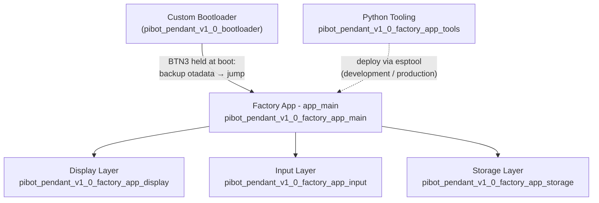
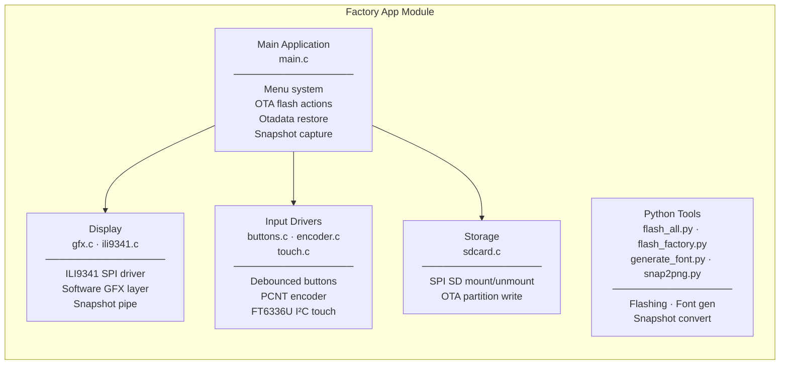
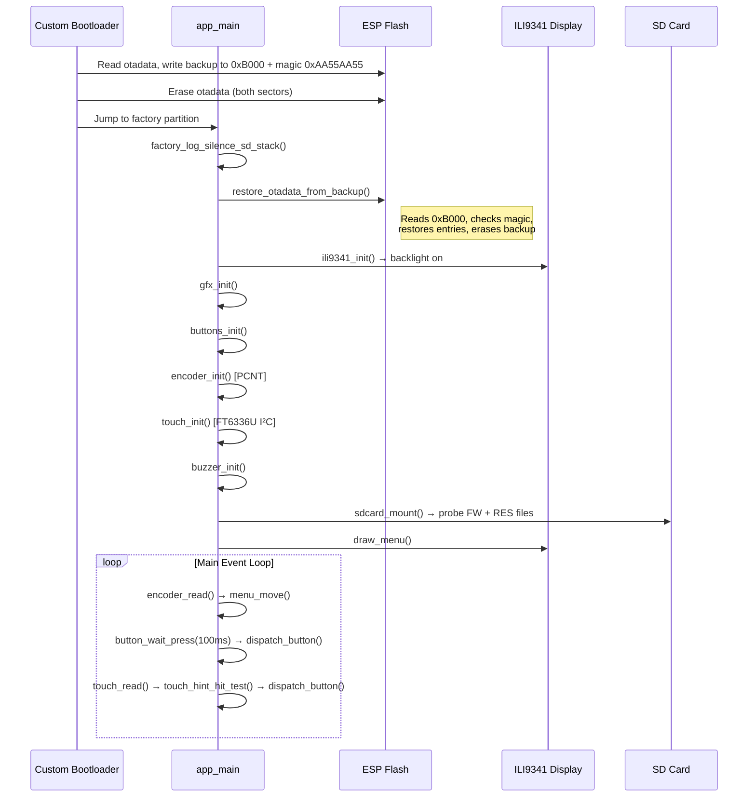
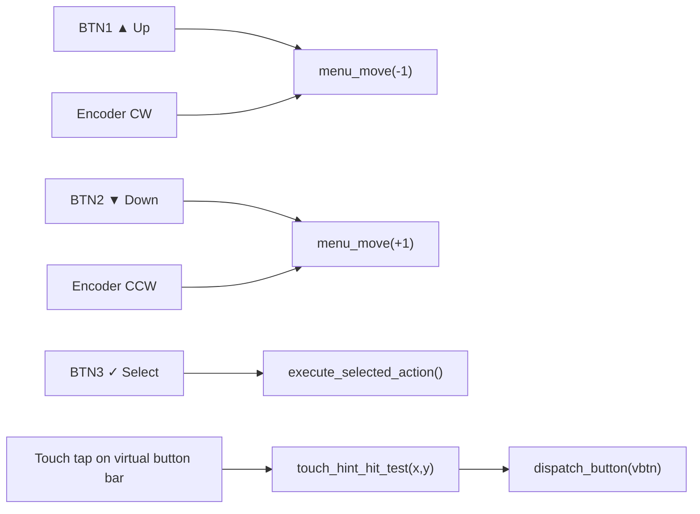
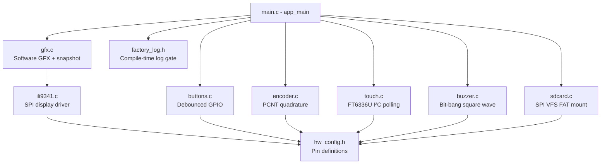

# pibot_pendant_v1_0_factory_app

## Overview

The **PiBot Pendant v1.0 Factory App** is a standalone recovery firmware that runs from a dedicated `factory` flash partition, completely independent of the main application OTA partitions. It provides a touch-and-button-navigable recovery menu allowing users to:

- **Boot** into `app0` or `app1` OTA partitions
- **Flash firmware** from an SD card (`esp3dfw.bin`) to an OTA partition via the ESP-IDF OTA API
- **Flash UI resources** from an SD card (`ui_resources.bin`) to the `ui_resources` partition
- **Restore otadata** from a bootloader-written backup so that a power-off during recovery always returns to the previously active OTA partition

This module is intentionally minimal — it uses lightweight, self-contained C drivers (no LVGL, no esp3d framework) and communicates directly with hardware to keep the recovery partition small and reliable.

> **Related modules:**
> - [`pibot_pendant_v1_0_bootloader`](pibot_pendant_v1_0_bootloader.md) — the custom bootloader that detects a recovery-entry button hold, backs up and erases `otadata`, and jumps to this factory app
> - [`pibot_pendant_v1_0_bsp`](pibot_pendant_v1_0_bsp.md) — the main firmware BSP (LVGL-based); shares the same hardware but is a separate, full-featured firmware

---

## Architecture Overview

### Partition Layout Context

```mermaid
block-beta
    columns 1
    block:FLASH["ESP32 SPI Flash (8 MB)"]:1
        BL2["Bootloader  0x0001000"]
        BK["otadata Backup (raw)  0x000B000"]
        PT["Partition Table  0x000C000"]
        OD["otadata  0x0010000"]
        NVS["nvs"]
        APP0["app0 (ota_0)  0x0020000"]
        APP1["app1 (ota_1)"]
        RES["ui_resources"]
        FS["flashfs"]
        FAC["factory  0x07A0000"]
    end
```

The `factory` partition resides at `0x7A0000` in the 8 MB layout. On every recovery entry, the custom bootloader:
1. Reads both `otadata` entries and backs them up verbatim to `0xB000` (a raw sector outside all partitions), stamped with magic word `0xAA55AA55`
2. Erases `otadata` to prevent the ROM from loading an OTA app before the factory app can restore it
3. Jumps to the `factory` partition

On startup, `app_main` **immediately restores** `otadata` from the backup before initialising any hardware, so a power cycle from the recovery menu always returns to the last-known good OTA partition.

---

## Sub-module Structure

| Sub-module | Source Files | Documentation |
|---|---|---|
| **Main Application** | `main.c`, `factory_log.h` | [pibot_pendant_v1_0_factory_app_main.md](pibot_pendant_v1_0_factory_app_main.md) |
| **Display** | `gfx.c`, `ili9341.c` | [pibot_pendant_v1_0_factory_app_display.md](pibot_pendant_v1_0_factory_app_display.md) |
| **Input Drivers** | `buttons.c`, `encoder.c`, `touch.c/h` | [pibot_pendant_v1_0_factory_app_input.md](pibot_pendant_v1_0_factory_app_input.md) |
| **Storage** | `sdcard.c` | [pibot_pendant_v1_0_factory_app_storage.md](pibot_pendant_v1_0_factory_app_storage.md) |
| **Python Tools** | `flash_all.py`, `flash_factory.py`, `generate_font.py`, `snap2png.py` | [pibot_pendant_v1_0_factory_app_tools.md](pibot_pendant_v1_0_factory_app_tools.md) |

---

## Application Startup Flow

---

## Recovery Menu

The menu is built dynamically at startup based on detected flash partitions and SD card contents:

| Menu Item | Shown When | Action |
|---|---|---|
| **Boot app0** | Always | `esp_ota_set_boot_partition("app0")` → `esp_restart()` |
| **Boot app1** | `app1` partition exists | `esp_ota_set_boot_partition("app1")` → `esp_restart()` |
| **SD → app0** | Always | Flash `esp3dfw.bin` from SD to `app0` via OTA API |
| **SD → app1** | `app1` partition exists | Flash `esp3dfw.bin` from SD to `app1` via OTA API |
| **SD → resources** | Always | Flash `ui_resources.bin` from SD to `ui_resources` partition |

### Navigation Model

### SD File Lifecycle

| SD file | Purpose | On success | On failure |
|---|---|---|---|
| `esp3dfw.bin` | Firmware binary | Renamed → `esp3dfw.ok` | Renamed → `esp3dfw.bad` |
| `ui_resources.bin` | UI resource pack | Renamed → `ui_resources.ok` | Renamed → `ui_resources.bad` |

The rename approach provides a clear audit trail: after a successful flash the original file is preserved with a `.ok` extension, so re-inserting the same SD card does not accidentally trigger another flash.

---

## Key Design Decisions

### No LVGL / No esp3d Framework
The factory app uses a self-contained software GFX layer (`gfx.c`) that writes pixel rows directly to the ILI9341 over SPI polling. This keeps the factory partition small and avoids any dependency on heap-heavy LVGL task infrastructure.

### Otadata Backup/Restore Protocol
The bootloader backs up `otadata` to a raw flash sector at `0xB000` (between the bootloader end and the partition table, outside all partition entries) and marks it with magic word `0xAA55AA55`. The factory app reads this backup on startup and restores `otadata` before doing anything else. Two invariants are maintained:
- **Power-off safety:** a power cycle during recovery returns to the correct OTA partition because `otadata` is restored in the first lines of `app_main`
- **Single-restore:** after restoring, the backup sector is immediately erased so a subsequent cold boot into the factory app does not double-restore

> ⚠️ `OTADATA_BACKUP_OFFSET` (`0xB000`) must be **identical** in both `main.c` and `hooks.c`. When porting to a new board, recalculate this value for the new bootloader size and update both files together.

### Flash Safety Flag
`CONFIG_SPI_FLASH_DANGEROUS_WRITE_ALLOWED=y` must be set in the factory `sdkconfig`. The factory app erases the `0xB000` backup sector — an address below the first partition entry — which ESP-IDF rejects by default. This is intentional: the factory app is a privileged recovery tool that manages flash directly.

### Snapshot Capture (`ENABLE_SNAPSHOT`)
When compiled with `ENABLE_SNAPSHOT`, pressing GPIO0 (the physical BOOT button) captures the current screen state to a `.raw` file on the SD card. The `gfx.c` layer writes all draw calls to both the display and the open capture file simultaneously (row-by-row as drawing happens), making it possible to capture screens mid-flash-operation. The companion Python tool `snap2png.py` converts `.raw` → `.png` for review. See [pibot_pendant_v1_0_factory_app_display.md](pibot_pendant_v1_0_factory_app_display.md) for file format details.

### Firmware Flashing in 1 KB Chunks
Reading and writing flash happens in 1024-byte static chunks (`uint8_t buf[1024]`). This bounds stack usage, avoids hitting SPI DMA single-transfer limits, and enables incremental progress display.

---

## Hardware Pin Mapping Reference

All pin assignments are defined in `hw_config.h` (board-specific, referenced by every driver). Key assignments for the PiBot Pendant v1.0:

| Signal Group | Pins | Driver |
|---|---|---|
| TFT SPI (ILI9341) | `TFT_MOSI`, `TFT_CLK`, `TFT_CS`, `TFT_DC`, `TFT_LED` | `ili9341.c` |
| SD card SPI | `SD_MOSI`, `SD_MISO`, `SD_CLK`, `SD_CS` | `sdcard.c` |
| Rotary encoder | `ENCODER_A_PIN`, `ENCODER_B_PIN` | `encoder.c` (PCNT) |
| Push buttons | `BUTTON_1_PIN`, `BUTTON_2_PIN`, `BUTTON_3_PIN` | `buttons.c` (active-low, pull-up) |
| Touch I²C | `TOUCH_SDA_PIN`, `TOUCH_SCL_PIN` | `touch.c` (FT6336U, polling) |
| Buzzer | `BUZZER_PIN` | `buzzer.c` (bit-bang square wave) |
| Snapshot trigger | `GPIO_NUM_0` (BOOT button) | `main.c` (`ENABLE_SNAPSHOT` only) |

---

## Component Dependency Graph

---

## Related Documentation

- [pibot_pendant_v1_0_bootloader.md](pibot_pendant_v1_0_bootloader.md) — Custom bootloader hooks: `is_button_pressed`, `backup_and_erase_otadata`, `beep_confirm`
- [pibot_pendant_v1_0_bsp.md](pibot_pendant_v1_0_bsp.md) — Main firmware BSP: LVGL, full control event system, production driver stack
- [`docs/Factory/`](https://github.com/luc-github/Pibot-cnc-pendant-firmware/blob/main/docs/Factory/) — Factory design notes and partition layout details
