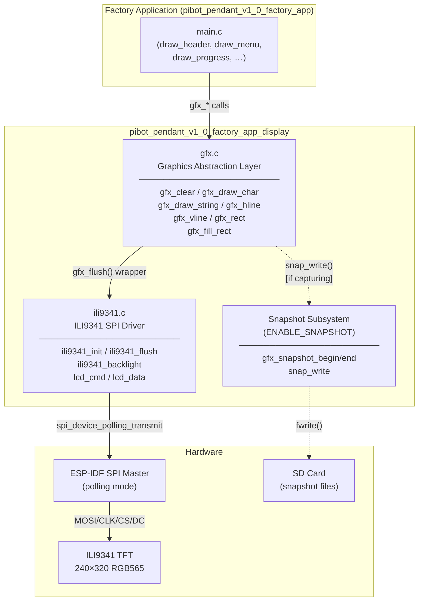
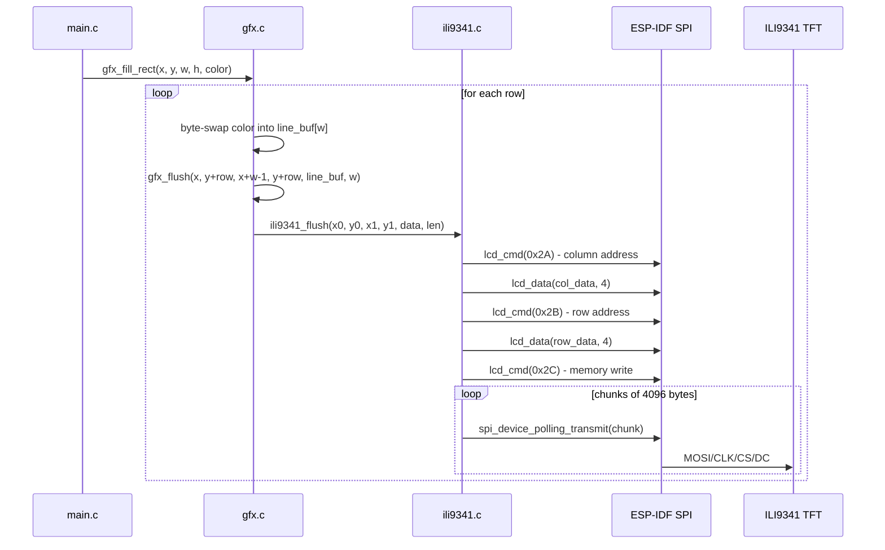
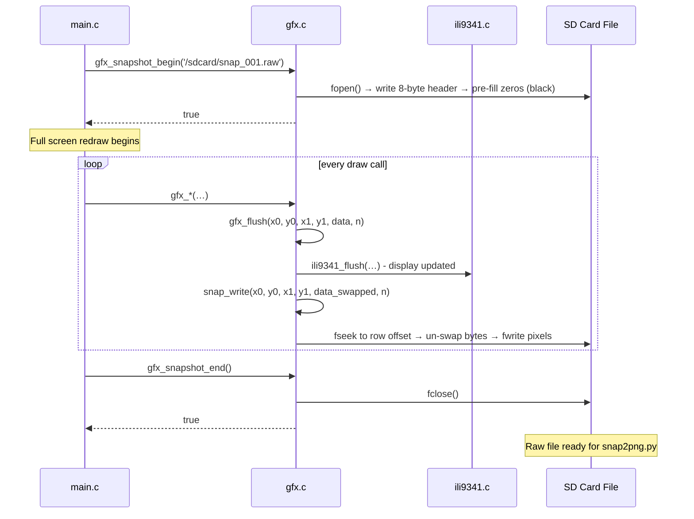
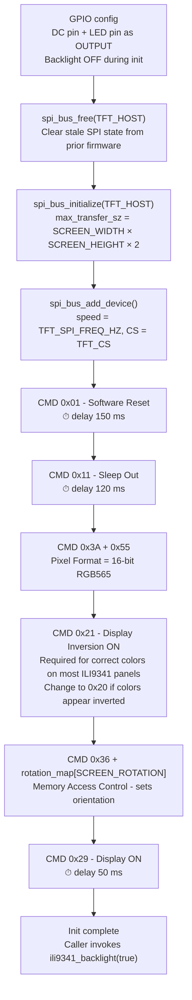
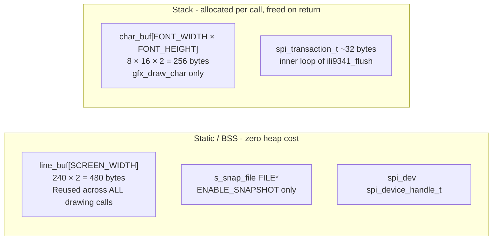
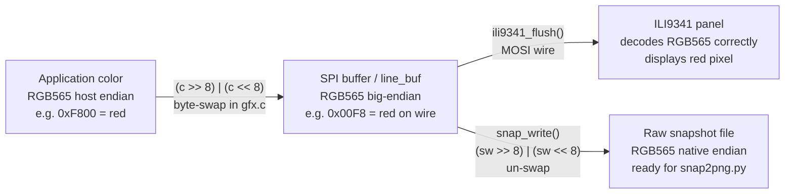

# pibot_pendant_v1_0_factory_app_display

Display subsystem for the PiBot Pendant V1.0 factory application. Provides a two-layer stack — a drawing API (`gfx.c`) sitting on top of a minimal ILI9341 SPI driver (`ili9341.c`) — that the factory application uses to render its interactive menu UI, progress indicators, and diagnostic screens. An optional snapshot subsystem (compiled in when `ENABLE_SNAPSHOT` is defined) tees every rendered frame to a raw file on the SD card so the `snap2png.py` tool can produce a PNG audit trail of factory test results.

---

## Table of Contents

1. [Architecture Overview](#architecture-overview)
2. [Component Descriptions](#component-descriptions)
   - [gfx.c — Graphics Abstraction Layer](#gfxc--graphics-abstraction-layer)
   - [ili9341.c — ILI9341 SPI Display Driver](#ili9341c--ili9341-spi-display-driver)
3. [API Reference](#api-reference)
   - [Drawing API (gfx.h)](#drawing-api-gfxh)
   - [Driver API (ili9341.h)](#driver-api-ili9341h)
4. [Data Flow](#data-flow)
   - [Normal Render Path](#normal-render-path)
   - [Snapshot Capture Path](#snapshot-capture-path)
5. [Snapshot File Format](#snapshot-file-format)
6. [ILI9341 Initialization Sequence](#ili9341-initialization-sequence)
7. [Memory Design](#memory-design)
8. [Hardware Configuration](#hardware-configuration)
9. [Color Encoding and Byte Order](#color-encoding-and-byte-order)
10. [Module Relationships](#module-relationships)

---

## Architecture Overview

The module is a self-contained display stack isolated from the main firmware's LVGL-based UI system. It operates entirely in the factory application's single task context — no LVGL, no DMA callbacks, no FreeRTOS queues. All SPI transfers use synchronous polling (`spi_device_polling_transmit`).



### Layer Responsibilities

| Layer | File | Role |
|-------|------|------|
| **Drawing API** | `gfx.c` | Pixel-level primitives; byte-swap management; snapshot tee |
| **Hardware Driver** | `ili9341.c` | SPI bus setup; ILI9341 register sequences; chunked transfer |
| **Font data** | `font8x16.h` | Embedded 8×16 bitmap font accessed via `font8x16_get_glyph()` |
| **Pin configuration** | `hw_config.h` | `TFT_*` GPIO/SPI macros; `SCREEN_WIDTH/HEIGHT/ROTATION` |

---

## Component Descriptions

### gfx.c — Graphics Abstraction Layer

`gfx.c` provides the complete drawing vocabulary used by the factory application's UI renderer. Its design priorities are:

- **Zero dynamic allocation** in the hot drawing path — a `static uint16_t line_buf[SCREEN_WIDTH]` is reused across all line, fill, and clear operations.
- **Uniform byte-swap** — every color value is byte-swapped from host-endian to SPI big-endian (the ILI9341 wire format) exactly once, before being written into `line_buf` or `char_buf`.
- **Transparent snapshot tee** — the single internal `gfx_flush()` wrapper calls both `ili9341_flush()` and (when capturing) `snap_write()`, so no drawing call site needs to be aware of snapshotting.

`gfx_init()` is intentionally empty. The ILI9341 driver must be initialized separately via `ili9341_init()` before any drawing call.

#### Snapshot Subsystem (`ENABLE_SNAPSHOT`)

When `ENABLE_SNAPSHOT` is defined at compile time, `gfx.c` gains a file-backed framebuffer tee:

- `gfx_snapshot_begin(filepath)` opens a file, writes an 8-byte header, and pre-fills the pixel region with zeros (black). The caller is then expected to perform a **full screen redraw** to populate the file.
- Every `gfx_flush()` call subsequently writes its pixel data to the open file via `snap_write()`, un-swapping bytes back from SPI big-endian to native RGB565.
- `gfx_snapshot_end()` closes the file.
- `snap_write()` uses `fseek` to position each row at the correct file offset (`SNAP_HEADER_SIZE + (row * SCREEN_WIDTH + x0) * 2`), allowing partial-region updates to land in the correct row without requiring a full scratch buffer.

The raw snapshot file is consumed offline by the [`pibot_pendant_v1_0_factory_app_tools`](pibot_pendant_v1_0_factory_app_tools.md) `snap2png.py` script, which reads the header dimensions and converts the RGB565 pixel stream to a standard PNG.

---

### ili9341.c — ILI9341 SPI Display Driver

`ili9341.c` is a minimal, factory-only SPI driver for the ILI9341 TFT controller. It does not use the shared hardware driver from [`display_spi_drivers`](display_drivers_spi.md); instead it provides a lean, self-contained implementation suited to the factory environment (no LVGL, no ESP LCD panel API abstraction).

**Key design choices:**

- Uses `spi_device_polling_transmit` — synchronous, no DMA callback dependencies, predictable latency in a non-RTOS-sensitive single-task context.
- Issues `spi_bus_free()` before `spi_bus_initialize()` to handle the case where the SPI2 peripheral retains state after the previous firmware's software reset.
- Pixel data is sent in **4096-byte chunks** to stay within SPI DMA transfer size limits.
- Backlight is kept off (`gpio_set_level(TFT_LED, 0)`) during `ili9341_init()` to prevent the user from seeing partial initialization frames; the caller enables it afterwards with `ili9341_backlight(true)`.
- Display inversion (`0x21`) is enabled by default because most ILI9341 panels require it for correct color rendering. A comment in the source guides hardware porters who encounter inverted colors.
- The DC (Data/Command) GPIO is driven directly by `lcd_cmd()` (DC=0) and `lcd_data()` (DC=1) before each SPI transaction.

---

## API Reference

### Drawing API (gfx.h)

All coordinates are in pixels relative to the top-left corner `(0, 0)`. All functions silently clip to screen bounds — no call results in an out-of-bounds SPI transfer.

| Function | Signature | Description |
|----------|-----------|-------------|
| `gfx_init` | `void gfx_init(void)` | Placeholder; currently a no-op. Call `ili9341_init()` separately before drawing. |
| `gfx_clear` | `void gfx_clear(uint16_t color)` | Fill the entire screen with a solid RGB565 color. Renders row by row using `line_buf`. |
| `gfx_draw_char` | `void gfx_draw_char(int x, int y, char c, uint16_t fg, uint16_t bg)` | Render a single 8×16 character at `(x, y)` with foreground and background colors. Non-printable characters are substituted with `?`. |
| `gfx_draw_string` | `void gfx_draw_string(int x, int y, const char *str, uint16_t fg, uint16_t bg)` | Render a null-terminated string left-to-right. Stops when the next character would exceed `SCREEN_WIDTH`. |
| `gfx_hline` | `void gfx_hline(int x, int y, int w, uint16_t color)` | Draw a horizontal line of width `w` starting at `(x, y)`. |
| `gfx_vline` | `void gfx_vline(int x, int y, int h, uint16_t color)` | Draw a vertical line of height `h` starting at `(x, y)`. Sends one pixel per flush call. |
| `gfx_rect` | `void gfx_rect(int x, int y, int w, int h, uint16_t color)` | Draw a hollow rectangle outline using four line calls. |
| `gfx_fill_rect` | `void gfx_fill_rect(int x, int y, int w, int h, uint16_t color)` | Draw a solid filled rectangle, row by row using `line_buf`. |
| `gfx_snapshot_begin` | `bool gfx_snapshot_begin(const char *filepath)` | *(Requires `ENABLE_SNAPSHOT`)* Open a raw capture file. Returns `false` if already capturing or the file cannot be created. |
| `gfx_snapshot_end` | `bool gfx_snapshot_end(void)` | *(Requires `ENABLE_SNAPSHOT`)* Close the capture file. Returns `false` if not currently capturing. |
| `gfx_snapshot_is_capturing` | `bool gfx_snapshot_is_capturing(void)` | *(Requires `ENABLE_SNAPSHOT`)* Returns `true` if a snapshot file is currently open. |

### Driver API (ili9341.h)

| Function | Signature | Description |
|----------|-----------|-------------|
| `ili9341_init` | `esp_err_t ili9341_init(void)` | Configure GPIO pins, initialize SPI bus and device, run ILI9341 startup sequence. Returns `ESP_OK` on success. |
| `ili9341_backlight` | `void ili9341_backlight(bool on)` | Enable (`true`) or disable (`false`) the TFT backlight GPIO. |
| `ili9341_flush` | `void ili9341_flush(uint16_t x0, uint16_t y0, uint16_t x1, uint16_t y1, const uint16_t *data, size_t len)` | Set column/row address window and transmit `len` RGB565 pixels in 4096-byte chunks. Data must already be in SPI big-endian byte order. |

The static functions `lcd_cmd()`, `lcd_data()`, and `lcd_data_byte()` are internal to `ili9341.c` and are not part of the public interface.

---

## Data Flow

### Normal Render Path



### Snapshot Capture Path



---

## Snapshot File Format

The raw snapshot file produced by `gfx_snapshot_begin` / `gfx_snapshot_end` has the following binary layout:

```
Offset   Size     Type          Description
──────   ────     ────          ───────────
0        4        uint32 LE     Screen width  (e.g. 240)
4        4        uint32 LE     Screen height (e.g. 320)
8        w×h×2   uint16[]      RGB565 pixels, native endian, row-major
                               Row 0 (top) → Row h-1 (bottom)
                               Each row: pixel[0] (left) → pixel[w-1] (right)
```

**Total file size** (240×320 display): `8 + 240 × 320 × 2 = 153,608 bytes`

The `snap_write()` function reverses the SPI big-endian byte swap applied by `gfx.c` drawing functions before writing to the file, so stored values are native-endian RGB565 as consumed by standard image tools.

The [`pibot_pendant_v1_0_factory_app_tools`](pibot_pendant_v1_0_factory_app_tools.md) `snap2png.py` script reads this format and produces a standard PNG file.

---

## ILI9341 Initialization Sequence

`ili9341_init()` configures GPIO and SPI before running the ILI9341 startup register sequence:



**Rotation map (MADCTL byte via `SCREEN_ROTATION`):**

| `SCREEN_ROTATION` | MADCTL | Orientation |
|:-----------------:|--------|-------------|
| 0 | `0x28` | Landscape |
| 1 | `0x48` | Portrait |
| 2 | `0xE8` | Landscape inverted |
| 3 | `0x88` | Portrait inverted |

---

## Memory Design

This module is designed to operate within the constrained DRAM budget of the factory application (no WiFi stack, no Bluetooth, but still a resource-limited ESP32).



**Key constraints respected:**

- No `malloc()` / `new` in any drawing path.
- `char_buf` (256 bytes) is the largest per-call stack allocation; it is within the 512-byte safe limit defined in the project memory guidelines.
- `line_buf` is a module-level static — the same buffer is reused for every row of every fill or clear operation, eliminating both allocation overhead and fragmentation risk.
- `snap_write()` uses `fseek`/`fwrite` in a tight per-pixel loop with no intermediate heap buffer; the SD card's internal buffering handles I/O efficiency.

---

## Hardware Configuration

All pin assignments and display geometry are resolved at compile time from `hw_config.h`. The factory application does not support runtime reconfiguration.

| Macro | Purpose |
|-------|---------|
| `TFT_HOST` | ESP32 SPI host (`SPI2_HOST` / `SPI3_HOST`) |
| `TFT_MOSI` | GPIO: SPI Master-Out (data to display) |
| `TFT_MISO` | GPIO: SPI Master-In (typically `-1`; display is write-only) |
| `TFT_CLK` | GPIO: SPI Clock |
| `TFT_CS` | GPIO: Chip Select (active low) |
| `TFT_DC` | GPIO: Data/Command select (low = command, high = data) |
| `TFT_LED` | GPIO: Backlight enable |
| `TFT_SPI_FREQ_HZ` | SPI clock frequency in Hz |
| `SCREEN_WIDTH` | Display width in pixels (e.g. 240) |
| `SCREEN_HEIGHT` | Display height in pixels (e.g. 320) |
| `SCREEN_ROTATION` | Rotation index 0–3 (see rotation map above) |
| `FONT_WIDTH` | Character cell width in pixels (8) |
| `FONT_HEIGHT` | Character cell height in pixels (16) |
| `FONT_BYTES_PER_ROW` | Bytes per glyph row in the `font8x16` bitmap |

For the complete hardware schematic and pin mapping, see the [PiBot CNC Pendant Hardware Documentation](https://github.com/luc-github/Pibot-cnc-pendant-firmware/blob/main/docs/hardware/pibot-cnc-pendant-hardware-documentation.md).

---

## Color Encoding and Byte Order

Understanding the byte-swap pipeline is important when reading or modifying rendering code:



- **Every color is byte-swapped exactly once** inside `gfx.c` before entering `line_buf` or `char_buf`.
- `ili9341_flush()` receives already-swapped data and transmits it verbatim over SPI.
- `snap_write()` receives the swapped data from `gfx_flush()` and **un-swaps** it before writing to the file, restoring native-endian RGB565 suitable for offline processing tools.

---

## Module Relationships

```mermaid
graph TB
    subgraph Parent["pibot_pendant_v1_0_factory_app"]
        DISP["pibot_pendant_v1_0_factory_app_display\n(this module)"]
        MAIN_MOD["pibot_pendant_v1_0_factory_app_main"]
        INPUT["pibot_pendant_v1_0_factory_app_input"]
        STORAGE["pibot_pendant_v1_0_factory_app_storage"]
        TOOLS["pibot_pendant_v1_0_factory_app_tools"]
    end

    MAIN_MOD -->|"gfx_* drawing calls"| DISP
    DISP -.->|"snapshot .raw files\n(ENABLE_SNAPSHOT)"| STORAGE
    TOOLS -.->|"snap2png.py reads\nraw snapshot files"| STORAGE
    INPUT -->|"button/touch events\ntrigger UI redraws"| MAIN_MOD

    subgraph Bootloader["pibot_pendant_v1_0_bootloader"]
        BL["custom_bootloader/hooks.c\nLaunches factory app"]
    end
    BL --> MAIN_MOD

    subgraph HWDrivers["Hardware_Peripheral_Drivers"]
        SHARED_ILI["display_spi_drivers\nShared ILI9341 driver\nfor main firmware"]
    end

    DISP -.->|"parallel implementation\nfactory-only, no LVGL"| SHARED_ILI
```



**Relationship summary:**

| Related Module | Relationship |
|---------------|-------------|
| [`pibot_pendant_v1_0_factory_app_main`](pibot_pendant_v1_0_factory_app_main.md) | Primary consumer — all `draw_*` functions in `main.c` call this module's `gfx_*` API |
| [`pibot_pendant_v1_0_factory_app_input`](pibot_pendant_v1_0_factory_app_input.md) | Sibling — button/touch/encoder events trigger display redraws via `main.c` |
| [`pibot_pendant_v1_0_factory_app_storage`](pibot_pendant_v1_0_factory_app_storage.md) | Snapshot output destination — SD card must be mounted via `sdcard_mount()` before calling `gfx_snapshot_begin()` |
| [`pibot_pendant_v1_0_factory_app_tools`](pibot_pendant_v1_0_factory_app_tools.md) | Offline consumer — `snap2png.py` converts the raw `.raw` files produced by this module to PNG images |
| [`pibot_pendant_v1_0_bootloader`](pibot_pendant_v1_0_bootloader.md) | Launches the factory app that initializes this display subsystem |
| [`display_spi_drivers`](display_drivers_spi.md) | Parallel implementation — the main firmware uses the shared ESP LCD panel-API ILI9341 driver; the factory app uses its own lean version without LVGL dependency |
| [`pibot_pendant_v1_0_bsp`](pibot_pendant_v1_0_bsp.md) | BSP layer that drives the same physical display with LVGL in the main firmware — different code path, same hardware |

> **Important:** This module is part of the **factory firmware only**. It is **not linked** into the main pendant firmware. The main firmware display stack uses LVGL with the [`display_spi_drivers`](display_drivers_spi.md) panel driver via the [`pibot_pendant_v1_0_bsp`](pibot_pendant_v1_0_bsp.md) board support package. Refer to [`docs/architecture/display_drivers.md`](https://github.com/luc-github/Pibot-cnc-pendant-firmware/blob/main/docs/architecture/display_drivers.md) for the full display driver architecture comparison between factory and main firmware.
