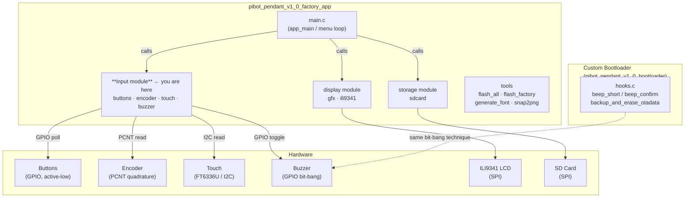
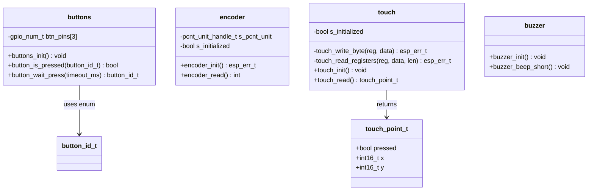
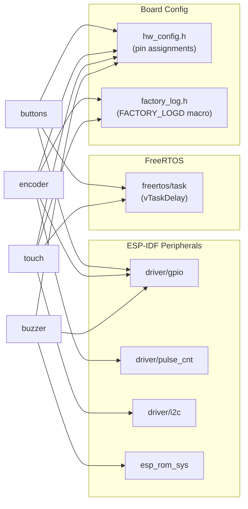
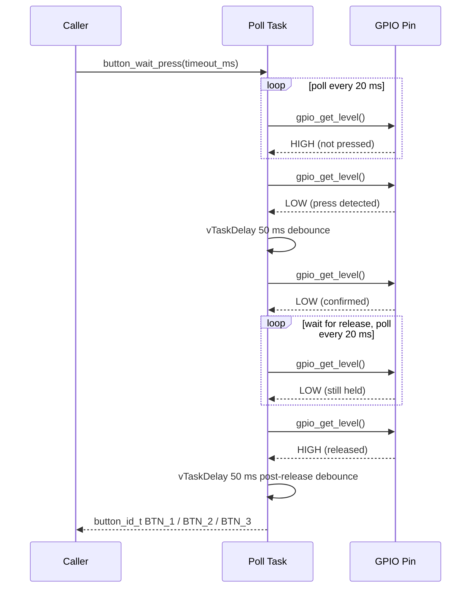
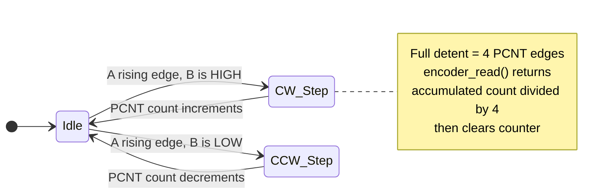
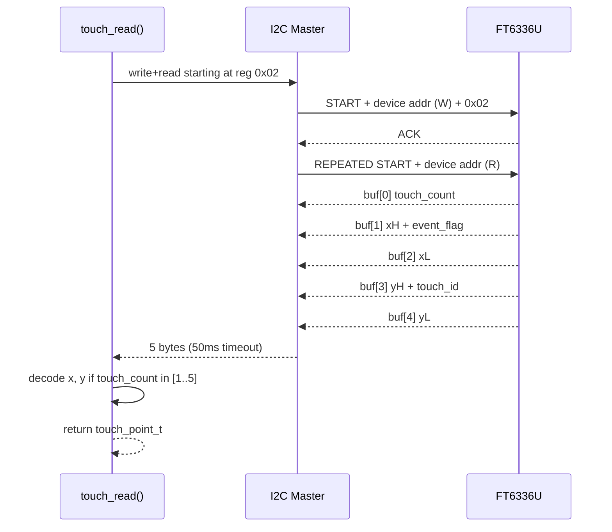
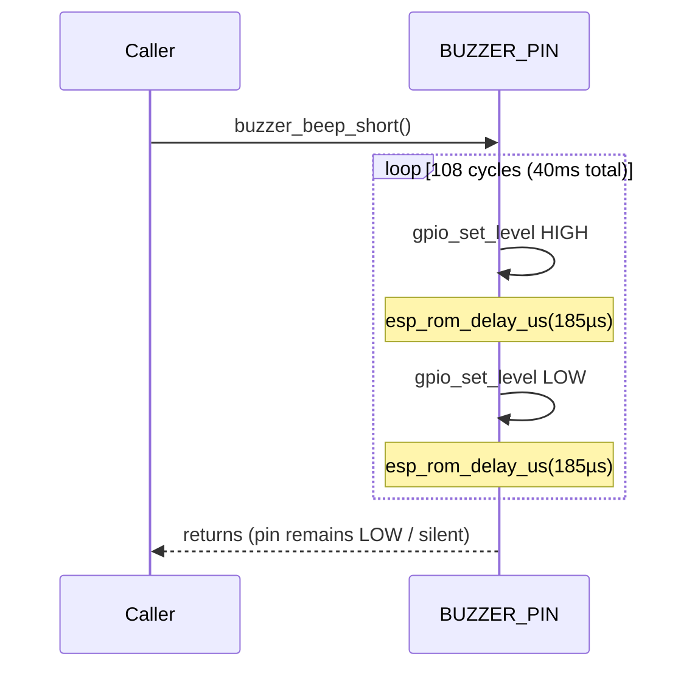
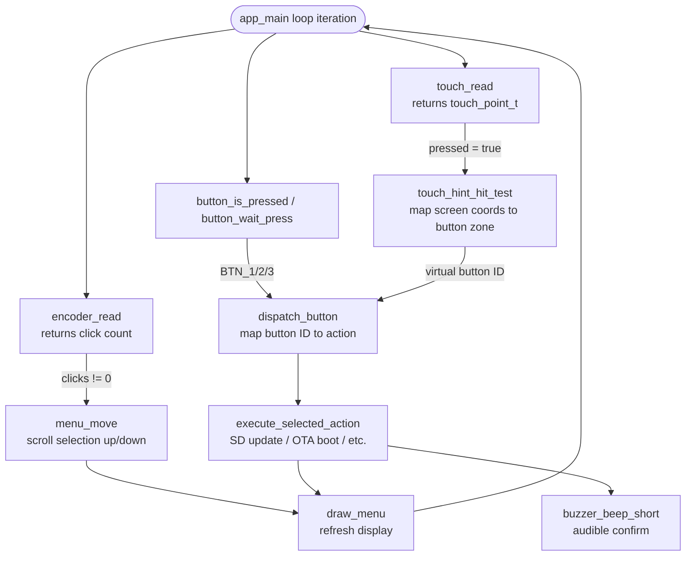

# pibot\_pendant\_v1\_0\_factory\_app\_input

Input subsystem for the PiBot Pendant v1.0 factory/recovery application. Provides
polling-based drivers for all physical input peripherals—three push buttons, a
quadrature rotary encoder, a capacitive touchscreen, and a buzzer for tactile
feedback—built directly on ESP-IDF primitives without any RTOS queues, ISRs, or
the abstractions used by the production BSP.

---

## Table of Contents

1. [Purpose & Scope](#1-purpose--scope)
2. [Context in the Factory App](#2-context-in-the-factory-app)
3. [Module Architecture](#3-module-architecture)
4. [Component Reference](#4-component-reference)
   - 4.1 [Buttons](#41-buttons)
   - 4.2 [Rotary Encoder](#42-rotary-encoder)
   - 4.3 [Touch Controller](#43-touch-controller)
   - 4.4 [Buzzer](#44-buzzer)
5. [Data Types](#5-data-types)
6. [Input Event Flow](#6-input-event-flow)
7. [Hardware Mapping](#7-hardware-mapping)
8. [Design Decisions](#8-design-decisions)
9. [Related Modules](#9-related-modules)

---

## 1. Purpose & Scope

The factory/recovery application runs independently of the main pendant firmware.
Its purpose is hardware validation, OTA partition management, and SD-card-based
firmware updates. Because it must work even when the main firmware is absent or
corrupt, it cannot depend on the main firmware's high-level BSP or driver stack.

This input module provides the absolute minimum needed to drive the pendant's
physical controls during a factory session:

| Peripheral | File | Purpose |
|---|---|---|
| Push buttons (×3) | `buttons.c` | Menu navigation, action confirmation |
| Rotary encoder | `encoder.c` | List scrolling, value adjustment |
| FT6336U touch panel | `touch.c / touch.h` | Touch-based menu interaction |
| Passive buzzer | `buzzer.c` | Audible feedback on user actions |

All four drivers are **polling-only**. No interrupt service routines, no FreeRTOS
event groups, and no ring buffers are used. The main application loop in
[`pibot_pendant_v1_0_factory_app_main`](pibot_pendant_v1_0_factory_app_main.md)
calls each driver directly.

---

## 2. Context in the Factory App



The factory app itself sits in `boards/pibot_pendant_v1_0/Factory/` and is built
as a completely separate ESP-IDF project from the main pendant firmware. It shares
**hardware pin definitions** (`hw_config.h`) with the bootloader hooks but has no
compile-time dependency on the main firmware source tree.

---

## 3. Module Architecture

### 3.1 Static Structure



### 3.2 Peripheral Dependency Map



---

## 4. Component Reference

### 4.1 Buttons

**File:** `boards/pibot_pendant_v1_0/Factory/main/buttons.c`

#### Overview

Manages three tactile push buttons (BTN_1, BTN_2, BTN_3). Buttons are wired
**active-low**: the GPIO reads `0` when pressed and `1` when released. Internal
pull-ups are enabled; no external resistors are required.

#### Initialization

```c
void buttons_init(void);
```

Configures `BUTTON_1_PIN`, `BUTTON_2_PIN`, and `BUTTON_3_PIN` (from `hw_config.h`)
as inputs with pull-ups enabled, no interrupts.

**GPIO config applied:**

| Field | Value |
|---|---|
| mode | `GPIO_MODE_INPUT` |
| pull_up_en | `GPIO_PULLUP_ENABLE` |
| pull_down_en | `GPIO_PULLDOWN_DISABLE` |
| intr_type | `GPIO_INTR_DISABLE` |

#### API

```c
bool button_is_pressed(button_id_t btn);
```

Returns `true` if the GPIO for `btn` reads `0` (active-low). Returns `false`
immediately if `btn` is out of the valid range (`BTN_1`–`BTN_3`).

---

```c
button_id_t button_wait_press(uint32_t timeout_ms);
```

Blocking call. Polls all three buttons at 20 ms intervals, applying a 50 ms
debounce on detection. Waits for the button to be **released** before returning,
then adds a second 50 ms debounce after release.

| `timeout_ms` | Behaviour |
|---|---|
| `0` | Waits indefinitely |
| `> 0` | Returns `BTN_NONE` after that many milliseconds if no press occurs |

#### Button Timing Diagram



---

### 4.2 Rotary Encoder

**File:** `boards/pibot_pendant_v1_0/Factory/main/encoder.c`

#### Overview

Implements quadrature decoding of the pendant's rotary encoder using the ESP32
**PCNT** (Pulse Counter) peripheral. This is fully polled: the hardware accumulates
counts autonomously and the application reads accumulated clicks on demand.

#### Configuration Constants

| Constant | Value | Notes |
|---|---|---|
| `PULSES_PER_DETENT` | `4` | Adjust if rotation feels too sensitive or sluggish |
| High limit | `1000` | PCNT saturation limit |
| Low limit | `-1000` | PCNT saturation limit |
| Glitch filter | `1000 ns` | Matches main firmware setting in production BSP |

#### Initialization

```c
esp_err_t encoder_init(void);
```

Sets up a PCNT unit with two channels for full quadrature decoding:

- **Channel A** — detects edges on `ENCODER_A_PIN`, uses `ENCODER_B_PIN` as level
- **Channel B** — detects edges on `ENCODER_B_PIN`, uses `ENCODER_A_PIN` as level

Both channels are configured for standard quadrature actions (increase on one edge
direction, decrease on the other, inverted by the opposite pin level). Internal
GPIO pull-ups are enabled; no external pull-ups are present on the board.

Returns `ESP_OK` on success; calls `ESP_ERROR_CHECK` internally on any PCNT API
failure.

#### Reading Clicks

```c
int encoder_read(void);
```

Reads the PCNT count, divides by `PULSES_PER_DETENT` to produce integer **detent
clicks**, clears the counter, and returns the click count. Returns `0` if not
initialized or no movement since last call.

> **Note:** Remainder pulses (below one full detent) are discarded on each read.
> This prevents drift accumulation at typical 100 ms polling rates. The trade-off
> is negligible given the physical detent resolution of the encoder.

#### Quadrature Decoding Diagram



---

### 4.3 Touch Controller

**Files:** `boards/pibot_pendant_v1_0/Factory/main/touch.c`,  
`boards/pibot_pendant_v1_0/Factory/main/touch.h`

#### Overview

Provides a minimal polling interface to the **FT6336U** capacitive touch controller
over I2C. Interrupt mode is deliberately disabled to keep the factory app
self-contained and interrupt-free. Coordinates are returned in screen pixel space
with no swap or invert transformations needed for this board.

#### Initialization

```c
void touch_init(void);
```

Configures the I2C master bus on `TOUCH_I2C_PORT_IDX` using `TOUCH_SDA_PIN` and
`TOUCH_SCL_PIN` at `TOUCH_I2C_FREQ_HZ` (all from `hw_config.h`). Internal pull-ups
are enabled on both SDA and SCL lines.

After bus installation, four FT6336U registers are configured:

| Register | Address | Value Written | Effect |
|---|---|---|---|
| `FT6336U_DEVICE_MODE` | `0x00` | `0x00` | Normal operating mode |
| `FT6336U_THRESHHOLD` | `0x80` | `40` | Touch detection threshold |
| `FT6336U_TOUCHRATE_ACTIVE` | `0x88` | `0x0E` | Active report rate |
| `FT6336U_INTERRUPT_MODE` | `0xA4` | `0` | **Polling mode** (interrupts disabled) |

#### Reading Touch State

```c
touch_point_t touch_read(void);
```

Reads 5 bytes starting at register `0x02` (touch count + first touch point
coordinates). Returns a `touch_point_t` with `pressed = false` and `x = y = -1`
when:

- The driver is not initialized
- The I2C transaction fails (50 ms timeout)
- No touch is detected (`touch_points == 0`)
- The touch count is ≥ 6 (indicates a read error or garbage)

On a valid touch, coordinates are extracted as:

```
x = ((buf[1] & 0x0F) << 8) | buf[2]   // high nibble of byte 1 + full byte 2
y = ((buf[3] & 0x0F) << 8) | buf[4]   // high nibble of byte 3 + full byte 4
```

#### I2C Communication Sequence



---

### 4.4 Buzzer

**File:** `boards/pibot_pendant_v1_0/Factory/main/buzzer.c`

#### Overview

Drives a passive piezo buzzer using **GPIO bit-banging**. No PWM (LEDC) peripheral
is used, keeping the implementation minimal and compatible with any free GPIO. The
same technique is used in the custom bootloader's hooks
([`pibot_pendant_v1_0_bootloader`](pibot_pendant_v1_0_bootloader.md): `beep_short`
/ `beep_confirm`).

#### Configuration

| Constant | Value | Notes |
|---|---|---|
| `BEEP_FREQ_HZ` | `2700 Hz` | Audible mid-range frequency for small piezos |
| `BEEP_DURATION_MS` | `40 ms` | Short enough to be non-intrusive |
| Half-period | `~185 µs` | `1 000 000 / (2 × 2700)` |
| Total cycles | `108` | `2700 Hz × 0.040 s` |

#### Initialization

```c
void buzzer_init(void);
```

Configures `BUZZER_PIN` (from `hw_config.h`) as a push-pull GPIO output and drives
it low (silent state).

#### Beep

```c
void buzzer_beep_short(void);
```

Generates a 40 ms square wave at 2700 Hz by toggling the GPIO pin and calling
`esp_rom_delay_us()` between each toggle. This is a **blocking, busy-wait** call.

It is acceptable in the factory app because:
1. The app is single-threaded — no concurrent LVGL or critical FreeRTOS tasks run
   during feedback.
2. 40 ms latency on button/encoder feedback is imperceptible to the operator.

#### Buzzer Signal Diagram



---

## 5. Data Types

### `touch_point_t`

Defined in `touch.h`:

```c
typedef struct {
    bool    pressed;   // true if a touch is currently detected
    int16_t x;         // x-coordinate in screen pixels (-1 if not pressed)
    int16_t y;         // y-coordinate in screen pixels (-1 if not pressed)
} touch_point_t;
```

### `button_id_t` (enum, defined in `buttons.h`)

| Value | Meaning |
|---|---|
| `BTN_NONE` | No button pressed / timeout expired |
| `BTN_1` | First physical button |
| `BTN_2` | Second physical button |
| `BTN_3` | Third physical button |

---

## 6. Input Event Flow

The main loop in `main.c` (`app_main`) polls the input module at each iteration.
The diagram below shows how all four subsystems feed into the factory application's
menu and action dispatch:



---

## 7. Hardware Mapping

All pin assignments are centralised in `hw_config.h`. The table below lists the
logical names this module references:

| Driver | `hw_config.h` Symbol | Peripheral |
|---|---|---|
| `buttons.c` | `BUTTON_1_PIN` | GPIO input, internal pull-up |
| `buttons.c` | `BUTTON_2_PIN` | GPIO input, internal pull-up |
| `buttons.c` | `BUTTON_3_PIN` | GPIO input, internal pull-up |
| `encoder.c` | `ENCODER_A_PIN` | PCNT edge input + GPIO pull-up |
| `encoder.c` | `ENCODER_B_PIN` | PCNT level input + GPIO pull-up |
| `touch.c` | `TOUCH_SDA_PIN` | I2C SDA, internal pull-up |
| `touch.c` | `TOUCH_SCL_PIN` | I2C SCL, internal pull-up |
| `touch.c` | `TOUCH_I2C_PORT_IDX` | I2C bus number (0 or 1) |
| `touch.c` | `TOUCH_I2C_ADDR_HEX` | FT6336U 7-bit I2C address |
| `touch.c` | `TOUCH_I2C_FREQ_HZ` | I2C clock speed |
| `buzzer.c` | `BUZZER_PIN` | GPIO push-pull output |

> For authoritative pin values and the board schematic see
> [`docs/hardware/pibot-cnc-pendant-hardware-documentation.md`](https://github.com/luc-github/Pibot-cnc-pendant-firmware/blob/main/docs/hardware/pibot-cnc-pendant-hardware-documentation.md).

---

## 8. Design Decisions

### Polling vs. Interrupts

All input is polled deliberately. The factory app runs a simple cooperative loop;
there is no need for the interrupt-driven, event-queue architecture used by the
production BSP ([`pibot_pendant_v1_0_bsp`](pibot_pendant_v1_0_bsp.md)). Polling
eliminates ISR complexity and reduces the risk of stack or priority issues that
could destabilise the recovery environment.

### No LVGL, No High-Level Drivers

The production BSP wires buttons, encoder, and touch into LVGL's `indev` system
through `button_read_cb`, `encoder_read_cb`, `potentiometer_read_cb`,
`switch_read_cb`, and `touch_read_cb` callbacks. The factory app bypasses all of
this and drives the raw peripherals directly, removing the LVGL dependency entirely.

### PCNT for Encoder — Not Pure Software

Although polling is the theme, the **PCNT peripheral** is still used for the
encoder because software-based quadrature counting at 20–100 ms polling intervals
would miss fast rotation. PCNT counts continuously in hardware and the count is
simply read when the application needs it — the best of both worlds for a polling
architecture. The glitch filter (1 µs) is intentionally kept identical to the
production BSP setting.

### Bit-Banged Buzzer

Using `esp_rom_delay_us` busy-loops rather than LEDC/PWM avoids consuming a PWM
timer channel and keeps the buzzer fully independent of any timer resource
availability at factory time. The 40 ms blocking duration is acceptable because no
concurrent UI tasks exist.  
See also the identical approach in
[`pibot_pendant_v1_0_bootloader`](pibot_pendant_v1_0_bootloader.md) (`beep_short`
/ `beep_confirm` / `buzzer_tone` in `hooks.c`).

### Touch Coordinate Pass-Through

The FT6336U on this board is physically oriented so that raw I2C coordinates map
directly to screen pixel coordinates with no swap or invert. This is explicitly
noted in `touch.c` to prevent future maintainers from adding unnecessary
transformations. The production `touch_ft6336u_def.h` for this board uses the same
defaults for the same reason.

### Minimal Debounce

The 50 ms double-sample debounce in `button_wait_press` (press confirmation +
post-release settling) was validated against the pendant's mechanical buttons.
The encoder does not need software debounce because the PCNT 1 µs glitch filter
handles electrical noise at the hardware level.

---

## 9. Related Modules

| Module | Relationship |
|---|---|
| [`pibot_pendant_v1_0_factory_app_main`](pibot_pendant_v1_0_factory_app_main.md) | **Consumer** — calls all four drivers from the `app_main` event loop; dispatches events via `dispatch_button`, `touch_hint_hit_test`, and `encoder_read` |
| [`pibot_pendant_v1_0_factory_app_display`](pibot_pendant_v1_0_factory_app_display.md) | **Sibling** — display is updated (`draw_menu`, `show_status`) after input events are processed |
| [`pibot_pendant_v1_0_factory_app_storage`](pibot_pendant_v1_0_factory_app_storage.md) | **Sibling** — SD card mount/unmount actions are triggered by button and touch events |
| [`pibot_pendant_v1_0_bootloader`](pibot_pendant_v1_0_bootloader.md) | **Parallel implementation** — bootloader `hooks.c` uses the same bit-bang buzzer technique and reads the same button GPIO to decide whether to erase OTA data at boot time |
| [`pibot_pendant_v1_0_bsp`](pibot_pendant_v1_0_bsp.md) | **Production counterpart** — wires the same hardware peripherals into LVGL `indev` via `button_read_cb`, `encoder_read_cb`, `touch_read_cb`, `potentiometer_read_cb`, and `switch_read_cb` |
| [`physical_inputs`](physical_inputs.md) | **Underlying hardware abstraction** — `phy_encoder`, `phy_buttons`, `phy_switch`, and `phy_potentiometer` configs used by the production BSP (not used by the factory app) |
| [`buzzer`](buzzer.md) | **Production buzzer stack** — `hardware/common/drivers/buzzer/` + `esp3d_buzzer.h` used by the main firmware; the factory app uses its own simpler, self-contained implementation |
