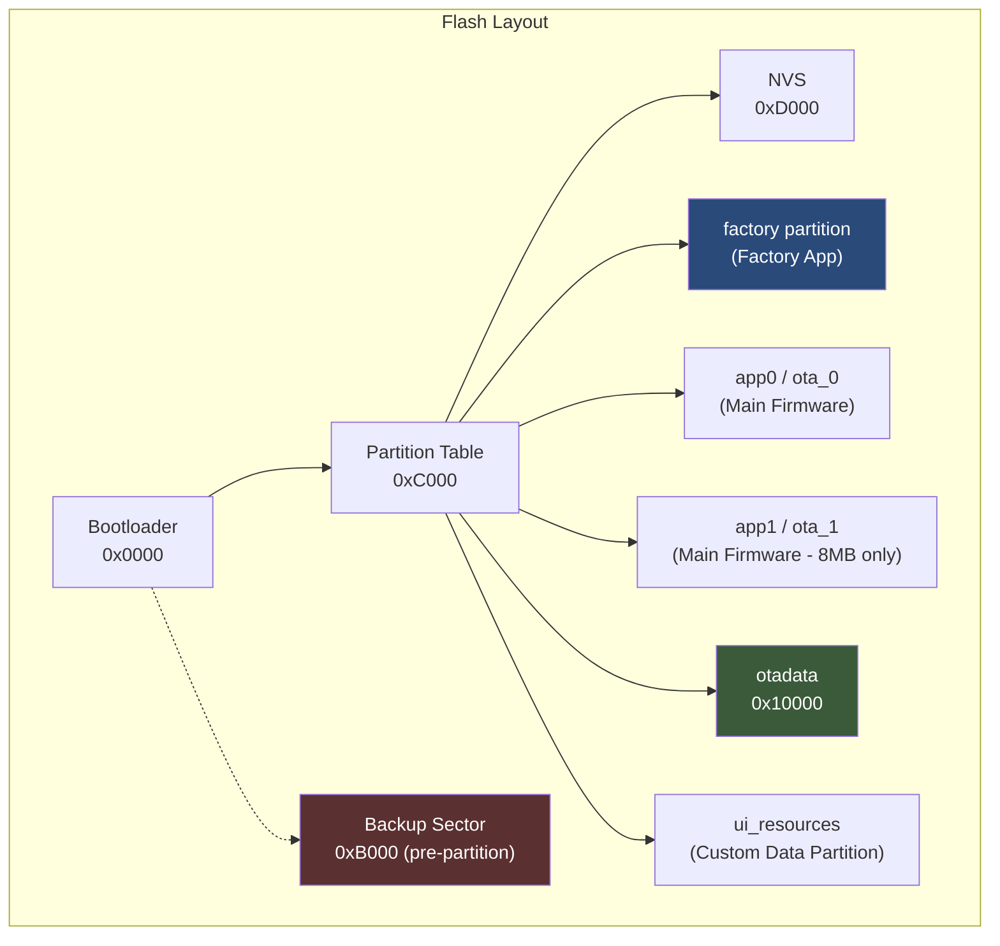
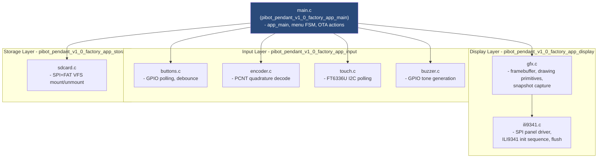
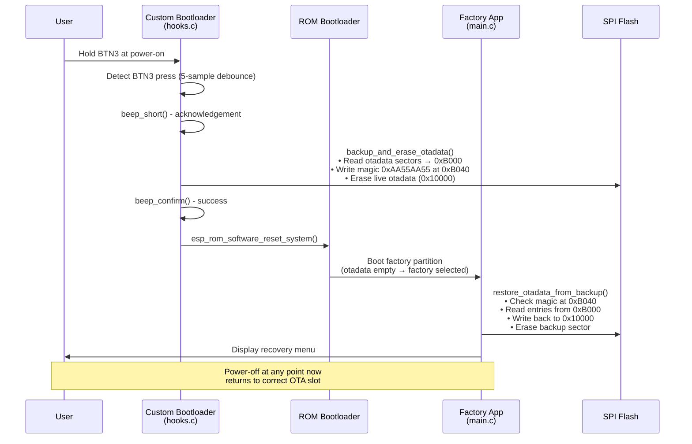
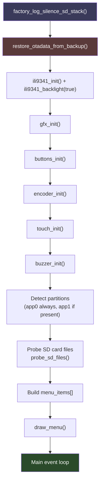
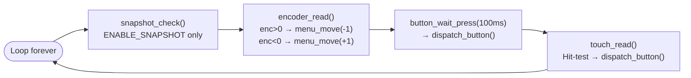
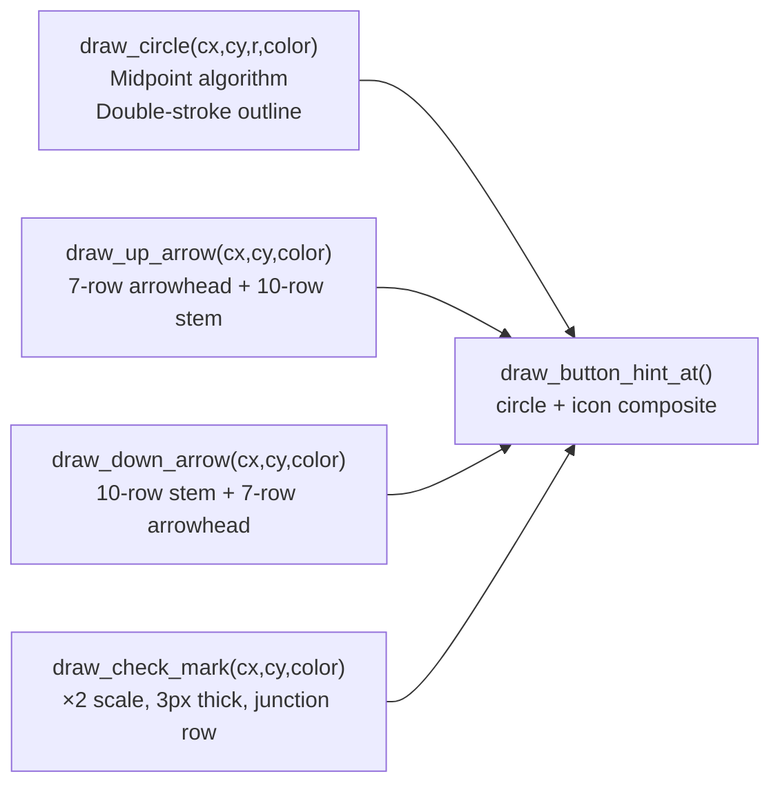
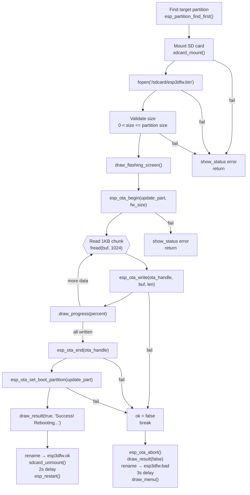
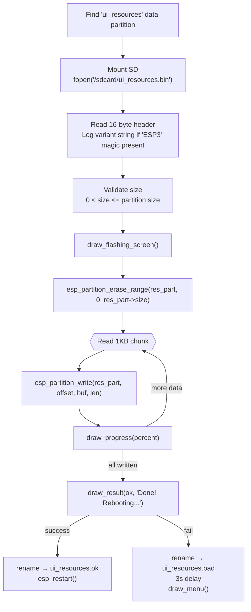
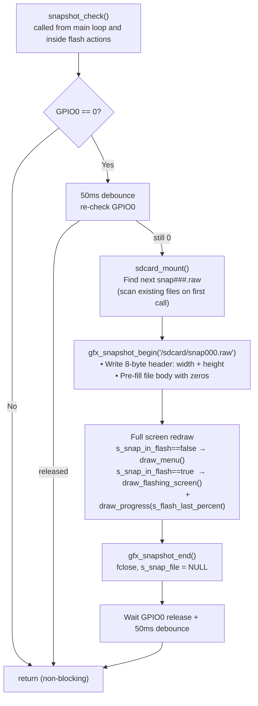
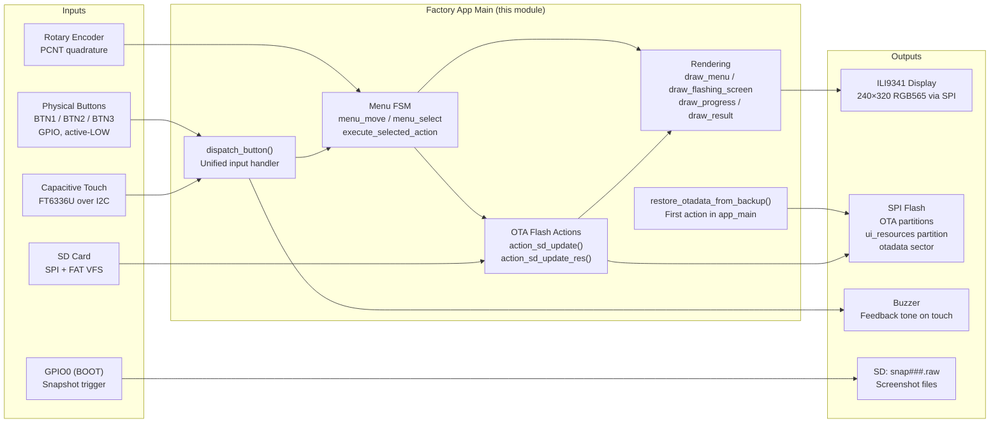

# pibot_pendant_v1_0_factory_app_main

## Overview

The `pibot_pendant_v1_0_factory_app_main` module is the **core logic layer of the PiBot Pendant v1.0 factory recovery application**. It runs as an independent ESP-IDF firmware image flashed to the `factory` OTA partition and provides a standalone, self-contained recovery environment that operates entirely outside the main pendant firmware.

When the user holds **BTN3** at power-on, the custom bootloader detects the press, backs up the OTA partition table (`otadata`) to a reserved flash sector, erases the live `otadata` (so the ESP-IDF ROM bootloader selects the factory partition), and performs a software reset. The factory app then starts, restores `otadata` from the backup, renders a navigable menu on the ILI9341 display, and lets the operator boot a specific OTA slot or flash new firmware / UI resources directly from a microSD card.

This module is the entry point and orchestrator of that recovery environment. It owns the top-level control flow, the menu state machine, all rendering calls, and all flash-write sequences.

> **Related modules:**
> - Display hardware abstraction → [pibot_pendant_v1_0_factory_app_display.md](pibot_pendant_v1_0_factory_app_display.md)
> - Input peripherals (buttons, encoder, touch, buzzer) → [pibot_pendant_v1_0_factory_app_input.md](pibot_pendant_v1_0_factory_app_input.md)
> - SD card storage → [pibot_pendant_v1_0_factory_app_storage.md](pibot_pendant_v1_0_factory_app_storage.md)
> - Bootloader hooks that trigger recovery → [pibot_pendant_v1_0_bootloader.md](pibot_pendant_v1_0_bootloader.md)
> - Board support package (main firmware) → [pibot_pendant_v1_0_bsp.md](pibot_pendant_v1_0_bsp.md)

---

## Architecture

### Module Boundary

The factory recovery app is a **completely separate firmware image** from the main pendant firmware. It lives in the `boards/pibot_pendant_v1_0/Factory/` tree and is built independently. There are no shared code paths with the main firmware at runtime.



### Internal Module Structure



---

## Boot & Recovery Handshake

The factory recovery lifecycle involves three distinct phases across the bootloader and the factory app. Understanding this handshake is essential before modifying either side.



> **Safety guarantee:** `restore_otadata_from_backup()` runs as the very first action in `app_main()`, before any hardware is initialised. This ensures that even an immediate power-off after entering recovery returns the device to the previously active OTA slot.

---

## Component Reference

### `app_main` — Entry Point and Main Loop

**File:** `boards/pibot_pendant_v1_0/Factory/main/main.c`

`app_main()` is the top-level entry point called by the ESP-IDF startup task. It performs a strictly ordered initialisation sequence, builds the menu, then drives an event loop.

#### Initialisation Order



If `ili9341_init()` fails, `app_main()` calls `abort()` after a 200 ms UART flush delay — the display is a hard dependency; there is no fallback rendering path.

#### Main Event Loop

The loop polls all input sources with no RTOS blocking between sources (short 100 ms timeout on `button_wait_press`):



Touch events include a **visual and audible feedback** sequence before calling `dispatch_button()`:
1. `draw_button_hint_pressed(vbtn)` — repaints the circle in violet
2. `buzzer_beep_short()` — short tone
3. 80 ms delay
4. `draw_button_hints()` — restores normal colours
5. `dispatch_button(vbtn)` — executes the action

---

### OTA Data Management

#### `restore_otadata_from_backup`

Reads the bootloader backup written to `0xB000`, validates the magic word `0xAA55AA55` at offset `0x40`, writes the two `otadata` entries back to `0x10000` / `0x11000`, then erases the backup sector so the restore does not repeat on any subsequent boot from this factory partition.

```c
// Flash layout used by this function — must match bootloader hooks.c EXACTLY
#define OTADATA_OFFSET          0x10000   // Live otadata sector 1
#define OTADATA_SECTOR_SIZE     0x1000    // 4 KB per sector
#define OTADATA_ENTRY_SIZE      32        // Bytes per otadata entry
#define OTADATA_BACKUP_OFFSET   0xB000    // Reserved backup sector (pre-partition)
#define BACKUP_MAGIC_OFFSET     0x40      // Magic word offset within backup sector
#define BACKUP_MAGIC            0xAA55AA55
```

> ⚠️ **Porting note:** `OTADATA_BACKUP_OFFSET` must satisfy three constraints simultaneously:
> 1. After bootloader end (~0x5980 for this board)
> 2. Before partition table (`CONFIG_PARTITION_TABLE_OFFSET = 0xC000`)
> 3. 4 KB-aligned
>
> `CONFIG_SPI_FLASH_DANGEROUS_WRITE_ALLOWED=y` must be set in the factory `sdkconfig` because `esp_flash_erase_region()` targets an address below the first partition.

#### `boot_partition`

Looks up the requested partition label with `esp_partition_find_first()`, sets it as the boot partition via `esp_ota_set_boot_partition()`, and calls `esp_restart()`. On failure, redraws the menu with an error status.

---

### Menu System

#### Data Model

```c
typedef struct {
    const char   *label;      // Display text
    menu_action_t action;     // BOOT_APP0 | BOOT_APP1 | SD_UPDATE_APP0 | SD_UPDATE_APP1 | SD_UPDATE_RES
    uint16_t      color;      // RGB565 text colour when not selected
} menu_item_t;

static menu_item_t menu_items[MENU_MAX_ITEMS];  // Up to 8 entries
static int menu_count    = 0;                   // Populated entries
static int menu_selected = 0;                   // Highlighted index
```

Menu items are always built from the same set; `app1` entries appear only when the partition is detected:

| Item Label | Action Enum | Shown When |
|---|---|---|
| `Boot app0` | `MENU_ACTION_BOOT_APP0` | Always |
| `Boot app1` | `MENU_ACTION_BOOT_APP1` | `has_app1 == true` |
| `SD -> app0` | `MENU_ACTION_SD_UPDATE_APP0` | Always |
| `SD -> app1` | `MENU_ACTION_SD_UPDATE_APP1` | `has_app1 == true` |
| `SD -> resources` | `MENU_ACTION_SD_UPDATE_RES` | Always |

#### Menu Navigation Functions

| Function | Description |
|---|---|
| `menu_move(direction)` | Moves selection by `±1`, wraps around at boundaries |
| `menu_select(index)` | Sets `menu_selected`, clears status, redraws old and new items only |
| `dispatch_button(btn)` | BTN1 → `menu_move(-1)`, BTN2 → `menu_move(+1)`, BTN3 → `execute_selected_action()` |
| `execute_selected_action()` | Switches on `menu_items[menu_selected].action` and calls the appropriate action |

---

### Rendering System

The rendering system uses a **direct scanline push** approach: primitives compute pixel data into small stack buffers and write immediately to the ILI9341 via SPI. There is no retained LVGL scene graph or full-screen framebuffer in RAM.

#### Screen Layout

```
┌──────────────────────────────────────┐  y=0
│  PiBot Recovery vX.X.X              │  y=10  (title, centered)
│  ─────────────────────────────────  │  y=30  (separator line)
│  Active: app0                        │  y=40  (active OTA slot)
│  SD: FW RES                          │  y=61  (SD file indicators)
│  ─────────────────────────────────  │  y=78  (separator line)
│  [ Boot app0             ]           │  y=83  (menu item 0, MENU_START_Y)
│  > SD -> app0            <           │  y=113 (selected item, highlighted)
│  [ SD -> resources       ]           │  y=143 (menu item 2)
│  ─────────────────────────────────  │  STATUS_Y-5
│  Power off to cancel                 │  STATUS_Y  (footer / status message)
│══════════════════════════════════════│  BTN_HINT_BASE_Y (separator line)
│   ↑          ↓          ✓           │  BTN_HINT_CY  (button circles)
└──────────────────────────────────────┘  y=SCREEN_HEIGHT
```

#### Drawing Functions

| Function | What it draws |
|---|---|
| `draw_header()` | Clears screen to black, white border, title string, first separator |
| `draw_menu()` | Full-screen redraw: header + OTA info + SD indicators + all items + footer + hint bar |
| `draw_menu_item(index)` | Single item: clears area, highlight box if selected, label in correct colour |
| `draw_sd_indicators()` | `SD:` label + `FW` (green) and/or `RES` (cyan) if files detected on SD |
| `draw_footer_zone()` | Status message or default "Power off to cancel" text, centered |
| `draw_flashing_screen()` | Header + "Flashing…" title + "Do NOT power off!" warning |
| `draw_progress(percent)` | Centered progress bar outline + proportional fill + percentage text |
| `draw_result(success, msg)` | Success (green `msg`) or failure (red "FAILED! Power cycle.") in lower area |
| `draw_button_hints()` | Separator line + three circle-icon buttons in the hint bar |
| `draw_button_hint_at(cx, cy, btn, color)` | One double-stroke circle + centred icon at given pixel position |
| `draw_button_hint_pressed(btn)` | Recolours one button to `BTN_PRESSED_COLOR` (violet) for press feedback |

#### Primitive Icon Drawing

Icons are drawn with direct `gfx_hline()` calls (no font or bitmap lookup). All icon functions take `(cx, cy)` as the icon centre, designed to fit inside a radius-20 circle:



#### Status / Footer Management

```c
static char     last_status_msg[40] = "";
static uint16_t last_status_color   = 0;
```

- `show_status(msg, color)` — stores message, redraws only the footer zone
- `clear_status()` — clears message, restores "Power off to cancel" default
- `draw_footer_zone()` — idempotent redraw driven by `last_status_msg`

---

### SD File Detection

`probe_sd_files()` mounts the SD card, checks for `esp3dfw.bin` and `ui_resources.bin`, then unmounts. The results (`sd_has_fw`, `sd_has_res`) are module-level booleans used by `draw_sd_indicators()`.

```
/sdcard/
├── esp3dfw.bin          ← detected → sd_has_fw = true
├── esp3dfw.ok           ← renamed from esp3dfw.bin on successful flash
├── esp3dfw.bad          ← renamed from esp3dfw.bin on failed flash
├── ui_resources.bin     ← detected → sd_has_res = true
├── ui_resources.ok      ← renamed on successful flash
└── ui_resources.bad     ← renamed on failed flash
```

SD update menu items are **always shown** regardless of file detection. Detection only governs the indicator line at `y=61`. The operator can insert an SD card after entering recovery and use the items immediately.

---

### Firmware Flash Action — `action_sd_update`

Flashes `esp3dfw.bin` from SD to the target OTA partition using the ESP-IDF OTA API (`esp_ota_begin` / `esp_ota_write` / `esp_ota_end`).



The 1 KB read/write chunk is a stack buffer — no heap allocation is needed in the hot path.

---

### Resource Flash Action — `action_sd_update_res`

Flashes `ui_resources.bin` from SD to the `ui_resources` custom data partition using direct partition API (`esp_partition_erase_range` + `esp_partition_write`). The OTA API is not used because this is not an app partition.

Key differences from `action_sd_update`:
- Reads a 16-byte build header (`ESP3` magic + 12-char variant string) at file offset 0 and logs it before flashing, enabling early detection of variant mismatches.
- Uses `esp_partition_erase_range()` (full partition erase) before writing.
- Target partition is looked up by name `"ui_resources"` and type `ESP_PARTITION_TYPE_DATA`.



---

### Touch Hit-Testing

The virtual button bar occupies the bottom `BTN_HINT_H` pixels of the screen. The hit-test zone is deliberately larger than the drawn circles: the full screen width is divided into three equal columns so any tap in the lower third registers correctly.

```
Screen width (240 px)
┌──────────┬──────────┬──────────┐
│  x < 80  │ 80–159   │ x ≥ 160  │
│  BTN_1   │  BTN_2   │  BTN_3   │
│   (↑)    │   (↓)    │   (✓)    │
└──────────┴──────────┴──────────┘
  y ≥ BTN_HINT_BASE_Y only
```

`touch_hint_hit_test(x, y)` returns `BTN_NONE` when `y < BTN_HINT_BASE_Y` (touches above the hint bar are ignored by this function and flow back to the menu for future touch-to-select support).

---

### Snapshot System — `ENABLE_SNAPSHOT` (optional)

When compiled with `ENABLE_SNAPSHOT`, pressing the **BOOT button (GPIO0)** captures a raw screenshot to the SD card at any point during execution.



The snapshot pipeline is transparent: `gfx_flush()` mirrors every SPI pixel write to the open snapshot file via `snap_write()`, which seeks to the correct file offset for each rectangular region (`x0,y0` → `x1,y1`) and writes native-endian RGB565 pixels.

**Raw file format:**
- Bytes 0–3: screen width (little-endian `uint32_t`)
- Bytes 4–7: screen height (little-endian `uint32_t`)
- Bytes 8+: row-major RGB565 pixels (native endian), `width × height × 2` bytes total

Use `boards/pibot_pendant_v1_0/Factory/tools/raw2png/snap2png.py` to convert `.raw` files to PNG for inspection.

---

### Logging — `factory_log.h`

The `FACTORY_LOGD` macro is a compile-time gate controlled by the `ENABLE_FACTORY_DEBUG_LOG` CMake option:

```c
#if FACTORY_LOG_LEVEL        // 1 when ENABLE_FACTORY_DEBUG_LOG=ON, 0 otherwise
#define FACTORY_LOGD(tag, fmt, ...) ESP_LOGI(tag, fmt, ##__VA_ARGS__)
#else
#define FACTORY_LOGD(tag, fmt, ...) do {} while (0)  // Zero overhead in production
#endif
```

`factory_log_silence_sd_stack()` is called as the **first statement** in `app_main()`. It mutes eight ESP-IDF internal driver tags at runtime (`sdmmc`, `vfs_fat_sdmmc`, `sdmmc_periph`, `sdmmc_req`, `sdmmc_common`, `fatfs`, `sdspi`, `sd_diskio`) to prevent SD stack chatter from polluting serial output, particularly in debug builds where the sdkconfig log ceiling is raised to INFO.

`ESP_LOGW` and `ESP_LOGE` are **never gated** — they always emit regardless of `FACTORY_LOG_LEVEL`.

---

## Data Flow Summary



---

## Key Constants Reference

| Constant | Value | Purpose |
|---|---|---|
| `OTADATA_OFFSET` | `0x10000` | Live OTA data flash address (sector 1) |
| `OTADATA_BACKUP_OFFSET` | `0xB000` | Bootloader backup sector address |
| `BACKUP_MAGIC` | `0xAA55AA55` | Sentinel validating backup presence |
| `FW_FILENAME` | `/sdcard/esp3dfw.bin` | Firmware update source file |
| `RES_FILENAME` | `/sdcard/ui_resources.bin` | Resource update source file |
| `MENU_START_Y` | `83` | Y-coordinate of first menu item |
| `MENU_ITEM_H` | `30` | Height per menu item in pixels |
| `STATUS_Y` | `SCREEN_HEIGHT − 25 − BTN_HINT_H` | Footer status message Y-position |
| `BTN_CIRCLE_R` | `20` | Radius of button hint circles |
| `BTN_HINT_H` | `49` | Total height of button hint bar in pixels |
| `MENU_MAX_ITEMS` | `8` | Maximum menu entries |
| `BTN_HINT_CX1/CX2/CX3` | `45 / 120 / 195` | Circle X-centres for BTN1 / BTN2 / BTN3 |

---

## Build & Flash

The factory app is built separately from the main firmware. Flash tooling lives in [pibot_pendant_v1_0_factory_app_tools](pibot_pendant_v1_0_factory_app_tools.md).

```bash
# Build the factory app
idf.py -C boards/pibot_pendant_v1_0/Factory build

# Flash only factory partition + custom bootloader + partition table
python boards/pibot_pendant_v1_0/Factory/tools/flash_factory.py

# Flash everything (factory + main firmware + resources)
python boards/pibot_pendant_v1_0/Factory/tools/flash_all.py
```

**CMake feature flags** (set in `Factory/CMakeLists.txt`):

| Flag | Effect |
|---|---|
| `ENABLE_FACTORY_DEBUG_LOG` | Enables `FACTORY_LOGD` → `ESP_LOGI` output (`FACTORY_LOG_LEVEL=1`) |
| `ENABLE_SNAPSHOT` | Compiles in GPIO0 screenshot capture via `snapshot_check()` |

---

## Design Decisions & Constraints

| Decision | Rationale |
|---|---|
| `restore_otadata_from_backup()` runs before any hardware init | Guarantees safe power-off state even if the display fails to initialise |
| 1 KB stack buffer for flash read/write chunks | No heap allocation; safe under worst-case fragmented ESP32 heap in factory context |
| SD items always visible regardless of file probe | Operator can insert an SD card after entering recovery without re-running detection |
| Touch hit-target is full column width (80 px), not drawn circle (40 px) | Easier to tap accurately under stress or without precise finger placement |
| `button_wait_press(100ms)` non-blocking timeout | Keeps encoder polling responsive — a longer block would drop encoder ticks |
| Rename source file to `.ok` / `.bad` after flash | Lets operator distinguish a used update file from a fresh one without a PC |
| `CONFIG_SPI_FLASH_DANGEROUS_WRITE_ALLOWED=y` required | Factory app intentionally writes to the pre-partition region; this is a privileged recovery tool |
| SD chatter silenced at runtime via `factory_log_silence_sd_stack()` | Debug builds raise the sdkconfig log ceiling to INFO, causing the SD stack to become verbose — silencing keeps factory log output focused on recovery logic |
