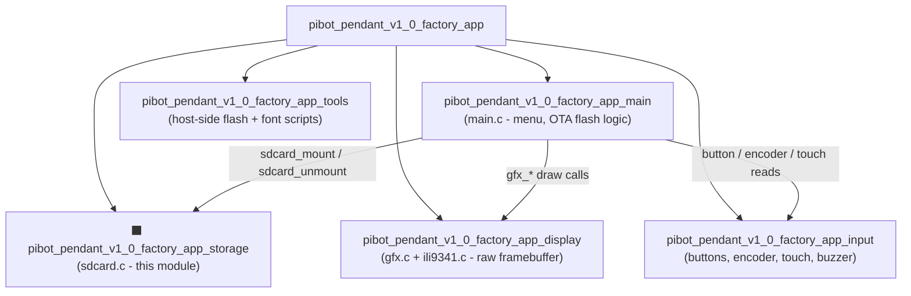
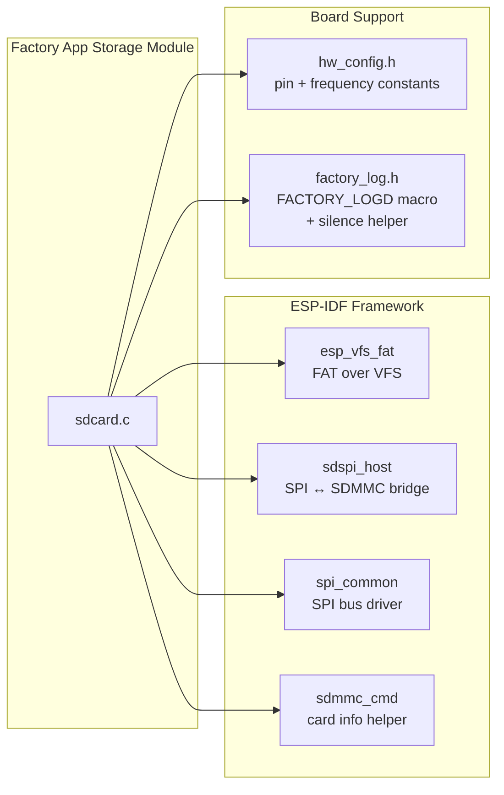
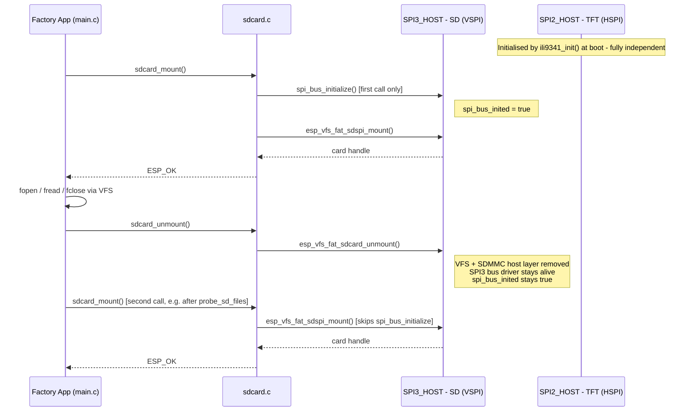
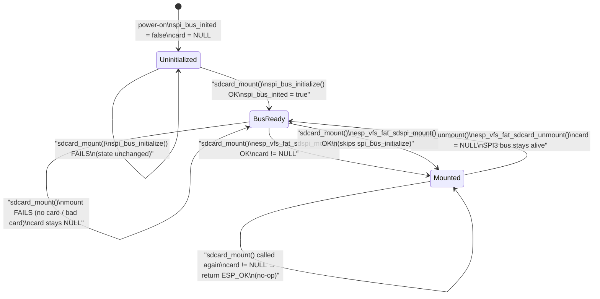
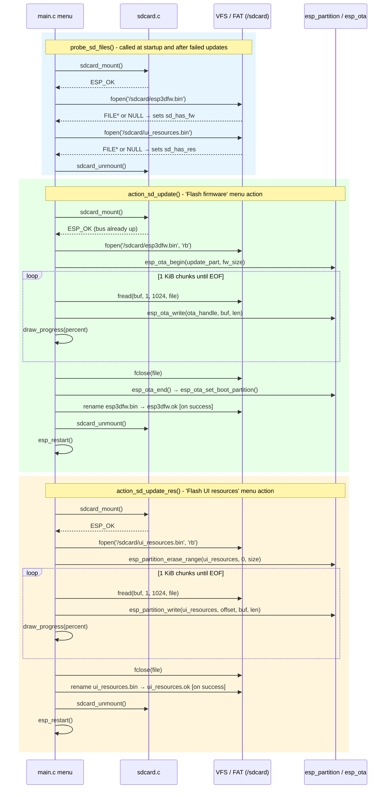

# pibot\_pendant\_v1\_0\_factory\_app\_storage

SD card storage module for the PiBot Pendant v1.0 factory application. Provides the two-function
interface (`sdcard_mount` / `sdcard_unmount`) that the factory app uses to read firmware and
resource binaries from an SD card and stream them into flash partitions via the ESP-IDF VFS FAT
layer.

> **Cross-board context:** Every supported board has its own `sdcard.c` with the same
> `sdcard_mount` / `sdcard_unmount` API. The generic behaviour and design rationale shared by
> all boards is documented in [factory\_sdcard.md](factory_sdcard.md). This document covers
> PiBot Pendant v1.0-specific details: exact hardware wiring, pin assignments, the two-bus
> topology, and how the module fits inside the PiBot factory-app sub-module tree.

---

## Table of Contents

1. [Module Purpose](#1-module-purpose)
2. [Position in the Factory App](#2-position-in-the-factory-app)
3. [Architecture & Components](#3-architecture--components)
4. [Public API](#4-public-api)
5. [Hardware Configuration](#5-hardware-configuration)
6. [SPI Bus Lifecycle](#6-spi-bus-lifecycle)
7. [Mount / Unmount State Machine](#7-mount--unmount-state-machine)
8. [Data Flow — SD Operations in the Factory App](#8-data-flow--sd-operations-in-the-factory-app)
9. [Logging Control](#9-logging-control)
10. [Design Decisions & Constraints](#10-design-decisions--constraints)
11. [File Inventory](#11-file-inventory)

---

## 1. Module Purpose

The factory application for the PiBot Pendant v1.0 is a self-contained, minimal ESP-IDF app
stored in a dedicated `factory` partition. Its primary job is to allow field flashing of the main
pendant firmware and the UI-resource binary without requiring a USB cable or an OTA server — the
operator copies a binary file onto an SD card and selects the corresponding update action from
the factory-app menu.

This storage module owns the entire SD card layer:

- Initialising the SPI bus once per power-on.
- Mounting and unmounting the FAT filesystem on demand.
- Exposing a clean `mount` / `unmount` pair so that the rest of the factory app can open files
  via standard POSIX calls without knowing anything about SPI or VFS configuration.

The module deliberately keeps its scope narrow. It does **not** read or write files — that
responsibility belongs to the callers in `main.c` (`action_sd_update`, `action_sd_update_res`,
`probe_sd_files`), which use standard `fopen` / `fread` / `fclose` calls against the VFS mount
point `/sdcard`.

---

## 2. Position in the Factory App

The factory application is divided into five focused sub-modules. This storage module is the only
place that touches the SD card hardware.



The bootloader that decides whether to launch the factory app or the main firmware is documented
in [pibot\_pendant\_v1\_0\_bootloader.md](pibot_pendant_v1_0_bootloader.md).

---

## 3. Architecture & Components

### 3.1 Component dependency diagram



### 3.2 Module-internal symbols

| Symbol | Kind | Visibility | Purpose |
|---|---|---|---|
| `card` | `static sdmmc_card_t *` | file-private | Points to the mounted card descriptor; `NULL` when unmounted |
| `spi_bus_inited` | `static bool` | file-private | Guards the one-time SPI bus initialisation |
| `sdcard_mount()` | function | **public** | Initialises the SPI bus (once) and mounts the FAT volume |
| `sdcard_unmount()` | function | **public** | Unmounts the FAT volume; keeps the SPI bus running |

---

## 4. Public API

Declared in `boards/pibot_pendant_v1_0/Factory/main/sdcard.h`.

### `sdcard_mount`

```c
esp_err_t sdcard_mount(void);
```

**Sequence of operations:**

1. Returns `ESP_OK` immediately if `card != NULL` — callers may call it speculatively without
   paying a remount cost.
2. If `spi_bus_inited == false`, calls `spi_bus_initialize(SD_SPI_HOST, …)` with the pin
   configuration from `hw_config.h` and `max_transfer_sz = 4096`. Sets `spi_bus_inited = true`
   on success.
3. Builds `sdspi_device_config_t` with `gpio_cs = SD_CS` and `host_id = SD_SPI_HOST`.
4. Builds `sdmmc_host_t` with `slot = SD_SPI_HOST` and `max_freq_khz = SD_FREQ_KHZ`.
5. Calls `esp_vfs_fat_sdspi_mount()` with a mount config that:
   - sets `format_if_mount_failed = false` — the factory tool must never silently erase user data
   - limits open files to `max_files = 4`
   - enables `disk_status_check_enable = true` to detect card removal between operations
6. On success, stores the card pointer in `card` and, if `FACTORY_LOG_LEVEL` is non-zero,
   prints card info via `sdmmc_card_print_info`.

**Return values:**

| Value | Meaning |
|---|---|
| `ESP_OK` | Card mounted (or was already mounted) |
| `ESP_ERR_*` from `spi_bus_initialize` | SPI bus init failed |
| `ESP_ERR_*` from `esp_vfs_fat_sdspi_mount` | No card inserted, bad card, or VFS error |

Callers display an error status on any non-`ESP_OK` return and do not proceed with file I/O.
The module does not retry internally.

---

### `sdcard_unmount`

```c
void sdcard_unmount(void);
```

If `card != NULL`, calls `esp_vfs_fat_sdcard_unmount(SD_MOUNT_POINT, card)` and sets
`card = NULL`. The SPI bus (`SD_SPI_HOST`) is **not** freed on unmount.
See [§6](#6-spi-bus-lifecycle) for the rationale.

---

## 5. Hardware Configuration

All constants are defined in `boards/pibot_pendant_v1_0/Factory/main/hw_config.h`.

### SD card SPI bus (`SPI3_HOST` / VSPI)

| Constant | Value | Role |
|---|---|---|
| `SD_SPI_HOST` | `SPI3_HOST` | ESP32 VSPI peripheral |
| `SD_MOSI` | `GPIO_NUM_23` | SPI MOSI |
| `SD_MISO` | `GPIO_NUM_19` | SPI MISO |
| `SD_CLK` | `GPIO_NUM_18` | SPI clock |
| `SD_CS` | `GPIO_NUM_5` | SD chip-select (active low) |
| `SD_FREQ_KHZ` | `20000` | 20 MHz maximum clock |
| `SD_MOUNT_POINT` | `"/sdcard"` | VFS path prefix for all file I/O |

### TFT display SPI bus (`SPI2_HOST` / HSPI) — for reference

| Constant | Value |
|---|---|
| `TFT_HOST` | `SPI2_HOST` |
| `TFT_MOSI` | `GPIO_NUM_13` |
| `TFT_CLK` | `GPIO_NUM_14` |
| `TFT_MISO` | `GPIO_NUM_12` |
| `TFT_CS` | `GPIO_NUM_15` |

The PiBot Pendant v1.0 wires the SD card and TFT to **different ESP32 SPI peripherals**
(`SPI3_HOST` vs `SPI2_HOST`) on **different GPIO pins** — they are electrically independent.
This distinguishes the PiBot from boards where both devices share a single SPI host. See
[§6](#6-spi-bus-lifecycle) for why `SPI3_HOST` is still kept alive after unmount.

---

## 6. SPI Bus Lifecycle



**Why the SPI bus is never freed:**

Although `SPI3_HOST` and `SPI2_HOST` are separate peripherals on this board, calling
`spi_bus_free()` and then `spi_bus_initialize()` on every mount/unmount cycle adds unnecessary
overhead and risks disrupting ESP-IDF's internal DMA channel bookkeeping. Keeping `SPI3_HOST`
alive means subsequent `sdcard_mount` calls skip bus initialisation and go straight to
`esp_vfs_fat_sdspi_mount`, which is faster and avoids any risk of IDF internal-state
corruption. The `spi_bus_inited` flag ensures `spi_bus_initialize` is called at most once per
power-on regardless of how many mount/unmount cycles occur.

The same code pattern runs on boards where TFT and SD **do** share a single SPI host — on those
boards freeing the bus would break the display immediately. The PiBot's two-bus layout makes
the constraint less severe but the conservative design is retained for portability and safety.

---

## 7. Mount / Unmount State Machine



**Key invariant:** `spi_bus_inited` is never reset to `false`. Once the SPI bus is up it
remains up for the lifetime of the factory-app session.

---

## 8. Data Flow — SD Operations in the Factory App

Three functions in `main.c` use this module. All follow the same acquire → use → release
pattern, with `sdcard_mount` and `sdcard_unmount` bracketing every file I/O session.



### SD card file conventions

Files must be placed at the root of the SD card's FAT filesystem:

| Filename | Purpose | Renamed on success | Renamed on failure |
|---|---|---|---|
| `esp3dfw.bin` | Main pendant firmware (OTA binary) | `esp3dfw.ok` | `esp3dfw.bad` |
| `ui_resources.bin` | UI icons / fonts resource partition image | `ui_resources.ok` | `ui_resources.bad` |

Renaming the source file after each operation prevents an accidental re-flash on the next
boot while leaving a diagnostic artefact on the card. The `.ok` / `.bad` extension lets an
operator distinguish a previously successful run from a failed one without needing a UART
monitor.

> For the `ui_resources.bin` binary format and how to generate it, see the
> [`ui_resources/development.md`](https://github.com/luc-github/Pibot-cnc-pendant-firmware/blob/main/docs/ui_resources/development.md) guide.

---

## 9. Logging Control

### `FACTORY_LOGD` macro

`sdcard.c` emits trace messages via `FACTORY_LOGD(TAG, ...)` with tag `"SDCARD"`. The macro
expands to `ESP_LOGI` when `FACTORY_LOG_LEVEL` is non-zero, and to a zero-overhead no-op in
production builds:

```c
/* factory_log.h */
#if FACTORY_LOG_LEVEL
#define FACTORY_LOGD(tag, fmt, ...) ESP_LOGI(tag, fmt, ##__VA_ARGS__)
#else
#define FACTORY_LOGD(tag, fmt, ...) do {} while (0)   /* compiled out */
#endif
```

`FACTORY_LOG_LEVEL` is set at compile time by `ENABLE_FACTORY_DEBUG_LOG` in
`Factory/CMakeLists.txt`. Hard errors (`ESP_LOGE`) and warnings (`ESP_LOGW`) in `sdcard.c`
are **not** gated by this macro — they remain active in all builds. Card info output
(`sdmmc_card_print_info`) is additionally guarded by `#if FACTORY_LOG_LEVEL`.

### `factory_log_silence_sd_stack()`

The ESP-IDF SD/FAT driver stack is verbose at `INFO` level. In debug builds
(`FACTORY_LOG_LEVEL = 1`), the sdkconfig log ceiling is raised to `INFO` for all tags, causing
SD-subsystem chatter to appear even though it adds no value for debugging the factory app's
own logic. `factory_log_silence_sd_stack()` applies dynamic level overrides at runtime to
suppress eight specific internal driver tags:

| Silenced tag | Layer |
|---|---|
| `sdmmc` | SDMMC protocol layer |
| `vfs_fat_sdmmc` | VFS FAT ↔ SDMMC bridge |
| `sdmmc_periph` | SPI peripheral initialisation |
| `sdmmc_req` | SDMMC request handler |
| `sdmmc_common` | Shared SDMMC helpers |
| `fatfs` | FatFs library |
| `sdspi` | SPI ↔ SDMMC host driver |
| `sd_diskio` | Disk I/O layer |

This function is called from `main.c` before the first `sdcard_mount()` invocation. It has no
effect on the `"SDCARD"` tag used by `sdcard.c` itself.

> IDF-internal logs emitted before `app_main()` (SPI flash init, partition table, startup
> banner) cannot be gated at runtime. They are silenced separately by `sdkconfig.prod_log`,
> applied by `cmake/targets.cmake` when `ENABLE_FACTORY_DEBUG_LOG` is OFF.

---

## 10. Design Decisions & Constraints

| Decision | Rationale |
|---|---|
| `format_if_mount_failed = false` | A factory tool must never silently erase user data. Mount failure surfaces as a visible display error; the SD card is never reformatted. |
| `max_files = 4` | The factory app opens at most two files at once. A small limit reduces the FAT layer's internal file-descriptor table, saving RAM on a memory-constrained device. |
| `disk_status_check_enable = true` | Detects card removal between a `probe_sd_files` call and a subsequent `action_sd_update` call, so the mount correctly fails rather than operating on stale state. |
| `max_transfer_sz = 4096` | Matches the 1 KiB read buffer in the flash loop and gives the DMA engine headroom. `SPI_DMA_CH_AUTO` selects the channel automatically. |
| `SD_FREQ_KHZ = 20000` (20 MHz) | Conservative clock well within the reliable range for typical SD cards. Higher speeds are not needed for a one-time firmware flash. |
| SPI bus never freed | Avoids `spi_bus_free` / `spi_bus_initialize` overhead on every mount/unmount cycle and eliminates any risk of IDF internal DMA-state disruption. The pattern is also safe on boards that share one SPI host between TFT and SD. See [§6](#6-spi-bus-lifecycle). |
| Re-entrant mount guard (`card != NULL`) | Callers can invoke `sdcard_mount` without tracking whether the card is already mounted — useful when `probe_sd_files` and `action_sd_update*` run back-to-back. |
| One-shot SPI init guard (`spi_bus_inited`) | `spi_bus_initialize` is not idempotent: calling it twice on the same host returns an error. The boolean flag ensures it is called exactly once per power-on. |

---

## 11. File Inventory

| File | Role |
|---|---|
| `boards/pibot_pendant_v1_0/Factory/main/sdcard.c` | Module implementation — `sdcard_mount` / `sdcard_unmount` |
| `boards/pibot_pendant_v1_0/Factory/main/sdcard.h` | Public header — declares `sdcard_mount` / `sdcard_unmount` |
| `boards/pibot_pendant_v1_0/Factory/main/hw_config.h` | Board-level pin and frequency constants (`SD_*` group, `TFT_*` group) |
| `boards/pibot_pendant_v1_0/Factory/main/factory_log.h` | `FACTORY_LOGD` macro + `factory_log_silence_sd_stack()` |

### Related documentation

| Document | Relationship |
|---|---|
| [factory\_sdcard.md](factory_sdcard.md) | Cross-board reference for the same `sdcard_mount` / `sdcard_unmount` pattern — covers all supported boards, generic design rationale, and the `hw_config.h` symbol contract |
| [pibot\_pendant\_v1\_0\_factory\_app\_main.md](pibot_pendant_v1_0_factory_app_main.md) | Only caller of `sdcard_mount` / `sdcard_unmount`; implements `probe_sd_files`, `action_sd_update`, `action_sd_update_res` |
| [pibot\_pendant\_v1\_0\_factory\_app\_display.md](pibot_pendant_v1_0_factory_app_display.md) | ILI9341 display driver that owns `SPI2_HOST`; context for the two-bus topology described in §5 and §6 |
| [pibot\_pendant\_v1\_0\_bootloader.md](pibot_pendant_v1_0_bootloader.md) | Custom bootloader that launches the factory app on button press; documents the otadata backup/restore sequence |
| [pibot\_pendant\_v1\_0\_factory\_app\_tools.md](pibot_pendant_v1_0_factory_app_tools.md) | Host-side Python tools (`flash_all.py`, `flash_factory.py`) for initial production flashing without an SD card |
