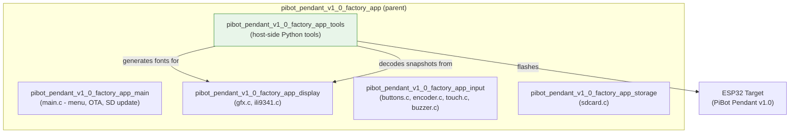
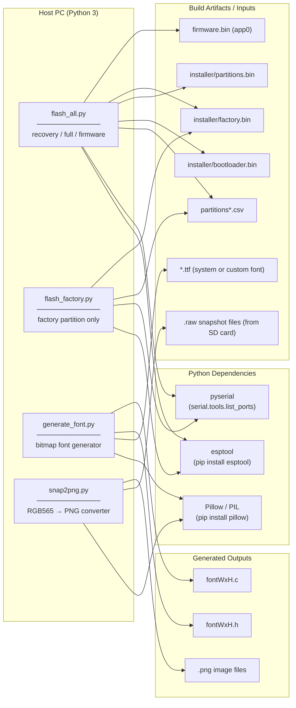
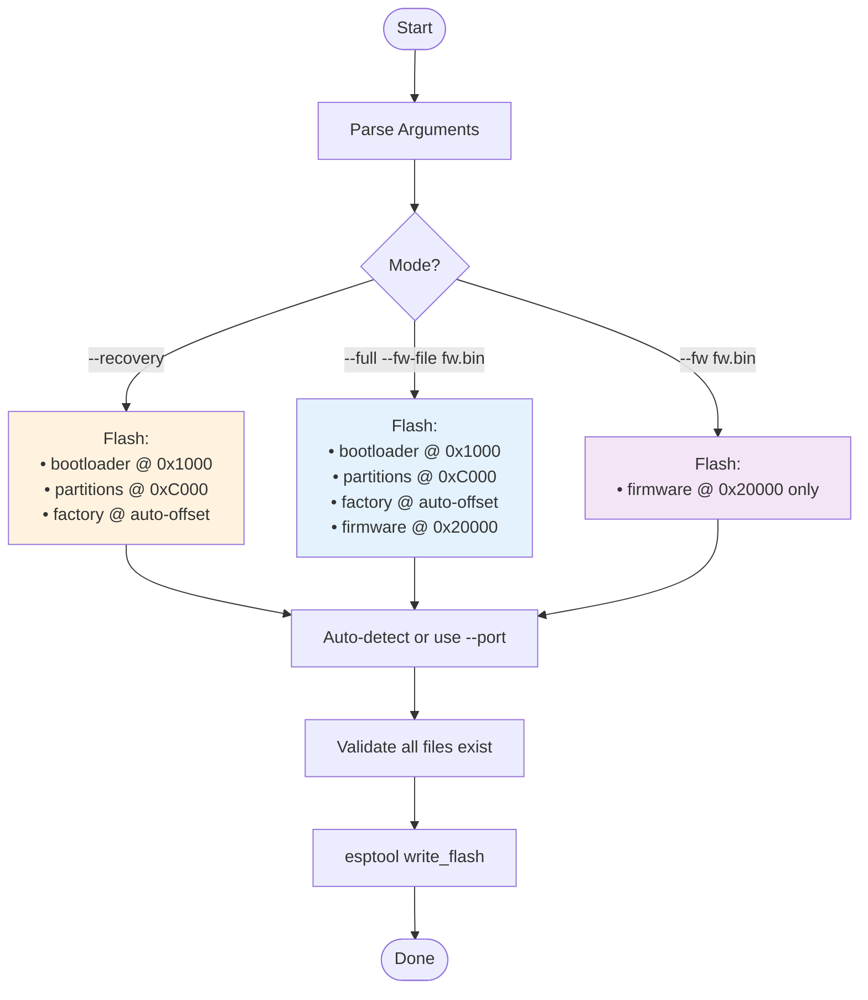
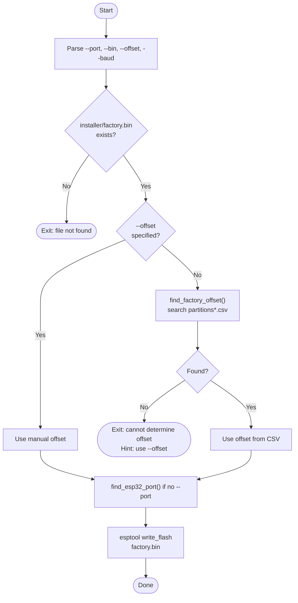
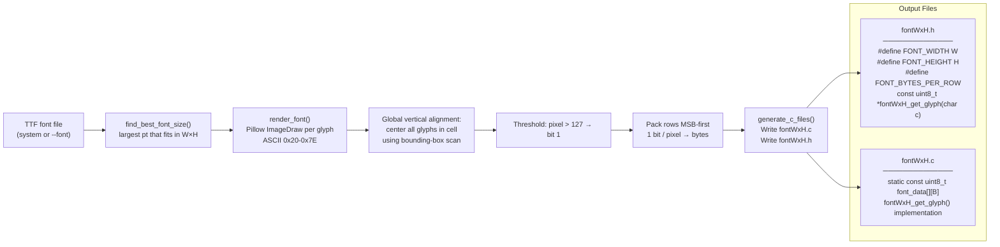
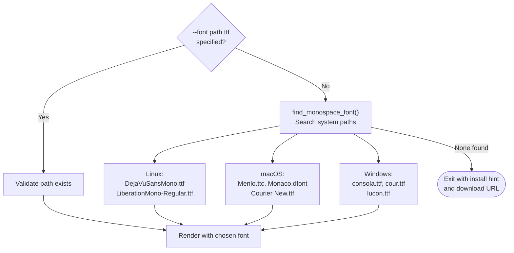
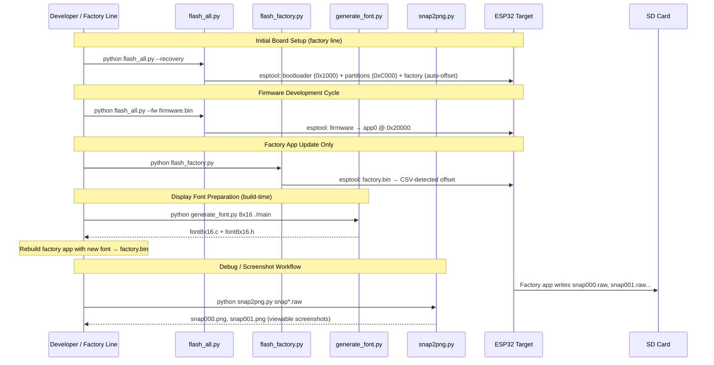

# pibot_pendant_v1_0_factory_app_tools

## Introduction

The `pibot_pendant_v1_0_factory_app_tools` module is a collection of **host-side Python utilities** that support the factory programming, testing, and development workflow for the **PiBot CNC Pendant v1.0**. These tools run on a development PC, not on the ESP32 target itself.

The module contains four independent scripts located in `boards/pibot_pendant_v1_0/Factory/tools/`:

| Script | Purpose |
|---|---|
| `flash_all.py` | Multi-mode flashing: recovery, full, or firmware-only |
| `flash_factory.py` | Targeted factory partition flash |
| `generate_font/generate_font.py` | Generate bitmap font C/H files for the factory app display |
| `raw2png/snap2png.py` | Convert raw RGB565 display snapshots to PNG images |

These tools are the operational counterpart to the embedded factory application documented in [pibot_pendant_v1_0_factory_app_main.md](pibot_pendant_v1_0_factory_app_main.md). Similar tool sets exist for other supported boards (see sibling modules `esp32s3_8048s070c_factory_app`, `esp32s3_bzm_tft35_gt911_factory_app`, etc.).

---

## Module Position in the Factory App



The tools module is **decoupled from the embedded code at runtime** — it operates only at build-time and during factory/development workflows on the host machine.

---

## Architecture Overview



---

## Tool 1: `flash_all.py` — Multi-Mode Flash Script

### Purpose

Provides a single entry point for all flashing scenarios during factory setup and firmware development. It wraps `esptool` with mode-aware logic, automatic port detection, and partition-table-aware offset resolution.

### Operating Modes



### Flash Address Map

| Region | Offset | File |
|---|---|---|
| Bootloader | `0x1000` | `installer/bootloader.bin` |
| Partition table | `0xC000` | `installer/partitions.bin` |
| OTA data | `0x10000` | _(not directly flashed by this tool)_ |
| app0 (main firmware) | `0x20000` | user-supplied `fw.bin` |
| Factory app | auto-detected | `installer/factory.bin` (typically `0x7A0000` for 8 MB layout) |

> The factory partition offset is **not hardcoded**. `find_factory_offset()` reads the first matching `partitions*.csv` in the project tree and extracts the offset from the row where the subtype column equals `factory`. The default fallback is `0x7A0000` (8 MB layout).

### Port Auto-Detection Logic

`find_esp32_port()` iterates `serial.tools.list_ports.comports()` and matches description strings against known USB-UART chip keywords: `CP210`, `CH340`, `CH910`, `FTDI`, `USB Serial`, `USB-SERIAL`. If no keyword matches, it falls back to the first available port.

### Usage Examples

```bash
# First-time factory setup (bootloader + partitions + factory only)
python flash_all.py --recovery

# Complete flash: all partitions + main firmware
python flash_all.py --full --fw-file build/pibot_pendant_v1_0.bin

# Development iteration: update firmware only
python flash_all.py --fw build/pibot_pendant_v1_0.bin

# Specify port explicitly
python flash_all.py --recovery --port COM3
python flash_all.py --recovery --port /dev/ttyUSB0

# Custom baud rate
python flash_all.py --fw build/app.bin --port /dev/ttyUSB0 --baud 115200
```

### Key Functions

| Function | Description |
|---|---|
| `main()` | Argument parsing, mode dispatch, file validation, calls `flash()` |
| `find_factory_offset()` | Parses `partitions*.csv` to locate the factory partition offset |
| `find_esp32_port()` | Auto-detects the ESP32 USB serial port |
| `check_file(path, name)` | Validates that a required binary file exists, prints its size |
| `flash(port, baud, files)` | Constructs and executes the `esptool write_flash` command via subprocess |

---

## Tool 2: `flash_factory.py` — Factory Partition Flash

### Purpose

A focused, single-task variant of `flash_all.py` that flashes **only the factory/recovery partition**. Useful when the bootloader and partition table are already present and only the factory firmware needs to be refreshed (e.g., after a factory app update without changing the partition layout).

### Flow



### CSV Search Patterns

`flash_factory.py` searches for the partition CSV in a broader set of patterns than `flash_all.py`:

```python
PARTITION_CSV_PATTERNS = [
    "partitions*.csv",
    "boards/*/partitions*.csv",
    "boards/*/*/partitions*.csv",
]
```

### Usage Examples

```bash
# Auto-detect everything (port and offset)
python flash_factory.py

# Specify port only
python flash_factory.py --port /dev/ttyUSB0

# Override offset (e.g., for a 4 MB flash layout)
python flash_factory.py --offset 0x3A0000

# Custom binary path and explicit port
python flash_factory.py --bin path/to/my_factory.bin --port COM4
```

### Key Functions

| Function | Description |
|---|---|
| `main()` | Entry point: resolves offset, port, calls `esptool` subprocess |
| `find_factory_offset()` | Searches `PARTITION_CSV_PATTERNS` for the factory subtype row |
| `find_esp32_port()` | USB-UART chip auto-detection (same logic as `flash_all.py`) |

---

## Tool 3: `generate_font/generate_font.py` — Bitmap Font Generator

### Purpose

Generates **C source and header files** containing a rasterized bitmap font for use in the factory app's software framebuffer renderer (`gfx.c` / `ili9341.c` — see [pibot_pendant_v1_0_factory_app_display.md](pibot_pendant_v1_0_factory_app_display.md)). The factory app does not use LVGL; it drives the ILI9341 display directly with a custom pixel renderer that consumes these bitmap glyphs.

### Font Data Format

Each character occupies a fixed cell of `W × H` pixels, packed as **1 bit per pixel, MSB = leftmost pixel**. The glyph data is stored in row-major order:

```
bytes_per_row   = ceil(W / 8)
bytes_per_glyph = bytes_per_row × H
```

Coverage: ASCII printable range `0x20` (space) through `0x7E` (tilde) — 95 characters total.

### Generation Pipeline



### Vertical Alignment Strategy

Rather than using hard-coded baseline constants, the tool scans all 95 glyphs to determine the global bounding box, then centers the entire glyph set vertically within the target cell:

```
max_top    = min(bbox.top)    across all glyphs   (most negative y)
max_bottom = max(bbox.bottom) across all glyphs
total_height = max_bottom - max_top
y_offset = max(0, (target_h - total_height) / 2) - max_top
```

This produces consistent baselines across different TTF files and point sizes.

### Generated API

```c
// fontWxH.h
#define FONT_WIDTH         W
#define FONT_HEIGHT        H
#define FONT_BYTES_PER_ROW ceil(W/8)

// Returns pointer to (FONT_BYTES_PER_ROW × FONT_HEIGHT) bytes of glyph bitmap.
// Characters outside [0x20, 0x7E] map to the space glyph (font_data[0]).
const uint8_t *fontWxH_get_glyph(char c);
```

### Font Search Priority



### Usage Examples

```bash
# 8×16 cell, current directory, system monospace font
python generate_font.py 8x16

# Output to factory main source directory
python generate_font.py 8x16 boards/pibot_pendant_v1_0/Factory/main

# Use a specific DOS-style font (recommended for readability)
python generate_font.py 8x16 . --font "Perfect DOS VGA 437.ttf"

# Smaller font for dense info display
python generate_font.py 6x12 ./main

# Larger font with explicit path
python generate_font.py 10x20 ./main --font /path/to/MyFont.ttf
```

### Flash Size Estimates

| Cell size | Bytes/glyph | Total (95 chars) |
|---|---|---|
| 6×12 | 12 | ~1.1 KB |
| 8×16 | 16 | ~1.5 KB |
| 10×20 | 30 | ~2.8 KB |
| 16×32 | 64 | ~6.1 KB |

### Key Functions

| Function | Description |
|---|---|
| `main()` | CLI parsing, orchestrates the pipeline |
| `find_monospace_font()` | OS-aware search for a suitable TTF font |
| `find_best_font_size(font_path, w, h)` | Finds the largest point size whose rendered glyphs fit within `W×H` |
| `render_font(font_path, w, h)` | Renders all 95 glyphs with consistent vertical alignment using Pillow |
| `generate_c_files(glyphs, w, h, output_dir)` | Writes `.c` and `.h` output files with the bitmap data |

---

## Tool 4: `raw2png/snap2png.py` — Snapshot Converter

### Purpose

Converts raw display snapshot files (`.raw`) captured by the factory app into viewable `.png` images. The factory app's `gfx_snapshot_begin()` / `gfx_snapshot_end()` / `snap_write()` functions (see [pibot_pendant_v1_0_factory_app_display.md](pibot_pendant_v1_0_factory_app_display.md)) write framebuffer contents to the SD card in a compact binary format. This tool decodes those files on the host for inspection and debugging.

### Raw File Format

```
Offset    Size       Type        Field
────────────────────────────────────────────
0x00      4 bytes    uint32_le   Image width  (pixels)
0x04      4 bytes    uint32_le   Image height (pixels)
0x08      W×H×2      uint16_le[] RGB565 pixels, row-major order
```

Total file size: `8 + width × height × 2` bytes.

### RGB565 → RGB888 Conversion

Each 16-bit RGB565 pixel is expanded to 24-bit RGB888 using **bit-replication** (not zero-padding) to preserve luminance accuracy across the full value range:

```python
r = (r5 << 3) | (r5 >> 2)   # 5-bit → 8-bit  (0x1F → 0xFF)
g = (g6 << 2) | (g6 >> 4)   # 6-bit → 8-bit  (0x3F → 0xFF)
b = (b5 << 3) | (b5 >> 2)   # 5-bit → 8-bit  (0x1F → 0xFF)
```

### Conversion Flow


### Usage Examples

```bash
# Single file — output: snap000.png
python snap2png.py snap000.raw

# Batch conversion of all snapshots from the SD card
python snap2png.py snap*.raw

# Custom output filename (single input only)
python snap2png.py snap000.raw -o before_update.png

# Convert from a mounted SD card path
python snap2png.py /media/sdcard/snap*.raw
```

### Key Functions

| Function | Description |
|---|---|
| `main()` | Argument parsing, iterates files, dispatches `convert_raw_to_png()` |
| `convert_raw_to_png(raw_path, output_path)` | Reads header, decodes pixel data, saves PNG via Pillow |
| `rgb565_to_rgb888(pixel)` | Bit-replication color depth expansion for a single RGB565 pixel |

---

## Tool Relationships and Workflow Integration



---

## Dependencies and Prerequisites

| Dependency | Required By | Install |
|---|---|---|
| Python ≥ 3.8 | All tools | System Python or virtual environment |
| `esptool` | `flash_all.py`, `flash_factory.py` | `pip install esptool` |
| `pyserial` | `flash_all.py`, `flash_factory.py` | `pip install pyserial` |
| `Pillow` | `generate_font.py`, `snap2png.py` | `pip install pillow` |
| A TTF monospace font | `generate_font.py` | System-provided or manual download |

> **Recommended font** for `generate_font.py`: *Perfect DOS VGA 437* by Zeh Fernando (free, full CP437 coverage).  
> Download: https://www.dafont.com/perfect-dos-vga-437.font  
> Best results at multiples of 8 px height: `8x16`, `16x32`.

---

## Installer Directory Layout

The flash scripts expect pre-built binaries in an `installer/` subdirectory relative to the script location:

```
boards/pibot_pendant_v1_0/Factory/tools/
├── flash_all.py
├── flash_factory.py
├── installer/
│   ├── bootloader.bin     ← custom bootloader (see pibot_pendant_v1_0_bootloader.md)
│   ├── partitions.bin     ← compiled partition table binary
│   └── factory.bin        ← compiled factory app binary
├── generate_font/
│   └── generate_font.py
└── raw2png/
    └── snap2png.py
```

The `installer/` binaries are build outputs:
- `bootloader.bin` and `factory.bin` — produced by `idf.py build` inside `boards/pibot_pendant_v1_0/Factory/`
- `partitions.bin` — produced by `gen_esp32part.py` from the project's `partitions*.csv`
- Main firmware binary — built separately from the root project via `idf.py build`

---

## Related Documentation

| Document | Relationship |
|---|---|
| [pibot_pendant_v1_0_factory_app_main.md](pibot_pendant_v1_0_factory_app_main.md) | Embedded factory app that runs on the target; these tools flash and support it |
| [pibot_pendant_v1_0_factory_app_display.md](pibot_pendant_v1_0_factory_app_display.md) | `gfx.c` / `ili9341.c` — consumes fonts from `generate_font.py`; produces `.raw` snapshots decoded by `snap2png.py` |
| [pibot_pendant_v1_0_bootloader.md](pibot_pendant_v1_0_bootloader.md) | Custom bootloader binary flashed by `flash_all.py --recovery` |
| [Factory/factory_app_technical_doc.md](https://github.com/luc-github/Pibot-cnc-pendant-firmware/blob/main/docs/Factory/factory_app_technical_doc.md) | In-depth technical reference for the entire factory app system |
| [guides/tools.md](https://github.com/luc-github/Pibot-cnc-pendant-firmware/blob/main/docs/guides/tools.md) | Project-wide host tools guide (WebSocket test, bridge, simulator, build scripts) |
| [guides/board_build_guidelines.md](https://github.com/luc-github/Pibot-cnc-pendant-firmware/blob/main/docs/guides/board_build_guidelines.md) | Build system context: partition table layout, binary paths, variant system |
