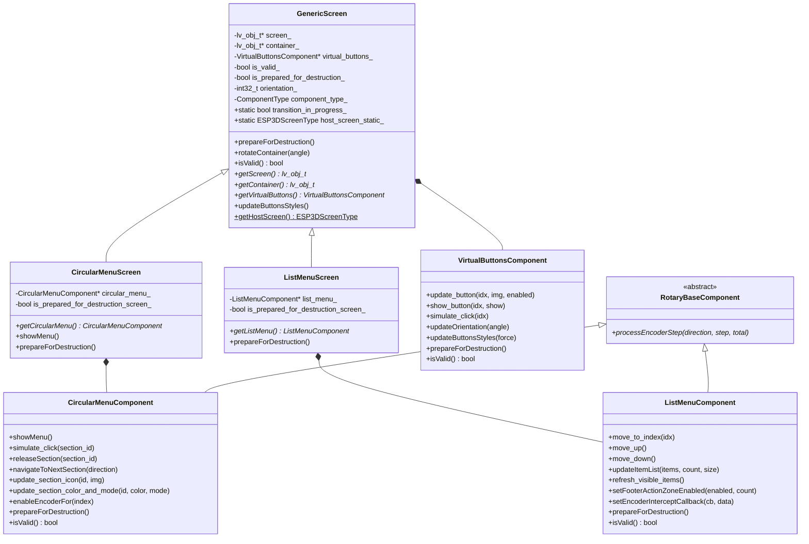
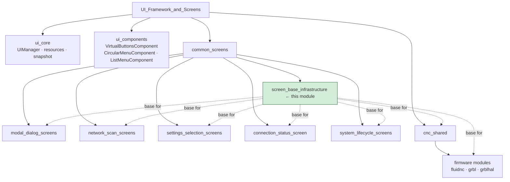
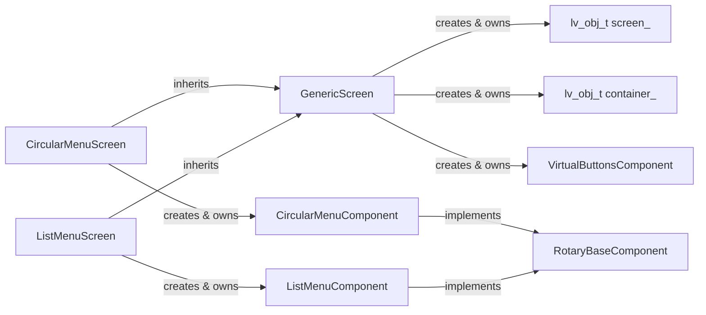
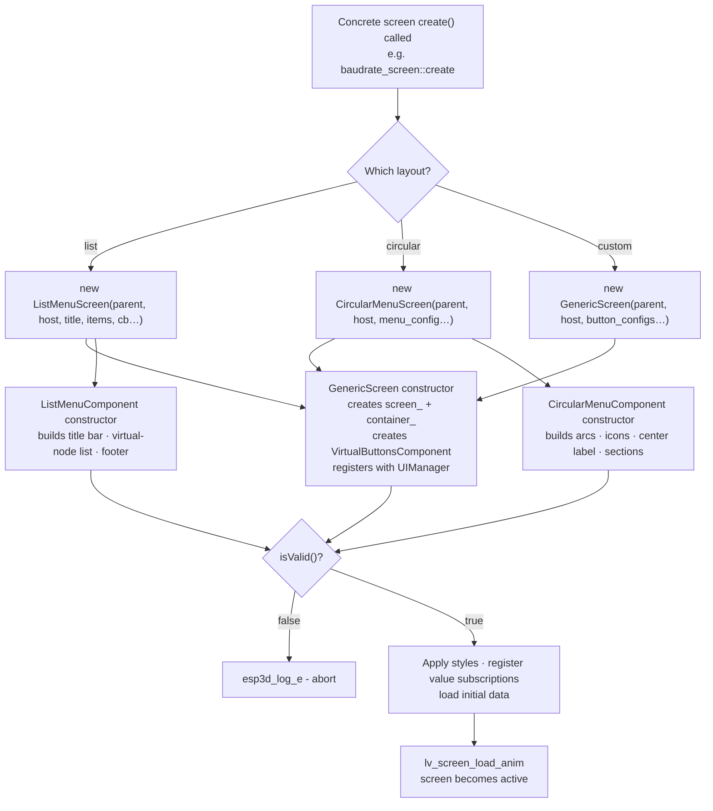
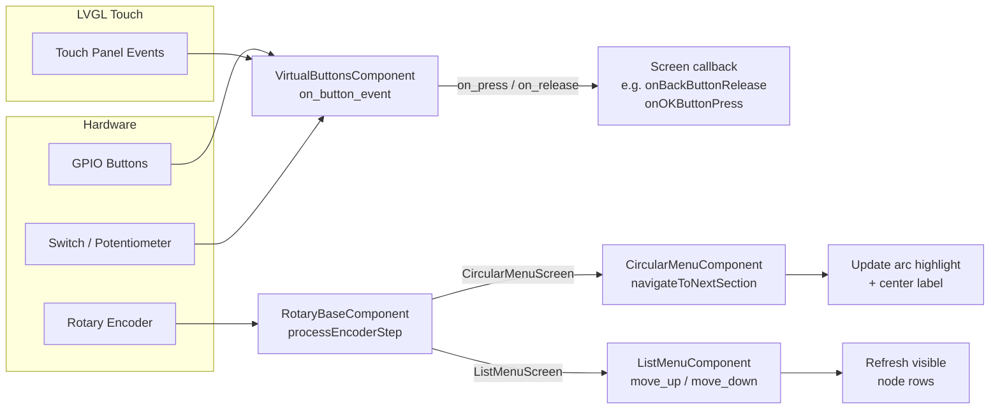
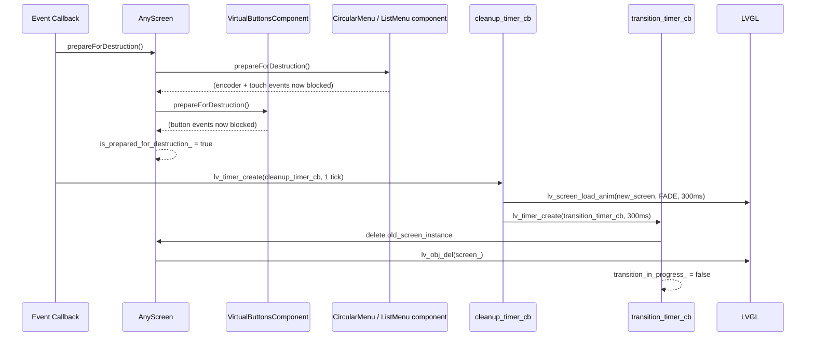
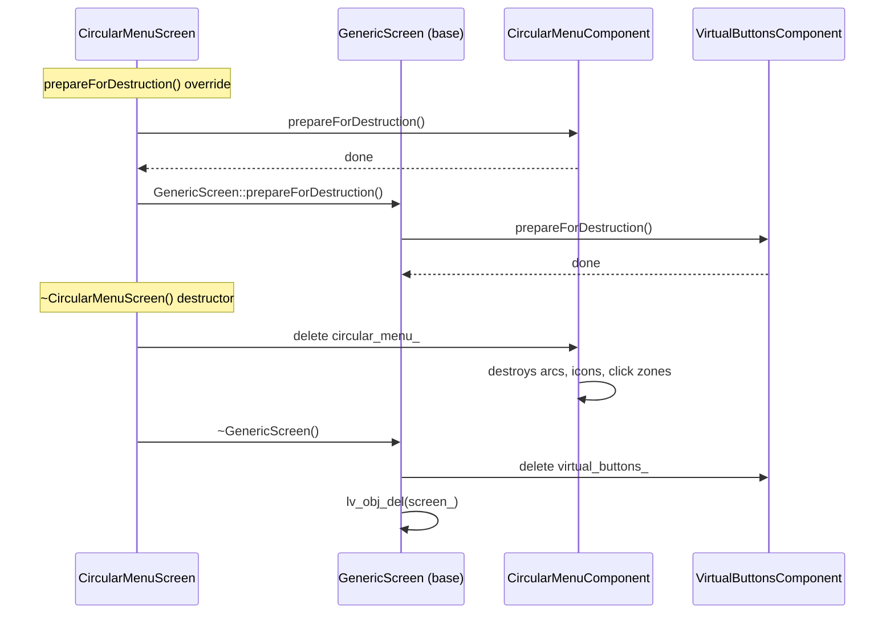
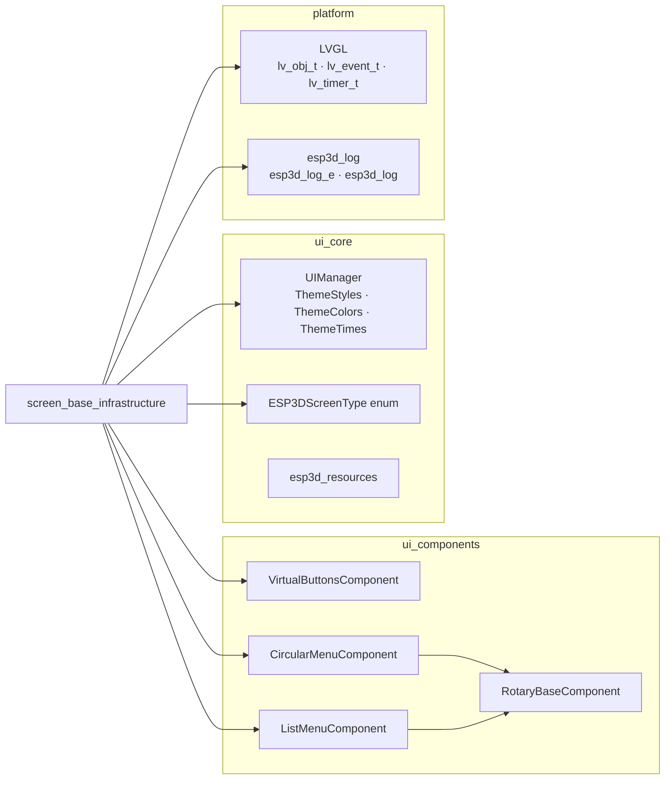

# Screen Base Infrastructure

## Introduction

The `screen_base_infrastructure` module defines the three foundation classes on which every LVGL
screen in the ESP3D-TFT UI system is built:

| Class | Header | Role |
|---|---|---|
| `GenericScreen` | `main/display/screens/generic_screen.h` | Root base — LVGL screen + rotatable container + virtual button strip |
| `CircularMenuScreen` | `main/display/screens/circular_menu_screen.h` | Extends `GenericScreen` with a radial section-picker component |
| `ListMenuScreen` | `main/display/screens/list_menu_screen.h` | Extends `GenericScreen` with a scrollable list navigator component |

All concrete screens in the project inherit from one of these three classes. The infrastructure
handles LVGL object ownership, orientation rotation, theme and language callbacks,
virtual-button management, safe two-phase destruction, and transition guarding — so individual
screens only implement their own content logic.

---

## Architecture Overview

### Class Hierarchy



### Module Position in the UI Framework

This module sits at the structural bottom of `UI_Framework_&_Screens`. All other screen modules
depend upward on it; nothing in this module depends on any concrete screen.



### Component Ownership Map



---

## GenericScreen

**File:** `main/display/screens/generic_screen.h`

### Purpose

`GenericScreen` owns the three fundamental LVGL objects that every screen needs:

- **`screen_`** — the root LVGL screen object, loaded by `lv_screen_load_anim`.
- **`container_`** — a full-screen child container that holds the screen's actual content and is
  the object that gets rotated when orientation changes.
- **`virtual_buttons_`** — a `VirtualButtonsComponent` that renders the hardware-button row (or
  emulates hardware controls on touch-only builds) and dispatches `on_press`/`on_release`
  callbacks to the owning screen.

On construction the class also registers the screen with `UIManager` and subscribes to
orientation, theme, and language change notifications via the manager's callback infrastructure.

### Constructor

```cpp
GenericScreen(
    lv_obj_t*                  parent,           // nullptr for a root screen
    ESP3DScreenType            host_screen,       // enum ID for this screen
    const virtual_button_conf_t configs[],        // BUTTONS_NB button descriptors
    void*                      user_data,         // forwarded to button callbacks
    int32_t                    angle = 0,         // initial rotation (tenths of degrees)
    ComponentType              component_type = ComponentType::generic_screen
);
```

- `parent` is `nullptr` for a top-level screen; a non-null value embeds the screen as a child
  widget (rare).
- `host_screen` is the `ESP3DScreenType` enum value that identifies this screen to
  `UIManager::registerScreen` / `UIManager::getScreen`.
- `configs` must be an array of exactly `BUTTONS_NB` `virtual_button_conf_t` descriptors. Each
  descriptor carries the icon image, enabled/disabled state, lock sensitivity flag, and the
  `on_press`/`on_release` callback pointers.
- `angle` is in tenths of degrees (0, 900, 1800, 2700), matching `UIManager::getOrientationAngle`.

After construction check `isValid()` before using the object — a failed LVGL allocation leaves
the object in an invalid state.

### Public Interface

| Method | Description |
|---|---|
| `isValid() const` | Returns `true` when all LVGL objects were allocated successfully. |
| `getScreen() const` | Returns the underlying `lv_obj_t*` screen object. |
| `getContainer() const` | Returns the rotatable content container. |
| `getVirtualButtons() const` | Returns the owned `VirtualButtonsComponent`. |
| `prepareForDestruction()` | Begins the two-phase teardown (see below). |
| `showContainerFrame(bool)` | Toggles a debug border around the container (diagnostic helper). |
| `rotateContainer(int32_t angle)` | Applies a new rotation angle to `container_` and updates virtual buttons. |
| `updateButtonsStyles()` | Propagates current theme colors to all virtual buttons. |
| `getHostScreen()` (static) | Returns the `ESP3DScreenType` of the currently loaded screen. |

The `transition_in_progress_` static flag is declared `protected` and is accessed by both
concrete screens and the two subclasses to guard against events arriving during an LVGL load
animation.

### Lifecycle and Transition Safety

Screens must **never be destroyed synchronously from within an LVGL event callback**. The safe
pattern used throughout the project is:

1. Inside the callback, call `prepareForDestruction()`. This sets the internal guard flags on
   both the screen object and the `VirtualButtonsComponent`, causing all subsequent hardware and
   touch events to be discarded immediately.
2. Create a one-shot `lv_timer` (`cleanup_timer_cb`) that fires after the current render tick.
3. Inside `cleanup_timer_cb`, call `lv_screen_load_anim` to transition to the target screen,
   then create a second one-shot timer (`transition_timer_cb`) that fires after the animation
   completes to delete the old screen.

This two-timer pattern ensures:
- No LVGL callbacks execute on objects that are being deleted.
- No objects are destroyed mid-render-cycle.
- `transition_in_progress_` is set for the duration to suppress reentrant transitions.

`GenericScreen::prepareForDestruction()` calls
`virtual_buttons_->prepareForDestruction()` and sets `is_prepared_for_destruction_ = true`.
Subclasses that override `prepareForDestruction()` must call `GenericScreen::prepareForDestruction()`
(or at minimum handle their own sub-components) before the base call.

### Orientation Support

`rotateContainer(int32_t angle)` is the single entry-point for orientation changes. It:
1. Applies `lv_obj_set_style_transform_rotation` on `container_`.
2. Calls `virtual_buttons_->updateOrientation(angle)` so button hit-test regions rotate too.

The `UIManager` emits an orientation-change notification; the concrete screen's registered
callback calls `rotateContainer`.

---

## CircularMenuScreen

**File:** `main/display/screens/circular_menu_screen.h`

### Purpose

`CircularMenuScreen` adds a `CircularMenuComponent` on top of `GenericScreen`. It is the base
for any screen that presents a radial menu — sections arranged around a center disk — where the
user navigates by rotating a physical encoder or by dragging a touch handle (on touch-only
builds).

Used by: `main_screen`, `settings_screen` (CNC variants).

### Constructor

```cpp
CircularMenuScreen(
    lv_obj_t*                    parent,
    ESP3DScreenType              host_screen,
    const circular_menu_conf_t&  menu_config,      // sections, callbacks, geometry
    const virtual_button_conf_t  button_configs[],
    void*                        user_data,
    int32_t                      angle = 0
);
```

`menu_config` (type `circular_menu_conf_t`) carries:
- An array of `SectionData` descriptors — one per pie slice — each describing its icon image, a
  translatable label, enabled/disabled state, lock sensitivity, and `on_press`/`on_release`
  callbacks.
- Geometry hints (outer radius, inner radius) used when laying out icons and arcs.

### Public Interface

| Method | Description |
|---|---|
| `getCircularMenu() const` | Returns the owned `CircularMenuComponent`. |
| `showMenu()` | Delegates to `CircularMenuComponent::showMenu()` — makes the menu visible. |
| `prepareForDestruction()` override | Calls `circular_menu_->prepareForDestruction()` then the base class. |

Concrete screens access `getCircularMenu()` to:
- Update section icons (`update_section_icon`).
- Update section colors and color modes (`update_section_color_and_mode`).
- Simulate programmatic section selection (`simulate_click` / `releaseSection`).
- Enable encoder focus to a specific sub-mode index (`enableEncoderFor`).

### Encoder and Touch Interaction

`CircularMenuComponent` extends `RotaryBaseComponent`. On each encoder event the base class
accumulates steps with debounce, then drives `processEncoderStep` in `CircularMenuComponent`,
which calls `navigateToNextSection` to move the highlight arc clockwise or counter-clockwise.

On touch-only builds (`!ESP3D_HARDWARE_ENCODER_FEATURE`) the component creates a drag handle
object on the center disk. Dragging it computes an absolute polar angle, maps it to the nearest
pie slice via `getSectionAtAngle`, and selects that section directly — there is no step
accumulation in this path. The handle snaps back to the selected section on release via
`updateHandlePosition`.

Last-selected section per `ESP3DScreenType` is persisted across screen transitions in the
`menu_memories_` static vector (simple linear scan keyed on `screen_id`). On construction
`determineInitialSection()` restores the persisted selection.

---

## ListMenuScreen

**File:** `main/display/screens/list_menu_screen.h`

### Purpose

`ListMenuScreen` adds a `ListMenuComponent` on top of `GenericScreen`. It is the base for any
screen that displays a scrollable, selectable list — settings entries, language codes, baud
rates, file names, etc.

Used by: `baudrate_screen`, `polling_screen`, `screen_timeout_screen`,
`output_selection_screen`, `languages_screen`, `files_screen` (grbl / grblhal / fluidnc
variants), `macros_screen`, `settings_list_screen`, `wifi_scan_screen`, `scan_bt_screen`,
`server_scan_screen`.

### Constructor

```cpp
ListMenuScreen(
    lv_obj_t*               parent,
    ESP3DScreenType         host_screen,
    const char*             title_text,            // header label
    const void*             items,                 // opaque pointer to item array
    uint32_t                item_count,
    uint32_t                item_size,             // sizeof(item type)
    void (*display_cb)(lv_obj_t*, const void*, void*, void*),  // render one row
    void (*click_cb)(const void*, void*, void*),               // handle row tap
    const virtual_button_conf_t button_configs[],
    int32_t                 initial_selection = -1,
    void*                   user_data = nullptr,
    int32_t                 angle = 0
);
```

The list stores a **type-erased** pointer to the caller's item array and re-casts it through
`item_size` arithmetic. This lets the component handle any plain-old-data item type without
templates. The component is not responsible for the lifetime of `items`; the owning screen must
keep the array alive.

`display_cb` receives `(lv_obj_t* node_container, const void* item, void* list_ptr, void* user_data)`.
Implementations call `UIManager` style helpers (`applyListNodeStyle`, `applyLabelStyle`, etc.)
to render the row content.

`click_cb` receives `(const void* item, void* list_ptr, void* user_data)` and is invoked by
`ListMenuComponent` when a row is tapped or confirmed via encoder press.

### Public Interface

| Method | Description |
|---|---|
| `getListMenu() const` | Returns the owned `ListMenuComponent`. |
| `prepareForDestruction()` override | Calls `list_menu_->prepareForDestruction()` then the base class. |

Concrete screens access `getListMenu()` to:
- Navigate programmatically: `move_to_index`, `move_up`, `move_down`.
- Refresh content after an async data update: `updateItemList`, `refresh_visible_items`.
- Annotate rows: `tagListNodeStatusColor`, `tagListNodeNonSelectable` (via `UIManager`).
- Configure the optional footer action zone: `setFooterActionZoneEnabled` (used by
  `macros_screen` and `files_screen` to provide a touch-emulated switch).
- Intercept encoder movements for non-navigation purposes: `setEncoderInterceptCallback`
  (used by `macros_screen` to support drag-reorder mode).
- Update the footer text (current mode symbol): `update_footer_text`.

### Encoder and Touch Interaction

`ListMenuComponent` extends `RotaryBaseComponent`. `processEncoderStep` moves the selection one
item up (counter-clockwise step) or down (clockwise step). When the selection reaches either
boundary and `needs_scrolling()` is true, the visible window slides to keep the selected item
on screen.

The footer's integrated DOWN button provides touch navigation equivalent to one encoder step
down. When `setFooterActionZoneEnabled` is called with `switch_cycle_count >= 2`, the left
footer zone is wired as a touch switch emulator via
`VirtualButtonsComponent::attachSwitchEmulation`, producing the same `LV_EVENT_SWITCH_RELEASED`
events as a physical switch without any change to the consuming screen's event handler.

An optional encoder intercept callback (`setEncoderInterceptCallback`) allows a screen to
consume encoder events before default navigation — for example to move items up or down in a
reorder mode — and return `true` to suppress the normal scroll.

---

## Data Flows

### Screen Creation Flow



### Input Routing



### Safe Two-Phase Destruction



> **Critical rule:** Never call `lv_obj_del()` on a screen from inside an LVGL event callback.
> Always defer through a timer. See [screen_transitions_flow.md](https://github.com/luc-github/Pibot-cnc-pendant-firmware/blob/main/docs/architecture/screen_transitions_flow.md).

### CircularMenuScreen Destruction Detail



---

## Common Patterns

### Two-Phase Screen Teardown

All screens follow this pattern; never delete a screen synchronously from a callback:

```
[user action callback]
  → prepareForDestruction()          // blocks all further events
  → lv_timer_create(cleanup_timer_cb, 1 tick)

[cleanup_timer_cb]
  → lv_screen_load_anim(new_screen, ...) // start LVGL transition
  → lv_timer_create(transition_timer_cb, animation_duration)

[transition_timer_cb]
  → delete old_screen_object         // now safe to free
  → transition_in_progress_ = false
```

### `is_prepared_for_destruction_`

Both `GenericScreen` and each component (`VirtualButtonsComponent`, `CircularMenuComponent`,
`ListMenuComponent`) maintain their own `is_prepared_for_destruction_` flag. Guard checks at the
top of every event handler (`isPreparedForDestruction()`) prevent use-after-free from events
that were already queued in the LVGL event pipeline when teardown started.

### `transition_in_progress_` (static)

Declared `protected` in `GenericScreen` and shared by all concrete screens. Any code that would
trigger a new screen transition first checks this flag and bails out if it is set. This prevents
re-entrant transitions during LVGL's load animation.

### Registering with UIManager

The constructor calls `UIManager::registerScreen(host_screen, screen_)` and components call
`UIManager::registerComponent(host_screen, component_type, this)`. The `UIManager` stores these
in two `unordered_map` tables keyed on `ESP3DScreenType` and `ComponentType`. Static event
handlers that need to reach the live component use `UIManager::getComponent(...)` instead of
capturing raw `this` pointers, which are unsafe once a transition has started.

---

## Dependencies



| Dependency | Role |
|---|---|
| `VirtualButtonsComponent` | Physical and emulated button strip rendered at screen bottom; managed by `GenericScreen`. See [ui_components.md](ui_components.md). |
| `CircularMenuComponent` | Radial section picker with encoder and touch-drag navigation; managed by `CircularMenuScreen`. See [ui_components.md](ui_components.md). |
| `ListMenuComponent` | Scrollable list with title, footer, and encoder navigation; managed by `ListMenuScreen`. See [ui_components.md](ui_components.md). |
| `RotaryBaseComponent` | Thread-safe encoder step accumulator and dispatcher; base of both menu components. See [ui_components.md](ui_components.md). |
| `UIManager` | Global registry for active screens and components; source of orientation/theme/language callbacks. See [screens_architecture.md](https://github.com/luc-github/Pibot-cnc-pendant-firmware/blob/main/docs/architecture/screens_architecture.md). |
| `ThemeStyles` | Shared `lv_style_t` pool initialized once per theme, referenced by all style-apply helpers. See [ui_style_guide.md](https://github.com/luc-github/Pibot-cnc-pendant-firmware/blob/main/docs/ui_resources/ui_style_guide.md). |
| `ESP3DScreenType` | Enum identifying each screen; key in `UIManager` registries. |
| LVGL | All object creation, styling, animation, and event delivery. |
| `esp3d_log` | Structured debug and error logging; macros compile out in production builds. See [esp3d_log_guide.md](https://github.com/luc-github/Pibot-cnc-pendant-firmware/blob/main/docs/guides/esp3d_log_guide.md). |

---

## Used By

The following module groups build their concrete screens on top of this infrastructure:

- **`modal_dialog_screens`** — `input_screen`, `message_box_screen` (use `GenericScreen`
  directly via a custom keyboard/modal layout, see [screens_architecture.md](https://github.com/luc-github/Pibot-cnc-pendant-firmware/blob/main/docs/architecture/screens_architecture.md)).
- **`network_scan_screens`** — `wifi_scan_screen`, `scan_bt_screen`, `server_scan_screen`
  (use `ListMenuScreen`).
- **`settings_selection_screens`** — `baudrate_screen`, `polling_screen`,
  `screen_timeout_screen`, `output_selection_screen`, `languages_screen` (use `ListMenuScreen`).
- **`connection_status_screen`** — uses `GenericScreen` directly for its status-only layout.
- **`system_lifecycle_screens`** — `splash_screen`, `update_screen` (use `GenericScreen`).
- **`cnc_shared`** — `main_screen`, `settings_screen` use `CircularMenuScreen`; `jog_screen`,
  `status_screen`, `macros_screen`, `settings_list_screen` use `ListMenuScreen`; see
  [gcode_host_architecture.md](https://github.com/luc-github/Pibot-cnc-pendant-firmware/blob/main/docs/architecture/gcode_host_architecture.md) for the CNC integration layer.
- **`fluidnc_module`**, **`grbl_module`**, **`grblhal_module`** — firmware-specific screens
  (`files_screen`, `probe_screen`, `change_tool_screen`) built on `ListMenuScreen` and
  `GenericScreen`.

---

## LVGL Threading Constraints

> ⚠️ **LVGL runs exclusively on Core 1** (the `tft_ui_task`). All `lv_obj_t*` operations —
> including constructing, updating, and deleting screens — must happen on that task.

| Rule | Rationale |
|---|---|
| Never call `lv_obj_del()` inside an event callback | LVGL is still traversing the object tree; deletion causes corruption |
| Always defer destruction to a `lv_timer` | Guarantees execution after the current LVGL dispatch cycle completes |
| Call `prepareForDestruction()` before any timer fires | Prevents in-flight callbacks from accessing a partially destroyed screen |
| Do not construct screen objects from Core 0 | Data fed from Core 0 tasks must go through `ESP3DValues` subscriptions dispatched to the LVGL task |

See [screens_architecture.md](https://github.com/luc-github/Pibot-cnc-pendant-firmware/blob/main/docs/architecture/screens_architecture.md) for the full threading model and
[screen_transitions_flow.md](https://github.com/luc-github/Pibot-cnc-pendant-firmware/blob/main/docs/architecture/screen_transitions_flow.md) for the canonical timer-based
transition pattern.

---

## Memory Considerations

This module targets a severely RAM-constrained ESP32 (as low as ~10 KB free heap in Bluetooth
mode):

- **`GenericScreen`** allocates one `VirtualButtonsComponent`. Button configs
  (`virtual_button_conf_t[BUTTONS_NB]`) are small fixed-size arrays — no dynamic growth.
- **`CircularMenuScreen`** allocates one `CircularMenuComponent`, which internally allocates
  `click_zones[]` and `icons[]` arrays sized to the section count. Use the minimum number of
  sections necessary.
- **`ListMenuScreen`** allocates one `ListMenuComponent`, which uses a **virtual scrolling
  linked list** — only the visible rows (`visible_lines_`) are instantiated as LVGL objects,
  regardless of `item_count`. This is critical for lists with many entries (file browser,
  language list, etc.).
- All constructors set `is_valid_ = false` by default and only set it to `true` on complete
  success. **Always check `isValid()` after construction** before accessing any members.

For heap fragmentation guidance, see [esp32_memory_constraints.md](https://github.com/luc-github/Pibot-cnc-pendant-firmware/blob/main/docs/guides/esp32_memory_constraints.md).

---

## Related Documentation

| Document | Relationship |
|---|---|
| [screens_architecture.md](https://github.com/luc-github/Pibot-cnc-pendant-firmware/blob/main/docs/architecture/screens_architecture.md) | Overall screen system: UIManager, screen types, full lifecycle |
| [screen_transitions_flow.md](https://github.com/luc-github/Pibot-cnc-pendant-firmware/blob/main/docs/architecture/screen_transitions_flow.md) | Canonical timer-based safe transition patterns; cleanup sequence detail |
| [ui_components.md](ui_components.md) | `VirtualButtonsComponent`, `CircularMenuComponent`, `ListMenuComponent`, `RotaryBaseComponent` |
| [ui_style_guide.md](https://github.com/luc-github/Pibot-cnc-pendant-firmware/blob/main/docs/ui_resources/ui_style_guide.md) | `ThemeStyles` architecture, `apply*` functions, per-screen style inventory |
| [Input_system.md](https://github.com/luc-github/Pibot-cnc-pendant-firmware/blob/main/docs/architecture/Input_system.md) | Physical encoder, buttons, potentiometer, and switch integration |
| [esp32_memory_constraints.md](https://github.com/luc-github/Pibot-cnc-pendant-firmware/blob/main/docs/guides/esp32_memory_constraints.md) | Heap fragmentation playbook; allocation rules for constrained builds |
| [theme_palette.md](https://github.com/luc-github/Pibot-cnc-pendant-firmware/blob/main/docs/ui_resources/theme_palette.md) | Color tokens (`ESP3D_*` constants) referenced by `ThemeStyles` |
| [gcode_host_architecture.md](https://github.com/luc-github/Pibot-cnc-pendant-firmware/blob/main/docs/architecture/gcode_host_architecture.md) | CNC integration that drives screen content updates |
